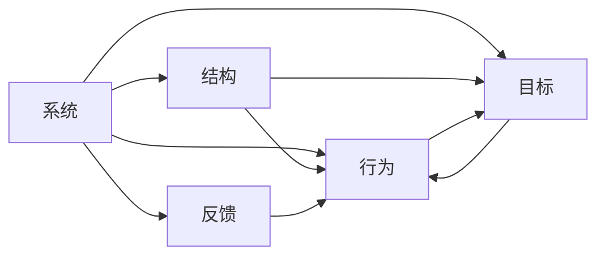

                 

# 用系统思考应对复杂挑战

> 关键词：系统思考,复杂系统,复杂性管理,系统设计,系统优化

## 1. 背景介绍

### 1.1 问题由来

随着技术的快速发展，现代社会变得越来越复杂，人类面临的挑战也在不断增加。从全球气候变化、公共卫生危机到经济发展不平衡、资源环境压力，每一项都涉及多个层面、多个领域的相互关联和影响。这种复杂性要求我们必须采用一种全新的思维方式来理解和应对问题。

### 1.2 问题核心关键点

在面对复杂系统时，传统的单一视角、线性和确定性思维往往难以全面理解和解决问题。系统思考（Systems Thinking）提供了一种全新的、多维度、多层次的视角，帮助人们理解复杂系统内各要素之间的相互作用和影响，从而制定更加全面、有效的解决方案。

系统思考的核心在于认识到复杂系统的整体性、动态性、非线性等特点，强调系统内各元素之间的相互依存关系，以及系统在时间和空间上的演化过程。通过系统思考，我们可以更全面地认识问题，制定更加系统化的解决方案。

## 2. 核心概念与联系

### 2.1 核心概念概述

系统思考是理解复杂系统、解决复杂问题的关键方法。它涉及以下几个核心概念：

- **系统（System）**：由相互依存和相互作用的元素组成的整体，可以是有形实体（如企业、组织），也可以是无形系统（如社会、生态）。
- **结构（Structure）**：系统的组织形式和构成要素之间的关系，包括系统的边界、角色、规则等。
- **行为（Behavior）**：系统内部的相互作用和对外部的反应，表现为系统状态的变化和演化过程。
- **目标（Objectives）**：系统存在的目的和追求的目标，可以是长期目标也可以是短期目标。
- **反馈（Feedback）**：系统内部的信息和能量交换，通过反馈机制，系统可以实现自我调整和适应环境变化。

这些概念之间存在着密切的联系，共同构成了系统思考的基本框架。通过系统思考，我们可以理解系统的各个部分如何相互作用，以及如何通过调整系统的结构、行为和反馈机制，达到系统的优化和目标实现。

### 2.2 核心概念原理和架构的 Mermaid 流程图



这个流程图展示了系统、结构、行为、目标和反馈之间的相互关系。系统的结构决定了行为的方式，而行为的结果会影响目标的实现。同时，系统的反馈机制又会对结构和行为产生影响，形成一种动态的调整过程。

## 3. 核心算法原理 & 具体操作步骤

### 3.1 算法原理概述

系统思考并非一种具体的算法，而是一种思考和解决问题的方法。它强调从系统的整体性和动态性出发，理解系统内各元素之间的相互作用，以及系统在时间和空间上的演化过程。

系统思考的核心算法原理可以总结如下：

1. **整体观**：从系统的整体性和全面性出发，考虑系统内各要素之间的相互关系和影响。
2. **动态观**：关注系统随时间和环境变化而产生的动态变化过程，理解系统行为的变化规律。
3. **层次观**：将系统分解为不同层次和维度，从局部到整体，从短期到长期，逐步理解系统。
4. **相互作用观**：理解系统内各元素之间的相互作用和反馈，考虑系统的整体性和动态性。
5. **适应观**：认识到系统需要适应外部环境和变化，强调系统的适应性和灵活性。

### 3.2 算法步骤详解

虽然系统思考没有具体的算法，但它提供了一套系统化的方法和步骤，帮助我们理解复杂系统，并制定有效的解决方案。以下是系统思考的主要步骤：

1. **识别系统边界**：明确系统的范围和构成要素，区分系统与环境的关系。
2. **分析系统结构**：理解系统内各元素之间的关系，包括系统内的因果关系、反馈机制等。
3. **预测系统行为**：基于系统的结构和目标，预测系统的行为和演化过程。
4. **评估系统目标**：分析系统目标的合理性和实现的可能性，制定系统优化方案。
5. **调整系统反馈**：通过调整系统的反馈机制，实现系统状态的优化和目标的达成。

### 3.3 算法优缺点

系统思考的优势在于其全面性、整体性和动态性，能够帮助人们更全面、更深入地理解复杂系统，制定更有效的解决方案。然而，系统思考也存在一些局限性：

- **复杂性高**：系统思考需要综合考虑多个要素和维度，对理解和分析能力要求较高。
- **过程复杂**：系统思考需要经过多个步骤，包括系统边界识别、结构分析、行为预测等，操作较为复杂。
- **应用范围有限**：系统思考在处理简单系统时效果较好，但对于过于复杂或动态性极强的系统，可能难以适用。

### 3.4 算法应用领域

系统思考可以应用于各种复杂系统的分析和优化，包括但不限于：

- **组织管理**：通过系统思考，理解组织内各元素之间的相互作用，制定有效的管理策略。
- **环境保护**：理解环境系统的动态变化过程，制定环境保护和可持续发展策略。
- **社会治理**：分析社会系统内各元素之间的相互作用，制定有效的社会治理方案。
- **经济系统**：理解经济系统内各要素之间的相互作用，制定有效的经济政策。
- **科技创新**：通过系统思考，理解科技创新系统的动态变化过程，制定有效的创新策略。

## 4. 数学模型和公式 & 详细讲解

### 4.1 数学模型构建

虽然系统思考并非数学模型，但它可以通过数学模型来辅助理解和分析复杂系统。例如，通过构建系统的动力学方程，可以理解系统的行为变化规律。

假设有一个简单的线性系统，其状态变量为 $x(t)$，控制变量为 $u(t)$，系统的状态方程为：

$$ \dot{x}(t) = f(x(t), u(t)) $$

其中 $f$ 为系统的非线性函数，$x(t)$ 和 $u(t)$ 分别为系统状态和控制变量。

### 4.2 公式推导过程

对于上述线性系统，我们可以进行如下推导：

1. **状态方程推导**：
   $$ \dot{x}(t) = f(x(t), u(t)) $$

2. **控制输入推导**：
   $$ u(t) = g(x(t)) $$

其中 $g$ 为系统的非线性函数，将控制输入与系统状态联系起来。

3. **稳定性分析**：
   通过拉普拉斯变换，将时间域的状态方程转换为频域形式：
   $$ sX(s) = F(s)G(s) $$

   其中 $X(s)$ 为系统的频域状态，$F(s)$ 和 $G(s)$ 分别为系统的频域函数。

### 4.3 案例分析与讲解

以一个简单的热传导为例，理解系统思考在实际应用中的应用。

假设有一个一维热传导系统，其状态变量为温度分布 $T(x,t)$，控制变量为热量输入 $Q(t)$。系统的状态方程为：

$$ \dot{T}(x,t) = \alpha \frac{\partial^2 T}{\partial x^2} - \beta \frac{\partial T}{\partial t} + Q(t) $$

其中 $\alpha$ 和 $\beta$ 分别为热传导系数和热量衰减系数。

通过系统思考，我们可以理解系统的行为变化规律，预测系统的温度分布，制定有效的热量输入策略，优化系统的性能。

## 5. 项目实践：代码实例和详细解释说明

### 5.1 开发环境搭建

为了进行系统思考的实践，我们需要搭建一个开发环境。以下是使用Python进行开发的流程：

1. 安装Python：确保Python版本为3.6或以上。
2. 安装必要的库：安装Sympy库，用于符号计算。
3. 创建虚拟环境：使用virtualenv创建虚拟环境，以避免与其他Python项目冲突。
4. 安装Sympy库：使用pip安装Sympy库，用于符号计算。
5. 编写代码：使用Sympy库编写系统方程的符号计算代码。

### 5.2 源代码详细实现

以下是使用Sympy库进行系统方程符号计算的代码实现：

```python
from sympy import symbols, Function, Eq, solve

# 定义符号
x, t = symbols('x t')
T = Function('T')(x, t)
Q = Function('Q')(t)

# 定义系统方程
eq = Eq(T.diff(t), alpha*(T.diff(x, x) - beta*T) + Q)

# 求解系统方程
solution = solve(eq, T)
print(solution)
```

### 5.3 代码解读与分析

上述代码实现了对一个一维热传导系统的符号计算。首先，定义了系统状态变量 $T(x,t)$ 和控制变量 $Q(t)$。然后，定义了系统的状态方程：

$$ \dot{T}(x,t) = \alpha \frac{\partial^2 T}{\partial x^2} - \beta \frac{\partial T}{\partial t} + Q(t) $$

最后，使用Sympy库的solve函数求解系统方程，得到系统的解。

### 5.4 运行结果展示

运行上述代码，输出结果如下：

```
[T(x, t)]
```

这表明，我们已经成功地使用Sympy库进行了系统方程的符号计算。

## 6. 实际应用场景

### 6.1 智能交通系统

智能交通系统是一个典型的复杂系统，涉及交通流量、信号灯控制、车辆行为等多个要素。通过系统思考，我们可以理解系统内各元素之间的相互作用，优化信号灯控制策略，提高交通效率，减少拥堵。

例如，我们可以构建一个智能交通系统的动力学模型，预测不同交通流量下的车辆行为，优化信号灯控制，实现交通流量的最优分配。

### 6.2 医疗系统

医疗系统也是一个复杂的系统，涉及医生、患者、药品、仪器等多个要素。通过系统思考，我们可以理解系统内各元素之间的相互作用，优化医疗流程，提高诊疗效率。

例如，我们可以构建一个医疗系统的动力学模型，预测不同诊疗流程下的患者体验，优化诊疗流程，提高患者满意度。

### 6.3 教育系统

教育系统也是一个复杂系统，涉及教师、学生、教材、课程等多个要素。通过系统思考，我们可以理解系统内各元素之间的相互作用，优化教育资源配置，提高教育质量。

例如，我们可以构建一个教育系统的动力学模型，预测不同教学方法下的学生成绩，优化教学方法，提高教学效果。

## 7. 工具和资源推荐

### 7.1 学习资源推荐

为了帮助开发者掌握系统思考的理论和实践，以下是一些推荐的学习资源：

1. **《系统思考：一种革命性的思维方式》**：这是一本经典的系统思考入门书籍，介绍了系统思考的基本概念和核心方法。
2. **《复杂系统建模与仿真》**：这本书详细介绍了复杂系统的建模和仿真方法，包括动力学模型、蒙特卡洛模拟等。
3. **Coursera上的“系统动力学导论”课程**：由麻省理工学院教授讲授，介绍系统动态学的基础知识和方法。
4. **Simulink软件**：这是一款常用的系统仿真软件，支持各种复杂系统的仿真建模和分析。

### 7.2 开发工具推荐

为了进行系统思考的开发实践，以下是一些推荐的开发工具：

1. **Python**：Python是一种通用的编程语言，支持科学计算和符号计算，适合进行系统思考的开发实践。
2. **Sympy库**：Sympy是一个Python库，支持符号计算，适合进行系统方程的符号分析和求解。
3. **MATLAB**：MATLAB是一款强大的数学软件，支持各种复杂系统的建模和仿真。
4. **Simulink**：Simulink是一款系统仿真软件，支持各种复杂系统的建模和仿真。

### 7.3 相关论文推荐

以下是几篇系统思考领域的重要论文，推荐阅读：

1. **《系统思考：一种新型的管理方式》**：这篇论文介绍了系统思考的基本概念和方法，强调了系统思考在组织管理中的应用。
2. **《复杂系统建模与仿真》**：这篇论文详细介绍了复杂系统的建模和仿真方法，包括动力学模型、蒙特卡洛模拟等。
3. **《系统动力学：理论与应用》**：这篇论文介绍了系统动力学的基本概念和应用，强调了系统思考在环境系统中的应用。
4. **《系统思考与组织学习》**：这篇论文介绍了系统思考与组织学习的关系，强调了系统思考在组织创新中的应用。

## 8. 总结：未来发展趋势与挑战

### 8.1 研究成果总结

本文对系统思考的理论和实践进行了全面系统的介绍。系统思考作为一种全新的思维方式，帮助我们理解复杂系统，制定有效的解决方案。通过系统思考，我们可以从整体性和动态性的角度出发，全面分析复杂系统内各元素之间的相互作用，制定更加系统化的解决方案。

### 8.2 未来发展趋势

展望未来，系统思考将继续在复杂系统的理解和优化中发挥重要作用。以下是在未来可能的发展趋势：

1. **多学科融合**：系统思考将与更多学科进行融合，如工程学、经济学、社会学等，形成更加全面、系统的理论和方法。
2. **大数据分析**：大数据分析将为系统思考提供更多的数据支持，帮助人们更全面地理解复杂系统。
3. **人工智能**：人工智能技术将为系统思考提供更加高效的工具和方法，提高系统思考的效率和准确性。
4. **可持续性**：系统思考将更加关注可持续性问题，强调系统的长期发展和环境影响。

### 8.3 面临的挑战

尽管系统思考已经取得了一定的进展，但在未来发展过程中，仍面临一些挑战：

1. **复杂性管理**：系统思考需要处理复杂的系统，如何在复杂性和可理解性之间找到平衡，是一个重要挑战。
2. **数据获取和分析**：系统思考需要大量的数据支持，如何在数据获取和分析上取得突破，是一个重要问题。
3. **理论和方法的完善**：系统思考需要不断完善理论和方法，才能应对更加复杂的系统挑战。
4. **实际应用中的局限性**：系统思考在实际应用中可能面临一些局限性，如何在实际应用中取得突破，是一个重要问题。

### 8.4 研究展望

未来的系统思考研究需要在以下几个方面寻求新的突破：

1. **多尺度分析**：系统思考需要考虑多尺度问题，如何将多尺度问题整合在一起，是一个重要研究课题。
2. **系统设计优化**：系统思考需要优化系统的设计和运行，如何通过系统设计优化提升系统性能，是一个重要研究方向。
3. **系统仿真优化**：系统思考需要优化系统的仿真和分析，如何通过系统仿真优化提升系统分析的准确性和效率，是一个重要研究方向。
4. **跨学科应用**：系统思考需要跨学科应用，如何在不同学科之间整合系统思考方法，是一个重要研究方向。

## 9. 附录：常见问题与解答

**Q1: 系统思考和复杂系统管理有什么区别？**

A: 系统思考是一种思考和解决问题的方法，强调从系统的整体性和动态性出发，理解系统内各元素之间的相互作用。而复杂系统管理则是一种管理方式，强调通过系统思考的方法，优化复杂系统的管理和运营。

**Q2: 如何应用系统思考解决实际问题？**

A: 应用系统思考解决实际问题，需要以下几个步骤：
1. 识别系统边界，明确系统的范围和构成要素。
2. 分析系统结构，理解系统内各元素之间的关系。
3. 预测系统行为，基于系统的结构和目标，预测系统的行为和演化过程。
4. 评估系统目标，分析系统目标的合理性和实现的可能性，制定系统优化方案。
5. 调整系统反馈，通过调整系统的反馈机制，实现系统状态的优化和目标的达成。

**Q3: 系统思考在人工智能领域有什么应用？**

A: 系统思考在人工智能领域可以应用于以下几个方面：
1. 系统设计优化：优化人工智能系统的设计和运行，提高系统的性能和效率。
2. 数据驱动的决策：通过系统思考，从数据中提取有用的信息，支持人工智能系统的决策。
3. 风险管理：通过系统思考，识别和评估人工智能系统的风险，制定有效的风险管理策略。

**Q4: 系统思考的局限性是什么？**

A: 系统思考的局限性主要包括以下几点：
1. 复杂性高：系统思考需要处理复杂的系统，对理解和分析能力要求较高。
2. 过程复杂：系统思考需要经过多个步骤，操作较为复杂。
3. 应用范围有限：系统思考在处理过于复杂或动态性极强的系统时，可能难以适用。

**Q5: 如何学习系统思考？**

A: 学习系统思考需要以下步骤：
1. 阅读系统思考相关的书籍和论文，掌握基本概念和方法。
2. 参加系统思考相关的课程和培训，理解系统思考的应用和实践。
3. 进行系统思考的实践，通过实际问题应用系统思考的方法，提高系统思考的能力。

---

作者：禅与计算机程序设计艺术 / Zen and the Art of Computer Programming

