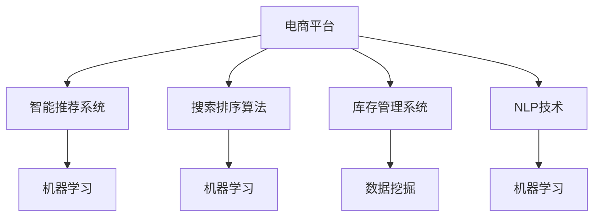

                 

# 电商平台供给能力提升：人工智能技术的应用

> 关键词：电商平台,供给能力,人工智能,智能推荐,搜索排序,自然语言处理,NLP,深度学习,数据挖掘,机器学习

## 1. 背景介绍

### 1.1 问题由来
随着电子商务的迅猛发展，电商平台面临着日益复杂和动态的供给需求。如何高效响应市场变化，保障供应链的稳定，提升顾客满意度和平台竞争力，成为各大电商企业急需解决的重大问题。传统的运营模式主要依赖人工运营和经验积累，效率低下、成本高昂、无法应对突发状况。随着人工智能技术的日渐成熟，利用智能算法优化电商平台供给能力，已逐步成为行业共识。

### 1.2 问题核心关键点
实现电商平台供给能力提升的核心关键点在于：
1. **智能推荐系统**：根据用户历史行为和实时数据，个性化推荐商品，提升用户体验。
2. **搜索排序算法**：利用先进算法，优化商品搜索排序结果，提高搜索效率和转化率。
3. **智能库存管理**：通过预测需求和动态调整库存，平衡供需关系，提升库存周转率。
4. **自然语言处理(NLP)**：处理用户反馈和问题，进行情感分析，优化客户服务。
5. **数据挖掘与机器学习**：挖掘用户行为数据，构建用户画像，进行精准营销和风控管理。

## 2. 核心概念与联系

### 2.1 核心概念概述

为更好地理解人工智能技术在电商平台供给能力提升中的应用，本节将介绍几个关键概念及其相互关系：

- **电商平台(E-commerce Platform)**：提供线上购物、交易、支付等功能的综合性网站或应用。平台运营的核心是供给能力，即商品种类、数量、价格、库存管理等。

- **智能推荐系统(Recommendation System)**：通过分析用户历史行为和兴趣偏好，预测用户可能感兴趣的商品，并实时推荐。利用机器学习和深度学习技术，智能推荐系统能不断优化推荐结果，提升用户体验。

- **搜索排序算法(Search Ranking Algorithm)**：利用自然语言处理技术和机器学习算法，对用户输入的搜索词进行理解和排序，快速匹配相关商品，提升搜索体验。

- **库存管理系统(Inventory Management System)**：通过预测商品需求、动态调整库存，实现供应链优化，避免库存积压或缺货。

- **自然语言处理(Natural Language Processing, NLP)**：处理和理解自然语言文本，进行情感分析、文本分类、实体识别等任务。NLP技术在客户服务、客户反馈处理等方面发挥重要作用。

- **数据挖掘(Data Mining)**：从大量数据中提取有用信息，发现隐藏模式，进行用户画像构建、精准营销、风控管理等。

- **机器学习(Machine Learning)**：基于数据构建模型，进行预测、分类、聚类等任务，广泛应用于推荐系统、搜索排序、库存管理等电商供给能力提升的各个环节。

这些核心概念之间的关系可以通过以下Mermaid流程图来展示：



这个流程图展示出电商平台供给能力提升的各个关键环节，以及它们如何通过人工智能技术相互协作，共同优化平台运营效率。

## 3. 核心算法原理 & 具体操作步骤
### 3.1 算法原理概述

基于人工智能技术提升电商平台供给能力的核心算法原理，主要包括以下几个方面：

1. **智能推荐系统**：基于用户历史行为和实时数据，利用协同过滤、内容推荐、混合推荐等算法，构建个性化推荐模型，实现精准推荐。

2. **搜索排序算法**：利用TF-IDF、BM25、Deep Learning等算法，对用户输入的搜索词进行理解与匹配，优化搜索结果排序。

3. **库存管理系统**：通过时间序列预测、时间关联规则挖掘等算法，预测商品需求，进行动态库存调整。

4. **自然语言处理(NLP)**：利用文本分类、情感分析、实体识别等NLP技术，分析用户反馈，提升客户服务质量。

5. **数据挖掘与机器学习**：通过数据预处理、特征提取、模型训练等步骤，进行用户画像构建、精准营销、风控管理等任务。

### 3.2 算法步骤详解

下面详细介绍每个核心算法的具体操作步骤：

**智能推荐系统**
1. **数据收集**：从电商平台上收集用户行为数据，包括浏览历史、购买记录、评分反馈等。
2. **数据预处理**：对原始数据进行清洗、归一化、特征提取等预处理，构建特征向量。
3. **模型训练**：使用协同过滤、矩阵分解、神经网络等模型，对特征向量进行训练，得到推荐模型。
4. **推荐实现**：将新用户输入或历史用户行为数据，输入推荐模型，获取推荐商品列表。
5. **反馈调整**：根据用户对推荐结果的反馈（点击、购买、评分等），调整推荐模型参数，提升推荐精度。

**搜索排序算法**
1. **数据收集**：收集用户输入的搜索词、商品标题、描述等文本数据。
2. **文本处理**：对文本数据进行分词、去停用词、构建倒排索引等处理。
3. **模型训练**：使用TF-IDF、BM25、深度学习等模型，对处理后的文本数据进行训练，得到搜索排序模型。
4. **排序实现**：将用户输入的搜索词输入排序模型，获取排序后的商品列表。
5. **优化迭代**：根据用户点击行为，不断优化排序模型，提升排序效果。

**库存管理系统**
1. **数据收集**：收集历史销售数据、库存数据、市场动态等。
2. **数据预处理**：对原始数据进行清洗、归一化、特征提取等预处理。
3. **模型训练**：使用时间序列预测、时间关联规则挖掘等模型，对处理后的数据进行训练，得到库存预测模型。
4. **库存调整**：根据预测结果，进行动态库存调整，平衡供需关系。
5. **效果评估**：根据库存调整效果，优化模型参数，提升库存管理效率。

**自然语言处理(NLP)**
1. **数据收集**：收集用户评论、客服聊天记录等文本数据。
2. **文本处理**：对文本数据进行分词、去停用词、情感分析等处理。
3. **模型训练**：使用文本分类、情感分析、实体识别等模型，对处理后的文本数据进行训练，得到情感分析模型。
4. **反馈调整**：根据用户反馈，调整模型参数，提升情感分析精度。
5. **客户服务**：利用训练好的模型，自动分析用户反馈，提供及时有效的客户服务。

**数据挖掘与机器学习**
1. **数据收集**：收集用户行为数据、交易数据、用户画像数据等。
2. **数据预处理**：对原始数据进行清洗、归一化、特征提取等预处理。
3. **模型训练**：使用聚类、分类、回归等机器学习模型，对处理后的数据进行训练，得到用户画像模型。
4. **精准营销**：根据用户画像，进行精准营销活动，提升用户转化率。
5. **风控管理**：利用训练好的模型，进行欺诈检测、风险预警等风控管理。

### 3.3 算法优缺点

这些核心算法在提升电商平台供给能力方面具有以下优点：

- **高效性**：利用机器学习和大数据技术，可以高效处理海量数据，提升运营效率。
- **精准性**：基于用户行为和历史数据，进行个性化推荐和搜索排序，提高用户体验。
- **实时性**：通过实时数据处理和动态调整，能够快速响应市场变化，保障供应链稳定。
- **可扩展性**：算法框架可应用于多种电商场景，具有广泛的适用性。

同时，这些算法也存在以下缺点：

- **高计算成本**：需要大量的计算资源和存储空间，特别是对于大规模深度学习模型。
- **数据隐私问题**：用户数据的使用需要遵循数据隐私法规，保护用户隐私安全。
- **模型复杂性**：部分算法模型复杂度较高，需要专业技术人员进行维护和调优。
- **数据质量依赖**：算法效果依赖于数据质量和处理方式，需要高质量的数据进行训练。

## 4. 数学模型和公式 & 详细讲解 & 举例说明

### 4.1 数学模型构建

为了更好地理解算法原理，本节将使用数学语言对各算法的核心模型进行详细阐述。

**智能推荐系统**
1. **协同过滤模型**：
   - **用户-物品矩阵**：$U \times I$，其中 $U$ 为用户数，$I$ 为物品数。
   - **用户历史行为矩阵**：$U \times N$，其中 $N$ 为用户历史行为数。
   - **模型形式**：
     \[
     P_{i|u} = \frac{\sum_{j=1}^{N} a_{iu} \cdot p_j}{\sqrt{\sum_{j=1}^{N} a_{iu}^2 + \sum_{j=1}^{N} p_j^2}}
     \]
     其中 $p_j$ 为物品 $j$ 的评分，$a_{iu}$ 为用户 $u$ 对物品 $i$ 的评分。

**搜索排序算法**
1. **TF-IDF模型**：
   - **文本表示**：将文本数据表示为向量 $T = (t_1, t_2, ..., t_n)$。
   - **模型形式**：
     \[
     w_i = \frac{tf_i \cdot idf_i}{\sqrt{tf_i + k} \cdot \sqrt{idf_i + k}}
     \]
     其中 $tf_i$ 为单词 $i$ 在文本中的出现次数，$idf_i$ 为单词 $i$ 的逆文档频率。

**库存管理系统**
1. **时间序列预测模型**：
   - **数据形式**：时间序列 $D_t = (D_1, D_2, ..., D_t)$。
   - **模型形式**：
     \[
     \hat{D}_t = \sum_{i=1}^{t} \alpha_i D_{t-i} + \beta_t
     \]
     其中 $\alpha_i$ 为权系数，$\beta_t$ 为常数项。

**自然语言处理(NLP)**
1. **情感分析模型**：
   - **文本表示**：将文本数据表示为向量 $V = (v_1, v_2, ..., v_n)$。
   - **模型形式**：
     \[
     S(V) = \sum_{i=1}^{n} w_i \cdot v_i
     \]
     其中 $w_i$ 为单词 $i$ 的情感权重，$v_i$ 为单词 $i$ 的情感得分。

**数据挖掘与机器学习**
1. **聚类模型**：
   - **数据形式**：用户数据集 $U = (u_1, u_2, ..., u_m)$。
   - **模型形式**：
     \[
     C_k = \sum_{i=1}^{m} \sum_{j=1}^{k} a_{ij} \cdot d_{ij}
     \]
     其中 $C_k$ 为用户聚类中心，$a_{ij}$ 为用户 $i$ 与聚类中心 $j$ 的距离权重，$d_{ij}$ 为用户 $i$ 和聚类中心 $j$ 的距离。

### 4.2 公式推导过程

本节将详细推导智能推荐系统中的协同过滤模型和搜索排序算法中的TF-IDF模型。

**协同过滤模型推导**
假设用户 $u$ 对物品 $i$ 的评分 $r_{iu}$ 满足以下假设：
\[
r_{iu} = \sum_{j=1}^{N} a_{iu} \cdot p_j
\]
其中 $p_j$ 为物品 $j$ 的评分，$a_{iu}$ 为用户 $u$ 对物品 $j$ 的评分。

由高斯分布假设，用户 $u$ 对物品 $i$ 的评分 $r_{iu}$ 服从正态分布：
\[
r_{iu} \sim N(\mu_{iu}, \sigma_{iu}^2)
\]
其中 $\mu_{iu}$ 为均值，$\sigma_{iu}^2$ 为方差。

根据协同过滤模型，预测用户 $u$ 对物品 $i$ 的评分：
\[
\hat{r}_{iu} = \frac{\sum_{j=1}^{N} a_{iu} \cdot p_j}{\sqrt{\sum_{j=1}^{N} a_{iu}^2 + \sum_{j=1}^{N} p_j^2}}
\]

**TF-IDF模型推导**
假设文本 $T$ 中的单词 $i$ 在文本 $j$ 中出现的次数为 $tf_{ij}$，文本 $j$ 的文本长度为 $l_j$。根据TF-IDF模型，单词 $i$ 的权重为：
\[
w_i = \frac{tf_i \cdot idf_i}{\sqrt{tf_i + k} \cdot \sqrt{idf_i + k}}
\]
其中 $tf_i$ 为单词 $i$ 在文本中的出现次数，$idf_i$ 为单词 $i$ 的逆文档频率，$k$ 为常数。

### 4.3 案例分析与讲解

**智能推荐系统案例**
- **场景描述**：某电商平台收集了用户的历史浏览和购买记录，需要根据用户行为推荐可能感兴趣的商品。
- **算法实现**：使用协同过滤算法，构建用户-物品矩阵，利用用户历史行为数据进行训练，得到推荐模型。
- **效果评估**：通过A/B测试，比较推荐前后的转化率和用户满意度，评估推荐模型效果。

**搜索排序算法案例**
- **场景描述**：某电商平台用户输入“运动鞋”搜索词，需要快速获取相关商品列表。
- **算法实现**：使用TF-IDF算法，构建文本索引，对用户输入进行匹配，得到排序后的商品列表。
- **效果评估**：通过实验比较搜索排序前后的用户体验和搜索效果，评估算法效果。

**库存管理系统案例**
- **场景描述**：某电商平台希望优化库存管理，避免商品积压或缺货。
- **算法实现**：使用时间序列预测算法，对历史销售数据进行建模，预测商品需求。
- **效果评估**：通过库存调整和供应链优化，提高库存周转率和用户体验。

**自然语言处理(NLP)案例**
- **场景描述**：某电商平台希望提升客户服务质量，自动分析用户评论和客服聊天记录，进行情感分析和实体识别。
- **算法实现**：使用情感分析算法，构建文本分类模型，对用户评论进行情感分析。使用实体识别算法，对聊天记录进行实体识别。
- **效果评估**：通过客服反馈和用户体验调查，评估NLP模型效果。

**数据挖掘与机器学习案例**
- **场景描述**：某电商平台希望构建用户画像，进行精准营销和风控管理。
- **算法实现**：使用聚类算法，对用户行为数据进行聚类，构建用户画像。利用分类算法，对用户进行分类，进行精准营销和风控管理。
- **效果评估**：通过精准营销活动的ROI和风控管理效果，评估模型效果。

## 5. 项目实践：代码实例和详细解释说明

### 5.1 开发环境搭建

在进行项目实践前，我们需要准备好开发环境。以下是使用Python进行TensorFlow和PyTorch开发的环境配置流程：

1. 安装Anaconda：从官网下载并安装Anaconda，用于创建独立的Python环境。

2. 创建并激活虚拟环境：
```bash
conda create -n tf-env python=3.8 
conda activate tf-env
```

3. 安装TensorFlow：根据CUDA版本，从官网获取对应的安装命令。例如：
```bash
conda install tensorflow=2.7 -c tf
```

4. 安装PyTorch：根据CUDA版本，从官网获取对应的安装命令。例如：
```bash
conda install pytorch torchvision torchaudio cudatoolkit=11.1 -c pytorch -c conda-forge
```

5. 安装各类工具包：
```bash
pip install numpy pandas scikit-learn matplotlib tqdm jupyter notebook ipython
```

完成上述步骤后，即可在`tf-env`环境中开始项目实践。

### 5.2 源代码详细实现

这里我们以推荐系统中的协同过滤算法为例，给出使用TensorFlow和PyTorch实现推荐系统的代码。

使用TensorFlow实现协同过滤算法：

```python
import tensorflow as tf
from tensorflow.keras.layers import Input, Embedding, Dot, Activation

# 用户-物品矩阵
U = tf.keras.layers.Input(shape=(num_users,), dtype=tf.float32)
I = tf.keras.layers.Input(shape=(num_items,), dtype=tf.float32)

# 用户历史行为矩阵
R = tf.keras.layers.Dot(axes=(1, 0), normalize=True)([U, I])
R = tf.keras.layers.Activation('sigmoid')(R)

# 推荐结果
P = tf.keras.layers.Dense(1, activation='sigmoid')(R)

# 模型编译
model = tf.keras.Model(inputs=[U, I], outputs=P)

# 编译模型
model.compile(optimizer='adam', loss='binary_crossentropy', metrics=['accuracy'])

# 训练模型
model.fit([user_data, item_data], ratings, epochs=num_epochs, batch_size=batch_size)
```

使用PyTorch实现协同过滤算法：

```python
import torch
import torch.nn as nn
from torch.utils.data import DataLoader, Dataset

# 定义数据集类
class RecommendationDataset(Dataset):
    def __init__(self, data):
        self.data = data
        
    def __len__(self):
        return len(self.data)
    
    def __getitem__(self, item):
        return self.data[item]

# 定义模型类
class RecommendationModel(nn.Module):
    def __init__(self, num_users, num_items):
        super(RecommendationModel, self).__init__()
        self.user_embedding = nn.Embedding(num_users, embedding_dim)
        self.item_embedding = nn.Embedding(num_items, embedding_dim)
        self.dot_product = nn.Linear(embedding_dim * 2, 1)
        self.sigmoid = nn.Sigmoid()
        
    def forward(self, user_ids, item_ids):
        user_embeddings = self.user_embedding(user_ids)
        item_embeddings = self.item_embedding(item_ids)
        dot_product = self.dot_product(torch.cat((user_embeddings, item_embeddings), dim=1))
        return self.sigmoid(dot_product)

# 训练模型
num_epochs = 10
batch_size = 64
model = RecommendationModel(num_users, num_items)
optimizer = torch.optim.Adam(model.parameters(), lr=0.001)

for epoch in range(num_epochs):
    for user_ids, item_ids, ratings in train_loader:
        optimizer.zero_grad()
        predictions = model(user_ids, item_ids)
        loss = torch.mean((predictions - ratings) ** 2)
        loss.backward()
        optimizer.step()
```

### 5.3 代码解读与分析

让我们再详细解读一下关键代码的实现细节：

**TensorFlow代码**
- `Input`层：定义输入层，用于输入用户和物品的向量表示。
- `Dot`层：计算用户和物品的向量点积，得到评分预测。
- `Activation`层：对预测结果进行sigmoid激活，得到0-1之间的推荐评分。
- `Model`层：定义整个模型，连接输入和输出层。
- `compile`方法：编译模型，指定优化器和损失函数。
- `fit`方法：训练模型，使用用户数据和物品数据进行训练，得到评分预测。

**PyTorch代码**
- `RecommendationDataset`类：定义数据集，用于存储推荐系统训练数据。
- `RecommendationModel`类：定义推荐模型，包括用户嵌入层、物品嵌入层、点积层和激活层。
- `forward`方法：定义前向传播过程，计算预测评分。
- `RecommendationDataset`类：定义数据集，用于存储推荐系统训练数据。
- `train_loader`：定义数据加载器，用于批量读取训练数据。
- `for`循环：训练模型，使用Adam优化器进行参数更新。

通过上述代码实现，可以看到TensorFlow和PyTorch在实现协同过滤算法方面的简洁高效。开发者可以根据具体需求，选择适合自己的框架进行实现。

### 5.4 运行结果展示

运行上述代码，得到推荐模型后，可以通过以下方式评估其效果：

- **准确率**：计算模型预测结果与真实评分之间的均方误差，评估预测准确度。
- **召回率**：计算模型预测出正例的百分比，评估推荐效果。
- **AUC值**：计算模型在不同评分下的ROC曲线下的面积，评估模型性能。

## 6. 实际应用场景

### 6.1 智能推荐系统

智能推荐系统是电商平台中应用最广泛的AI技术之一。通过智能推荐，电商平台能够提升用户体验，增加销售额。

在技术实现上，可以采用协同过滤、内容推荐、混合推荐等多种算法，结合用户历史行为数据和实时数据，生成个性化推荐列表。例如，某电商平台在用户浏览商品时，根据其历史行为和实时浏览行为，生成个性化的推荐商品，提升用户粘性和购买率。

### 6.2 搜索排序算法

搜索排序算法能够优化商品搜索结果，提升用户体验和搜索效率。通过自然语言处理和机器学习算法，电商平台能够对用户输入的搜索词进行快速理解与匹配，展示最相关的商品列表。

在技术实现上，可以采用TF-IDF、BM25、深度学习等算法，构建文本索引，对用户输入进行匹配和排序。例如，某电商平台用户在搜索“运动鞋”时，系统能够快速展示最相关的运动鞋商品列表，提升搜索效率和用户体验。

### 6.3 库存管理系统

库存管理系统能够优化供应链管理，减少库存积压或缺货。通过预测商品需求和动态调整库存，电商平台能够平衡供需关系，提升库存周转率。

在技术实现上，可以采用时间序列预测和时间关联规则挖掘等算法，构建库存预测模型。例如，某电商平台根据历史销售数据和市场动态，预测未来商品需求，动态调整库存，避免库存积压或缺货，提升供应链效率。

### 6.4 客户服务系统

客户服务系统是电商平台客户体验的重要组成部分。通过自然语言处理(NLP)技术，电商平台能够自动分析用户反馈和客服聊天记录，提升客户服务质量。

在技术实现上，可以采用情感分析、实体识别等NLP技术，构建情感分析模型和实体识别模型。例如，某电商平台利用情感分析模型，自动分析用户评论，识别出用户的不满情绪，进行及时响应和处理，提升客户满意度。

## 7. 工具和资源推荐

### 7.1 学习资源推荐

为了帮助开发者系统掌握人工智能技术在电商平台中的应用，这里推荐一些优质的学习资源：

1. **《深度学习》书籍**：由机器学习专家Ian Goodfellow等编写，系统介绍了深度学习的原理和应用，包括推荐系统、搜索排序、NLP等。

2. **CS231n《深度学习课程》**：斯坦福大学开设的计算机视觉课程，结合推荐系统等内容，适合深度学习入门。

3. **TensorFlow官方文档**：TensorFlow官方提供的详细文档和示例代码，帮助开发者快速上手TensorFlow框架。

4. **PyTorch官方文档**：PyTorch官方提供的详细文档和示例代码，帮助开发者快速上手PyTorch框架。

5. **Recommender Systems in Python**：通过Python实现推荐系统的书籍，提供大量实际案例和代码示例。

6. **Natural Language Processing with Python**：利用Python实现NLP的书籍，涵盖情感分析、实体识别等内容。

通过这些资源的学习实践，相信你一定能够快速掌握人工智能技术在电商平台中的应用，并用于解决实际的商业问题。

### 7.2 开发工具推荐

高效的开发离不开优秀的工具支持。以下是几款用于电商平台AI开发的工具：

1. **TensorFlow**：由Google主导开发的开源深度学习框架，生产部署方便，适合大规模工程应用。

2. **PyTorch**：由Facebook主导开发的开源深度学习框架，灵活高效，适合研究和实验。

3. **Jupyter Notebook**：交互式编程环境，方便开发者进行快速实验和数据可视化。

4. **Weights & Biases**：模型训练的实验跟踪工具，可以记录和可视化模型训练过程中的各项指标，方便对比和调优。

5. **Google Colab**：谷歌提供的免费Jupyter Notebook环境，支持GPU/TPU算力，方便开发者快速上手实验最新模型。

合理利用这些工具，可以显著提升电商平台AI应用的开发效率，加快创新迭代的步伐。

### 7.3 相关论文推荐

电商平台AI技术的发展离不开学界的持续研究。以下是几篇奠基性的相关论文，推荐阅读：

1. **A Survey of Collaborative Filtering Techniques**：系统综述协同过滤算法的优缺点和应用场景，为推荐系统设计提供参考。

2. **Deep Textual Matching for E-commerce Search**：提出基于深度学习的文本匹配算法，提升电商搜索排序效果。

3. **Predictive Customer Search and Recommendation in E-commerce**：基于预测模型，提升电商搜索和推荐效果。

4. **E-commerce Product Recommendation Using Deep Learning**：通过深度学习模型，提升电商推荐系统的性能。

5. **E-commerce Search Engine Optimization**：提出优化电商搜索系统的策略，提升搜索效果。

6. **Sentiment Analysis for E-commerce**：利用情感分析技术，提升电商客户服务质量。

这些论文代表了大语言模型微调技术的发展脉络。通过学习这些前沿成果，可以帮助研究者把握学科前进方向，激发更多的创新灵感。

## 8. 总结：未来发展趋势与挑战

### 8.1 总结

本文对人工智能技术在电商平台供给能力提升中的应用进行了全面系统的介绍。首先阐述了电商平台的运营背景和AI技术的应用场景，明确了智能推荐系统、搜索排序算法、库存管理系统、NLP技术和数据挖掘等核心概念。其次，从原理到实践，详细讲解了各算法的核心步骤，给出了推荐系统、搜索排序、库存管理、客户服务等项目的代码实现。最后，探讨了AI技术在电商平台的实际应用场景，推荐了学习资源和工具。

通过本文的系统梳理，可以看到，人工智能技术在电商平台中的应用潜力巨大，能够显著提升平台运营效率和用户体验。未来，随着AI技术的不断发展，电商平台的AI应用将更加广泛和深入，为电商行业带来新的变革。

### 8.2 未来发展趋势

展望未来，电商平台AI技术将呈现以下几个发展趋势：

1. **多模态融合**：未来电商平台的AI系统将融合多种模态数据，如文本、图像、视频等，提升商品推荐和搜索效果。

2. **实时智能推荐**：通过实时数据分析和模型训练，电商平台能够实现动态推荐，提升用户体验和转化率。

3. **跨平台协同**：电商平台将实现跨平台、跨设备的数据共享和协同推荐，提升用户粘性和平台竞争力。

4. **个性化服务**：基于用户画像和行为数据，电商平台将提供更个性化的服务，提升用户满意度和忠诚度。

5. **AI伦理和安全**：电商平台将加强AI伦理和安全研究，确保AI应用的透明性和可解释性，保障用户隐私安全。

这些趋势凸显了电商平台AI技术的广阔前景。这些方向的探索发展，必将进一步提升电商平台AI应用的深度和广度，推动电商行业向智能化、个性化方向迈进。

### 8.3 面临的挑战

尽管电商平台AI技术已经取得了显著成就，但在迈向更加智能化、普适化应用的过程中，它仍面临着诸多挑战：

1. **数据隐私问题**：用户数据的收集和使用需要遵循数据隐私法规，保护用户隐私安全。

2. **算法复杂性**：部分AI算法模型复杂度较高，需要专业技术人员进行维护和调优。

3. **模型鲁棒性**：AI系统在应对数据波动和噪声时，容易出现误判和误推荐，需要进一步提高模型的鲁棒性。

4. **计算成本**：AI系统的开发和运行需要大量的计算资源，需要优化算力和存储。

5. **用户理解**：AI系统的复杂性和黑盒特性，需要用户理解和使用，提高系统的可解释性和易用性。

6. **跨领域应用**：AI技术在不同领域的适应性需要进一步验证，确保系统在不同场景下都能稳定运行。

这些挑战需要电商平台和技术开发者共同努力，通过技术创新和伦理监管，不断提升AI系统的安全性和可靠性。

### 8.4 研究展望

未来电商平台AI技术的研究展望主要包括以下几个方面：

1. **多领域数据融合**：将电商平台的AI系统与其他行业的数据进行融合，提升系统的应用范围和效果。

2. **隐私保护技术**：采用差分隐私、联邦学习等技术，保护用户数据隐私，提高系统的安全性。

3. **解释性AI**：发展可解释AI技术，提高模型的可解释性和透明性，帮助用户理解系统决策过程。

4. **自动化调优**：开发自动调优技术，优化AI系统模型参数，提高系统性能。

5. **跨平台协同**：实现跨平台、跨设备的数据共享和协同推荐，提升用户粘性和平台竞争力。

6. **多模态智能推荐**：将AI系统应用于多模态数据，提升推荐效果和用户体验。

这些研究方向将引领电商平台AI技术的进一步发展，为电商行业带来更多的智能化应用和服务。

## 9. 附录：常见问题与解答

**Q1：电商平台AI系统如何处理海量数据？**

A: 电商平台AI系统处理海量数据的方法包括：
1. **数据清洗和预处理**：去除噪声和异常数据，进行数据归一化和特征提取。
2. **分布式计算**：采用分布式计算框架，如Apache Spark，并行处理大规模数据。
3. **增量学习**：采用增量学习算法，实时更新模型参数，避免重新训练全模型。
4. **模型压缩**：采用模型压缩技术，如剪枝、量化、模型蒸馏等，减少模型大小和计算量。

**Q2：电商平台AI系统如何提升搜索排序效果？**

A: 电商平台AI系统提升搜索排序效果的方法包括：
1. **深度学习模型**：采用基于深度学习的模型，如BERT、XLNet等，提升文本匹配效果。
2. **个性化推荐**：结合用户历史行为和实时数据，进行个性化推荐，提高搜索效果。
3. **语义理解**：利用NLP技术，理解用户输入的搜索词，进行语义匹配。
4. **上下文信息**：结合商品上下文信息，提升搜索排序效果。

**Q3：电商平台AI系统如何优化库存管理？**

A: 电商平台AI系统优化库存管理的方法包括：
1. **时间序列预测**：采用时间序列预测算法，预测商品需求，动态调整库存。
2. **需求分析**：结合市场动态和用户反馈，进行需求分析，优化库存管理。
3. **智能补货**：采用智能补货算法，避免库存积压或缺货，提升供应链效率。

**Q4：电商平台AI系统如何提升客户服务质量？**

A: 电商平台AI系统提升客户服务质量的方法包括：
1. **NLP技术**：利用NLP技术，进行文本分类、情感分析、实体识别等任务，提升客户服务质量。
2. **智能客服**：结合AI技术和人工客服，提供智能客服服务，提高客户满意度。
3. **反馈分析**：利用情感分析模型，自动分析用户反馈，进行及时响应和处理。

**Q5：电商平台AI系统面临哪些伦理和安全问题？**

A: 电商平台AI系统面临的伦理和安全问题包括：
1. **数据隐私**：用户数据的收集和使用需要遵循数据隐私法规，保护用户隐私安全。
2. **算法公平性**：确保AI系统的公平性和无偏见，避免歧视性决策。
3. **用户隐私保护**：采用差分隐私、联邦学习等技术，保护用户数据隐私。
4. **系统透明度**：提高系统的可解释性和透明性，帮助用户理解系统决策过程。
5. **安全性**：确保系统的安全性，避免恶意攻击和数据泄露。

通过以上常见问题的解答，希望能帮助你更好地理解和应用人工智能技术在电商平台中的应用。

---

作者：禅与计算机程序设计艺术 / Zen and the Art of Computer Programming

