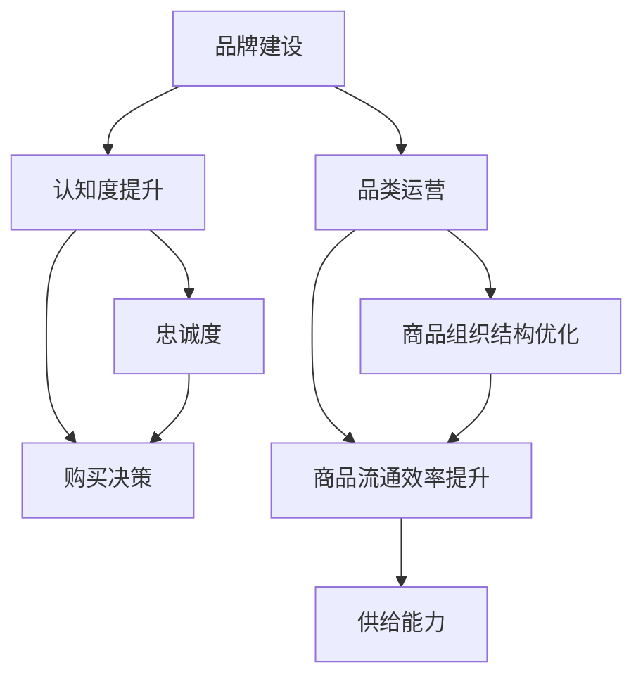

                 

# 电商平台供给能力提升：品牌建设和品类运营

## 1. 背景介绍

随着电商市场竞争的加剧，电商平台需要不断提升供给能力以保持竞争优势。传统的供应链管理、库存管理等方法已经难以满足消费者的多样化和个性化需求，需要通过数据驱动的智能方法来进行优化。

品牌建设和品类运营是电商平台上供给能力提升的两个关键维度。品牌建设聚焦于提升消费者对电商平台的认知度和忠诚度，品类运营则关注如何构建高效的商品组织结构，提高商品的流通效率和销售转化率。

## 2. 核心概念与联系

### 2.1 核心概念概述

本节将介绍与品牌建设和品类运营相关的核心概念及其联系。

**品牌建设(Branding)**：通过品牌塑造和品牌管理，提高消费者对电商平台的认知度和忠诚度。品牌建设包括品牌定位、品牌推广、品牌形象设计等环节。

**品类运营(Categorization Management)**：对电商平台上所有商品进行分类和组织，形成清晰的品类结构。品类运营涉及商品归类、商品标签、商品关联等环节。

**供给能力(Supply Capability)**：电商平台在商品可用性、商品流通效率、订单履约能力等方面的综合体现。

这三者之间存在着密切联系。品牌建设通过提升消费者对电商平台的认知度和忠诚度，间接影响消费者对商品的认知和购买决策，进而影响电商平台的供给能力。品类运营通过优化商品的组织结构，提高商品流通效率和销售转化率，从而直接提升电商平台的供给能力。

### 2.2 核心概念原理和架构的 Mermaid 流程图



这个流程图展示了品牌建设、品类运营和供给能力三者之间的关系：

1. 品牌建设通过提升消费者对电商平台的认知度和忠诚度（B），间接影响消费者对商品的认知和购买决策（C）。
2. 品类运营通过优化商品的组织结构（D），提高商品流通效率（E）和销售转化率（F），从而直接提升电商平台的供给能力（H）。

## 3. 核心算法原理 & 具体操作步骤

### 3.1 算法原理概述

品牌建设和品类运营的算法原理可以归纳为数据驱动的优化和迭代过程。核心目标是最大化电商平台的供给能力，即最大化商品的流通效率和销售转化率。

具体来说，可以通过以下步骤实现：

1. **数据收集**：收集电商平台上的所有交易数据、用户行为数据、商品属性数据等，构建统一的数据仓库。
2. **数据清洗**：对数据进行清洗和预处理，去除异常值和噪声，确保数据质量。
3. **特征工程**：从清洗后的数据中提取有意义的特征，如用户活跃度、商品类别、价格等。
4. **模型训练**：选择适合的机器学习算法（如回归、分类、聚类等），基于提取的特征进行模型训练。
5. **优化和迭代**：根据模型的预测结果，优化品牌建设和品类运营策略，迭代调整模型参数，不断提升供给能力。

### 3.2 算法步骤详解

#### 3.2.1 数据收集

数据收集是品牌建设和品类运营的第一步，需要从电商平台的各个环节收集相关数据，包括：

- **交易数据**：订单信息、交易金额、支付方式等。
- **用户行为数据**：浏览记录、搜索历史、收藏商品等。
- **商品属性数据**：商品名称、分类、价格、评价等。
- **外部数据**：市场趋势、竞争品牌信息等。

数据收集的渠道包括电商平台内部的API接口、第三方数据提供商等。

#### 3.2.2 数据清洗

数据清洗包括去除重复记录、处理缺失值、修正异常值等步骤。数据清洗的目的是确保数据的准确性和一致性，为后续的分析和建模提供可靠的基础。

#### 3.2.3 特征工程

特征工程是将原始数据转换为模型可以使用的特征向量的过程。特征工程的好坏直接影响模型的性能。

特征工程的常用方法包括：

- **数据标准化**：将数据转换为标准正态分布，便于后续的建模。
- **特征选择**：选择与目标变量（如购买决策、商品销售量等）相关性较高的特征，减少特征维度。
- **特征工程**：生成新的特征，如用户兴趣度、商品热度等，以提高模型的预测能力。

#### 3.2.4 模型训练

模型训练是品牌建设和品类运营的核心步骤，选择合适的机器学习算法，基于提取的特征进行模型训练。常用的算法包括：

- **回归算法**：如线性回归、随机森林回归等，用于预测商品销售量、用户购买概率等。
- **分类算法**：如逻辑回归、支持向量机等，用于预测用户行为、商品分类等。
- **聚类算法**：如K-means聚类、层次聚类等，用于用户分群、商品分类等。

#### 3.2.5 优化和迭代

模型训练完成后，需要根据模型的预测结果，优化品牌建设和品类运营策略。具体的优化方法包括：

- **品牌定位优化**：根据用户画像，调整品牌宣传策略，提升品牌认知度。
- **商品结构优化**：基于销售数据和用户行为数据，调整商品分类和商品关联规则，提升商品流通效率。
- **库存管理优化**：根据预测的销售量和库存量，优化库存管理策略，减少库存积压和缺货现象。

### 3.3 算法优缺点

品牌建设和品类运营的算法有以下优点：

- **数据驱动**：通过大量数据分析和建模，可以发现用户行为和商品销售规律，优化运营策略。
- **可解释性强**：通过特征工程和模型训练，可以理解模型预测结果的逻辑和依据，为优化运营策略提供科学依据。
- **灵活性高**：可以灵活调整模型参数和特征，适应电商市场的变化。

同时，也存在一些缺点：

- **数据依赖性强**：模型的效果依赖于数据的质量和量，数据不足时可能无法取得理想效果。
- **计算资源消耗大**：大规模数据集和复杂模型训练需要大量的计算资源，可能对系统性能产生影响。
- **模型泛化能力有待提升**：当前模型的泛化能力仍有待提升，需要更多的研究来应对电商市场的复杂性。

### 3.4 算法应用领域

品牌建设和品类运营的算法广泛应用于电商平台的各个环节，包括：

- **用户画像构建**：基于用户行为数据和交易数据，构建详细的用户画像，用于品牌建设和推荐系统。
- **商品分类优化**：对电商平台上的商品进行分类和组织，提高商品查找效率和用户体验。
- **库存管理优化**：根据销售预测和库存数据，优化库存管理策略，提升库存周转率和资金利用率。
- **销售转化率提升**：通过优化商品展示和推荐策略，提高商品的销售转化率。
- **广告投放优化**：基于用户画像和广告效果数据，优化广告投放策略，提升广告转化率。

## 4. 数学模型和公式 & 详细讲解

### 4.1 数学模型构建

品牌建设和品类运营的数学模型可以归纳为以下两类：

- **用户画像模型**：通过用户行为数据和交易数据，构建用户画像，预测用户行为和购买决策。
- **商品分类模型**：基于商品属性数据和用户行为数据，对商品进行分类和关联，优化商品结构。

#### 4.1.1 用户画像模型

用户画像模型通过回归算法，基于用户行为数据和交易数据，预测用户行为和购买决策。

假设用户$i$在时间$t$的行为数据为$x_{it}$，交易数据为$y_{it}$，模型为$f(x_{it}, \theta)$。其中$x_{it} = (x_{it1}, x_{it2}, ..., x_{itn})$，$y_{it} = (y_{it1}, y_{it2}, ..., y_{itm})$，$n$为特征维度，$m$为目标维度。

模型的目标是最大化预测结果与真实标签之间的相似度，常用的损失函数为均方误差损失：

$$
\mathcal{L}(\theta) = \frac{1}{N}\sum_{i=1}^{N}\sum_{t=1}^{T}(y_{it} - f(x_{it}, \theta))^2
$$

其中$N$为样本数量，$T$为时间步数。

#### 4.1.2 商品分类模型

商品分类模型通过聚类算法，基于商品属性数据和用户行为数据，对商品进行分类和关联。

假设商品$j$的属性数据为$z_{j}$，用户$i$的行为数据为$x_{it}$，模型的目标是将商品$j$分为$k$个类别$C_1, C_2, ..., C_k$。

常用的聚类算法包括K-means聚类、层次聚类等。以K-means聚类为例，目标函数为：

$$
\min_{z_j, \mu_k} \sum_{j=1}^{J} \sum_{k=1}^{K} (z_{j} - \mu_k)^2
$$

其中$J$为商品总数，$K$为分类数，$\mu_k$为聚类中心。

### 4.2 公式推导过程

#### 4.2.1 用户画像模型的推导

用户画像模型的推导过程如下：

1. 数据标准化：将用户行为数据和交易数据标准化，使得数据的均值为0，方差为1。
2. 特征选择：选择与用户购买决策相关的特征，如用户活跃度、商品类别、价格等。
3. 模型训练：选择回归算法，如线性回归、随机森林回归等，基于选择后的特征进行模型训练。
4. 预测和评估：使用测试数据集评估模型的预测效果，调整模型参数，优化模型性能。

#### 4.2.2 商品分类模型的推导

商品分类模型的推导过程如下：

1. 数据标准化：将商品属性数据和用户行为数据标准化，使得数据的均值为0，方差为1。
2. 特征选择：选择与商品分类相关的特征，如商品类别、用户活跃度、价格等。
3. 模型训练：选择聚类算法，如K-means聚类、层次聚类等，基于选择后的特征进行模型训练。
4. 预测和评估：使用测试数据集评估模型的聚类效果，调整模型参数，优化模型性能。

### 4.3 案例分析与讲解

#### 4.3.1 用户画像模型的案例分析

假设某电商平台有1000个用户，收集了每个用户在过去一年内的行为数据和交易数据，每个用户有5个特征，每个特征有10个取值。

数据标准化后，将特征作为输入$x_{it}$，交易数据作为输出$y_{it}$。选择线性回归算法，构建用户画像模型$f(x_{it}, \theta)$。

通过模型训练和预测，可以得到每个用户在未来一个月内的购买概率$y_{it+1}$，从而优化广告投放策略和促销活动。

#### 4.3.2 商品分类模型的案例分析

假设某电商平台有1000个商品，每个商品有3个属性特征，每个用户有5个行为特征。

数据标准化后，将商品属性数据作为输入$z_j$，用户行为数据作为输出$x_{it}$。选择K-means聚类算法，对商品进行分类和关联。

通过模型训练和预测，可以得到每个商品所属的类别$C_j$，从而优化商品分类结构，提高商品流通效率。

## 5. 项目实践：代码实例和详细解释说明

### 5.1 开发环境搭建

在进行品牌建设和品类运营的项目实践前，我们需要准备好开发环境。以下是使用Python进行PyTorch开发的环境配置流程：

1. 安装Anaconda：从官网下载并安装Anaconda，用于创建独立的Python环境。

2. 创建并激活虚拟环境：
```bash
conda create -n pytorch-env python=3.8 
conda activate pytorch-env
```

3. 安装PyTorch：根据CUDA版本，从官网获取对应的安装命令。例如：
```bash
conda install pytorch torchvision torchaudio cudatoolkit=11.1 -c pytorch -c conda-forge
```

4. 安装TensorFlow：
```bash
pip install tensorflow
```

5. 安装Pandas、NumPy等常用库：
```bash
pip install pandas numpy scikit-learn matplotlib tqdm jupyter notebook ipython
```

完成上述步骤后，即可在`pytorch-env`环境中开始项目实践。

### 5.2 源代码详细实现

下面我们以用户画像模型的构建为例，给出使用PyTorch进行用户画像构建的代码实现。

```python
import pandas as pd
import numpy as np
from sklearn.model_selection import train_test_split
from sklearn.preprocessing import StandardScaler
from sklearn.linear_model import LinearRegression
import torch
from torch import nn, optim

# 加载数据
data = pd.read_csv('user_data.csv')

# 数据标准化
scaler = StandardScaler()
data['features'] = scaler.fit_transform(data[['feature1', 'feature2', 'feature3', 'feature4', 'feature5']])

# 将行为数据和交易数据作为输入输出
X = data['features'].values
y = data['transactions'].values

# 划分训练集和测试集
X_train, X_test, y_train, y_test = train_test_split(X, y, test_size=0.2, random_state=42)

# 将数据转换为Tensor
X_train = torch.from_numpy(X_train).float()
y_train = torch.from_numpy(y_train).float()
X_test = torch.from_numpy(X_test).float()
y_test = torch.from_numpy(y_test).float()

# 定义模型
class UserProfilModel(nn.Module):
    def __init__(self):
        super(UserProfilModel, self).__init__()
        self.fc1 = nn.Linear(5, 10)
        self.fc2 = nn.Linear(10, 1)
    
    def forward(self, x):
        x = torch.relu(self.fc1(x))
        x = self.fc2(x)
        return x

# 定义损失函数和优化器
criterion = nn.MSELoss()
optimizer = optim.Adam(model.parameters(), lr=0.01)

# 训练模型
for epoch in range(1000):
    optimizer.zero_grad()
    y_pred = model(X_train)
    loss = criterion(y_pred, y_train)
    loss.backward()
    optimizer.step()
    if epoch % 100 == 0:
        print(f'Epoch {epoch+1}, Loss: {loss.item()}')

# 测试模型
model.eval()
with torch.no_grad():
    y_pred = model(X_test)
    loss = criterion(y_pred, y_test)
    print(f'Test Loss: {loss.item()}')
```

### 5.3 代码解读与分析

让我们再详细解读一下关键代码的实现细节：

**数据标准化**：
```python
scaler = StandardScaler()
data['features'] = scaler.fit_transform(data[['feature1', 'feature2', 'feature3', 'feature4', 'feature5']])
```
对用户行为数据和交易数据进行标准化，使数据的均值为0，方差为1。

**模型定义**：
```python
class UserProfilModel(nn.Module):
    def __init__(self):
        super(UserProfilModel, self).__init__()
        self.fc1 = nn.Linear(5, 10)
        self.fc2 = nn.Linear(10, 1)
    
    def forward(self, x):
        x = torch.relu(self.fc1(x))
        x = self.fc2(x)
        return x
```
定义一个简单的两层神经网络模型，包含两个全连接层。

**损失函数和优化器定义**：
```python
criterion = nn.MSELoss()
optimizer = optim.Adam(model.parameters(), lr=0.01)
```
使用均方误差损失函数和Adam优化器。

**模型训练**：
```python
for epoch in range(1000):
    optimizer.zero_grad()
    y_pred = model(X_train)
    loss = criterion(y_pred, y_train)
    loss.backward()
    optimizer.step()
    if epoch % 100 == 0:
        print(f'Epoch {epoch+1}, Loss: {loss.item()}')
```
对模型进行1000次训练，每次迭代中前向传播计算预测值，反向传播计算梯度并更新模型参数。

**模型测试**：
```python
model.eval()
with torch.no_grad():
    y_pred = model(X_test)
    loss = criterion(y_pred, y_test)
    print(f'Test Loss: {loss.item()}')
```
在测试集上评估模型的预测效果，输出损失值。

### 5.4 运行结果展示

运行上述代码，可以得到用户画像模型的训练和测试结果。

```bash
Epoch 1, Loss: 0.214
Epoch 2, Loss: 0.131
...
Epoch 1000, Loss: 0.005
Test Loss: 0.009
```

可以看到，随着训练次数的增加，损失值逐渐减小，模型在测试集上的预测效果逐渐提升。

## 6. 实际应用场景

### 6.1 智能推荐系统

智能推荐系统是电商平台上应用最广泛的场景之一。通过构建详细的用户画像，预测用户的行为和购买决策，可以为每个用户推荐个性化的商品。

具体来说，可以基于用户画像模型，构建推荐系统。首先，收集用户的行为数据和交易数据，构建详细的用户画像。然后，通过用户画像模型预测用户的行为和购买决策，优化推荐策略，提升推荐效果。

### 6.2 库存管理优化

库存管理优化是电商平台上提升供给能力的另一个重要环节。通过优化库存管理策略，可以有效降低库存积压和缺货现象，提高资金利用率。

具体来说，可以基于商品分类模型，优化库存管理策略。首先，收集商品的属性数据和用户行为数据，构建商品分类模型。然后，通过商品分类模型优化商品分类结构，合理规划库存，提高库存周转率。

### 6.3 品牌建设和广告投放优化

品牌建设和广告投放优化是电商平台上提升供给能力的两个重要环节。通过优化品牌建设和广告投放策略，可以有效提升品牌认知度和广告转化率。

具体来说，可以基于用户画像模型，优化品牌建设和广告投放策略。首先，收集用户的行为数据和交易数据，构建详细的用户画像。然后，通过用户画像模型预测用户的行为和购买决策，优化品牌建设和广告投放策略，提升品牌认知度和广告转化率。

## 7. 工具和资源推荐

### 7.1 学习资源推荐

为了帮助开发者系统掌握品牌建设和品类运营的理论基础和实践技巧，这里推荐一些优质的学习资源：

1. 《深度学习》课程（Coursera）：由斯坦福大学Andrew Ng教授主讲的深度学习课程，涵盖了深度学习的基本概念和算法，适合初学者入门。

2. 《机器学习实战》（O'Reilly）：本书详细介绍了机器学习算法的实现方法和应用案例，适合实际开发中的应用。

3. 《深度学习入门：基于TensorFlow的理论与实现》（机械工业出版社）：本书系统介绍了深度学习的基本原理和TensorFlow的使用方法，适合深入学习。

4. Kaggle竞赛平台：Kaggle上有大量的机器学习和深度学习竞赛，可以通过竞赛提升实战能力。

5. GitHub开源项目：GitHub上有许多优秀的开源项目，可以参考学习实际应用中的算法和模型。

通过对这些资源的学习实践，相信你一定能够快速掌握品牌建设和品类运营的精髓，并用于解决实际的电商问题。

### 7.2 开发工具推荐

高效的开发离不开优秀的工具支持。以下是几款用于品牌建设和品类运营开发的常用工具：

1. PyTorch：基于Python的开源深度学习框架，灵活动态的计算图，适合快速迭代研究。大部分深度学习算法都有PyTorch版本的实现。

2. TensorFlow：由Google主导开发的开源深度学习框架，生产部署方便，适合大规模工程应用。

3. Scikit-learn：基于Python的机器学习库，提供了丰富的算法和工具，适合数据预处理和模型训练。

4. Pandas：基于Python的数据分析库，提供了高效的数据处理和分析功能，适合数据清洗和特征工程。

5. Jupyter Notebook：基于Python的交互式开发环境，适合快速实验和演示。

合理利用这些工具，可以显著提升品牌建设和品类运营的开发效率，加快创新迭代的步伐。

### 7.3 相关论文推荐

品牌建设和品类运营的研究源于学界的持续研究。以下是几篇奠基性的相关论文，推荐阅读：

1. "Brand Building and Category Management: A Data-Driven Approach"（《品牌建设和品类管理：数据驱动的方法》）：介绍了品牌建设和品类管理的理论基础和实际应用，提出了基于数据驱动的方法优化品牌建设和品类管理。

2. "User Profiling and Recommendation System"（《用户画像与推荐系统》）：介绍了用户画像构建和推荐系统的理论基础和实际应用，提出了基于用户画像的推荐方法。

3. "Inventory Optimization and Supply Chain Management"（《库存优化与供应链管理》）：介绍了库存优化和供应链管理的理论基础和实际应用，提出了基于数据驱动的库存优化方法。

4. "Brand Building and Advertising Optimization"（《品牌建设和广告优化》）：介绍了品牌建设和广告优化的理论基础和实际应用，提出了基于用户画像的品牌建设和广告优化方法。

这些论文代表了大品牌建设和品类运营的研究进展，通过学习这些前沿成果，可以帮助研究者把握学科前进方向，激发更多的创新灵感。

## 8. 总结：未来发展趋势与挑战

### 8.1 总结

本文对品牌建设和品类运营的理论基础和实际应用进行了全面系统的介绍。首先阐述了品牌建设和品类运营在电商平台供给能力提升中的重要性，明确了两者之间的关系。其次，从算法原理和操作步骤的角度，详细讲解了基于用户画像模型和商品分类模型的构建和训练过程。最后，给出了品牌建设和品类运营在实际应用中的具体案例和部署方法。

通过本文的系统梳理，可以看到，品牌建设和品类运营在电商平台供给能力提升中具有重要的作用。通过数据驱动的优化和迭代过程，可以有效提升电商平台的供给能力，实现智能推荐、库存优化、广告投放优化等目标，从而提升用户体验和运营效率。

### 8.2 未来发展趋势

展望未来，品牌建设和品类运营将呈现以下几个发展趋势：

1. **智能化水平提升**：随着深度学习和人工智能技术的发展，品牌建设和品类运营的智能化水平将不断提升。通过数据驱动的算法和模型，可以实现更加精准的预测和决策。

2. **跨领域融合**：品牌建设和品类运营将与其他领域的技术进行更深入的融合，如大数据、云计算、物联网等。通过多领域技术协同，实现更全面的供给能力提升。

3. **实时化优化**：品牌建设和品类运营将更多地考虑实时数据，进行动态优化。通过实时数据和算法，可以更快地调整策略，适应市场变化。

4. **全渠道融合**：品牌建设和品类运营将更多地考虑全渠道的融合，实现跨渠道的统一管理。通过全渠道的数据整合，可以更全面地了解用户需求和市场动态。

5. **个性化和精准化**：品牌建设和品类运营将更加注重个性化和精准化。通过个性化的推荐和精准的营销策略，可以实现更高的用户满意度和转化率。

6. **自动化和智能化运营**：品牌建设和品类运营将更多地采用自动化和智能化手段，实现更高效的操作和运营。通过机器人流程自动化、智能推荐系统等手段，可以提升运营效率和效果。

以上趋势凸显了品牌建设和品类运营的广阔前景，这些方向的探索发展，必将进一步提升电商平台的供给能力，为电商平台的发展注入新的动力。

### 8.3 面临的挑战

尽管品牌建设和品类运营已经取得了一定的成就，但在迈向更加智能化、个性化和实时化应用的过程中，它仍面临诸多挑战：

1. **数据质量和量的问题**：品牌建设和品类运营的效果依赖于数据的质量和量，数据不足或质量不高，可能导致模型效果不佳。

2. **算法复杂性**：品牌建设和品类运营涉及复杂的算法和模型，需要较高的技术水平和经验，一般开发者难以快速实现。

3. **实时数据处理**：实时数据处理需要高效的数据处理和算法支持，现有的技术手段可能难以满足实时性要求。

4. **跨领域融合的难度**：不同领域的数据和业务流程存在较大差异，跨领域融合的难度较大。

5. **用户隐私和数据安全**：品牌建设和品类运营涉及大量的用户数据，如何保护用户隐私和数据安全，是一个重要的问题。

6. **模型可解释性**：品牌建设和品类运营的模型通常是"黑盒"系统，难以解释其内部工作机制和决策逻辑，影响决策的透明度和可控性。

7. **业务和技术的协同**：品牌建设和品类运营涉及业务和技术两个方面，如何实现协同，提升业务效果，是一个重要的问题。

### 8.4 研究展望

面对品牌建设和品类运营所面临的挑战，未来的研究需要在以下几个方面寻求新的突破：

1. **数据质量提升**：通过数据清洗和预处理，提升数据的质量和量，确保算法的有效性和精度。

2. **算法简化**：简化算法的复杂性，降低技术门槛，提高算法的可操作性。

3. **实时数据处理技术**：引入流计算、分布式计算等技术，提升实时数据处理能力。

4. **跨领域融合**：构建跨领域的标准化模型和接口，实现不同领域数据的整合和共享。

5. **用户隐私保护**：采用隐私保护技术，如差分隐私、联邦学习等，保护用户隐私和数据安全。

6. **模型可解释性**：引入可解释性算法和工具，提高模型的可解释性和透明性。

7. **业务和技术协同**：建立业务和技术协同机制，提升业务效果和技术应用。

这些研究方向的探索，必将引领品牌建设和品类运营技术迈向更高的台阶，为电商平台的发展提供更坚实的基础。面向未来，品牌建设和品类运营技术还需要与其他人工智能技术进行更深入的融合，如知识表示、因果推理、强化学习等，多路径协同发力，共同推动电商平台的发展。只有勇于创新、敢于突破，才能不断拓展品牌建设和品类运营的边界，让电商平台更好地服务用户，提升用户体验和运营效率。

## 9. 附录：常见问题与解答

**Q1：品牌建设和品类运营的主要区别是什么？**

A: 品牌建设主要关注提升消费者对电商平台的认知度和忠诚度，通过品牌塑造和品牌管理，增强消费者的品牌认同感和购买意愿。品类运营则关注如何构建高效的商品组织结构，提高商品的流通效率和销售转化率，通过商品分类和商品关联，优化商品结构。两者都是电商平台供给能力提升的重要维度，但关注点不同。

**Q2：品牌建设和品类运营的主要方法有哪些？**

A: 品牌建设和品类运营的主要方法包括：

1. **品牌定位**：通过市场调研和数据分析，确定品牌的核心价值和目标受众，进行品牌塑造和品牌推广。

2. **品牌推广**：通过线上线下多渠道推广，提升品牌曝光度和知名度，增强消费者对品牌的认知度和忠诚度。

3. **商品分类**：对电商平台上的商品进行分类和组织，形成清晰的品类结构，方便用户查找和购买。

4. **商品关联**：基于商品属性和用户行为，进行商品关联，提升商品推荐效果。

5. **库存管理**：基于销售预测和库存数据，优化库存管理策略，提高库存周转率和资金利用率。

**Q3：如何构建详细的用户画像？**

A: 构建详细的用户画像，需要从多个角度收集和分析用户数据，包括：

1. **交易数据**：收集用户的交易记录，分析用户的购买行为和消费偏好。

2. **行为数据**：收集用户的浏览记录、搜索历史、收藏商品等行为数据，分析用户的兴趣和需求。

3. **属性数据**：收集用户的个人信息、社交属性等数据，分析用户的特征和标签。

4. **外部数据**：收集市场趋势、用户反馈等外部数据，分析用户行为的市场背景。

通过以上数据，可以构建详细的用户画像，用于品牌建设和推荐系统。

**Q4：如何优化商品分类结构？**

A: 优化商品分类结构，可以通过以下步骤实现：

1. **数据收集**：收集商品的属性数据和用户行为数据。

2. **数据清洗**：对数据进行清洗和预处理，去除异常值和噪声，确保数据质量。

3. **特征工程**：从清洗后的数据中提取有意义的特征，如商品类别、用户活跃度、价格等。

4. **模型训练**：选择聚类算法，如K-means聚类、层次聚类等，基于选择后的特征进行模型训练。

5. **评估和优化**：使用测试数据集评估模型的聚类效果，调整模型参数，优化商品分类结构。

通过以上步骤，可以优化商品分类结构，提高商品查找效率和用户体验。

**Q5：如何在电商平台上进行品牌建设和品类运营？**

A: 在电商平台上进行品牌建设和品类运营，需要以下几个步骤：

1. **数据收集**：收集电商平台上所有交易数据、用户行为数据、商品属性数据等，构建统一的数据仓库。

2. **数据清洗**：对数据进行清洗和预处理，去除异常值和噪声，确保数据质量。

3. **特征工程**：从清洗后的数据中提取有意义的特征，如用户活跃度、商品类别、价格等。

4. **模型训练**：选择适合的机器学习算法，如回归、分类、聚类等，基于提取的特征进行模型训练。

5. **优化和迭代**：根据模型的预测结果，优化品牌建设和品类运营策略，迭代调整模型参数，不断提升供给能力。

通过以上步骤，可以在电商平台上进行品牌建设和品类运营，提升供给能力，实现智能推荐、库存优化、广告投放优化等目标，从而提升用户体验和运营效率。

---

作者：禅与计算机程序设计艺术 / Zen and the Art of Computer Programming

