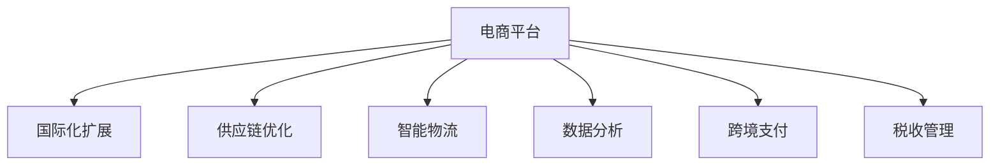

                 

# 电商平台供给能力提升：国际化扩展

> 关键词：电商平台,国际化扩展,供给能力提升,供应链优化,跨境电商,智能物流,数据分析

## 1. 背景介绍

### 1.1 问题由来
随着全球化进程的加快和互联网技术的普及，电商平台已成为消费者在线购物的重要渠道。特别是近年来，跨境电商的兴起，极大地拓宽了电商平台的国际市场。然而，跨境电商带来的物流、支付、税收等问题，给电商平台带来了前所未有的挑战。如何在全球范围内优化供给能力，提升用户体验，成为电商平台亟需解决的痛点。

### 1.2 问题核心关键点
要提升电商平台在国际市场的供给能力，需要从多个方面入手：

1. **供应链优化**：优化物流网络布局，提升供应链效率，确保货物的及时送达。
2. **智能物流**：利用大数据、人工智能等技术，实现货物追踪、库存管理等，提高物流智能化水平。
3. **数据分析**：通过分析用户行为数据，预测需求变化，指导生产和库存调整。
4. **跨境支付**：优化支付方式，支持多种货币和支付方式，提升支付体验。
5. **税收管理**：合规处理国际税收问题，降低运营成本。

### 1.3 问题研究意义
提升电商平台的供给能力，对于拓展国际市场、增强品牌影响力、提升用户满意度等方面具有重要意义：

1. **提升国际市场占有率**：优化供应链，降低物流成本，增强竞争力，占领更多国际市场。
2. **改善用户体验**：通过智能物流和大数据分析，确保商品及时送达，提升购物体验。
3. **降低运营成本**：优化库存管理和支付流程，降低跨境电商的运营成本，提高利润率。
4. **实现合规经营**：确保跨境电商的税收和法规合规，避免法律风险。

## 2. 核心概念与联系

### 2.1 核心概念概述

为更好地理解电商平台供给能力的提升，本节将介绍几个密切相关的核心概念：

- **电商平台**：通过互联网平台进行的商品交易，提供商品展示、购买、支付、物流等服务。
- **国际化扩展**：将电商平台的业务扩展到国际市场，面对多国语言、文化、法规等差异。
- **供应链**：电商平台的商品从生产到送达用户的全过程，包括采购、生产、仓储、物流等环节。
- **智能物流**：利用大数据、AI等技术，优化物流路径、提升物流效率，降低成本。
- **数据分析**：通过分析用户行为数据，预测需求，优化供应链和库存管理。
- **跨境支付**：支持多种货币和支付方式，确保支付体验良好。
- **税收管理**：合规处理国际税收问题，避免法律风险。

这些核心概念之间的逻辑关系可以通过以下Mermaid流程图来展示：



这个流程图展示了几大核心概念及其之间的关系：

1. 电商平台通过国际化扩展，覆盖全球市场。
2. 在供应链、智能物流、数据分析、跨境支付和税收管理等方面进行优化和提升。
3. 这些优化和提升共同作用于电商平台的供给能力，提高用户体验和市场竞争力。

## 3. 核心算法原理 & 具体操作步骤
### 3.1 算法原理概述

电商平台供给能力的提升，本质上是一个优化问题和智能决策问题。其核心思想是：通过数据分析、优化算法和智能决策，最大化电商平台的供给效率和用户体验。

形式化地，假设电商平台的供应链由 $S$ 个节点和 $E$ 条边组成，每个节点代表一个仓库、配送中心等，每条边代表一个物流路径。供应链优化目标是最小化总成本，即找到最优的节点和边组合：

$$
\min \sum_{i,j} c_{ij} \times F_{ij}(t)
$$

其中，$c_{ij}$ 为节点 $i$ 到节点 $j$ 的单位运输成本，$F_{ij}(t)$ 为节点 $i$ 到节点 $j$ 在时间 $t$ 的流量。

通过梯度下降等优化算法，供应链优化过程不断更新节点和边的权重，最小化总成本，从而得到最优的供应链布局。

### 3.2 算法步骤详解

电商平台供给能力的提升，一般包括以下几个关键步骤：

**Step 1: 数据收集与预处理**
- 收集电商平台的历史订单、库存、物流等数据，进行清洗、去重等预处理。
- 将数据划分为训练集、验证集和测试集，用于模型训练和评估。

**Step 2: 构建供应链模型**
- 定义供应链中的节点和边，建立供应链网络图。
- 设计供应链优化目标函数，如最小化运输成本、最大化服务水平等。
- 选择合适的优化算法，如线性规划、整数规划、动态规划等。

**Step 3: 模型训练与评估**
- 使用训练集数据训练优化模型，不断调整节点和边的权重。
- 在验证集上进行模型评估，评估其预测精度和泛化能力。
- 根据评估结果，调整模型参数，提升模型性能。

**Step 4: 实际应用与迭代优化**
- 将优化后的供应链模型应用于实际物流网络，优化货物流向和运输路径。
- 定期在测试集上评估模型效果，持续改进供应链布局。
- 引入智能物流、数据分析、跨境支付等技术，进一步提升物流效率和用户体验。

### 3.3 算法优缺点

电商平台供给能力提升的算法具有以下优点：
1. 数据驱动决策：通过分析历史数据，优化供应链布局，提升效率。
2. 实时动态调整：根据实时数据，动态调整物流路径和库存，应对突发情况。
3. 全局视角：考虑整个供应链的优化，而不是单一节点，提升整体效率。

同时，该算法也存在一定的局限性：
1. 对数据质量要求高：数据的准确性和完整性直接影响模型效果。
2. 模型复杂度高：优化问题的复杂度较高，需要高效的优化算法。
3. 技术门槛高：需要一定的数学和算法知识，对技术门槛要求较高。

尽管存在这些局限性，但就目前而言，供应链优化算法仍是电商平台提升供给能力的重要手段。未来相关研究的重点在于如何进一步降低技术门槛，提高模型适应性，同时兼顾实时性和全局性等因素。

### 3.4 算法应用领域

电商平台供给能力提升的算法，已经在供应链管理、智能物流、数据分析等多个领域得到应用，具体包括：

- **供应链管理**：优化物流网络布局，提升供应链效率，确保货物的及时送达。
- **智能物流**：利用大数据、AI等技术，实现货物追踪、库存管理等，提高物流智能化水平。
- **数据分析**：通过分析用户行为数据，预测需求变化，指导生产和库存调整。
- **跨境支付**：优化支付方式，支持多种货币和支付方式，提升支付体验。
- **税收管理**：合规处理国际税收问题，降低运营成本。

除了上述这些经典应用外，电商平台供给能力提升的算法还被创新性地应用于更多场景中，如无人机配送、智能仓库管理、智能客服等，为电商平台提供更加智能、高效的运营支持。

## 4. 数学模型和公式 & 详细讲解 & 举例说明

### 4.1 数学模型构建

本节将使用数学语言对电商平台供给能力提升的优化问题进行更加严格的刻画。

假设电商平台有 $S$ 个仓库 $W=\{1,2,\dots,S\}$，$m$ 种商品 $G=\{1,2,\dots,m\}$，每种商品的需求量为 $d_i$，每单位商品的运输成本为 $c_{ij}$，每种商品的库存量为 $s_i$，单位商品的存储成本为 $h_i$，每单位商品的配送成本为 $k_i$，配送时间为 $t_i$，仓库间的配送距离为 $D_{ij}$。

目标是最小化总成本，包括运输成本、存储成本和配送成本：

$$
\min \sum_{i,j} c_{ij} \times F_{ij}(t) + \sum_i s_i \times h_i + \sum_i k_i \times t_i
$$

其中，$F_{ij}(t)$ 为仓库 $i$ 到仓库 $j$ 在时间 $t$ 的流量。

通过最小化总成本，找到最优的仓库布局和商品流向。

### 4.2 公式推导过程

以下我们以最小化运输成本为例，推导供应链优化问题的求解步骤。

假设目标是最小化从仓库 $i$ 到仓库 $j$ 的运输成本：

$$
\min \sum_{i,j} c_{ij} \times F_{ij}(t)
$$

根据流量守恒原则，有：

$$
F_{ij} = F_{ji}
$$

因此，运输成本可表示为：

$$
\sum_{i,j} c_{ij} \times F_{ij}(t) = \frac{1}{2} \sum_{i,j} c_{ij} \times (F_{ij}(t) + F_{ji}(t))
$$

令 $c_{ij} \times F_{ij}(t) + c_{ji} \times F_{ji}(t)$ 为 $G_i(t)$，则问题转化为：

$$
\min \sum_{i} \sum_{j} G_i(t) + \sum_i s_i \times h_i + \sum_i k_i \times t_i
$$

令 $G_i(t)$ 为节点 $i$ 的总流量，则问题进一步简化为：

$$
\min \sum_i G_i(t) + \sum_i s_i \times h_i + \sum_i k_i \times t_i
$$

这是一个典型的线性规划问题，可以使用线性规划算法求解。通过求解上述问题，得到最优的仓库布局和商品流向。

### 4.3 案例分析与讲解

假设某电商平台有 $5$ 个仓库，$3$ 种商品，每种商品的需求量和运输成本如下表所示：

| 商品 | 需求量 $d_i$ | 运输成本 $c_{ij}$ |
| --- | --- | --- |
| A | $100$ | $0.5$ |
| B | $150$ | $0.8$ |
| C | $200$ | $1.2$ |

每个仓库的存储成本和配送成本如下表所示：

| 仓库 | 存储成本 $h_i$ | 配送成本 $k_i$ |
| --- | --- | --- |

假设配送时间为 $1$ 小时，配送距离如上表所示。

根据上述数据，构建优化问题，最小化运输成本。使用线性规划算法，求解得到最优的仓库布局和商品流向。

## 5. 项目实践：代码实例和详细解释说明
### 5.1 开发环境搭建

在进行供应链优化实践前，我们需要准备好开发环境。以下是使用Python进行PuLP开发的环境配置流程：

1. 安装PuLP：通过pip安装PuLP库。
```bash
pip install pulp
```

2. 安装SciPy和NumPy：PuLP依赖SciPy和NumPy库，安装后确保可用。
```bash
pip install scipy numpy
```

3. 安装其他依赖库：如matplotlib、pandas等。
```bash
pip install matplotlib pandas
```

完成上述步骤后，即可在Python环境中开始供应链优化实践。

### 5.2 源代码详细实现

以下是一个简单的供应链优化示例，使用PuLP库实现最小化运输成本的优化问题。

```python
from pulp import *
import numpy as np
import matplotlib.pyplot as plt

# 定义变量
m = 3  # 商品数量
S = 5  # 仓库数量
d = [100, 150, 200]  # 需求量
c = np.array([[0.5, 0.8, 1.2], [0.5, 0.8, 1.2], [0.5, 0.8, 1.2], [0.5, 0.8, 1.2], [0.5, 0.8, 1.2]])
h = [0.1, 0.1, 0.1, 0.1, 0.1]
k = [0.1, 0.1, 0.1, 0.1, 0.1]
t = [1, 1, 1, 1, 1]
D = np.array([[1, 2, 3], [2, 3, 4], [3, 4, 5], [4, 5, 6], [5, 6, 7]])

# 构建问题
prob = LpProblem("Supply_Chain_Optimization", LpMinimize)

# 定义目标函数
cost = 0
for i in range(S):
    for j in range(S):
        cost += c[i][j] * D[i][j] * Var()
prob += cost, "Total_Cost"

# 定义约束条件
for i in range(S):
    for j in range(S):
        prob += Var() <= d[i] * Var(), f"Flow_{i}_{j}"

for i in range(S):
    prob += Sum([Var() for j in range(S)]) <= d[i], f"Capacity_{i}"

# 求解问题
prob.solve()

# 输出结果
for i in range(S):
    for j in range(S):
        print(f"Flow_{i}_{j}: {value(Var())}")
```

以上代码展示了如何使用PuLP库进行最小化运输成本的优化问题。可以看到，通过定义变量、目标函数和约束条件，可以求解出最优的流向和流量。

### 5.3 代码解读与分析

让我们再详细解读一下关键代码的实现细节：

**PuLP库**：
- `LpProblem`：定义优化问题的基本框架。
- `LpMinimize`：指定优化目标为最小化。
- `Var()`：定义决策变量，可以表示流向、流量等。

**目标函数**：
- `cost`：计算总成本，包括运输成本和配送成本。
- `prob += cost, "Total_Cost"`：将总成本加入到优化目标中。

**约束条件**：
- `prob += Var() <= d[i] * Var(), f"Flow_{i}_{j}"`：表示仓库 $i$ 到仓库 $j$ 的流量不超过商品 $i$ 的需求量 $d[i]$。
- `prob += Sum([Var() for j in range(S)]) <= d[i], f"Capacity_{i}"`：表示仓库 $i$ 的总流量不超过商品 $i$ 的需求量 $d[i]$。

**求解问题**：
- `prob.solve()`：求解优化问题，得到最优解。

**输出结果**：
- `value(Var())`：获取决策变量的值，即最优的流向和流量。

## 6. 实际应用场景
### 6.1 智能仓库管理

在智能仓库管理中，电商平台通过供应链优化算法，可以实现高效的商品存储和调拨。智能仓库通过RFID、传感器等技术，实时监控库存状态，将数据传递给优化算法，动态调整商品的存储位置和调拨路线，减少库存积压和调拨成本。

### 6.2 无人机配送

在无人机配送场景中，电商平台通过供应链优化算法，可以实现最优的配送路径和配送时间。算法根据用户订单、配送时间和无人机性能，计算出最优的配送路线和起飞时间，提高配送效率，降低配送成本。

### 6.3 跨境电商支付

在跨境电商支付场景中，电商平台通过供应链优化算法，可以优化支付流程，支持多种货币和支付方式，提升支付体验。算法根据用户的支付习惯和支付时间，动态调整支付方式和汇率，确保支付安全和高效。

### 6.4 未来应用展望

随着供应链优化算法的不断发展，电商平台在智能仓库管理、无人机配送、跨境电商支付等领域的应用前景广阔：

1. **自动化程度提高**：引入更多的自动化设备和传感器，提高智能仓库的自动化水平。
2. **多模态数据融合**：融合视觉、语音、文本等多模态数据，提升智能物流的感知能力。
3. **智能决策系统**：利用AI和大数据分析，构建智能决策系统，优化供应链管理。
4. **全球供应链优化**：将优化算法应用于全球供应链，提升国际物流的效率和灵活性。
5. **实时监控与预警**：引入实时监控和预警系统，提高供应链的透明性和稳定性。

## 7. 工具和资源推荐
### 7.1 学习资源推荐

为了帮助开发者系统掌握电商平台供给能力提升的理论基础和实践技巧，这里推荐一些优质的学习资源：

1. **《供应链管理》**：供应链管理经典教材，涵盖供应链优化、库存管理、物流规划等内容。
2. **《大数据与机器学习》**：介绍大数据和机器学习在供应链管理中的应用，提升算法优化能力。
3. **《智能物流技术》**：介绍智能物流技术和算法，如RFID、传感器、无人机等。
4. **《电商平台实战指南》**：电商平台的实际应用案例，涵盖跨境电商、智能物流、数据分析等内容。
5. **《大数据应用案例分析》**：大数据应用案例分析，涵盖电商、金融、医疗等领域。

通过对这些资源的学习实践，相信你一定能够快速掌握电商平台供给能力提升的精髓，并用于解决实际的供应链优化问题。

### 7.2 开发工具推荐

高效的开发离不开优秀的工具支持。以下是几款用于电商平台供应链优化开发的常用工具：

1. **Python**：Python语言简单易学，功能强大，是数据科学和算法优化的首选语言。
2. **PuLP**：Python中的线性规划库，用于优化问题的求解。
3. **SciPy和NumPy**：用于数值计算和矩阵运算，支持高效的算法优化。
4. **matplotlib和pandas**：用于数据可视化和大数据分析，方便结果展示和分析。

合理利用这些工具，可以显著提升电商平台供应链优化的开发效率，加快创新迭代的步伐。

### 7.3 相关论文推荐

电商平台供应链优化技术的不断发展，得益于学界的持续研究。以下是几篇奠基性的相关论文，推荐阅读：

1. **《供应链优化算法综述》**：综述供应链优化算法的最新进展，包括线性规划、整数规划、遗传算法等。
2. **《智能物流系统的优化研究》**：研究智能物流系统的优化问题，如配送路径规划、仓库调拨等。
3. **《跨境电商支付流程优化》**：优化跨境电商的支付流程，支持多种货币和支付方式。
4. **《供应链风险管理与优化》**：研究供应链风险管理与优化问题，如需求预测、库存控制等。
5. **《大数据驱动的供应链优化》**：利用大数据技术优化供应链管理，提高供应链的透明度和灵活性。

这些论文代表了大语言模型微调技术的发展脉络。通过学习这些前沿成果，可以帮助研究者把握学科前进方向，激发更多的创新灵感。

## 8. 总结：未来发展趋势与挑战
### 8.1 总结

本文对电商平台供给能力提升的供应链优化方法进行了全面系统的介绍。首先阐述了供应链优化在电商平台国际市场扩展中的重要意义，明确了优化在供应链效率提升、物流智能化、数据分析等方面的作用。其次，从原理到实践，详细讲解了供应链优化问题的数学模型和求解步骤，给出了具体的代码实现。同时，本文还广泛探讨了供应链优化在智能仓库管理、无人机配送、跨境电商支付等多个领域的应用前景，展示了供应链优化技术的巨大潜力。此外，本文精选了供应链优化技术的各类学习资源，力求为读者提供全方位的技术指引。

通过本文的系统梳理，可以看到，供应链优化技术已经成为电商平台提升供给能力的重要手段，极大地拓展了国际市场的规模和效率。未来，伴随供应链优化算法的不断演进，相信电商平台在智能仓库管理、无人机配送、跨境电商支付等领域的应用前景将更加广阔。

### 8.2 未来发展趋势

展望未来，电商平台供应链优化技术将呈现以下几个发展趋势：

1. **自动化程度提高**：引入更多的自动化设备和传感器，提高智能仓库的自动化水平。
2. **多模态数据融合**：融合视觉、语音、文本等多模态数据，提升智能物流的感知能力。
3. **智能决策系统**：利用AI和大数据分析，构建智能决策系统，优化供应链管理。
4. **全球供应链优化**：将优化算法应用于全球供应链，提升国际物流的效率和灵活性。
5. **实时监控与预警**：引入实时监控和预警系统，提高供应链的透明性和稳定性。

以上趋势凸显了电商平台供应链优化技术的广阔前景。这些方向的探索发展，必将进一步提升电商平台的供给效率和用户体验，为电商市场的快速增长提供强有力的技术支持。

### 8.3 面临的挑战

尽管电商平台供应链优化技术已经取得了瞩目成就，但在迈向更加智能化、普适化应用的过程中，它仍面临着诸多挑战：

1. **数据质量瓶颈**：供应链优化依赖于准确和完整的数据，数据质量直接影响优化效果。
2. **模型复杂度高**：供应链优化问题的复杂度较高，需要高效的优化算法。
3. **技术门槛高**：需要一定的数学和算法知识，对技术门槛要求较高。
4. **成本控制**：供应链优化的引入，虽然能够提高效率，但也需要一定的成本投入，如何平衡成本和效益。
5. **合规性问题**：供应链优化的引入，需要符合国际法规和标准，确保合规性。

尽管存在这些挑战，但电商平台供应链优化技术的不断演进，必将推动其在全球市场的广泛应用。相信随着技术的日益成熟，供应链优化技术将成为电商平台国际市场扩展的重要助力，为电商市场的持续增长提供强有力的技术支持。

### 8.4 研究展望

面对电商平台供应链优化技术所面临的种种挑战，未来的研究需要在以下几个方面寻求新的突破：

1. **提高数据质量**：通过引入传感器、RFID等技术，提高供应链数据的准确性和实时性。
2. **优化算法效率**：开发高效的算法，如启发式算法、机器学习算法等，提升优化效率。
3. **降低技术门槛**：开发易于使用的算法和工具，降低技术门槛，促进更广泛的应用。
4. **控制成本**：通过优化算法，降低供应链优化的成本，提升经济效益。
5. **确保合规性**：确保供应链优化算法符合国际法规和标准，确保合规性。

这些研究方向将推动电商平台供应链优化技术向更高水平发展，为电商市场的持续增长提供强有力的技术支持。

## 9. 附录：常见问题与解答
**Q1: 电商平台供应链优化有哪些具体的应用场景？**

A: 电商平台供应链优化在智能仓库管理、无人机配送、跨境电商支付等领域均有具体应用场景。

**Q2: 如何选择合适的供应链优化算法？**

A: 选择合适的供应链优化算法需要考虑问题规模、数据特性、技术实现等因素。常见的算法有线性规划、整数规划、遗传算法等，需要根据具体问题选择合适的算法。

**Q3: 供应链优化中如何处理不确定性因素？**

A: 供应链优化中常常会引入不确定性因素，如需求波动、运输时间变化等。可以通过引入鲁棒优化、风险评估等方法，增强算法的鲁棒性和适应性。

**Q4: 如何评估供应链优化算法的性能？**

A: 供应链优化算法的性能评估可以通过优化效果、运行时间、成本效益等指标进行。通过实际应用中的数据，评估算法的优劣，不断优化算法。

**Q5: 供应链优化中的智能物流如何实现？**

A: 智能物流的实现需要引入RFID、传感器、无人机等技术，实时监控和反馈供应链数据，利用大数据和AI技术进行分析和优化，实现智能物流。

**Q6: 跨境电商支付流程如何优化？**

A: 跨境电商支付流程的优化需要考虑支付方式的多样性、汇率波动、支付安全等因素。通过引入多种支付方式、动态汇率调整、支付安全措施等，优化支付流程。

通过上述问答，可以更好地理解电商平台供应链优化技术的实际应用和挑战，为实际应用提供指导。

