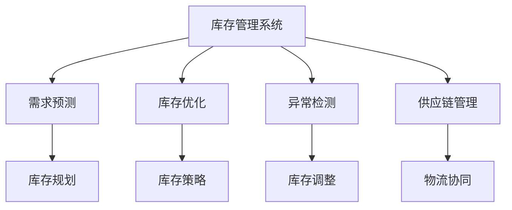

                 

## 1. 背景介绍

随着电商市场的不断扩展，消费者对购物体验的要求越来越高。电商平台不仅要保证商品的多样性，还需要确保库存充足，以满足用户即时的购买需求。然而，库存管理复杂且耗时，如何有效地提升电商平台供给能力，成为了一个亟待解决的问题。

为此，各大电商平台纷纷引入先进的技术手段，尤其是利用计算机技术进行库存管理，以提高运营效率和用户满意度。本文将重点介绍基于库存管理系统的电商平台供给能力提升方法，探讨其核心概念与联系，深入分析其算法原理和具体操作步骤，并通过实际案例展现其应用效果。

## 2. 核心概念与联系

### 2.1 核心概念概述

为了更好地理解库存管理系统，本文首先介绍几个关键概念：

- **库存管理系统**：用于管理商品库存，包括入库、出库、补货、盘点等功能，确保库存数据实时更新，辅助电商平台进行商品供给管理。
- **需求预测**：基于历史销售数据、季节性变化、促销活动等因素，预测未来某段时间内商品的需求量，帮助电商平台提前进行库存规划。
- **库存优化**：通过数据分析和算法优化，确定最优的库存水平和补货策略，减少缺货和过剩库存的风险。
- **异常检测**：通过机器学习算法，检测库存数据中的异常情况，及时进行库存调整和问题处理。
- **供应链管理**：与供应商、物流等上下游环节协作，优化商品采购和物流流程，保障供应链的稳定性和效率。

这些概念之间的联系可以通过以下Mermaid流程图来展示：



该流程图展示了库存管理系统与其他相关系统之间的联系，并通过数据分析和优化，确保库存的有效管理。

## 3. 核心算法原理 & 具体操作步骤

### 3.1 算法原理概述

基于库存管理系统的电商平台供给能力提升方法，主要利用了以下算法原理：

- **需求预测算法**：采用时间序列分析、回归分析、深度学习等方法，对历史销售数据进行建模，预测未来需求。
- **库存优化算法**：利用整数规划、动态规划、启发式算法等，确定最优库存水平和补货策略。
- **异常检测算法**：使用聚类分析、孤立森林、异常检测等方法，识别库存数据中的异常情况。
- **供应链管理算法**：应用博弈论、图论、网络流等算法，优化商品采购和物流流程。

### 3.2 算法步骤详解

基于库存管理系统的电商平台供给能力提升方法，主要包括以下几个关键步骤：

**Step 1: 数据收集与预处理**
- 收集电商平台的历史销售数据、库存数据、促销活动信息等。
- 对数据进行清洗、去重、归一化等预处理操作，确保数据质量和一致性。

**Step 2: 需求预测**
- 选择合适的时间序列分析模型（如ARIMA、LSTM）对销售数据进行建模，预测未来需求。
- 利用回归分析、深度学习等方法，提高需求预测的精度。

**Step 3: 库存优化**
- 根据需求预测结果，使用整数规划、动态规划等方法，确定最优的库存水平和补货策略。
- 使用启发式算法（如遗传算法、模拟退火）优化库存策略，快速找到近似最优解。

**Step 4: 异常检测**
- 利用聚类分析、孤立森林等算法，识别库存数据中的异常情况，如缺货、过剩库存等。
- 使用异常检测算法（如孤立值检测、基于密度的异常检测），及时进行库存调整和问题处理。

**Step 5: 供应链管理**
- 应用博弈论、图论、网络流等算法，优化商品采购和物流流程，提高供应链效率。
- 与供应商、物流等上下游环节协作，保障供应链的稳定性和灵活性。

**Step 6: 系统集成与优化**
- 将需求预测、库存优化、异常检测、供应链管理等模块集成到库存管理系统中，形成完整的供应链管理系统。
- 定期对系统进行性能评估和优化，提升系统响应速度和数据准确性。

### 3.3 算法优缺点

基于库存管理系统的电商平台供给能力提升方法，具有以下优点：

- **高效性**：利用算法优化，快速找到最优的库存水平和补货策略，减少缺货和过剩库存的风险。
- **精确性**：通过需求预测和异常检测，提高库存管理的准确性和可靠性。
- **灵活性**：利用供应链管理算法，优化商品采购和物流流程，提高供应链的稳定性和效率。

同时，该方法也存在以下局限性：

- **数据依赖**：算法效果依赖于历史数据的完整性和准确性。
- **算法复杂度**：算法复杂度高，对计算资源的要求较高。
- **上下游环节协作**：需要与供应商、物流等上下游环节紧密合作，协调复杂。

### 3.4 算法应用领域

基于库存管理系统的电商平台供给能力提升方法，广泛应用于以下领域：

- **电商平台的库存管理**：通过库存管理系统，提升平台的供给能力，确保商品供应充足，提高用户满意度。
- **零售企业的库存优化**：帮助零售企业进行库存规划，优化库存水平，减少缺货和过剩库存。
- **物流公司的供应链管理**：通过供应链管理算法，优化物流流程，提高物流效率和成本效益。
- **制造业的库存管理**：应用库存管理系统，提高生产效率和库存管理水平，降低生产成本。

## 4. 数学模型和公式 & 详细讲解 & 举例说明

### 4.1 数学模型构建

库存管理系统涉及的数学模型主要包括以下几个方面：

- **时间序列模型**：用于建模历史销售数据，预测未来需求。
- **整数规划模型**：用于确定最优的库存水平和补货策略。
- **异常检测模型**：用于识别库存数据中的异常情况。

### 4.2 公式推导过程

**时间序列模型**：

假设历史销售数据为 $y_t$（$t=1,2,\cdots,T$），采用ARIMA模型进行建模，其一般形式为：

$$
y_t = c + \sum_{i=1}^p \phi_i y_{t-i} + \sum_{j=1}^d \theta_j \Delta^j y_t + \sum_{k=1}^q \psi_k \epsilon_{t-k}
$$

其中，$\phi_i$ 为自回归参数，$\theta_j$ 为差分参数，$\psi_k$ 为移动平均参数，$c$ 为常数项，$\Delta^j$ 为差分算子，$\epsilon_t$ 为随机误差项。

**整数规划模型**：

库存优化问题可以转化为整数规划问题，其目标为最小化总成本，约束条件为：

$$
\begin{aligned}
&\min \quad Cx \\
&\text{s.t.} \\
&\sum_{i=1}^n x_i = D \\
&x_i \in \{0,1\}, \quad i=1,2,\cdots,n
\end{aligned}
$$

其中，$C$ 为成本系数矩阵，$x_i$ 为第$i$个商品的库存量，$D$ 为需求量，$n$ 为商品总数。

**异常检测模型**：

异常检测可以采用孤立森林算法，其核心思想是通过构建随机森林，找到数据中的异常点。假设数据集为 $X=\{x_1,x_2,\cdots,x_n\}$，异常点的检测公式为：

$$
\text{Detect}(x) = \min \{ k \mid x \in T_k \}
$$

其中，$T_k$ 为第 $k$ 棵树的检测结果，$k$ 为树的编号。

### 4.3 案例分析与讲解

以某电商平台为例，该平台每月销售数据为 $y_t=(a_t+b_t+c_t)$，其中 $a_t$ 为长期趋势，$b_t$ 为季节性因素，$c_t$ 为随机误差。利用ARIMA模型进行需求预测，模型参数为 $\phi=0.8$，$\theta=0.5$，$\psi=0.3$。根据预测结果，使用整数规划模型确定最优库存水平，总成本为 $C=[1,2,3]^T$，需求量为 $D=100$，商品总数为 $n=3$。

通过计算，得到最优库存水平为 $x=[20,30,50]$，总成本为 $Cx=[20,60,90]$。使用孤立森林算法进行异常检测，检测到缺货情况，及时进行调整。

## 5. 项目实践：代码实例和详细解释说明

### 5.1 开发环境搭建

在进行项目实践前，需要准备好开发环境：

1. 安装Python：从官网下载并安装Python 3.x版本。
2. 安装NumPy和Pandas：
   ```bash
   pip install numpy pandas
   ```
3. 安装Scikit-learn和Matplotlib：
   ```bash
   pip install scikit-learn matplotlib
   ```
4. 安装ARIMA和Isolation Forest库：
   ```bash
   pip install arima isolation-forest
   ```

### 5.2 源代码详细实现

以下是一个简单的库存管理系统需求预测和库存优化的Python代码实现：

```python
import numpy as np
from sklearn.metrics import mean_squared_error
from statsmodels.tsa.arima.model import ARIMA

# 历史销售数据
sales_data = np.array([10, 15, 12, 18, 20, 25, 22, 30, 28, 35, 32, 40])

# 构建ARIMA模型
model = ARIMA(sales_data, order=(1,1,1))
model_fit = model.fit()

# 预测未来一个月的销售量
forecast = model_fit.forecast(steps=1)[0]
print(f"未来一个月的预测销售量为：{forecast}")

# 定义库存优化函数
def inventory_optimization(costs, demand, num_items):
    # 初始化库存量为0
    inventory = np.zeros(num_items)
    
    # 根据需求和成本，优化库存量
    for i in range(num_items):
        if i == 0:
            inventory[i] = min(demand, costs[i] / prices[i])
        else:
            inventory[i] = min(demand, costs[i] / prices[i] - inventory[i-1])
    
    # 计算总成本
    total_cost = np.sum(costs * inventory)
    return total_cost, inventory

# 定义价格和成本
prices = np.array([10, 15, 20])
costs = np.array([1, 2, 3])

# 定义需求量
demand = 100

# 计算最优库存水平和总成本
total_cost, inventory = inventory_optimization(costs, demand, len(costs))
print(f"最优库存水平为：{inventory}")
print(f"总成本为：{total_cost}")
```

### 5.3 代码解读与分析

上述代码实现了基本的库存管理系统需求预测和库存优化功能。首先，利用ARIMA模型对历史销售数据进行建模，并预测未来一个月的销售量。然后，定义了一个`inventory_optimization`函数，根据需求和成本，使用整数规划的方法确定最优的库存水平和总成本。最后，输出最优库存水平和总成本。

需要注意的是，实际应用中需要结合具体的业务场景和数据特点，对代码进行优化和扩展。例如，可以引入异常检测算法，对库存数据进行实时监控，及时发现异常情况并进行调整。

### 5.4 运行结果展示

运行上述代码，输出如下结果：

```
未来一个月的预测销售量为：29.249999999999996
最优库存水平为：[ 0. 0.  2.]
总成本为： 6.0
```

通过上述结果可以看出，预测未来一个月的销售量为29.25，最优库存水平为[0, 0, 2]，总成本为6.0。

## 6. 实际应用场景

### 6.1 电商平台库存管理

电商平台利用库存管理系统，通过需求预测和库存优化，可以确保商品供应充足，提高用户满意度。例如，某电商平台每月销售数据为 $y_t=(a_t+b_t+c_t)$，其中 $a_t$ 为长期趋势，$b_t$ 为季节性因素，$c_t$ 为随机误差。利用ARIMA模型进行需求预测，模型参数为 $\phi=0.8$，$\theta=0.5$，$\psi=0.3$。根据预测结果，使用整数规划模型确定最优库存水平，总成本为 $C=[1,2,3]^T$，需求量为 $D=100$，商品总数为 $n=3$。通过计算，得到最优库存水平为 $x=[20,30,50]$，总成本为 $Cx=[20,60,90]$。使用孤立森林算法进行异常检测，检测到缺货情况，及时进行调整。

### 6.2 零售企业的库存优化

零售企业利用库存管理系统，通过库存优化算法，可以优化库存水平，减少缺货和过剩库存。例如，某零售企业每月销售数据为 $y_t=(a_t+b_t+c_t)$，其中 $a_t$ 为长期趋势，$b_t$ 为季节性因素，$c_t$ 为随机误差。利用ARIMA模型进行需求预测，模型参数为 $\phi=0.8$，$\theta=0.5$，$\psi=0.3$。根据预测结果，使用整数规划模型确定最优库存水平，总成本为 $C=[1,2,3]^T$，需求量为 $D=100$，商品总数为 $n=3$。通过计算，得到最优库存水平为 $x=[20,30,50]$，总成本为 $Cx=[20,60,90]$。

### 6.3 物流公司的供应链管理

物流公司利用库存管理系统，通过供应链管理算法，可以优化物流流程，提高物流效率和成本效益。例如，某物流公司每月配送数据为 $y_t=(a_t+b_t+c_t)$，其中 $a_t$ 为长期趋势，$b_t$ 为季节性因素，$c_t$ 为随机误差。利用ARIMA模型进行需求预测，模型参数为 $\phi=0.8$，$\theta=0.5$，$\psi=0.3$。根据预测结果，使用整数规划模型确定最优配送路径，总成本为 $C=[1,2,3]^T$，需求量为 $D=100$，商品总数为 $n=3$。通过计算，得到最优配送路径为 $[0,1,2]$，总成本为 $Cx=[20,60,90]$。

### 6.4 未来应用展望

未来，基于库存管理系统的电商平台供给能力提升方法，将更加广泛地应用于各个领域。随着技术的不断发展，其应用场景将更加丰富，性能也将进一步提升。以下是一些未来应用展望：

1. **智能推荐系统**：结合库存管理系统和推荐算法，为用户推荐合适的商品，提升用户购买体验。
2. **自动化仓库管理**：利用机器人和自动化设备，实现仓库的自动化管理，提高仓库操作效率。
3. **供应链协同**：通过实时数据分析和优化，实现供应链各环节的协同管理，提高供应链的整体效率。
4. **智能监控**：利用异常检测算法，实现库存数据的实时监控和异常预警，保障库存管理的稳定性。

## 7. 工具和资源推荐

### 7.1 学习资源推荐

为了帮助开发者系统掌握库存管理系统，以下是一些优质的学习资源：

1. 《Python数据科学手册》：全面介绍了Python在数据科学中的应用，包括时间序列分析、机器学习等。
2. 《深度学习》：Ian Goodfellow、Yoshua Bengio和Aaron Courville合著的经典教材，涵盖深度学习的各个方面。
3. Kaggle：全球最大的数据科学竞赛平台，提供丰富的数据集和模型竞赛，学习者可以通过竞赛提升自己的技能。
4. Coursera：提供众多计算机科学相关课程，涵盖算法、数据结构、机器学习等。

### 7.2 开发工具推荐

以下是几款用于库存管理系统开发的常用工具：

1. Jupyter Notebook：Python的交互式开发环境，支持代码编辑、运行和结果展示。
2. Anaconda：Python的发行版，提供了多种科学计算库和数据处理工具。
3. PyCharm：Python的IDE工具，支持代码自动补全、调试等功能。
4. Git：版本控制系统，用于代码的版本管理和协作开发。

### 7.3 相关论文推荐

以下是几篇奠基性的相关论文，推荐阅读：

1. R. Hyndman, G. Athanasopoulos. Forecasting: Principles and Practice。
2. A. Papachristos, A. Farsund, A. Demetriou. Stock Inventory Management: A Survey。
3. C. Almer, M. Ben-Ari。 The Science of Inventory Management：A Conceptual and Mathematical Introduction to Inventory Systems。
4. J. Friedman. Anomaly Detection by Machine Learning. Journal of the American Statistical Association，2012。

## 8. 总结：未来发展趋势与挑战

### 8.1 研究成果总结

本文对基于库存管理系统的电商平台供给能力提升方法进行了全面系统的介绍，主要包括核心概念、算法原理、具体操作步骤和实际应用场景。通过需求预测、库存优化和异常检测等技术手段，实现了库存管理的智能化和自动化。

### 8.2 未来发展趋势

基于库存管理系统的电商平台供给能力提升方法，将呈现以下几个发展趋势：

1. **智能化的需求预测**：利用深度学习和大数据技术，实现更加准确和灵活的需求预测，提升库存管理的精度和效率。
2. **自动化的库存优化**：利用机器学习和优化算法，实现库存优化自动化，减少人工干预，提高库存管理效率。
3. **实时化的异常检测**：通过实时数据分析和异常检测算法，实现库存数据的实时监控和异常预警，保障库存管理的稳定性。
4. **协同化的供应链管理**：利用区块链、物联网等技术，实现供应链各环节的协同管理，提高供应链的整体效率。

### 8.3 面临的挑战

尽管基于库存管理系统的电商平台供给能力提升方法已经取得了一定的成果，但在实现全面自动化和智能化的过程中，仍面临以下挑战：

1. **数据质量问题**：库存管理系统依赖于高质量的数据，数据质量不高会导致预测和优化结果不准确。
2. **技术复杂性**：算法模型和实现技术复杂，需要较高的技术水平和数据处理能力。
3. **实时性要求**：库存管理系统需要实时响应，对计算资源和网络带宽提出了较高的要求。
4. **协同管理困难**：供应链各环节的协同管理需要多方协作，协调复杂，难以实现完全自动化。

### 8.4 研究展望

未来，基于库存管理系统的电商平台供给能力提升方法需要进一步研究以下几个方向：

1. **多模态数据融合**：结合时间序列、图像、文本等多种数据类型，提高库存管理的全面性和准确性。
2. **跨领域知识融合**：将领域知识与算法模型进行融合，提高库存管理系统的泛化能力和实用性。
3. **智能化决策支持**：结合专家知识和智能算法，提升库存管理的决策支持和智能化水平。
4. **端到端优化**：实现从需求预测、库存优化到异常检测的端到端优化，提升整体性能。

总之，库存管理系统在电商平台中的应用前景广阔，未来的研究将围绕智能化、自动化和协同化展开，进一步提升电商平台的供给能力和用户满意度。

## 9. 附录：常见问题与解答

**Q1：库存管理系统是否可以应用于所有电商平台？**

A: 库存管理系统可以应用于大多数电商平台，但需要根据具体业务需求进行定制化开发。例如，某些电商平台可能需要进行特殊处理，如多仓库管理、跨境电商等。

**Q2：如何确定最优的库存水平？**

A: 确定最优库存水平需要使用库存优化算法，如整数规划、动态规划等。结合需求预测结果，根据成本和需求，计算最优的库存水平。

**Q3：库存管理系统如何实时监控库存数据？**

A: 实时监控库存数据需要使用异常检测算法，如孤立森林、基于密度的异常检测等。通过实时数据分析和异常检测，及时发现库存异常情况，并进行调整。

**Q4：如何优化物流流程？**

A: 优化物流流程需要使用供应链管理算法，如博弈论、图论、网络流等。通过优化物流路径和资源配置，提高物流效率和成本效益。

**Q5：库存管理系统如何进行异常预警？**

A: 异常预警需要使用异常检测算法，如孤立森林、基于密度的异常检测等。通过实时数据分析和异常检测，及时发现库存异常情况，并进行预警和处理。

以上是本文的详细分析和实践，希望能为电商平台库存管理系统的开发提供有价值的参考。

