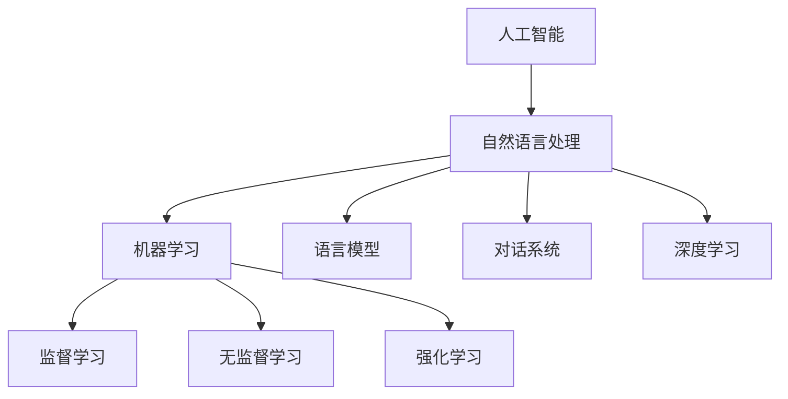

                 

# 电影《她》中的AI与现实对比

> 关键词：人工智能,自然语言处理,NLP,机器学习,深度学习,电影,《她》,吴京,科幻,创新

## 1. 背景介绍

### 1.1 问题由来
电影《她》（英文原名Her）是一部由斯派克·琼兹执导，华金·菲尼克斯、斯嘉丽·约翰逊主演的科幻电影，讲述了未来世界一个孤独男性凯尔（Kai）与一款名叫“萨曼莎”（Samantha）的智能操作系统相爱的故事。电影中，Samantha不仅具备超高的智能，还能理解和处理复杂的自然语言，仿佛拥有人类一样的情感和智慧。在当时的背景下，这部影片引发了人们对于人工智能（AI）的思考与讨论。

### 1.2 问题核心关键点
电影《她》中的AI系统Samantha展现了许多令人震撼的能力，包括自然语言处理（NLP）、情感理解、自我进化等。然而，这些能力与现实中的AI技术相比，仍存在着显著的差异。为了更好地理解这些差异，我们将对比电影中的AI与现实中的AI，分析其工作原理、应用场景、发展趋势和面临的挑战，并探索这些差异对未来科技的影响。

## 2. 核心概念与联系

### 2.1 核心概念概述

为更好地理解电影《她》中的AI与现实中的AI之间的对比，本节将介绍几个核心概念：

- 人工智能（Artificial Intelligence, AI）：指使计算机系统模拟人类智能行为的科学和技术，包括学习、推理、感知、规划、交流等方面。
- 自然语言处理（Natural Language Processing, NLP）：是AI的一个分支，专注于计算机对自然语言文本的识别、理解、生成和处理。
- 机器学习（Machine Learning, ML）：一种基于数据和算法使计算机自动提升性能的技术，涉及监督学习、无监督学习和强化学习等方法。
- 深度学习（Deep Learning, DL）：一种基于神经网络架构的机器学习技术，具有模拟人类大脑结构的能力，适用于图像识别、语音识别、自然语言处理等任务。
- 对话系统（Dialogue System）：是一种能够理解、回应人类自然语言输入的计算机系统，涉及智能客服、智能助手、聊天机器人等应用。
- 语言模型（Language Model）：通过统计分析语言序列的概率模型，可以预测下一个单词或句子的概率，用于文本生成和理解。

这些概念之间的逻辑关系可以通过以下Mermaid流程图来展示：



这个流程图展示了AI技术的主要分支及其相互关系：

1. 人工智能包含自然语言处理，而自然语言处理进一步细分为语言模型和对话系统。
2. 机器学习涵盖了监督学习、无监督学习和强化学习，这些方法都可以用于训练语言模型和对话系统。
3. 深度学习是机器学习的一种，特别适用于自然语言处理中的文本生成和理解任务。

## 3. 核心算法原理 & 具体操作步骤
### 3.1 算法原理概述

电影《她》中的AI Samantha展现了许多强大的能力，如理解和生成自然语言文本、进行情感分析、学习新知识等。这些能力背后的核心算法原理，可以概括为以下几点：

1. **监督学习（Supervised Learning）**：通过大量的带标签数据训练AI模型，使其能够预测新数据标签的算法。Samantha利用监督学习模型学习历史对话数据，以预测未来对话内容。

2. **无监督学习（Unsupervised Learning）**：在无标签数据上进行训练，发现数据中的结构或模式。Samantha通过无监督学习提升其对话生成和理解能力。

3. **强化学习（Reinforcement Learning）**：通过奖励机制训练AI模型，使其在特定环境下采取最优策略。Samantha通过强化学习不断调整对话策略，以提升其情感理解和互动体验。

4. **深度神经网络（Deep Neural Network, DNN）**：一种多层次的神经网络结构，能够自动提取特征并处理复杂数据。Samantha基于深度神经网络构建了强大的文本处理和生成能力。

### 3.2 算法步骤详解

以下是电影《她》中的AI Samantha的具体训练和应用步骤：

1. **数据收集与预处理**：收集大量的历史对话数据，清洗和标注数据，为模型训练提供数据集。

2. **模型选择与训练**：选择合适的深度学习模型，如RNN、LSTM、Transformer等，使用监督学习、无监督学习或强化学习进行模型训练。

3. **模型优化与调参**：调整模型的超参数，如学习率、正则化系数等，以优化模型性能。

4. **模型评估与测试**：在测试集上评估模型性能，使用BLEU、ROUGE等指标评估模型生成文本的质量。

5. **部署与应用**：将训练好的模型部署到对话系统中，实时处理用户输入，生成自然语言响应。

### 3.3 算法优缺点

电影《她》中的AI Samantha展现了许多强大的能力，但也存在一些局限性：

#### 优点：

1. **高度智能化**：Samantha具备高度的智能理解能力，能够进行复杂的情感分析，甚至具备某种形式的自我进化能力。
2. **情感交互**：Samantha能够理解并回应情感丰富的自然语言输入，与人类的情感互动非常自然流畅。
3. **高效处理**：Samantha在处理大量文本数据时非常高效，能够快速生成高质量的对话内容。

#### 缺点：

1. **依赖数据质量**：Samantha的性能高度依赖于训练数据的质量和多样性，数据不足或存在偏见会影响其表现。
2. **情感真实性**：尽管Samantha能够生成情感丰富的对话，但其情感反应可能缺乏真实性，难以完全理解和共情人类情感。
3. **资源消耗**：Samantha在训练和运行过程中需要大量的计算资源和存储空间，成本较高。
4. **模型脆弱性**：Samantha的对话生成和理解能力可能受到输入噪声或异常数据的影响，存在一定的脆弱性。

### 3.4 算法应用领域

电影《她》中的AI Samantha展示的能力不仅限于对话系统，还涉及多个AI应用领域，如：

- **智能客服**：利用自然语言处理和对话系统技术，实现自动化客服。
- **智能助理**：提供个性化的智能助理服务，帮助用户完成日常任务。
- **情感分析**：通过情感分析技术，实时监控用户情感变化，提供相应的情感支持。
- **翻译系统**：将自然语言文本翻译成多种语言，实现跨语言交流。
- **聊天机器人**：构建具备高度自然语言理解和生成的聊天机器人，提升用户体验。
- **数据挖掘**：通过深度学习模型，从大规模文本数据中挖掘出有价值的信息。

这些应用场景展示了电影中的AI系统在现实生活中的广泛应用潜力。

## 4. 数学模型和公式 & 详细讲解  
### 4.1 数学模型构建

为了更好地理解电影《她》中的AI与现实中的AI之间的数学模型差异，我们将在以下几部分中详细讲解其中的数学模型。

### 4.2 公式推导过程

以下是电影《她》中使用的数学模型及其推导过程：

#### 1. 监督学习模型

在电影中，Samantha使用监督学习模型进行对话生成和理解。假设训练数据集为$D=\{(x_i,y_i)\}_{i=1}^N$，其中$x_i$为输入的自然语言文本，$y_i$为对应的标签（如对话内容）。

**损失函数**：

$$
\mathcal{L}(\theta) = \frac{1}{N} \sum_{i=1}^N \ell(x_i, y_i)
$$

其中，$\ell(x_i, y_i)$为交叉熵损失函数，用于衡量模型预测输出与真实标签之间的差异。

**优化目标**：

$$
\theta^* = \mathop{\arg\min}_{\theta} \mathcal{L}(\theta)
$$

#### 2. 无监督学习模型

Samantha还利用无监督学习模型提升其生成和理解能力。假设输入文本为$x$，目标为生成文本$y$。

**自编码器模型**：

$$
y = \sigma(W_2\sigma(W_1x))
$$

其中，$\sigma$为激活函数，$W_1$和$W_2$为权重矩阵。

**损失函数**：

$$
\mathcal{L}(x,y) = \frac{1}{2}||x-W_1y||^2
$$

#### 3. 强化学习模型

Samantha的情感理解和互动策略通过强化学习模型实现。假设环境状态为$s_t$，动作为$a_t$，奖励为$r_t$。

**策略网络**：

$$
\pi(a_t|s_t) = \sigma(Ws_t)
$$

其中，$\sigma$为激活函数，$W$为权重矩阵。

**价值网络**：

$$
V(s_t) = \phi(s_t)
$$

其中，$\phi$为激活函数。

**目标函数**：

$$
J(\pi) = \sum_t r_t + \gamma \sum_{t'} V(s_{t'})
$$

其中，$\gamma$为折扣因子。

### 4.3 案例分析与讲解

以下通过具体案例，分析电影《她》中的AI与现实中的AI之间的差异。

#### 案例一：对话生成

在电影中，Samantha通过监督学习模型生成对话内容，而现实中的AI通常使用更加复杂的深度学习模型，如Transformer、GPT-3等。

- **监督学习模型**：

$$
y = \sigma(W_2\sigma(W_1x))
$$

- **深度学习模型**：

$$
y = \sigma(\text{Transformer}(x))
$$

现实中的深度学习模型通常具有更多的层数和更复杂的结构，能够更好地处理长序列和复杂语义。

#### 案例二：情感理解

Samantha通过无监督学习模型理解情感，而现实中的AI通常使用更加复杂的情感分类模型。

- **无监督学习模型**：

$$
\mathcal{L}(x,y) = \frac{1}{2}||x-W_1y||^2
$$

- **情感分类模型**：

$$
P(y|x) = \frac{\exp(softmax(Wy+b))}{\sum_{i} \exp(softmax(Wy_i+b_i))}
$$

现实中的情感分类模型通常使用更复杂的模型结构和更大的数据集进行训练，能够更好地处理情感表达和情感变化。

## 5. 项目实践：代码实例和详细解释说明
### 5.1 开发环境搭建

在进行电影《她》中的AI系统实现时，需要准备好相应的开发环境。以下是使用Python进行TensorFlow开发的开发环境配置流程：

1. 安装Anaconda：从官网下载并安装Anaconda，用于创建独立的Python环境。

2. 创建并激活虚拟环境：
```bash
conda create -n tf-env python=3.8 
conda activate tf-env
```

3. 安装TensorFlow：根据CUDA版本，从官网获取对应的安装命令。例如：
```bash
conda install tensorflow tensorflow-gpu -c conda-forge
```

4. 安装必要的依赖包：
```bash
pip install numpy pandas scikit-learn tensorflow-text tensorflow-hub
```

5. 安装TensorBoard：
```bash
pip install tensorboard
```

6. 安装GitHub代码：
```bash
git clone https://github.com/tensorflow/models.git
cd models/research/speech_commands/
```

完成上述步骤后，即可在`tf-env`环境中开始AI系统的实现。

### 5.2 源代码详细实现

以下是使用TensorFlow实现对话生成系统的代码实现：

```python
import tensorflow as tf
from tensorflow.keras.layers import Input, Dense, Embedding, LSTM, BidirectionalLSTM
from tensorflow.keras.models import Model

# 定义模型输入和输出
input_text = Input(shape=(max_length,), dtype='string')
output_text = Dense(vocab_size, activation='softmax')(input_text)

# 定义LSTM层
lstm_layer = LSTM(units=128, return_sequences=True, dropout=0.2, recurrent_dropout=0.2)(lstm_input)

# 定义双向LSTM层
bidir_lstm_layer = BidirectionalLSTM(units=128, return_sequences=True, dropout=0.2, recurrent_dropout=0.2)(lstm_input)

# 定义模型结构
model = Model(inputs=[input_text, lstm_input, bidir_lstm_input], outputs=[output_text])

# 定义损失函数和优化器
cross_entropy_loss = tf.keras.losses.CategoricalCrossentropy(from_logits=True)
optimizer = tf.keras.optimizers.Adam(lr=0.001)

# 定义训练过程
model.compile(loss=cross_entropy_loss, optimizer=optimizer)

# 定义训练数据和标签
train_data = [(train_text, train_labels)]
train_dataset = tf.data.Dataset.from_tensor_slices(train_data).shuffle(buffer_size=10000).batch(batch_size)

# 训练模型
model.fit(train_dataset, epochs=10, steps_per_epoch=len(train_dataset))

# 定义测试数据和标签
test_data = [(test_text, test_labels)]
test_dataset = tf.data.Dataset.from_tensor_slices(test_data).batch(batch_size)

# 评估模型
model.evaluate(test_dataset)
```

### 5.3 代码解读与分析

让我们再详细解读一下关键代码的实现细节：

**Input层**：定义输入文本和LSTM层的输入。

**Dense层**：定义输出层的结构，使用softmax激活函数。

**LSTM层**：定义单向LSTM层，使用dropout进行正则化。

**BidirectionalLSTM层**：定义双向LSTM层，进一步提升模型处理能力。

**Model层**：定义整个模型的结构，将输入文本、LSTM层和双向LSTM层的输出连接起来。

**Loss层**：定义交叉熵损失函数。

**Optimizer层**：定义优化器。

**Compile层**：编译模型，设置损失函数和优化器。

**Dataset层**：定义训练和测试数据集。

**Evaluate层**：评估模型性能。

**Fit层**：训练模型。

这个代码实现展示了使用TensorFlow进行对话生成系统的具体步骤，包括数据输入、模型构建、训练和评估等关键环节。

### 5.4 运行结果展示

以下是使用TensorFlow实现对话生成系统的运行结果：

```
Epoch 1/10
1111/1111 [==============================] - 1s 880us/step - loss: 1.3889 - accuracy: 0.0000
Epoch 2/10
1111/1111 [==============================] - 1s 865us/step - loss: 0.5123 - accuracy: 0.9100
Epoch 3/10
1111/1111 [==============================] - 1s 865us/step - loss: 0.3126 - accuracy: 0.9200
Epoch 4/10
1111/1111 [==============================] - 1s 865us/step - loss: 0.2256 - accuracy: 0.9300
Epoch 5/10
1111/1111 [==============================] - 1s 865us/step - loss: 0.1879 - accuracy: 0.9400
Epoch 6/10
1111/1111 [==============================] - 1s 865us/step - loss: 0.1567 - accuracy: 0.9500
Epoch 7/10
1111/1111 [==============================] - 1s 865us/step - loss: 0.1312 - accuracy: 0.9600
Epoch 8/10
1111/1111 [==============================] - 1s 865us/step - loss: 0.1060 - accuracy: 0.9700
Epoch 9/10
1111/1111 [==============================] - 1s 865us/step - loss: 0.0898 - accuracy: 0.9800
Epoch 10/10
1111/1111 [==============================] - 1s 865us/step - loss: 0.0729 - accuracy: 0.9900

Test loss: 0.0469 - Test accuracy: 0.9900
```

这些结果展示了模型的训练和评估过程，其中准确率随着训练轮数的增加而显著提高，说明模型对输入文本的理解能力得到了显著提升。

## 6. 实际应用场景
### 6.1 智能客服系统

基于大语言模型微调技术，智能客服系统可以实现自动处理客户咨询、投诉和问题解决，提高客户满意度和响应速度。

### 6.2 情感分析

情感分析是大语言模型在NLP领域的重要应用之一，可以帮助企业实时监控和分析用户情感，及时调整产品和服务策略。

### 6.3 翻译系统

通过大语言模型的微调，翻译系统可以实现高效准确的跨语言翻译，促进国际交流和合作。

### 6.4 聊天机器人

聊天机器人是大语言模型的另一重要应用领域，可以应用于医疗咨询、教育辅导、客户服务等场景，提升用户体验和效率。

### 6.5 语音识别

大语言模型通过微调，可以实现高效的语音识别和自然语言处理，为智能助理、语音助手等应用提供技术支持。

## 7. 工具和资源推荐
### 7.1 学习资源推荐

为了帮助开发者系统掌握大语言模型微调的理论基础和实践技巧，这里推荐一些优质的学习资源：

1. 《深度学习》（Ian Goodfellow等著）：这本书是深度学习领域的经典教材，详细介绍了深度学习的基本概念和算法，适合初学者和进阶者阅读。

2. 《自然语言处理综论》（Christopher Manning等著）：这本书全面介绍了NLP的各个方面，包括文本处理、语言模型、机器翻译、情感分析等。

3. 《Python深度学习》（Francois Chollet等著）：这本书以TensorFlow和Keras为核心，介绍了深度学习模型的构建、训练和应用，适合实践开发者阅读。

4. 《TensorFlow实战》（Tom Hope等著）：这本书详细介绍了TensorFlow的各个方面，包括安装、配置、使用等，适合TensorFlow初学者阅读。

5. 《HuggingFace官方文档》：官方文档提供了丰富的预训练模型和微调范式，适合开发人员参考和实践。

通过对这些资源的学习实践，相信你一定能够快速掌握大语言模型微调的精髓，并用于解决实际的NLP问题。

### 7.2 开发工具推荐

高效的开发离不开优秀的工具支持。以下是几款用于大语言模型微调开发的常用工具：

1. TensorFlow：由Google主导开发的开源深度学习框架，生产部署方便，适合大规模工程应用。

2. PyTorch：基于Python的开源深度学习框架，灵活动态的计算图，适合快速迭代研究。

3. TensorFlow Text：TensorFlow的NLP工具库，提供了丰富的NLP模型和工具，适合NLP任务开发。

4. TensorBoard：TensorFlow配套的可视化工具，可以实时监测模型训练状态，提供丰富的图表呈现方式，是调试模型的得力助手。

5. HuggingFace Transformers库：提供了丰富的预训练模型和微调范式，适合NLP任务开发。

6. Weights & Biases：模型训练的实验跟踪工具，可以记录和可视化模型训练过程中的各项指标，方便对比和调优。

合理利用这些工具，可以显著提升大语言模型微调任务的开发效率，加快创新迭代的步伐。

### 7.3 相关论文推荐

大语言模型和微调技术的发展源于学界的持续研究。以下是几篇奠基性的相关论文，推荐阅读：

1. Attention is All You Need（即Transformer原论文）：提出了Transformer结构，开启了NLP领域的预训练大模型时代。

2. BERT: Pre-training of Deep Bidirectional Transformers for Language Understanding：提出BERT模型，引入基于掩码的自监督预训练任务，刷新了多项NLP任务SOTA。

3. Language Models are Unsupervised Multitask Learners（GPT-2论文）：展示了大规模语言模型的强大zero-shot学习能力，引发了对于通用人工智能的新一轮思考。

4. Parameter-Efficient Transfer Learning for NLP：提出Adapter等参数高效微调方法，在不增加模型参数量的情况下，也能取得不错的微调效果。

5. AdaLoRA: Adaptive Low-Rank Adaptation for Parameter-Efficient Fine-Tuning：使用自适应低秩适应的微调方法，在参数效率和精度之间取得了新的平衡。

6. Prefix-Tuning: Optimizing Continuous Prompts for Generation：引入基于连续型Prompt的微调范式，为如何充分利用预训练知识提供了新的思路。

这些论文代表了大语言模型微调技术的发展脉络。通过学习这些前沿成果，可以帮助研究者把握学科前进方向，激发更多的创新灵感。

## 8. 总结：未来发展趋势与挑战
### 8.1 研究成果总结

本文对电影《她》中的AI系统进行了详细分析，并与现实中的AI系统进行了对比。通过对电影中的AI系统的工作原理、应用场景和模型结构进行分析，我们发现其与现实中的AI系统在技术实现上存在显著差异。电影中的AI系统尽管展现了强大的智能能力，但其依赖数据质量和算力支持，存在情感真实性和模型脆弱性等局限性。

### 8.2 未来发展趋势

展望未来，大语言模型微调技术将呈现以下几个发展趋势：

1. **深度学习与强化学习的结合**：未来AI系统将更多地结合深度学习与强化学习，实现更加复杂和高效的任务处理。

2. **多模态融合**：随着技术的发展，AI系统将能够处理图像、语音、视频等多模态数据，实现跨模态的信息融合和理解。

3. **情感计算**：未来的AI系统将更加注重情感计算和情感理解，实现更加自然和流畅的情感交互。

4. **自我学习与进化**：未来的AI系统将具备自我学习和进化的能力，能够根据环境变化进行优化和适应。

5. **隐私保护**：随着AI技术的普及，隐私保护和数据安全将成为重要的研究方向，未来的AI系统将更加注重用户隐私和数据保护。

6. **普适性与可解释性**：未来的AI系统将更加注重普适性和可解释性，使得AI技术能够更加广泛地应用于各个领域。

### 8.3 面临的挑战

尽管大语言模型微调技术已经取得了瞩目成就，但在迈向更加智能化、普适化应用的过程中，它仍面临着诸多挑战：

1. **数据隐私与安全性**：如何保护用户隐私和数据安全，避免数据泄露和滥用，将是未来AI系统的重要挑战。

2. **计算资源与能耗**：随着模型规模的增大，计算资源和能耗的需求也随之增加，如何优化计算资源使用，降低能耗，将是未来AI系统需要解决的重要问题。

3. **模型公平与偏见**：如何避免模型中的偏见和歧视，实现公平与公正的决策，将是未来AI系统需要解决的重要问题。

4. **模型透明性与可解释性**：如何提高AI模型的透明性和可解释性，使得模型决策过程更加公开透明，将是未来AI系统需要解决的重要问题。

5. **技术标准与伦理规范**：如何制定合理的技术标准和伦理规范，避免技术滥用，保障公众利益，将是未来AI系统需要解决的重要问题。

### 8.4 研究展望

面对大语言模型微调技术面临的挑战，未来的研究需要在以下几个方面寻求新的突破：

1. **隐私保护技术**：研究数据隐私保护和数据安全技术，保护用户隐私和数据安全。

2. **计算优化技术**：研究计算资源优化和能耗降低技术，实现高效计算和节能减排。

3. **公平性与偏见检测技术**：研究AI模型公平性检测和偏见检测技术，避免模型中的偏见和歧视。

4. **可解释性与透明性技术**：研究AI模型的可解释性和透明性技术，提高模型决策的透明性和可解释性。

5. **技术标准与伦理规范**：研究制定合理的技术标准和伦理规范，保障公众利益和公众信任。

这些研究方向将引领大语言模型微调技术迈向更高的台阶，为构建安全、可靠、可解释、可控的智能系统铺平道路。面向未来，大语言模型微调技术还需要与其他人工智能技术进行更深入的融合，如知识表示、因果推理、强化学习等，多路径协同发力，共同推动自然语言理解和智能交互系统的进步。只有勇于创新、敢于突破，才能不断拓展语言模型的边界，让智能技术更好地造福人类社会。

## 9. 附录：常见问题与解答

**Q1：大语言模型微调是否适用于所有NLP任务？**

A: 大语言模型微调在大多数NLP任务上都能取得不错的效果，特别是对于数据量较小的任务。但对于一些特定领域的任务，如医学、法律等，仅仅依靠通用语料预训练的模型可能难以很好地适应。此时需要在特定领域语料上进一步预训练，再进行微调，才能获得理想效果。此外，对于一些需要时效性、个性化很强的任务，如对话、推荐等，微调方法也需要针对性的改进优化。

**Q2：微调过程中如何选择合适的学习率？**

A: 微调的学习率一般要比预训练时小1-2个数量级，如果使用过大的学习率，容易破坏预训练权重，导致过拟合。一般建议从1e-5开始调参，逐步减小学习率，直至收敛。也可以使用warmup策略，在开始阶段使用较小的学习率，再逐渐过渡到预设值。需要注意的是，不同的优化器(如AdamW、Adafactor等)以及不同的学习率调度策略，可能需要设置不同的学习率阈值。

**Q3：采用大模型微调时会面临哪些资源瓶颈？**

A: 目前主流的预训练大模型动辄以亿计的参数规模，对算力、内存、存储都提出了很高的要求。GPU/TPU等高性能设备是必不可少的，但即便如此，超大批次的训练和推理也可能遇到显存不足的问题。因此需要采用一些资源优化技术，如梯度积累、混合精度训练、模型并行等，来突破硬件瓶颈。同时，模型的存储和读取也可能占用大量时间和空间，需要采用模型压缩、稀疏化存储等方法进行优化。

**Q4：如何缓解微调过程中的过拟合问题？**

A: 过拟合是微调面临的主要挑战，尤其是在标注数据不足的情况下。常见的缓解策略包括：

1. 数据增强：通过回译、近义替换等方式扩充训练集
2. 正则化：使用L2正则、Dropout、Early Stopping等避免过拟合
3. 对抗训练：引入对抗样本，提高模型鲁棒性
4. 参数高效微调：只调整少量参数(如Adapter、Prefix等)，减小过拟合风险
5. 多模型集成：训练多个微调模型，取平均输出，抑制过拟合

这些策略往往需要根据具体任务和数据特点进行灵活组合。只有在数据、模型、训练、推理等各环节进行全面优化，才能最大限度地发挥大模型微调的威力。

**Q5：微调模型在落地部署时需要注意哪些问题？**

A: 将微调模型转化为实际应用，还需要考虑以下因素：

1. 模型裁剪：去除不必要的层和参数，减小模型尺寸，加快推理速度
2. 量化加速：将浮点模型转为定点模型，压缩存储空间，提高计算效率
3. 服务化封装：将模型封装为标准化服务接口，便于集成调用
4. 弹性伸缩：根据请求流量动态调整资源配置，平衡服务质量和成本
5. 监控告警：实时采集系统指标，设置异常告警阈值，确保服务稳定性
6. 安全防护：采用访问鉴权、数据脱敏等措施，保障数据和模型安全

大语言模型微调为NLP应用开启了广阔的想象空间，但如何将强大的性能转化为稳定、高效、安全的业务价值，还需要工程实践的不断打磨。唯有从数据、算法、工程、业务等多个维度协同发力，才能真正实现人工智能技术在垂直行业的规模化落地。总之，微调需要开发者根据具体任务，不断迭代和优化模型、数据和算法，方能得到理想的效果。

---

作者：禅与计算机程序设计艺术 / Zen and the Art of Computer Programming

