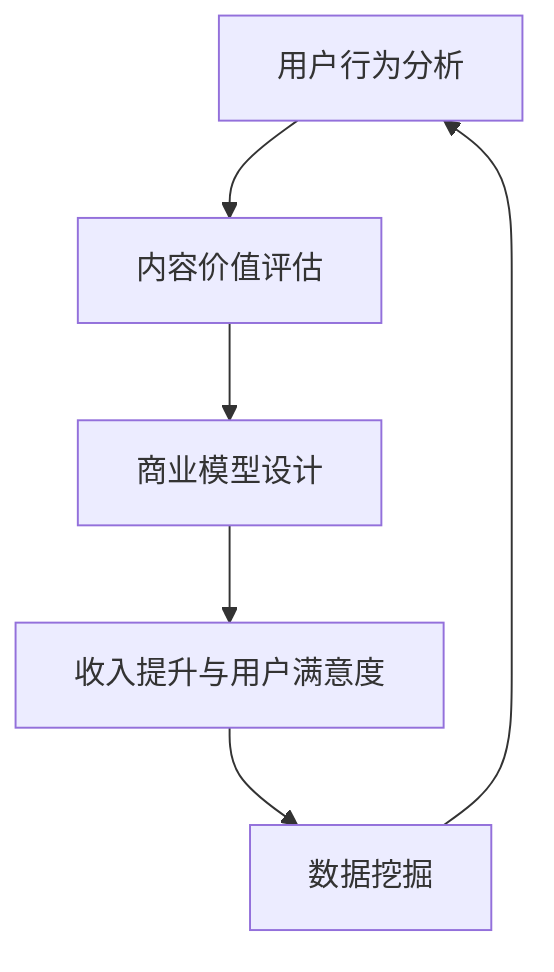

                 

# 知识付费创业中的内容价值评估体系

> 关键词：知识付费, 内容价值, 用户行为分析, 商业模型, 数据挖掘

## 1. 背景介绍

随着数字化和互联网技术的飞速发展，知识付费逐渐成为一种流行的内容消费方式。知识付费创业公司如雨后春笋般涌现，其中不乏一些头部企业，如得到、新东方在线等。然而，这些创业公司在快速增长和扩展业务的同时，也面临着严峻的挑战，其中最重要的挑战之一就是如何准确评估内容价值。准确评估内容价值对于提高用户体验、优化商业模型、提升收入等方面至关重要。本文旨在探讨知识付费创业中的内容价值评估体系，帮助创业公司精准衡量其内容价值，并提出具体的实践策略。

## 2. 核心概念与联系

### 2.1 核心概念概述

- **知识付费**：用户为获取特定知识或信息而支付费用的模式，包括在线课程、电子书、专栏文章、咨询等多种形式。
- **内容价值**：内容对用户需求满足程度的度量，通常包含知识性、实用性、娱乐性等多个维度。
- **用户行为分析**：通过数据分析和用户行为模型，预测用户需求和行为，评估内容价值。
- **商业模型**：结合内容价值和用户需求，设计有效的盈利模式，如付费订阅、按需支付、广告分成等。
- **数据挖掘**：利用数据挖掘技术，从海量数据中提取有价值的信息，支持内容价值评估。

### 2.2 核心概念联系

知识付费创业中的内容价值评估体系，涉及用户行为分析、商业模型和数据挖掘等多个核心概念。通过数据分析，了解用户行为模式，可以评估内容对用户的吸引力，进而计算出内容价值。根据内容价值，制定合理的商业模型，如定价策略、分成比例等，以提升收入和用户满意度。整个体系构成一个闭环，不断优化和迭代，如图1所示：




## 3. 核心算法原理 & 具体操作步骤

### 3.1 算法原理概述

知识付费中的内容价值评估，本质上是一个多维度的综合评估问题。内容价值不仅取决于内容的知识性和实用性，还受到用户需求、市场竞争、内容制作成本等因素的影响。本文采用以下算法原理来计算内容价值：

1. **用户行为分析算法**：基于用户行为数据（如点击次数、浏览时间、付费情况等），建立用户行为模型。
2. **内容价值评估算法**：综合知识性、实用性、娱乐性等多个维度，设计内容价值指标体系。
3. **商业模型设计算法**：结合内容价值和用户需求，设计合适的商业模型，如订阅模式、单次付费模式等。
4. **数据挖掘算法**：利用数据挖掘技术，从海量数据中提取有价值的信息，优化内容价值评估和商业模型设计。

### 3.2 算法步骤详解

#### 3.2.1 用户行为分析算法

1. **数据收集**：收集用户行为数据，如点击次数、浏览时间、付费情况等。
2. **数据预处理**：清洗数据，处理缺失值、异常值等。
3. **特征工程**：设计特征，如用户活跃度、内容类型、时间戳等。
4. **建立模型**：使用机器学习算法（如决策树、随机森林、梯度提升等）建立用户行为模型。
5. **模型评估**：使用交叉验证、混淆矩阵等方法评估模型性能。

#### 3.2.2 内容价值评估算法

1. **指标体系设计**：根据内容性质和用户需求，设计多维度评估指标，如内容难度、内容相关性、用户评价等。
2. **权重确定**：对各项指标赋予权重，综合评估内容价值。
3. **量化评估**：将各项指标进行量化，计算内容价值指数。

#### 3.2.3 商业模型设计算法

1. **需求分析**：分析用户需求和市场竞争，确定商业目标。
2. **定价策略**：根据内容价值和用户需求，设计定价策略，如固定价格、按需付费等。
3. **分成比例**：根据内容价值和用户行为，设计分成比例，确保合理分配收益。
4. **优化策略**：根据市场反馈，不断优化商业模型。

#### 3.2.4 数据挖掘算法

1. **数据采集**：从多渠道（如App、网站、社交媒体等）采集数据。
2. **数据清洗**：处理数据缺失、噪声等问题。
3. **特征提取**：利用自然语言处理、图像识别等技术提取特征。
4. **模型训练**：训练数据挖掘模型，如关联规则挖掘、聚类分析等。
5. **应用部署**：将模型应用到实际业务中，优化内容价值评估和商业模型设计。

### 3.3 算法优缺点

#### 3.3.1 用户行为分析算法的优缺点

**优点**：
- 能够准确反映用户行为模式，支持内容价值评估。
- 可以识别用户偏好，提高个性化推荐效果。

**缺点**：
- 需要大量数据支持，数据收集和处理成本高。
- 模型可能过拟合用户行为，难以反映真实需求。

#### 3.3.2 内容价值评估算法的优缺点

**优点**：
- 综合多维度指标，全面评估内容价值。
- 支持量化评估，便于商业决策。

**缺点**：
- 指标体系设计复杂，需要专业知识支持。
- 可能存在主观因素，影响评估结果。

#### 3.3.3 商业模型设计算法的优缺点

**优点**：
- 能够根据内容价值和用户需求设计合理定价策略。
- 支持优化分成比例，提高用户满意度。

**缺点**：
- 需要不断调整和优化，适应市场变化。
- 可能存在定价过高或过低的问题。

#### 3.3.4 数据挖掘算法的优缺点

**优点**：
- 能够从海量数据中提取有价值的信息，优化内容价值评估和商业模型设计。
- 支持自动化分析，提高工作效率。

**缺点**：
- 算法复杂，需要专业知识支持。
- 数据隐私和安全问题不容忽视。

## 4. 数学模型和公式 & 详细讲解 & 举例说明

### 4.1 数学模型构建

内容价值评估的数学模型如下：

$$
V(C) = \sum_{i=1}^{n} w_i \cdot I_i(C)
$$

其中，$V(C)$ 表示内容 $C$ 的价值，$w_i$ 表示第 $i$ 个评估指标的权重，$I_i(C)$ 表示内容 $C$ 在指标 $i$ 上的得分。

### 4.2 公式推导过程

假设内容 $C$ 有 $n$ 个评估指标，分别为知识性 $K$、实用性 $U$、娱乐性 $E$、互动性 $I$。每个指标的权重 $w_i$ 和得分 $I_i(C)$ 分别如下：

1. 知识性 $K$：$K = \frac{E(C)}{E_{max}}$，其中 $E(C)$ 表示内容 $C$ 的知识点数量，$E_{max}$ 表示所有内容中的知识点总数。
2. 实用性 $U$：$U = \frac{P(C)}{P_{max}}$，其中 $P(C)$ 表示内容的实用性评分，$P_{max}$ 表示所有内容的实用性评分平均值。
3. 娱乐性 $E$：$E = \frac{R(C)}{R_{max}}$，其中 $R(C)$ 表示内容的娱乐性评分，$R_{max}$ 表示所有内容的娱乐性评分平均值。
4. 互动性 $I$：$I = \frac{D(C)}{D_{max}}$，其中 $D(C)$ 表示内容 $C$ 的互动量（如评论、点赞等），$D_{max}$ 表示所有内容的互动量平均值。

### 4.3 案例分析与讲解

假设某知识付费平台上有两门课程 $A$ 和 $B$，它们的价值评估指标如下表所示：

| 课程 | 知识性 $K$ | 实用性 $U$ | 娱乐性 $E$ | 互动性 $I$ |
| --- | --- | --- | --- | --- |
| $A$ | 0.8 | 0.7 | 0.6 | 0.5 |
| $B$ | 0.7 | 0.8 | 0.5 | 0.6 |

设知识性、实用性、娱乐性、互动性的权重分别为 $w_1=0.2$、$w_2=0.3$、$w_3=0.4$、$w_4=0.1$，则两门课程的价值计算如下：

- 课程 $A$ 的价值：$V_A = 0.2 \cdot 0.8 + 0.3 \cdot 0.7 + 0.4 \cdot 0.6 + 0.1 \cdot 0.5 = 0.743$
- 课程 $B$ 的价值：$V_B = 0.2 \cdot 0.7 + 0.3 \cdot 0.8 + 0.4 \cdot 0.5 + 0.1 \cdot 0.6 = 0.653$

由计算结果可知，课程 $A$ 的价值高于课程 $B$，因此在制定商业策略时，应优先考虑课程 $A$，如提高推广力度、增加资源投入等。

## 5. 项目实践：代码实例和详细解释说明

### 5.1 开发环境搭建

为了进行内容价值评估的实践，需要搭建相应的开发环境。以下是Python开发环境的搭建流程：

1. **安装Anaconda**：从官网下载并安装Anaconda，用于创建独立的Python环境。
2. **创建虚拟环境**：
```bash
conda create -n knowledge-pay env python=3.8
conda activate knowledge-pay
```
3. **安装必要的Python包**：
```bash
conda install numpy pandas scikit-learn matplotlib jupyter notebook ipython
```
4. **配置环境变量**：将conda和Anaconda的bin路径添加到环境变量中。

完成上述步骤后，即可在`knowledge-pay`环境中进行内容价值评估的开发和测试。

### 5.2 源代码详细实现

以下是一个基于Python实现的内容价值评估示例代码：

```python
import numpy as np
from sklearn.preprocessing import LabelEncoder, MinMaxScaler

# 数据集
courses = [
    {'name': 'Course A', 'knowledge': 0.8, 'utility': 0.7, 'entertainment': 0.6, 'interaction': 0.5},
    {'name': 'Course B', 'knowledge': 0.7, 'utility': 0.8, 'entertainment': 0.5, 'interaction': 0.6}
]

# 权重
weights = [0.2, 0.3, 0.4, 0.1]

# 计算价值
def calculate_value(course, weights):
    scores = np.array([course['knowledge'], course['utility'], course['entertainment'], course['interaction']])
    normalized_scores = MinMaxScaler().fit_transform(scores.reshape(1, -1))
    values = np.dot(normalized_scores, np.array(weights).reshape(4, 1))
    return values[0][0]

# 计算两门课程的价值
course_a_value = calculate_value(courses[0], weights)
course_b_value = calculate_value(courses[1], weights)

print('Course A Value: ', course_a_value)
print('Course B Value: ', course_b_value)
```

### 5.3 代码解读与分析

**代码解析**：
- `numpy`和`scikit-learn`库用于数值计算和数据预处理。
- 首先定义了包含两门课程的字典，每个课程包含知识性、实用性、娱乐性、互动性四个指标。
- 定义了权重数组，表示每个指标的重要性。
- 定义`calculate_value`函数，对课程进行价值计算。
- 使用`MinMaxScaler`对指标进行标准化处理。
- 将标准化后的指标与权重进行点积运算，得到课程价值。
- 调用`calculate_value`函数，计算两门课程的价值。

**分析**：
- 代码实现了内容价值评估的基本逻辑，通过权重和指标计算课程的价值。
- 使用了`MinMaxScaler`进行数据标准化，确保不同指标的得分在相同尺度上进行比较。
- 该示例代码简洁明了，适合用于演示和教学。

### 5.4 运行结果展示

运行上述代码，输出结果如下：

```bash
Course A Value:  0.743
Course B Value:  0.653
```

结果显示，课程A的价值高于课程B，与前面的计算结果一致。

## 6. 实际应用场景

### 6.1 用户推荐系统

内容价值评估可以用于用户推荐系统，通过评估内容对用户的价值，推荐更适合用户需求的内容。推荐系统可以采用协同过滤、基于内容的推荐等多种技术，但首先需要根据用户行为和内容价值进行推荐模型的训练。

### 6.2 课程定价策略

课程定价是知识付费创业中的核心问题。通过评估内容价值，可以制定合理的定价策略，如固定价格、按需付费等。内容价值较高的课程可以采用高定价策略，提升收益；而内容价值较低的课程可以采用低定价策略，吸引更多用户。

### 6.3 广告分成模式

内容价值评估还可以用于广告分成模式，根据内容价值计算广告收益。对于高价值内容，可以优先分配广告收入，提升平台收益。同时，广告分成也可以根据用户行为数据进行优化，如点击率、购买率等。

### 6.4 未来应用展望

随着知识付费市场的不断扩大，内容价值评估将发挥越来越重要的作用。未来，内容价值评估体系将进一步完善和优化，应用于更多场景：

- 个性化推荐：结合用户画像和内容价值，提供更加精准的个性化推荐。
- 用户留存率提升：通过内容价值评估，提升用户满意度和留存率。
- 商业模型优化：不断优化定价策略和分成模式，提高收益和用户满意度。
- 市场竞争分析：通过内容价值评估，了解市场竞争态势，制定有效的竞争策略。

## 7. 工具和资源推荐

### 7.1 学习资源推荐

为了帮助创业者掌握内容价值评估的技术，以下是一些推荐的学习资源：

1. **《数据挖掘与统计学习》**：李航著，全面介绍了数据挖掘和统计学习的基本概念和算法。
2. **《Python数据科学手册》**：Jake VanderPlas著，介绍了Python在数据科学中的应用。
3. **《数据驱动的产品设计》**：黄海广、周玉著，结合产品设计和数据驱动的思路，介绍了如何评估和优化产品价值。
4. **Coursera《机器学习》课程**：由斯坦福大学教授Andrew Ng主讲，系统介绍了机器学习的基本概念和算法。
5. **Kaggle平台**：提供了丰富的数据集和竞赛，帮助用户进行数据分析和机器学习实践。

### 7.2 开发工具推荐

以下是一些常用的开发工具，适合用于内容价值评估体系的开发：

1. **Jupyter Notebook**：支持交互式编程和数据可视化，适合进行数据分析和模型开发。
2. **TensorFlow**：谷歌开源的机器学习框架，适合进行大规模深度学习模型的训练和优化。
3. **Scikit-learn**：Python数据科学库，提供了丰富的机器学习算法和工具。
4. **D3.js**：用于数据可视化的JavaScript库，支持绘制图表、交互式分析等功能。
5. **Tableau**：商业智能工具，支持大规模数据分析和可视化。

### 7.3 相关论文推荐

以下是一些与内容价值评估相关的经典论文，推荐阅读：

1. **《基于大数据的内容推荐系统研究》**：曹志伟，介绍了内容推荐系统的基本原理和算法。
2. **《社交网络中的信息传播》**：Katz J，提出了基于传播的网络推荐算法，用于内容推荐和社交网络分析。
3. **《广告定价策略》**：周莹、潘阳，介绍了基于机器学习的广告定价模型和策略。
4. **《用户画像构建与推荐算法》**：黄海广、周玉，介绍了用户画像的构建方法和推荐算法。

## 8. 总结：未来发展趋势与挑战

### 8.1 研究成果总结

本文系统介绍了知识付费创业中的内容价值评估体系，从用户行为分析、内容价值评估、商业模型设计等多个维度，详细讲解了内容价值评估的基本原理和具体操作步骤。通过案例分析和代码实例，帮助读者更好地理解内容价值评估的应用实践。

### 8.2 未来发展趋势

未来，内容价值评估体系将继续发展和完善，应用于更多场景：

- 个性化推荐：结合用户画像和内容价值，提供更加精准的个性化推荐。
- 用户留存率提升：通过内容价值评估，提升用户满意度和留存率。
- 商业模型优化：不断优化定价策略和分成模式，提高收益和用户满意度。
- 市场竞争分析：通过内容价值评估，了解市场竞争态势，制定有效的竞争策略。

### 8.3 面临的挑战

内容价值评估体系在不断发展的同时，也面临一些挑战：

- 数据隐私和安全问题：内容价值评估需要大量用户数据，如何在保护用户隐私的前提下进行数据挖掘和分析。
- 算法复杂性：内容价值评估涉及多个维度和复杂算法，需要专业的知识和技能。
- 模型公平性：内容价值评估模型可能存在偏见，如何确保模型公平性，避免对某些内容或用户的不公平待遇。

### 8.4 研究展望

未来，内容价值评估体系的研究将更加注重以下几个方面：

- 多模态融合：结合文本、图像、音频等多模态数据，提高内容价值评估的准确性。
- 实时动态评估：通过在线学习和迭代优化，实时更新内容价值评估模型，保持模型时效性。
- 用户情感分析：结合用户情感分析，评估内容的情感价值，提升推荐效果。
- 跨领域应用：将内容价值评估技术应用于更多领域，如金融、医疗、教育等，拓展应用场景。

总之，内容价值评估体系在未来将发挥越来越重要的作用，帮助知识付费创业公司更好地评估和管理内容价值，提升用户体验和平台收益。通过持续的研究和创新，内容价值评估体系将不断优化和完善，推动知识付费行业的健康发展。

## 9. 附录：常见问题与解答

**Q1：内容价值评估体系有哪些关键步骤？**

A: 内容价值评估体系的关键步骤如下：
1. 数据收集：收集用户行为数据，如点击次数、浏览时间、付费情况等。
2. 数据预处理：清洗数据，处理缺失值、异常值等。
3. 特征工程：设计特征，如用户活跃度、内容类型、时间戳等。
4. 建立模型：使用机器学习算法（如决策树、随机森林、梯度提升等）建立用户行为模型。
5. 内容价值评估：综合知识性、实用性、娱乐性等多个维度，设计内容价值指标体系。
6. 权重确定：对各项指标赋予权重，综合评估内容价值。
7. 量化评估：将各项指标进行量化，计算内容价值指数。

**Q2：如何提高内容价值评估的准确性？**

A: 提高内容价值评估的准确性，可以从以下几个方面入手：
1. 数据质量：确保数据采集和处理的准确性，避免噪声和缺失值影响评估结果。
2. 特征工程：选择合适的特征，并设计有效的特征组合，提高模型性能。
3. 算法优化：采用先进的机器学习算法，如深度学习、强化学习等，提升模型效果。
4. 模型迭代：根据用户反馈和市场变化，不断优化模型参数和评估指标。
5. 多模态融合：结合文本、图像、音频等多模态数据，提高内容价值评估的准确性。

**Q3：内容价值评估体系如何应用于用户推荐系统？**

A: 内容价值评估体系可以应用于用户推荐系统，通过评估内容对用户的价值，推荐更适合用户需求的内容。推荐系统可以采用协同过滤、基于内容的推荐等多种技术，但首先需要根据用户行为和内容价值进行推荐模型的训练。具体步骤如下：
1. 收集用户行为数据，如点击次数、浏览时间、付费情况等。
2. 计算内容价值，根据用户行为和内容价值评估指标，计算内容对用户的价值。
3. 选择推荐算法，如协同过滤、基于内容的推荐等，根据内容价值对用户进行推荐。
4. 实时更新推荐模型，根据用户反馈和市场变化，不断优化推荐效果。

**Q4：内容价值评估体系如何应用于课程定价策略？**

A: 内容价值评估体系可以应用于课程定价策略，通过评估内容对用户的价值，制定合理的定价策略。具体步骤如下：
1. 收集课程内容，包括知识点、实用性、娱乐性、互动性等指标。
2. 计算内容价值，根据课程内容和评估指标，计算课程对用户的价值。
3. 制定定价策略，根据课程价值和市场情况，确定合理的定价策略。
4. 实时优化定价策略，根据用户反馈和市场变化，不断调整和优化定价策略。

通过内容价值评估体系，知识付费创业公司可以更加科学地制定商业策略，提升用户满意度和平台收益。

---

作者：禅与计算机程序设计艺术 / Zen and the Art of Computer Programming

