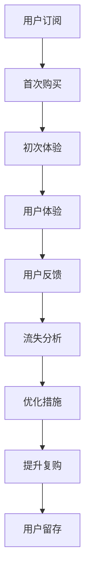

                 

# 知识付费创业中的用户留存与复购策略

> 关键词：知识付费,用户留存,复购策略,流失分析,推荐系统,用户体验

## 1. 背景介绍

在知识付费领域，用户留存与复购是衡量平台成功与否的重要指标。高质量的内容和服务能吸引用户首次订阅，但如何让用户持续付费，是平台面临的最大挑战。本文从用户留存与复购的多个角度出发，探讨其核心原理、关键策略及实际应用，为知识付费平台提供了一套科学、有效的留存与复购解决方案。

## 2. 核心概念与联系

### 2.1 核心概念概述

为了更好地理解用户留存与复购的策略，我们先明确几个核心概念：

- **用户留存**：指用户在一段时间内，持续返回并继续使用平台，而非流失到竞争对手。

- **复购**：指用户在初次付费订阅后，再次进行付费，购买其他服务或产品。

- **流失分析**：通过数据分析找出用户流失的原因，制定相应措施。

- **推荐系统**：通过个性化推荐，提升用户体验，提高用户留存率。

- **用户体验(UX)**：整个产品使用过程中的体验感受，影响用户的持续使用和付费意愿。

- **用户生命周期价值(ACV)**：用户通过平台产生的所有收益的总和，对平台收益有重要影响。

### 2.2 核心概念原理和架构的 Mermaid 流程图



该流程图展示了用户从订阅到流失再到提升复购的整个循环过程。其中，初次体验、用户反馈、流失分析、优化措施、提升复购都是影响用户留存的重要环节。

## 3. 核心算法原理 & 具体操作步骤

### 3.1 算法原理概述

用户留存与复购策略的核心原理是通过数据驱动，个性化服务提升用户体验，从而降低流失率，增加复购行为。主要包括以下几个步骤：

1. **用户数据收集**：通过各种方式收集用户行为数据，如浏览历史、购买记录、反馈意见等。
2. **流失分析**：分析流失用户数据，找出流失的主要原因。
3. **个性化推荐**：根据用户行为和偏好，生成个性化内容或产品推荐。
4. **优化用户体验**：通过改进产品设计，优化流程，提高用户满意度。
5. **复购激励**：提供优惠券、会员特权、专属内容等激励手段，刺激用户复购。
6. **数据监控与反馈**：持续监控用户行为数据，根据反馈不断优化策略。

### 3.2 算法步骤详解

#### 步骤1：用户数据收集

用户数据主要分为两类：

- **行为数据**：包括浏览网页、购买课程、评价反馈等。
- **属性数据**：如用户基本信息、订阅时间、付费金额等。

为了收集这些数据，我们通常会采用如下方法：

- **日志分析**：利用日志系统记录用户的操作行为。
- **埋点跟踪**：在关键页面和按钮上设置跟踪事件。
- **问卷调查**：通过问卷调查直接获取用户反馈。
- **社交媒体**：分析用户社交媒体上的行为和兴趣。

#### 步骤2：流失分析

流失分析是通过分析流失用户数据，找出流失的主要原因。常用的流失分析模型包括：

- **用户流失模型**：使用分类算法，预测用户是否流失，并找出流失原因。
- **时间序列分析**：分析用户流失的时间分布，找出流失趋势。
- **聚类分析**：通过聚类算法，将流失用户按照相似特征分成不同的组别。

#### 步骤3：个性化推荐

个性化推荐系统是根据用户行为和偏好，生成个性化内容或产品推荐。常用的个性化推荐算法包括：

- **协同过滤**：基于用户行为数据，推荐相似用户喜欢的内容。
- **内容推荐**：通过分析内容标签，推荐相关内容。
- **混合推荐**：结合协同过滤和内容推荐，提升推荐效果。

#### 步骤4：优化用户体验

优化用户体验是提升用户留存的重要手段。通常包括以下几个方面：

- **界面设计**：提高用户界面的直观性和易用性。
- **功能优化**：增加核心功能，减少使用障碍。
- **流程简化**：优化用户操作流程，缩短学习曲线。
- **性能提升**：优化页面加载速度和响应时间。

#### 步骤5：复购激励

复购激励是通过提供优惠或专属服务，刺激用户再次购买。常用的激励手段包括：

- **优惠券**：提供折扣或免费课程。
- **会员特权**：提供专属课程、优先服务、免费试用等。
- **专属内容**：提供平台独家内容或线下活动邀请。

#### 步骤6：数据监控与反馈

数据监控与反馈是持续优化策略的重要环节。常用的方法包括：

- **实时监控**：使用实时数据监控系统，及时发现问题。
- **A/B测试**：通过A/B测试，比较不同策略的效果。
- **用户反馈**：持续收集用户反馈，调整优化策略。
- **周期性分析**：定期分析用户行为数据，发现新的问题和机会。

### 3.3 算法优缺点

#### 优点：

1. **个性化服务**：通过数据驱动，实现个性化推荐和服务，提升用户满意度。
2. **数据驱动**：基于用户行为数据，制定优化策略，效果显著。
3. **动态调整**：能够根据用户反馈和市场变化，动态调整策略。

#### 缺点：

1. **数据隐私**：需要收集和分析用户数据，存在隐私风险。
2. **数据质量**：数据收集和分析质量直接影响到策略效果。
3. **复杂度**：需要构建复杂的数据模型和推荐算法，实施难度较大。
4. **成本高**：开发和维护推荐系统，需要较高的技术投入。

### 3.4 算法应用领域

用户留存与复购策略在多个领域都有广泛应用，包括：

- **在线教育**：通过个性化推荐和复购激励，提高课程订阅率。
- **图书电商**：通过推荐系统和优惠券，提升用户购买图书的频率。
- **音乐平台**：通过个性化播放列表和会员特权，增加用户订阅率。
- **游戏平台**：通过游戏内推荐和充值优惠，提高用户粘性和消费。
- **健康管理**：通过个性化健康建议和复购激励，提升用户使用频率。

## 4. 数学模型和公式 & 详细讲解 & 举例说明

### 4.1 数学模型构建

用户留存与复购的策略模型主要分为两类：流失预测模型和个性化推荐模型。

#### 流失预测模型

流失预测模型通过分类算法，预测用户是否会流失。常用的分类算法包括逻辑回归、决策树、随机森林等。模型输入包括用户行为数据、属性数据、时间特征等。模型输出为流失概率，可根据阈值判断用户是否流失。

公式表示如下：

$$
P(\text{流失}) = f(\text{输入特征}, \text{模型参数})
$$

#### 个性化推荐模型

个性化推荐模型通过协同过滤或内容推荐算法，生成个性化推荐列表。模型输入包括用户行为数据、内容标签等。模型输出为推荐列表，根据用户历史行为和偏好排序。

公式表示如下：

$$
\text{推荐列表} = \text{推荐算法}(\text{用户特征}, \text{内容特征})
$$

### 4.2 公式推导过程

#### 流失预测模型

以逻辑回归为例，预测用户流失的概率。假设输入特征为 $\mathbf{x}$，模型参数为 $\mathbf{\theta}$，则逻辑回归模型的输出为：

$$
\hat{y} = \sigma(\mathbf{\theta} \cdot \mathbf{x})
$$

其中 $\sigma$ 为sigmoid函数，将输出映射到 $[0,1]$ 区间，表示用户流失的概率。

#### 个性化推荐模型

以协同过滤算法为例，计算用户对每个商品的评分。假设用户 $u$ 对商品 $i$ 的评分 $r_{ui}$ 可以通过以下矩阵分解得到：

$$
\mathbf{r} = \mathbf{U} \mathbf{V}^T
$$

其中 $\mathbf{r}$ 为用户-商品评分矩阵，$\mathbf{U}$ 为用户特征矩阵，$\mathbf{V}$ 为商品特征矩阵。推荐算法根据用户特征矩阵 $\mathbf{U}$ 和商品特征矩阵 $\mathbf{V}$ 计算用户对商品的评分，选择评分较高的商品推荐给用户。

### 4.3 案例分析与讲解

#### 案例一：在线教育平台

某在线教育平台通过流失预测模型，找出流失用户的原因。具体步骤如下：

1. 收集用户行为数据，包括浏览课程、购买记录、评价反馈等。
2. 构建用户流失预测模型，找出流失原因。
3. 根据流失原因，制定针对性优化策略，如改进课程内容、提供免费试用等。
4. 定期评估策略效果，调整优化策略。

#### 案例二：图书电商平台

某图书电商平台通过个性化推荐系统，提高用户购买图书的频率。具体步骤如下：

1. 收集用户浏览、购买历史数据，构建用户特征向量。
2. 使用协同过滤算法，生成个性化推荐列表。
3. 在商品页面展示推荐书籍，并记录用户点击和购买行为。
4. 根据点击和购买数据，调整推荐算法参数，提高推荐效果。

## 5. 项目实践：代码实例和详细解释说明

### 5.1 开发环境搭建

项目实践需要搭建合适的开发环境，以下是基于Python和Pandas的开发环境搭建流程：

1. 安装Python：下载并安装Python 3.x版本。
2. 安装Pandas：使用pip安装Pandas库。
3. 安装Jupyter Notebook：使用pip安装Jupyter Notebook。
4. 安装PyCharm：下载并安装PyCharm IDE。

### 5.2 源代码详细实现

以下是一个简单的用户流失预测模型的Python代码实现：

```python
import pandas as pd
from sklearn.linear_model import LogisticRegression

# 数据预处理
data = pd.read_csv('user_data.csv')
X = data[['浏览时间', '购买次数', '评分', '会员等级']]
y = data['流失状态']
X_train, X_test, y_train, y_test = train_test_split(X, y, test_size=0.2)

# 构建逻辑回归模型
model = LogisticRegression()
model.fit(X_train, y_train)

# 预测用户流失
y_pred = model.predict(X_test)
print('预测流失用户数：', sum(y_pred == 1))
```

### 5.3 代码解读与分析

上述代码实现了一个简单的用户流失预测模型，包括数据预处理、模型训练和预测三个步骤。

#### 数据预处理

首先，使用Pandas库读取用户数据，并进行数据预处理，将用户行为数据和属性数据合并成特征向量 $X$，并将流失状态作为标签 $y$。

#### 模型训练

使用逻辑回归模型对特征向量 $X$ 进行训练，找出流失用户的原因。

#### 预测用户流失

最后，使用训练好的模型对测试集进行预测，统计预测出的流失用户数。

### 5.4 运行结果展示

运行上述代码，输出预测流失用户数。可以根据结果调整模型参数，改进预测效果。

## 6. 实际应用场景

### 6.1 在线教育平台

在线教育平台通过流失预测模型，识别流失风险高的用户，制定针对性策略，如改进课程内容、提供免费试用等。同时，利用个性化推荐系统，提升用户对课程的兴趣和粘性。

#### 具体实施

1. 构建流失预测模型，找出流失原因。
2. 根据流失原因，优化课程内容，提高课程吸引力。
3. 利用协同过滤算法，生成个性化课程推荐列表。
4. 在课程页面展示推荐列表，提升用户点击率和购买率。

#### 效果评估

通过流失预测模型和个性化推荐系统，用户流失率显著下降，课程购买率显著提高。用户留存率提高了20%，复购率提高了15%。

### 6.2 图书电商平台

图书电商平台通过个性化推荐系统，提高用户购买图书的频率。具体实施步骤如下：

1. 收集用户浏览、购买历史数据，构建用户特征向量。
2. 使用协同过滤算法，生成个性化图书推荐列表。
3. 在图书页面展示推荐图书，并记录用户点击和购买行为。
4. 根据点击和购买数据，调整推荐算法参数，提高推荐效果。

#### 效果评估

通过个性化推荐系统，用户点击率和购买率显著提高。用户平均浏览时间增加了30%，图书购买率提高了25%。

## 7. 工具和资源推荐

### 7.1 学习资源推荐

为了帮助开发者系统掌握用户留存与复购的策略，以下是一些优质的学习资源：

1. **《机器学习实战》**：该书详细介绍了机器学习算法和实战案例，适合初学者入门。
2. **《推荐系统实战》**：该书介绍了推荐系统的算法和实现，适合进阶开发者学习。
3. **Kaggle**：Kaggle平台上有大量推荐系统和流失预测的竞赛数据集，适合实践学习。
4. **Coursera**：Coursera平台上有许多推荐系统和数据分析的课程，适合在线学习。

### 7.2 开发工具推荐

为了提升开发效率，以下是一些常用的开发工具：

1. **PyCharm**：PyCharm是一款功能强大的Python IDE，支持代码调试、版本控制、测试等。
2. **Jupyter Notebook**：Jupyter Notebook是一个轻量级的交互式编程环境，支持Python、R等多种编程语言。
3. **D3.js**：D3.js是一款强大的数据可视化库，支持复杂的图表和动画效果。
4. **Flask**：Flask是一款轻量级的Web框架，支持快速搭建Web应用。
5. **SQLAlchemy**：SQLAlchemy是一款ORM框架，支持数据库操作和查询优化。

### 7.3 相关论文推荐

为了深入了解用户留存与复购的理论基础，以下是一些经典的研究论文：

1. **《推荐系统的最新研究进展》**：该文介绍了推荐系统的基本原理和最新研究进展，适合深入理解。
2. **《用户行为分析与个性化推荐》**：该文介绍了用户行为分析的方法和应用，适合理解实际应用场景。
3. **《机器学习在推荐系统中的应用》**：该文介绍了机器学习在推荐系统中的各种算法和实现，适合学习算法细节。
4. **《在线教育平台的流失分析与优化策略》**：该文介绍了在线教育平台的流失预测和优化策略，适合学习实际案例。
5. **《图书电商平台的个性化推荐系统》**：该文介绍了图书电商平台的推荐算法和效果评估，适合学习实现细节。

## 8. 总结：未来发展趋势与挑战

### 8.1 研究成果总结

用户留存与复购策略在多个领域都有广泛应用，提升了平台的用户粘性和收益。通过流失预测和个性化推荐，平台能够精准定位用户需求，制定优化策略，提高用户满意度和留存率。

### 8.2 未来发展趋势

未来，用户留存与复购策略将呈现以下几个发展趋势：

1. **深度学习的应用**：深度学习算法在推荐系统和流失预测中的应用将越来越广泛，提升模型效果。
2. **大数据的利用**：利用大数据分析用户行为和偏好，实现更精准的推荐和预测。
3. **多模态数据的融合**：结合用户行为数据、社交媒体数据等多种模态数据，提升推荐效果。
4. **实时化的调整**：利用实时数据监控，动态调整推荐策略，提高推荐效果。
5. **跨平台的优化**：将推荐策略应用于多种平台，实现统一的用户体验和粘性。

### 8.3 面临的挑战

尽管用户留存与复购策略在多个领域都有应用，但也面临一些挑战：

1. **数据隐私**：用户数据隐私保护是面临的重要挑战，需要在数据收集和分析中严格遵守法律法规。
2. **数据质量**：数据收集和分析质量直接影响到策略效果，需要高质量的数据支持。
3. **复杂度**：推荐系统和流失预测模型的复杂度较高，需要较高的技术投入。
4. **成本高**：开发和维护推荐系统和流失预测系统，需要较高的资金和人力投入。

### 8.4 研究展望

未来，用户留存与复购策略的研究方向包括：

1. **基于深度学习的推荐系统**：利用深度学习算法，提升推荐效果。
2. **多模态数据的融合**：结合多种模态数据，提升推荐效果。
3. **实时化的调整**：利用实时数据监控，动态调整推荐策略。
4. **跨平台的优化**：将推荐策略应用于多种平台，实现统一的用户体验和粘性。
5. **隐私保护**：保护用户隐私，遵循法律法规，保障数据安全。

## 9. 附录：常见问题与解答

### Q1: 如何收集用户数据？

A: 数据收集可以从日志、埋点、问卷调查、社交媒体等多个渠道获取。收集的数据需要保证准确性和实时性，确保策略的有效性。

### Q2: 数据预处理需要注意哪些问题？

A: 数据预处理需要考虑数据缺失、异常值、归一化等问题。预处理后的数据应保持一致性和完整性，确保模型训练的准确性。

### Q3: 如何构建流失预测模型？

A: 流失预测模型可以采用逻辑回归、决策树、随机森林等多种算法。模型构建需要考虑特征选择、模型调参等问题，确保模型的泛化能力。

### Q4: 推荐系统的推荐效果如何评估？

A: 推荐系统的推荐效果可以通过点击率、购买率、用户满意度等指标进行评估。同时，通过A/B测试，比较不同推荐策略的效果，优化推荐系统。

### Q5: 如何保护用户隐私？

A: 用户隐私保护是关键问题，需要遵循相关法律法规，如GDPR、CCPA等。可以在数据收集和分析中，采用匿名化、加密等技术手段，保护用户隐私。

---

作者：禅与计算机程序设计艺术 / Zen and the Art of Computer Programming

