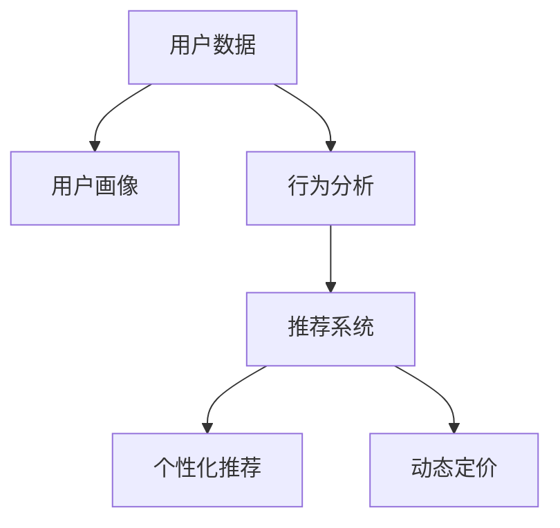

                 

# 知识付费创业中的用户细分与精准服务

> 关键词：知识付费, 用户细分, 精准服务, 数据挖掘, 个性化推荐, 用户画像, 业务增长

## 1. 背景介绍

在知识经济时代，个人提升和终身学习成为主流趋势。知识付费作为在线教育的重要分支，也呈现出快速增长的势头。特别是在新冠疫情背景下，线上学习和工作成为常态，知识付费平台的用户群体持续扩大。如何基于海量用户数据，洞察用户需求，制定精准营销策略，已成为知识付费创业者的核心挑战。

### 1.1 问题由来

随着知识付费平台的快速发展，平台已积累了大规模的用户行为数据。如何从这些数据中挖掘用户价值，为用户提供更加精准和个性化的服务，提升用户体验和留存率，成为亟需解决的关键问题。传统一刀切的运营策略已无法满足用户需求，个性化营销和服务迫在眉睫。

### 1.2 问题核心关键点

通过数据驱动的用户细分和精准服务，可以更好地理解用户行为，提供符合用户需求的个性化内容和服务，从而提高用户满意度和平台粘性。其核心在于以下几个方面：

- 数据收集：如何高效、全面地收集用户数据。
- 用户画像：如何基于数据构建精确的用户画像。
- 行为分析：如何从用户行为中挖掘潜在需求和兴趣。
- 推荐系统：如何通过推荐算法为用户推荐感兴趣的内容和服务。
- 动态定价：如何根据用户价值进行动态定价策略。

本节将从这些问题出发，深入探讨知识付费平台中用户细分与精准服务的技术实现。

## 2. 核心概念与联系

### 2.1 核心概念概述

为更好地理解知识付费平台中的用户细分与精准服务，本节将介绍几个关键概念：

- **用户细分(User Segmentation)**：将全体用户分成若干个具有相同特征的子群体，以提供更有针对性的服务。
- **用户画像(User Persona)**：基于用户数据，构建精细化的用户模型，包含用户基本信息、兴趣偏好、行为特征等。
- **个性化推荐(Personalized Recommendation)**：根据用户画像，通过推荐算法为用户推荐个性化内容。
- **动态定价(Dynamic Pricing)**：基于用户行为和价值，动态调整内容或服务的收费策略，以最大化收益。

这些概念之间的关系可以通过以下Mermaid流程图来展示：



该流程图展示了从数据收集到个性化推荐的全流程，强调了用户画像和行为分析的重要性。

## 3. 核心算法原理 & 具体操作步骤
### 3.1 算法原理概述

知识付费平台的用户细分与精准服务，主要依赖于数据挖掘和机器学习技术。其核心在于：

- **用户画像构建**：通过多维度数据，如人口统计学特征、购买行为、消费偏好等，构建精细化的用户画像，反映用户的真实需求和行为模式。
- **行为分析挖掘**：利用用户行为数据，如点击、浏览、购买记录等，深入挖掘用户的兴趣和需求，为推荐系统提供依据。
- **个性化推荐算法**：基于用户画像和行为数据，通过推荐算法为用户提供符合其需求的内容和服务。
- **动态定价模型**：根据用户行为和支付意愿，动态调整内容或服务的收费策略，以实现收益最大化。

### 3.2 算法步骤详解

#### 3.2.1 数据收集与预处理

数据收集是用户细分与精准服务的第一步。平台应通过多种渠道收集用户数据，包括但不限于：

- **注册信息**：用户基本信息，如年龄、性别、地域等。
- **行为数据**：用户互动行为，如浏览记录、点击率、购买行为等。
- **反馈信息**：用户评价、评分、留言等。

数据收集完成后，需要进行预处理，包括去噪、标准化、归一化等，以便后续分析和建模。

#### 3.2.2 用户画像构建

用户画像构建需要从多个维度对用户进行建模，包括：

- **人口统计学特征**：如年龄、性别、教育背景、职业等。
- **兴趣偏好**：如内容偏好、学习目的、学习时间等。
- **行为特征**：如学习路径、课程选择、购买历史等。

常用的方法包括K-means聚类、决策树、随机森林等，通过机器学习算法构建用户画像。

#### 3.2.3 行为分析与需求挖掘

行为分析旨在从用户行为数据中挖掘潜在需求和兴趣。常用的方法包括：

- **关联规则挖掘**：如Apriori算法、FP-growth算法等，用于发现用户行为之间的关联。
- **序列模式挖掘**：如AprioriSequence算法、FPPRO算法等，用于分析用户行为序列。

通过行为分析，可以发现用户的潜在需求和兴趣，为个性化推荐提供依据。

#### 3.2.4 个性化推荐算法

个性化推荐算法旨在根据用户画像和行为数据，为用户推荐感兴趣的内容。常用的推荐算法包括：

- **协同过滤**：基于用户行为和相似用户行为进行推荐，如矩阵分解算法、基于用户的协同过滤算法、基于物品的协同过滤算法等。
- **基于内容的推荐**：基于用户已有的兴趣偏好和内容属性进行推荐。
- **混合推荐算法**：结合多种推荐方法，提高推荐精度和鲁棒性。

#### 3.2.5 动态定价策略

动态定价策略旨在根据用户行为和支付意愿，动态调整内容或服务的收费策略。常用的方法包括：

- **基于价值的定价**：根据用户对内容的价值评估进行定价，如拍卖机制、用户反馈定价等。
- **基于市场的定价**：根据市场需求和竞争情况进行定价，如动态定价算法、基于竞争的市场定价算法等。

### 3.3 算法优缺点

用户细分与精准服务算法具有以下优点：

- **提高用户体验**：通过个性化推荐，提供符合用户需求的内容和服务，提升用户满意度。
- **优化资源配置**：根据用户需求，优化内容和服务供给，提高资源利用效率。
- **增加用户粘性**：通过精准服务，提升用户留存率和忠诚度。

同时，该算法也存在以下缺点：

- **数据隐私风险**：用户数据的收集和使用可能引发隐私和安全问题。
- **模型复杂度**：构建和维护用户画像和推荐模型需要大量计算资源。
- **用户习惯变化**：用户行为和需求可能随时间变化，模型需要持续更新和调整。

### 3.4 算法应用领域

用户细分与精准服务算法广泛应用于知识付费平台中，其应用领域包括：

- **内容推荐**：为用户推荐感兴趣的课程、文章、视频等。
- **学习路径规划**：根据用户学习历史和兴趣，推荐合适的学习路径。
- **动态定价**：根据用户行为和支付意愿，调整课程和服务的收费策略。
- **个性化服务**：提供个性化客服、专属导师等定制化服务。
- **用户留存和忠诚度提升**：通过精准营销和个性化服务，提升用户留存率和忠诚度。

## 4. 数学模型和公式 & 详细讲解 & 举例说明

### 4.1 数学模型构建

本节将使用数学语言对知识付费平台中的用户细分与精准服务过程进行严格刻画。

假设平台有N个用户，每个用户i的行为数据为Xi，用户画像为Ui，行为分析结果为Yi。个性化推荐算法为R，动态定价模型为P。用户行为与推荐结果之间的损失函数为L。

定义模型为：

$$
Ui = f(Xi)
$$

其中 $f$ 为数据挖掘和机器学习算法，如K-means聚类、协同过滤等。

行为分析结果为：

$$
Yi = g(Xi)
$$

其中 $g$ 为行为分析算法，如关联规则挖掘、序列模式挖掘等。

个性化推荐结果为：

$$
R(Yi) = Zi
$$

其中 $Zi$ 为用户对推荐内容的评分或点击次数，$R$ 为推荐算法，如协同过滤、基于内容的推荐等。

动态定价结果为：

$$
P(Zi) = Wi
$$

其中 $W$ 为用户对内容或服务的支付意愿，$P$ 为动态定价模型，如基于价值的定价、基于市场的定价等。

优化目标为：

$$
\min_{Ui, Yi, Zi, Wi} L(R(Yi), Zi) + L(P(Zi), Wi)
$$

通过最小化损失函数，实现个性化推荐和动态定价的最优化。

### 4.2 公式推导过程

以协同过滤推荐算法为例，推导其优化目标和公式。

协同过滤算法基于用户行为数据构建用户-物品关联矩阵，通过矩阵分解得到用户和物品的潜在因子，再根据潜在因子计算推荐分数。设用户i和物品j的潜在因子为$Ui$和$Vj$，推荐分数为$Fij$。

优化目标为：

$$
\min_{Ui, Vj} \sum_{i=1}^N \sum_{j=1}^M (R_{ij} - Fij)^2
$$

其中 $R_{ij}$ 为用户i对物品j的评分或点击次数。

使用矩阵分解方法，将$Ui$和$Vj$表示为低秩矩阵的乘积：

$$
Ui = U_i \cdot W_i
$$

$$
Vj = V_j \cdot H_j
$$

其中 $U_i$ 和 $V_j$ 分别为用户i和物品j的潜在因子矩阵，$W_i$ 和 $H_j$ 分别为用户i和物品j的低秩因子矩阵。

代入优化目标，得：

$$
\min_{Ui, Vj} \sum_{i=1}^N \sum_{j=1}^M (R_{ij} - Ui \cdot Vj)^2
$$

使用矩阵求导，可得：

$$
\frac{\partial L}{\partial Ui} = -2 \sum_{j=1}^M (R_{ij} - Ui \cdot Vj) \cdot Vj
$$

$$
\frac{\partial L}{\partial Vj} = -2 \sum_{i=1}^N (R_{ij} - Ui \cdot Vj) \cdot Ui
$$

通过求解上述优化问题，即可得到用户i和物品j的潜在因子，进而计算推荐分数。

### 4.3 案例分析与讲解

假设某知识付费平台有10000个用户，平台提供200门课程，每个用户有50门课程的评分数据。平台希望通过协同过滤算法为用户推荐感兴趣的新课程。

1. **数据收集**：
   - 收集每个用户的评分数据，构建用户-物品关联矩阵。
   - 使用K-means算法对用户进行聚类，构建用户画像。

2. **行为分析**：
   - 使用Apriori算法挖掘用户行为数据中的关联规则。
   - 通过序列模式挖掘，分析用户行为序列，发现用户偏好课程类型。

3. **个性化推荐**：
   - 使用矩阵分解算法对用户和物品进行低秩分解，得到潜在因子。
   - 根据推荐分数，推荐与用户兴趣匹配度高的课程。

4. **动态定价**：
   - 根据用户对课程的评分和支付意愿，使用基于价值的定价算法，调整课程价格。
   - 使用市场分析工具，根据竞争对手价格，动态调整课程价格。

通过以上步骤，平台可以为每个用户推荐最适合的课程，同时动态调整课程价格，以最大化收益。

## 5. 项目实践：代码实例和详细解释说明

### 5.1 开发环境搭建

在进行用户细分与精准服务项目实践前，我们需要准备好开发环境。以下是使用Python进行Spark和Scikit-learn开发的环境配置流程：

1. 安装Anaconda：从官网下载并安装Anaconda，用于创建独立的Python环境。

2. 创建并激活虚拟环境：
```bash
conda create -n spark-env python=3.8 
conda activate spark-env
```

3. 安装PySpark：根据CUDA版本，从官网获取对应的安装命令。例如：
```bash
conda install pyspark
```

4. 安装Scikit-learn：
```bash
pip install scikit-learn
```

5. 安装各类工具包：
```bash
pip install numpy pandas matplotlib IPython
```

完成上述步骤后，即可在`spark-env`环境中开始项目实践。

### 5.2 源代码详细实现

下面我们以协同过滤推荐系统为例，给出使用Spark和Scikit-learn对协同过滤推荐系统进行开发的PySpark代码实现。

首先，定义推荐系统的数据处理函数：

```python
from pyspark.sql import SparkSession
from pyspark.ml.recommendation import ALS
from sklearn.metrics.pairwise import pairwise_distances_argmin

spark = SparkSession.builder.appName("Recommender System").getOrCreate()

# 读取用户评分数据
df = spark.read.format("csv").option("header", "true").load("ratings.csv")

# 特征工程
df = df.drop("userId", "movieId").select("rating")
userFactor = df.withColumn("userId", "userId")
itemFactor = df.withColumn("movieId", "movieId")
df = df.join(userFactor, "userId").join(itemFactor, "movieId")

# 构建协同过滤模型
als = ALS(k=10, iterations=10, regParam=0.1, userCol="userId", itemCol="movieId", ratingCol="rating")
model = als.fit(df)

# 计算推荐分数
df["predictedRatings"] = model.transform(df).select("userId", "movieId", "predictions").rdd.map(lambda row: (row["userId"], row["movieId"], row["predictions"][0])).toDF()

# 求推荐列表
df = df.join(df["predictedRatings"], "userId")
df = df.join(df["predictedRatings"], "movieId")
df = df.drop("userId", "movieId")

# 计算用户-物品相似度
similarity = pairwise_distances(df["predictedRatings"].values, df["predictedRatings"].values)
```

然后，定义推荐系统函数：

```python
from pyspark.sql.functions import col, asin, sqrt, row_number, rank

# 计算推荐列表
def recommend(user, n=10):
    # 获取用户评分
    df = df.select("movieId", "predictedRatings").where("userId = " + str(user))

    # 计算用户-物品相似度
    similarity = similarity.filter(col("movieId") == user)

    # 根据相似度排序
    df = df.join(similarity, "movieId")
    df = df.rdd.map(lambda row: (row[0], row[1], row[2])).toDF()

    # 筛选推荐列表
    df = df.sort(col("predictedRatings"), ascending=False).limit(n)
    
    # 计算平均值
    df = df.select(col("movieId"), col("predictedRatings").sum() / df.count())
    
    return df

# 计算推荐分数
def calculateRatings(user, item):
    # 获取用户评分
    df = df.select("movieId", "predictedRatings").where("userId = " + str(user))
    
    # 获取物品评分
    itemRatings = df.filter("movieId = " + str(item))
    
    # 计算推荐分数
    df = df.join(itemRatings, "movieId")
    df = df.select(col("predictedRatings"))
    
    return df
```

最后，启动推荐系统并输出推荐结果：

```python
user = 1
recommendList = recommend(user)
recommendList.show()

# 计算推荐分数
recommendScore = calculateRatings(user, "1")
recommendScore.show()
```

以上就是使用PySpark和Scikit-learn对协同过滤推荐系统进行开发的完整代码实现。可以看到，通过Spark的高性能计算和Scikit-learn的丰富算法库，推荐系统的开发和优化变得相对简单高效。

### 5.3 代码解读与分析

让我们再详细解读一下关键代码的实现细节：

**RecommendationSystem类**：
- `__init__`方法：初始化SparkSession和数据加载。
- `df`：数据加载函数，将用户评分数据加载为DataFrame。
- `userFactor`和`itemFactor`：特征工程函数，将评分数据转化为用户和物品因子。
- `als`：协同过滤模型，指定模型参数和算法。
- `model`：模型训练函数，使用ALS算法进行协同过滤训练。
- `df["predictedRatings"]`：推荐分数计算函数，将模型预测分数计算出来。
- `df["predictedRatings"].values`：相似度计算函数，计算用户-物品相似度。
- `recommend`函数：推荐列表计算函数，根据用户和物品相似度计算推荐列表。
- `calculateRatings`函数：推荐分数计算函数，根据用户和物品评分计算推荐分数。

**推荐系统函数**：
- 使用`ALS`算法训练协同过滤模型。
- 根据模型预测的评分，计算用户-物品相似度。
- 通过相似度排序，筛选推荐列表。
- 计算推荐分数，返回推荐结果。

可以看到，Spark和Scikit-learn在协同过滤推荐系统的开发中，提供了强大的数据处理和算法支持，大大提高了开发效率和模型精度。

当然，工业级的系统实现还需考虑更多因素，如模型的保存和部署、超参数的自动搜索、推荐算法的多样化等。但核心的推荐范式基本与此类似。

## 6. 实际应用场景
### 6.1 智能推荐系统

智能推荐系统是知识付费平台的核心功能之一。通过协同过滤推荐算法，平台可以为用户推荐感兴趣的课程和文章，提升用户粘性和留存率。推荐系统的精准度直接影响用户体验和平台收益。

### 6.2 学习路径规划

学习路径规划通过用户历史数据，为用户推荐合适的学习路径，提高学习效率和效果。平台可以根据用户的学习进度、偏好和需求，动态调整课程顺序和难度，使其更符合用户需求。

### 6.3 个性化课程设计

个性化课程设计通过用户画像和行为分析，设计符合用户兴趣和需求的课程内容，提升用户满意度和课程质量。平台可以根据用户的学习行为和反馈，动态调整课程结构和教学内容，以更好地满足用户需求。

### 6.4 未来应用展望

随着用户细分与精准服务技术的不断发展，知识付费平台将能够提供更加个性化、高效的服务，提升用户体验和平台收益。未来，推荐系统将在内容推荐、学习路径规划、个性化课程设计等多个领域发挥重要作用，推动知识付费平台的进一步创新和发展。

## 7. 工具和资源推荐
### 7.1 学习资源推荐

为了帮助开发者系统掌握用户细分与精准服务的理论基础和实践技巧，这里推荐一些优质的学习资源：

1. 《推荐系统实战》系列博文：由数据科学家撰写，深入浅出地介绍了推荐系统的理论基础、算法实现和实际应用。

2. 《机器学习实战》课程：网易云课堂上的经典机器学习课程，涵盖了多种机器学习算法和实战项目，适合初学者和进阶者。

3. 《Recommender Systems》书籍：推荐系统领域的经典教材，涵盖了推荐算法、评估指标和实际应用，是推荐系统的必读书籍。

4. Coursera推荐系统专项课程：由斯坦福大学开设的推荐系统课程，深入浅出地介绍了推荐系统的基本原理和算法，适合广大学习者。

5. Kaggle推荐系统竞赛：Kaggle上的推荐系统竞赛，通过实战项目提升推荐系统的开发和优化能力。

通过对这些资源的学习实践，相信你一定能够快速掌握推荐系统的精髓，并用于解决实际的推荐问题。

### 7.2 开发工具推荐

高效的开发离不开优秀的工具支持。以下是几款用于推荐系统开发的常用工具：

1. PySpark：基于Scala和Java的分布式计算框架，适合大规模数据处理。

2. Scikit-learn：Python机器学习库，提供了丰富的算法实现，适合推荐系统开发。

3. TensorFlow：谷歌开源的深度学习框架，支持多种推荐算法，适合深度学习方向的开发。

4. H2O.ai：开源的机器学习平台，提供了丰富的推荐系统算法和工具，适合工业级的推荐系统开发。

5. RapidMiner：开源的数据科学平台，提供了可视化界面和丰富的算法库，适合快速原型开发。

6. RapidAPI：提供API接口的市场，可以方便地集成第三方推荐服务，扩展推荐系统的功能。

合理利用这些工具，可以显著提升推荐系统的开发效率，加快创新迭代的步伐。

### 7.3 相关论文推荐

推荐系统的发展源于学界的持续研究。以下是几篇奠基性的相关论文，推荐阅读：

1. SimRank：提出基于图论的相似度计算方法，为协同过滤推荐算法提供理论基础。

2. Trust-based Recommender Systems：探讨基于信任关系的推荐算法，提升推荐系统的鲁棒性。

3. Hybrid Recommender Systems：提出混合推荐算法，结合多种推荐方法，提升推荐精度和鲁棒性。

4. Factorization Machines for Recommender Systems：提出基于矩阵分解的推荐算法，提升推荐模型的表达能力。

5. Large-scale Machine Learning in Recommender Systems：讨论大规模推荐系统的优化方法，包括数据分布、算法并行等。

这些论文代表了大规模推荐系统的发展脉络。通过学习这些前沿成果，可以帮助研究者把握学科前进方向，激发更多的创新灵感。

## 8. 总结：未来发展趋势与挑战

### 8.1 总结

本文对知识付费平台中的用户细分与精准服务技术进行了全面系统的介绍。首先阐述了用户细分与精准服务在知识付费平台中的重要性和背景，明确了其在提高用户体验和平台收益方面的独特价值。其次，从原理到实践，详细讲解了推荐系统的数学模型和关键步骤，给出了推荐系统开发的完整代码实例。同时，本文还广泛探讨了推荐系统在智能推荐系统、学习路径规划、个性化课程设计等多个领域的应用前景，展示了推荐系统的广泛适用性和强大潜力。此外，本文精选了推荐系统的各类学习资源，力求为读者提供全方位的技术指引。

通过本文的系统梳理，可以看到，推荐系统作为知识付费平台的核心功能之一，在平台运营和用户体验方面发挥着重要作用。其高效、精准的用户推荐服务，可以显著提升用户粘性和留存率，增加平台收益。未来，伴随推荐技术的不断演进，推荐系统必将在知识付费平台中发挥更大的价值，推动平台业务的不断增长。

### 8.2 未来发展趋势

展望未来，推荐系统将呈现以下几个发展趋势：

1. 智能推荐引擎：推荐系统将与自然语言处理、语音识别等技术深度融合，提供更加智能、自然的推荐服务。
2. 深度学习推荐模型：深度学习推荐模型，如神经协同过滤，将提升推荐精度和泛化能力，适应更复杂的推荐场景。
3. 个性化推荐模型：基于用户动态行为数据，不断调整推荐策略，提升推荐系统的个性化水平。
4. 跨模态推荐系统：结合用户的多模态数据，如文本、图像、语音等，提升推荐系统的表达能力和鲁棒性。
5. 推荐系统自动化：通过自动化推荐策略的配置和优化，提升推荐系统的开发效率和优化效果。

这些趋势凸显了推荐系统技术的广阔前景。这些方向的探索发展，必将进一步提升推荐系统的性能和适用性，为知识付费平台带来新的增长点。

### 8.3 面临的挑战

尽管推荐系统已经取得了显著的成就，但在迈向更加智能化、普适化应用的过程中，它仍面临着诸多挑战：

1. 数据隐私和安全：用户数据的收集和使用可能引发隐私和安全问题，平台需要加强数据保护和隐私管理。
2. 数据质量问题：用户数据可能存在缺失、噪声等问题，影响推荐系统的准确性。
3. 模型复杂度：推荐系统模型复杂，需要大量的计算资源和时间进行训练和优化。
4. 推荐算法多样性：不同的推荐算法适用于不同的场景和需求，选择合适的算法是推荐系统的关键。
5. 用户行为变化：用户行为和需求可能随时间变化，推荐系统需要持续更新和调整。

正视推荐系统面临的这些挑战，积极应对并寻求突破，将有助于推荐系统技术的进一步成熟和发展。

### 8.4 研究展望

面对推荐系统面临的挑战，未来的研究需要在以下几个方面寻求新的突破：

1. 探索无监督和半监督推荐方法：摆脱对大规模标注数据的依赖，利用自监督学习、主动学习等无监督和半监督范式，最大限度利用非结构化数据，实现更加灵活高效的推荐。

2. 研究参数高效和计算高效的推荐范式：开发更加参数高效的推荐方法，在固定大部分推荐参数的同时，只更新极少量的推荐任务相关参数。同时优化推荐模型的计算图，减少前向传播和反向传播的资源消耗，实现更加轻量级、实时性的部署。

3. 引入更多先验知识：将符号化的先验知识，如知识图谱、逻辑规则等，与推荐系统进行巧妙融合，引导推荐过程学习更准确、合理的推荐模型。同时加强不同模态数据的整合，实现视觉、语音等多模态信息与文本信息的协同建模。

4. 引入因果分析和博弈论工具：将因果分析方法引入推荐系统，识别出推荐决策的关键特征，增强推荐输出的因果性和逻辑性。借助博弈论工具刻画人机交互过程，主动探索并规避推荐系统的脆弱点，提高系统稳定性。

5. 纳入伦理道德约束：在推荐系统训练目标中引入伦理导向的评估指标，过滤和惩罚有偏见、有害的推荐结果，确保推荐系统的公正性和伦理性。

这些研究方向的探索，必将引领推荐系统技术迈向更高的台阶，为知识付费平台提供更加智能、个性化的推荐服务，推动平台业务的不断增长。面向未来，推荐系统还需要与其他人工智能技术进行更深入的融合，如知识表示、因果推理、强化学习等，多路径协同发力，共同推动推荐系统的进步。只有勇于创新、敢于突破，才能不断拓展推荐系统的边界，让推荐技术更好地服务知识付费平台的用户。

## 9. 附录：常见问题与解答

**Q1：推荐系统如何避免过拟合？**

A: 推荐系统过拟合主要表现在推荐结果对历史数据的过度拟合，导致推荐结果缺乏泛化能力。为避免过拟合，可以采取以下措施：

1. **数据增强**：通过对历史数据进行噪声注入、数据合成等方法，增强数据的多样性，减少模型对单一数据点的依赖。

2. **正则化**：使用L1、L2正则化等方法，限制模型参数的大小，防止模型过于复杂。

3. **降维**：使用PCA、LDA等降维方法，减少数据维度和计算复杂度，提高模型泛化能力。

4. **模型集成**：通过集成多个推荐模型，综合多个模型的预测结果，提升推荐系统的鲁棒性。

**Q2：推荐系统如何处理长尾问题？**

A: 长尾问题指的是某些物品的销量较低，但在推荐系统中可能会被忽略。为解决长尾问题，可以采取以下措施：

1. **冷启动策略**：对于新物品，可以使用基线推荐模型，如流行度推荐，提升新物品的曝光机会。

2. **多样性推荐**：在推荐结果中引入多样性，避免用户只看到流行物品，增加新物品的曝光机会。

3. **冷启动推荐**：对于新用户，可以使用基于用户特征和行为模式的推荐算法，提升新用户的满意度。

4. **动态调整推荐策略**：根据用户反馈和行为数据，动态调整推荐策略，提升推荐效果。

**Q3：推荐系统如何处理用户兴趣变化？**

A: 用户兴趣和需求可能会随时间变化，为应对这一问题，可以采取以下措施：

1. **实时学习**：通过实时学习算法，不断调整推荐模型，适应用户兴趣的变化。

2. **多模态数据融合**：结合用户的多模态数据，如文本、图像、语音等，提升推荐系统的表达能力和鲁棒性。

3. **动态推荐策略**：根据用户的行为变化，动态调整推荐策略，提升推荐效果。

**Q4：推荐系统如何处理数据不平衡问题？**

A: 数据不平衡问题指的是某些类别的数据量远大于其他类别，导致推荐系统对少数类别的物品推荐效果不佳。为解决这一问题，可以采取以下措施：

1. **数据重采样**：通过数据重采样方法，平衡各类别的数据量，减少推荐偏差。

2. **类别均衡算法**：使用类别均衡算法，提升少数类别的推荐效果。

3. **不平衡数据处理**：在推荐模型中引入不平衡数据处理技术，提高少数类别的推荐精度。

**Q5：推荐系统如何处理用户动态行为？**

A: 用户行为可能会随时间变化，为应对这一问题，可以采取以下措施：

1. **动态用户画像**：通过动态更新用户画像，实时反映用户的兴趣和需求。

2. **行为追踪**：通过行为追踪技术，实时监控用户的兴趣变化，动态调整推荐策略。

3. **行为预测**：使用行为预测算法，预测用户的未来行为，提前进行推荐。

这些方法可以结合使用，综合应对推荐系统面临的各种挑战，提升推荐系统的性能和适用性。

---

作者：禅与计算机程序设计艺术 / Zen and the Art of Computer Programming

