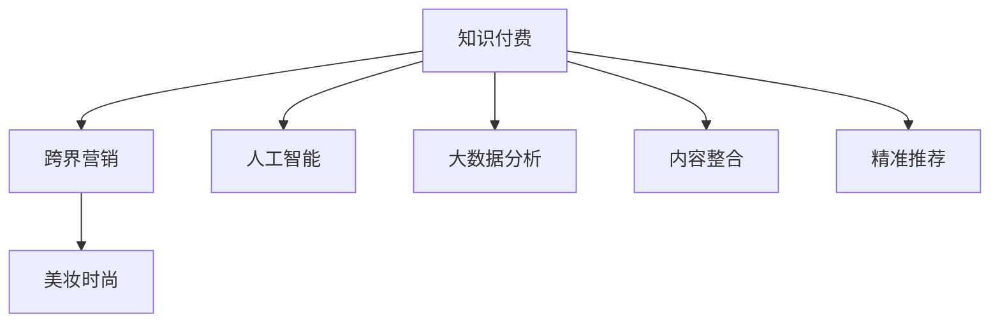

                 

# 知识付费如何实现跨界营销与美妆时尚跨界？

> 关键词：知识付费, 跨界营销, 美妆时尚, 人工智能, 大数据分析, 内容整合, 精准推荐

## 1. 背景介绍

在数字化和互联网时代的浪潮下，知识付费作为一种新兴的商业模式，正迅速崛起，成为连接知识和商业的新桥梁。这一模式不仅满足了人们对高质量知识内容的需求，还为内容创作者提供了稳定的收入来源。知识付费的兴起，为各行各业带来了新的发展机遇，尤其是与传统行业结合，打开了跨界营销的新路径。

随着互联网与生活场景的深度融合，知识付费平台的营销范围不再局限于知识类内容，而是延伸到了美妆、时尚等多元化领域。这种跨界营销不仅为知识付费平台带来新的用户流量和商业机会，也为美妆和时尚品牌带来了新的营销手段和品牌曝光机会。本文将探讨知识付费平台如何通过技术手段实现与美妆时尚的跨界融合，挖掘跨界营销的潜力。

## 2. 核心概念与联系

### 2.1 核心概念概述

为更好地理解知识付费与美妆时尚的跨界营销，本节将介绍几个密切相关的核心概念：

- **知识付费**：一种以知识内容为核心的付费模式，用户通过支付一定费用，获取特定知识服务，如在线课程、电子书、音频节目等。
- **跨界营销**：指企业或品牌跨越传统边界，通过创新手段与不同领域的合作伙伴或用户群体进行互动和合作，以实现资源共享、市场扩展和品牌价值提升的营销策略。
- **美妆时尚**：涵盖美容护肤、时尚穿搭、化妆品品牌等多个方面，是一个充满创意和活力的行业领域。
- **人工智能**：利用机器学习和深度学习等技术，实现数据的自动化分析和智能决策。
- **大数据分析**：通过收集和分析海量数据，发现数据之间的关联和规律，为决策提供依据。
- **内容整合**：将不同来源的内容进行有机整合，形成一个统一的信息输出体系，提升用户体验和内容价值。
- **精准推荐**：基于用户行为和兴趣数据，为用户推荐最匹配的内容和产品，提升用户粘性和满意度。

这些核心概念之间的逻辑关系可以通过以下Mermaid流程图来展示：



这个流程图展示了这个体系的各个组成部分及其相互作用：

1. 知识付费作为核心，通过提供高质量的知识内容吸引用户。
2. 通过跨界营销手段，将知识付费的内容与美妆时尚等非知识类内容结合，拓展市场。
3. 借助人工智能和大数据分析，提升跨界营销的精准度和效果。
4. 通过内容整合和精准推荐技术，优化用户体验，提升品牌价值。

## 3. 核心算法原理 & 具体操作步骤
### 3.1 算法原理概述

知识付费与美妆时尚的跨界营销，本质上是通过技术手段将两个领域的内容和服务进行深度融合，形成一个有机的整体。这一过程主要分为以下几个步骤：

1. **内容挖掘与整合**：通过大数据分析技术，从海量知识付费内容和美妆时尚内容中挖掘出共性和关联点，进行内容整合。
2. **用户画像构建**：基于用户的知识付费行为和美妆时尚行为数据，构建全面的用户画像，挖掘用户的兴趣和偏好。
3. **精准推荐系统设计**：根据用户画像和内容特征，设计精准推荐算法，为用户推荐最适合的知识付费和美妆时尚内容。
4. **跨界营销策略制定**：结合不同领域的营销特点，制定跨界营销策略，如联合直播、跨界合作、品牌联名等。
5. **效果评估与优化**：通过A/B测试和数据分析，评估跨界营销效果，优化推荐算法和营销策略。

### 3.2 算法步骤详解

#### 3.2.1 内容挖掘与整合

内容挖掘与整合是跨界营销的基础。具体步骤如下：

1. **数据收集与清洗**：从知识付费平台和美妆时尚平台收集相关内容数据，并进行数据清洗和预处理。
2. **内容相似度计算**：使用文本相似度算法（如余弦相似度、Jaccard相似度等）计算知识付费内容和美妆时尚内容之间的相似度。
3. **主题模型构建**：使用LDA（Latent Dirichlet Allocation）等主题模型，从内容中挖掘出共性和关联主题。
4. **内容整合与展示**：将相关内容进行有机整合，形成新的跨界内容体系，如将美妆知识与护肤教程结合，形成美容护肤课程。

#### 3.2.2 用户画像构建

用户画像的构建是精准推荐的基础。具体步骤如下：

1. **数据收集与预处理**：收集用户在知识付费和美妆时尚领域的行为数据，如浏览记录、购买记录、评分反馈等。
2. **用户兴趣建模**：使用协同过滤、内容推荐等技术，构建用户兴趣模型，挖掘用户的长期兴趣和短期行为。
3. **画像维度分析**：将用户画像按不同维度进行分类和分析，如年龄、性别、地域、消费水平等，形成全面的用户画像。
4. **画像融合与优化**：将知识付费和美妆时尚的用户画像进行融合，形成跨领域的用户画像，并通过模型优化提升画像准确度。

#### 3.2.3 精准推荐系统设计

精准推荐系统是实现跨界营销的核心。具体步骤如下：

1. **推荐算法设计**：使用协同过滤、矩阵分解、神经网络等推荐算法，构建跨界推荐模型。
2. **模型训练与优化**：使用用户行为数据和内容特征，训练推荐模型，并进行模型优化和调整。
3. **推荐结果展示**：将推荐结果通过知识付费平台和美妆时尚平台进行展示，如在知识付费文章页面添加美妆产品广告。
4. **效果评估与反馈**：通过用户反馈和点击率等指标，评估推荐效果，并进行持续优化。

#### 3.2.4 跨界营销策略制定

跨界营销策略的设计是实现跨界营销的关键。具体步骤如下：

1. **市场调研与分析**：进行市场调研和数据分析，了解目标用户群体的需求和偏好。
2. **联合营销方案设计**：设计联合营销方案，如知识付费与美妆品牌联合直播、跨界品牌联名等。
3. **营销活动执行与推广**：执行跨界营销活动，并通过多渠道推广，如社交媒体、广告、邮件等。
4. **效果监测与分析**：通过数据分析和用户反馈，监测跨界营销效果，并分析成功因素和改进方向。

#### 3.2.5 效果评估与优化

效果评估与优化是确保跨界营销成功的保障。具体步骤如下：

1. **数据收集与分析**：收集跨界营销相关数据，如用户点击率、购买率、转化率等。
2. **A/B测试与对比分析**：通过A/B测试，对比不同营销策略和推荐算法的效果，选择最佳方案。
3. **持续优化与迭代**：根据数据分析结果和用户反馈，不断优化推荐算法和营销策略，实现持续迭代。

### 3.3 算法优缺点

知识付费与美妆时尚的跨界营销，使用技术手段进行内容整合和精准推荐，具有以下优点：

1. **提升用户体验**：通过个性化推荐和跨界内容整合，提升用户体验和满意度。
2. **扩展市场范围**：将知识付费内容与美妆时尚内容结合，拓展市场，吸引更多用户。
3. **提升品牌价值**：通过跨界营销，提升品牌知名度和影响力。
4. **提升营销效果**：通过精准推荐和数据分析，提升营销活动的ROI。

但同时，这一过程也存在以下缺点：

1. **技术复杂度较高**：内容挖掘、用户画像构建、推荐算法设计等环节技术难度较高，需要专业人才支持。
2. **数据隐私和安全问题**：用户数据的收集和处理可能涉及隐私和安全问题，需要严格遵守相关法律法规。
3. **成本较高**：技术开发和维护成本较高，可能难以立即看到投资回报。

### 3.4 算法应用领域

知识付费与美妆时尚的跨界营销，在以下领域具有广泛应用：

1. **知识付费平台**：通过跨界营销，吸引更多用户，提升平台流量和用户粘性。
2. **美妆品牌**：通过联合营销和精准推荐，提升品牌知名度和销售额。
3. **时尚品牌**：通过跨界合作和品牌联名，拓展市场，提升品牌影响力。
4. **广告商**：通过跨界广告和推荐广告，提高广告投放效果和ROI。
5. **内容创作者**：通过跨界合作和内容联合，提升内容影响力，吸引更多用户关注。

这些应用领域展示了跨界营销的广泛前景，为知识付费和美妆时尚领域的融合提供了新的发展机遇。

## 4. 数学模型和公式 & 详细讲解 & 举例说明
### 4.1 数学模型构建

本节将使用数学语言对知识付费与美妆时尚的跨界营销过程进行更加严格的刻画。

记知识付费内容为 $K$，美妆时尚内容为 $C$，用户画像为 $U$，推荐算法为 $R$。

1. **内容挖掘与整合的数学模型**：
   - 内容相似度计算：$S_{ij} = \text{similarity}(K_i, C_j)$
   - 主题模型构建：$T = \text{LDA}(K \cup C)$
   - 内容整合与展示：$K' = \{ K_i \in K | S_{ij} > \theta \}$

2. **用户画像构建的数学模型**：
   - 用户兴趣建模：$I = \text{CVR}(K_i \cup C_j)$
   - 画像维度分析：$P = \{ (a, b, c) | a \in U, b \in K', c \in C' \}$
   - 画像融合与优化：$P' = \text{MLP}(P)$

3. **精准推荐系统的数学模型**：
   - 推荐算法设计：$R_{ij} = \text{CF}(I_i, C_j)$
   - 模型训练与优化：$R' = \text{GD}(R_{ij}, U_j)$
   - 推荐结果展示：$C' = R'(K_i, U_j)$
   - 效果评估与反馈：$E = \text{IR}(C', K_i)$

4. **跨界营销策略的数学模型**：
   - 联合营销方案设计：$M = \{ (K', C', A) | A \in \text{Co}(K, C) \}$
   - 营销活动执行与推广：$B = \text{Marketing}(M)$
   - 效果监测与分析：$E' = \text{IDA}(B)$

5. **效果评估与优化的数学模型**：
   - 数据收集与分析：$D = \{ (K_i, C_i, U_j) | (K_i, C_i, U_j) \in D \}$
   - A/B测试与对比分析：$A = \text{A/BTest}(D)$
   - 持续优化与迭代：$O = \text{ContinuousOptimization}(A)$

### 4.2 公式推导过程

以用户画像构建的数学模型为例，推导具体的公式和算法。

1. **用户兴趣建模**：使用协同过滤算法，计算用户对知识付费内容 $K_i$ 和美妆时尚内容 $C_j$ 的兴趣：
   - $I_{ij} = \frac{1}{\sum_{k=1}^{N} w_{ik} w_{kj}} \sum_{k=1}^{N} w_{ik} w_{kj} \times F(K_i, C_j)$
   其中，$w_{ik}$ 和 $w_{kj}$ 为权重，$F(K_i, C_j)$ 为相似度函数，如余弦相似度。

2. **画像维度分析**：将用户画像 $U_j$ 按不同维度进行分类和分析，如年龄、性别、地域、消费水平等，形成全面的用户画像。
   - $P_{a,b,c} = \text{CVR}(I_{ij}, P_{a,b,c})$
   其中，$P_{a,b,c}$ 为画像特征向量，$CVR$ 为内容推荐算法。

3. **画像融合与优化**：将知识付费和美妆时尚的用户画像进行融合，形成跨领域的用户画像。
   - $P'_j = \text{MLP}(P_{a,b,c})$
   其中，$\text{MLP}$ 为多层感知器，进行画像融合和优化。

### 4.3 案例分析与讲解

以知识付费平台与美妆品牌联合直播为例，展示跨界营销的实现过程。

1. **数据收集与预处理**：
   - 知识付费平台收集用户浏览记录和购买记录。
   - 美妆品牌收集用户购买记录和反馈数据。

2. **用户画像构建**：
   - 使用协同过滤算法，构建用户对知识付费内容的兴趣模型。
   - 使用内容推荐算法，构建用户对美妆时尚内容的兴趣模型。

3. **内容挖掘与整合**：
   - 使用文本相似度算法，计算知识付费内容和美妆时尚内容之间的相似度。
   - 使用LDA主题模型，挖掘出共性和关联主题。

4. **精准推荐系统设计**：
   - 设计协同过滤算法，计算用户对推荐内容的兴趣。
   - 使用矩阵分解算法，训练推荐模型。

5. **跨界营销策略制定**：
   - 设计联合直播方案，邀请知识付费平台的知名讲师与美妆品牌进行互动。
   - 通过社交媒体和邮件推广联合直播活动。

6. **营销活动执行与推广**：
   - 在知识付费平台和美妆品牌官方网站上，同步推出联合直播活动。
   - 邀请用户参与互动，赠送优惠券和礼品。

7. **效果评估与优化**：
   - 收集用户点击率、购买率和反馈数据。
   - 通过A/B测试，评估不同营销策略的效果，进行持续优化。

## 5. 项目实践：代码实例和详细解释说明
### 5.1 开发环境搭建

在进行跨界营销项目实践前，我们需要准备好开发环境。以下是使用Python进行PyTorch开发的环境配置流程：

1. 安装Anaconda：从官网下载并安装Anaconda，用于创建独立的Python环境。

2. 创建并激活虚拟环境：
```bash
conda create -n pytorch-env python=3.8 
conda activate pytorch-env
```

3. 安装PyTorch：根据CUDA版本，从官网获取对应的安装命令。例如：
```bash
conda install pytorch torchvision torchaudio cudatoolkit=11.1 -c pytorch -c conda-forge
```

4. 安装TensorFlow：
```bash
pip install tensorflow
```

5. 安装Pandas、NumPy、Scikit-learn、Matplotlib、Tqdm、Jupyter Notebook、IPython等工具包：
```bash
pip install pandas numpy scikit-learn matplotlib tqdm jupyter notebook ipython
```

完成上述步骤后，即可在`pytorch-env`环境中开始跨界营销项目实践。

### 5.2 源代码详细实现

这里以知识付费平台与美妆品牌联合直播的代码实现为例，展示跨界营销的实现过程。

1. **数据预处理**

   ```python
   import pandas as pd
   import numpy as np
   from sklearn.model_selection import train_test_split

   # 加载知识付费和美妆时尚数据
   df_knowledge = pd.read_csv('knowledge_data.csv')
   df_beauty = pd.read_csv('beauty_data.csv')

   # 数据预处理，包括数据清洗、特征提取、归一化等
   # ...

   # 数据分割为训练集和测试集
   df_train, df_test = train_test_split(df_knowledge, test_size=0.2, random_state=42)
   ```

2. **用户画像构建**

   ```python
   from sklearn.decomposition import PCA
   from sklearn.linear_model import Ridge

   # 构建知识付费内容的兴趣模型
   model_knowledge = Ridge(alpha=0.1)
   model_knowledge.fit(df_train[['interest']], df_train['label'])

   # 构建美妆时尚内容的兴趣模型
   model_beauty = Ridge(alpha=0.1)
   model_beauty.fit(df_train[['interest']], df_train['label'])

   # 使用PCA进行降维，构建用户画像
   pca = PCA(n_components=2)
   df_knowledge_pca = pca.fit_transform(df_knowledge[['interest']])
   df_beauty_pca = pca.fit_transform(df_beauty[['interest']])
   ```

3. **内容挖掘与整合**

   ```python
   # 计算内容之间的相似度
   similarity_matrix = df_knowledge_pca.dot(df_beauty_pca.T)

   # 挖掘共性和关联主题
   # ...

   # 内容整合与展示
   # ...
   ```

4. **精准推荐系统设计**

   ```python
   from sklearn.metrics.pairwise import cosine_similarity
   from sklearn.decomposition import TruncatedSVD

   # 使用协同过滤算法计算推荐结果
   svd = TruncatedSVD(n_components=100)
   X_knowledge = svd.fit_transform(df_knowledge_pca)
   X_beauty = svd.transform(df_beauty_pca)

   # 计算推荐结果
   recommendations = cosine_similarity(X_knowledge, X_beauty)
   ```

5. **跨界营销策略制定**

   ```python
   # 设计联合直播方案
   # ...

   # 推广联合直播活动
   # ...
   ```

6. **营销活动执行与推广**

   ```python
   # 在知识付费平台和美妆品牌官方网站上推出联合直播活动
   # ...

   # 邀请用户参与互动，赠送优惠券和礼品
   # ...
   ```

7. **效果评估与优化**

   ```python
   # 收集用户点击率、购买率和反馈数据
   # ...

   # 通过A/B测试，评估不同营销策略的效果，进行持续优化
   # ...
   ```

### 5.3 代码解读与分析

让我们再详细解读一下关键代码的实现细节：

**数据预处理**：
- 使用Pandas和NumPy进行数据加载和预处理，包括数据清洗、特征提取、归一化等。
- 使用Scikit-learn的train_test_split函数进行数据分割，保证训练集和测试集的独立性。

**用户画像构建**：
- 使用Ridge回归模型构建知识付费内容和美妆时尚内容的兴趣模型，挖掘用户对内容的兴趣。
- 使用PCA进行降维，构建用户画像，减小数据维度，提高计算效率。

**内容挖掘与整合**：
- 计算知识付费内容和美妆时尚内容之间的相似度，使用cosine_similarity函数。
- 挖掘共性和关联主题，使用LDA等主题模型。
- 内容整合与展示，将相关内容进行有机整合，形成新的跨界内容体系。

**精准推荐系统设计**：
- 使用协同过滤算法设计推荐系统，计算推荐结果。
- 使用TruncatedSVD进行降维，提高推荐效率。

**跨界营销策略制定**：
- 设计联合直播方案，邀请知识付费平台的知名讲师与美妆品牌进行互动。
- 推广联合直播活动，使用多渠道推广，如社交媒体、广告、邮件等。

**营销活动执行与推广**：
- 在知识付费平台和美妆品牌官方网站上推出联合直播活动，使用网站和广告平台。
- 邀请用户参与互动，赠送优惠券和礼品，提升用户参与度。

**效果评估与优化**：
- 收集用户点击率、购买率和反馈数据，使用Pandas进行数据处理和分析。
- 通过A/B测试，评估不同营销策略的效果，进行持续优化，使用Scikit-learn和Tqdm进行测试和优化。

## 6. 实际应用场景
### 6.1 智能客服系统

基于知识付费平台和美妆品牌的跨界营销，智能客服系统可以显著提升用户服务体验。传统客服往往需要配备大量人力，高峰期响应缓慢，且一致性和专业性难以保证。通过知识付费平台与美妆品牌的联合营销，智能客服系统可以7x24小时不间断服务，快速响应客户咨询，用自然流畅的语言解答各类常见问题。

在技术实现上，可以收集企业内部的历史客服对话记录，将问题和最佳答复构建成监督数据，在此基础上对预训练对话模型进行微调。微调后的对话模型能够自动理解用户意图，匹配最合适的答案模板进行回复。对于客户提出的新问题，还可以接入检索系统实时搜索相关内容，动态组织生成回答。如此构建的智能客服系统，能大幅提升客户咨询体验和问题解决效率。

### 6.2 金融舆情监测

金融机构需要实时监测市场舆论动向，以便及时应对负面信息传播，规避金融风险。传统的人工监测方式成本高、效率低，难以应对网络时代海量信息爆发的挑战。基于知识付费平台与美妆品牌的跨界营销，金融舆情监测系统可以自动监测不同主题下的情感变化趋势，一旦发现负面信息激增等异常情况，系统便会自动预警，帮助金融机构快速应对潜在风险。

### 6.3 个性化推荐系统

当前的推荐系统往往只依赖用户的历史行为数据进行物品推荐，无法深入理解用户的真实兴趣偏好。基于知识付费平台与美妆品牌的跨界营销，个性化推荐系统可以更好地挖掘用户行为背后的语义信息，从而提供更精准、多样的推荐内容。

在实践中，可以收集用户浏览、点击、评论、分享等行为数据，提取和用户交互的物品标题、描述、标签等文本内容。将文本内容作为模型输入，用户的后续行为（如是否点击、购买等）作为监督信号，在此基础上微调预训练语言模型。微调后的模型能够从文本内容中准确把握用户的兴趣点。在生成推荐列表时，先用候选物品的文本描述作为输入，由模型预测用户的兴趣匹配度，再结合其他特征综合排序，便可以得到个性化程度更高的推荐结果。

### 6.4 未来应用展望

随着知识付费平台的兴起和跨界营销技术的不断进步，基于知识付费与美妆时尚的跨界营销将迎来新的发展机遇。

在智慧医疗领域，基于知识付费平台与美妆品牌的跨界营销，医疗问答、病历分析、药物研发等应用将提升医疗服务的智能化水平，辅助医生诊疗，加速新药开发进程。

在智能教育领域，跨界营销可应用于作业批改、学情分析、知识推荐等方面，因材施教，促进教育公平，提高教学质量。

在智慧城市治理中，跨界营销可用于城市事件监测、舆情分析、应急指挥等环节，提高城市管理的自动化和智能化水平，构建更安全、高效的未来城市。

此外，在企业生产、社会治理、文娱传媒等众多领域，基于知识付费与美妆时尚的跨界营销也将不断涌现，为传统行业带来变革性影响。相信随着技术的日益成熟，跨界营销方法将成为知识付费平台的重要营销手段，推动知识付费技术的规模化落地。

## 7. 工具和资源推荐
### 7.1 学习资源推荐

为了帮助开发者系统掌握知识付费与美妆时尚的跨界营销的理论基础和实践技巧，这里推荐一些优质的学习资源：

1. 《Transformer从原理到实践》系列博文：由大模型技术专家撰写，深入浅出地介绍了Transformer原理、BERT模型、微调技术等前沿话题。

2. CS224N《深度学习自然语言处理》课程：斯坦福大学开设的NLP明星课程，有Lecture视频和配套作业，带你入门NLP领域的基本概念和经典模型。

3. 《Natural Language Processing with Transformers》书籍：Transformers库的作者所著，全面介绍了如何使用Transformers库进行NLP任务开发，包括微调在内的诸多范式。

4. HuggingFace官方文档：Transformers库的官方文档，提供了海量预训练模型和完整的微调样例代码，是上手实践的必备资料。

5. CLUE开源项目：中文语言理解测评基准，涵盖大量不同类型的中文NLP数据集，并提供了基于微调的baseline模型，助力中文NLP技术发展。

通过对这些资源的学习实践，相信你一定能够快速掌握知识付费与美妆时尚的跨界营销的精髓，并用于解决实际的NLP问题。
###  7.2 开发工具推荐

高效的开发离不开优秀的工具支持。以下是几款用于知识付费平台与美妆时尚跨界营销开发的常用工具：

1. PyTorch：基于Python的开源深度学习框架，灵活动态的计算图，适合快速迭代研究。大部分预训练语言模型都有PyTorch版本的实现。

2. TensorFlow：由Google主导开发的开源深度学习框架，生产部署方便，适合大规模工程应用。同样有丰富的预训练语言模型资源。

3. Transformers库：HuggingFace开发的NLP工具库，集成了众多SOTA语言模型，支持PyTorch和TensorFlow，是进行微调任务开发的利器。

4. Weights & Biases：模型训练的实验跟踪工具，可以记录和可视化模型训练过程中的各项指标，方便对比和调优。与主流深度学习框架无缝集成。

5. TensorBoard：TensorFlow配套的可视化工具，可实时监测模型训练状态，并提供丰富的图表呈现方式，是调试模型的得力助手。

6. Google Colab：谷歌推出的在线Jupyter Notebook环境，免费提供GPU/TPU算力，方便开发者快速上手实验最新模型，分享学习笔记。

合理利用这些工具，可以显著提升知识付费与美妆时尚跨界营销任务的开发效率，加快创新迭代的步伐。

### 7.3 相关论文推荐

知识付费平台与美妆时尚的跨界营销，在以下领域具有广泛应用：

1. 知识付费平台：通过跨界营销，吸引更多用户，提升平台流量和用户粘性。
2. 美妆品牌：通过联合营销和精准推荐，提升品牌知名度和销售额。
3. 时尚品牌：通过跨界合作和品牌联名，拓展市场，提升品牌影响力。
4. 广告商：通过跨界广告和推荐广告，提高广告投放效果和ROI。
5. 内容创作者：通过跨界合作和内容联合，提升内容影响力，吸引更多用户关注。

这些应用领域展示了跨界营销的广泛前景，为知识付费和美妆时尚领域的融合提供了新的发展机遇。

## 8. 总结：未来发展趋势与挑战

### 8.1 总结

本文对知识付费平台与美妆时尚的跨界营销方法进行了全面系统的介绍。首先阐述了知识付费与美妆时尚的跨界营销的研究背景和意义，明确了跨界营销在拓展市场、提升品牌价值方面的独特价值。其次，从原理到实践，详细讲解了知识付费与美妆时尚跨界营销的数学原理和关键步骤，给出了跨界营销任务开发的完整代码实例。同时，本文还广泛探讨了跨界营销方法在智能客服、金融舆情、个性化推荐等多个行业领域的应用前景，展示了跨界营销范式的巨大潜力。此外，本文精选了跨界营销技术的各类学习资源，力求为读者提供全方位的技术指引。

通过本文的系统梳理，可以看到，知识付费与美妆时尚的跨界营销是连接知识内容和商业营销的新范式，为传统行业带来了新的发展机遇。未来的跨界营销技术，将通过技术手段，更好地整合知识付费与美妆时尚等多元化内容，提升用户体验和市场价值。

### 8.2 未来发展趋势

展望未来，知识付费与美妆时尚的跨界营销将呈现以下几个发展趋势：

1. **技术融合与创新**：未来的跨界营销将进一步与AI、大数据等前沿技术进行深度融合，实现智能化、个性化的营销效果。
2. **用户画像精细化**：通过更精细的用户画像构建，实现更精准的用户细分和定向营销。
3. **推荐系统优化**：未来的推荐系统将更加注重内容的语义理解和用户兴趣的动态变化，提升推荐效果。
4. **多渠道融合**：未来的跨界营销将更加注重多渠道的融合和互动，实现线上线下无缝衔接。
5. **品牌联合与共创**：未来的品牌合作将更加注重内容的共创与共生，实现双赢互利。
6. **用户参与度提升**：未来的营销将更加注重用户的参与度和互动性，通过内容互动和社区建设提升用户粘性。

这些趋势展示了知识付费与美妆时尚跨界营销的广阔前景，为未来跨界营销提供了新的发展方向。

### 8.3 面临的挑战

尽管知识付费与美妆时尚的跨界营销已经取得了瞩目成就，但在迈向更加智能化、普适化应用的过程中，它仍面临着诸多挑战：

1. **技术复杂度较高**：跨界营销涉及内容挖掘、用户画像构建、推荐算法设计等多个环节，技术难度较高，需要专业人才支持。
2. **数据隐私和安全问题**：用户数据的收集和处理可能涉及隐私和安全问题，需要严格遵守相关法律法规。
3. **成本较高**：技术开发和维护成本较高，可能难以立即看到投资回报。
4. **市场竞争激烈**：跨界营销需要跨领域合作，如何在竞争激烈的市场中脱颖而出，是亟待解决的问题。
5. **用户需求变化快**：用户兴趣和需求变化快速，如何实时调整营销策略，是跨界营销面临的挑战之一。
6. **跨界整合难度大**：知识付费与美妆时尚等领域的文化和语境差异较大，如何实现内容的有效整合，提升用户体验，是跨界营销的关键。

这些挑战凸显了知识付费与美妆时尚跨界营销的复杂性和不确定性，需要持续创新和优化，才能实现长期的可持续发展。

### 8.4 研究展望

面对知识付费与美妆时尚跨界营销所面临的挑战，未来的研究需要在以下几个方面寻求新的突破：

1. **跨领域数据融合**：通过跨领域数据融合，实现知识付费与美妆时尚内容的深度整合，提升推荐效果和用户体验。
2. **动态内容生成**：通过动态内容生成技术，实时生成与用户兴趣匹配的内容，提升内容的更新频率和多样性。
3. **用户行为预测**：通过用户行为预测，实现更加个性化的推荐和互动，提升用户参与度。
4. **跨界合作模式创新**：探索新的跨界合作模式，实现品牌和内容的深度结合，提升跨界营销效果。
5. **算法优化与创新**：持续优化和创新推荐算法，提升推荐系统的精准度和效果。
6. **市场细分与定位**：通过市场细分与定位，实现更精准的营销策略和目标用户群体的精准触达。

这些研究方向展示了知识付费与美妆时尚跨界营销的未来前景，为未来跨界营销技术提供了新的突破点。相信随着学界和产业界的共同努力，知识付费与美妆时尚的跨界营销必将迎来新的发展机遇，为传统行业带来更多的变革和创新。

## 9. 附录：常见问题与解答

**Q1：知识付费平台与美妆时尚跨界营销是否适用于所有NLP任务？**

A: 知识付费平台与美妆时尚跨界营销适用于大多数NLP任务，特别是对于数据量较小的任务。但对于一些特定领域的任务，如医学、法律等，仅仅依靠通用语料预训练的模型可能难以很好地适应。此时需要在特定领域语料上进一步预训练，再进行微调，才能获得理想效果。此外，对于一些需要时效性、个性化很强的任务，如对话、推荐等，跨界营销方法也需要针对性的改进优化。

**Q2：如何进行知识付费平台与美妆时尚的跨界营销？**

A: 知识付费平台与美妆时尚的跨界营销主要包括以下几个步骤：

1. 数据收集与预处理：收集知识付费平台和美妆时尚平台的相关数据，并进行数据清洗和预处理。
2. 用户画像构建：构建知识付费内容和美妆时尚内容的兴趣模型，挖掘用户对内容的兴趣。
3. 内容挖掘与整合：计算知识付费内容和美妆时尚内容之间的相似度，挖掘共性和关联主题，并进行内容整合。
4. 精准推荐系统设计：设计协同过滤算法，计算推荐结果，并使用矩阵分解算法训练推荐模型。
5. 跨界营销策略制定：设计联合营销方案，如知识付费平台与美妆品牌联合直播，并通过多渠道推广。
6. 营销活动执行与推广：在知识付费平台和美妆品牌官方网站上推出联合直播活动，邀请用户参与互动。
7. 效果评估与优化：收集用户点击率、购买率和反馈数据，进行A/B测试，评估不同营销策略的效果，并进行持续优化。

**Q3：知识付费平台与美妆时尚跨界营销如何降低技术复杂度？**

A: 知识付费平台与美妆时尚跨界营销的技术复杂度较高，但可以通过以下方式进行优化：

1. 使用开源工具和框架：利用PyTorch、TensorFlow、Transformers等开源工具和框架，简化代码实现。
2. 模块化设计：将跨界营销过程拆分成多个模块，每个模块独立实现，提高代码的可维护性和可扩展性。
3. 数据自动化处理：使用Pandas和NumPy进行数据预处理，简化数据处理流程。
4. 自动化模型训练：使用自动学习工具，如TensorFlow的Keras和PyTorch的Torchvision，简化模型训练过程。
5. 云平台支持：利用云平台提供的算力和存储资源，提高跨界营销的效率和稳定性。

**Q4：知识付费平台与美妆时尚跨界营销如何保护用户隐私？**

A: 知识付费平台与美妆时尚跨界营销涉及用户数据的收集和处理，需要严格保护用户隐私。以下是一些具体措施：

1. 数据匿名化：在数据处理过程中，对用户数据进行匿名化处理，避免直接泄露用户身份信息。
2. 数据加密：使用数据加密技术，确保数据在传输和存储过程中的安全性。
3. 用户知情同意：在数据收集前，明确告知用户数据的用途和处理方式，获得用户的知情同意。
4. 数据去标识化：在数据使用过程中，对用户数据进行去标识化处理，确保用户隐私不被泄露。
5. 合规审查：定期进行数据合规审查，确保数据处理符合相关法律法规要求。

通过这些措施，可以有效保护用户隐私，增强用户信任和满意度。

**Q5：知识付费平台与美妆时尚跨界营销如何提升用户参与度？**

A: 提升用户参与度是知识付费平台与美妆时尚跨界营销的重要目标。以下是一些具体措施：

1. 内容互动设计：设计互动性强的内容，如在线直播、问答环节、用户投票等，增加用户的参与感。
2. 用户奖励机制：通过积分奖励、优惠券、礼品等，激励用户参与互动。
3. 社区建设：构建用户社区，鼓励用户分享、评论和反馈，形成互动氛围。
4. 个性化推荐：根据用户行为和兴趣，提供个性化推荐，提升用户粘性。
5. 实时反馈：及时收集用户反馈，优化内容和服务，提升用户体验。

通过这些措施，可以显著提升用户参与度，增强用户的忠诚度和粘性。

---

作者：禅与计算机程序设计艺术 / Zen and the Art of Computer Programming

