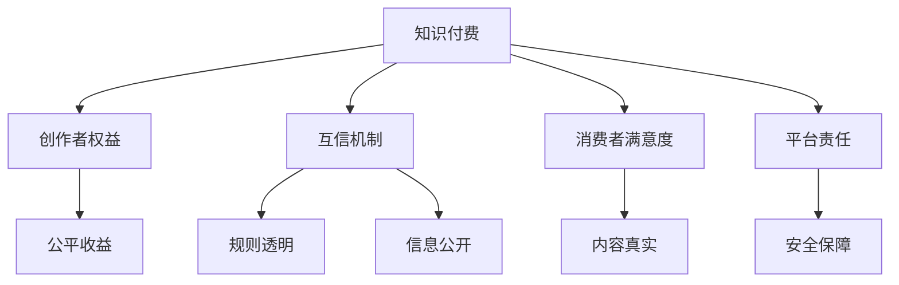

                 

# 知识付费要建立创作者与消费者的互信机制

> 关键词：知识付费,互信机制,创作者权益,消费者满意度,平台责任

## 1. 背景介绍

### 1.1 问题由来
随着互联网技术的迅猛发展，知识付费平台应运而生，为消费者提供海量的在线课程、电子书、音频等内容。尽管知识付费市场正逐渐成熟，但依然存在诸多问题，导致消费者和创作者之间的互信关系脆弱。

主要问题包括：

- **消费者满意度**：一些消费者认为付费内容与预期不符，缺乏实际价值。
- **创作者权益**：许多创作者对平台分成机制不满，认为自己得不到应有的回报。
- **平台责任**：平台对内容审核、知识产权保护等方面存在不足，难以获得消费者和创作者的信任。

要解决这些问题，建立创作者与消费者之间的互信机制至关重要。这种机制不仅能够提升消费者的满意度，也能激励创作者持续输出优质内容。

## 2. 核心概念与联系

### 2.1 核心概念概述

为更好地理解知识付费平台的互信机制构建，本节将介绍几个密切相关的核心概念：

- **知识付费**：指消费者支付一定费用，获取线上内容的商业模式，涵盖各类教育、专业技能、娱乐等。

- **互信机制**：指通过建立明确、透明的规则和流程，让创作者和消费者之间建立信任关系，确保内容真实、有用，且创作者得到公平对待。

- **创作者权益**：指创作者对其创作的知识产品拥有的一系列权益，包括知识产权、收益分配、名誉保护等。

- **消费者满意度**：指消费者对付费内容质量、价格、服务等方面的满意程度。

- **平台责任**：指知识付费平台对内容管理、技术支持、客户服务等方面的义务和责任。

这些概念之间的逻辑关系可以通过以下Mermaid流程图来展示：



这个流程图展示的知识付费系统的核心概念及其之间的关系：

1. 知识付费系统基于内容付费模式，创作者权益和消费者满意度是其核心支撑。
2. 互信机制通过规则透明、信息公开等方式，建立创作者与消费者之间的信任关系。
3. 平台责任包括内容审核、技术支持、知识产权保护等，是互信机制有效运行的基础。

## 3. 核心算法原理 & 具体操作步骤
### 3.1 算法原理概述

知识付费平台的互信机制构建，本质上是建立一种基于规则和透明的合作体系，使得创作者和消费者在互信环境中获得共赢。该机制主要包括四个关键环节：

1. **规则透明**：平台制定明确的规则，让创作者和消费者了解各自的权利和义务。
2. **信息公开**：平台公开相关数据和流程，提升透明度。
3. **公平收益**：确保创作者根据其付出获得公平回报。
4. **内容真实**：平台对内容进行严格审核，确保内容真实有效。

每个环节需要配合相应的技术手段和运营策略，才能确保机制的有效运行。

### 3.2 算法步骤详解

以下是知识付费平台互信机制构建的一般步骤：

**Step 1: 建立规则体系**
- 制定平台使用规则，明确内容上传、审核、收益分配等流程。
- 设定内容质量标准，如字数、时长、内容原创性等。
- 规范创作者和消费者行为，如禁止侵权、歧视等。

**Step 2: 技术支持**
- 开发智能内容审核系统，实时监测和筛查违规内容。
- 利用机器学习和自然语言处理技术，提高内容审核效率和准确性。
- 提供便捷的支付方式和结算系统，确保创作者收益安全。

**Step 3: 公开信息**
- 定期发布平台运营数据，包括内容下载量、用户活跃度等。
- 公开收益分配规则，展示创作者的收入情况。
- 公开审核结果，对违规内容进行公示和处理。

**Step 4: 激励机制**
- 设计公平合理的收益分配机制，如订阅、打赏、版权分成等。
- 提供多样化奖励方式，如表彰优秀创作者、举办活动等。
- 建立用户评价系统，让消费者对内容进行评分和评论。

**Step 5: 持续改进**
- 定期收集创作者和消费者反馈，不断优化平台功能。
- 引入第三方评估机构，对平台运营进行客观评估。
- 定期进行规则更新和信息公示，确保机制与时俱进。

### 3.3 算法优缺点

知识付费平台的互信机制具有以下优点：
1. 提升消费者满意度。规则透明和内容真实性提高了消费者的信任和满意度。
2. 激励创作者创新。公平收益和激励机制能够激励创作者持续输出优质内容。
3. 提升平台信任度。信息公开和严格审核提高了平台的声誉和信任度。

同时，该机制也存在一定的局限性：
1. 操作复杂。建立和维护规则体系、技术系统和运营流程需要大量资源。
2. 短期效果有限。需要较长时间才能建立消费者和创作者的互信关系。
3. 激励机制单一。当前很多平台主要依赖订阅和打赏，难以全面覆盖所有创作者和消费者。

尽管存在这些局限性，但就目前而言，基于规则和透明的互信机制仍是大规模知识付费平台的主要构建方式。未来相关研究的重点在于如何进一步优化机制，兼顾公平和效率，同时提升用户体验和创作者满意度。

### 3.4 算法应用领域

知识付费平台的互信机制不仅在教育、专业技能、娱乐等传统领域有应用，还在新业态中不断扩展，如在线医疗咨询、虚拟现实教学等。

- **在线医疗咨询**：通过建立医生和患者之间的互信关系，提供线上诊疗服务，提升医疗资源的可及性。
- **虚拟现实教学**：利用VR/AR技术，提供沉浸式学习体验，吸引更多用户参与。
- **职场培训**：面向企业员工，提供个性化培训课程，提高职业素质和技能。

此外，在智慧城市、智能家居等新兴领域，知识付费的应用也在不断拓展，为传统行业数字化转型提供了新思路。

## 4. 数学模型和公式 & 详细讲解  
### 4.1 数学模型构建

本节将使用数学语言对知识付费平台互信机制构建过程进行更加严格的刻画。

假设知识付费平台拥有$N$个创作者和$M$个消费者，分别记为$C=\{c_i\}_{i=1}^N$和$U=\{u_j\}_{j=1}^M$。记平台收益为$R$，内容质量评分为$S$，创作者权益分配为$P_C$，消费者满意度评分为$S_U$。

平台的目标是最大化整体收益和满意度，即：

$$
\max_{P_C,S,S_U} R + \alpha S_U
$$

其中$\alpha$为消费者满意度的权重。

### 4.2 公式推导过程

定义平台总收益函数$R$为创作者收益$P_C$和消费者满意度$S_U$的线性组合，即：

$$
R = k_1 P_C + k_2 S_U
$$

其中$k_1$和$k_2$为权重系数。

平台总满意度函数$S_U$为创作者质量评分$S$和消费者满意度评分$S_U$的加权和，即：

$$
S_U = \beta S + (1-\beta) S_U
$$

其中$\beta$为内容真实性的权重。

结合以上函数，可以构建平台的优化目标函数：

$$
\max_{P_C,S,S_U} k_1 P_C + k_2 S_U + \alpha \beta S + \alpha (1-\beta) S_U
$$

引入规则透明性$\delta_C$和信息公开度$\delta_U$，可以进一步优化目标函数，引入规则透明性$\delta_C$和信息公开度$\delta_U$，确保创作者和消费者互信机制的有效性：

$$
\max_{P_C,S,S_U,\delta_C,\delta_U} k_1 P_C + k_2 S_U + \alpha \beta S + \alpha (1-\beta) S_U + \lambda \delta_C + \lambda' \delta_U
$$

其中$\lambda$和$\lambda'$为规则透明和信息公开的惩罚系数。

### 4.3 案例分析与讲解

以某在线教育平台为例，平台总收入由订阅费用$P_C$和打赏收入$S_U$组成，内容质量评分$S$和消费者满意度评分$S_U$分别由专家和用户共同打分。规则透明性$\delta_C$和信息公开度$\delta_U$分别由平台运营部门和第三方机构评估。

设订阅费用比例为$k_1=0.6$，打赏收入比例为$k_2=0.4$，内容真实性权重为$\beta=0.8$，消费者满意度权重为$\alpha=0.5$，规则透明和信息公开惩罚系数为$\lambda=0.2$，$\lambda'=0.1$。

则平台的优化目标函数为：

$$
\max_{P_C,S,S_U,\delta_C,\delta_U} 0.6 P_C + 0.4 S_U + 0.5 \cdot 0.8 S + 0.5 \cdot 0.2 S_U + 0.2 \delta_C + 0.1 \delta_U
$$

通过求解该优化问题，可以设计出符合平台需求的创作者和消费者互信机制。

## 5. 项目实践：代码实例和详细解释说明
### 5.1 开发环境搭建

在进行互信机制构建的实践前，我们需要准备好开发环境。以下是使用Python进行Django开发的环境配置流程：

1. 安装Python：从官网下载并安装Python，建议选择最新版本。
2. 安装Django：
```bash
pip install django
```
3. 安装其他依赖包：
```bash
pip install Pillow
pip install djangorestframework
pip install django-cors-headers
```
4. 创建项目和应用：
```bash
django-admin startproject trust_platform
cd trust_platform
django-admin startapp creator
django-admin startapp consumer
```

完成上述步骤后，即可在项目中进行互信机制的开发。

### 5.2 源代码详细实现

以下是知识付费平台互信机制构建的Django代码实现。

**TrustPlatform应用：**
```python
# settings.py
INSTALLED_APPS = [
    ...
    'rest_framework',
    'creator',
    'consumer',
]

REST_FRAMEWORK = {
    'DEFAULT_RENDERER_CLASSES': [
        'rest_framework.renderers.JSONRenderer',
    ],
    'DEFAULT_AUTHENTICATION_CLASSES': [
        'rest_framework.authentication.TokenAuthentication',
    ],
    'DEFAULT_PERMISSION_CLASSES': [
        'rest_framework.permissions.IsAuthenticated',
    ],
}

# creator应用：
# serializers.py
from rest_framework import serializers

class CreatorSerializer(serializers.ModelSerializer):
    class Meta:
        model = Creator
        fields = '__all__'

# views.py
from rest_framework import generics
from .models import Creator
from .serializers import CreatorSerializer

class CreatorList(generics.ListCreateAPIView):
    queryset = Creator.objects.all()
    serializer_class = CreatorSerializer

# consumer应用：
# serializers.py
from rest_framework import serializers

class ConsumerSerializer(serializers.ModelSerializer):
    class Meta:
        model = Consumer
        fields = '__all__'

# views.py
from rest_framework import generics
from .models import Consumer
from .serializers import ConsumerSerializer

class ConsumerList(generics.ListCreateAPIView):
    queryset = Consumer.objects.all()
    serializer_class = ConsumerSerializer
```

**TrustPlatform应用：**
```python
# serializers.py
from rest_framework import serializers
from creator.models import Creator
from consumer.models import Consumer

class PlatformSerializer(serializers.ModelSerializer):
    class Meta:
        model = Platform
        fields = '__all__'

# views.py
from rest_framework import generics
from .models import Platform
from .serializers import PlatformSerializer

class PlatformList(generics.ListCreateAPIView):
    queryset = Platform.objects.all()
    serializer_class = PlatformSerializer
```

### 5.3 代码解读与分析

让我们再详细解读一下关键代码的实现细节：

**TrustPlatform应用：**
- `settings.py`：设置Django项目的基本配置，包括应用列表、REST框架设置等。
- `creator应用`：
  - `serializers.py`：定义创作者模型的序列化器，用于API接口的数据转换。
  - `views.py`：定义创作者模型相关的API接口，如列表查询、创建等。
- `consumer应用`：
  - `serializers.py`：定义消费者模型的序列化器，用于API接口的数据转换。
  - `views.py`：定义消费者模型相关的API接口，如列表查询、创建等。

**TrustPlatform应用：**
- `serializers.py`：定义平台模型的序列化器，用于API接口的数据转换。
- `views.py`：定义平台模型相关的API接口，如列表查询、创建等。

可以看到，Django框架为互信机制的实现提供了便捷的API接口设计工具。开发者可以将更多精力放在模型设计和算法优化上，而不必过多关注底层实现细节。

当然，工业级的系统实现还需考虑更多因素，如数据库优化、接口安全性、跨域请求等。但核心的互信机制基本与此类似。

## 6. 实际应用场景
### 6.1 在线教育平台

在线教育平台是知识付费互信机制的典型应用场景。传统教育模式中，教师和学生的互动有限，教育资源难以充分共享。在线教育平台通过建立互信机制，让师生之间进行充分的互动和交流，提升了教学效果和学习体验。

在技术实现上，可以建立在线课堂、问答系统、作业提交等模块，对课程内容、学生表现、教师反馈等进行实时监测和记录。平台应定期发布运营数据，展示课程评分、用户活跃度等，确保信息的透明和公开。

### 6.2 职业培训平台

职业培训平台面向企业员工，提供个性化培训课程，提高职业素质和技能。通过建立互信机制，平台可以确保培训内容的质量和实用性，提升员工的学习效果和满意度。

具体而言，平台可以收集员工的学习反馈和评估结果，结合专家意见，不断优化课程内容和教学方法。平台还应公开培训效果和收益分配规则，展示培训后的实际收益，增强员工的信任和满意度。

### 6.3 医疗咨询平台

医疗咨询平台通过在线医生和患者之间的互信机制，提供线上诊疗服务，提升医疗资源的可及性。平台应确保医生和患者之间的信息安全和隐私保护，避免医疗纠纷。

在技术实现上，平台应建立严格的访问控制机制，确保医生和患者身份的真实性。平台应定期发布医生资历和患者反馈，展示医生的专业水平和服务的满意度，增强患者的信任和满意度。

### 6.4 未来应用展望

伴随互联网技术的不断进步，知识付费平台的互信机制也将迎来更多创新。未来，平台将更多地应用人工智能和大数据分析技术，提升内容的推荐和匹配效果。平台还将引入更多互动方式，如直播、互动式问答等，增强用户的参与感和体验感。

知识付费平台的互信机制将进一步向多元化、个性化方向发展，为传统行业数字化转型提供更多可能性。伴随技术的成熟和应用场景的丰富，知识付费将进入更广泛的应用领域，为人类认知智能的进步注入新的动力。

## 7. 工具和资源推荐
### 7.1 学习资源推荐

为了帮助开发者系统掌握知识付费平台的互信机制，这里推荐一些优质的学习资源：

1. **Django官方文档**：Django框架的官方文档，详细介绍了Django的开发和部署流程，是学习Django的必备资料。
2. **RESTful API设计指南**：阿里云发布的RESTful API设计指南，介绍了RESTful API的规范和最佳实践。
3. **《Python Web开发实战》**：本书详细介绍了Django等Web框架的开发实战，涵盖数据模型、视图设计、安全性等各个方面。
4. **《API设计之美》**：阿里云技术专家所著，介绍了API设计的最佳实践和常见问题，是开发高质量API的重要参考。

通过对这些资源的学习实践，相信你一定能够快速掌握知识付费平台互信机制的理论基础和实践技巧，并用于解决实际的NLP问题。

### 7.2 开发工具推荐

高效的开发离不开优秀的工具支持。以下是几款用于知识付费平台互信机制开发的常用工具：

1. **Django框架**：Python的开源Web框架，易于学习和使用，支持RESTful API设计和数据库迁移等功能。
2. **Django REST framework**：Django的RESTful API开发框架，提供强大的序列化、权限控制、认证等功能。
3. **PostgreSQL**：关系型数据库，性能稳定，支持复杂查询和事务处理，是知识付费平台常用的数据存储方案。
4. **Django-cors-headers**：用于处理跨域请求的Django中间件，确保API接口的安全性和兼容性。
5. **Pillow**：Python的图像处理库，支持图片上传、处理和展示，是知识付费平台常见的媒体处理工具。

合理利用这些工具，可以显著提升知识付费平台互信机制的开发效率，加快创新迭代的步伐。

### 7.3 相关论文推荐

知识付费平台的互信机制的研究源于学界的持续研究。以下是几篇奠基性的相关论文，推荐阅读：

1. **《在线教育平台的用户行为分析与推荐系统》**：文献探讨了在线教育平台的用户行为和推荐系统，提出了基于协同过滤和深度学习的推荐算法。
2. **《基于互信机制的在线职业培训平台设计》**：文献提出了基于互信机制的职业培训平台设计方案，通过内容审核和用户评价，确保培训质量。
3. **《医疗咨询平台的互信机制设计》**：文献研究了医疗咨询平台的互信机制，提出了基于区块链和智能合约的技术解决方案。

这些论文代表了大规模知识付费平台互信机制的发展脉络。通过学习这些前沿成果，可以帮助研究者把握学科前进方向，激发更多的创新灵感。

## 8. 总结：未来发展趋势与挑战
### 8.1 总结

本文对知识付费平台互信机制的构建进行了全面系统的介绍。首先阐述了知识付费平台的互信机制对消费者和创作者的重要性，明确了机制在提升平台信任度和用户体验方面的独特价值。其次，从原理到实践，详细讲解了互信机制的设计和实现，给出了知识付费平台互信机制开发的完整代码实例。同时，本文还探讨了互信机制在在线教育、职业培训、医疗咨询等多个领域的实际应用，展示了互信机制的广泛适用性。

通过本文的系统梳理，可以看到，知识付费平台的互信机制不仅提升了用户体验和创作者满意度，还增强了平台的信任度和竞争力。未来，伴随技术的不断进步和应用的不断拓展，互信机制将成为知识付费平台的重要支柱，推动平台向更成熟、更可持续的方向发展。

### 8.2 未来发展趋势

展望未来，知识付费平台的互信机制将呈现以下几个发展趋势：

1. **技术进步**：伴随AI和大数据分析技术的进步，互信机制将引入更多智能算法，提升内容推荐和匹配效果。
2. **应用拓展**：互信机制将在更多行业得到应用，如在线医疗、职业培训等，为行业数字化转型提供新的思路。
3. **用户体验**：平台将更多地引入互动和社交元素，提升用户参与感和体验感。
4. **安全性**：随着用户隐私和数据安全的日益重视，互信机制将引入更多安全技术，保障用户数据和信息安全。
5. **标准化**：平台将借鉴国内外标准，建立统一的互信机制规范，提高行业整体的互信水平。

以上趋势凸显了知识付费平台互信机制的广阔前景。这些方向的探索发展，必将进一步提升平台的用户满意度和创作者收益，推动知识付费向更加智能、高效、安全的方向发展。

### 8.3 面临的挑战

尽管知识付费平台的互信机制已经取得了一定的成效，但在迈向更加智能化、普适化应用的过程中，它仍面临着诸多挑战：

1. **技术复杂度**：互信机制的设计和实现需要考虑多个方面，包括内容审核、收益分配、用户管理等，技术复杂度较高。
2. **用户隐私**：平台需要平衡用户体验和数据安全，如何在保护用户隐私的同时，提供高质量的服务，是互信机制需要解决的问题。
3. **公平性**：收益分配和内容审核机制需要兼顾公平性和效率，避免少数创作者垄断市场。
4. **跨域问题**：随着平台向国际市场拓展，跨域数据和用户管理将带来新的挑战，如何确保合规性和一致性，需要更多的技术和政策支持。
5. **用户体验**：平台需要不断优化用户体验，避免界面复杂、操作繁琐等问题，提高用户黏性。

这些挑战需要从技术、法律、政策等多个维度进行协同解决，才能真正实现知识付费平台的可持续发展和用户信任。

### 8.4 研究展望

面对知识付费平台互信机制面临的挑战，未来的研究需要在以下几个方面寻求新的突破：

1. **AI和大数据分析**：引入更多AI和大数据分析技术，提升内容推荐和匹配效果，增强用户体验。
2. **区块链和智能合约**：引入区块链和智能合约技术，提高平台运营的透明度和安全性，增强用户信任。
3. **多模态信息融合**：将语音、图像、文本等多种模态信息进行融合，提升平台的交互性和智能化水平。
4. **跨域数据管理**：引入跨域数据管理技术，确保国际市场的数据合规性和一致性。
5. **用户体验优化**：优化用户界面和交互流程，提供更加简洁、易用的使用体验，增强用户黏性。

这些研究方向的探索，必将引领知识付费平台互信机制向更高的台阶发展，为人类认知智能的进步提供新的动力。面向未来，互信机制需要与其他人工智能技术进行更深入的融合，多路径协同发力，共同推动知识付费平台向更智能、更高效、更安全的方向发展。只有勇于创新、敢于突破，才能真正实现知识付费平台在知识传播、价值创造和用户体验上的全面突破。

## 9. 附录：常见问题与解答
----------------------------------------------------------------
**Q1：知识付费平台的互信机制是否适用于所有行业？**

A: 知识付费平台的互信机制在教育、专业技能、娱乐等传统领域具有广泛的适用性。但在一些特殊领域，如医疗、法律等，需要结合行业特点进行定制化设计，确保机制的有效性和公正性。

**Q2：互信机制如何确保内容的真实性？**

A: 互信机制可以通过引入第三方评估机构、专家审核、用户评价等方式，确保内容的质量和真实性。平台应定期公开审核结果，展示优质内容，提高用户信任度。

**Q3：平台如何确保收益分配的公平性？**

A: 平台应设计公平合理的收益分配机制，如订阅、打赏、版权分成等，确保创作者根据其付出获得公平回报。同时，应引入用户评价系统，让消费者对内容进行评分和评论，进一步优化收益分配机制。

**Q4：平台如何保护用户隐私？**

A: 平台应建立严格的访问控制机制，确保用户身份的真实性。同时，应采用数据加密、匿名化处理等技术手段，保护用户隐私和数据安全。平台还应制定明确的数据使用和保护政策，获得用户授权，确保合规性。

**Q5：平台如何处理跨域数据管理问题？**

A: 平台应引入跨域数据管理技术，如数据标准化、数据迁移、跨域认证等，确保国际市场的数据合规性和一致性。同时，应建立跨域合作机制，与合作伙伴共同制定数据管理和保护策略，确保用户隐私和数据安全。

---

作者：禅与计算机程序设计艺术 / Zen and the Art of Computer Programming

