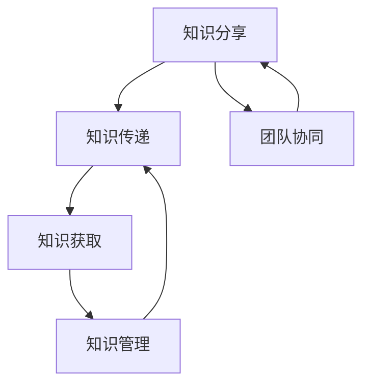

                 

# 知识分享在团队中的重要性

## 1. 背景介绍

在当今快速发展的科技领域，知识分享已经成为团队协作和创新不可或缺的一部分。无论是软件开发、数据分析、人工智能还是其他任何技术领域，团队成员之间的知识传递和经验交流都是推动项目成功和持续进步的关键。特别是在复杂的技术项目中，单一的个体很难独立解决问题，需要团队集体的智慧和资源。因此，如何有效地进行知识分享，成为了每个团队需要重点考虑的问题。

### 1.1 知识分享的价值

知识分享的价值不仅仅在于信息本身的传递，更重要的是能够促进团队成员之间的相互理解和协作。通过知识分享，团队成员可以：
1. **提升技能水平**：快速学习和掌握新技术和工具。
2. **加速项目进度**：避免重复劳动，提高工作效率。
3. **增强团队凝聚力**：建立信任和尊重，促进良好的团队氛围。
4. **驱动创新**：汇集多方智慧，激发新的创意和解决方案。

## 2. 核心概念与联系

### 2.1 核心概念概述

- **知识分享**：指通过交流、讨论、培训等方式，将个人的知识和经验传递给其他团队成员的过程。
- **知识传递**：知识从一个人转移到另一个人，通过口头、书面、在线等多种形式进行。
- **知识获取**：指接收方理解和掌握知识的过程，可能通过培训、阅读、实践等多种方式实现。
- **团队协同**：指团队成员之间的合作和协作，通过共享知识实现共同目标。
- **知识管理**：通过有效的工具和方法，系统化地管理和利用团队内的知识资产。

### 2.2 核心概念之间的联系

知识分享、知识传递、知识获取、团队协同和知识管理这些概念相互关联，形成一个闭环的知识流动系统。知识分享是知识传递的起点，知识获取是知识传递的终点。而团队协同和知识管理则是确保知识在团队内部高效流动和应用的关键。

以下是一个简单的Mermaid流程图，展示了这些概念之间的联系：



这个流程图展示了知识如何在团队内部流动，从一个人的知识分享开始，到知识获取结束，再到团队协同和知识管理，确保知识在团队内部的有效利用。

## 3. 核心算法原理 & 具体操作步骤

### 3.1 算法原理概述

知识分享的核心算法原理是通过多种方式促进团队成员之间的知识传递和获取。这些方式包括但不限于会议、讨论、文档、培训、协作工具等。

知识共享的算法步骤可以概括为：
1. **知识识别**：确定需要分享的知识点和技能。
2. **知识传递**：选择合适的传递方式和渠道。
3. **知识接受**：确保接收方能够理解和掌握知识。
4. **反馈与改进**：收集反馈，改进知识分享的方式和效果。

### 3.2 算法步骤详解

#### 3.2.1 知识识别

- **需求分析**：评估团队在当前项目或任务中所需的技能和知识。
- **技能评估**：识别团队中谁具备相关知识和技能。
- **优先级排序**：根据项目需求，对知识点的优先级进行排序。

#### 3.2.2 知识传递

- **选择合适的传递方式**：根据知识点的特点和团队成员的偏好选择最适合的传递方式，如会议、培训、文档、视频等。
- **确定传递时间**：安排合适的时机进行知识传递，确保团队成员有足够的时间学习和实践。

#### 3.2.3 知识接受

- **培训准备**：根据知识点的复杂度，准备相应的培训材料和实践机会。
- **实践练习**：通过实际操作或案例分析，帮助团队成员理解和掌握知识。

#### 3.2.4 反馈与改进

- **收集反馈**：通过问卷、面谈等方式，收集团队成员对知识传递的反馈。
- **改进措施**：根据反馈结果，调整和改进知识传递的方式和内容，确保知识分享的有效性。

### 3.3 算法优缺点

#### 3.3.1 优点

- **提升团队技能**：快速学习和掌握新技术，提升团队整体技能水平。
- **加速项目进度**：减少重复劳动，提高工作效率。
- **增强团队凝聚力**：建立信任和尊重，促进良好的团队氛围。
- **驱动创新**：汇集多方智慧，激发新的创意和解决方案。

#### 3.3.2 缺点

- **时间成本**：知识分享需要消耗一定的时间，可能会影响项目的进度。
- **资源消耗**：需要准备相应的培训材料、实践机会等，增加了资源投入。
- **理解差异**：知识传递的效率和效果取决于团队成员的学习能力和接受程度。

### 3.4 算法应用领域

知识分享的应用领域非常广泛，几乎涵盖了所有技术项目和团队协作场景。以下是一些典型的应用场景：

- **软件开发**：代码审查、技术分享会、代码库文档等。
- **数据分析**：数据处理流程介绍、工具使用培训等。
- **人工智能**：模型训练方法、算法优化技巧、最新研究成果等。
- **项目管理**：项目进度管理、团队协作工具使用等。

## 4. 数学模型和公式 & 详细讲解 & 举例说明

### 4.1 数学模型构建

知识分享的效果可以通过以下数学模型来衡量：

$$
KI = KD \times \frac{KA}{KR}
$$

其中：
- $KI$ 表示知识分享的影响力。
- $KD$ 表示知识的深度，即知识点的复杂程度。
- $KA$ 表示知识的可接受度，即团队成员对知识点的兴趣和接受程度。
- $KR$ 表示知识的传递效率，即知识传递方式的有效性。

### 4.2 公式推导过程

通过上述数学模型，可以进一步推导出知识分享效果的优化策略：

1. **提高知识深度**：选择复杂度和适用性高的知识点进行分享，确保知识点的实用性和挑战性。
2. **增强可接受度**：根据团队成员的兴趣和需求，选择合适的传递方式和时机。
3. **提升传递效率**：选择高效的知识传递工具和方法，确保知识传递的准确性和即时性。

### 4.3 案例分析与讲解

以软件开发中的代码审查为例，分析知识分享的具体实施过程：

1. **知识识别**：识别团队中某成员编写的高质量代码，并分析其编写思路和优化技巧。
2. **知识传递**：组织团队成员参与代码审查会议，详细讲解代码优化方法和最佳实践。
3. **知识接受**：通过实际操作，让团队成员在实际开发中应用这些知识和技巧。
4. **反馈与改进**：收集团队成员的反馈意见，根据反馈调整代码审查的方式和内容。

## 5. 项目实践：代码实例和详细解释说明

### 5.1 开发环境搭建

在开始项目实践之前，需要准备开发环境。以下是一个基于JIRA和Confluence的项目管理实践流程：

1. **安装JIRA**：根据企业环境选择合适的JIRA版本，并进行安装配置。
2. **配置Confluence**：安装并配置Confluence，建立知识库和文档管理平台。
3. **集成开发工具**：将开发环境与JIRA和Confluence集成，方便知识共享和项目管理。

### 5.2 源代码详细实现

以JIRA的配置为例，展示如何实现知识分享功能：

1. **创建项目**：在JIRA中创建项目，并设置项目的任务类型和优先级。
2. **分配任务**：根据项目需求，将任务分配给团队成员。
3. **设置任务依赖**：明确任务之间的依赖关系，确保知识传递的顺序和有效性。
4. **跟踪进度**：使用JIRA的进度跟踪功能，实时了解任务完成情况。

### 5.3 代码解读与分析

JIRA和Confluence的配置是一个复杂的系统工程，需要根据团队的具体需求进行调整和优化。以下是一个简单的代码示例，展示如何使用JIRA API进行任务管理和知识分享：

```python
import requests
from jira import JIRA

jira = JIRA('https://jira.example.com', auth=('username', 'password'))

# 创建任务
issue_key = 'KEY-1'
jira.create_issue(
    project={'key': 'PROJECT-KEY'},
    summary='分享任务'
)

# 分配任务
jira.add_user_to_issue(issue_key, 'USER-NAME')

# 设置任务依赖
jira.link_issue(issue_key, 'DEPENDENCY-ISSUE-KEY')

# 获取任务进度
task_status = jira.get_issue(issue_key).fields.status.name
print('任务进度：', task_status)

# 上传文档
jira.add_comment(issue_key, '上传文档链接：https://confluence.example.com/pages/page-key')
```

### 5.4 运行结果展示

运行上述代码，可以在JIRA中创建任务、分配任务、设置任务依赖，并跟踪任务进度。同时，通过Confluence上传相关文档，确保知识分享的效果。

## 6. 实际应用场景

### 6.1 软件开发团队

在软件开发团队中，知识分享是保证项目顺利进行的重要手段。通过代码审查、技术分享会、代码库文档等方式，团队成员可以迅速学习新技能，提升整体技术水平。

### 6.2 数据分析团队

数据分析团队需要处理大量复杂的数据，通过分享数据处理流程、工具使用技巧等，可以快速提升团队的数据处理能力。

### 6.3 人工智能团队

人工智能团队需要不断地学习和探索新的算法和技术，通过分享研究成果、项目经验等，可以加速团队的技术创新和应用落地。

### 6.4 未来应用展望

随着技术的不断发展，知识分享的方式和工具也将不断创新。未来，知识分享将更加注重智能化和自动化，如利用AI进行知识推荐、知识图谱构建等，以提高知识传递的效率和效果。

## 7. 工具和资源推荐

### 7.1 学习资源推荐

- **JIRA官方文档**：详细介绍了JIRA的使用方法和配置技巧。
- **Confluence官方文档**：提供了Confluence的文档管理、协作工具等功能的使用说明。
- **GitLab官方文档**：展示了如何使用GitLab进行代码管理和知识分享。
- **Slack官方文档**：介绍了Slack的团队协作和沟通工具的使用方法。

### 7.2 开发工具推荐

- **JIRA**：功能强大的项目管理工具，支持任务分配、进度跟踪、知识分享等功能。
- **Confluence**：高效的文档管理和协作工具，提供丰富的文档编辑和共享功能。
- **GitLab**：开源的代码托管和项目管理平台，支持代码审查、任务管理等功能。
- **Slack**：流行的即时通信工具，提供高效的团队沟通和协作功能。

### 7.3 相关论文推荐

- **《知识共享在团队中的影响因素研究》**：分析了知识共享对团队绩效的影响，并提出了优化策略。
- **《基于知识图谱的企业知识管理研究》**：探讨了利用知识图谱进行知识管理和共享的方法。
- **《敏捷开发中的知识共享机制》**：介绍了敏捷开发中知识共享的具体实践和效果评估。

## 8. 总结：未来发展趋势与挑战

### 8.1 研究成果总结

本文通过分析知识分享在团队中的重要性，介绍了知识共享的概念、原理和操作步骤，并通过实际项目实践展示了知识分享的有效性和应用场景。同时，总结了知识共享在提升团队技能、加速项目进度、增强团队凝聚力和驱动创新等方面的价值。

### 8.2 未来发展趋势

未来，知识分享将朝着智能化、自动化和集成化的方向发展。AI技术将进一步应用于知识推荐、知识图谱构建等领域，提高知识分享的效率和效果。同时，知识共享工具的集成化也将成为趋势，如JIRA、Confluence、GitLab等工具的深度整合，将进一步提升团队协作和知识管理的效率。

### 8.3 面临的挑战

知识共享在实施过程中仍面临一些挑战：
- **数据隐私和安全**：知识分享需要处理大量的敏感信息，如何保护数据隐私和安全是一个重要问题。
- **知识传递的准确性**：知识传递的准确性和有效性直接影响团队的学习效果。
- **团队协作的文化**：知识分享需要团队成员的积极参与和配合，如何营造良好的团队文化是关键。

### 8.4 研究展望

未来的研究应从以下几个方向进行：
- **智能知识推荐**：利用AI技术，根据团队成员的兴趣和需求，智能推荐相关知识。
- **知识图谱构建**：构建企业内部的知识图谱，系统化地管理和利用知识资产。
- **团队文化建设**：通过企业文化建设，促进团队成员的积极参与和知识分享。

## 9. 附录：常见问题与解答

**Q1: 如何提高知识共享的效率和效果？**

A: 提高知识共享效率和效果的关键在于选择合适的传递方式和时机，以及确保知识传递的准确性和即时性。具体措施包括：
- **选择合适的传递方式**：根据知识点的特点和团队成员的偏好选择最适合的传递方式，如会议、培训、文档、视频等。
- **确定传递时间**：安排合适的时机进行知识传递，确保团队成员有足够的时间学习和实践。
- **使用协作工具**：利用JIRA、Confluence、GitLab等协作工具，实现知识传递和管理的系统化。

**Q2: 如何确保知识传递的准确性？**

A: 确保知识传递的准确性需要从多个方面入手：
- **明确知识传递目标**：在知识传递前，明确知识点的重点和应用场景。
- **提供实践机会**：通过实际操作或案例分析，帮助团队成员理解和掌握知识。
- **收集反馈**：通过问卷、面谈等方式，收集团队成员对知识传递的反馈，根据反馈调整和改进知识传递的方式和内容。

**Q3: 如何保护数据隐私和安全？**

A: 保护数据隐私和安全需要从以下几个方面进行：
- **数据加密**：对敏感数据进行加密处理，防止数据泄露。
- **访问控制**：设置严格的访问控制策略，确保只有授权人员可以访问敏感信息。
- **定期审计**：定期进行数据隐私和安全审计，及时发现和修复潜在的安全漏洞。

**Q4: 如何营造良好的团队文化？**

A: 营造良好的团队文化需要从以下几个方面进行：
- **建立信任和尊重**：通过知识分享和团队协作，建立团队成员之间的信任和尊重。
- **鼓励开放沟通**：营造开放、包容的沟通氛围，鼓励团队成员分享知识和经验。
- **表彰和奖励**：对积极参与知识分享和团队协作的成员进行表彰和奖励，激励团队成员的积极性。

---

作者：禅与计算机程序设计艺术 / Zen and the Art of Computer Programming

