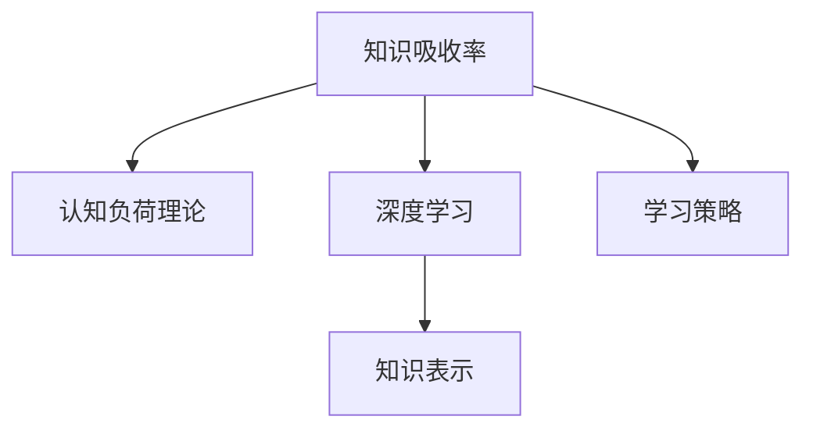

                 

## 1. 背景介绍

在当今信息爆炸的时代，学习新知识已经成为一项至关重要的技能。然而，在快节奏的生活和工作中，如何高效地吸收和应用知识，成为许多人面临的难题。知识吸收率，即人们在学习和接受新信息时，能够真正理解和掌握的比例，是衡量学习效果的关键指标。一个高知识吸收率不仅能够帮助人们快速适应变化，还能提升个人的竞争力和创造力。本文将深入探讨知识吸收率的定义、影响因素以及提高方法，为读者提供系统性的指导。

## 2. 核心概念与联系

### 2.1 核心概念概述

为了更好地理解知识吸收率，本节将介绍几个关键概念及其相互联系：

- **知识吸收率**：指学习者在学习和接受新知识时，能够真正理解和掌握的比例。
- **认知负荷理论**：由认知心理学家Sweller提出，认为过重的认知负荷会降低学习效果，因此应该通过合适的教学策略来减轻学习者的认知负荷。
- **深度学习**：一种基于神经网络的机器学习方法，通过多层次的抽象表示，使学习者能够更好地理解和掌握复杂概念。
- **知识表示**：指如何将知识结构化，使其便于理解和应用。常见的知识表示方法包括框架理论、本体论等。
- **学习策略**：指学习者在学习过程中所采用的方法和技巧，如记忆术、信息提取策略等。

这些概念之间的逻辑关系可以通过以下Mermaid流程图来展示：



这个流程图展示了一个学习过程中各个要素之间的相互作用关系：

1. 学习者需要根据认知负荷理论，选择合适的学习策略，以减轻认知负荷，提高学习效果。
2. 深度学习通过多层次的抽象表示，帮助学习者更好地理解和掌握复杂概念。
3. 知识表示提供了一种将知识结构化的方式，便于学习者理解和应用。

## 3. 核心算法原理 & 具体操作步骤

### 3.1 算法原理概述

知识吸收率通常通过评估学习者在特定任务上的表现来衡量。假设一个学习者在学习任务 $T$ 上的真实表现和预期表现分别为 $R$ 和 $E$，则知识吸收率 $KAR$ 可以定义为：

$$
KAR = \frac{R}{E}
$$

其中，$R$ 和 $E$ 的评估方法根据具体任务而定。例如，对于选择题任务，$R$ 可以是学习者正确回答的题目数，$E$ 可以是总题目数；对于编程任务，$R$ 可以是正确编写的代码行数，$E$ 可以是总代码行数。

### 3.2 算法步骤详解

知识吸收率的评估步骤如下：

**Step 1: 定义评估指标**
- 根据具体任务，定义学习者在任务 $T$ 上的表现指标 $R$ 和预期表现指标 $E$。
- 例如，对于选择题，$R$ 为正确答案数，$E$ 为总题目数；对于编程任务，$R$ 为正确代码行数，$E$ 为总代码行数。

**Step 2: 收集数据**
- 收集学习者在任务 $T$ 上的真实表现数据 $R$。
- 定义 $E$ 为学习者应有的表现，通常为任务难度或任务复杂度。

**Step 3: 计算知识吸收率**
- 将 $R$ 和 $E$ 代入公式计算知识吸收率 $KAR$。

**Step 4: 分析结果**
- 根据 $KAR$ 的值，评估学习者的知识掌握程度。
- 如果 $KAR$ 接近 1，说明学习者掌握得很好；如果 $KAR$ 较低，则需要分析原因，改进学习策略。

### 3.3 算法优缺点

知识吸收率评估具有以下优点：
1. 简单高效：只需定义评估指标，收集数据，即可计算出知识吸收率。
2. 量化评估：通过数字量化，可以直观比较不同学习者的学习效果。
3. 实时反馈：可以在学习过程中随时计算和分析，帮助学习者调整学习策略。

同时，该方法也存在一些局限性：
1. 主观性强：预期表现 $E$ 的设定可能受到主观因素的影响，难以准确反映任务难度。
2. 适用范围有限：对于复杂度难以量化的任务，知识吸收率评估难以适用。
3. 缺乏时间维度：知识吸收率评估无法反映学习者随时间的进步，难以进行长期跟踪。

### 3.4 算法应用领域

知识吸收率评估广泛应用于教育、培训、职业发展等领域，帮助评估学习效果，指导教学和培训策略。

- **教育领域**：教师可以使用知识吸收率评估学生的学习效果，调整教学内容和方法，提升教学质量。
- **职业培训**：企业可以使用知识吸收率评估员工的培训效果，优化培训内容，提升员工技能。
- **个人发展**：个人可以自评知识吸收率，制定学习计划，提升自身能力。

## 4. 数学模型和公式 & 详细讲解 & 举例说明

### 4.1 数学模型构建

在数学模型中，知识吸收率 $KAR$ 的定义如下：

$$
KAR = \frac{\sum_{i=1}^{N} R_i}{\sum_{i=1}^{N} E_i}
$$

其中，$N$ 为评估任务的数量，$R_i$ 和 $E_i$ 分别为第 $i$ 个任务的实际表现和预期表现。

### 4.2 公式推导过程

知识吸收率的计算过程如下：
1. 收集 $N$ 个任务的表现数据 $R_1, R_2, ..., R_N$ 和预期表现数据 $E_1, E_2, ..., E_N$。
2. 将 $R_i$ 和 $E_i$ 代入公式，计算 $KAR$。

### 4.3 案例分析与讲解

假设一个学习者在学习数学题和编程题两种任务上的表现数据如下：

| 任务类型 | 表现指标 $R$ | 预期指标 $E$ |
| --- | --- | --- |
| 数学题 | 正确答案数 | 总题目数 |
| 编程题 | 正确代码行数 | 总代码行数 |

对于数学题，学习者正确回答了 20 题，总题目数为 25 题，因此 $KAR_{数学题} = \frac{20}{25} = 0.8$。
对于编程题，学习者正确编写了 30 行代码，总代码行数为 50 行，因此 $KAR_{编程题} = \frac{30}{50} = 0.6$。

通过比较 $KAR_{数学题}$ 和 $KAR_{编程题}$，可以看出学习者在数学题上的知识吸收率更高，可能需要调整编程学习的策略。

## 5. 项目实践：代码实例和详细解释说明

### 5.1 开发环境搭建

为了进行知识吸收率评估，我们需要准备好开发环境。以下是使用Python进行数据分析的环境配置流程：

1. 安装Anaconda：从官网下载并安装Anaconda，用于创建独立的Python环境。

2. 创建并激活虚拟环境：
```bash
conda create -n analysis-env python=3.8 
conda activate analysis-env
```

3. 安装必要的库：
```bash
pip install pandas numpy matplotlib
```

完成上述步骤后，即可在`analysis-env`环境中进行知识吸收率评估的开发。

### 5.2 源代码详细实现

下面是一个使用Python计算知识吸收率的代码实现：

```python
import pandas as pd
from typing import List

def calculate_knowledge_absorption_rate(R: List[int], E: List[int]) -> float:
    total_R = sum(R)
    total_E = sum(E)
    if total_E == 0:
        raise ValueError("Expectation cannot be zero")
    return total_R / total_E

# 示例数据
R = [20, 30]
E = [25, 50]

# 计算知识吸收率
KAR = calculate_knowledge_absorption_rate(R, E)
print(f"知识吸收率: {KAR}")
```

### 5.3 代码解读与分析

让我们再详细解读一下关键代码的实现细节：

**calculate_knowledge_absorption_rate函数**：
- 输入两个列表 $R$ 和 $E$，分别表示不同任务的表现和预期表现。
- 使用内置函数 `sum` 计算 $R$ 和 $E$ 的总和。
- 如果 $E$ 的值为 0，抛出异常，因为无法除以零。
- 返回 $R$ 和 $E$ 的总和比值，即知识吸收率。

**示例数据**：
- 使用示例数据 $R = [20, 30]$ 和 $E = [25, 50]$，分别代表学习者在数学题和编程题上的表现。

**计算知识吸收率**：
- 调用 `calculate_knowledge_absorption_rate` 函数，计算知识吸收率。
- 打印输出结果。

## 6. 实际应用场景

### 6.1 教育领域

在教育领域，知识吸收率评估可以帮助教师了解学生的学习情况，优化教学策略。例如，教师可以收集学生在数学题和编程题上的表现数据，计算知识吸收率，发现学生在某些任务上的表现不佳，及时调整教学内容和难度，提升整体教学效果。

### 6.2 职业培训

在职业培训中，企业可以使用知识吸收率评估员工的培训效果，优化培训课程。例如，企业可以收集员工在特定技术模块上的表现数据，计算知识吸收率，发现员工掌握程度较低的部分，调整培训内容和方式，提升员工技能水平。

### 6.3 个人发展

个人也可以使用知识吸收率评估自身的学习效果，制定更有效的学习计划。例如，学习者可以记录自己在不同学习模块上的表现数据，计算知识吸收率，发现薄弱环节，重点复习和练习。

## 7. 工具和资源推荐

### 7.1 学习资源推荐

为了帮助学习者掌握知识吸收率评估的理论基础和实践技巧，以下是一些优质的学习资源：

1. **《认知心理学与学习心理学》**：全面介绍认知负荷理论及其在教学中的应用。
2. **《深度学习入门》**：介绍深度学习的基本概念和应用，适合初学者学习。
3. **《知识表示与智能系统》**：介绍知识表示的基本方法和技术，帮助学习者理解知识结构化。
4. **《学习策略》**：介绍各种有效的学习策略，帮助学习者提升学习效果。

### 7.2 开发工具推荐

高效的开发离不开优秀的工具支持。以下是几款常用的开发工具：

1. **Jupyter Notebook**：免费在线Jupyter Notebook环境，支持Python和其他语言，方便进行数据分析和可视化。
2. **TensorBoard**：TensorFlow配套的可视化工具，可以实时监测模型训练状态，可视化数据结果。
3. **Weights & Biases**：模型训练的实验跟踪工具，可以记录和可视化模型训练过程中的各项指标，方便对比和调优。
4. **Anaconda Navigator**：Anaconda的图形化界面，方便管理Python环境和库的安装。

### 7.3 相关论文推荐

知识吸收率评估的理论和实践研究涉及多个领域，以下是几篇奠基性的相关论文，推荐阅读：

1. **《认知负荷与学习策略》**：认知负荷理论的创始人Sweller的经典著作，探讨了认知负荷对学习效果的影响。
2. **《深度学习在教育中的应用》**：介绍深度学习在教育中的成功案例，展示其提升学习效果的可能性。
3. **《知识表示的框架理论》**：介绍知识表示的基本框架和方法，帮助学习者理解知识结构化。
4. **《基于知识吸收率的个性化学习策略》**：探讨如何根据知识吸收率调整学习策略，提升学习效果。

## 8. 总结：未来发展趋势与挑战

### 8.1 总结

本文对知识吸收率的定义、影响因素以及提高方法进行了系统介绍。知识吸收率作为衡量学习效果的关键指标，具有简单易行、量化直观等优点，适用于各种学习场景。通过科学评估和优化学习策略，可以显著提升学习效果，实现知识的高效吸收和应用。

### 8.2 未来发展趋势

展望未来，知识吸收率评估将会呈现以下几个发展趋势：

1. **自动化评估**：通过AI技术自动收集和分析学习数据，减少人工干预，提高评估效率。
2. **跨领域应用**：知识吸收率评估将逐步应用于更多领域，如医疗、农业、军事等，帮助提升专业技能。
3. **个性化定制**：结合机器学习算法，针对不同学习者制定个性化评估策略，提升学习效果。
4. **多维度评估**：结合情感分析、行为分析等技术，进行多维度的学习效果评估，全面反映学习者的学习状态。
5. **实时反馈**：通过实时数据分析，提供即时反馈，帮助学习者及时调整学习策略。

### 8.3 面临的挑战

尽管知识吸收率评估具有显著的优势，但在使用过程中也面临一些挑战：

1. **数据隐私**：在收集和分析学习数据时，需要保护学习者的隐私。
2. **数据质量**：评估结果的准确性依赖于数据的质量，不完整、不真实的数据会影响评估效果。
3. **评估标准**：不同任务和领域有不同的评估标准，难以制定统一的评估标准。
4. **技术门槛**：自动化评估和分析需要一定的技术背景，普通用户可能难以操作。
5. **缺乏实践应用**：在教育、培训等实际应用中，知识吸收率评估尚未广泛应用，需要更多的推广和实践。

### 8.4 研究展望

未来的研究需要在以下几个方面寻求新的突破：

1. **自动化技术**：开发更高效、智能的数据收集和分析工具，减少人工干预。
2. **多模态学习**：结合语音、视频等多种模态数据，进行多维度评估。
3. **情感分析**：引入情感分析技术，全面评估学习者的学习状态和情感体验。
4. **个性化评估**：结合机器学习算法，针对不同学习者制定个性化的评估策略。
5. **跨领域应用**：将知识吸收率评估技术推广到更多领域，提升各行业的专业技能。

## 9. 附录：常见问题与解答

**Q1: 什么是知识吸收率？**

A: 知识吸收率是指学习者在学习和接受新知识时，能够真正理解和掌握的比例。

**Q2: 知识吸收率评估有哪些优点和局限性？**

A: 优点：简单高效，量化直观，实时反馈。局限性：主观性强，适用范围有限，缺乏时间维度。

**Q3: 如何提高知识吸收率？**

A: 根据认知负荷理论，选择适当的学习策略；使用深度学习技术，提升学习效果；优化知识表示，便于理解和应用。

**Q4: 知识吸收率评估在教育、培训、职业发展等领域有哪些应用？**

A: 教育：教师优化教学内容和方法。培训：企业优化培训课程。职业发展：个人制定学习计划。

---

作者：禅与计算机程序设计艺术 / Zen and the Art of Computer Programming

