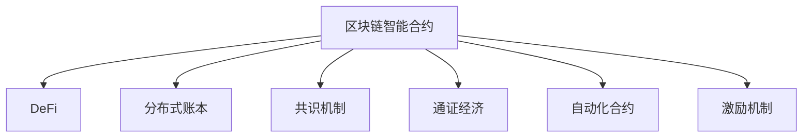

                 

# 知识经济下知识付费的区块链智能合约应用

> 关键词：区块链智能合约,知识付费,DeFi(去中心化金融),分布式账本,共识机制,通证经济,自动化合约,激励机制

## 1. 背景介绍

### 1.1 问题由来

随着互联网的普及和数字技术的飞速发展，全球进入了知识经济时代。知识付费作为知识经济的重要表现形式，正在逐渐改变人们的获取信息和知识的传统模式。传统的书籍销售、报刊订阅、线下培训等方式在知识传播过程中存在信息不对称、知识更新慢、传播渠道单一等问题，而基于互联网的知识付费模式，打破了这些束缚，让知识传播变得高效、便捷、个性化。

然而，知识付费领域也面临着诸多挑战。由于缺乏有效的版权保护、付费机制不透明、用户信任度不高，导致知识付费平台难以获得持续的盈利和用户粘性。这些问题催生了新的解决思路：区块链智能合约。

区块链智能合约是一段自动执行的代码，部署在区块链上，在满足一定条件时自动触发执行。其核心思想是代码即法律，通过代码来实现对各种业务逻辑的自动化控制，从而减少人为干预，降低风险，提高效率。

### 1.2 问题核心关键点

本节将重点介绍区块链智能合约在知识付费应用中的核心概念和设计要点：

- 区块链智能合约：代码即法律，自动执行的合约代码。
- 去中心化金融(DeFi)：一种基于区块链的新型金融模式，主要特点在于资产所有权与使用权的分离。
- 分布式账本：去中心化、安全可靠的记录系统，所有参与方共享账本数据。
- 共识机制：在分布式网络中达成一致的方法，如PoW、PoS等。
- 通证经济：通过发行数字资产来激励参与者，构成一种新的经济体系。
- 自动化合约：通过代码实现的各种自动化控制，无需人为干预。
- 激励机制：基于智能合约设计，通过奖励和惩罚，激励参与者。

这些核心概念共同构成了区块链智能合约的基础框架，对于其在知识付费领域的应用具有重要的指导意义。

## 2. 核心概念与联系

### 2.1 核心概念概述

为了更好地理解区块链智能合约在知识付费中的应用，本节将介绍几个密切相关的核心概念：

- 区块链智能合约：自动执行的合约代码，部署在区块链上，实现对各种业务逻辑的自动化控制。

- 去中心化金融(DeFi)：一种基于区块链的新型金融模式，主要特点在于资产所有权与使用权的分离，通过智能合约实现各种金融服务。

- 分布式账本：去中心化、安全可靠的记录系统，所有参与方共享账本数据，减少信息不对称。

- 共识机制：在分布式网络中达成一致的方法，如PoW、PoS等，保证网络安全性和数据一致性。

- 通证经济：通过发行数字资产来激励参与者，构成一种新的经济体系。

- 自动化合约：通过代码实现的各种自动化控制，无需人为干预，提高效率和安全性。

- 激励机制：基于智能合约设计，通过奖励和惩罚，激励参与者，保证系统的公平性和良性循环。

这些核心概念之间的逻辑关系可以通过以下Mermaid流程图来展示：



这个流程图展示了区块链智能合约的核心概念及其之间的关系：

1. 区块链智能合约通过自动化合约和激励机制，在分布式账本上实现DeFi金融服务。
2. 分布式账本通过共识机制保障数据安全性和一致性。
3. 通证经济通过智能合约发行数字资产，激励参与者。
4. 自动化合约实现业务逻辑的自动化控制，减少人为干预。

## 3. 核心算法原理 & 具体操作步骤
### 3.1 算法原理概述

区块链智能合约的核心思想是通过代码实现业务逻辑的自动化控制，自动执行预设条件下的合约条款。其主要算法原理如下：

1. 定义智能合约的触发条件和执行逻辑，通过代码实现。
2. 在区块链上部署智能合约代码，使其成为不可篡改的分布式账本记录。
3. 当触发条件满足时，智能合约自动执行其逻辑，完成预设操作。
4. 通过激励机制和通证经济，保障系统的公平性和参与者的积极性。

### 3.2 算法步骤详解

以下是区块链智能合约在知识付费应用中的详细操作步骤：

**Step 1: 定义智能合约条款**

1. 收集并分析知识付费领域常见的业务场景，如课程购买、内容更新、学员反馈等，明确每个场景的具体需求和规则。
2. 根据需求，设计智能合约的触发条件和执行逻辑，如课程购买时需支付一定数量的通证，课程更新时需获得课程作者的授权，学员反馈时需达到一定的投票数等。
3. 使用Solidity等智能合约编写语言，实现代码逻辑，确保逻辑正确且可执行。

**Step 2: 部署智能合约到区块链**

1. 选择适合的区块链平台，如Ethereum、Binance Smart Chain等。
2. 编写并测试智能合约代码，确保其正确性。
3. 将智能合约代码部署到区块链上，并生成合约地址。
4. 在合约地址上配置所需权限和参数，确保合约可正常触发和执行。

**Step 3: 实现用户交互界面**

1. 设计并实现用户交互界面，如Web端、App端等，方便用户进行课程购买、内容更新、学员反馈等操作。
2. 通过API接口连接智能合约，实现数据交互和合约调用。
3. 确保用户界面的安全性和可靠性，防止恶意操作。

**Step 4: 设定激励机制**

1. 定义智能合约的激励机制，如通证奖励、积分系统等，以激励参与者。
2. 设定触发条件的奖励和惩罚规则，确保系统的公平性和良性循环。
3. 定期发布激励机制的执行结果，提高用户参与度。

### 3.3 算法优缺点

区块链智能合约在知识付费应用中具有以下优点：

1. 自动执行：通过智能合约代码实现自动化控制，减少人为干预，提高效率和安全性。
2. 透明度高：所有操作和数据记录在区块链上，可追溯、可审计，保障系统透明性。
3. 去中心化：无需第三方中介机构，减少信息不对称，降低交易成本。
4. 可编程性：通过代码实现业务逻辑，灵活性高，可扩展性强。

同时，也存在一些缺点：

1. 复杂度高：智能合约代码需经过严格的测试和审核，复杂度高，开发成本大。
2. 扩展性有限：智能合约的扩展性受限于区块链平台的性能和技术成熟度。
3. 法律和监管问题：智能合约的法律地位和监管问题尚未明确，存在法律风险。
4. 技术门槛高：智能合约需要具备一定的技术背景和开发经验，普及度低。

### 3.4 算法应用领域

区块链智能合约在知识付费领域的应用主要包括以下几个方面：

1. 课程购买：通过智能合约自动执行课程购买流程，保障交易安全性和透明度。
2. 内容更新：智能合约自动判断课程内容更新权限，保障作者权益，确保更新内容的权威性和真实性。
3. 学员反馈：通过智能合约和投票系统，收集学员反馈，提升课程质量和学员满意度。
4. 版权保护：智能合约自动执行版权保护机制，防止侵权行为，保障内容版权。
5. 内容激励：通过智能合约的激励机制，激励作者和学员的积极参与，提升知识付费平台的粘性和活跃度。

这些应用场景展示了智能合约在知识付费领域的广泛应用，为知识付费平台的健康发展提供了新的技术支持。

## 4. 数学模型和公式 & 详细讲解 & 举例说明

### 4.1 数学模型构建

在区块链智能合约中，涉及到的数学模型主要包括：

1. 触发条件的定义和计算：通过数学公式表示智能合约的触发条件，如支付金额、时间戳、投票数等。
2. 激励机制的计算：通过数学模型计算通证奖励和惩罚的金额和比例。
3. 智能合约执行结果的统计和分析：通过数学模型统计和分析合约执行结果，评估系统性能。

### 4.2 公式推导过程

以下以课程购买智能合约为例，推导其中的数学模型和公式：

**支付金额计算公式：**

设课程价格为 $P$，用户支付的金额为 $A$，则支付金额计算公式为：

$$ A = P \times \frac{Q}{100} $$

其中，$Q$ 为通证数量，$100$ 为通证和货币的兑换比例。

**课程更新授权公式：**

设课程更新时间为 $T$，当前时间为 $t$，更新授权时间为 $\Delta T$，则更新授权公式为：

$$ \text{授权} = (t - T) \leq \Delta T $$

当满足此条件时，用户获得课程更新授权。

**学员反馈投票公式：**

设总投票数为 $V$，学员投票数为 $N$，则学员反馈投票公式为：

$$ N = \frac{V}{10} $$

其中，$10$ 为投票权重，表示每个学员的投票权为总投票数的十分之一。

### 4.3 案例分析与讲解

以下以Ethereum平台为例，展示知识付费应用中的智能合约实现：

**课程购买智能合约：**

```solidity
pragma solidity ^0.8.0;

contract CoursePurchase {
    address payable public owner;
    uint public price;
    uint public tokenId;
    
    event Payment(uint tokenId, address buyer, uint amount, uint amountPaid);
    event Authorization(uint tokenId, address buyer, bool authorized);
    
    function initContract(address payable _owner, uint _price, uint _tokenId) public {
        owner = _owner;
        price = _price;
        tokenId = _tokenId;
    }
    
    function buyCourse(uint _amount, uint _amountPaid) public payable {
        uint amountPaid = msg.value;
        require(amountPaid == _amountPaid, "Invalid payment amount");
        uint totalAmount = _amount * price / 100;
        require(amountPaid == totalAmount, "Insufficient payment");
        uint tokenId = _tokenId;
        emit Payment(tokenId, msg.sender, _amount, amountPaid);
        owner.transfer(_amountPaid);
    }
    
    function updateCourse() public {
        owner.send(price * 0.1); // 课程作者获得10%的更新费用
        emit Authorization(tokenId, msg.sender, true);
    }
}
```

以上代码展示了课程购买智能合约的主要功能，包括课程购买、课程更新和授权等。其中，`buyCourse` 函数实现用户支付课程费用，`updateCourse` 函数实现课程更新并授权。

**学员反馈智能合约：**

```solidity
pragma solidity ^0.8.0;

contract Vote {
    uint public voteThreshold;
    uint public totalVotes;
    uint public voteCounter[10]; // 每个学员投票权为10
    uint public totalVotesCounted;
    
    constructor(uint _voteThreshold) public {
        voteThreshold = _voteThreshold;
        totalVotes = 0;
        voteCounter[0] = 10; // 第一个学员投票权为10
        totalVotesCounted = 0;
    }
    
    function vote() public {
        require(voteCounter[msg.sender] > 0, "No more votes for this user");
        voteCounter[msg.sender]--;
        totalVotesCounted++;
        totalVotes += 1;
        emit Vote(msg.sender);
    }
    
    function checkVotes() public view returns (bool valid) {
        require(totalVotesCounted >= voteThreshold, "Not enough votes");
        return true;
    }
}
```

以上代码展示了学员反馈智能合约的主要功能，包括投票和投票结果验证。其中，`vote` 函数实现学员投票，`checkVotes` 函数实现投票结果验证。

## 5. 项目实践：代码实例和详细解释说明
### 5.1 开发环境搭建

在进行智能合约开发前，我们需要准备好开发环境。以下是使用Solidity进行Ethereum智能合约开发的环境配置流程：

1. 安装Node.js和npm：从官网下载并安装Node.js和npm，用于后续开发和编译。

2. 安装Truffle框架：通过npm安装Truffle框架，并创建一个新的Truffle项目：

```bash
npm install -g truffle
truffle init MyProject
cd MyProject
```

3. 安装Ethereum客户端：从官网下载并安装Ganache或Remix等Ethereum客户端，用于本地测试和部署。

4. 安装Solidity编译器：通过npm安装Solidity编译器，并配置Truffle项目：

```bash
npm install -g solc
solc --version
```

5. 编写和测试智能合约：

```solidity
pragma solidity ^0.8.0;

contract CoursePurchase {
    address payable public owner;
    uint public price;
    uint public tokenId;
    
    event Payment(uint tokenId, address buyer, uint amount, uint amountPaid);
    event Authorization(uint tokenId, address buyer, bool authorized);
    
    function initContract(address payable _owner, uint _price, uint _tokenId) public {
        owner = _owner;
        price = _price;
        tokenId = _tokenId;
    }
    
    function buyCourse(uint _amount, uint _amountPaid) public payable {
        uint amountPaid = msg.value;
        require(amountPaid == _amountPaid, "Invalid payment amount");
        uint totalAmount = _amount * price / 100;
        require(amountPaid == totalAmount, "Insufficient payment");
        uint tokenId = _tokenId;
        emit Payment(tokenId, msg.sender, _amount, amountPaid);
        owner.transfer(_amountPaid);
    }
    
    function updateCourse() public {
        owner.send(price * 0.1); // 课程作者获得10%的更新费用
        emit Authorization(tokenId, msg.sender, true);
    }
}
```

### 5.2 源代码详细实现

下面我们以Ethereum平台为例，展示知识付费应用中的智能合约实现。

**课程购买智能合约：**

```solidity
pragma solidity ^0.8.0;

contract CoursePurchase {
    address payable public owner;
    uint public price;
    uint public tokenId;
    
    event Payment(uint tokenId, address buyer, uint amount, uint amountPaid);
    event Authorization(uint tokenId, address buyer, bool authorized);
    
    function initContract(address payable _owner, uint _price, uint _tokenId) public {
        owner = _owner;
        price = _price;
        tokenId = _tokenId;
    }
    
    function buyCourse(uint _amount, uint _amountPaid) public payable {
        uint amountPaid = msg.value;
        require(amountPaid == _amountPaid, "Invalid payment amount");
        uint totalAmount = _amount * price / 100;
        require(amountPaid == totalAmount, "Insufficient payment");
        uint tokenId = _tokenId;
        emit Payment(tokenId, msg.sender, _amount, amountPaid);
        owner.transfer(_amountPaid);
    }
    
    function updateCourse() public {
        owner.send(price * 0.1); // 课程作者获得10%的更新费用
        emit Authorization(tokenId, msg.sender, true);
    }
}
```

**学员反馈智能合约：**

```solidity
pragma solidity ^0.8.0;

contract Vote {
    uint public voteThreshold;
    uint public totalVotes;
    uint public voteCounter[10]; // 每个学员投票权为10
    uint public totalVotesCounted;
    
    constructor(uint _voteThreshold) public {
        voteThreshold = _voteThreshold;
        totalVotes = 0;
        voteCounter[0] = 10; // 第一个学员投票权为10
        totalVotesCounted = 0;
    }
    
    function vote() public {
        require(voteCounter[msg.sender] > 0, "No more votes for this user");
        voteCounter[msg.sender]--;
        totalVotesCounted++;
        totalVotes += 1;
        emit Vote(msg.sender);
    }
    
    function checkVotes() public view returns (bool valid) {
        require(totalVotesCounted >= voteThreshold, "Not enough votes");
        return true;
    }
}
```

### 5.3 代码解读与分析

让我们再详细解读一下关键代码的实现细节：

**课程购买智能合约：**

- `initContract` 函数：初始化智能合约，设置合约所有者、课程价格和通证ID。
- `buyCourse` 函数：用户购买课程，验证支付金额和课程价格，更新状态并发出支付事件。
- `updateCourse` 函数：课程作者更新课程内容，向作者支付费用，并发出授权事件。

**学员反馈智能合约：**

- `constructor` 函数：初始化投票阈值和总投票数，设定第一个学员的投票权为10。
- `vote` 函数：学员投票，更新投票计数器和总投票数，并发出投票事件。
- `checkVotes` 函数：验证投票结果，检查是否达到投票阈值。

## 6. 实际应用场景
### 6.1 智能课程购买平台

基于区块链智能合约的知识付费平台，可以实现高效的课程购买和课程更新。用户只需在平台上支付通证，即获得课程访问权，无需通过第三方中介机构。课程作者可以通过智能合约自动获得课程更新费用，确保更新内容的权威性和真实性。平台通过智能合约的激励机制，鼓励课程作者和学员的积极参与，提升平台的粘性和活跃度。

### 6.2 学术研究基金

区块链智能合约可以用于学术研究基金的管理和分配。研究人员通过智能合约提交项目申请，经过同行评审后，获得研究经费。智能合约可以自动跟踪研究进展，并在符合条件时释放经费，确保资金使用透明、公正。同时，智能合约的激励机制可以激励研究人员按时完成任务，提升研究质量。

### 6.3 在线教育平台

在线教育平台可以通过智能合约实现课程的自动购买、更新和授权。用户只需在平台上购买课程，即可随时访问，无需担心版权问题。课程作者可以通过智能合约自动获得更新费用，确保课程内容的持续更新和改进。平台通过智能合约的激励机制，鼓励学员积极参与课程讨论和反馈，提升课程质量和用户满意度。

### 6.4 未来应用展望

随着区块链技术的不断成熟，智能合约在知识付费领域的应用将更加广泛和深入。未来可能出现更多创新的应用场景，如：

- 知识共享平台：通过智能合约实现知识共享和版权保护，促进知识的传播和利用。
- 学术社交平台：基于智能合约实现学术成果的分享和评价，提升学术交流的效率和质量。
- 在线社区平台：通过智能合约实现社区内容的自动审核和管理，提高社区管理的透明度和公平性。
- 智能版权管理系统：通过智能合约实现版权的自动授权和追踪，保障知识产权的保护和利益分配。

## 7. 工具和资源推荐
### 7.1 学习资源推荐

为了帮助开发者系统掌握区块链智能合约的理论基础和实践技巧，这里推荐一些优质的学习资源：

1. 《Mastering Solidity》书籍：系统介绍Solidity语言和智能合约开发的最佳实践。

2. 《Ethereum Yellow Paper》：以太坊官方白皮书，详细介绍了以太坊的技术架构和智能合约设计。

3. 《Smart Contract Security》课程：以太坊基金会和Consensys Academy合作的智能合约安全课程，涵盖智能合约的安全性和最佳实践。

4. Solidity官方文档：Solidity语言的官方文档，包含完整的语法和API接口。

5. OpenZeppelin：智能合约的安全性测试工具和最佳实践库，帮助开发者防范智能合约的安全风险。

6. ConsenSys Academy：提供高质量的智能合约开发和DeFi课程，涵盖从入门到高级的智能合约开发内容。

通过对这些资源的学习实践，相信你一定能够快速掌握区块链智能合约的精髓，并用于解决实际的NLP问题。

### 7.2 开发工具推荐

高效的开发离不开优秀的工具支持。以下是几款用于区块链智能合约开发的常用工具：

1. Solidity IDE：如Remix、Truffle等，提供智能合约的编写、测试和部署环境，支持丰富的代码补全和调试功能。

2. MetaMask：以太坊官方钱包，支持智能合约的交互和交易，方便用户进行智能合约的调用和测试。

3. Ganache：以太坊本地测试工具，支持本地智能合约的编写和测试，无需部署到区块链上。

4. Remix IDE：支持Solidity语言的智能合约开发，提供丰富的代码编辑和调试功能。

5. Infura：以太坊主网测试网络，提供免费的测试工具和API接口，方便智能合约的测试和部署。

6. Web3.js：用于在Web端开发智能合约的JavaScript库，支持智能合约的调用和交互。

合理利用这些工具，可以显著提升区块链智能合约的开发效率，加快创新迭代的步伐。

### 7.3 相关论文推荐

区块链智能合约的发展源于学界的持续研究。以下是几篇奠基性的相关论文，推荐阅读：

1. Ethereum Whitepaper：以太坊官方白皮书，详细介绍了以太坊的技术架构和智能合约设计。

2. Smart Contract Patterns: Towards a Structured Development of Smart Contracts：介绍智能合约的设计模式和最佳实践，帮助开发者编写高质量的智能合约。

3. Security-Oracle Access via Secure Computation：介绍安全访问外部信息的方法，帮助智能合约安全地访问外部数据。

4. Decentralized Autonomous Organizations：介绍去中心化自治组织（DAO）的设计和应用，展示智能合约在治理和组织中的应用。

5. Snark for Smart Contracts：介绍零知识证明（ZKP）技术，帮助智能合约实现隐私保护和安全传输。

这些论文代表了大语言模型微调技术的发展脉络。通过学习这些前沿成果，可以帮助研究者把握学科前进方向，激发更多的创新灵感。

## 8. 总结：未来发展趋势与挑战

### 8.1 总结

本文对区块链智能合约在知识付费应用中的核心概念和设计要点进行了全面系统的介绍。首先阐述了区块链智能合约在知识付费中的核心思想和应用场景，明确了智能合约在实现知识付费自动化控制和透明化管理方面的独特价值。其次，从原理到实践，详细讲解了智能合约的编写、测试和部署过程，给出了智能合约开发的完整代码实例。同时，本文还广泛探讨了智能合约在知识付费领域的应用前景，展示了其广阔的发展空间。最后，本文精选了智能合约学习的各类资源，力求为读者提供全方位的技术指引。

通过本文的系统梳理，可以看到，区块链智能合约在知识付费领域的应用前景广阔，其带来的自动化控制和透明化管理将彻底改变知识付费平台的运作模式，提升知识付费系统的效率和安全性。未来，随着区块链技术的不断成熟和普及，智能合约必将在更多领域得到应用，为知识经济的发展注入新的动力。

### 8.2 未来发展趋势

展望未来，区块链智能合约在知识付费领域的应用将呈现以下几个发展趋势：

1. 智能合约自动化控制程度更高：未来智能合约将实现更加复杂和精细的控制逻辑，减少人为干预，提高效率和安全性。

2. 跨链互操作性增强：不同区块链平台之间的智能合约将实现更加无缝的互操作，促进跨平台应用的发展。

3. 去中心化自治组织（DAO）兴起：基于智能合约的DAO将获得更广泛的应用，成为去中心化管理和治理的新模式。

4. 隐私保护和数据安全提升：未来的智能合约将更加注重隐私保护和数据安全，采用零知识证明等技术保障数据的机密性和安全性。

5. 智能合约的扩展性增强：未来的智能合约将具备更高的扩展性和可扩展性，支持大规模的并发操作和复杂的操作逻辑。

6. 智能合约与DeFi的深度融合：智能合约将与DeFi深度融合，构建更加复杂的金融服务体系，推动去中心化金融的发展。

这些趋势展示了区块链智能合约在知识付费领域的应用前景，为知识付费平台的创新和升级提供了新的思路。

### 8.3 面临的挑战

尽管区块链智能合约在知识付费领域的应用前景广阔，但在迈向更加智能化、普适化应用的过程中，它仍面临诸多挑战：

1. 技术门槛高：智能合约的开发和部署需要具备一定的技术背景和开发经验，普及度较低。

2. 法律和监管问题：智能合约的法律地位和监管问题尚未明确，存在法律风险。

3. 安全性问题：智能合约的安全性和隐私保护问题尚未彻底解决，存在被攻击和篡改的风险。

4. 扩展性和性能瓶颈：智能合约的扩展性和性能问题尚未完全解决，部分操作可能面临延迟和成本高的问题。

5. 市场接受度低：智能合约的市场接受度较低，部分用户对智能合约的信任度不高。

6. 系统复杂度高：智能合约的系统复杂度高，开发和维护成本较大。

这些挑战需要开发者和研究者不断克服，才能真正实现智能合约在知识付费领域的落地应用。

### 8.4 研究展望

面对智能合约所面临的挑战，未来的研究需要在以下几个方面寻求新的突破：

1. 降低技术门槛：通过智能合约的标准化和工具化，降低开发和部署的技术门槛，提高普及度。

2. 法律和监管合规：研究智能合约的法律和监管问题，建立完善的法律和监管框架，保障系统的合法性和合规性。

3. 提高安全性：开发更加安全的智能合约设计方法，采用多层次的安全防护措施，保障系统的安全性。

4. 提升扩展性和性能：研究智能合约的扩展性和性能优化技术，提高系统的可扩展性和处理能力。

5. 提升市场接受度：通过教育宣传和实际应用，提高用户对智能合约的信任度和接受度，促进系统的普及应用。

6. 系统复杂度优化：通过模块化设计和标准化接口，降低智能合约的系统复杂度，提高开发和维护效率。

这些研究方向的探索，必将引领区块链智能合约技术迈向更高的台阶，为知识付费平台的健康发展提供新的技术支持。面向未来，区块链智能合约必将在知识经济时代发挥更加重要的作用，推动知识付费产业的持续创新和升级。

## 9. 附录：常见问题与解答

**Q1：区块链智能合约和传统合约有什么区别？**

A: 区块链智能合约与传统合约的主要区别在于其自动化执行和分布式记录特性：

1. 自动化执行：智能合约通过代码实现自动化的控制逻辑，一旦满足触发条件，智能合约自动执行，无需人为干预。

2. 分布式记录：智能合约的执行记录和数据存储在分布式账本上，所有参与方共享，保障数据的透明性和不可篡改性。

3. 智能合约无中心化管理：传统合约需要第三方中介机构进行管理，而智能合约通过共识机制实现自治管理，减少信息不对称和信任风险。

4. 智能合约的编程可扩展性：智能合约通过代码实现，编程可扩展性强，可以根据需求灵活调整合约逻辑。

**Q2：如何保证智能合约的安全性？**

A: 保障智能合约的安全性需要综合考虑以下几个方面：

1. 代码审计：对智能合约代码进行严格的审计和测试，确保代码的正确性和安全性。

2. 安全性设计：在智能合约设计阶段，引入安全性设计原则，如最小权限原则、代码模块化等。

3. 采用安全性措施：使用多重签名、访问控制等安全性措施，防止合约被恶意攻击和篡改。

4. 智能合约的安全性工具：使用像MythX、OWASP等安全性工具，对智能合约进行自动化安全性检查。

5. 代码更新和维护：定期更新和维护智能合约代码，修复已知的安全漏洞，保持代码的安全性。

**Q3：智能合约的扩展性如何保障？**

A: 保障智能合约的扩展性需要综合考虑以下几个方面：

1. 模块化设计：将智能合约的逻辑拆分成模块，每个模块独立开发，提高系统的可扩展性。

2. 接口标准化：制定统一的智能合约接口标准，方便不同模块之间的协同工作。

3. 代码优化：优化智能合约的代码结构，减少冗余，提高代码的执行效率。

4. 采用高性能平台：使用高性能的区块链平台，如Ethereum 2.0，支持大规模并发操作和复杂的操作逻辑。

5. 智能合约的分层设计：采用分层设计，将智能合约分为不同层级，方便扩展和升级。

**Q4：智能合约如何实现跨链互操作？**

A: 实现智能合约的跨链互操作需要综合考虑以下几个方面：

1. 跨链协议：设计跨链协议，实现不同区块链平台之间的数据传输和同步。

2. 跨链接口：实现跨链接口，方便不同区块链平台之间的智能合约交互。

3. 跨链桥接：采用跨链桥接技术，实现不同区块链平台之间的资产互操作。

4. 跨链共识机制：设计跨链共识机制，确保不同区块链平台之间的数据一致性和系统安全。

5. 跨链治理机制：设计跨链治理机制，确保不同区块链平台之间的自治管理和决策一致性。

**Q5：智能合约在知识付费平台中的应用前景如何？**

A: 智能合约在知识付费平台中的应用前景广阔，具体体现在以下几个方面：

1. 课程购买自动化：智能合约实现课程的自动购买和更新，提高用户购买和使用课程的便捷性。

2. 课程版权保护：智能合约实现课程的版权保护，防止侵权行为，保障课程作者的权益。

3. 课程内容更新：智能合约实现课程内容的自动更新和授权，确保课程内容的持续改进和优化。

4. 学员反馈管理：智能合约实现学员的自动反馈和投票管理，提升课程质量和用户满意度。

5. 学术研究基金管理：智能合约实现学术研究基金的管理和分配，确保资金使用透明和公正。

6. 知识共享平台：智能合约实现知识的自动共享和版权保护，促进知识的传播和利用。

综上所述，智能合约在知识付费领域的应用前景广阔，为知识付费平台的健康发展和创新升级提供了新的技术支持。

---

作者：禅与计算机程序设计艺术 / Zen and the Art of Computer Programming

