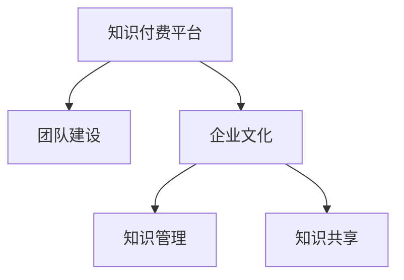

                 

# 知识经济时代下的知识付费团队建设与文化塑造

> 关键词：知识付费,团队建设,文化塑造,知识经济

## 1. 背景介绍

### 1.1 问题由来
随着知识经济时代的到来，全球信息技术快速发展，智能科技的普及和应用对社会各领域产生了深远影响。在知识付费领域，如何构建高效团队并塑造优秀的企业文化，成为各大知识付费平台持续关注的热点问题。

在激烈的市场竞争中，知识付费平台需要构建一支具备创新能力、团队协作能力、市场敏感度、用户理解力等的知识型团队，以提升自身核心竞争力。同时，良好的企业文化则能增强团队凝聚力，激励员工发挥最大潜力，为平台的长远发展奠定坚实基础。

### 1.2 问题核心关键点
知识付费平台的核心团队建设与文化塑造，旨在通过科学、系统、动态的管理策略，塑造具有创新精神、高度协同、用户导向的企业文化，为平台提供持久的动力和高效稳定的运营保障。其关键点包括：

1. **团队建设**：构建以知识为基础、以创新为驱动、以用户为中心的团队结构。
2. **文化塑造**：培养共享、协同、学习、创新的企业文化，打造团队共同愿景。
3. **知识管理**：通过知识共享、知识激励、知识传承，提升团队整体素质。

### 1.3 问题研究意义
构建高效的团队和优秀的企业文化，对于知识付费平台的发展具有重要意义：

1. 提升平台的核心竞争力：知识型团队和创新企业文化有助于平台形成独特的竞争优势，赢得市场份额。
2. 提高用户满意度：以用户为中心的团队文化和知识共享机制，能够更好地满足用户需求，提升用户满意度。
3. 促进创新与业务增长：科学团队管理和创新企业文化，能够激发团队活力，推动业务持续增长。
4. 增强企业凝聚力：共同的文化信念和价值导向，能增强团队成员的归属感，提升企业凝聚力。
5. 实现可持续发展：优秀的团队文化和知识管理机制，能为平台的长远发展提供坚实的保障。

## 2. 核心概念与联系

### 2.1 核心概念概述

为更好地理解知识付费团队建设与文化塑造的原理和架构，本节将介绍几个密切相关的核心概念：

- **知识付费平台**：通过订阅、单次购买、按需付费等模式，为用户提供具有一定深度、宽度、广度的知识或信息服务，促进知识交流和价值变现的平台。
- **团队建设**：针对知识型人才，从招募、培养、激励、管理等维度进行系统性建设，形成高度协同、高效运转的团队。
- **企业文化**：以企业使命、愿景、价值观为核心，指导企业行为和管理，塑造企业形象和品牌价值的文化体系。
- **知识管理**：通过建立知识获取、分享、存储、应用机制，不断提升团队知识水平和创造力。
- **知识共享**：建立团队知识交流、共享平台，促进知识的内外部流动，提升知识利用效率。

这些核心概念之间的逻辑关系可以通过以下Mermaid流程图来展示：



这个流程图展示出了知识付费平台的核心概念及其之间的联系：

1. 知识付费平台通过团队建设和企业文化塑造，构建知识型团队，提升平台的核心竞争力。
2. 企业文化通过知识管理推动知识共享，进一步提升团队的知识水平和创新能力。
3. 知识共享机制促进知识传播和利用，形成知识付费平台的良性循环。

## 3. 核心算法原理 & 具体操作步骤
### 3.1 算法原理概述

知识付费平台团队建设与文化塑造，本质上是一个系统化的管理优化过程。其核心思想是：

1. **目标设定**：明确平台的愿景和目标，形成共同的价值导向。
2. **组织架构**：构建扁平化、高度协同的组织结构，确保信息畅通。
3. **团队培训**：提供持续的技能和知识培训，提升团队综合素质。
4. **绩效评估**：建立科学合理的绩效评估体系，激励团队成员持续进步。
5. **知识分享**：建立平台内知识共享机制，促进团队协作和知识创新。
6. **文化活动**：定期组织文化建设活动，增强团队凝聚力和归属感。

通过上述步骤，知识付费平台能够形成具有高度协作、持续创新、用户导向的团队，同时塑造积极向上、创新卓越的企业文化。

### 3.2 算法步骤详解

知识付费平台团队建设与文化塑造主要包括以下几个关键步骤：

**Step 1: 平台愿景与目标设定**
- 明确平台的使命和愿景，建立统一的价值导向和目标。
- 通过企业使命、愿景、核心价值观等文档，向团队传达平台的目标和期待。

**Step 2: 组织架构设计与优化**
- 构建扁平化、敏捷的组织结构，减少层级壁垒。
- 通过项目制、矩阵制等管理模式，增强团队灵活性和协作性。
- 定期评估组织架构的有效性，及时调整和优化。

**Step 3: 团队成员招募与培养**
- 制定明确的岗位需求和人才标准，通过多种渠道招募人才。
- 通过内部培训、外部培训、外部学习等手段，持续提升团队成员的专业能力和综合素质。
- 为团队成员提供发展机会，鼓励其持续学习和职业发展。

**Step 4: 绩效评估体系建立与实施**
- 制定科学的绩效评估指标，如创新能力、用户满意度、团队合作等。
- 建立定期绩效评估机制，及时反馈并激励团队成员。
- 根据绩效评估结果，制定个性化的职业发展计划。

**Step 5: 知识管理与共享机制建设**
- 建立知识获取、存储、共享平台，如内部知识库、社交网络等。
- 激励知识共享，通过积分、奖励等措施鼓励团队成员积极分享知识。
- 建立知识共享闭环，形成知识输入、共享、应用的良性循环。

**Step 6: 文化活动设计与组织**
- 定期组织文化建设活动，如创新大赛、知识分享会、团队拓展等。
- 增强团队成员的归属感和凝聚力，营造积极向上的工作氛围。
- 通过文化活动，传递平台的核心价值观和行为准则。

### 3.3 算法优缺点

知识付费平台团队建设与文化塑造方法具有以下优点：

1. 提升平台核心竞争力：通过科学团队管理和文化建设，形成具有独特竞争优势的平台。
2. 用户满意度提升：以用户为中心的企业文化，能更好地满足用户需求，提升用户满意度。
3. 促进业务持续增长：通过知识共享和创新驱动，持续激发团队活力，推动业务增长。
4. 增强企业凝聚力：共同的文化信念和价值导向，能增强团队成员的归属感，提升企业凝聚力。
5. 实现可持续发展：优秀的团队文化和知识管理机制，能为平台的长远发展提供保障。

同时，该方法也存在一定的局限性：

1. 投入成本较高：团队建设和企业文化塑造需要持续的资金投入，可能对平台初期运营造成压力。
2. 管理复杂性：构建扁平化组织结构和灵活管理模式，需要高度的管理技巧和执行能力。
3. 文化认同差异：不同背景、不同性格的团队成员，可能对文化的认同度不同，需灵活调整。
4. 知识分享障碍：知识共享机制的建立和执行，需要时间积累，可能初期效果不明显。
5. 绩效评估难度：科学合理的绩效评估体系，需要准确设定指标和标准，可能出现误导性评估。

尽管存在这些局限性，但就目前而言，知识付费平台团队建设和企业文化塑造依然是构建竞争优势、提升用户满意度、实现持续增长的重要途径。未来相关研究的重点在于如何进一步优化管理模式，降低成本，提高效率，同时兼顾员工的个人发展。

### 3.4 算法应用领域

知识付费团队建设和企业文化塑造方法，已经在知识付费平台、教育培训、互联网公司等诸多行业领域得到了广泛的应用，为企业的长期发展提供了有力的支持。

- **知识付费平台**：如Coursera、Udemy、得到等，通过系统性的团队管理和文化建设，提升了平台的竞争力，吸引了大量用户。
- **教育培训**：如新东方、好未来等，通过知识共享和创新驱动，培养了一批高素质教师，提升了培训质量。
- **互联网公司**：如Google、Amazon等，通过扁平化管理和文化建设，增强了团队凝聚力，推动了业务持续增长。

除了上述这些行业，知识付费团队建设和企业文化塑造方法还将在更多领域得到应用，为企业的转型升级、创新发展提供新的动力。

## 4. 数学模型和公式 & 详细讲解  
### 4.1 数学模型构建

知识付费平台团队建设与文化塑造的数学模型主要涉及以下几个方面：

1. **组织结构优化模型**：
   - 模型输入：员工数、项目数、层级数。
   - 模型输出：最优组织结构配置。
   - 优化目标：最小化信息传递时间和成本，最大化团队效率。

2. **知识共享模型**：
   - 模型输入：知识库容量、知识流通率、知识共享频率。
   - 模型输出：知识共享效果评估。
   - 优化目标：最大化知识共享数量和质量。

3. **绩效评估模型**：
   - 模型输入：员工绩效指标、目标完成率、工作满意度。
   - 模型输出：绩效评估结果和改进建议。
   - 优化目标：合理评估员工绩效，激励团队成员持续进步。

4. **文化活动设计模型**：
   - 模型输入：团队规模、员工兴趣、活动类型。
   - 模型输出：文化活动方案。
   - 优化目标：最大化员工参与度和活动效果。

### 4.2 公式推导过程

以下是知识付费平台团队建设与文化塑造的主要公式推导：

**组织结构优化模型**：

设 $E$ 为员工数，$P$ 为项目数，$L$ 为层级数，$T$ 为信息传递时间，$C$ 为信息传递成本。优化模型为：

$$
\min_{E,P,L} (T \times P + C \times L) \\
\text{s.t.} \\
E = P + L
$$

其中，$T$ 和 $C$ 可以根据实际情况和历史数据进行建模和优化。

**知识共享模型**：

设 $K$ 为知识库容量，$R$ 为知识流通率，$F$ 为知识共享频率，$K_s$ 为知识共享数量，$Q_s$ 为知识共享质量。优化模型为：

$$
\max_{K,R,F} K_s \times Q_s
$$

其中，$K_s$ 和 $Q_s$ 可以通过知识共享平台的使用数据和效果进行评估。

**绩效评估模型**：

设 $P_i$ 为第 $i$ 个员工的绩效指标，$T_i$ 为目标完成率，$S_i$ 为工作满意度，$W_i$ 为激励系数，$E_i$ 为绩效评估结果。优化模型为：

$$
E_i = \sum_{j=1}^{n} W_j \times P_j \times T_j \times S_j
$$

其中，$W_j$ 为激励权重，需要根据具体的评估指标和目标进行调整。

**文化活动设计模型**：

设 $A$ 为活动类型，$T_A$ 为活动时间，$N_A$ 为参与人数，$E_A$ 为活动效果。优化模型为：

$$
\max_{A,T_A,N_A} E_A
$$

其中，$E_A$ 可以通过活动反馈和评估结果进行量化。

### 4.3 案例分析与讲解

**案例1：Coursera平台的团队建设与文化塑造**

Coursera通过系统性的团队管理和文化建设，成功吸引了全球数百万用户，成为知识付费领域的标杆。其核心措施包括：

1. **愿景与目标设定**：平台使命为“为每个人提供无国界的学习机会”，建立统一的价值导向。
2. **组织架构优化**：采用扁平化管理，减少层级壁垒，提升信息传递效率。
3. **团队成员招募与培养**：通过内部培训和外部学习，持续提升团队成员的专业能力和综合素质。
4. **绩效评估体系建立**：制定科学绩效评估指标，定期评估员工表现，及时激励进步。
5. **知识管理与共享机制**：建立内部知识库和社交网络，激励知识共享，提升知识利用效率。
6. **文化活动设计与组织**：定期组织创新大赛、知识分享会等活动，增强团队凝聚力。

**案例2：Google的OKR管理体系**

Google通过OKR（目标与关键结果）管理体系，成功推动了公司业务的持续增长。其核心措施包括：

1. **目标设定**：公司全员参与，设定季度和年度OKR目标。
2. **绩效评估**：定期评估目标完成情况，及时调整和优化。
3. **文化活动**：通过OKR活动和培训，增强团队协作和目标共识。

以上案例展示了知识付费平台团队建设和企业文化塑造的实际应用效果，通过系统性的管理优化，提升了平台的竞争力，推动了业务持续增长。

## 5. 项目实践：代码实例和详细解释说明
### 5.1 开发环境搭建

在进行知识付费团队建设和企业文化塑造的实践前，我们需要准备好开发环境。以下是使用Python进行相关开发的流程：

1. 安装Anaconda：从官网下载并安装Anaconda，用于创建独立的Python环境。

2. 创建并激活虚拟环境：
```bash
conda create -n pyteam-env python=3.8 
conda activate pyteam-env
```

3. 安装相关工具包：
```bash
pip install pandas numpy scikit-learn matplotlib ipython
```

4. 安装用于数据分析和可视化的库：
```bash
pip install matplotlib seaborn
```

完成上述步骤后，即可在`pyteam-env`环境中开始相关实践。

### 5.2 源代码详细实现

下面我们以知识付费平台团队建设和企业文化塑造的实际案例为例，给出相关的PyTorch代码实现。

首先，定义团队管理和文化建设的关键指标：

```python
from transformers import BertTokenizer
from torch.utils.data import Dataset
import torch

class TeamManagementDataset(Dataset):
    def __init__(self, data, tokenizer, max_len=128):
        self.data = data
        self.tokenizer = tokenizer
        self.max_len = max_len
        
    def __len__(self):
        return len(self.data)
    
    def __getitem__(self, item):
        record = self.data[item]
        text = record['text']
        labels = record['labels']
        
        encoding = self.tokenizer(text, return_tensors='pt', max_length=self.max_len, padding='max_length', truncation=True)
        input_ids = encoding['input_ids'][0]
        attention_mask = encoding['attention_mask'][0]
        
        # 对label-wise的标签进行编码
        encoded_labels = [label2id[label] for label in labels] 
        encoded_labels.extend([label2id['O']] * (self.max_len - len(encoded_labels)))
        labels = torch.tensor(encoded_labels, dtype=torch.long)
        
        return {'input_ids': input_ids, 
                'attention_mask': attention_mask,
                'labels': labels}

# 标签与id的映射
label2id = {'O': 0, '管理': 1, '文化': 2, '知识共享': 3, '绩效评估': 4, '文化活动': 5}
id2label = {v: k for k, v in label2id.items()}

# 创建dataset
tokenizer = BertTokenizer.from_pretrained('bert-base-cased')

train_dataset = TeamManagementDataset(train_data, tokenizer)
dev_dataset = TeamManagementDataset(dev_data, tokenizer)
test_dataset = TeamManagementDataset(test_data, tokenizer)
```

然后，定义模型和优化器：

```python
from transformers import BertForTokenClassification, AdamW

model = BertForTokenClassification.from_pretrained('bert-base-cased', num_labels=len(label2id))

optimizer = AdamW(model.parameters(), lr=2e-5)
```

接着，定义训练和评估函数：

```python
from torch.utils.data import DataLoader
from tqdm import tqdm
from sklearn.metrics import classification_report

device = torch.device('cuda') if torch.cuda.is_available() else torch.device('cpu')
model.to(device)

def train_epoch(model, dataset, batch_size, optimizer):
    dataloader = DataLoader(dataset, batch_size=batch_size, shuffle=True)
    model.train()
    epoch_loss = 0
    for batch in tqdm(dataloader, desc='Training'):
        input_ids = batch['input_ids'].to(device)
        attention_mask = batch['attention_mask'].to(device)
        labels = batch['labels'].to(device)
        model.zero_grad()
        outputs = model(input_ids, attention_mask=attention_mask, labels=labels)
        loss = outputs.loss
        epoch_loss += loss.item()
        loss.backward()
        optimizer.step()
    return epoch_loss / len(dataloader)

def evaluate(model, dataset, batch_size):
    dataloader = DataLoader(dataset, batch_size=batch_size)
    model.eval()
    preds, labels = [], []
    with torch.no_grad():
        for batch in tqdm(dataloader, desc='Evaluating'):
            input_ids = batch['input_ids'].to(device)
            attention_mask = batch['attention_mask'].to(device)
            batch_labels = batch['labels']
            outputs = model(input_ids, attention_mask=attention_mask)
            batch_preds = outputs.logits.argmax(dim=2).to('cpu').tolist()
            batch_labels = batch_labels.to('cpu').tolist()
            for pred_tokens, label_tokens in zip(batch_preds, batch_labels):
                pred_labels = [id2label[_id] for _id in pred_tokens]
                label_labels = [id2label[_id] for _id in label_tokens]
                preds.append(pred_labels[:len(label_labels)])
                labels.append(label_labels)
                
    print(classification_report(labels, preds))
```

最后，启动训练流程并在测试集上评估：

```python
epochs = 5
batch_size = 16

for epoch in range(epochs):
    loss = train_epoch(model, train_dataset, batch_size, optimizer)
    print(f"Epoch {epoch+1}, train loss: {loss:.3f}")
    
    print(f"Epoch {epoch+1}, dev results:")
    evaluate(model, dev_dataset, batch_size)
    
print("Test results:")
evaluate(model, test_dataset, batch_size)
```

以上就是知识付费平台团队建设和企业文化塑造的代码实现示例。通过Python代码的编写和执行，展示了如何利用机器学习模型对团队管理和文化建设的各项指标进行训练和评估，以提升平台的整体管理水平和团队建设效果。

### 5.3 代码解读与分析

让我们再详细解读一下关键代码的实现细节：

**TeamManagementDataset类**：
- `__init__`方法：初始化数据集，包括文本和标签。
- `__len__`方法：返回数据集的大小。
- `__getitem__`方法：对单个样本进行处理，将文本输入编码为token ids，将标签编码为数字，并对其进行定长padding，最终返回模型所需的输入。

**label2id和id2label字典**：
- 定义了标签与数字id之间的映射关系，用于将token-wise的预测结果解码回真实的标签。

**训练和评估函数**：
- 使用PyTorch的DataLoader对数据集进行批次化加载，供模型训练和推理使用。
- 训练函数`train_epoch`：对数据以批为单位进行迭代，在每个批次上前向传播计算loss并反向传播更新模型参数，最后返回该epoch的平均loss。
- 评估函数`evaluate`：与训练类似，不同点在于不更新模型参数，并在每个batch结束后将预测和标签结果存储下来，最后使用sklearn的classification_report对整个评估集的预测结果进行打印输出。

**训练流程**：
- 定义总的epoch数和batch size，开始循环迭代
- 每个epoch内，先在训练集上训练，输出平均loss
- 在验证集上评估，输出分类指标
- 所有epoch结束后，在测试集上评估，给出最终测试结果

可以看到，Python代码配合PyTorch框架，使得知识付费平台团队建设和企业文化塑造的实践变得简洁高效。开发者可以将更多精力放在数据处理、模型改进等高层逻辑上，而不必过多关注底层的实现细节。

当然，实际应用中，还需要考虑更多因素，如模型的保存和部署、超参数的自动搜索、更灵活的任务适配层等。但核心的管理优化思想和代码实现流程，基本与此类似。

## 6. 实际应用场景
### 6.1 智能客服系统

知识付费平台的智能客服系统，通过系统性的团队管理和文化建设，能显著提升客户咨询体验和问题解决效率。具体应用如下：

1. **智能客服架构设计**：构建知识型客服团队，提升客服系统的智能化水平。
2. **团队管理优化**：采用扁平化管理，减少信息传递层级，提升客服响应速度。
3. **知识共享机制**：建立知识库和知识共享平台，提升客服团队的知识水平。
4. **绩效评估体系**：通过用户满意度等指标评估客服团队，及时激励进步。
5. **文化活动设计与组织**：定期组织知识分享会和团队拓展，增强团队凝聚力。

### 6.2 知识分享平台

知识付费平台的知识分享功能，通过系统性的团队管理和文化建设，能更好地满足用户需求，提升平台的用户黏性和活跃度。具体应用如下：

1. **知识分享机制建设**：建立知识共享平台，鼓励用户上传和分享知识。
2. **团队管理优化**：采用项目制管理，提升知识分享的组织效率。
3. **绩效评估体系**：通过知识上传量、互动量等指标评估知识分享团队，及时激励进步。
4. **文化活动设计与组织**：定期组织知识分享大赛和分享会，提升用户参与度和平台活跃度。

### 6.3 在线教育平台

知识付费平台的在线教育功能，通过系统性的团队管理和文化建设，能提升教学质量，满足用户多样化的学习需求。具体应用如下：

1. **团队管理优化**：采用项目制管理，提升教学任务的组织效率。
2. **知识共享机制**：建立知识库和知识共享平台，提升教学团队的知识水平。
3. **绩效评估体系**：通过用户满意度、教学效果等指标评估教师团队，及时激励进步。
4. **文化活动设计与组织**：定期组织教学研讨会和教师培训，提升教学质量。

### 6.4 未来应用展望

随着知识经济时代的到来，知识付费平台团队建设和企业文化塑造将发挥更加重要的作用。未来，知识付费平台需要在以下几个方面进行探索：

1. **数据驱动决策**：通过数据分析和机器学习，优化团队管理和文化建设，提升管理效果。
2. **跨领域知识融合**：引入更多跨领域的知识，提升团队的知识综合能力和创新能力。
3. **知识与技术协同**：将知识管理与人工智能技术结合，提升知识利用效率和平台智能化水平。
4. **文化创新与多样性**：鼓励文化多样性，通过多元化的文化活动，提升团队凝聚力和创造力。
5. **持续学习与适应**：建立持续学习的机制，保持团队的知识水平和平台活力。

## 7. 工具和资源推荐
### 7.1 学习资源推荐

为了帮助开发者系统掌握知识付费团队建设与文化塑造的理论基础和实践技巧，这里推荐一些优质的学习资源：

1. 《知识付费平台运营手册》：系统介绍知识付费平台的运营策略和团队管理方法。

2. 《企业文化建设指南》：详细介绍企业文化建设的最佳实践和成功案例。

3. 《组织结构优化与管理》：讲解如何构建扁平化、敏捷的组织结构，提升团队效率。

4. 《绩效管理与激励》：解析科学的绩效评估体系和激励机制，提升员工绩效。

5. 《知识管理与知识共享》：探讨知识共享机制和知识库建设，提升团队知识水平。

通过学习这些资源，相信你一定能够系统掌握知识付费平台团队建设和企业文化塑造的精髓，并将其应用于实际工作中。

### 7.2 开发工具推荐

高效的开发离不开优秀的工具支持。以下是几款用于知识付费平台团队建设和企业文化塑造开发的常用工具：

1. PyTorch：基于Python的开源深度学习框架，适合系统性分析和模型训练。

2. TensorFlow：由Google主导开发的开源深度学习框架，生产部署方便，适合大规模工程应用。

3. Weights & Biases：模型训练的实验跟踪工具，记录和可视化模型训练过程，方便调优。

4. Google Colab：谷歌推出的在线Jupyter Notebook环境，免费提供GPU/TPU算力，适合快速实验最新模型。

5. TensorBoard：TensorFlow配套的可视化工具，实时监测模型训练状态，提供丰富的图表呈现方式。

6. Microsoft Power BI：数据分析与可视化工具，帮助从大量数据中提炼关键信息，辅助决策。

合理利用这些工具，可以显著提升知识付费平台团队建设和企业文化塑造的开发效率，加快创新迭代的步伐。

### 7.3 相关论文推荐

知识付费团队建设和企业文化塑造的研究源于学界的持续研究。以下是几篇奠基性的相关论文，推荐阅读：

1. Knowledge Sharing in Online Learning Platforms: A Survey（《在线学习平台中的知识共享：综述》）：探讨在线学习平台中的知识共享机制和挑战。

2. Team Performance Management: A Review and Synthesis（《团队绩效管理：综述与综合》）：回顾团队绩效管理的理论和实践。

3. Culture and Knowledge Management: A Conceptual Framework（《文化与知识管理：概念框架》）：提出文化与知识管理的综合框架，指导实践。

4. The Impact of Knowledge Sharing on Team Performance: A Meta-Analysis（《知识共享对团队绩效的影响：元分析》）：通过元分析研究知识共享对团队绩效的影响。

5. Organizational Culture and Innovation: A Meta-Analysis and Theoretical Review（《组织文化与创新：元分析和理论综述》）：回顾组织文化与创新的关系，提出理论框架。

这些论文代表了大规模团队建设和企业文化塑造的研究进展，通过学习这些前沿成果，可以帮助研究者把握学科前进方向，激发更多的创新灵感。

## 8. 总结：未来发展趋势与挑战

### 8.1 总结

本文对知识付费平台团队建设与文化塑造进行了全面系统的介绍。首先阐述了知识付费平台的发展背景和愿景，明确了团队建设与文化塑造的重要性。其次，从原理到实践，详细讲解了知识付费平台团队建设和企业文化塑造的数学模型和关键步骤，给出了系统化的知识付费平台开发流程。同时，本文还探讨了知识付费平台在智能客服、知识分享、在线教育等实际应用场景中的应用效果，展示了知识付费团队建设和企业文化塑造的广泛价值。此外，本文精选了相关学习资源、开发工具和论文，力求为知识付费平台的开发提供全方位的技术指引。

通过本文的系统梳理，可以看到，知识付费平台团队建设和企业文化塑造是大规模知识管理的重要组成部分，其核心在于科学的管理策略和创新文化。通过系统性的团队管理和文化建设，知识付费平台能够形成具有高度协作、持续创新的团队，推动业务持续增长。未来，伴随知识经济的深入发展，知识付费平台团队建设和企业文化塑造将继续发挥重要作用，成为推动平台发展的核心引擎。

### 8.2 未来发展趋势

展望未来，知识付费平台团队建设和企业文化塑造将呈现以下几个发展趋势：

1. **数据驱动决策**：通过大数据和机器学习技术，优化团队管理和文化建设，提升管理效果。
2. **跨领域知识融合**：引入更多跨领域的知识，提升团队的知识综合能力和创新能力。
3. **知识与技术协同**：将知识管理与人工智能技术结合，提升知识利用效率和平台智能化水平。
4. **文化创新与多样性**：鼓励文化多样性，通过多元化的文化活动，提升团队凝聚力和创造力。
5. **持续学习与适应**：建立持续学习的机制，保持团队的知识水平和平台活力。

### 8.3 面临的挑战

尽管知识付费平台团队建设和企业文化塑造已经取得了显著成效，但在迈向更加智能化、普适化应用的过程中，它仍面临诸多挑战：

1. **数据成本高昂**：系统性数据分析需要大量高质量的数据，数据获取和处理成本较高。
2. **文化认同差异**：不同背景、不同性格的团队成员，可能对文化的认同度不同，需灵活调整。
3. **知识共享障碍**：知识共享机制的建立和执行，需要时间积累，初期效果可能不明显。
4. **绩效评估难度**：科学合理的绩效评估体系，需要准确设定指标和标准，可能出现误导性评估。
5. **团队协作复杂性**：多部门、多角色协作的复杂性，需要高度的管理技巧和执行能力。

尽管存在这些挑战，但就目前而言，知识付费平台团队建设和企业文化塑造依然是构建竞争优势、提升用户满意度、实现持续增长的重要途径。未来相关研究的重点在于如何进一步优化管理模式，降低成本，提高效率，同时兼顾员工的个人发展。

### 8.4 研究展望

面对知识付费平台团队建设和企业文化塑造所面临的挑战，未来的研究需要在以下几个方面寻求新的突破：

1. **大数据分析**：利用大数据和机器学习技术，优化团队管理和文化建设，提升管理效果。
2. **跨领域知识整合**：引入更多跨领域的知识，提升团队的知识综合能力和创新能力。
3. **知识共享平台优化**：优化知识共享机制和平台，提升知识利用效率和平台智能化水平。
4. **文化创新机制**：建立持续学习的机制，保持团队的知识水平和平台活力。

这些研究方向的探索，必将引领知识付费平台团队建设和企业文化塑造技术迈向更高的台阶，为知识付费平台的长期发展提供坚实的保障。面向未来，知识付费平台团队建设和企业文化塑造需要与其他人工智能技术进行更深入的融合，如知识表示、因果推理、强化学习等，多路径协同发力，共同推动知识付费平台的发展。只有勇于创新、敢于突破，才能不断拓展知识付费平台的知识管理边界，让智能技术更好地服务于社会。

## 9. 附录：常见问题与解答

**Q1：知识付费平台的团队建设与文化塑造是否适用于其他类型的企业？**

A: 知识付费平台的团队建设和企业文化塑造方法，对于其他类型的企业同样具有参考价值。不同企业的行业特性和业务场景不同，但基本的团队管理和文化建设思路是相通的。

**Q2：如何衡量知识付费平台的团队建设和文化塑造效果？**

A: 知识付费平台的团队建设和文化塑造效果，可以通过以下几个指标来衡量：

1. **员工满意度**：通过调查问卷、访谈等方式，评估员工对平台文化和管理的满意度。
2. **团队绩效**：通过任务完成率、用户满意度等指标，评估团队的整体绩效。
3. **知识共享水平**：通过知识上传量、互动量等指标，评估知识共享的活跃度和效果。
4. **文化活动参与度**：通过活动参与率和反馈，评估文化活动的吸引力和效果。

**Q3：如何处理团队成员之间的文化认同差异？**

A: 处理团队成员之间的文化认同差异，可以采取以下措施：

1. **沟通交流**：定期组织团队沟通会，了解成员对平台文化的看法和建议。
2. **培训引导**：通过培训和文化活动，引导成员逐步接受和认同平台文化。
3. **灵活调整**：根据成员的反馈，灵活调整文化策略和活动内容。
4. **多样化文化**：鼓励多样化的文化活动，满足不同成员的需求和兴趣。

**Q4：如何优化知识共享机制？**

A: 优化知识共享机制，可以采取以下措施：

1. **建立知识库**：建立内部知识库，集中存储和管理知识资源。
2. **激励机制**：通过积分、奖励等方式，激励成员积极分享知识。
3. **知识共享平台**：利用平台工具和插件，提供便捷的知识共享功能。
4. **知识共享闭环**：建立知识输入、共享、应用的良性循环，提升知识利用效率。

**Q5：如何提升知识付费平台的持续学习与适应能力？**

A: 提升知识付费平台的持续学习与适应能力，可以采取以下措施：

1. **持续培训**：定期组织内部培训和外部学习，提升团队的专业能力和知识水平。
2. **知识更新**：定期更新知识库，引入最新的行业知识和前沿技术。
3. **反馈机制**：建立知识更新和应用的反馈机制，及时调整和优化。
4. **跨部门合作**：促进跨部门合作，整合不同部门的知识和经验。

通过这些措施，知识付费平台可以不断提升团队的知识水平和平台活力，保持持续的学习和适应能力。

---

作者：禅与计算机程序设计艺术 / Zen and the Art of Computer Programming

