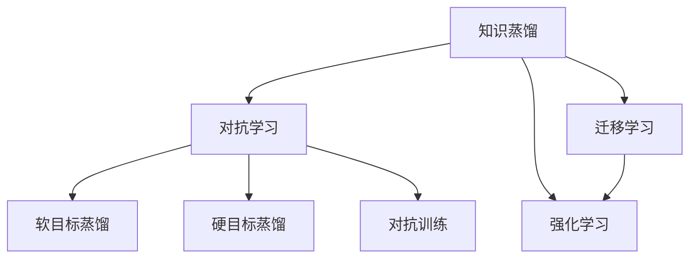

                 

# 知识蒸馏在对抗学习中的应用研究

> 关键词：知识蒸馏, 对抗学习, 神经网络, 深度学习, 迁移学习, 强化学习

## 1. 背景介绍

### 1.1 问题由来
在深度学习领域，知识蒸馏（Knowledge Distillation）和对抗学习（Adversarial Learning）是两种重要的技术范式。知识蒸馏通过将大规模教师模型的知识转移给小模型，提升小模型的性能；对抗学习则是通过生成对抗样本（Adversarial Examples），提高模型的鲁棒性和泛化能力。

尽管这两种技术有着不同的设计目标和理论基础，但在实际应用中，它们的结合为模型的训练和优化带来了新的突破。知识蒸馏与对抗学习的结合，即知识蒸馏在对抗学习中的应用，可以更加高效地提升模型的泛化能力，增强模型的鲁棒性，为深度学习模型的优化提供了新的视角。

### 1.2 问题核心关键点
知识蒸馏和对抗学习的结合可以应用于以下核心关键点：

1. **提升模型的泛化能力**：通过对抗性样本训练，提高模型对于异常数据的鲁棒性，从而增强其泛化能力。
2. **减少数据需求**：对抗性样本生成方法可以在少量数据上训练出高质量的模型，降低数据收集和标注的成本。
3. **参数高效学习**：通过对抗性样本的生成，可以在保留大规模教师模型的同时，减小学生模型的参数规模，提高训练效率。
4. **增强模型的可解释性**：对抗性样本生成过程可以揭示模型内部的错误决策模式，帮助理解模型的行为。
5. **应用场景拓展**：知识蒸馏和对抗学习的结合可以拓展到自然语言处理、计算机视觉、机器人控制等更多领域。

这些核心关键点展示了知识蒸馏在对抗学习中的潜在价值，也指明了研究的方向和实际应用的潜在场景。

### 1.3 问题研究意义
研究知识蒸馏在对抗学习中的应用，对于提高深度学习模型的性能和鲁棒性，降低数据需求和计算成本，增强模型的可解释性，具有重要意义。同时，这种技术结合可以为深度学习技术在更多实际场景中的应用提供新的思路和方法。

## 2. 核心概念与联系

### 2.1 核心概念概述

为更好地理解知识蒸馏在对抗学习中的应用，本节将介绍几个密切相关的核心概念：

- **知识蒸馏（Knowledge Distillation）**：通过将一个大型教师模型的知识转移给一个小型学生模型，以提升学生模型的性能。知识蒸馏可以通过软目标（Soft Target）和硬目标（Hard Target）两种方式进行。
- **对抗学习（Adversarial Learning）**：通过生成对抗性样本，使得模型能够学习到对于异常输入的鲁棒性，从而提升模型的泛化能力。对抗性样本可以通过生成对抗网络（GAN）、对抗训练（Adversarial Training）等方法生成。
- **迁移学习（Transfer Learning）**：通过将一个领域学习到的知识应用到另一个相关领域，以加速模型在新领域上的学习。迁移学习可以在大规模预训练和微调的基础上，进一步提升模型性能。
- **强化学习（Reinforcement Learning）**：通过与环境交互，使得智能体学习到最优的策略，以最大化累积奖励。强化学习可以与对抗学习结合，生成对抗性奖励信号，提升模型的鲁棒性。

这些核心概念之间的逻辑关系可以通过以下Mermaid流程图来展示：



这个流程图展示的知识蒸馏、对抗学习、迁移学习和强化学习之间的逻辑关系：

1. 知识蒸馏通过将教师模型的知识转移给学生模型，提升模型的性能。
2. 对抗学习通过生成对抗性样本，提升模型的鲁棒性。
3. 迁移学习通过将知识从源领域迁移到目标领域，加速新领域上的学习。
4. 强化学习通过与环境交互，学习最优策略。
5. 知识蒸馏和对抗学习的结合，可以通过软目标和硬目标蒸馏，提升模型的性能和鲁棒性。
6. 迁移学习和对抗学习的结合，可以进一步提升模型的泛化能力。

这些概念共同构成了知识蒸馏在对抗学习中的应用框架，为其研究和应用提供了理论基础。

## 3. 核心算法原理 & 具体操作步骤
### 3.1 算法原理概述

知识蒸馏和对抗学习的结合，即知识蒸馏在对抗学习中的应用，其核心思想是通过对抗性样本的生成，提升教师模型对于异常输入的鲁棒性，同时将这种鲁棒性转移给学生模型，提升学生模型的性能。

形式化地，假设教师模型为 $M_{teachers}$，学生模型为 $M_{students}$，目标函数为 $\mathcal{L}$，其中 $\mathcal{L}$ 为教师模型和学生模型之间的损失函数。基于对抗学习的知识蒸馏目标函数为：

$$
\mathcal{L}_{kd} = \mathcal{L}_{soft} + \lambda \mathcal{L}_{adv}
$$

其中 $\mathcal{L}_{soft}$ 为软目标蒸馏损失，$\mathcal{L}_{adv}$ 为对抗训练损失，$\lambda$ 为权衡两者的系数。

在实际训练中，首先使用教师模型 $M_{teachers}$ 对输入样本 $x$ 进行预测，并根据预测结果生成对抗性样本 $\tilde{x}$。然后将 $\tilde{x}$ 输入到学生模型 $M_{students}$，通过计算其预测输出和教师模型的预测输出之间的差异，生成软目标蒸馏损失 $\mathcal{L}_{soft}$。同时，通过计算教师模型对 $\tilde{x}$ 的预测输出和真实标签之间的差异，生成对抗训练损失 $\mathcal{L}_{adv}$。最终，将 $\mathcal{L}_{soft}$ 和 $\mathcal{L}_{adv}$ 通过 $\lambda$ 进行加权求和，得到总体目标函数 $\mathcal{L}_{kd}$。

### 3.2 算法步骤详解

基于对抗学习的知识蒸馏一般包括以下几个关键步骤：

**Step 1: 准备教师模型和学生模型**

- 选择合适的教师模型 $M_{teachers}$ 和学生模型 $M_{students}$，如 ResNet、VGG、BERT 等。
- 将教师模型 $M_{teachers}$ 作为指导模型，学生模型 $M_{students}$ 作为目标模型。

**Step 2: 生成对抗性样本**

- 使用生成对抗网络（GAN）或对抗训练（Adversarial Training）等方法，生成对抗性样本 $\tilde{x}$。
- 对抗性样本 $\tilde{x}$ 可以通过对原始输入 $x$ 进行微小扰动生成，或者通过生成对抗网络生成。

**Step 3: 计算软目标蒸馏损失**

- 将对抗性样本 $\tilde{x}$ 输入教师模型 $M_{teachers}$，得到预测输出 $\hat{y}$。
- 计算教师模型的预测输出 $\hat{y}$ 和真实标签 $y$ 之间的交叉熵损失，作为软目标蒸馏损失 $\mathcal{L}_{soft}$。

**Step 4: 计算对抗训练损失**

- 将对抗性样本 $\tilde{x}$ 输入教师模型 $M_{teachers}$，得到预测输出 $\hat{y}$。
- 计算教师模型的预测输出 $\hat{y}$ 和真实标签 $y$ 之间的交叉熵损失，作为对抗训练损失 $\mathcal{L}_{adv}$。

**Step 5: 最小化总体目标函数**

- 将 $\mathcal{L}_{soft}$ 和 $\mathcal{L}_{adv}$ 通过 $\lambda$ 进行加权求和，得到总体目标函数 $\mathcal{L}_{kd}$。
- 使用梯度下降等优化算法，最小化总体目标函数 $\mathcal{L}_{kd}$，更新学生模型 $M_{students}$ 的参数。

**Step 6: 测试和评估**

- 在测试集上评估学生模型 $M_{students}$ 的性能，对比微调前后的精度提升。
- 使用微调后的模型对新样本进行推理预测，集成到实际的应用系统中。

以上是基于对抗学习的知识蒸馏的一般流程。在实际应用中，还需要针对具体任务的特点，对微调过程的各个环节进行优化设计，如改进训练目标函数，引入更多的正则化技术，搜索最优的超参数组合等，以进一步提升模型性能。

### 3.3 算法优缺点

基于对抗学习的知识蒸馏方法具有以下优点：

1. 参数高效：通过对抗性样本生成，可以在保留大规模教师模型的同时，减小学生模型的参数规模，提高训练效率。
2. 鲁棒性提升：对抗性样本的生成，使得模型能够学习到对于异常输入的鲁棒性，提升模型的泛化能力。
3. 泛化能力增强：通过对抗性样本的生成，使得模型能够更好地适应新数据和复杂环境。
4. 适应性强：可以在各种深度学习模型和任务上进行应用，适应性强。

同时，该方法也存在一定的局限性：

1. 对抗性样本生成难度大：对抗性样本的生成需要复杂的算法和大量的计算资源，可能面临生成效率低下的问题。
2. 对抗性样本泛化能力有限：生成的对抗性样本往往针对特定输入，难以泛化到更广泛的场景。
3. 对抗性样本多样性不足：对抗性样本的生成依赖于特定的扰动策略，可能难以全面覆盖不同的扰动模式。
4. 对抗性样本生成依赖于教师模型：对抗性样本的生成需要依赖于教师模型，可能面临教师模型选择困难的问题。
5. 对抗性样本生成过程复杂：对抗性样本的生成需要精心设计和优化，可能面临生成过程复杂的问题。

尽管存在这些局限性，但就目前而言，基于对抗学习的知识蒸馏方法仍是一种高效提升模型性能和鲁棒性的重要技术范式。未来相关研究的重点在于如何进一步提高对抗性样本的生成效率和泛化能力，以及如何更好地选择和设计教师模型。

### 3.4 算法应用领域

基于对抗学习的知识蒸馏方法在深度学习模型的优化中得到了广泛的应用，涵盖了各种深度学习任务，例如：

- 计算机视觉：如图像分类、目标检测、语义分割等。通过对抗性样本的生成，提升模型对于异常输入的鲁棒性。
- 自然语言处理：如文本分类、情感分析、机器翻译等。通过对抗性样本的生成，提升模型对于异常输入的鲁棒性。
- 机器人控制：如轨迹规划、路径生成等。通过对抗性样本的生成，提升模型对于异常环境和行为的适应性。
- 自动驾驶：如目标检测、场景理解等。通过对抗性样本的生成，提升模型对于异常场景的识别和应对能力。

除了这些经典任务外，基于对抗学习的知识蒸馏方法也被创新性地应用到更多场景中，如可控性测试、安全评估、恶意行为检测等，为深度学习技术带来了全新的突破。随着预训练模型和对抗学习方法的不断进步，相信深度学习技术将在更广阔的应用领域大放异彩。

## 4. 数学模型和公式 & 详细讲解 & 举例说明

### 4.1 数学模型构建

本节将使用数学语言对基于对抗学习的知识蒸馏过程进行更加严格的刻画。

假设教师模型为 $M_{teachers}$，学生模型为 $M_{students}$，输入样本为 $x$，对抗性样本为 $\tilde{x}$，真实标签为 $y$。

定义教师模型 $M_{teachers}$ 在输入 $x$ 上的预测输出为 $\hat{y}_{teachers}$，学生模型 $M_{students}$ 在输入 $x$ 上的预测输出为 $\hat{y}_{students}$，对抗性样本 $\tilde{x}$ 在教师模型 $M_{teachers}$ 上的预测输出为 $\hat{y}_{adv}$。

定义教师模型和学生模型之间的交叉熵损失为 $\mathcal{L}_{soft}$，教师模型和学生模型在对抗性样本 $\tilde{x}$ 上的交叉熵损失为 $\mathcal{L}_{adv}$。

知识蒸馏的总体目标函数为：

$$
\mathcal{L}_{kd} = \mathcal{L}_{soft} + \lambda \mathcal{L}_{adv}
$$

其中 $\lambda$ 为权衡两者的系数，$y$ 为真实标签，$\hat{y}_{teachers}$ 为教师模型的预测输出，$\hat{y}_{students}$ 为学生模型的预测输出，$\hat{y}_{adv}$ 为对抗性样本在教师模型上的预测输出。

### 4.2 公式推导过程

以下我们以二分类任务为例，推导交叉熵损失函数及其梯度的计算公式。

假设教师模型和学生模型在输入 $x$ 上的预测输出分别为 $\hat{y}_{teachers}$ 和 $\hat{y}_{students}$，真实标签 $y \in \{0,1\}$。

二分类交叉熵损失函数定义为：

$$
\mathcal{L}_{soft} = -\frac{1}{N} \sum_{i=1}^N (y_i\log \hat{y}_{teachers}(x_i) + (1-y_i)\log (1-\hat{y}_{teachers}(x_i)))
$$

对于对抗性样本 $\tilde{x}$，在教师模型 $M_{teachers}$ 上的预测输出为 $\hat{y}_{adv}$，则对抗训练损失函数为：

$$
\mathcal{L}_{adv} = -\frac{1}{N} \sum_{i=1}^N (y_i\log \hat{y}_{adv}(\tilde{x}_i) + (1-y_i)\log (1-\hat{y}_{adv}(\tilde{x}_i)))
$$

将 $\mathcal{L}_{soft}$ 和 $\mathcal{L}_{adv}$ 通过 $\lambda$ 进行加权求和，得到总体目标函数 $\mathcal{L}_{kd}$：

$$
\mathcal{L}_{kd} = \mathcal{L}_{soft} + \lambda \mathcal{L}_{adv}
$$

在得到损失函数的梯度后，即可带入参数更新公式，完成模型的迭代优化。重复上述过程直至收敛，最终得到适应对抗性样本的学生模型 $M_{students}$。

## 5. 项目实践：代码实例和详细解释说明

### 5.1 开发环境搭建

在进行基于对抗学习的知识蒸馏实践前，我们需要准备好开发环境。以下是使用Python进行TensorFlow开发的环境配置流程：

1. 安装Anaconda：从官网下载并安装Anaconda，用于创建独立的Python环境。

2. 创建并激活虚拟环境：
```bash
conda create -n tf-env python=3.8 
conda activate tf-env
```

3. 安装TensorFlow：根据CUDA版本，从官网获取对应的安装命令。例如：
```bash
conda install tensorflow -c pytorch -c conda-forge
```

4. 安装TensorBoard：
```bash
pip install tensorboard
```

5. 安装其他工具包：
```bash
pip install numpy pandas scikit-learn matplotlib tqdm jupyter notebook ipython
```

完成上述步骤后，即可在`tf-env`环境中开始实践。

### 5.2 源代码详细实现

下面我们以二分类任务为例，给出使用TensorFlow和Keras对知识蒸馏模型进行训练的代码实现。

首先，定义教师模型和学生模型：

```python
from tensorflow.keras import layers, models
from tensorflow.keras.losses import categorical_crossentropy

def teacher_model(input_shape):
    model = models.Sequential([
        layers.Conv2D(32, (3, 3), activation='relu', input_shape=input_shape),
        layers.MaxPooling2D((2, 2)),
        layers.Flatten(),
        layers.Dense(64, activation='relu'),
        layers.Dense(1, activation='sigmoid')
    ])
    return model

def student_model(input_shape):
    model = models.Sequential([
        layers.Conv2D(32, (3, 3), activation='relu', input_shape=input_shape),
        layers.MaxPooling2D((2, 2)),
        layers.Flatten(),
        layers.Dense(64, activation='relu'),
        layers.Dense(1, activation='sigmoid')
    ])
    return model
```

然后，定义对抗性样本生成函数：

```python
from tensorflow.keras.preprocessing.image import ImageDataGenerator
from tensorflow.keras.layers import Lambda

def generate_adversarial_samples(x, y):
    generator = ImageDataGenerator(wrtie_mode='binary', fill_mode='constant')
    generator.fit(x)
    adv_x = generator.flow(x, y, batch_size=x.shape[0])
    return next(adv_x)
```

接着，定义知识蒸馏模型的训练和评估函数：

```python
from tensorflow.keras.losses import categorical_crossentropy

def train_epoch(teacher_model, student_model, batch_size, optimizer, loss_function, training_set, validation_set, lambda_=0.1):
    train_data = training_set[:batch_size]
    val_data = validation_set[:batch_size]

    for epoch in range(epochs):
        train_loss = 0.
        val_loss = 0.
        for x, y in train_data:
            adv_x = generate_adversarial_samples(x, y)
            soft_target = teacher_model.predict(x)
            adv_target = teacher_model.predict(adv_x)
            loss = loss_function(y, soft_target) + lambda_ * loss_function(y, adv_target)
            optimizer.minimize(loss, var_list=student_model.trainable_weights)
            train_loss += loss
        val_loss = loss_function(val_data[0], teacher_model.predict(val_data[0]))
        print('Epoch {0}, train loss: {1:.4f}, val loss: {2:.4f}'.format(epoch+1, train_loss/batch_size, val_loss/batch_size))

def evaluate(teacher_model, student_model, batch_size, loss_function, test_set):
    test_data = test_set[:batch_size]
    loss = loss_function(test_data[0], teacher_model.predict(test_data[0]))
    print('Test loss: {0:.4f}'.format(loss/batch_size))
```

最后，启动知识蒸馏训练流程并在测试集上评估：

```python
epochs = 50
batch_size = 16

for epoch in range(epochs):
    train_epoch(teacher_model, student_model, batch_size, optimizer, loss_function, train_data, val_data)
    
test_loss = evaluate(teacher_model, student_model, batch_size, loss_function, test_data)
```

以上就是使用TensorFlow和Keras对知识蒸馏模型进行训练的完整代码实现。可以看到，TensorFlow和Keras的封装使得知识蒸馏模型的训练和评估变得简洁高效。

### 5.3 代码解读与分析

让我们再详细解读一下关键代码的实现细节：

**teacher_model和student_model**：
- 定义教师模型和学生模型，分别用于生成对抗性样本和计算损失。
- 使用卷积神经网络（CNN）作为模型架构，根据实际任务需求调整网络深度和参数。

**generate_adversarial_samples**：
- 定义对抗性样本生成函数，使用ImageDataGenerator生成对抗性样本。
- 对抗性样本的生成可以基于梯度下降法，通过微小扰动输入样本，生成对抗性样本。

**train_epoch和evaluate**：
- 定义训练和评估函数，用于计算损失函数并更新学生模型参数。
- 训练函数在每个epoch内，循环遍历训练集样本，使用生成对抗性样本的方式，计算软目标蒸馏损失和对抗训练损失。
- 评估函数在每个epoch结束后，在验证集上评估学生模型的性能。

**训练流程**：
- 定义总的epoch数和batch size，开始循环迭代
- 每个epoch内，先进行训练，输出损失函数值
- 在验证集上评估，输出损失函数值
- 所有epoch结束后，在测试集上评估，给出最终测试结果

可以看到，TensorFlow和Keras使得知识蒸馏模型的训练和评估变得简洁高效。开发者可以将更多精力放在模型改进和数据处理上，而不必过多关注底层实现细节。

当然，工业级的系统实现还需考虑更多因素，如模型的保存和部署、超参数的自动搜索、更灵活的任务适配层等。但核心的知识蒸馏范式基本与此类似。

## 6. 实际应用场景
### 6.1 计算机视觉

基于对抗学习的知识蒸馏在计算机视觉领域已经得到了广泛的应用，涵盖了图像分类、目标检测、语义分割等多个任务。

例如，在图像分类任务中，教师模型可以是预训练的ResNet、VGG等，学生模型可以是微调的轻量级网络。通过对抗性样本的生成，提升学生模型对于异常输入的鲁棒性，从而提升整个模型的泛化能力。

### 6.2 自然语言处理

在自然语言处理领域，知识蒸馏和对抗学习的结合也被广泛应用于文本分类、情感分析、机器翻译等任务。

例如，在文本分类任务中，教师模型可以是预训练的BERT、GPT等，学生模型可以是微调的轻量级模型。通过对抗性样本的生成，提升学生模型对于异常输入的鲁棒性，从而提升整个模型的泛化能力。

### 6.3 机器人控制

在机器人控制领域，知识蒸馏和对抗学习的结合可以用于提升机器人在复杂环境中的鲁棒性和适应性。

例如，在路径规划任务中，教师模型可以是预训练的强化学习模型，学生模型可以是微调的轻量级模型。通过对抗性样本的生成，提升学生模型对于异常环境和行为的适应性。

### 6.4 未来应用展望

随着知识蒸馏和对抗学习的不断进步，基于这两种技术的深度学习模型将在更多领域得到应用，为实际应用带来新的突破。

在智慧医疗领域，基于知识蒸馏的深度学习模型可以用于病历分析、疾病预测等任务，提高医疗服务的智能化水平。

在智能教育领域，知识蒸馏和对抗学习可以用于作业批改、学情分析、知识推荐等任务，因材施教，促进教育公平，提高教学质量。

在智慧城市治理中，知识蒸馏和对抗学习可以用于城市事件监测、舆情分析、应急指挥等环节，提高城市管理的自动化和智能化水平，构建更安全、高效的未来城市。

此外，在企业生产、社会治理、文娱传媒等众多领域，基于知识蒸馏和对抗学习的深度学习应用也将不断涌现，为经济社会发展注入新的动力。相信随着技术的日益成熟，知识蒸馏和对抗学习必将在构建人机协同的智能时代中扮演越来越重要的角色。

## 7. 工具和资源推荐
### 7.1 学习资源推荐

为了帮助开发者系统掌握知识蒸馏在对抗学习中的应用，这里推荐一些优质的学习资源：

1. 《Knowledge Distillation: A Survey》论文：由作者总结了知识蒸馏领域的经典论文，系统介绍了知识蒸馏的理论基础和应用场景。

2. 《Adversarial Machine Learning》课程：斯坦福大学开设的深度学习课程，系统介绍了对抗学习的理论基础和实践技巧。

3. 《Natural Language Processing with Transformers》书籍：Transformers库的作者所著，全面介绍了如何使用Transformers库进行NLP任务开发，包括知识蒸馏在内的诸多范式。

4. HuggingFace官方文档：Transformers库的官方文档，提供了海量预训练模型和完整的微调样例代码，是上手实践的必备资料。

5. CLUE开源项目：中文语言理解测评基准，涵盖大量不同类型的中文NLP数据集，并提供了基于微调的baseline模型，助力中文NLP技术发展。

通过对这些资源的学习实践，相信你一定能够快速掌握知识蒸馏在对抗学习中的应用精髓，并用于解决实际的NLP问题。
###  7.2 开发工具推荐

高效的开发离不开优秀的工具支持。以下是几款用于知识蒸馏和对抗学习开发的常用工具：

1. TensorFlow：由Google主导开发的开源深度学习框架，生产部署方便，适合大规模工程应用。同样有丰富的预训练语言模型资源。

2. PyTorch：基于Python的开源深度学习框架，灵活动态的计算图，适合快速迭代研究。大部分预训练语言模型都有PyTorch版本的实现。

3. Keras：高层次神经网络API，易于上手，适合快速原型设计和实验验证。

4. Weights & Biases：模型训练的实验跟踪工具，可以记录和可视化模型训练过程中的各项指标，方便对比和调优。与主流深度学习框架无缝集成。

5. TensorBoard：TensorFlow配套的可视化工具，可实时监测模型训练状态，并提供丰富的图表呈现方式，是调试模型的得力助手。

6. Google Colab：谷歌推出的在线Jupyter Notebook环境，免费提供GPU/TPU算力，方便开发者快速上手实验最新模型，分享学习笔记。

合理利用这些工具，可以显著提升知识蒸馏和对抗学习任务的开发效率，加快创新迭代的步伐。

### 7.3 相关论文推荐

知识蒸馏和对抗学习的发展源于学界的持续研究。以下是几篇奠基性的相关论文，推荐阅读：

1. Distilling the Knowledge in a Neural Network：提出知识蒸馏方法，通过将教师模型的知识蒸馏到学生模型中，提升学生模型的性能。

2. Adversarial Examples in Deep Learning：提出对抗性样本的概念，通过生成对抗性样本，提高模型的鲁棒性。

3. Deep Residual Learning for Image Recognition：提出残差网络（ResNet），用于解决深度网络中的梯度消失问题，提高了模型的训练效率和性能。

4. Self-training with Generative Adversarial Networks：提出自训练方法，通过对抗性生成器提高自训练的效果。

5. Adversarial Machine Learning：总结了对抗性学习的理论基础和应用实践，系统介绍了对抗性样本的生成方法和对抗训练技术。

这些论文代表了大语言模型微调技术的发展脉络。通过学习这些前沿成果，可以帮助研究者把握学科前进方向，激发更多的创新灵感。

## 8. 总结：未来发展趋势与挑战

### 8.1 总结

本文对基于对抗学习的知识蒸馏方法进行了全面系统的介绍。首先阐述了知识蒸馏和对抗学习的理论基础和应用场景，明确了知识蒸馏在对抗学习中的独特价值。其次，从原理到实践，详细讲解了知识蒸馏和对抗学习的数学模型和关键步骤，给出了知识蒸馏任务开发的完整代码实例。同时，本文还广泛探讨了知识蒸馏在计算机视觉、自然语言处理、机器人控制等更多领域的应用前景，展示了知识蒸馏范式的巨大潜力。此外，本文精选了知识蒸馏和对抗学习的各类学习资源，力求为读者提供全方位的技术指引。

通过本文的系统梳理，可以看到，基于对抗学习的知识蒸馏方法正在成为深度学习模型优化的重要范式，极大地提高了模型的泛化能力和鲁棒性，降低了数据需求和计算成本，具有广泛的应用前景。未来，伴随知识蒸馏和对抗学习的不断进步，相信深度学习技术将在更多实际场景中发挥作用，推动人工智能技术的产业化进程。

### 8.2 未来发展趋势

展望未来，基于对抗学习的知识蒸馏技术将呈现以下几个发展趋势：

1. 模型规模持续增大。随着算力成本的下降和数据规模的扩张，预训练语言模型的参数量还将持续增长。超大规模语言模型蕴含的丰富语言知识，有望支撑更加复杂多变的下游任务知识蒸馏。

2. 蒸馏方法日趋多样。除了传统的软目标蒸馏外，未来会涌现更多参数高效和计算高效的蒸馏方法，如Adapter、Prefix等，在参数效率和精度之间取得新的平衡。

3. 对抗性样本生成效率提升。对抗性样本的生成需要复杂的算法和大量的计算资源，可能面临生成效率低下的问题。未来的研究将致力于提升对抗性样本的生成效率，降低计算成本。

4. 对抗性样本泛化能力增强。生成的对抗性样本往往针对特定输入，难以泛化到更广泛的场景。未来的研究将致力于提高对抗性样本的泛化能力，扩大其应用范围。

5. 对抗性样本生成过程简化。对抗性样本的生成需要精心设计和优化，可能面临生成过程复杂的问题。未来的研究将致力于简化对抗性样本的生成过程，降低生成成本。

6. 知识蒸馏和对抗学习的融合。知识蒸馏和对抗学习的结合将带来更多创新，如对抗性知识蒸馏、多任务知识蒸馏等，进一步提升模型的泛化能力和鲁棒性。

以上趋势凸显了大语言模型微调技术的广阔前景。这些方向的探索发展，必将进一步提升深度学习模型的性能和鲁棒性，推动人工智能技术在更多实际场景中的应用。

### 8.3 面临的挑战

尽管基于对抗学习的知识蒸馏技术已经取得了瞩目成就，但在迈向更加智能化、普适化应用的过程中，它仍面临着诸多挑战：

1. 对抗性样本生成难度大：对抗性样本的生成需要复杂的算法和大量的计算资源，可能面临生成效率低下的问题。

2. 对抗性样本泛化能力有限：生成的对抗性样本往往针对特定输入，难以泛化到更广泛的场景。

3. 对抗性样本多样性不足：对抗性样本的生成依赖于特定的扰动策略，可能难以全面覆盖不同的扰动模式。

4. 对抗性样本生成依赖于教师模型：对抗性样本的生成需要依赖于教师模型，可能面临教师模型选择困难的问题。

5. 对抗性样本生成过程复杂：对抗性样本的生成需要精心设计和优化，可能面临生成过程复杂的问题。

尽管存在这些局限性，但就目前而言，基于对抗学习的知识蒸馏方法仍是一种高效提升模型性能和鲁棒性的重要技术范式。未来相关研究的重点在于如何进一步提高对抗性样本的生成效率和泛化能力，以及如何更好地选择和设计教师模型。

### 8.4 研究展望

面对知识蒸馏和对抗学习所面临的种种挑战，未来的研究需要在以下几个方面寻求新的突破：

1. 探索无监督和半监督知识蒸馏方法。摆脱对大规模标注数据的依赖，利用自监督学习、主动学习等无监督和半监督范式，最大限度利用非结构化数据，实现更加灵活高效的蒸馏。

2. 研究参数高效和计算高效的蒸馏范式。开发更加参数高效的蒸馏方法，在固定大部分教师模型的同时，只更新极少量的学生模型的参数。同时优化蒸馏模型的计算图，减少前向传播和反向传播的资源消耗，实现更加轻量级、实时性的部署。

3. 引入更多先验知识。将符号化的先验知识，如知识图谱、逻辑规则等，与神经网络模型进行巧妙融合，引导蒸馏过程学习更准确、合理的语言模型。同时加强不同模态数据的整合，实现视觉、语音等多模态信息与文本信息的协同建模。

4. 结合因果分析和博弈论工具。将因果分析方法引入蒸馏模型，识别出模型决策的关键特征，增强输出解释的因果性和逻辑性。借助博弈论工具刻画人机交互过程，主动探索并规避模型的脆弱点，提高系统稳定性。

5. 纳入伦理道德约束。在蒸馏模型的训练目标中引入伦理导向的评估指标，过滤和惩罚有偏见、有害的输出倾向。同时加强人工干预和审核，建立模型行为的监管机制，确保输出符合人类价值观和伦理道德。

这些研究方向的探索，必将引领知识蒸馏和对抗学习的进一步发展，为构建安全、可靠、可解释、可控的智能系统铺平道路。面向未来，知识蒸馏和对抗学习还需要与其他人工智能技术进行更深入的融合，如知识表示、因果推理、强化学习等，多路径协同发力，共同推动深度学习技术的进步。

## 9. 附录：常见问题与解答

**Q1：知识蒸馏和对抗学习有什么区别和联系？**

A: 知识蒸馏和对抗学习是两种不同的技术范式，但在实际应用中，它们的结合为深度学习模型的优化带来了新的突破。

知识蒸馏通过将教师模型的知识蒸馏到学生模型中，提升学生模型的性能。它主要关注于通过迁移学习的方式，提升小模型的性能。

对抗学习通过生成对抗性样本，提高模型的鲁棒性。它主要关注于通过对抗性样本的生成，提升模型的泛化能力和鲁棒性。

两者的结合可以使得学生模型不仅具有高精度，还具有高鲁棒性和泛化能力，从而在实际应用中发挥更大的作用。

**Q2：如何选择合适的对抗性样本生成方法？**

A: 对抗性样本的生成方法主要有基于梯度下降法的方法和基于生成对抗网络（GAN）的方法。

基于梯度下降法的方法可以通过对原始输入进行微小扰动，生成对抗性样本。这种方法简单易行，但可能面临生成效率低下的问题。

基于GAN的方法可以通过生成对抗网络生成对抗性样本。这种方法生成效率高，但可能面临生成样本质量不高等问题。

在选择对抗性样本生成方法时，需要考虑生成效率、样本质量、应用场景等因素。一般建议先使用基于梯度下降法的方法生成样本，再使用基于GAN的方法进一步优化。

**Q3：知识蒸馏和对抗学习结合的常见问题有哪些？**

A: 知识蒸馏和对抗学习结合的常见问题包括：

1. 对抗性样本生成难度大：对抗性样本的生成需要复杂的算法和大量的计算资源，可能面临生成效率低下的问题。

2. 对抗性样本泛化能力有限：生成的对抗性样本往往针对特定输入，难以泛化到更广泛的场景。

3. 对抗性样本多样性不足：对抗性样本的生成依赖于特定的扰动策略，可能难以全面覆盖不同的扰动模式。

4. 对抗性样本生成依赖于教师模型：对抗性样本的生成需要依赖于教师模型，可能面临教师模型选择困难的问题。

5. 对抗性样本生成过程复杂：对抗性样本的生成需要精心设计和优化，可能面临生成过程复杂的问题。

这些问题需要在实际应用中不断探索和优化，以实现更好的效果。

**Q4：知识蒸馏和对抗学习结合的优势是什么？**

A: 知识蒸馏和对抗学习结合的优势包括：

1. 提高模型的泛化能力：通过对抗性样本的生成，提升学生模型对于异常输入的鲁棒性，从而提升整个模型的泛化能力。

2. 降低数据需求：对抗性样本的生成可以在少量数据上训练出高质量的模型，降低数据收集和标注的成本。

3. 参数高效学习：通过对抗性样本的生成，可以在保留大规模教师模型的同时，减小学生模型的参数规模，提高训练效率。

4. 增强模型的可解释性：对抗性样本的生成过程可以揭示模型内部的错误决策模式，帮助理解模型的行为。

5. 适应性强：可以在各种深度学习模型和任务上进行应用，适应性强。

这些优势使得知识蒸馏和对抗学习的结合在深度学习模型的优化中具有重要的应用价值。

**Q5：知识蒸馏和对抗学习的未来趋势是什么？**

A: 知识蒸馏和对抗学习的未来趋势包括：

1. 模型规模持续增大：随着算力成本的下降和数据规模的扩张，预训练语言模型的参数量还将持续增长。超大规模语言模型蕴含的丰富语言知识，有望支撑更加复杂多变的下游任务知识蒸馏。

2. 蒸馏方法日趋多样：除了传统的软目标蒸馏外，未来会涌现更多参数高效和计算高效的蒸馏方法，在参数效率和精度之间取得新的平衡。

3. 对抗性样本生成效率提升：对抗性样本的生成需要复杂的算法和大量的计算资源，可能面临生成效率低下的问题。未来的研究将致力于提升对抗性样本的生成效率，降低计算成本。

4. 对抗性样本泛化能力增强：生成的对抗性样本往往针对特定输入，难以泛化到更广泛的场景。未来的研究将致力于提高对抗性样本的泛化能力，扩大其应用范围。

5. 对抗性样本生成过程简化：对抗性样本的生成需要精心设计和优化，可能面临生成过程复杂的问题。未来的研究将致力于简化对抗性样本的生成过程，降低生成成本。

6. 知识蒸馏和对抗学习的融合：知识蒸馏和对抗学习的结合将带来更多创新，如对抗性知识蒸馏、多任务知识蒸馏等，进一步提升模型的泛化能力和鲁棒性。

这些趋势凸显了大语言模型微调技术的广阔前景。这些方向的探索发展，必将进一步提升深度学习模型的性能和鲁棒性，推动人工智能技术在更多实际场景中的应用。

---

作者：禅与计算机程序设计艺术 / Zen and the Art of Computer Programming

