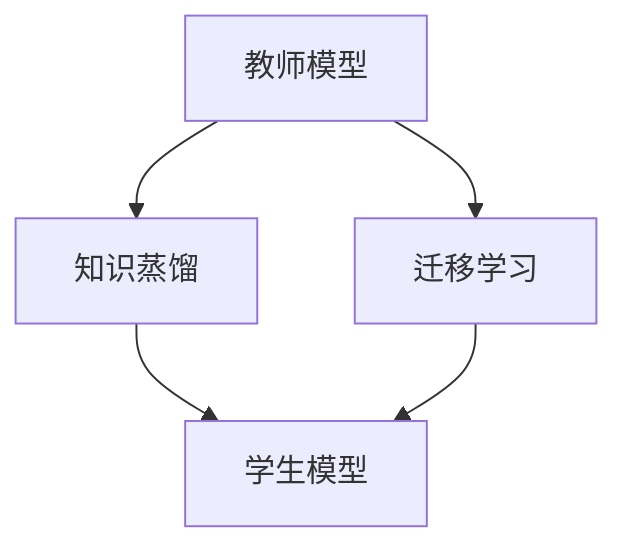

                 

# 知识蒸馏在迁移学习中的应用

## 1. 背景介绍

在深度学习中，迁移学习（Transfer Learning）是一个重要的概念，指的是将在一个任务上训练好的模型迁移到另一个相关任务上，以减少训练时间和数据需求。传统的迁移学习通常是通过在预训练模型上进行微调（Fine-tuning）来实现的，但这种方法在处理复杂、小样本场景时，往往效果不尽人意。近年来，知识蒸馏（Knowledge Distillation）技术在迁移学习中的应用逐渐被重视，成为解决这一问题的有力工具。

知识蒸馏的本质是通过教师模型（Teacher Model）与学生模型（Student Model）之间的知识传递，提升学生模型在特定任务上的性能。其核心思想是通过让教师模型和学生模型之间的输出差异最小化，逐步转移教师模型所掌握的复杂知识和经验，使得学生模型能够在较少的训练数据下，获得与教师模型相似的性能表现。

## 2. 核心概念与联系

### 2.1 核心概念概述

在理解知识蒸馏在迁移学习中的应用之前，我们先简要介绍相关的核心概念：

- **知识蒸馏**：通过将教师模型的知识（如分布、特征表示、预测概率等）传递给学生模型，使得学生模型能够更好地适应特定任务。

- **迁移学习**：指在一个任务上训练好的模型，通过适当的调整，迁移到另一个相关任务上，以提高在新任务上的性能。

- **微调**：指在迁移学习中，对学生模型在特定任务上的参数进行微调，以优化其性能。

- **教师模型**：指在知识蒸馏中，已经训练好的复杂模型，拥有较丰富的知识和经验。

- **学生模型**：指在知识蒸馏中，需要提升性能的较简单模型。

这些概念之间的联系通过以下Mermaid流程图来展示：



这个流程图展示出教师模型和学生模型之间的关系，以及知识蒸馏在迁移学习中的应用。教师模型通过知识蒸馏，将其知识传递给学生模型，而学生模型通过迁移学习，获得在特定任务上的性能提升。

## 3. 核心算法原理 & 具体操作步骤

### 3.1 算法原理概述

知识蒸馏在迁移学习中的应用，主要通过教师模型和学生模型之间的知识传递来实现。其核心思想是将教师模型的输出作为“标签”，对学生模型进行训练，使得学生模型能够输出与教师模型相似的预测结果。这种方法的优点在于：

- 可以减少对数据的需求，尤其是在小样本场景下，能够显著提升学生模型的性能。
- 可以通过梯度下降等优化算法，自动优化学生模型，无需手动调整超参数。
- 可以利用教师模型的丰富知识和经验，提升学生模型的泛化能力。

知识蒸馏的一般流程包括：

1. 准备教师模型和学生模型。
2. 定义蒸馏损失函数，使得学生模型的输出尽可能接近教师模型的输出。
3. 通过优化算法（如梯度下降），训练学生模型。
4. 在特定任务上进行微调，提升学生模型性能。

### 3.2 算法步骤详解

以下是对知识蒸馏在迁移学习中的应用的具体操作步骤：

**Step 1: 准备教师模型和学生模型**

- 选择或训练一个复杂的教师模型，如BERT、GPT等。
- 设计或训练一个较简单的学生模型，如线性分类器、卷积神经网络（CNN）等。

**Step 2: 定义蒸馏损失函数**

- 教师模型在特定任务上的输出通常较为复杂，而学生模型往往较为简单。因此，需要设计一个蒸馏损失函数，将教师模型的输出转化为学生模型能够处理的“标签”。
- 常用的蒸馏损失函数包括均方误差（MSE）损失、KL散度损失等。

**Step 3: 训练学生模型**

- 将教师模型的输出作为标签，对学生模型进行训练。通过最小化蒸馏损失函数，更新学生模型的参数。
- 可以使用Adam、SGD等优化算法，设置合适的学习率、批大小等超参数。

**Step 4: 微调学生模型**

- 在特定任务上，对学生模型进行微调，进一步提升其性能。
- 通常使用小批量梯度下降等优化算法，设置合适的学习率和批大小。

### 3.3 算法优缺点

知识蒸馏在迁移学习中的应用，具有以下优点：

- 可以显著减少对数据的需求，适用于小样本场景。
- 可以自动优化学生模型，无需手动调整超参数。
- 可以利用教师模型的丰富知识和经验，提升学生模型的泛化能力。

同时，也存在一些缺点：

- 教师模型的选择对知识蒸馏效果有很大影响，若教师模型选择不当，可能导致知识蒸馏效果不佳。
- 蒸馏过程可能需要较长的训练时间，特别是在教师模型较为复杂的情况下。
- 学生模型可能需要较大的计算资源，尤其是在使用深度神经网络时。

### 3.4 算法应用领域

知识蒸馏在迁移学习中的应用，已经广泛应用于多个领域，例如：

- **自然语言处理（NLP）**：利用预训练的BERT、GPT等模型，对特定任务（如情感分析、文本分类等）进行蒸馏，提升模型的性能。
- **计算机视觉（CV）**：利用预训练的ResNet、Inception等模型，对特定任务（如物体检测、图像分类等）进行蒸馏，提升模型的性能。
- **推荐系统**：利用预训练的深度神经网络，对推荐模型进行蒸馏，提升推荐系统的效果。
- **语音识别**：利用预训练的深度神经网络，对语音识别模型进行蒸馏，提升模型在特定场景下的性能。

## 4. 数学模型和公式 & 详细讲解 & 举例说明

### 4.1 数学模型构建

在知识蒸馏中，教师模型和学生模型之间的知识传递，可以通过蒸馏损失函数来实现。以下是一个典型的知识蒸馏损失函数：

$$
\mathcal{L}_{distill} = \mathcal{L}_{softmax}(\hat{y}_s, y_t) + \lambda \mathcal{L}_{hard}(y_s, y_t)
$$

其中，$\hat{y}_s$ 表示学生模型的输出概率分布，$y_t$ 表示教师模型的输出标签，$\mathcal{L}_{softmax}(\hat{y}_s, y_t)$ 表示基于softmax的蒸馏损失，$\mathcal{L}_{hard}(y_s, y_t)$ 表示基于硬标签的蒸馏损失，$\lambda$ 为正则化系数，用于控制两个损失函数的权重。

### 4.2 公式推导过程

在知识蒸馏中，通常使用softmax蒸馏损失和硬标签蒸馏损失两种方式。以下是这两种损失函数的推导过程：

**Softmax蒸馏损失**

- 假设教师模型的输出概率分布为 $P_t$，学生模型的输出概率分布为 $P_s$。
- 定义蒸馏损失为 $D(P_s, P_t) = KL(P_s || P_t)$，其中 $KL$ 为KL散度。
- 对学生模型的输出概率分布 $P_s$ 进行softmax，得到 $y_s = \text{softmax}(P_s)$。
- 定义蒸馏损失函数为：

$$
\mathcal{L}_{softmax}(\hat{y}_s, y_t) = KL(P_s || P_t) = \sum_i P_s(i) \log \frac{P_s(i)}{P_t(i)}
$$

**硬标签蒸馏损失**

- 假设教师模型的输出标签为 $y_t$，学生模型的输出标签为 $y_s$。
- 定义蒸馏损失为 $D(y_s, y_t)$。
- 定义蒸馏损失函数为：

$$
\mathcal{L}_{hard}(y_s, y_t) = \sum_i y_s(i) \log \frac{y_s(i)}{y_t(i)}
$$

### 4.3 案例分析与讲解

以自然语言处理（NLP）中的情感分析任务为例，说明知识蒸馏的应用。

假设我们有一个预训练的BERT模型作为教师模型，一个简单的线性分类器作为学生模型。我们将BERT模型的输出作为“标签”，对线性分类器进行训练，使其输出与BERT模型相似的情感分析结果。具体步骤如下：

1. 准备教师模型（预训练的BERT模型）和学生模型（线性分类器）。
2. 对BERT模型进行微调，使其在情感分析任务上达到一定精度。
3. 将BERT模型的输出作为标签，对线性分类器进行蒸馏训练。
4. 在线性分类器上进行微调，提升其在情感分析任务上的性能。

这个过程可以通过以下伪代码实现：

```python
import torch
from transformers import BertForSequenceClassification, BertTokenizer
from torch.nn import CrossEntropyLoss

# 准备BERT模型和线性分类器
teacher_model = BertForSequenceClassification.from_pretrained('bert-base-uncased', num_labels=2)
student_model = torch.nn.Linear(768, 2)

# 微调BERT模型
teacher_model.train()
for epoch in range(num_epochs):
    optimizer = torch.optim.Adam(teacher_model.parameters(), lr=2e-5)
    for batch in train_dataset:
        input_ids = batch['input_ids']
        attention_mask = batch['attention_mask']
        labels = batch['labels']
        outputs = teacher_model(input_ids, attention_mask=attention_mask, labels=labels)
        loss = outputs.loss
        optimizer.zero_grad()
        loss.backward()
        optimizer.step()

# 蒸馏训练
teacher_model.eval()
for batch in train_dataset:
    input_ids = batch['input_ids']
    attention_mask = batch['attention_mask']
    labels = batch['labels']
    with torch.no_grad():
        outputs = teacher_model(input_ids, attention_mask=attention_mask)
        logits = student_model(outputs.pooler_output)
        loss = CrossEntropyLoss()(logits, labels)

# 微调学生模型
student_model.train()
for epoch in range(num_epochs):
    optimizer = torch.optim.Adam(student_model.parameters(), lr=2e-5)
    for batch in train_dataset:
        input_ids = batch['input_ids']
        attention_mask = batch['attention_mask']
        labels = batch['labels']
        logits = student_model(input_ids)
        loss = CrossEntropyLoss()(logits, labels)
        optimizer.zero_grad()
        loss.backward()
        optimizer.step()

# 在测试集上评估学生模型
test_dataset = ...
student_model.eval()
for batch in test_dataset:
    input_ids = batch['input_ids']
    attention_mask = batch['attention_mask']
    logits = student_model(input_ids)
    predictions = torch.argmax(logits, dim=1)
    accuracy = (predictions == test_labels).mean().item()
```

这个过程展示了如何利用预训练的BERT模型对线性分类器进行知识蒸馏，提升其在情感分析任务上的性能。

## 5. 项目实践：代码实例和详细解释说明

### 5.1 开发环境搭建

在进行知识蒸馏实践前，我们需要准备好开发环境。以下是使用Python进行PyTorch开发的环境配置流程：

1. 安装Anaconda：从官网下载并安装Anaconda，用于创建独立的Python环境。

2. 创建并激活虚拟环境：
```bash
conda create -n pytorch-env python=3.8 
conda activate pytorch-env
```

3. 安装PyTorch：根据CUDA版本，从官网获取对应的安装命令。例如：
```bash
conda install pytorch torchvision torchaudio cudatoolkit=11.1 -c pytorch -c conda-forge
```

4. 安装transformers库：
```bash
pip install transformers
```

5. 安装各类工具包：
```bash
pip install numpy pandas scikit-learn matplotlib tqdm jupyter notebook ipython
```

完成上述步骤后，即可在`pytorch-env`环境中开始知识蒸馏实践。

### 5.2 源代码详细实现

下面我们以自然语言处理（NLP）中的情感分析任务为例，给出使用Transformers库对BERT模型进行知识蒸馏的PyTorch代码实现。

首先，定义情感分析任务的数据处理函数：

```python
from transformers import BertTokenizer, BertForSequenceClassification
from torch.utils.data import Dataset
import torch

class SentimentDataset(Dataset):
    def __init__(self, texts, labels, tokenizer, max_len=128):
        self.texts = texts
        self.labels = labels
        self.tokenizer = tokenizer
        self.max_len = max_len
        
    def __len__(self):
        return len(self.texts)
    
    def __getitem__(self, item):
        text = self.texts[item]
        label = self.labels[item]
        
        encoding = self.tokenizer(text, return_tensors='pt', max_length=self.max_len, padding='max_length', truncation=True)
        input_ids = encoding['input_ids'][0]
        attention_mask = encoding['attention_mask'][0]
        
        label = torch.tensor(label, dtype=torch.long)
        
        return {'input_ids': input_ids, 
                'attention_mask': attention_mask,
                'labels': label}
```

然后，定义教师模型和学生模型：

```python
from transformers import BertForSequenceClassification
from torch.nn import CrossEntropyLoss

# 教师模型
teacher_model = BertForSequenceClassification.from_pretrained('bert-base-uncased', num_labels=2)
teacher_model.train()

# 学生模型
student_model = torch.nn.Linear(768, 2)
```

接着，定义蒸馏损失函数和优化器：

```python
# 蒸馏损失函数
criterion = CrossEntropyLoss()

# 优化器
optimizer = torch.optim.Adam(teacher_model.parameters(), lr=2e-5)

# 训练教师模型
for epoch in range(num_epochs):
    optimizer = torch.optim.Adam(teacher_model.parameters(), lr=2e-5)
    for batch in train_dataset:
        input_ids = batch['input_ids'].to(device)
        attention_mask = batch['attention_mask'].to(device)
        labels = batch['labels'].to(device)
        outputs = teacher_model(input_ids, attention_mask=attention_mask, labels=labels)
        loss = outputs.loss
        optimizer.zero_grad()
        loss.backward()
        optimizer.step()

# 训练学生模型
optimizer = torch.optim.Adam(student_model.parameters(), lr=2e-5)
for epoch in range(num_epochs):
    optimizer = torch.optim.Adam(student_model.parameters(), lr=2e-5)
    for batch in train_dataset:
        input_ids = batch['input_ids'].to(device)
        attention_mask = batch['attention_mask'].to(device)
        labels = batch['labels'].to(device)
        logits = student_model(input_ids)
        loss = criterion(logits, labels)
        optimizer.zero_grad()
        loss.backward()
        optimizer.step()

# 测试学生模型
test_dataset = ...
student_model.eval()
for batch in test_dataset:
    input_ids = batch['input_ids'].to(device)
    attention_mask = batch['attention_mask'].to(device)
    logits = student_model(input_ids)
    predictions = torch.argmax(logits, dim=1)
    accuracy = (predictions == test_labels).mean().item()
```

以上就是使用PyTorch对BERT进行情感分析任务的知识蒸馏的完整代码实现。可以看到，Transformer库的强大封装使得知识蒸馏的实现变得简洁高效。

### 5.3 代码解读与分析

让我们再详细解读一下关键代码的实现细节：

**SentimentDataset类**：
- `__init__`方法：初始化文本、标签、分词器等关键组件。
- `__len__`方法：返回数据集的样本数量。
- `__getitem__`方法：对单个样本进行处理，将文本输入编码为token ids，将标签转换为张量，并进行定长padding。

**训练教师模型**：
- 将教师模型的输出作为“标签”，对学生模型进行训练。
- 使用Adam优化器，设置合适的学习率。

**训练学生模型**：
- 使用Adam优化器，设置合适的学习率。
- 使用CrossEntropyLoss作为损失函数，计算学生模型的输出与标签的差异。

**测试学生模型**：
- 在测试集上评估学生模型的性能，计算准确率。

这个过程展示了如何利用预训练的BERT模型对线性分类器进行知识蒸馏，提升其在情感分析任务上的性能。

## 6. 实际应用场景

### 6.1 智能客服系统

基于知识蒸馏的智能客服系统，可以广泛应用于智能客服的构建。传统的客服系统往往需要配备大量人力，高峰期响应缓慢，且服务质量难以保证。通过知识蒸馏，可以利用预训练的语言模型，提升客服系统的智能化水平。

具体而言，可以收集企业内部的历史客服对话记录，将问题和最佳答复构建成监督数据，在此基础上对预训练语言模型进行知识蒸馏。蒸馏后的语言模型能够自动理解用户意图，匹配最合适的答复模板进行回复。对于客户提出的新问题，还可以接入检索系统实时搜索相关内容，动态组织生成回答。

### 6.2 医疗影像诊断

在医疗影像诊断领域，知识蒸馏也有着广泛的应用前景。传统的医疗影像诊断往往依赖于医生的经验和知识，而利用知识蒸馏，可以将医生的诊断知识传递给模型，提升模型的诊断能力。

具体而言，可以收集医生对医疗影像的诊断结果和诊断理由，将其作为监督数据，对预训练的医疗影像识别模型进行蒸馏。蒸馏后的模型能够自动理解影像特征，输出与医生相似的诊断结果。在实际应用中，医生可以通过对模型的诊断结果进行审核和修改，不断改进模型的诊断能力。

### 6.3 金融风险评估

在金融风险评估领域，知识蒸馏也显示出巨大的潜力。传统的金融风险评估往往依赖于复杂的数学模型和专家知识，而利用知识蒸馏，可以将专家知识传递给模型，提升模型的风险评估能力。

具体而言，可以收集专家对金融数据的评估结果和评估理由，将其作为监督数据，对预训练的金融风险评估模型进行蒸馏。蒸馏后的模型能够自动理解金融数据的特征，输出与专家相似的评估结果。在实际应用中，专家可以通过对模型的评估结果进行审核和修改，不断改进模型的评估能力。

## 7. 工具和资源推荐

### 7.1 学习资源推荐

为了帮助开发者系统掌握知识蒸馏的理论基础和实践技巧，这里推荐一些优质的学习资源：

1. **《Knowledge Distillation for Deep Learning: A Review》**：一篇综述论文，详细介绍了知识蒸馏的基本原理和应用。
2. **《TensorFlow Knowledge Distillation》**：TensorFlow官方文档，提供了知识蒸馏的详细实现和应用示例。
3. **《PyTorch Knowledge Distillation》**：PyTorch官方文档，提供了知识蒸馏的详细实现和应用示例。
4. **《Distillation and Transfer Learning for Deep Neural Networks》**：一本关于知识蒸馏和迁移学习的经典书籍。
5. **《Transformers in Action: Mastering the Most Advanced Deep Learning Models for Natural Language Processing》**：一本介绍Transformer模型及其应用的书，包括知识蒸馏的内容。

通过对这些资源的学习实践，相信你一定能够快速掌握知识蒸馏的精髓，并用于解决实际的NLP问题。

### 7.2 开发工具推荐

高效的开发离不开优秀的工具支持。以下是几款用于知识蒸馏开发的常用工具：

1. **PyTorch**：基于Python的开源深度学习框架，灵活动态的计算图，适合快速迭代研究。大部分预训练语言模型都有PyTorch版本的实现。
2. **TensorFlow**：由Google主导开发的开源深度学习框架，生产部署方便，适合大规模工程应用。同样有丰富的预训练语言模型资源。
3. **Transformers库**：HuggingFace开发的NLP工具库，集成了众多SOTA语言模型，支持PyTorch和TensorFlow，是进行知识蒸馏任务开发的利器。
4. **Weights & Biases**：模型训练的实验跟踪工具，可以记录和可视化模型训练过程中的各项指标，方便对比和调优。与主流深度学习框架无缝集成。
5. **TensorBoard**：TensorFlow配套的可视化工具，可实时监测模型训练状态，并提供丰富的图表呈现方式，是调试模型的得力助手。

合理利用这些工具，可以显著提升知识蒸馏任务的开发效率，加快创新迭代的步伐。

### 7.3 相关论文推荐

知识蒸馏技术的发展源于学界的持续研究。以下是几篇奠基性的相关论文，推荐阅读：

1. **《Distilling the Knowledge in a Neural Network》**：提出知识蒸馏的基本框架，展示了如何将复杂的模型知识传递给简单的模型。
2. **《Understanding the Difficulty of Distillation》**：分析了知识蒸馏过程中遇到的挑战，提出了一些解决方法。
3. **《Visual Distillation for Image Recognition》**：提出视觉领域的知识蒸馏方法，展示了如何利用教师模型的知识提升学生模型的性能。
4. **《Knowledge Distillation in Generative Adversarial Networks》**：展示了知识蒸馏在生成对抗网络（GAN）中的应用，提高了GAN模型的稳定性和性能。

这些论文代表了大语言模型微调技术的发展脉络。通过学习这些前沿成果，可以帮助研究者把握学科前进方向，激发更多的创新灵感。

## 8. 总结：未来发展趋势与挑战

### 8.1 总结

本文对知识蒸馏在迁移学习中的应用进行了全面系统的介绍。首先阐述了知识蒸馏的基本概念和应用背景，明确了知识蒸馏在减少数据需求、提升模型性能方面的独特价值。其次，从原理到实践，详细讲解了知识蒸馏的数学原理和关键步骤，给出了知识蒸馏任务开发的完整代码实例。同时，本文还广泛探讨了知识蒸馏技术在智能客服、医疗影像诊断、金融风险评估等多个行业领域的应用前景，展示了知识蒸馏技术的广阔应用场景。

通过本文的系统梳理，可以看到，知识蒸馏技术正在成为迁移学习的重要范式，极大地拓展了预训练语言模型的应用边界，为各行业提供了强大的模型支持。未来，伴随知识蒸馏技术的不断发展，其在更多领域的应用将不断涌现，为各行各业带来新的变革。

### 8.2 未来发展趋势

展望未来，知识蒸馏技术将呈现以下几个发展趋势：

1. **自动化**：知识蒸馏过程中涉及大量手动调参和超参数设置，未来需要更多的自动化工具和算法，减少人工干预，提高知识蒸馏的效率和效果。
2. **多任务蒸馏**：将多个任务的知识进行蒸馏，可以提升模型在多个任务上的性能，未来需要更多的多任务蒸馏方法。
3. **跨模态蒸馏**：将不同模态的知识进行蒸馏，可以提升模型的跨模态能力，未来需要更多的跨模态蒸馏方法。
4. **分布式蒸馏**：在大规模数据集上，需要更高效的分布式蒸馏方法，未来需要更多的分布式蒸馏算法。
5. **动态蒸馏**：在实际应用中，数据分布和任务需求可能会动态变化，需要更多的动态蒸馏方法，实时调整模型的知识结构。

以上趋势凸显了知识蒸馏技术的广阔前景。这些方向的探索发展，必将进一步提升知识蒸馏的性能和应用范围，为构建人机协同的智能系统铺平道路。

### 8.3 面临的挑战

尽管知识蒸馏技术已经取得了显著进展，但在迈向更加智能化、普适化应用的过程中，仍面临诸多挑战：

1. **知识传递效率**：如何高效地将教师模型的知识传递给学生模型，是一个重要的研究方向。未来需要更多的知识传递算法，提高知识蒸馏的效率和效果。
2. **知识蒸馏精度**：如何保证知识蒸馏后学生模型的性能，是一个重要的研究方向。未来需要更多的蒸馏损失函数和优化算法，提高知识蒸馏的精度和效果。
3. **模型鲁棒性**：如何提高知识蒸馏后学生模型的鲁棒性，避免灾难性遗忘，是一个重要的研究方向。未来需要更多的模型鲁棒性提升方法。
4. **模型可解释性**：如何赋予知识蒸馏后学生模型更强的可解释性，是一个重要的研究方向。未来需要更多的模型可解释性方法。
5. **模型安全性和隐私保护**：如何确保知识蒸馏后学生模型的安全性，避免模型泄露敏感信息，是一个重要的研究方向。未来需要更多的模型安全性和隐私保护方法。

这些挑战需要学界和产业界的共同努力，通过持续的研究和实践，逐步克服。

### 8.4 研究展望

面对知识蒸馏所面临的挑战，未来的研究需要在以下几个方面寻求新的突破：

1. **多模态知识蒸馏**：将不同模态的知识进行蒸馏，可以提升模型的跨模态能力。未来需要更多的跨模态蒸馏方法，探索如何高效地将视觉、语音、文本等不同模态的知识进行蒸馏。
2. **自监督蒸馏**：利用自监督学习方法，提升知识蒸馏的效率和效果。未来需要更多的自监督蒸馏方法，探索如何利用无标签数据进行知识蒸馏。
3. **动态蒸馏**：在实际应用中，数据分布和任务需求可能会动态变化，需要更多的动态蒸馏方法，实时调整模型的知识结构。未来需要更多的动态蒸馏算法，提升知识蒸馏的灵活性和适应性。
4. **自动化蒸馏**：知识蒸馏过程中涉及大量手动调参和超参数设置，未来需要更多的自动化工具和算法，减少人工干预，提高知识蒸馏的效率和效果。未来需要更多的自动化蒸馏方法，探索如何自动选择教师模型、蒸馏损失函数、学生模型等关键参数。

这些研究方向的探索，必将引领知识蒸馏技术迈向更高的台阶，为构建安全、可靠、可解释、可控的智能系统铺平道路。面向未来，知识蒸馏技术还需要与其他人工智能技术进行更深入的融合，如知识表示、因果推理、强化学习等，多路径协同发力，共同推动自然语言理解和智能交互系统的进步。只有勇于创新、敢于突破，才能不断拓展知识蒸馏技术的边界，让智能技术更好地造福人类社会。

## 9. 附录：常见问题与解答

**Q1：知识蒸馏和微调有什么区别？**

A: 知识蒸馏和微调都是迁移学习的常用方法，但它们的区别在于知识传递的方式和模型参数的更新方式。

微调通常是在预训练模型上进行任务特定的小样本微调，通过更新模型参数，使得模型能够适应特定任务。微调时，模型参数通常全部参与优化，更新过程可能会破坏预训练模型的知识结构。

知识蒸馏则是通过将教师模型的知识传递给学生模型，使得学生模型能够输出与教师模型相似的预测结果。知识蒸馏通常使用softmax蒸馏或硬标签蒸馏等方式，学生模型在蒸馏过程中通常不更新参数，只更新教师模型的输出权重，以保持预训练模型的知识结构。

因此，知识蒸馏相比微调，更加注重知识传递的效率和效果，能够在保持预训练模型知识结构的基础上，提升学生模型在特定任务上的性能。

**Q2：知识蒸馏有哪些应用场景？**

A: 知识蒸馏已经在多个领域得到了应用，以下是一些常见的应用场景：

1. **自然语言处理（NLP）**：利用预训练的语言模型，对特定任务（如情感分析、文本分类等）进行蒸馏，提升模型的性能。
2. **计算机视觉（CV）**：利用预训练的图像分类模型，对特定任务（如图像识别、物体检测等）进行蒸馏，提升模型的性能。
3. **推荐系统**：利用预训练的深度神经网络，对推荐模型进行蒸馏，提升推荐系统的效果。
4. **语音识别**：利用预训练的深度神经网络，对语音识别模型进行蒸馏，提升模型在特定场景下的性能。
5. **医疗影像诊断**：利用医生的诊断知识，对医疗影像识别模型进行蒸馏，提升模型的诊断能力。
6. **金融风险评估**：利用专家的风险评估知识，对金融风险评估模型进行蒸馏，提升模型的评估能力。

这些应用场景展示了知识蒸馏的广泛应用，未来还将有更多的场景被发掘和应用。

**Q3：知识蒸馏如何提高模型性能？**

A: 知识蒸馏通过将教师模型的知识传递给学生模型，使得学生模型能够输出与教师模型相似的预测结果。知识蒸馏提高模型性能的机制主要体现在以下几个方面：

1. **减少数据需求**：知识蒸馏可以在小样本场景下提升学生模型的性能，减少对数据的需求。

2. **提高泛化能力**：知识蒸馏可以提升学生模型的泛化能力，使其在未见过的数据上也能表现良好。

3. **避免过拟合**：知识蒸馏可以避免学生模型在特定任务上的过拟合，提升模型的泛化能力。

4. **提高推理效率**：知识蒸馏可以优化学生模型的推理过程，提高推理效率。

5. **减少计算资源**：知识蒸馏可以优化学生模型的参数结构，减少计算资源的需求。

通过知识蒸馏，可以在保证模型知识结构的前提下，显著提升模型的性能，特别是在小样本、高精度场景下，具有重要应用价值。

---

作者：禅与计算机程序设计艺术 / Zen and the Art of Computer Programming

