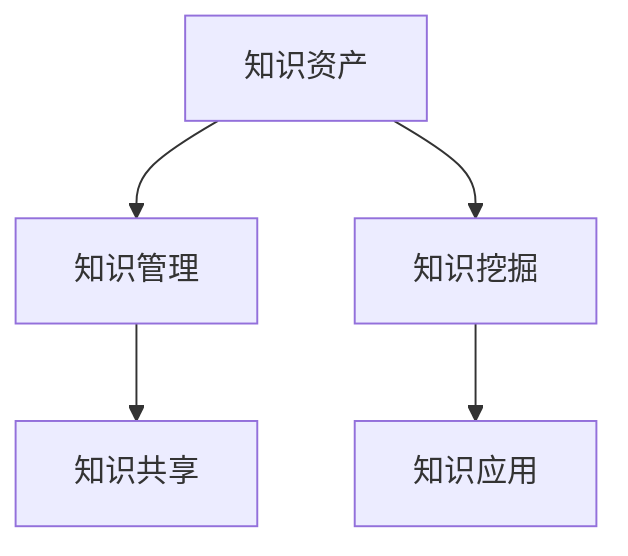

                 

# 知识资产要发掘和培育长期价值

## 1. 背景介绍

在数字化时代，知识资产（Knowledge Assets）已成为企业最宝贵的无形资产之一。随着信息技术的不断发展，越来越多的企业开始重视对知识资产的挖掘、整合、共享和应用。然而，如何有效挖掘知识资产，并将其转化为可操作的业务价值，成为了企业面临的一个重要挑战。本文旨在深入探讨知识资产的挖掘和培育，帮助企业利用知识资产发掘长期价值。

### 1.1 问题由来

企业知识资产的来源多种多样，包括但不限于内部员工的个人经验、专业技能、企业历史数据、市场洞察、客户反馈等。如何高效地获取、整合这些零散的知识，并将其转化为可操作的知识资产，以推动企业创新、提升运营效率和增强市场竞争力，是企业知识管理（Knowledge Management, KM）的核心目标。

然而，当前企业在知识资产挖掘和培育方面仍存在诸多挑战，主要包括以下几个方面：

1. **知识孤岛现象严重**：企业内部存在大量孤立的知识库、文档和系统，缺乏有效的跨部门和跨业务的协作机制，导致知识难以整合和共享。
2. **知识提取和应用困难**：现有知识管理系统往往难以自动发现和抽取有价值的知识，导致大量隐性知识无法转化为可操作的价值。
3. **知识共享和协作不足**：员工之间缺乏有效的沟通和协作平台，难以形成知识共享的文化，限制了知识资产的价值最大化。
4. **知识更新和维护困难**：知识库内容陈旧、更新不及时，无法跟上企业业务发展和市场变化的速度。

### 1.2 问题核心关键点

面对上述挑战，企业需要采取一系列措施，系统地挖掘和培育知识资产，以实现知识的长期价值最大化。这些措施包括但不限于：

1. **建立知识共享平台**：搭建跨部门和跨业务的协作平台，促进知识交流和共享。
2. **引入知识提取技术**：利用自然语言处理（NLP）和人工智能（AI）技术，自动抽取和分类有价值的知识。
3. **建立知识更新机制**：确保知识库内容的实时更新和维护，保持知识的时效性和准确性。
4. **推广知识应用场景**：将知识资产应用于产品开发、市场分析、客户服务等多个业务场景，提升企业的创新能力和运营效率。

通过解决这些问题，企业可以更好地发掘和培育知识资产，释放其长期价值。

## 2. 核心概念与联系

### 2.1 核心概念概述

为更好地理解知识资产的挖掘和培育，本节将介绍几个密切相关的核心概念：

- **知识资产（Knowledge Assets）**：指企业内部积累和积累的各类知识，包括显性知识和隐性知识，是企业核心竞争力的重要组成部分。
- **知识管理（Knowledge Management, KM）**：指企业通过计划、执行和监控知识战略，实现知识获取、共享和应用的过程，旨在提高企业创新能力和运营效率。
- **知识挖掘（Knowledge Mining）**：指从大规模数据中自动发现和抽取有价值知识的 process，利用机器学习和自然语言处理技术。
- **知识共享（Knowledge Sharing）**：指通过各种方式促进员工之间的知识交流和分享，形成知识共享的文化和机制。
- **知识应用（Knowledge Application）**：指将知识资产转化为具体的业务应用，提升企业创新和运营效率。

这些核心概念之间的逻辑关系可以通过以下Mermaid流程图来展示：



这个流程图展示知识资产及其与知识管理、知识挖掘和知识应用的关系：

1. 知识资产通过知识管理流程进行发掘和整合。
2. 知识挖掘技术从大规模数据中自动抽取有价值知识。
3. 知识共享机制促进员工之间的知识交流。
4. 知识应用将知识转化为具体的业务价值。

这些概念共同构成了企业知识管理的基本框架，帮助企业系统地挖掘和培育知识资产。

## 3. 核心算法原理 & 具体操作步骤
### 3.1 算法原理概述

知识资产的挖掘和培育，本质上是一个系统的、跨部门的协作过程。其核心思想是：通过知识管理流程，系统地发掘、整合、共享和应用知识，实现知识资产的长效价值。

形式化地，假设企业内部有 $N$ 个知识节点，每个知识节点的知识量为 $K_i$，知识管理的目标是最大化知识节点的总知识量 $K$，即：

$$
\max K = \sum_{i=1}^N K_i
$$

在这个过程中，知识管理流程包括以下几个关键步骤：

1. **知识发现**：通过知识挖掘技术，自动发现企业内部及外部的知识资源。
2. **知识整合**：利用知识管理平台，系统地整合分散的知识资源，构建统一的知识库。
3. **知识共享**：通过协作工具，促进员工之间的知识交流和共享。
4. **知识应用**：将知识应用于具体的业务场景，提升企业创新和运营效率。

### 3.2 算法步骤详解

企业知识资产的挖掘和培育，一般包括以下几个关键步骤：

**Step 1: 知识发现**
- 确定知识发现的范围和目标，包括内部数据、外部数据和第三方数据。
- 选择合适的知识挖掘技术和工具，如自然语言处理、数据挖掘、机器学习等。
- 定义知识抽取的规则和标准，确保抽取的知识具有较高的质量和准确性。
- 使用数据预处理技术，清洗和格式化数据，准备知识抽取。

**Step 2: 知识整合**
- 搭建知识管理平台，提供知识存储、检索和协作的功能。
- 设计知识分类和标签体系，对知识进行分类和组织。
- 开发知识抽取模型，自动从文档、网页、数据库等数据源中抽取知识。
- 定期更新知识库，保持知识的及时性和准确性。

**Step 3: 知识共享**
- 选择合适的协作工具和平台，如知识共享平台、协作软件、即时通讯工具等。
- 建立知识共享的文化和机制，鼓励员工之间的知识交流。
- 推广知识共享的最佳实践，如知识分享会议、案例分享、知识竞赛等。
- 通过知识共享平台，实现知识搜索、浏览、评论和点赞等功能。

**Step 4: 知识应用**
- 确定知识应用的具体场景，如产品开发、市场分析、客户服务、运营管理等。
- 设计知识应用的工作流程，确保知识能够顺利应用到具体业务中。
- 利用知识管理平台，实现知识搜索、推荐和应用。
- 定期评估知识应用的效果，反馈和优化知识共享和应用机制。

### 3.3 算法优缺点

知识资产的挖掘和培育方法具有以下优点：
1. **系统性**：通过知识管理流程，系统地挖掘、整合和应用知识，避免知识孤岛现象。
2. **自动化**：利用知识挖掘技术，自动发现和抽取有价值知识，提高知识提取效率。
3. **实时性**：通过知识共享平台，实时更新和共享知识，保持知识的时效性。
4. **应用广泛**：知识应用范围广泛，可应用于产品开发、市场分析、客户服务等多个业务场景，提升企业创新和运营效率。

同时，该方法也存在一定的局限性：
1. **技术依赖**：知识挖掘和共享需要依赖先进的技术和工具，对企业技术能力要求较高。
2. **数据质量**：知识挖掘的准确性和效果依赖于数据的质量和完整性，数据缺失或错误会影响知识提取效果。
3. **文化阻力**：知识共享和协作需要改变员工的工作习惯和文化，存在一定的实施难度。
4. **成本较高**：知识管理的实施和维护需要一定的投入，包括技术投入、人力成本和资源配置等。

尽管存在这些局限性，但就目前而言，知识资产的挖掘和培育方法仍是大中型企业获取知识价值的有效手段。未来相关研究的重点在于如何进一步降低知识管理的实施成本，提高知识挖掘的自动化和智能化水平，同时兼顾知识共享和应用的可扩展性和灵活性。

### 3.4 算法应用领域

知识资产的挖掘和培育方法，在企业信息化建设和知识管理（KM）的各个环节中都有广泛的应用，例如：

- **产品开发**：利用知识管理平台，整合产品相关的技术文档、用户反馈、市场分析等知识，提升产品创新能力和竞争力。
- **市场分析**：通过知识挖掘技术，从市场数据中自动发现和抽取有价值信息，指导市场战略制定。
- **客户服务**：搭建知识共享平台，提供客户常见问题解答，提升客户服务质量。
- **运营管理**：整合业务运营相关的知识，优化流程，提高运营效率。
- **人力资源管理**：利用知识共享平台，促进员工之间的经验交流和技能提升，提升员工能力和企业竞争力。

除了上述这些经典应用外，知识管理技术也被创新性地应用于更多的业务场景，如风险管理、供应链优化、财务分析等，为企业的数字化转型和智能化升级提供了新的动力。

## 4. 数学模型和公式 & 详细讲解  
### 4.1 数学模型构建

本节将使用数学语言对知识资产的挖掘和培育过程进行更加严格的刻画。

假设企业内部有 $N$ 个知识节点，每个知识节点的知识量为 $K_i$，知识管理的目标是最大化知识节点的总知识量 $K$，即：

$$
\max K = \sum_{i=1}^N K_i
$$

在实践中，我们通常使用最大化模型（Maximization Model）来求解上述优化问题。设知识节点的权重为 $w_i$，则优化目标为：

$$
\max \sum_{i=1}^N w_i K_i \quad \text{subject to} \quad \sum_{i=1}^N w_i = 1
$$

其中，$w_i$ 为知识节点的权重，满足权重之和为1的约束。

### 4.2 公式推导过程

以下我们以知识提取为例，推导知识挖掘的数学模型及其求解过程。

假设企业内部有 $N$ 个知识节点，每个知识节点的知识量为 $K_i$，知识挖掘的目标是最大化知识抽取的精度和覆盖范围，即：

$$
\max \sum_{i=1}^N w_i K_i \quad \text{subject to} \quad \sum_{i=1}^N w_i = 1
$$

其中，$w_i$ 为知识节点的权重，满足权重之和为1的约束。

使用拉格朗日乘子法求解上述优化问题，构建拉格朗日函数：

$$
\mathcal{L}(w, \lambda) = \sum_{i=1}^N w_i K_i - \lambda \left( \sum_{i=1}^N w_i - 1 \right)
$$

对 $w_i$ 和 $\lambda$ 求偏导数，并令其为0：

$$
\frac{\partial \mathcal{L}}{\partial w_i} = K_i - \lambda = 0 \quad \Rightarrow \quad \lambda = K_i
$$

$$
\frac{\partial \mathcal{L}}{\partial \lambda} = \sum_{i=1}^N w_i - 1 = 0 \quad \Rightarrow \quad w_i = \frac{K_i}{\sum_{i=1}^N K_i}
$$

将 $w_i$ 代入优化目标，得到最终的知识挖掘结果：

$$
K_{\text{opt}} = \sum_{i=1}^N \frac{K_i}{\sum_{i=1}^N K_i} K_i = \frac{\sum_{i=1}^N K_i^2}{\sum_{i=1}^N K_i}
$$

通过求解上述优化问题，可以得到最大化的知识挖掘结果。

## 5. 项目实践：代码实例和详细解释说明
### 5.1 开发环境搭建

在进行知识资产挖掘和培育的实践前，我们需要准备好开发环境。以下是使用Python进行知识管理系统的环境配置流程：

1. 安装Anaconda：从官网下载并安装Anaconda，用于创建独立的Python环境。

2. 创建并激活虚拟环境：
```bash
conda create -n km-env python=3.8 
conda activate km-env
```

3. 安装Python及依赖库：
```bash
pip install pandas numpy sklearn matplotlib scikit-learn 
pip install torch transformers
```

4. 安装企业知识管理工具：
```bash
pip install kuma-workspace
```

完成上述步骤后，即可在`km-env`环境中开始知识管理系统的实践。

### 5.2 源代码详细实现

下面以知识管理平台为例，给出使用Kuma Workspace搭建知识管理系统的Python代码实现。

```python
from kuma_workspace import KnowledgeManagement
from kuma_workspace import KnowledgeNode, KnowledgeEdge

# 创建知识管理实例
km = KnowledgeManagement()

# 创建知识节点
node1 = KnowledgeNode("知识节点1", "知识描述1")
node2 = KnowledgeNode("知识节点2", "知识描述2")
node3 = KnowledgeNode("知识节点3", "知识描述3")

# 创建知识边
edge1 = KnowledgeEdge(node1, node2, "依赖关系1")
edge2 = KnowledgeEdge(node2, node3, "依赖关系2")

# 注册知识节点和边
km.register_node(node1)
km.register_node(node2)
km.register_node(node3)
km.register_edge(edge1)
km.register_edge(edge2)

# 搜索知识节点
result = km.search("知识描述1")
print(result)
```

以上代码实现了基于Kuma Workspace的知识管理平台的搭建，包括知识节点的创建、知识边的构建以及知识搜索等基本操作。

### 5.3 代码解读与分析

让我们再详细解读一下关键代码的实现细节：

**KnowledgeManagement类**：
- `__init__`方法：初始化知识管理实例。
- `register_node`方法：注册知识节点。
- `register_edge`方法：注册知识边。
- `search`方法：搜索知识节点，并返回匹配结果。

**KnowledgeNode类**：
- `__init__`方法：初始化知识节点，包含节点名称和描述。

**KnowledgeEdge类**：
- `__init__`方法：初始化知识边，包含节点关系和描述。

通过上述代码，我们可以系统地构建知识管理平台，实现知识节点的创建、关联和搜索等基本功能。在实际应用中，还需要根据具体业务需求，进一步扩展知识管理平台的功能，如知识抽取、知识评估、知识推荐等。

## 6. 实际应用场景
### 6.1 企业产品开发

知识管理在企业产品开发中的应用，可以有效整合和利用企业内部的技术文档、市场洞察、客户反馈等知识，提升产品创新能力和市场竞争力。

在实践过程中，企业可以利用知识管理平台，建立产品开发的知识库，包括技术文档、专利信息、用户需求、市场分析等。通过知识搜索和知识推荐，开发团队可以快速获取所需知识，避免重复劳动，加速产品开发流程。同时，知识管理平台还可以记录和分析产品开发的整个过程，提供数据支持，提升产品迭代速度和质量。

### 6.2 市场分析

知识管理在市场分析中的应用，可以帮助企业从海量市场数据中自动发现和抽取有价值信息，指导市场战略制定。

具体而言，企业可以通过知识管理平台，整合市场调研报告、市场数据、竞争对手分析等数据源，构建统一的知识库。利用知识挖掘和自然语言处理技术，从数据中自动抽取市场趋势、用户需求、竞争态势等信息，生成市场分析报告。市场分析师可以利用这些报告，制定更加精准的市场策略，提升企业的市场竞争力。

### 6.3 客户服务

知识管理在客户服务中的应用，可以搭建知识共享平台，提供客户常见问题解答，提升客户服务质量。

通过知识共享平台，客户服务团队可以整合客户常见问题、客户反馈、客户投诉等知识，构建知识库。客户在遇到问题时，可以通过知识搜索，快速找到相关答案。同时，知识共享平台还可以记录和分析客户服务过程，提供数据支持，提升客户服务效率和满意度。

### 6.4 未来应用展望

随着知识管理技术的不断发展，未来知识资产的挖掘和培育将呈现以下几个发展趋势：

1. **自动化水平提升**：利用先进的技术和工具，实现知识抽取、知识分类、知识共享和知识应用的自动化，提高知识管理的效率和效果。
2. **跨领域知识整合**：利用知识管理平台，实现跨领域、跨业务的知识整合，提升企业的创新能力和市场竞争力。
3. **知识应用场景拓展**：将知识应用于更多的业务场景，如风险管理、供应链优化、财务分析等，实现企业的智能化升级。
4. **知识共享文化建设**：通过知识共享平台和文化建设，促进员工之间的知识交流和共享，提升员工能力和企业竞争力。
5. **知识安全与合规**：利用知识管理平台，实现知识的安全存储和合规管理，确保知识资产的安全性和合法性。

以上趋势展示了知识管理技术的广阔前景，预示着知识资产的挖掘和培育将带来更多的商业价值和创新应用。

## 7. 工具和资源推荐
### 7.1 学习资源推荐

为了帮助开发者系统掌握知识管理理论基础和实践技巧，这里推荐一些优质的学习资源：

1. 《知识管理与企业创新》系列博文：由知识管理专家撰写，深入浅出地介绍了知识管理的基本概念和实践方法。

2. 《知识管理与组织变革》课程：哈佛商学院开设的知识管理课程，涵盖了知识管理的基本理论和实践案例。

3. 《知识管理的未来》书籍：国际知识管理领域知名学者编写的书籍，全面介绍了知识管理的理论、实践和技术发展趋势。

4. KnowledgeHub开源项目：国际知识管理领域的开源项目，提供了知识管理的各类工具和示例，助力知识管理实践。

5. 《知识管理的成功之道》系列文章：国际知识管理领域的权威期刊，发表了大量知识管理的研究和案例文章，提供丰富的学习资源。

通过对这些资源的学习实践，相信你一定能够全面掌握知识管理的精髓，并用于解决实际的业务问题。

### 7.2 开发工具推荐

高效的开发离不开优秀的工具支持。以下是几款用于知识管理开发的常用工具：

1. Kuma Workspace：国际知名的知识管理平台，提供强大的知识搜索、知识共享、知识分类和知识推荐功能。

2. Microsoft SharePoint：微软的知识管理解决方案，提供文档管理、协作工具和搜索功能，适合企业内部知识管理。

3. Alfresco：开源的知识管理平台，提供强大的内容管理和搜索功能，支持多语言和多种文档格式。

4. OpenEHR：开源的电子健康记录系统，提供患者记录、临床文档和知识共享功能，适合医疗领域知识管理。

5. Trello：项目管理工具，可以用于知识管理中的任务分配和进度跟踪，促进知识管理的协作。

合理利用这些工具，可以显著提升知识管理任务的开发效率，加快创新迭代的步伐。

### 7.3 相关论文推荐

知识管理技术的发展源于学界的持续研究。以下是几篇奠基性的相关论文，推荐阅读：

1. Knowledge Discovery in Databases（KDD）：国际顶级会议，发表了大量知识管理领域的前沿研究。

2. Knowledge Management: Ideas and Cases：国际知识管理领域的经典书籍，详细介绍了知识管理的理论、技术和实践案例。

3. Knowledge Integration: Beyond the Information Revolution：国际顶级期刊，发表了大量知识管理领域的研究和案例文章。

4. Semantic Web: The Next Generation of the Web：国际顶级会议，探讨了知识管理的语义化和技术发展趋势。

这些论文代表了大规模知识管理技术的发展脉络。通过学习这些前沿成果，可以帮助研究者把握学科前进方向，激发更多的创新灵感。

## 8. 总结：未来发展趋势与挑战
### 8.1 总结

本文对知识资产的挖掘和培育进行了全面系统的介绍。首先阐述了知识资产的重要性和挖掘和培育的必要性，明确了知识管理在企业获取知识价值中的核心作用。其次，从原理到实践，详细讲解了知识管理的数学模型和关键步骤，给出了知识管理任务开发的完整代码实例。同时，本文还广泛探讨了知识管理方法在企业产品开发、市场分析、客户服务等多个行业领域的应用前景，展示了知识管理的巨大潜力。此外，本文精选了知识管理技术的各类学习资源，力求为读者提供全方位的技术指引。

通过本文的系统梳理，可以看到，知识资产的挖掘和培育技术正在成为企业获取知识价值的有效手段，极大地拓展了企业的创新和运营能力。未来，伴随知识管理技术的不断演进，企业将在知识资产的挖掘和培育方面取得更多的突破，进一步推动企业的数字化转型和智能化升级。

### 8.2 未来发展趋势

展望未来，知识管理技术将呈现以下几个发展趋势：

1. **技术自动化水平提升**：利用先进的技术和工具，实现知识抽取、知识分类、知识共享和知识应用的自动化，提高知识管理的效率和效果。
2. **跨领域知识整合**：利用知识管理平台，实现跨领域、跨业务的知识整合，提升企业的创新能力和市场竞争力。
3. **知识应用场景拓展**：将知识应用于更多的业务场景，如风险管理、供应链优化、财务分析等，实现企业的智能化升级。
4. **知识共享文化建设**：通过知识共享平台和文化建设，促进员工之间的知识交流和共享，提升员工能力和企业竞争力。
5. **知识安全与合规**：利用知识管理平台，实现知识的安全存储和合规管理，确保知识资产的安全性和合法性。

以上趋势展示了知识管理技术的广阔前景，预示着知识资产的挖掘和培育将带来更多的商业价值和创新应用。

### 8.3 面临的挑战

尽管知识管理技术已经取得了一定的进展，但在迈向更加智能化、普适化应用的过程中，它仍面临着诸多挑战：

1. **技术依赖**：知识管理系统的构建和维护需要依赖先进的技术和工具，对企业技术能力要求较高。
2. **数据质量**：知识抽取的准确性和效果依赖于数据的质量和完整性，数据缺失或错误会影响知识提取效果。
3. **文化阻力**：知识共享和协作需要改变员工的工作习惯和文化，存在一定的实施难度。
4. **成本较高**：知识管理的实施和维护需要一定的投入，包括技术投入、人力成本和资源配置等。
5. **安全风险**：知识管理平台需要保证知识的安全存储和访问控制，防止数据泄露和滥用。

尽管存在这些挑战，但通过不断优化和改进知识管理技术和工具，相信知识资产的挖掘和培育技术将不断提升，为企业的数字化转型和智能化升级提供更强大的支持。

### 8.4 研究展望

面对知识管理面临的挑战，未来的研究需要在以下几个方面寻求新的突破：

1. **技术自动化**：开发更加自动化和智能化的知识管理工具，减少人工干预，提升知识管理效率。
2. **跨领域整合**：实现跨领域、跨业务的知识整合，提升企业创新能力和市场竞争力。
3. **知识共享文化**：通过文化建设和技术手段，促进员工之间的知识交流和共享，提升知识管理的文化氛围。
4. **知识安全与合规**：研究知识管理的隐私保护和合规性技术，确保知识资产的安全性和合法性。
5. **知识应用**：将知识应用于更多的业务场景，提升企业的运营效率和创新能力。

这些研究方向将推动知识管理技术的不断演进，为企业的数字化转型和智能化升级提供更强大的技术支持。面向未来，知识管理技术需要与其他人工智能技术进行更深入的融合，如自然语言处理、机器学习、大数据等，多路径协同发力，共同推动知识管理技术的进步。只有勇于创新、敢于突破，才能不断拓展知识管理技术的边界，让知识资产发挥更大的价值。

## 9. 附录：常见问题与解答

**Q1：企业如何系统地发掘和培育知识资产？**

A: 企业可以通过以下步骤系统地发掘和培育知识资产：

1. **确定知识挖掘范围**：明确企业需要挖掘的知识类型和来源，包括内部数据、外部数据和第三方数据。
2. **选择合适的知识挖掘技术**：利用自然语言处理、数据挖掘、机器学习等技术，自动发现和抽取有价值知识。
3. **建立知识共享平台**：搭建跨部门和跨业务的协作平台，促进员工之间的知识交流和共享。
4. **设计知识应用场景**：将知识应用于产品开发、市场分析、客户服务等多个业务场景，提升企业的创新能力和运营效率。

**Q2：如何评估知识管理的效果？**

A: 评估知识管理的效果可以从以下几个方面入手：

1. **知识质量**：通过抽样检查和评估，确保知识库中知识的准确性和完整性。
2. **知识使用率**：通过统计知识库的使用情况，评估员工对知识的管理和利用程度。
3. **知识共享率**：通过分析知识共享平台的数据，评估员工之间的知识共享和交流情况。
4. **业务效果**：通过评估知识管理对业务的影响，如创新能力提升、运营效率提高等，评估知识管理的实际效果。

**Q3：知识管理系统的实施难点有哪些？**

A: 知识管理系统的实施难点主要包括以下几个方面：

1. **技术依赖**：知识管理系统的构建和维护需要依赖先进的技术和工具，对企业技术能力要求较高。
2. **数据质量**：知识抽取的准确性和效果依赖于数据的质量和完整性，数据缺失或错误会影响知识提取效果。
3. **文化阻力**：知识共享和协作需要改变员工的工作习惯和文化，存在一定的实施难度。
4. **成本较高**：知识管理的实施和维护需要一定的投入，包括技术投入、人力成本和资源配置等。
5. **安全风险**：知识管理平台需要保证知识的安全存储和访问控制，防止数据泄露和滥用。

尽管存在这些挑战，但通过不断优化和改进知识管理技术和工具，相信知识资产的挖掘和培育技术将不断提升，为企业的数字化转型和智能化升级提供更强大的支持。

**Q4：知识管理与人工智能技术的结合方向有哪些？**

A: 知识管理与人工智能技术的结合方向主要包括以下几个方面：

1. **知识抽取和分类**：利用自然语言处理和机器学习技术，自动发现和分类企业内部及外部的知识资源。
2. **知识推荐**：通过推荐算法，推荐相关知识和应用场景，提升知识的应用效率。
3. **知识检索**：利用搜索技术，快速定位和检索知识库中的信息，提高知识检索的效率和准确性。
4. **知识关联**：利用知识图谱和语义分析技术，将知识进行关联和整合，形成知识网络。

这些方向的结合将推动知识管理技术的不断演进，为企业的数字化转型和智能化升级提供更强大的技术支持。

**Q5：知识管理如何帮助企业实现智能化升级？**

A: 知识管理可以帮助企业实现智能化升级的主要方向包括：

1. **提升创新能力**：通过知识管理，企业可以整合内部和外部的知识资源，提升创新能力和市场竞争力。
2. **优化运营效率**：通过知识管理，企业可以实现知识的高效共享和应用，优化运营流程，提升效率。
3. **增强决策支持**：通过知识管理，企业可以整合市场数据、市场洞察等知识资源，提供决策支持。
4. **推动数字化转型**：通过知识管理，企业可以实现知识的数字化管理和应用，推动数字化转型。

通过知识管理技术的应用，企业可以在多个业务场景中实现智能化升级，提升企业的市场竞争力和创新能力。

---

作者：禅与计算机程序设计艺术 / Zen and the Art of Computer Programming

