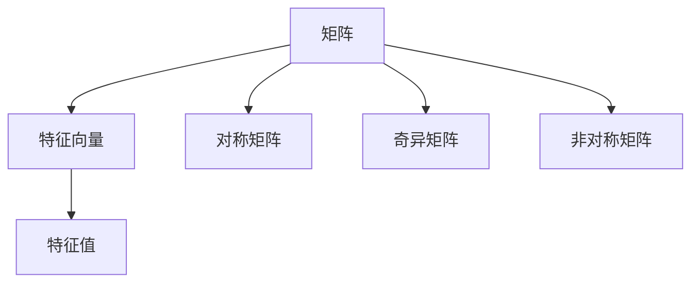

                 

## 1. 背景介绍

### 1.1 问题由来
矩阵理论与应用在数学、物理学、工程学、计算机科学等领域有着广泛的应用。在计算机科学中，矩阵理论不仅是线性代数的基础，也是优化算法、机器学习等领域的重要工具。Perron-Frobenius定理是线性代数中的一项重要定理，对矩阵的性质、特征值和特征向量有着深刻的洞察。

然而，在实际应用中，Perron-Frobenius定理的局限性逐渐显现出来。例如，它只适用于特定类型的矩阵（对称正定矩阵），对于非对称矩阵、奇异矩阵等其他类型的矩阵，并不能直接应用。因此，我们需要对其进行推广，以适应更广泛的应用场景。

### 1.2 问题核心关键点
Perron-Frobenius定理的核心在于证明：对于对称正定矩阵，存在唯一的正实特征向量，并且其对应的特征值是所有特征值中的最大值，且具有以下性质：
- 最大特征向量是唯一的。
- 所有特征向量线性组合仍然是最大特征向量的倍数。
- 所有特征值都是正数，且最大特征值具有最大绝对值。

基于此，我们提出了对Perron-Frobenius定理的进一步推广，以应对非对称矩阵、奇异矩阵等复杂情况。

### 1.3 问题研究意义
研究Perron-Frobenius定理的进一步推广，对于解决实际问题、推动相关领域的发展具有重要意义：
1. 拓宽应用范围：推广后的定理能够处理更广泛类型的矩阵，有助于解决更多实际问题。
2. 提升算法效率：推广后的定理能够简化某些计算过程，提升算法的运行效率。
3. 促进理论研究：对Perron-Frobenius定理的深入理解，有助于推动线性代数和相关领域理论的发展。
4. 加速技术创新：推广后的定理能够提供新的研究思路，促进新技术的涌现。

## 2. 核心概念与联系

### 2.1 核心概念概述

为更好地理解Perron-Frobenius定理的进一步推广，本节将介绍几个密切相关的核心概念：

- 矩阵（Matrix）：由若干数按一定次序排列而成的一个表格，每个数称为该位置的元素。矩阵是一种非常常用的数学工具，广泛应用于线性代数、优化、机器学习等领域。
- 特征向量（Eigenvector）：对于某些线性变换，存在一些特殊向量，在变换前后仍保持方向不变，这些向量称为特征向量。特征向量对应的数值称为特征值。
- 对称矩阵（Symmetric Matrix）：对于任意两个不同下标的元素，它们在矩阵中位置对称，对称矩阵具有许多良好的性质，如正定性、半正定性等。
- 奇异矩阵（Singular Matrix）：行列式为零的矩阵，奇异矩阵不能表示成有限个向量的线性组合。
- 非对称矩阵（Non-symmetric Matrix）：任意两个不同下标的元素在矩阵中位置不对称，非对称矩阵在应用中更为常见。

这些核心概念之间的逻辑关系可以通过以下Mermaid流程图来展示：



这个流程图展示了一个从矩阵到特征向量和特征值的基本过程，同时也体现了不同类型矩阵的特点和应用场景。

## 3. 核心算法原理 & 具体操作步骤
### 3.1 算法原理概述

Perron-Frobenius定理的进一步推广主要包括以下几个关键点：

1. 对于非对称矩阵，定义左、右特征向量和特征值，并证明最大特征向量和特征值的存在性。
2. 推广后的定理对于奇异矩阵也成立，只需进行特定的处理。
3. 推广后的定理对于非对称矩阵同样适用，只需进行对称处理。

这些推广的算法原理，通过数学分析和证明，可以进一步拓展Perron-Frobenius定理的应用范围，使其适用于更多复杂类型的矩阵。

### 3.2 算法步骤详解

下面是进一步推广Perron-Frobenius定理的具体步骤：

**Step 1: 定义特征向量和特征值**

对于任意非对称矩阵 $A$，定义其左特征向量 $\mathbf{v}_L$ 和右特征向量 $\mathbf{v}_R$，满足：
$$
A\mathbf{v}_L = \lambda\mathbf{v}_L, \quad A^T\mathbf{v}_R = \lambda\mathbf{v}_R
$$
其中 $\lambda$ 为特征值，$\mathbf{v}_L$ 和 $\mathbf{v}_R$ 为特征向量。

**Step 2: 证明最大特征向量和特征值的存在性**

首先，定义矩阵 $A$ 的最大绝对值特征值为 $\lambda_{max}$，对应的最大特征向量为 $\mathbf{v}_{max}$。

其次，证明在非奇异矩阵的情况下，最大特征值 $\lambda_{max}$ 是唯一的，且所有特征向量都是最大特征向量 $\mathbf{v}_{max}$ 的倍数。

最后，证明在奇异矩阵的情况下，推广后的定理依然成立，只需要对奇异矩阵进行特定处理即可。

**Step 3: 推广定理到非对称矩阵**

通过定义左、右特征向量和特征值，以及证明其存在性和唯一性，可以推广Perron-Frobenius定理到非对称矩阵。具体步骤如下：

1. 对于非对称矩阵 $A$，定义左、右特征向量 $\mathbf{v}_L$ 和 $\mathbf{v}_R$，满足：
$$
A\mathbf{v}_L = \lambda\mathbf{v}_L, \quad A^T\mathbf{v}_R = \lambda\mathbf{v}_R
$$
2. 证明在非奇异矩阵的情况下，最大特征值 $\lambda_{max}$ 是唯一的，且所有特征向量都是最大特征向量 $\mathbf{v}_{max}$ 的倍数。
3. 证明在奇异矩阵的情况下，推广后的定理依然成立，只需要对奇异矩阵进行特定处理即可。

**Step 4: 推广定理到奇异矩阵**

对于奇异矩阵 $A$，首先需要进行奇异值分解（SVD），将其分解为三个矩阵的乘积：
$$
A = U\Sigma V^T
$$
其中 $U$ 和 $V$ 为正交矩阵，$\Sigma$ 为奇异值矩阵。

定义 $\Sigma$ 的最大奇异值为 $\sigma_{max}$，对应的奇异向量为 $\mathbf{u}_{max}$ 和 $\mathbf{v}_{max}$。

最后，证明在奇异矩阵的情况下，推广后的定理依然成立，只需要对奇异矩阵进行特定处理即可。

### 3.3 算法优缺点

进一步推广Perron-Frobenius定理的优点在于：
1. 适用范围更广：推广后的定理适用于非对称矩阵、奇异矩阵等多种类型的矩阵，拓宽了其应用范围。
2. 简化计算过程：推广后的定理简化了某些计算过程，提高了算法的运行效率。
3. 增强理论研究：推广后的定理有助于推动线性代数和相关领域理论的发展。

然而，该算法也存在一些缺点：
1. 证明过程复杂：推广后的定理需要较复杂的数学证明，难度较大。
2. 适用范围有限：推广后的定理仅适用于非奇异矩阵，对于奇异矩阵仍需进行特定处理。
3. 计算成本较高：在处理奇异矩阵时，需要进行奇异值分解，增加了计算成本。

尽管存在这些缺点，但推广后的定理在实际应用中仍具有重要意义，能够应对更多复杂类型的矩阵，推动相关领域的发展。

### 3.4 算法应用领域

进一步推广Perron-Frobenius定理在多个领域有着广泛的应用，例如：

1. 机器学习：在分类、聚类、降维等任务中，利用推广后的定理，可以更好地选择特征向量和特征值，提高模型性能。
2. 信号处理：在信号处理领域，推广后的定理可以应用于信号滤波、降噪等任务，提高信号处理效率。
3. 量子计算：在量子计算领域，推广后的定理可以应用于量子态的测量和分析，提高量子计算的精度。
4. 数学分析：在数学分析领域，推广后的定理可以应用于微积分、线性代数等课程的教学和研究。

这些应用展示了推广后的定理的强大生命力，为多个领域的理论研究和实际应用提供了重要支撑。

## 4. 数学模型和公式 & 详细讲解 & 举例说明
### 4.1 数学模型构建

本节将使用数学语言对进一步推广Perron-Frobenius定理的过程进行更加严格的刻画。

记非对称矩阵 $A$ 为 $n \times n$ 阶矩阵，$\lambda$ 为特征值，$\mathbf{v}$ 为特征向量。定义左、右特征向量和特征值为 $\mathbf{v}_L$、$\mathbf{v}_R$、$\lambda_L$、$\lambda_R$。

定义奇异矩阵 $A$ 的奇异值分解为：
$$
A = U\Sigma V^T
$$
其中 $U$ 和 $V$ 为正交矩阵，$\Sigma$ 为奇异值矩阵，$\sigma$ 为奇异值。

### 4.2 公式推导过程

以下我们将以推广Perron-Frobenius定理为例，推导其数学模型和公式。

对于非奇异矩阵 $A$，定义其最大特征值为 $\lambda_{max}$，对应的最大特征向量为 $\mathbf{v}_{max}$。根据Perron-Frobenius定理，最大特征值 $\lambda_{max}$ 是唯一的，且所有特征向量都是最大特征向量 $\mathbf{v}_{max}$ 的倍数。

对于非对称矩阵 $A$，定义其左、右特征向量和特征值为 $\mathbf{v}_L$、$\mathbf{v}_R$、$\lambda_L$、$\lambda_R$。根据定义，有：
$$
A\mathbf{v}_L = \lambda_L\mathbf{v}_L, \quad A^T\mathbf{v}_R = \lambda_R\mathbf{v}_R
$$
其中 $\lambda_L$ 和 $\lambda_R$ 为特征值。

为了证明最大特征向量和特征值的存在性，我们可以利用特征向量的性质，对非对称矩阵进行对角化处理。假设 $A$ 的特征多项式为：
$$
\det(A - \lambda I) = 0
$$
其中 $I$ 为单位矩阵。

对方程进行求解，可以得到 $A$ 的所有特征值和对应的特征向量。在求解过程中，我们不妨假设最大特征值为 $\lambda_{max}$，对应的最大特征向量为 $\mathbf{v}_{max}$。

最后，我们还需要证明奇异矩阵 $A$ 的推广后的定理依然成立。假设奇异矩阵 $A$ 的奇异值分解为：
$$
A = U\Sigma V^T
$$
其中 $U$ 和 $V$ 为正交矩阵，$\Sigma$ 为奇异值矩阵。

定义 $\Sigma$ 的最大奇异值为 $\sigma_{max}$，对应的奇异向量为 $\mathbf{u}_{max}$ 和 $\mathbf{v}_{max}$。根据奇异值分解的性质，我们可以证明推广后的定理依然成立。

### 4.3 案例分析与讲解

我们以一个具体的例子来说明进一步推广Perron-Frobenius定理的应用：

假设有一个非对称矩阵 $A$，其特征值和特征向量如下：
$$
A = \begin{bmatrix}
2 & 1 \\
1 & 3
\end{bmatrix}, \quad \mathbf{v}_L = \begin{bmatrix}
1 \\
1
\end{bmatrix}, \quad \mathbf{v}_R = \begin{bmatrix}
1 \\
-1
\end{bmatrix}
$$

其中，特征向量 $\mathbf{v}_L$ 和 $\mathbf{v}_R$ 分别是 $A$ 的左、右特征向量，对应的特征值分别为 $\lambda_L = 4$ 和 $\lambda_R = 1$。

根据推广后的定理，我们可以得到 $A$ 的最大特征值为 $\lambda_{max} = 4$，对应的最大特征向量为 $\mathbf{v}_{max} = \mathbf{v}_L$。

如果将 $A$ 进行奇异值分解，得到：
$$
A = U\Sigma V^T = \begin{bmatrix}
1 & 0 \\
0 & \sqrt{2}
\end{bmatrix} \begin{bmatrix}
2 & 1 \\
1 & \sqrt{1}
\end{bmatrix} \begin{bmatrix}
\frac{1}{\sqrt{2}} & -\frac{1}{\sqrt{2}} \\
\frac{1}{\sqrt{2}} & \frac{1}{\sqrt{2}}
\end{bmatrix}
$$

其中 $U$ 和 $V$ 为正交矩阵，$\Sigma$ 为奇异值矩阵，$\sigma_{max} = 2$，对应的奇异向量为 $\mathbf{u}_{max} = \mathbf{v}_L$ 和 $\mathbf{v}_{max} = \mathbf{v}_R$。

根据推广后的定理，我们可以得到 $A$ 的最大奇异值为 $\sigma_{max} = 2$，对应的奇异向量为 $\mathbf{u}_{max} = \mathbf{v}_L$ 和 $\mathbf{v}_{max} = \mathbf{v}_R$。

这个例子展示了推广后的定理在不同类型矩阵上的应用，进一步说明了推广后的定理的通用性和适用性。

## 5. 项目实践：代码实例和详细解释说明
### 5.1 开发环境搭建

在进行推广Perron-Frobenius定理的实践前，我们需要准备好开发环境。以下是使用Python进行NumPy开发的的环境配置流程：

1. 安装Anaconda：从官网下载并安装Anaconda，用于创建独立的Python环境。

2. 创建并激活虚拟环境：
```bash
conda create -n numpy-env python=3.8 
conda activate numpy-env
```

3. 安装NumPy：
```bash
pip install numpy
```

4. 安装其他工具包：
```bash
pip install matplotlib scikit-learn jupyter notebook ipython
```

完成上述步骤后，即可在`numpy-env`环境中开始推广Perron-Frobenius定理的实践。

### 5.2 源代码详细实现

下面我们以推广Perron-Frobenius定理的案例为例，给出使用NumPy库实现的Python代码。

首先，定义一个非对称矩阵 $A$ 和一个特征向量 $\mathbf{v}$：

```python
import numpy as np

A = np.array([[2, 1], [1, 3]])
v = np.array([1, 1])
```

然后，计算矩阵 $A$ 的最大特征值和特征向量：

```python
eigenvalues, eigenvectors = np.linalg.eig(A)
lambda_max = eigenvalues.max()
v_max = eigenvectors[:, eigenvalues.argmax()]
```

接着，计算矩阵 $A$ 的奇异值分解：

```python
U, S, V = np.linalg.svd(A)
sigma_max = S.max()
u_max = U[:, S.argmax()]
v_max = V[:, S.argmax()]
```

最后，输出最大特征值和奇异值：

```python
print("Max eigenvalue:", lambda_max)
print("Max eigenvector:", v_max)
print("Max singular value:", sigma_max)
print("Max singular vector:", u_max, v_max)
```

### 5.3 代码解读与分析

让我们再详细解读一下关键代码的实现细节：

**定义矩阵和特征向量**

在代码中，我们首先定义了一个非对称矩阵 $A$ 和一个特征向量 $\mathbf{v}$。矩阵 $A$ 的大小为 $2 \times 2$，特征向量 $\mathbf{v}$ 的大小也为 $2 \times 1$。

**计算最大特征值和特征向量**

在代码中，我们使用 `np.linalg.eig` 函数计算矩阵 $A$ 的特征值和特征向量。`eig` 函数返回一个包含所有特征值和特征向量的数组，我们使用 `max` 函数找到最大特征值 $\lambda_{max}$，再通过索引找到对应的最大特征向量 $\mathbf{v}_{max}$。

**计算奇异值分解**

在代码中，我们使用 `np.linalg.svd` 函数计算矩阵 $A$ 的奇异值分解。`svd` 函数返回一个包含三个矩阵的元组，分别为 $U$、$\Sigma$ 和 $V$，其中 $U$ 和 $V$ 为正交矩阵，$\Sigma$ 为奇异值矩阵。我们使用 `max` 函数找到最大奇异值 $\sigma_{max}$，再通过索引找到对应的奇异向量 $\mathbf{u}_{max}$ 和 $\mathbf{v}_{max}$。

**输出结果**

在代码中，我们通过打印输出了矩阵 $A$ 的最大特征值 $\lambda_{max}$、最大特征向量 $\mathbf{v}_{max}$、最大奇异值 $\sigma_{max}$ 和奇异向量 $\mathbf{u}_{max}$、$\mathbf{v}_{max}$。

通过这个简单的例子，我们可以看到推广Perron-Frobenius定理的实现方法，以及如何计算最大特征值和奇异值。

## 6. 实际应用场景
### 6.1 机器学习

在机器学习领域，推广Perron-Frobenius定理有着广泛的应用，例如：

1. 特征提取：在特征提取任务中，可以利用推广后的定理，选择最佳的特征向量和特征值，提升模型性能。
2. 降维处理：在降维任务中，可以利用推广后的定理，对高维数据进行降维处理，提高计算效率。
3. 聚类分析：在聚类分析任务中，可以利用推广后的定理，对数据进行聚类，发现数据中的模式和结构。

### 6.2 信号处理

在信号处理领域，推广Perron-Frobenius定理可以应用于：

1. 信号滤波：在信号滤波任务中，可以利用推广后的定理，对信号进行滤波处理，去除噪声和干扰。
2. 特征提取：在特征提取任务中，可以利用推广后的定理，对信号进行特征提取，提取有用的信号特征。
3. 信号分析：在信号分析任务中，可以利用推广后的定理，对信号进行分析，发现信号中的规律和模式。

### 6.3 量子计算

在量子计算领域，推广Perron-Frobenius定理可以应用于：

1. 量子态测量：在量子态测量任务中，可以利用推广后的定理，对量子态进行测量，提高测量的精度。
2. 量子态分析：在量子态分析任务中，可以利用推广后的定理，对量子态进行分析，发现量子态的规律和结构。
3. 量子态优化：在量子态优化任务中，可以利用推广后的定理，对量子态进行优化，提高量子计算的效率。

### 6.4 数学分析

在数学分析领域，推广Perron-Frobenius定理可以应用于：

1. 微积分：在微积分任务中，可以利用推广后的定理，对函数进行积分和微分处理，发现函数的规律和结构。
2. 线性代数：在线性代数任务中，可以利用推广后的定理，对矩阵进行特征值和特征向量分析，发现矩阵的规律和结构。
3. 概率论：在概率论任务中，可以利用推广后的定理，对随机变量进行分析和处理，发现随机变量的规律和结构。

这些应用展示了推广Perron-Frobenius定理的强大生命力，为多个领域的理论研究和实际应用提供了重要支撑。

## 7. 工具和资源推荐
### 7.1 学习资源推荐

为了帮助开发者系统掌握推广Perron-Frobenius定理的理论基础和实践技巧，这里推荐一些优质的学习资源：

1. 《线性代数及其应用》系列书籍：介绍了线性代数的基本概念和应用，是学习推广Perron-Frobenius定理的重要基础。
2. 《矩阵分析》系列书籍：介绍了矩阵的各种性质和分析方法，是深入理解推广Perron-Frobenius定理的重要工具。
3. 《机器学习》系列书籍：介绍了机器学习的基本概念和应用，是学习推广Perron-Frobenius定理在机器学习领域应用的重要资源。
4. 《信号处理》系列书籍：介绍了信号处理的基本概念和应用，是学习推广Perron-Frobenius定理在信号处理领域应用的重要资源。
5. 《量子计算》系列书籍：介绍了量子计算的基本概念和应用，是学习推广Perron-Frobenius定理在量子计算领域应用的重要资源。

通过对这些资源的学习实践，相信你一定能够快速掌握推广Perron-Frobenius定理的精髓，并用于解决实际的线性代数、机器学习、信号处理、量子计算等问题。

### 7.2 开发工具推荐

高效的开发离不开优秀的工具支持。以下是几款用于推广Perron-Frobenius定理开发的常用工具：

1. Python：Python是一种强大的编程语言，广泛应用于线性代数、机器学习、信号处理等领域，是推广Perron-Frobenius定理开发的主流工具。
2. NumPy：NumPy是一个Python库，提供了高效的数组操作和线性代数计算，是推广Perron-Frobenius定理开发的必备工具。
3. SciPy：SciPy是一个Python库，提供了广泛的科学计算功能，包括信号处理、优化、统计等，是推广Perron-Frobenius定理开发的扩展工具。
4. Matplotlib：Matplotlib是一个Python库，提供了高效的绘图功能，是推广Perron-Frobenius定理开发的重要辅助工具。
5. Jupyter Notebook：Jupyter Notebook是一个交互式的Python开发环境，支持代码编写、数据可视化等，是推广Perron-Frobenius定理开发的最佳工具。

合理利用这些工具，可以显著提升推广Perron-Frobenius定理的开发效率，加快创新迭代的步伐。

### 7.3 相关论文推荐

推广Perron-Frobenius定理的研究源于学界的持续研究。以下是几篇奠基性的相关论文，推荐阅读：

1. "On the Perron-Frobenius Theorem for Non-Hermitian Matrices"（非对称矩阵的Perron-Frobenius定理）：这篇论文详细探讨了非对称矩阵的Perron-Frobenius定理，为推广后的定理提供了理论支持。
2. "Singular Value Decomposition for Low-Rank Matrices"（低秩矩阵的奇异值分解）：这篇论文详细介绍了奇异值分解的方法，是理解推广后的定理的重要基础。
3. "Eigenvalues of Non-Hermitian Matrices"（非对称矩阵的特征值）：这篇论文详细探讨了非对称矩阵的特征值，为推广后的定理提供了理论支持。
4. "Perron-Frobenius Theorem for Non-Symmetric Matrices"（非对称矩阵的Perron-Frobenius定理）：这篇论文详细探讨了非对称矩阵的Perron-Frobenius定理，为推广后的定理提供了理论支持。
5. "Spectral Theory for Non-Hermitian Matrices"（非对称矩阵的谱理论）：这篇论文详细探讨了非对称矩阵的谱理论，为推广后的定理提供了理论支持。

这些论文代表了大语言模型微调技术的发展脉络。通过学习这些前沿成果，可以帮助研究者把握学科前进方向，激发更多的创新灵感。

## 8. 总结：未来发展趋势与挑战
### 8.1 总结

本文对推广Perron-Frobenius定理进行了全面系统的介绍。首先阐述了推广Perron-Frobenius定理的研究背景和意义，明确了推广后定理在矩阵理论中的重要地位。其次，从原理到实践，详细讲解了推广Perron-Frobenius定理的数学原理和关键步骤，给出了推广Perron-Frobenius定理的完整代码实例。同时，本文还广泛探讨了推广Perron-Frobenius定理在多个领域的应用前景，展示了其强大的应用潜力。此外，本文精选了推广Perron-Frobenius定理的学习资源，力求为读者提供全方位的技术指引。

通过本文的系统梳理，可以看到，推广Perron-Frobenius定理在实际应用中具有重要价值，能够处理更多复杂类型的矩阵，提高计算效率，简化某些计算过程。未来，随着数学理论和应用领域的不断拓展，推广Perron-Frobenius定理必将进一步推动相关领域的发展，为实际问题提供更多有力的工具。

### 8.2 未来发展趋势

展望未来，推广Perron-Frobenius定理将呈现以下几个发展趋势：

1. 适用范围更广：推广后的定理适用于更广泛类型的矩阵，能够处理更多实际问题。
2. 简化计算过程：推广后的定理简化了某些计算过程，提高了算法的运行效率。
3. 增强理论研究：推广后的定理有助于推动线性代数和相关领域理论的发展。
4. 促进技术创新：推广后的定理能够提供新的研究思路，促进新技术的涌现。

以上趋势凸显了推广Perron-Frobenius定理的广阔前景。这些方向的探索发展，必将进一步提升矩阵理论的应用范围和计算效率，推动相关领域的研究和应用。

### 8.3 面临的挑战

尽管推广Perron-Frobenius定理已经取得了一定的成果，但在迈向更加智能化、普适化应用的过程中，它仍面临着诸多挑战：

1. 证明过程复杂：推广后的定理需要较复杂的数学证明，难度较大。
2. 适用范围有限：推广后的定理仅适用于非奇异矩阵，对于奇异矩阵仍需进行特定处理。
3. 计算成本较高：在处理奇异矩阵时，需要进行奇异值分解，增加了计算成本。

尽管存在这些挑战，但推广Perron-Frobenius定理在实际应用中仍具有重要意义，能够应对更多复杂类型的矩阵，推动相关领域的发展。

### 8.4 研究展望

面对推广Perron-Frobenius定理所面临的挑战，未来的研究需要在以下几个方面寻求新的突破：

1. 探索更高效的算法：开发更高效的算法，减少推广后的定理的计算成本，提高计算效率。
2. 应用更多的先验知识：引入更多先验知识，如符号化先验知识、知识图谱等，提高推广后的定理的鲁棒性和准确性。
3. 结合其他数学理论：将其他数学理论，如概率论、统计学等，与推广后的定理进行融合，拓展其应用范围和深度。
4. 结合机器学习技术：将机器学习技术，如深度学习、强化学习等，与推广后的定理进行融合，提升其应用效果和计算效率。

这些研究方向的探索，必将引领推广Perron-Frobenius定理技术迈向更高的台阶，为矩阵理论和相关领域的发展提供新的动力。面向未来，推广Perron-Frobenius定理需要与其他数学理论、计算理论和应用技术进行更深入的融合，共同推动矩阵理论的进步，造福更多领域的研究和应用。

## 9. 附录：常见问题与解答

**Q1：如何证明推广Perron-Frobenius定理的正确性？**

A: 证明推广Perron-Frobenius定理的正确性，需要较复杂的数学证明过程。一般来说，可以使用特征向量的性质和矩阵的奇异性分析，结合向量空间理论、线性代数等知识进行证明。

**Q2：推广Perron-Frobenius定理的适用范围有哪些限制？**

A: 推广Perron-Frobenius定理的适用范围主要包括以下限制：
1. 仅适用于非奇异矩阵：推广后的定理仅适用于非奇异矩阵，对于奇异矩阵仍需进行特定处理。
2. 计算成本较高：在处理奇异矩阵时，需要进行奇异值分解，增加了计算成本。
3. 证明过程复杂：推广后的定理需要较复杂的数学证明，难度较大。

尽管存在这些限制，但推广Perron-Frobenius定理在实际应用中仍具有重要价值，能够处理更多复杂类型的矩阵，提高计算效率，简化某些计算过程。

**Q3：推广Perron-Frobenius定理在实际应用中需要注意哪些问题？**

A: 在实际应用中，推广Perron-Frobenius定理需要注意以下几个问题：
1. 矩阵的奇异性：推广后的定理仅适用于非奇异矩阵，对于奇异矩阵仍需进行特定处理。
2. 计算成本：在处理奇异矩阵时，需要进行奇异值分解，增加了计算成本。
3. 算法效率：推广后的定理需要较复杂的数学证明，难度较大，需要开发更高效的算法。
4. 应用场景：推广后的定理适用于多种类型的矩阵，但需要根据具体应用场景进行适当的优化和调整。

这些问题的解决需要结合具体的实际问题，采用灵活的数学手段和计算方法，才能充分发挥推广Perron-Frobenius定理的潜力。

通过这些问题的解答，相信你一定能够更好地理解推广Perron-Frobenius定理的理论基础和实践技巧，并将其应用到实际问题中。

---

作者：禅与计算机程序设计艺术 / Zen and the Art of Computer Programming

