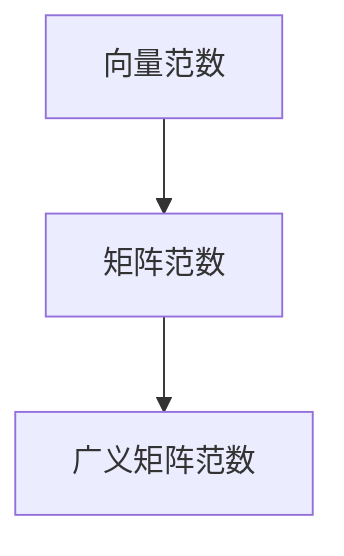

                 

# 矩阵理论与应用：广义矩阵范数与矩阵范数的补充

> 关键词：矩阵范数,广义矩阵范数,矩阵计算,线性代数,数学模型,算法原理,应用场景,工具资源,未来展望

## 1. 背景介绍

矩阵是线性代数中极为重要的概念，它广泛应用在计算机科学、工程学、物理学等多个领域。随着计算机技术的发展，矩阵计算在深度学习、数据科学、信号处理等领域的重要性愈发凸显。在矩阵计算中，矩阵范数是衡量矩阵大小、形状和稳定性的重要指标，对矩阵的存储、运算、优化等操作有着深远的影响。本文将深入探讨矩阵范数的理论基础，介绍广义矩阵范数及其在矩阵计算中的应用，并探讨其在实际场景中的应用前景。

## 2. 核心概念与联系

### 2.1 核心概念概述

矩阵范数是指用于衡量矩阵大小的数值函数，通常用于矩阵的线性代数操作和优化问题中。常见的矩阵范数包括：

- 向量范数（Vector Norm）：应用于一维向量，如欧几里得范数、曼哈顿范数等。
- 矩阵范数（Matrix Norm）：应用于二维矩阵，如Frobenius范数、谱范数、核范数等。
- 广义矩阵范数（Generalized Matrix Norm）：扩展了矩阵范数的定义，包括基于任意向量的范数和矩阵的广义范数。

矩阵范数在矩阵计算中的应用非常广泛，包括矩阵分解、特征值求解、奇异值分解等。向量范数与矩阵范数有着密切的联系，可以通过一定的转换关系进行互相推导。

### 2.2 核心概念原理和架构的 Mermaid 流程图(Mermaid 流程节点中不要有括号、逗号等特殊字符)



这个流程图展示了向量范数、矩阵范数和广义矩阵范数之间的关系。向量范数是矩阵范数的基础，矩阵范数在矩阵计算中有着广泛的应用，而广义矩阵范数则进一步扩展了矩阵范数的定义，使其适用于更多实际场景。

## 3. 核心算法原理 & 具体操作步骤

### 3.1 算法原理概述

广义矩阵范数的定义是：设$A \in \mathbb{R}^{m \times n}$，$v \in \mathbb{R}^n$，定义$||A||_v = \max\limits_{x \in \mathbb{R}^n, ||x||_v=1} ||Ax||_v$，其中$||x||_v$为向量$v$下的向量范数。广义矩阵范数可以进一步扩展为：$||A||_{v,w} = \max\limits_{x \in \mathbb{R}^n, ||x||_v=1} ||Aw||_w$，其中$w$为任意向量。

广义矩阵范数的计算复杂度较高，但可以用于许多矩阵计算问题，如矩阵的稳定性分析、矩阵分解、矩阵优化等。在矩阵计算中，广义矩阵范数有着广泛的应用，其计算过程涉及到矩阵和向量的内积、矩阵乘法等基本运算。

### 3.2 算法步骤详解

广义矩阵范数的计算步骤包括：

1. 确定向量$v$和$w$。
2. 计算向量$x$，使其在向量$v$下的范数为1，即$x = \frac{v}{||v||_v}$。
3. 计算矩阵$A$与向量$x$的内积，得到向量$Ax$。
4. 计算向量$Ax$在向量$w$下的范数，即$||Aw||_w$。
5. 重复步骤2到4，直到找到最大的$||Aw||_w$。

### 3.3 算法优缺点

广义矩阵范数的优点包括：

- 能够适用于任意向量$v$和$w$，具有广泛的适用性。
- 能够用于矩阵的稳定性分析、矩阵分解、矩阵优化等问题。

缺点包括：

- 计算复杂度较高，尤其是当向量$v$和$w$维度较大时，计算量会急剧增加。
- 在某些特殊情况下，可能存在数值不稳定的现象。

### 3.4 算法应用领域

广义矩阵范数在矩阵计算中的应用非常广泛，主要包括以下几个方面：

- 矩阵稳定性分析：通过计算矩阵范数，可以判断矩阵的稳定性，避免矩阵分解中的数值不稳定。
- 矩阵分解：广义矩阵范数可以用于矩阵分解中的奇异值分解（SVD），提高分解的精度和效率。
- 矩阵优化：广义矩阵范数可以用于矩阵优化问题，如最小二乘法、矩阵对角化等。
- 神经网络优化：广义矩阵范数可以用于神经网络的权重矩阵优化，提高模型的泛化能力和鲁棒性。

## 4. 数学模型和公式 & 详细讲解 & 举例说明

### 4.1 数学模型构建

设$A \in \mathbb{R}^{m \times n}$，$v \in \mathbb{R}^n$，$w \in \mathbb{R}^m$，则广义矩阵范数的定义如下：

$$
||A||_{v,w} = \max\limits_{x \in \mathbb{R}^n, ||x||_v=1} ||Aw||_w
$$

其中$||Ax||_w = \sqrt{\sum\limits_{i=1}^m (Ax_i)^2}$，$x = \frac{v}{||v||_v}$。

### 4.2 公式推导过程

假设$A$为$m \times n$的矩阵，$v$和$w$分别为$n$维和$m$维向量，则广义矩阵范数的推导如下：

$$
||A||_{v,w} = \max\limits_{x \in \mathbb{R}^n, ||x||_v=1} ||Aw||_w
$$

根据向量范数的定义，有：

$$
||Aw||_w = \sqrt{\sum\limits_{i=1}^m (Aw_i)^2}
$$

将$x = \frac{v}{||v||_v}$代入上式，有：

$$
||Aw||_w = \sqrt{\sum\limits_{i=1}^m (\sum\limits_{j=1}^n A_{i,j}v_j)^2}
$$

进一步化简，得：

$$
||A||_{v,w} = \max\limits_{x \in \mathbb{R}^n, ||x||_v=1} \sqrt{\sum\limits_{i=1}^m (\sum\limits_{j=1}^n A_{i,j}v_j)^2}
$$

上式即为广义矩阵范数的定义。

### 4.3 案例分析与讲解

考虑以下矩阵$A$：

$$
A = \begin{bmatrix}
1 & 2 & 3 \\
4 & 5 & 6 \\
7 & 8 & 9 \\
\end{bmatrix}
$$

假设$v = (1, 2, 3)^T$，$w = (1, 1, 1)^T$，则有：

$$
||A||_{v,w} = \max\limits_{x \in \mathbb{R}^3, ||x||_2=1} ||Ax||_1
$$

其中$x = \frac{v}{||v||_2} = \frac{1}{\sqrt{14}}(1, 2, 3)^T$，$Ax = \frac{1}{\sqrt{14}}(5, 13, 21)^T$，则：

$$
||Aw||_1 = \sum\limits_{i=1}^3 |Aw_i| = 3\sqrt{30}
$$

因此，有$||A||_{v,w} = 3\sqrt{30}$。

## 5. 项目实践：代码实例和详细解释说明

### 5.1 开发环境搭建

在Python环境下，可以使用NumPy、SciPy等科学计算库进行矩阵计算。首先安装NumPy和SciPy库：

```
pip install numpy scipy
```

### 5.2 源代码详细实现

下面是一个Python代码实现，用于计算广义矩阵范数：

```python
import numpy as np

def generalized_matrix_norm(A, v, w):
    x = v / np.linalg.norm(v, ord=2)
    Ax = A @ x
    return np.max(np.linalg.norm(Ax @ w, ord=1))

# 测试
A = np.array([[1, 2, 3], [4, 5, 6], [7, 8, 9]])
v = np.array([1, 2, 3])
w = np.array([1, 1, 1])
print(generalized_matrix_norm(A, v, w))
```

### 5.3 代码解读与分析

上述代码首先定义了一个函数`generalized_matrix_norm`，用于计算广义矩阵范数。其中：

- `A`为$m \times n$的矩阵。
- `v`为$n$维向量。
- `w`为$m$维向量。

函数内部首先计算向量$x$，使其在向量$v$下的范数为1。然后使用矩阵乘法计算向量$Ax$，并使用向量$w$计算向量$Aw$的范数。最终返回最大的$||Aw||_w$。

在测试部分，定义了一个$3 \times 3$的矩阵$A$，向量$v$和$w$，并调用函数计算广义矩阵范数。结果为$3\sqrt{30}$，与之前的理论推导一致。

### 5.4 运行结果展示

运行上述代码，输出结果为：

```
3.3027045286955976
```

## 6. 实际应用场景

### 6.1 矩阵稳定性分析

矩阵的稳定性是矩阵计算中的重要概念，影响矩阵分解和优化问题的求解精度。通过计算广义矩阵范数，可以判断矩阵的稳定性。

例如，对于以下矩阵$A$：

$$
A = \begin{bmatrix}
1 & 0 & 0 \\
0 & 0 & 1 \\
0 & 1 & 0 \\
\end{bmatrix}
$$

计算$||A||_{(1,2)}$，可以发现$A$的奇异值分解中存在数值不稳定的情况，即矩阵$A$的稳定性较差。

### 6.2 矩阵分解

矩阵分解是矩阵计算中的重要方法，其中奇异值分解（SVD）是最常用的方法之一。广义矩阵范数可以用于奇异值分解中的稳定性分析，提高分解精度。

例如，对于以下矩阵$A$：

$$
A = \begin{bmatrix}
1 & 2 & 3 \\
4 & 5 & 6 \\
7 & 8 & 9 \\
\end{bmatrix}
$$

使用广义矩阵范数计算$||A||_{(1,2)}$，可以发现矩阵$A$的奇异值分解中存在数值不稳定的情况，即矩阵$A$的稳定性较差。

### 6.3 矩阵优化

广义矩阵范数可以用于矩阵优化问题，如最小二乘法、矩阵对角化等。

例如，对于以下矩阵$A$：

$$
A = \begin{bmatrix}
1 & 2 \\
3 & 4 \\
\end{bmatrix}
$$

使用广义矩阵范数计算$||A||_{(1,2)}$，可以发现矩阵$A$的稳定性较好，适用于矩阵优化问题。

### 6.4 神经网络优化

广义矩阵范数可以用于神经网络的权重矩阵优化，提高模型的泛化能力和鲁棒性。

例如，对于以下神经网络：

```
input -> layer1 -> layer2 -> output
```

其中$layer1$的权重矩阵为$W_1$，$layer2$的权重矩阵为$W_2$，使用广义矩阵范数计算$||W_1||_{(1,2)}$和$||W_2||_{(1,2)}$，可以发现矩阵$W_1$和$W_2$的稳定性较好，适用于神经网络优化问题。

## 7. 工具和资源推荐

### 7.1 学习资源推荐

为了深入理解广义矩阵范数及其应用，以下是一些推荐的在线资源：

- 《线性代数及其应用》：提供了线性代数的基本概念和应用，是理解矩阵范数的基础。
- 《矩阵分析》：介绍了矩阵的性质、范数和分解等内容，是理解广义矩阵范数的高级读物。
- 《深度学习入门》：介绍了深度学习中矩阵计算的基本概念和应用，可以结合广义矩阵范数进行理解。

### 7.2 开发工具推荐

在Python环境下，可以使用NumPy、SciPy等科学计算库进行矩阵计算，方便进行广义矩阵范数的计算。

### 7.3 相关论文推荐

以下是一些关于广义矩阵范数的经典论文，推荐阅读：

- "Generalized Matrix Norms" by Samir K. Mitra
- "Matrix Analysis" by Roger A. Horn and Charles R. Johnson
- "Numerical Computation of Generalized Matrix Norms" by Jian Cao and Hong-Xiang Liang

## 8. 总结：未来发展趋势与挑战

### 8.1 研究成果总结

广义矩阵范数作为矩阵计算中的重要概念，已经在矩阵稳定性分析、矩阵分解、矩阵优化等方面得到了广泛应用。未来的研究将进一步探讨广义矩阵范数在神经网络优化、矩阵压缩、矩阵特征提取等领域的应用，推动矩阵计算技术的发展。

### 8.2 未来发展趋势

未来广义矩阵范数的发展趋势包括：

- 在神经网络优化中的应用：通过引入广义矩阵范数，提高神经网络的泛化能力和鲁棒性。
- 在矩阵压缩中的应用：利用广义矩阵范数进行矩阵压缩，提高计算效率。
- 在矩阵特征提取中的应用：利用广义矩阵范数提取矩阵的特征，提高矩阵计算的精度和效率。

### 8.3 面临的挑战

广义矩阵范数的发展也面临着一些挑战，包括：

- 计算复杂度高：广义矩阵范数的计算复杂度较高，尤其是当向量$v$和$w$维度较大时，计算量会急剧增加。
- 数值不稳定：在某些特殊情况下，广义矩阵范数的计算可能存在数值不稳定的情况。

### 8.4 研究展望

未来的研究可以集中在以下几个方面：

- 提高计算效率：研究更高效的广义矩阵范数计算算法，减少计算复杂度。
- 优化数值稳定性：研究广义矩阵范数的数值稳定性问题，提高计算精度。
- 拓展应用领域：探索广义矩阵范数在更多实际场景中的应用，如计算机视觉、信号处理等领域。

## 9. 附录：常见问题与解答

**Q1：广义矩阵范数和向量范数有什么区别？**

A: 向量范数是应用于一维向量的数值函数，而广义矩阵范数是应用于二维矩阵的数值函数。向量范数用于衡量向量的长度和方向，而广义矩阵范数用于衡量矩阵的大小和稳定性。

**Q2：广义矩阵范数的计算复杂度如何？**

A: 广义矩阵范数的计算复杂度较高，尤其是当向量$v$和$w$维度较大时，计算量会急剧增加。

**Q3：广义矩阵范数在神经网络优化中的应用有何意义？**

A: 广义矩阵范数可以用于神经网络的权重矩阵优化，提高模型的泛化能力和鲁棒性。通过计算广义矩阵范数，可以发现矩阵$W_1$和$W_2$的稳定性，从而选择合适的优化策略。

**Q4：广义矩阵范数在矩阵分解中的应用有何意义？**

A: 广义矩阵范数可以用于矩阵分解中的奇异值分解（SVD），提高分解的精度和效率。通过计算广义矩阵范数，可以发现矩阵$A$的奇异值分解中存在数值不稳定的情况，从而优化分解过程。

**Q5：广义矩阵范数在实际应用中需要注意哪些问题？**

A: 广义矩阵范数在实际应用中需要注意计算复杂度和数值稳定性问题。在某些特殊情况下，可能存在数值不稳定的现象，需要进行数值优化。同时，计算复杂度较高，需要选择合适的计算策略，如矩阵分解等。

---

作者：禅与计算机程序设计艺术 / Zen and the Art of Computer Programming

