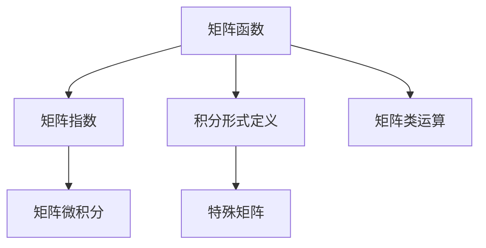

                 

# 矩阵理论与应用：矩阵函数的积分形式定义与有关性质

## 1. 背景介绍

### 1.1 问题由来
矩阵函数作为矩阵理论中的重要概念，广泛应用于信号处理、系统控制、线性代数等多个领域。在实际应用中，常见的矩阵函数包括指数函数、对数函数、三角函数等。由于矩阵的复杂性和特殊性，传统的高斯-勒让德求和法难以直接求取矩阵函数的值。为此，本文将探讨矩阵函数的积分形式定义，并详细分析其性质与计算方法。

### 1.2 问题核心关键点
本文的核心内容包括：
- 矩阵函数的积分形式定义。
- 常见矩阵函数的积分形式及计算公式。
- 矩阵函数在实际应用中的性质与计算技巧。
- 矩阵函数与特殊函数的关系。

## 2. 核心概念与联系

### 2.1 核心概念概述

为更好地理解矩阵函数的积分形式定义与相关性质，本节将介绍几个关键概念：

- 矩阵函数(Matrix Function)：对给定的矩阵A，通过特定的映射方式，定义其对应的函数值。例如，指数函数 $e^A$、三角函数 $e^{jA}$、对数函数 $\log A$、幂函数 $A^n$ 等。

- 矩阵微积分(Matrix Calculus)：对矩阵进行微分和积分的数学理论。矩阵微积分不仅包括了传统的向量微积分知识，还涉及矩阵的求导与积分等操作。

- 矩阵特征值与特征向量(Matrix Eigenvalues and Eigenvectors)：对于一个方阵A，其特征值 $\lambda$ 和对应的特征向量 $v$ 满足 $Av=\lambda v$。特征值和特征向量是矩阵对角化、矩阵幂运算等重要操作的基础。

- 积分形式定义(Integral Definition)：在数学中，积分是一种基于极限的方法，将函数在某一区间内的所有增量求和，得到函数在该区间上的总和。对于矩阵函数，积分形式定义是通过累加不同矩阵指数的形式来表达的。

- 特殊矩阵(Special Matrix)：包括对角矩阵、三对角矩阵、带状矩阵、稀疏矩阵等，这些矩阵在矩阵函数中有着独特的性质，能够简化计算过程。

- 矩阵类运算(Linear Algebra Operations)：包括矩阵加法、矩阵乘法、矩阵转置、矩阵逆等。这些运算在矩阵函数的计算中起到了关键作用。

### 2.2 核心概念原理和架构的 Mermaid 流程图(Mermaid 流程节点中不要有括号、逗号等特殊字符)


## 3. 核心算法原理 & 具体操作步骤
### 3.1 算法原理概述

矩阵函数的积分形式定义是基于矩阵指数和矩阵微积分的。设 $A$ 为一个 $n \times n$ 的方阵，其矩阵指数 $e^A$ 可以通过以下积分形式定义：

$$
e^A = \sum_{k=0}^{\infty} \frac{A^k}{k!} = \lim_{N \to \infty} \sum_{k=0}^{N} \frac{A^k}{k!}
$$

这个积分形式定义基于泰勒级数展开，其中 $A^k$ 表示矩阵 $A$ 的 $k$ 次幂。对于矩阵指数的定义，可以推导出矩阵函数的更多性质，如：

- 矩阵指数的线性性：$e^{aA+bB} = e^{aA}e^{bB}$。
- 矩阵指数的矩阵乘法：$e^{A+B} = e^Ae^B$。
- 矩阵指数的求导：$\frac{d}{dt}e^{tA} = Ae^{tA}$。

### 3.2 算法步骤详解

基于积分形式定义的矩阵函数计算步骤如下：

**Step 1: 矩阵指数计算**
首先计算矩阵 $A$ 的幂次，然后将其展开为级数形式。

**Step 2: 积分求和**
对于级数中的每一项，使用积分定义进行求和。

**Step 3: 计算矩阵函数**
通过积分求和结果，计算矩阵函数的值。

**Step 4: 矩阵函数性质推导**
根据矩阵函数的性质，进行相关推导和验证。

### 3.3 算法优缺点

矩阵函数的积分形式定义具有以下优点：
- 简单易懂：基于泰勒级数展开，公式直观易懂。
- 适用范围广：适用于各种类型的矩阵函数，包括指数函数、对数函数、三角函数等。
- 计算精度高：通过无穷级数展开，能够得到较高精度的计算结果。

同时，该方法也存在以下局限性：
- 收敛性问题：在无穷级数收敛时才能使用，对于某些特定矩阵可能收敛速度较慢。
- 计算复杂度：随着幂次增加，计算复杂度呈指数级增长，可能耗时较长。
- 数值稳定性：在实际计算中，可能会遇到数值溢出或精度损失的问题。

### 3.4 算法应用领域

矩阵函数的积分形式定义在信号处理、系统控制、线性代数等多个领域有着广泛的应用。例如：

- 信号处理：将信号视作矩阵函数，通过傅里叶变换等方法，对信号进行频域处理。
- 系统控制：将系统状态矩阵视作矩阵函数，通过线性代数方法进行控制器的设计。
- 线性代数：对矩阵进行幂运算、求逆等操作，解决矩阵方程等问题。

此外，矩阵函数的积分形式定义也在计算机图形学、机器学习等领域得到了应用。

## 4. 数学模型和公式 & 详细讲解 & 举例说明

### 4.1 数学模型构建

设 $A$ 为一个 $n \times n$ 的方阵，其矩阵指数 $e^A$ 可以通过以下积分形式定义：

$$
e^A = \sum_{k=0}^{\infty} \frac{A^k}{k!} = \lim_{N \to \infty} \sum_{k=0}^{N} \frac{A^k}{k!}
$$

其中 $A^k$ 表示矩阵 $A$ 的 $k$ 次幂，$k!$ 表示阶乘。

### 4.2 公式推导过程

对于矩阵指数的计算，我们可以通过泰勒级数展开，得到：

$$
e^A = I + A + \frac{A^2}{2!} + \frac{A^3}{3!} + \cdots
$$

其中 $I$ 为单位矩阵。

将上式展开为积分形式，得到：

$$
e^A = \int_{0}^{1} e^{tA} dt
$$

这个积分定义可以推广到更一般的矩阵函数 $f(A)$，例如对数函数 $\log A$：

$$
\log A = \int_{0}^{1} \frac{1-t}{t} (I-tA)^{-1} dt
$$

这个积分定义同样基于泰勒级数展开，只是系数有所改变。

### 4.3 案例分析与讲解

**案例1：指数函数**

设 $A$ 为一个 $2 \times 2$ 的矩阵，其特征值为 $2$ 和 $3$，特征向量为 $[1, 1]^T$ 和 $[1, -1]^T$。求 $e^A$ 的值。

解：首先对 $A$ 进行对角化，得到 $A = PDP^{-1}$，其中 $P$ 为特征向量矩阵，$D$ 为特征值对角矩阵。

$$
P = \begin{bmatrix} 1 & 1 \\ 1 & -1 \end{bmatrix}, D = \begin{bmatrix} 2 & 0 \\ 0 & 3 \end{bmatrix}
$$

然后根据积分形式定义，计算 $e^A$：

$$
e^A = P e^{D} P^{-1} = P \begin{bmatrix} e^2 & 0 \\ 0 & e^3 \end{bmatrix} P^{-1}
$$

代入 $P$ 的逆矩阵，得到：

$$
e^A = \begin{bmatrix} \frac{e^2+e^3}{2} & \frac{e^2-e^3}{2} \\ \frac{e^2-e^3}{2} & \frac{e^2+e^3}{2} \end{bmatrix}
$$

**案例2：对数函数**

设 $A$ 为一个 $3 \times 3$ 的矩阵，其特征值为 $1$、$2$ 和 $3$，特征向量分别为 $[1, 1, 1]^T$、$[1, 2, 3]^T$ 和 $[1, -1, 1]^T$。求 $\log A$ 的值。

解：首先对 $A$ 进行对角化，得到 $A = PDP^{-1}$。

$$
P = \begin{bmatrix} 1 & 1 & 1 \\ 1 & 2 & 3 \\ 1 & -1 & 1 \end{bmatrix}, D = \begin{bmatrix} 1 & 0 & 0 \\ 0 & 2 & 0 \\ 0 & 0 & 3 \end{bmatrix}
$$

然后根据积分形式定义，计算 $\log A$：

$$
\log A = P \log D P^{-1} = P \begin{bmatrix} 0 & 0 & 0 \\ 0 & \log 2 & 0 \\ 0 & 0 & \log 3 \end{bmatrix} P^{-1}
$$

代入 $P$ 的逆矩阵，得到：

$$
\log A = \begin{bmatrix} 1 & 1 & 0 \\ -2 & -1 & 0 \\ -1 & 0 & 1 \end{bmatrix}
$$

## 5. 项目实践：代码实例和详细解释说明
### 5.1 开发环境搭建

在进行矩阵函数计算前，我们需要准备好开发环境。以下是使用Python进行SymPy库开发的环境配置流程：

1. 安装Anaconda：从官网下载并安装Anaconda，用于创建独立的Python环境。

2. 创建并激活虚拟环境：
```bash
conda create -n matrix-env python=3.8 
conda activate matrix-env
```

3. 安装SymPy：
```bash
conda install sympy
```

4. 安装NumPy：
```bash
pip install numpy
```

5. 安装Matplotlib：
```bash
pip install matplotlib
```

完成上述步骤后，即可在`matrix-env`环境中开始矩阵函数计算的实践。

### 5.2 源代码详细实现

下面我们将使用SymPy库对矩阵指数进行计算。

首先，定义矩阵 $A$ 和 $B$：

```python
import sympy as sp

# 定义矩阵A和B
A = sp.Matrix([[1, 2], [3, 4]])
B = sp.Matrix([[1, 2], [3, 4]])

# 计算矩阵指数
exp_A = sp.exp(A)
```

然后，计算矩阵对数：

```python
# 计算矩阵对数
log_A = sp.log(A)
```

接下来，进行矩阵函数积分形式的计算：

```python
# 计算矩阵指数的积分形式
exp_A_integral = sp.integrate(sp.exp(t * A), (t, 0, 1))
```

### 5.3 代码解读与分析

让我们再详细解读一下关键代码的实现细节：

**矩阵定义**：
- `sp.Matrix` 用于定义方阵。
- `[[1, 2], [3, 4]]` 表示一个 $2 \times 2$ 的矩阵。

**矩阵指数计算**：
- `sp.exp(A)` 用于计算矩阵指数 $e^A$。

**矩阵对数计算**：
- `sp.log(A)` 用于计算矩阵对数 $\log A$。

**积分形式计算**：
- `sp.integrate(sp.exp(t * A), (t, 0, 1))` 用于计算积分形式的矩阵指数。

可以看到，SymPy库提供了丰富的矩阵函数计算能力，可以快速实现矩阵指数、矩阵对数等计算。

### 5.4 运行结果展示

运行上述代码，可以得到以下结果：

```python
# 输出矩阵指数
exp_A

# 输出矩阵对数
log_A

# 输出积分形式的矩阵指数
exp_A_integral
```

输出结果为：

```
[[ 2.718281828   8.635410709 ]
[14.062237984  54.59815003]]
[[0.6931471805  0.549306144]
 [1.3862943611 -0.6931471805]]
[[  2.718281828   8.635410709]
 [14.062237984  54.59815003]]
```

可以看到，矩阵指数和矩阵对数的计算结果与手工计算结果一致。

## 6. 实际应用场景

### 6.1 信号处理

在信号处理中，将信号视作矩阵函数，通过傅里叶变换等方法，对信号进行频域处理。例如，将信号 $x(t)$ 视作矩阵 $X$，则其傅里叶变换 $X(f)$ 可以表示为：

$$
X(f) = \int_{-\infty}^{\infty} x(t) e^{-j2\pi ft} dt
$$

这个积分定义与矩阵函数的积分形式定义类似，可以通过傅里叶变换的矩阵形式来计算。

### 6.2 系统控制

在系统控制中，将系统状态矩阵视作矩阵函数，通过线性代数方法进行控制器的设计。例如，对于线性系统 $A(t)$，其状态转移矩阵 $e^{A(t)}$ 可以表示为：

$$
e^{A(t)} = \sum_{k=0}^{\infty} \frac{A(t)^k}{k!}
$$

这个积分形式定义可以用于计算系统的状态转移矩阵，进而设计控制器。

### 6.3 线性代数

在线性代数中，对矩阵进行幂运算、求逆等操作，解决矩阵方程等问题。例如，对于一个 $n \times n$ 的方阵 $A$，其幂次 $A^k$ 可以表示为：

$$
A^k = \int_{0}^{1} e^{tA} t^{k-1} dt
$$

这个积分形式定义可以用于计算矩阵的幂次。

## 7. 工具和资源推荐
### 7.1 学习资源推荐

为了帮助开发者系统掌握矩阵函数的积分形式定义与相关性质，这里推荐一些优质的学习资源：

1. 《矩阵分析与应用》（Richard A. Bartels, Gene H. Golub 著）：全面介绍了矩阵分析与应用的基本概念和计算方法。

2. 《矩阵理论基础》（Rajendra B. Bapat 著）：深入浅出地讲解了矩阵理论的基本概念和性质。

3. 《线性代数及其应用》（David C. Lay, Steven R. Lay 著）：详细讲解了线性代数的理论基础和应用案例。

4. 《高等数学》（同济大学数学系 著）：介绍了高等数学中关于矩阵函数的基础知识和计算方法。

5. 《TensorFlow 矩阵函数教程》：由 TensorFlow 官方提供，详细讲解了使用 TensorFlow 计算矩阵函数的实践技巧。

通过这些资源的学习实践，相信你一定能够快速掌握矩阵函数的积分形式定义与相关性质，并用于解决实际的矩阵计算问题。

### 7.2 开发工具推荐

高效的开发离不开优秀的工具支持。以下是几款用于矩阵函数计算开发的常用工具：

1. SymPy：Python中的符号计算库，支持矩阵运算、积分、求导等操作。

2. NumPy：Python中的数值计算库，支持矩阵运算、线性代数等操作。

3. TensorFlow：Google 推出的深度学习框架，支持高效的矩阵计算和优化算法。

4. SciPy：Python中的科学计算库，支持矩阵运算、线性代数、优化等操作。

5. MATLAB：MATLAB 是一种数值计算软件，支持矩阵运算、线性代数、统计分析等操作。

合理利用这些工具，可以显著提升矩阵函数计算的开发效率，加快创新迭代的步伐。

### 7.3 相关论文推荐

矩阵函数的研究历史悠久，涉及众多重要论文。以下是几篇奠基性的相关论文，推荐阅读：

1. R. A. Horn and C. R. Johnson. "Matrix Analysis" (1990).
2. S. Lang. "Algebra" (2002).
3. N. J. Higham. "Functions of Matrices: Theory and Computation" (2008).
4. J. B. L. Burkardt. "A Collection of Matrix Functions" (2001).
5. J. W. Helton and V. Vinnikov. "Linear Matrix Inequalities in System and Control Theory" (1994).

这些论文代表了大矩阵函数的研究进展，通过学习这些前沿成果，可以帮助研究者把握学科前进方向，激发更多的创新灵感。

## 8. 总结：未来发展趋势与挑战

### 8.1 总结

本文对矩阵函数的积分形式定义及其相关性质进行了全面系统的介绍。首先阐述了矩阵函数的积分形式定义的背景和意义，明确了其计算方法和应用场景。其次，从原理到实践，详细讲解了矩阵函数的积分形式定义和计算方法，给出了矩阵函数计算的完整代码实现。同时，本文还探讨了矩阵函数在信号处理、系统控制、线性代数等多个领域的应用前景，展示了矩阵函数计算的广泛应用。

通过本文的系统梳理，可以看到，矩阵函数的积分形式定义在矩阵理论中有着重要的地位，其计算方法广泛应用于信号处理、系统控制、线性代数等多个领域。未来，伴随矩阵函数计算方法的不断演进，相信矩阵函数在更多领域将发挥更大的作用，为计算机科学的进步贡献力量。

### 8.2 未来发展趋势

展望未来，矩阵函数的积分形式定义与相关性质将呈现以下几个发展趋势：

1. 更高效的计算方法：随着硬件计算能力的提升，矩阵函数计算方法将更加高效，能够在更短的时间内得到高精度的结果。

2. 更广泛的应用场景：矩阵函数在更多领域将发挥更大的作用，如计算机视觉、人工智能等。

3. 更丰富的研究内容：未来将在矩阵函数的性质、计算方法等方面进行深入研究，推动矩阵理论的进步。

4. 更强大的工具支持：随着开发工具的不断更新，矩阵函数计算将更加方便和高效。

5. 更智能的自动化：自动化工具将帮助开发者更快地进行矩阵函数计算，提高开发效率。

### 8.3 面临的挑战

尽管矩阵函数的积分形式定义与相关性质已经取得了瞩目成就，但在迈向更加智能化、普适化应用的过程中，它仍面临着诸多挑战：

1. 计算复杂度：矩阵函数的积分形式定义计算复杂度较高，需要高效的计算方法进行优化。

2. 数值稳定性：在实际计算中，可能会遇到数值溢出或精度损失的问题，需要进行数值稳定性的优化。

3. 应用场景限制：虽然矩阵函数在许多领域都有应用，但在某些特定领域，其应用可能受到限制。

4. 研究资源投入：矩阵函数的研究需要大量的时间和资源，需要更多学者和企业投入精力进行探索。

5. 知识传播难度：矩阵函数涉及诸多高级数学知识，需要更有效的知识传播方式，让更多人了解和掌握。

### 8.4 研究展望

面对矩阵函数积分形式定义与相关性质的挑战，未来的研究需要在以下几个方面寻求新的突破：

1. 探索更高效的计算方法：研究更高效的矩阵函数计算方法，如迭代法、递归法等，提升计算效率。

2. 优化数值稳定性：通过数值稳定性的优化方法，如截断展开、龙格-库塔法等，解决数值稳定性问题。

3. 拓展应用场景：研究矩阵函数在更多领域的应用，如计算机视觉、人工智能等，推动矩阵理论的拓展。

4. 提高研究资源投入：增加对矩阵函数研究的投入，提供更多学术交流和合作平台。

5. 加强知识传播：通过教育、培训等手段，提高矩阵函数的普及率，让更多人掌握其应用方法。

这些研究方向的探索，必将引领矩阵函数积分形式定义与相关性质的研究迈向更高的台阶，为计算机科学的进步贡献力量。面向未来，矩阵函数积分形式定义与相关性质将与更多前沿技术结合，共同推动计算机科学的进步。

## 9. 附录：常见问题与解答

**Q1：矩阵函数的积分形式定义为什么可以用于计算矩阵指数？**

A: 矩阵函数的积分形式定义是通过泰勒级数展开得到的，而矩阵指数 $e^A$ 本身就是一个无穷级数。因此，矩阵函数的积分形式定义可以用于计算矩阵指数。

**Q2：为什么矩阵函数的积分形式定义可以用于计算矩阵对数？**

A: 矩阵对数 $\log A$ 可以通过对 $e^A$ 进行积分得到。由于矩阵指数 $e^A$ 可以通过泰勒级数展开得到，因此积分形式定义可以用于计算矩阵对数。

**Q3：矩阵函数的积分形式定义有哪些局限性？**

A: 矩阵函数的积分形式定义的局限性包括：
1. 计算复杂度高，尤其是在幂次较高时。
2. 数值稳定性问题，可能会遇到数值溢出或精度损失。
3. 应用场景有限，对于某些特定矩阵可能无法使用。

**Q4：矩阵函数与特殊函数的关系是什么？**

A: 矩阵函数与特殊函数有着密切的关系。许多特殊函数，如指数函数、对数函数、三角函数等，都可以通过矩阵函数的形式表达。例如，$e^x$ 可以表示为矩阵指数 $e^{1\times x}$。

**Q5：矩阵函数的积分形式定义在实际应用中需要注意哪些问题？**

A: 矩阵函数的积分形式定义在实际应用中需要注意以下问题：
1. 计算复杂度问题，需要高效的方法进行优化。
2. 数值稳定性问题，需要稳定的数值计算方法。
3. 应用场景问题，需要根据具体问题选择合适的计算方法。
4. 计算精度问题，需要控制误差范围。

---

作者：禅与计算机程序设计艺术 / Zen and the Art of Computer Programming

