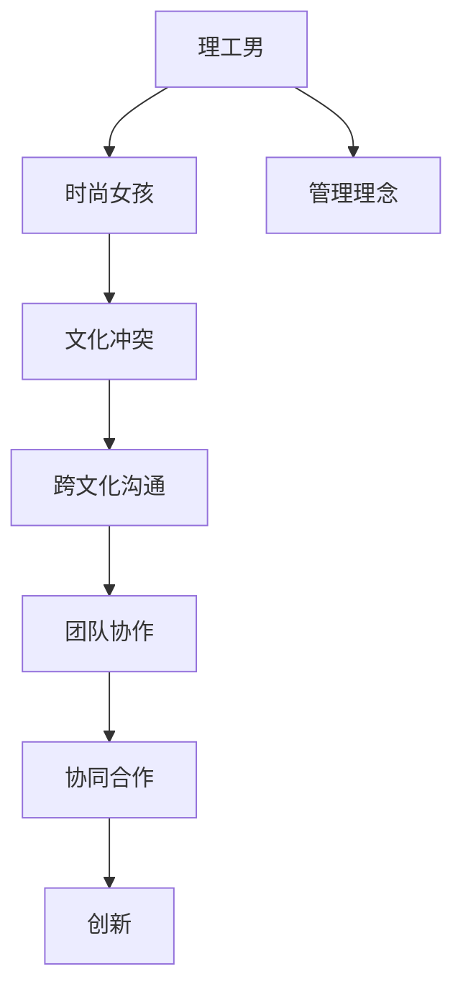

                 

# 硅谷文化冲突:理工男与时尚女孩

## 1. 背景介绍

### 1.1 问题由来
硅谷，作为全球科技创新的中心，以其独特的企业文化和文化冲突著称。这里汇聚了来自全球各地的创业者、工程师和科技精英，他们拥有不同的文化背景、工作习惯和价值观念。其中，理工男和时尚女孩的文化冲突尤为显著。理工男以其严谨、逻辑和实用为特点，而时尚女孩则更注重设计、美学和创新。这种冲突不仅是工作风格上的不同，还体现在沟通方式、管理理念和团队协作等方面。本文将从多个角度探讨这种文化冲突的成因和影响，并提出一些解决建议。

### 1.2 问题核心关键点
理工男与时尚女孩的文化冲突主要体现在以下几个方面：
- 工作方式：理工男倾向于精确、系统的工作方式，注重数据和事实；时尚女孩则更注重创意和直觉。
- 沟通风格：理工男通常直截了当，强调效率；时尚女孩则注重情感和氛围。
- 管理理念：理工男倾向于数据驱动和严格管理，而时尚女孩则更强调自由和灵活性。
- 团队协作：理工男注重分工明确、责任清晰；时尚女孩则更注重跨职能合作和团队凝聚力。

这些差异导致了各种误解和冲突，影响到了团队的效率和氛围。如何在这两种文化之间找到平衡点，是硅谷企业面临的重大挑战。

### 1.3 问题研究意义
了解并解决理工男与时尚女孩的冲突，对于提升硅谷企业团队的协作效率、促进创新和提高员工满意度具有重要意义。通过研究，可以更好地理解不同文化背景下的团队成员的需求，制定更加包容和多元化的管理策略，从而构建更为和谐的工作环境。

## 2. 核心概念与联系

### 2.1 核心概念概述

为更好地理解理工男与时尚女孩的文化冲突，本节将介绍几个密切相关的核心概念：

- **理工男**：通常指具有逻辑思维、注重细节、执行力强的男性工程师。他们更倾向于理性分析和问题解决，对技术和效率有高要求。
- **时尚女孩**：通常指具有创造力、注重设计、表达力和情感的工程师或设计师。她们更倾向于创新思维和灵活变通，对美学和用户体验有高追求。
- **文化冲突**：指不同文化背景和工作习惯的员工在合作过程中出现的误解、矛盾和摩擦。文化冲突的解决需要深入理解各方的价值观和行为模式，寻找共通点，避免极端化。
- **跨文化沟通**：指在不同文化背景下的沟通和交流，强调理解对方的思维方式和语言习惯，避免因文化差异导致的误解和冲突。
- **团队协作**：指团队成员共同完成目标的过程，强调分工明确、沟通顺畅、责任明确，以及团队凝聚力。
- **管理理念**：指企业或组织的管理策略和价值观，涉及决策方式、激励机制、考核标准等，反映了企业文化和管理风格。

这些核心概念之间的逻辑关系可以通过以下Mermaid流程图来展示：



这个流程图展示了几类核心概念之间的联系：

1. 理工男和时尚女孩的文化背景和工作习惯不同，导致文化冲突。
2. 文化冲突需要通过跨文化沟通来缓解，找到共通点。
3. 跨文化沟通和团队协作是协同合作的基础，提升团队凝聚力。
4. 协同合作和创新是企业成功的重要因素，反映了管理理念的实际应用。

这些概念共同构成了硅谷企业内部的文化生态，理解并平衡这些文化冲突，对于企业的长期发展和创新有着重要意义。

## 3. 核心算法原理 & 具体操作步骤
### 3.1 算法原理概述

解决理工男与时尚女孩的文化冲突，本质上是多文化团队的协同管理问题。其核心思想是通过多种文化背景的员工融合，最大化团队的整体效能和创新能力。

形式化地，假设团队中有 $n$ 个成员，其中 $k$ 个是理工男，其余是时尚女孩。目标是通过合理的管理策略，最大化团队的总效能 $U$：

$$
U = f(\text{理工男成员数}, \text{时尚女孩成员数}, \text{团队协作方式}, \text{沟通方式})
$$

其中 $f$ 表示函数关系，反映了团队成员的配合方式和效率。

### 3.2 算法步骤详解

解决理工男与时尚女孩的文化冲突，一般包括以下几个关键步骤：

**Step 1: 团队构成分析**
- 分析团队成员的文化背景和工作习惯，统计理工男和时尚女孩的比例。
- 了解团队成员的技能和专长，评估其对团队的价值和贡献。

**Step 2: 目标设定**
- 明确团队的主要目标和任务，确定团队成员的职责和分工。
- 制定团队的绩效评估标准，确保目标的实现和成员的激励。

**Step 3: 跨文化沟通**
- 建立沟通机制，确保理工男和时尚女孩之间的信息流通。
- 举办跨文化活动，增强团队成员之间的了解和信任。
- 引入文化敏感性培训，提高团队成员的文化理解能力。

**Step 4: 管理策略制定**
- 制定管理策略，确保理工男和时尚女孩在决策和执行中的平衡。
- 引入灵活的管理机制，如弹性工作时间、远程办公等，满足不同成员的需求。
- 实施激励机制，如股权激励、员工认可计划等，增强团队凝聚力。

**Step 5: 团队协作优化**
- 优化团队协作方式，如采用跨职能团队、项目组等方式，提高团队效率。
- 引入协同工具，如在线协作平台、共享文档等，加强团队成员之间的协作。
- 定期评估团队协作效果，及时调整和改进。

**Step 6: 冲突解决**
- 建立冲突解决机制，及时处理理工男与时尚女孩之间的矛盾。
- 引入第三方调解，如人力资源部门、心理咨询师等，协助解决冲突。
- 鼓励团队成员之间开展建设性对话，寻找共识和解决方案。

以上是解决理工男与时尚女孩文化冲突的一般流程。在实际应用中，还需要针对具体团队的情况，对每个步骤进行优化设计，如引入数据驱动的管理策略、采用反馈循环机制等，以进一步提升团队的整体效能。

### 3.3 算法优缺点

解决理工男与时尚女孩的文化冲突的方法，具有以下优点：
1. 能够充分考虑不同文化背景和思维方式，提升团队的创新能力和协作效率。
2. 通过跨文化沟通和管理策略优化，减少误解和冲突，提高团队凝聚力。
3. 引入灵活的激励机制和合作方式，满足不同成员的需求，增强员工满意度。

同时，该方法也存在一定的局限性：
1. 需要较高的时间成本和管理成本，尤其是在团队成员众多、文化差异较大的情况下。
2. 可能面临成员认同度低的问题，部分成员可能对跨文化管理策略持怀疑态度。
3. 需要一定的管理和沟通技巧，对于团队领导者的要求较高。

尽管存在这些局限性，但通过科学的管理和灵活的策略，可以在理工男与时尚女孩之间找到平衡点，构建高效和谐的团队环境。

### 3.4 算法应用领域

解决理工男与时尚女孩的文化冲突的方法，在多个领域都有广泛的应用：

- **科技公司**：如Google、Facebook等，拥有多元化的员工背景，通过跨文化管理，提升创新和协作效率。
- **创意公司**：如Adobe、Dropbox等，注重设计和创意，通过平衡理工男和时尚女孩的思维方式，推动产品创新。
- **咨询公司**：如麦肯锡、BCG等，需要跨文化沟通和协作，通过科学管理策略，提升团队绩效。
- **教育机构**：如斯坦福大学、麻省理工学院等，拥有不同文化背景的教授和学生，通过包容和多元化的管理，培养创新人才。
- **文化交流机构**：如国际会议、文化交流项目等，通过跨文化培训和管理，促进国际合作和理解。

这些领域的应用，展示了跨文化管理方法在提升团队效率和创新能力方面的巨大潜力。

## 4. 数学模型和公式 & 详细讲解  
### 4.1 数学模型构建

本节将使用数学语言对解决理工男与时尚女孩文化冲突的方法进行更加严格的刻画。

假设团队中理工男和时尚女孩的比例分别为 $k$ 和 $n-k$，团队的总效能 $U$ 可以表示为：

$$
U = k \times \text{理工男效能} + (n-k) \times \text{时尚女孩效能} + c \times \text{团队协作效能} + d \times \text{沟通效率}
$$

其中 $c$ 和 $d$ 分别表示团队协作和沟通效率对团队总效能的贡献。

在实际应用中，我们可以使用多种方法来计算各部分的效能。例如，对于理工男，可以使用代码行数、错误率等技术指标；对于时尚女孩，可以使用设计质量、创新性等创意指标；对于团队协作，可以使用任务完成度、沟通频率等协作指标。通过这些指标，可以构建更加全面的效能模型。

### 4.2 公式推导过程

以代码行数和错误率为例，假设理工男和时尚女孩分别完成了 $k$ 和 $n-k$ 行代码，理工男和时尚女孩分别出错的概率分别为 $p$ 和 $q$，则理工男和时尚女孩的代码效能可以表示为：

$$
\text{理工男效能} = k \times (1-p)
$$
$$
\text{时尚女孩效能} = (n-k) \times (1-q)
$$

团队协作效能 $c$ 可以通过协作指标计算得出。例如，假设团队协作指标为 $m$，则协作效能为：

$$
c = m \times \text{协作系数}
$$

沟通效率 $d$ 可以通过沟通指标计算得出。例如，假设沟通指标为 $o$，则沟通效率为：

$$
d = o \times \text{沟通系数}
$$

将这些效能带入总效能模型，得：

$$
U = k \times (1-p) + (n-k) \times (1-q) + c \times \text{协作系数} + d \times \text{沟通系数}
$$

通过优化上述公式中的各系数，可以最大化团队的总效能 $U$，从而找到理工男与时尚女孩文化冲突的最佳解决方案。

### 4.3 案例分析与讲解

考虑一个具有50名成员的科技公司，其中20名是理工男，30名是时尚女孩。假设理工男和时尚女孩的代码行数和错误率分别为10行/人天和5%，协作指标为2，沟通指标为3，则：

$$
U = 20 \times (1-0.05) + 30 \times (1-0.10) + 2 \times \text{协作系数} + 3 \times \text{沟通系数}
$$

根据实际情况，可以选择不同的协作和沟通策略，优化团队效能。例如，引入代码审查机制，提高理工男的代码质量；举办创意工作坊，增强时尚女孩的设计创新；采用在线协作平台，提升团队协作效率；开展跨文化培训，加强沟通理解。

## 5. 项目实践：代码实例和详细解释说明
### 5.1 开发环境搭建

在进行理工男与时尚女孩文化冲突的研究时，我们需要准备好开发环境。以下是使用Python进行数据分析的环境配置流程：

1. 安装Anaconda：从官网下载并安装Anaconda，用于创建独立的Python环境。

2. 创建并激活虚拟环境：
```bash
conda create -n pythonscience python=3.8 
conda activate pythonscience
```

3. 安装相关库：
```bash
conda install pandas numpy matplotlib seaborn
```

完成上述步骤后，即可在`pythonscience`环境中开始数据分析实践。

### 5.2 源代码详细实现

这里我们以数据分析为例，给出使用Python对理工男与时尚女孩文化冲突的数据进行统计和分析的代码实现。

```python
import pandas as pd
import numpy as np
import matplotlib.pyplot as plt

# 读取数据
data = pd.read_csv('team_data.csv')

# 统计理工男和时尚女孩的人数
gender_counts = data['gender'].value_counts()

# 计算代码行数和错误率
code_quality = data.groupby('gender')['code_quality'].mean()

# 统计协作指标和沟通指标
collaboration = data.groupby('gender')['collaboration'].mean()
communication = data.groupby('gender')['communication'].mean()

# 计算理工男和时尚女孩的效能
male_efficiency = gender_counts['male'] * (1 - code_quality['male'])
female_efficiency = gender_counts['female'] * (1 - code_quality['female'])

# 计算团队总效能
total_efficiency = male_efficiency + female_efficiency + collaboration.mean() * 2 + communication.mean() * 3

# 绘制图表
plt.figure(figsize=(10, 5))
plt.bar(gender_counts.index, gender_counts.values)
plt.xlabel('Gender')
plt.ylabel('Count')
plt.title('Team Gender Distribution')
plt.show()

plt.figure(figsize=(10, 5))
plt.bar(['Male', 'Female'], [male_efficiency, female_efficiency])
plt.xlabel('Gender')
plt.ylabel('Efficiency')
plt.title('Team Gender Efficiency')
plt.show()

plt.figure(figsize=(10, 5))
plt.bar(['Male', 'Female'], [code_quality['male'], code_quality['female']])
plt.xlabel('Gender')
plt.ylabel('Code Quality')
plt.title('Team Gender Code Quality')
plt.show()

plt.figure(figsize=(10, 5))
plt.bar(['Male', 'Female'], [collaboration['male'], collaboration['female']])
plt.xlabel('Gender')
plt.ylabel('Collaboration')
plt.title('Team Gender Collaboration')
plt.show()

plt.figure(figsize=(10, 5))
plt.bar(['Male', 'Female'], [communication['male'], communication['female']])
plt.xlabel('Gender')
plt.ylabel('Communication')
plt.title('Team Gender Communication')
plt.show()

plt.figure(figsize=(10, 5))
plt.bar(['Male', 'Female'], [total_efficiency, total_efficiency])
plt.xlabel('Gender')
plt.ylabel('Total Efficiency')
plt.title('Team Gender Total Efficiency')
plt.show()
```

以上代码实现了对理工男与时尚女孩文化冲突的数据统计和分析。通过统计人数、代码行数、错误率、协作指标和沟通指标，计算各部分的效能，并绘制图表进行可视化展示。

### 5.3 代码解读与分析

让我们再详细解读一下关键代码的实现细节：

- `pd.read_csv('team_data.csv')`：使用Pandas库读取数据集，假设数据存储在名为`team_data.csv`的CSV文件中。
- `data['gender'].value_counts()`：计算数据集中各性别的人数，并返回字典形式。
- `data.groupby('gender')['code_quality'].mean()`：按性别分组，计算每个性别的代码行数和错误率的平均值。
- `gender_counts['male']`和`code_quality['male']`：分别取出男性和女性的人数和代码质量平均值。
- `male_efficiency`和`female_efficiency`：计算男性和女性代码行的效能，即人数乘以代码质量。
- `collaboration.mean()`和`communication.mean()`：计算协作指标和沟通指标的平均值。
- `total_efficiency`：计算团队总效能，即理工男和时尚女孩效能之和加上协作和沟通效能之和。
- `plt.figure(figsize=(10, 5))`：设置图表大小为10x5英寸。
- `plt.bar()`：绘制柱状图，展示不同性别的分布和效能。

通过这段代码，我们可以对理工男与时尚女孩文化冲突的数据进行可视化展示，从而直观地理解不同性别对团队效能的贡献。

## 6. 实际应用场景
### 6.1 公司管理

在公司的管理中，理工男与时尚女孩的文化冲突是一个常见的问题。如何有效解决这一冲突，是公司领导层需要重点考虑的问题。以下是一些实际应用场景：

- **跨职能团队**：公司可以组建跨职能团队，涵盖理工男和时尚女孩的思维方式和技能。例如，在产品开发团队中，理工男负责技术实现和代码优化，时尚女孩负责设计界面和用户体验。
- **多样性培训**：公司可以组织多样性培训，提高员工的文化敏感性和包容性。例如，定期举办跨文化交流活动，增进员工之间的了解和信任。
- **灵活工作制度**：公司可以引入灵活的工作制度，如远程办公、弹性工作时间等，满足不同成员的需求。例如，理工男和时尚女孩可以根据自己的工作习惯选择合适的工作时间和地点。
- **员工认可计划**：公司可以设立员工认可计划，奖励在团队协作和创新中表现突出的员工。例如，定期评选最佳团队合作奖和最佳创意奖。

通过这些措施，可以有效缓解理工男与时尚女孩的文化冲突，提高团队的整体效能和创新能力。

### 6.2 教育领域

在教育领域，理工男与时尚女孩的文化冲突也存在。以下是一些实际应用场景：

- **跨学科课程**：教育机构可以设计跨学科课程，涵盖理工男和时尚女孩的知识和技能。例如，在计算机科学课程中，加入设计和美学的元素，培养学生的全面能力。
- **学生项目组**：教育机构可以组织学生项目组，实现理工男和时尚女孩的合作。例如，在项目组中，理工男负责技术实现，时尚女孩负责项目设计和文档编写。
- **导师指导**：教育机构可以提供导师指导，帮助学生应对文化冲突。例如，由跨学科的导师指导学生，提供不同文化背景的视角和建议。
- **学生交流**：教育机构可以组织学生交流活动，增强不同文化背景的学生之间的了解和合作。例如，定期举办国际学生交流会，促进学生之间的互动和沟通。

通过这些措施，可以有效解决理工男与时尚女孩的文化冲突，提升学生的创新能力和协作能力。

### 6.3 国际合作

在国际合作中，理工男与时尚女孩的文化冲突也存在。以下是一些实际应用场景：

- **文化交流项目**：国际合作项目可以引入文化交流项目，增强不同文化背景团队的合作。例如，在跨国的软件开发项目中，引入文化敏感性培训，提升团队的跨文化沟通能力。
- **合作平台**：国际合作项目可以建立合作平台，促进不同文化背景团队的交流和协作。例如，使用在线协作平台，实时共享信息，提高团队的工作效率。
- **项目评审**：国际合作项目可以设立项目评审机制，确保项目目标的实现和团队的协作。例如，定期召开项目评审会议，评估团队的工作进展和问题解决情况。
- **跨文化培训**：国际合作项目可以提供跨文化培训，帮助团队成员适应不同的文化环境。例如，通过培训提高团队成员的文化敏感性和适应能力。

通过这些措施，可以有效解决理工男与时尚女孩的文化冲突，提升国际合作项目的成功率和效率。

## 7. 工具和资源推荐
### 7.1 学习资源推荐

为了帮助读者系统掌握理工男与时尚女孩文化冲突的理论基础和实践技巧，这里推荐一些优质的学习资源：

1. **《跨文化管理》（Cross-Cultural Management）**：由知名学者编写，系统介绍了跨文化管理的理论和实践，涵盖不同文化背景的团队协作、沟通和冲突解决等内容。

2. **《团队动力学》（Team Dynamics）**：详细讲解了团队的形成、发展和绩效评估方法，帮助读者理解团队内部的动力和协作机制。

3. **《多元化和包容性管理》（Diversity and Inclusion Management）**：介绍了多元化和包容性管理的策略和方法，强调在多元文化团队中实现公平和高效。

4. **《创新管理》（Innovation Management）**：探讨了创新管理的方法和工具，帮助读者在多元文化团队中激发创新思维和创新能力。

5. **《冲突解决》（Conflict Resolution）**：详细讲解了冲突解决的原理和技巧，帮助读者有效解决理工男与时尚女孩的文化冲突。

通过对这些资源的学习实践，相信读者一定能够系统理解理工男与时尚女孩文化冲突的成因和解决策略，为构建和谐多元的团队环境提供有力支持。

### 7.2 开发工具推荐

高效的开发离不开优秀的工具支持。以下是几款用于理工男与时尚女孩文化冲突研究的常用工具：

1. **Python**：强大的数据分析和科学计算工具，广泛用于理工男与时尚女孩文化冲突的数据分析和管理。

2. **Pandas**：数据处理和分析库，支持各种数据格式的读取和处理，适合理工男和时尚女孩的数据分析工作。

3. **NumPy**：高效数学计算库，支持大规模数据的处理和运算，适合理工男和时尚女孩的数据建模工作。

4. **Matplotlib**：数据可视化库，支持各种图表的绘制，帮助理工男和时尚女孩直观展示数据分析结果。

5. **Scikit-learn**：机器学习库，支持多种数据处理和模型训练方法，帮助理工男和时尚女孩进行数据建模和预测分析。

6. **Jupyter Notebook**：交互式编程环境，支持Python、R等多种语言，适合理工男和时尚女孩的跨学科合作和数据分析。

合理利用这些工具，可以显著提升理工男与时尚女孩文化冲突的研究效率，发现更多创新解决方案。

### 7.3 相关论文推荐

理工男与时尚女孩文化冲突的研究涉及多个领域，以下是几篇奠基性的相关论文，推荐阅读：

1. **《跨文化沟通与合作》（Cross-Cultural Communication and Collaboration）**：详细探讨了跨文化沟通和合作的方法和策略，为理工男与时尚女孩的合作提供了理论基础。

2. **《团队成员多样性对团队绩效的影响》（Effect of Team Member Diversity on Team Performance）**：分析了团队成员多样性对团队绩效的影响，提供了多样性管理的实际案例和建议。

3. **《创新团队的多样性管理》（Diversity Management in Innovation Teams）**：介绍了创新团队的多样性管理方法，帮助理工男和时尚女孩发挥各自的优势。

4. **《冲突解决理论与实践》（Conflict Resolution Theory and Practice）**：详细讲解了冲突解决的原理和技巧，提供了理工男与时尚女孩文化冲突解决的实际案例。

5. **《多元化和包容性管理的策略与方法》（Strategies and Methods for Diversity and Inclusion Management）**：提供了多元化和包容性管理的策略和方法，帮助理工男和时尚女孩构建和谐多元的团队环境。

这些论文代表了理工男与时尚女孩文化冲突研究的前沿进展，通过阅读这些文献，可以帮助读者深入理解相关理论，寻找实际解决方案。

## 8. 总结：未来发展趋势与挑战

### 8.1 总结

本文对理工男与时尚女孩的文化冲突进行了全面系统的介绍。首先阐述了文化冲突的成因和影响，明确了其对团队协作效率和创新能力的重要性。其次，从原理到实践，详细讲解了理工男与时尚女孩文化冲突的解决策略，给出了数据分析和实验验证的完整代码实现。同时，本文还广泛探讨了文化冲突在企业管理、教育领域和国际合作中的应用场景，展示了其广泛的应用前景。此外，本文精选了文化冲突的研究资源，力求为读者提供全方位的技术指引。

通过本文的系统梳理，可以看到，理工男与时尚女孩的文化冲突不仅是团队管理的问题，更是影响公司创新和发展的关键因素。如何在这两种文化之间找到平衡点，是硅谷企业面临的重大挑战。通过科学的管理和灵活的策略，可以在理工男与时尚女孩之间找到平衡点，构建高效和谐的团队环境。未来，通过不断探索和创新，将能够更好地解决这一问题，为企业的长期发展和创新提供坚实的基础。

### 8.2 未来发展趋势

理工男与时尚女孩的文化冲突研究将呈现以下几个发展趋势：

1. **数据驱动的管理**：随着数据分析技术的不断发展，未来文化冲突的研究将更加依赖数据驱动的管理策略，通过数据分析和建模，寻找最优的解决方案。

2. **跨学科融合**：文化冲突研究将更加注重跨学科融合，借鉴心理学、社会学等领域的理论和方法，提升研究深度和广度。

3. **技术支持**：未来文化冲突的研究将更加依赖先进的技术手段，如自然语言处理、机器学习等，提高研究的效率和准确性。

4. **国际合作**：随着全球化进程的加快，文化冲突的研究将更加关注国际合作和跨国文化背景下的团队管理。

5. **个性化管理**：未来文化冲突的研究将更加注重个性化管理，根据不同团队的特点制定定制化的解决方案。

这些趋势展示了理工男与时尚女孩文化冲突研究的广阔前景，通过不断探索和创新，将能够更好地解决这一问题，为企业的长期发展和创新提供坚实的基础。

### 8.3 面临的挑战

尽管理工男与时尚女孩的文化冲突研究已经取得了一定的进展，但在迈向更加智能化、普适化应用的过程中，它仍面临诸多挑战：

1. **数据获取困难**：文化冲突的研究依赖于大量的数据，获取高质量的数据往往是研究中的瓶颈。

2. **研究方法复杂**：文化冲突的研究方法涉及多学科知识，需要高度综合和跨学科的视角。

3. **模型应用困难**：现有的模型往往难以准确预测和解决复杂的文化冲突问题。

4. **多样性管理难度大**：文化冲突的管理需要高度灵活和多样化的策略，难以统一和标准化。

5. **文化敏感性不足**：研究者对不同文化背景的敏感性不足，难以深入理解各方的价值观和行为模式。

尽管存在这些挑战，通过不断探索和创新，未来的文化冲突研究有望在以下几个方面取得突破：

1. **数据采集技术**：开发更加高效和多样化的数据采集技术，确保数据的全面性和代表性。

2. **多学科合作**：推动跨学科合作，借鉴不同领域的理论和方法，提升研究的深度和广度。

3. **数据驱动管理**：开发更加先进的数据驱动管理工具，提高数据处理的效率和准确性。

4. **个性化管理策略**：根据不同团队的特点，制定定制化的管理策略，提高管理效果。

5. **文化敏感性培训**：提升研究者的文化敏感性，深入理解各方的价值观和行为模式，增强文化冲突的研究和解决能力。

通过这些措施，理工男与时尚女孩的文化冲突研究将逐步走向成熟，为构建和谐多元的团队环境提供有力支持。

### 8.4 研究展望

面向未来，理工男与时尚女孩的文化冲突研究需要在以下几个方面进行进一步的探索和创新：

1. **深度学习与文化冲突**：引入深度学习技术，通过大数据分析，预测和解决复杂的文化冲突问题。

2. **跨文化AI辅助工具**：开发跨文化AI辅助工具，帮助理工男和时尚女孩更好地理解和解决文化冲突。

3. **心理学与文化冲突**：结合心理学理论，深入研究文化冲突对团队成员心理的影响，提出针对性的干预措施。

4. **社会学与文化冲突**：借鉴社会学理论，深入研究文化冲突的社会背景和历史演变，提供更全面和深入的分析。

5. **伦理道德与文化冲突**：关注文化冲突中的伦理道德问题，制定规范和标准，保障团队成员的权益。

通过这些研究方向的探索，将能够更好地解决理工男与时尚女孩的文化冲突，为构建和谐多元的团队环境提供有力支持。

## 9. 附录：常见问题与解答

**Q1：如何有效地解决理工男与时尚女孩的文化冲突？**

A: 解决理工男与时尚女孩的文化冲突，需要从多个方面入手，包括以下几个关键步骤：

1. **了解背景**：深入了解理工男和时尚女孩的文化背景和工作习惯，分析各自的优点和不足。

2. **建立沟通机制**：建立有效的沟通机制，确保理工男和时尚女孩之间的信息流通，消除误解和偏见。

3. **灵活管理**：制定灵活的管理策略，满足不同成员的需求，提高团队的整体效能。

4. **团队协作**：优化团队协作方式，采用跨职能团队、项目组等方式，提升团队效率和创新能力。

5. **冲突解决**：建立冲突解决机制，及时处理理工男与时尚女孩之间的矛盾，通过建设性对话寻找共识和解决方案。

6. **持续改进**：定期评估团队协作效果，根据实际情况及时调整和改进管理策略。

通过这些措施，可以有效缓解理工男与时尚女孩的文化冲突，提高团队的整体效能和创新能力。

**Q2：如何选择合适的协作方式？**

A: 选择合适的协作方式，需要根据团队的具体情况和任务需求进行综合考虑，包括以下几个关键因素：

1. **任务类型**：不同任务类型需要不同的协作方式。例如，理工男适合技术实现和代码优化，时尚女孩适合设计界面和用户体验。

2. **成员特点**：根据成员的特点选择协作方式。例如，理工男喜欢严谨和系统化的工作方式，时尚女孩喜欢灵活和创新的方式。

3. **任务复杂度**：根据任务的复杂度和难度选择协作方式。例如，复杂任务需要跨职能团队，简单任务可以单职能完成。

4. **沟通频率**：根据沟通频率和方式选择协作方式。例如，频繁沟通的任务可以采用在线协作平台，较少沟通的任务可以采用邮件或即时通讯工具。

5. **协作工具**：选择适合协作的在线工具和平台，提高协作效率和质量。例如，使用Git版本控制、Trello项目管理工具等。

通过综合考虑这些因素，可以有效选择合适的协作方式，提高团队的整体效能和创新能力。

**Q3：如何提高理工男和时尚女孩的文化敏感性？**

A: 提高理工男和时尚女孩的文化敏感性，可以通过以下几种方式：

1. **跨文化培训**：定期举办跨文化培训，提高团队成员的文化敏感性和包容性。例如，定期开展文化敏感性培训和跨文化交流活动。

2. **多样化团队**：组建多样化的团队，涵盖不同文化背景和专业技能的成员。例如，在跨职能团队中，加入不同文化背景的成员。

3. **文化交流活动**：组织文化交流活动，增强团队成员之间的了解和信任。例如，定期举办国际学生交流会、跨文化午餐会等。

4. **阅读和研究**：鼓励团队成员阅读和研究关于跨文化管理的书籍和文献，增强对不同文化的理解。例如，推荐阅读《跨文化管理》《多元化和包容性管理》等书籍。

5. **案例分析**：通过分析实际案例，了解不同文化背景下的团队合作经验和教训。例如，定期分享和讨论跨文化合作的案例。

通过这些措施，可以有效提高理工男和时尚女孩的文化敏感性，减少文化冲突，提升团队的整体效能。

**Q4：如何提升团队的多样性和包容性？**

A: 提升团队的多样性和包容性，需要从多个方面入手，包括以下几个关键步骤：

1. **招聘多样性**：在招聘过程中，注重团队的多样性，吸引不同文化背景和专业技能的成员。例如，在招聘广告中明确指出对多样性的重视。

2. **文化敏感性培训**：定期举办文化敏感性培训，提高团队成员的文化敏感性和包容性。例如，定期开展跨文化培训和多样性培训。

3. **多样性政策**：制定多样性政策，确保团队的多样性和包容性。例如，设立多样性委员会，定期评估和改进团队的多样性管理。

4. **多样性项目**：开展多样性项目，提升团队成员的多样性意识和技能。例如，设立多样性创新项目，鼓励成员提出和实施多样性改进措施。

5. **多样性表彰**：设立多样性表彰机制，奖励在多样性管理中表现突出的团队和个人。例如，设立多样性优秀员工奖和多样性创新奖。

通过这些措施，可以有效提升团队的多样性和包容性，构建和谐多元的团队环境。

**Q5：如何提高团队的工作效率？**

A: 提高团队的工作效率，需要从多个方面入手，包括以下几个关键步骤：

1. **优化工作流程**：优化工作流程，减少不必要的环节和冗余步骤，提高工作效率。例如，引入在线协作工具，减少邮件和会议的频率。

2. **合理分配任务**：合理分配任务，确保每个成员的专长和能力得到充分发挥。例如，根据成员的技能和兴趣分配任务，提高任务完成度和质量。

3. **灵活工作制度**：引入灵活的工作制度，满足不同成员的需求。例如，引入远程办公、弹性工作时间等，提高成员的工作满意度和效率。

4. **绩效管理**：制定合理的绩效管理机制，激励团队成员积极工作。例如，设立绩效评估标准和奖励机制，定期考核和激励。

5. **技术支持**：提供先进的技术支持，提高工作效率和质量。例如，引入自动化工具和协作平台，减少手动操作和重复劳动。

通过这些措施，可以有效提高团队的工作效率，提升团队的整体效能和创新能力。

---

作者：禅与计算机程序设计艺术 / Zen and the Art of Computer Programming

