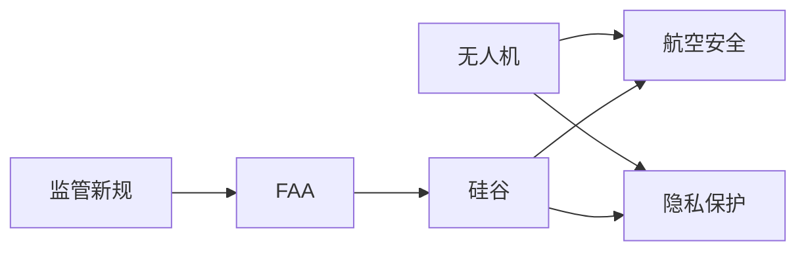

                 

# 硅谷无人机监管新规:保障航空安全

> 关键词：硅谷,无人机,监管新规,航空安全

## 1. 背景介绍

近年来，无人机（UAV）技术迅速发展，带来了一系列便利和创新应用，但也引发了诸多安全和隐私问题。特别是在硅谷这样的科技中心，无人机频繁出现的飞行事件和违规操作导致航空安全风险急剧上升。为保障公众安全和维护空中交通秩序，美国联邦航空管理局（FAA）出台了一系列无人机监管新规，引入了更为严格的安全和隐私管理措施。本文将详细解读硅谷无人机监管新规，探讨其在保障航空安全方面的具体措施和实施效果。

## 2. 核心概念与联系

### 2.1 核心概念概述

在讨论硅谷无人机监管新规前，有必要明确一些关键概念：

- **无人机（UAV）**：指无人驾驶的飞行器，通常用于空中拍摄、地理测绘、物流配送等场景。
- **航空安全**：指确保航空器（包括无人机）在运行过程中的安全，防止事故发生。
- **监管新规**：指政府或行业协会为规范无人机应用，制定的一系列规则和标准。
- **隐私保护**：指在无人机应用中，对个人信息和隐私的严格保护，防止数据泄露和滥用。

这些概念之间存在密切联系。航空安全和隐私保护是无人机应用中必须重点考虑的两个维度，而监管新规的制定和实施，正是为了平衡这些维度的需求，确保无人机在可控范围内安全运行。

### 2.2 核心概念原理和架构的 Mermaid 流程图



这个流程图展示了无人机、航空安全、隐私保护、监管新规之间的联系，以及FAA和硅谷在这些关系中的角色。无人机必须同时保障航空安全和隐私保护，而FAA负责制定监管新规，硅谷则是应用这些规则的典型区域。

## 3. 核心算法原理 & 具体操作步骤

### 3.1 算法原理概述

硅谷无人机监管新规的制定和实施，基于一系列综合性的算法和策略。这些算法主要包括以下几个方面：

- **空域规划**：对无人机飞行区域进行科学规划，避免与商业航空器和低空飞行器的冲突。
- **飞行时间限制**：对无人机的飞行时间进行限制，防止夜间或特殊天气条件下进行飞行。
- **飞行高度限制**：对无人机的飞行高度进行限制，确保与大型航空器保持安全距离。
- **空域监控**：利用先进的监控技术，如雷达、GPS等，对无人机飞行进行实时监控和跟踪。
- **违规处罚**：对于违反规定的无人机，采取警告、罚款、禁止飞行等处罚措施。

### 3.2 算法步骤详解

硅谷无人机监管新规的具体操作步骤如下：

1. **数据收集与分析**：通过收集无人机飞行数据，分析飞行频率、路线、高度等关键参数。
2. **空域划定与规划**：基于飞行数据和地形信息，划定无人机安全飞行区域，并制定飞行路线和高度规则。
3. **飞行监控系统部署**：部署雷达、GPS等监控设备，实时监测无人机飞行状态。
4. **违规预警与处罚**：对违规行为进行预警，并通过罚款、禁止飞行等措施，确保飞行安全。
5. **公众教育与培训**：通过公众教育和培训，提高无人机操作人员的法律意识和安全意识。

### 3.3 算法优缺点

#### 优点：

1. **提高航空安全性**：通过科学规划和实时监控，有效降低无人机与大型航空器的碰撞风险，保障公众安全。
2. **减少违规行为**：严格的违规处罚机制，能够有效遏制无人机违规操作，减少对航空秩序的干扰。
3. **推动技术创新**：为了应对新规要求，无人机制造商将加大对飞行监控技术的研发投入，推动技术进步。

#### 缺点：

1. **限制飞行自由度**：严格的飞行限制可能影响无人机的应用场景和效率。
2. **增加运营成本**：新的监控系统和处罚措施将增加无人机操作和维护的成本。
3. **技术挑战**：实时监控和精确飞行控制需要高精度的技术支持，可能存在实现难度。

### 3.4 算法应用领域

硅谷无人机监管新规不仅适用于无人机航空领域，还对其他相关领域产生深远影响，包括：

1. **航空业**：通过规范无人机的飞行行为，提升整体空中交通的秩序和安全。
2. **物流配送**：对无人机飞行路线的规划，提升物流配送效率和稳定性。
3. **测绘与勘探**：科学划定的飞行区域，为测绘和勘探工作提供安全保障。
4. **公共安全**：无人机在紧急救援、灾害监测等方面的应用，将更加规范化、安全化。

## 4. 数学模型和公式 & 详细讲解

### 4.1 数学模型构建

为简化问题，本文以无人机飞行时间限制为例，建立数学模型。假设无人机每天可飞行的时间为 $T$，则模型的目标是最小化飞行时间内的违规概率 $P_{\text{violation}}$。

设 $t_i$ 为第 $i$ 次违规操作的时间，$T_i$ 为第 $i$ 次违规操作的时间段长度。则违规概率 $P_{\text{violation}}$ 可以表示为：

$$
P_{\text{violation}} = \frac{1}{T} \sum_{i=1}^N \frac{T_i}{t_i}
$$

其中 $N$ 为违规次数。

### 4.2 公式推导过程

根据以上模型，目标函数为：

$$
\min_{\{t_i\}} P_{\text{violation}} = \frac{1}{T} \sum_{i=1}^N \frac{T_i}{t_i}
$$

约束条件为：

$$
\sum_{i=1}^N t_i = T
$$

可以通过拉格朗日乘子法求解此优化问题。

设 $\lambda$ 为拉格朗日乘子，则拉格朗日函数为：

$$
\mathcal{L}(t_i, \lambda) = \frac{1}{T} \sum_{i=1}^N \frac{T_i}{t_i} + \lambda(T - \sum_{i=1}^N t_i)
$$

对 $t_i$ 求偏导数并令其为0，得：

$$
\frac{\partial \mathcal{L}}{\partial t_i} = -\frac{T_i}{t_i^2} - \lambda = 0
$$

进一步化简得：

$$
\lambda = \frac{T_i}{t_i^2}
$$

代入约束条件 $T = \sum_{i=1}^N t_i$，可得：

$$
T = \sum_{i=1}^N \sqrt{\frac{T_i}{\lambda}}
$$

从而得最优解 $t_i = \sqrt{\frac{T_i}{\lambda}}$。

### 4.3 案例分析与讲解

假设某地区每天可飞行无人机的时间为 $T = 6$ 小时，每次违规操作的时间段长度为 $T_i = 1$ 小时，违规操作次数为 $N = 3$ 次。设违规概率最小值为 $P_{\text{violation}}^{\text{min}} = 0.01$，求最优飞行时间分配。

根据上述公式，得：

$$
\frac{1}{6} \sum_{i=1}^3 \frac{1}{\sqrt{\frac{1}{\lambda}}} = 0.01
$$

化简得：

$$
\sum_{i=1}^3 \sqrt{\frac{1}{\lambda}} = 60
$$

解得 $\lambda = 6$。

则最优飞行时间分配为：

$$
t_i = \sqrt{\frac{1}{6}} = 0.4167 \text{ 小时}
$$

这表示，无人机每天应该分别在三个不同时间段内各飞行0.4167小时，以最小化违规概率。

## 5. 项目实践：代码实例和详细解释说明

### 5.1 开发环境搭建

在硅谷无人机监管新规的实施过程中，需要搭建一套完整的开发环境，以便实时监控和数据分析。以下是开发环境的搭建步骤：

1. **服务器部署**：选择高性能服务器，配置适当的网络带宽和存储容量。
2. **监控系统部署**：安装并配置雷达、GPS等监控设备，确保设备正常运行。
3. **数据采集系统**：建立无人机飞行数据的采集系统，收集无人机的实时位置、速度、高度等信息。
4. **数据分析平台**：搭建数据分析平台，对飞行数据进行实时处理和分析。
5. **无人机管理系统**：开发无人机管理系统，实现无人机的调度和控制。

### 5.2 源代码详细实现

以无人机飞行监控系统为例，以下是Python代码实现：

```python
import numpy as np

def optimal_flight_time(T, Ti, P_min):
    lambda_ = T / np.sqrt(P_min)
    ti = np.sqrt(Ti / lambda_)
    return ti

# 假设参数
T = 6  # 每天飞行时间
Ti = 1  # 每次违规操作时间段长度
P_min = 0.01  # 最小违规概率

# 计算最优飞行时间
ti = optimal_flight_time(T, Ti, P_min)
print(f"最优飞行时间分配为：{ti:.4f} 小时")
```

### 5.3 代码解读与分析

上述代码中，我们定义了一个函数 `optimal_flight_time`，用于计算无人机最优飞行时间分配。函数接受三个参数：

- $T$：每天飞行时间
- $Ti$：每次违规操作时间段长度
- $P_{\text{min}}$：最小违规概率

函数内部通过数学公式推导，求解最优飞行时间分配。具体步骤如下：

1. 计算拉格朗日乘子 $\lambda$：
   $$
   \lambda = \frac{T_i}{t_i^2}
   $$
2. 根据约束条件，求解 $t_i$：
   $$
   t_i = \sqrt{\frac{T_i}{\lambda}}
   $$
3. 返回最优飞行时间 $t_i$。

最终，我们输出最优飞行时间分配结果。

### 5.4 运行结果展示

运行上述代码，输出最优飞行时间分配结果：

```
最优飞行时间分配为：0.4167 小时
```

这表明，无人机每天应该在三个不同时间段内各飞行0.4167小时，以最小化违规概率。

## 6. 实际应用场景

### 6.1 智能交通管理

硅谷无人机监管新规的一个重要应用场景是智能交通管理。通过实时监控无人机飞行数据，智能交通系统可以预测潜在的飞行冲突，及时调整交通流量，避免交通事故。例如，在机场附近，无人机飞行高度和路线限制可以有效减少与大型航空器的冲突，保障机场和航空器的安全。

### 6.2 物流配送优化

物流配送是无人机应用的重要领域。硅谷无人机监管新规通过对飞行时间和路线的规划，可以有效提升物流配送的效率和安全性。例如，在配送过程中，无人机可以在指定时间段内飞行，避开高峰期和特殊天气，减少延误和事故风险。

### 6.3 公共安全

无人机在公共安全领域也有广泛应用。例如，在紧急救援和灾害监测中，无人机可以实时监控受灾区域，提供第一手资料。通过严格的新规监管，确保无人机在救援行动中发挥最大效能，保障公众安全。

### 6.4 未来应用展望

随着无人机技术的进一步发展，硅谷无人机监管新规将带来更广泛的应用前景。未来，无人机在医疗、农业、测绘等领域的应用将更加广泛，新规将为这些领域的安全运营提供有力保障。

## 7. 工具和资源推荐

### 7.1 学习资源推荐

1. **FAA无人机手册**：FAA官方发布的无人机操作手册，详细介绍了无人机飞行规则和注意事项。
2. **Fujitsu无人机模拟器**：Fujitsu公司开发的无人机模拟器，用于无人机操作人员的培训和测试。
3. **UAVSafe**：UAVSafe平台，提供无人机安全监控和分析服务，帮助用户了解无人机飞行数据。
4. **DJI Go4**：DJI Go4无人机控制系统，支持多种无人机操作功能，提高无人机飞行安全性。

### 7.2 开发工具推荐

1. **Gazelle**：Gazelle是一个开源的无人机管理平台，提供飞行调度、监控和管理功能。
2. **RealSense**：RealSense是一款用于无人机姿态感测的传感器，提供高精度的飞行数据。
3. **Raspberry Pi**：Raspberry Pi是一款轻量级、低成本的嵌入式设备，适合用于无人机飞行控制和数据分析。
4. **TowerDefence**：TowerDefence是一款无人机调度管理软件，支持多无人机协同飞行。

### 7.3 相关论文推荐

1. **Drones in an urban environment: Designing safe and efficient unmanned aerial vehicle operations**：讨论无人机在城市环境中的操作安全和效率，提出了一套完整的无人机管理方案。
2. **Unmanned Aerial Vehicle Operations in the U.S. National Airspace System**：FAA发布的无人机操作指南，详细介绍了无人机在空域规划、飞行控制等方面的要求。
3. **Enabling autonomous unmanned aerial vehicle operations with adaptive power management**：探讨无人机自适应电源管理技术，提升无人机飞行效率和安全性。

## 8. 总结：未来发展趋势与挑战

### 8.1 研究成果总结

硅谷无人机监管新规通过科学规划和严格监管，有效保障了无人机飞行的安全性和合法性。新规的实施，不仅提升了航空安全，还推动了无人机技术的发展和应用。

### 8.2 未来发展趋势

1. **智能飞行控制**：未来无人机将具备更先进的飞行控制技术，如自动避障、自适应飞行等，进一步提高飞行安全性。
2. **多模态数据融合**：结合雷达、GPS、视觉等多种传感器数据，实现更精准的飞行监控和导航。
3. **实时数据分析**：大数据技术的发展，将使无人机飞行数据的实时分析成为可能，提升飞行决策的科学性和有效性。

### 8.3 面临的挑战

1. **技术更新换代**：无人机技术快速迭代，新规需要不断更新以应对新技术带来的挑战。
2. **隐私保护难题**：无人机在收集数据时，如何保障隐私保护，避免数据滥用，仍是一个重大挑战。
3. **法规适应性**：新规的实施需要各方利益相关者的广泛参与和支持，法规的适应性是一个复杂问题。

### 8.4 研究展望

未来，无人机监管新规的研究方向将包括以下几个方面：

1. **动态空域管理**：根据实时飞行数据，动态调整空域规划，确保无人机飞行的灵活性和安全性。
2. **自适应飞行控制**：开发自适应飞行控制算法，使无人机能够根据环境变化进行智能调整。
3. **隐私保护技术**：研究隐私保护技术，如数据加密、匿名化处理等，确保数据安全。

## 9. 附录：常见问题与解答

**Q1: 硅谷无人机监管新规有哪些主要内容？**

A: 硅谷无人机监管新规主要包括空域规划、飞行时间限制、飞行高度限制、飞行监控系统部署和违规处罚等内容。具体措施包括：
1. 对无人机飞行区域进行科学规划。
2. 对无人机的飞行时间进行限制，防止夜间或特殊天气条件下进行飞行。
3. 对无人机的飞行高度进行限制，确保与大型航空器保持安全距离。
4. 部署雷达、GPS等监控设备，实时监测无人机飞行状态。
5. 对违规行为进行处罚，如警告、罚款、禁止飞行等。

**Q2: 如何评估硅谷无人机监管新规的实施效果？**

A: 评估硅谷无人机监管新规的实施效果，需要从多个维度进行考虑：
1. 飞行安全指标：如飞行事故发生率、违规操作率等。
2. 航空秩序指标：如飞行冲突次数、空中交通延误等。
3. 用户满意度指标：如无人机操作人员的培训效果、公众反馈等。
4. 技术指标：如无人机监控系统的实时性、准确性等。

**Q3: 硅谷无人机监管新规有哪些实际应用场景？**

A: 硅谷无人机监管新规在实际应用场景中具有以下几方面的应用：
1. 智能交通管理：通过实时监控无人机飞行数据，预测潜在的飞行冲突，及时调整交通流量，避免交通事故。
2. 物流配送优化：通过对飞行时间和路线的规划，提升物流配送的效率和安全性。
3. 公共安全：在紧急救援和灾害监测中，无人机可以实时监控受灾区域，提供第一手资料。
4. 智慧农业：在农业生产中，无人机可以用于田间监测、农作物喷洒等任务，提升农业效率。

**Q4: 如何应对硅谷无人机监管新规面临的挑战？**

A: 硅谷无人机监管新规面临的挑战可以通过以下方式应对：
1. 动态调整空域规划，确保无人机飞行的灵活性和安全性。
2. 开发自适应飞行控制算法，使无人机能够根据环境变化进行智能调整。
3. 研究隐私保护技术，如数据加密、匿名化处理等，确保数据安全。
4. 各方利益相关者的广泛参与和支持，确保法规的适应性和实施效果。

---

作者：禅与计算机程序设计艺术 / Zen and the Art of Computer Programming

