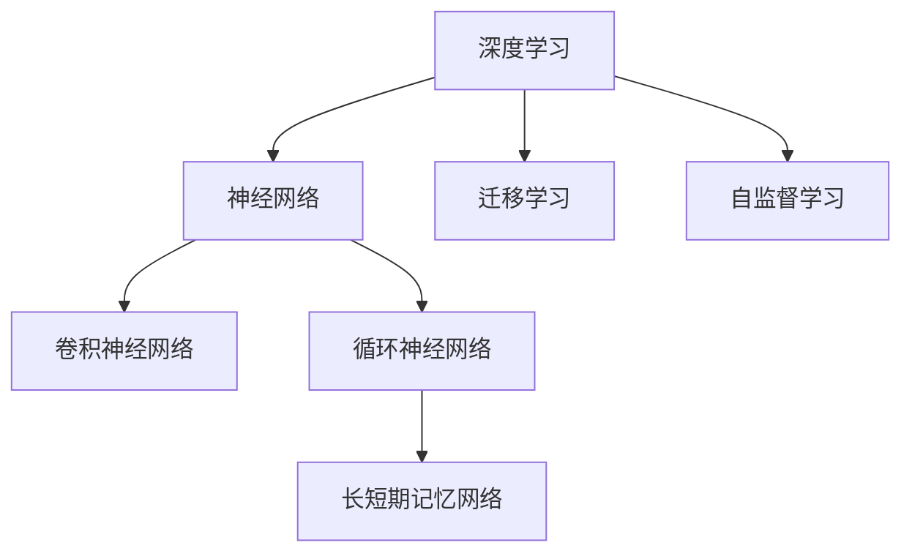

                 

# 硅谷的AI竞赛：贾扬清的观察，产品落地与基础研究并重

> 关键词：人工智能，贾扬清，微软，谷歌，AI竞赛，基础研究，产品落地，机器学习，深度学习，AI伦理

## 1. 背景介绍

### 1.1 问题由来
自20世纪90年代以来，硅谷一直是全球科技创新的中心，引领着人工智能（AI）等前沿技术的发展。从最初的神经网络、支持向量机（SVM）等传统机器学习模型，到如今的深度学习、强化学习、迁移学习等前沿技术，硅谷的科技巨头们一直在不断推动AI技术的突破与创新。

在这一过程中，深度学习作为AI的重要分支，以其强大的数据建模能力和高效的计算性能，迅速成为研究热点。在深度学习领域，谷歌、微软、亚马逊等科技巨头纷纷展开激烈的技术竞赛，力求在核心算法、应用场景和产业落地等方面占据先机。

## 2. 核心概念与联系

### 2.1 核心概念概述

本文将聚焦于深度学习领域的核心概念，并阐述这些概念之间的联系。具体包括以下几个方面：

- **深度学习（Deep Learning）**：一种基于多层神经网络的机器学习技术，能够自动提取和利用数据中的复杂特征，广泛应用于图像识别、语音识别、自然语言处理等领域。
- **神经网络（Neural Network）**：深度学习的核心组成部分，由多层非线性变换组成，通过反向传播算法优化权重，实现端到端学习。
- **卷积神经网络（Convolutional Neural Networks, CNN）**：一种专门处理图像、视频等结构化数据的神经网络结构，通过卷积操作捕捉局部特征。
- **循环神经网络（Recurrent Neural Networks, RNN）**：一种适用于序列数据（如文本、音频）的神经网络结构，通过时间维度上的递归实现序列建模。
- **长短期记忆网络（Long Short-Term Memory, LSTM）**：一种特殊的RNN结构，能够有效处理长期依赖关系，广泛应用于时间序列预测、文本生成等任务。
- **迁移学习（Transfer Learning）**：通过在预训练模型上微调，将在大规模数据上学习到的知识迁移到小规模数据集上，加速模型训练和提高泛化性能。
- **自监督学习（Self-Supervised Learning）**：利用数据的隐含信息（如掩码语言模型、对比学习等）进行无监督学习，提升模型泛化能力。

### 2.2 核心概念原理和架构的 Mermaid 流程图



在上述流程图中，深度学习通过神经网络构建起多层非线性变换，其中卷积神经网络专门处理图像数据，循环神经网络适用于序列数据，长短期记忆网络解决长期依赖问题。迁移学习和自监督学习则是提升模型泛化能力的两种重要技术。

## 3. 核心算法原理 & 具体操作步骤

### 3.1 算法原理概述

在深度学习中，核心算法主要包括前向传播、反向传播和优化算法。以下是这些算法的详细说明：

1. **前向传播**：将输入数据通过神经网络层层的传递，计算出最终输出结果的过程。
2. **反向传播**：计算损失函数对网络权重的导数，通过链式法则反向传播更新权重的过程。
3. **优化算法**：如梯度下降、Adam、Adagrad等，用于调整权重更新策略，加速模型收敛。

### 3.2 算法步骤详解

具体来说，深度学习模型的训练步骤如下：

1. **准备数据集**：将数据集划分为训练集、验证集和测试集。
2. **初始化模型参数**：随机初始化神经网络中的权重和偏置。
3. **前向传播**：将训练数据输入模型，计算输出结果。
4. **计算损失函数**：将模型输出与真实标签进行对比，计算损失函数。
5. **反向传播**：通过反向传播算法，计算每个权重的梯度。
6. **优化器更新**：使用优化算法更新权重，降低损失函数。
7. **验证集评估**：在验证集上评估模型性能，防止过拟合。
8. **测试集评估**：在测试集上评估模型泛化性能，衡量模型效果。

### 3.3 算法优缺点

深度学习算法具有以下优点：

- **强大的数据建模能力**：能够自动学习数据中的复杂特征，适用于大规模数据集。
- **高效的计算性能**：通过并行计算，加速模型训练和推理。
- **广泛的应用场景**：广泛应用于图像识别、语音识别、自然语言处理等领域。

同时，深度学习算法也存在以下缺点：

- **模型复杂度高**：参数数量庞大，需要大量的计算资源。
- **过拟合风险高**：易受噪声数据影响，泛化性能不稳定。
- **训练时间长**：模型结构复杂，训练时间较长。

### 3.4 算法应用领域

深度学习算法在以下几个领域得到了广泛应用：

1. **计算机视觉**：图像分类、目标检测、图像生成等任务。
2. **自然语言处理**：机器翻译、文本分类、情感分析等任务。
3. **语音识别**：语音识别、语音合成等任务。
4. **推荐系统**：用户兴趣预测、商品推荐等任务。
5. **游戏AI**：智能游戏、自动驾驶等任务。

## 4. 数学模型和公式 & 详细讲解 & 举例说明

### 4.1 数学模型构建

深度学习模型的数学模型通常由输入数据 $x$、权重参数 $\theta$ 和输出 $y$ 组成。以全连接神经网络为例，数学模型如下：

$$
y = \sigma(Wx + b)
$$

其中，$W$ 为权重矩阵，$b$ 为偏置向量，$\sigma$ 为激活函数。

### 4.2 公式推导过程

以二分类问题为例，假设模型输出为 $y = \sigma(Wx + b)$，真实标签为 $y_{true} \in \{0, 1\}$，交叉熵损失函数为：

$$
L = -\frac{1}{N} \sum_{i=1}^N [y_{true} \log(y) + (1 - y_{true}) \log(1 - y)]
$$

其中，$N$ 为样本数量。

### 4.3 案例分析与讲解

以图像分类任务为例，假设使用卷积神经网络（CNN）进行分类。CNN的层结构通常包括卷积层、池化层、全连接层等，每一层的功能如下：

- **卷积层**：通过卷积操作提取特征图。
- **池化层**：通过下采样操作减少特征图大小，减少计算量。
- **全连接层**：通过线性变换将特征图转换为输出。

## 5. 项目实践：代码实例和详细解释说明

### 5.1 开发环境搭建

在实践中，深度学习模型的开发需要以下环境：

1. **编程语言**：Python是最常用的深度学习开发语言。
2. **深度学习框架**：TensorFlow、PyTorch、Keras 等。
3. **计算资源**：高性能GPU或TPU。

### 5.2 源代码详细实现

以下是使用 PyTorch 实现卷积神经网络（CNN）的代码示例：

```python
import torch
import torch.nn as nn
import torch.optim as optim

class CNN(nn.Module):
    def __init__(self):
        super(CNN, self).__init__()
        self.conv1 = nn.Conv2d(3, 16, 3, padding=1)
        self.conv2 = nn.Conv2d(16, 32, 3, padding=1)
        self.fc1 = nn.Linear(32*8*8, 128)
        self.fc2 = nn.Linear(128, 10)

    def forward(self, x):
        x = torch.relu(self.conv1(x))
        x = nn.MaxPool2d(2)(x)
        x = torch.relu(self.conv2(x))
        x = nn.MaxPool2d(2)(x)
        x = x.view(-1, 32*8*8)
        x = torch.relu(self.fc1(x))
        x = self.fc2(x)
        return x

model = CNN()
criterion = nn.CrossEntropyLoss()
optimizer = optim.Adam(model.parameters(), lr=0.001)
```

### 5.3 代码解读与分析

在上述代码中，定义了一个简单的卷积神经网络模型，包括两个卷积层、两个全连接层和两个激活函数。其中，`nn.Conv2d` 用于定义卷积层，`nn.MaxPool2d` 用于定义池化层，`nn.Linear` 用于定义全连接层。

### 5.4 运行结果展示

以下是训练模型的代码示例：

```python
for epoch in range(10):
    for i, (images, labels) in enumerate(train_loader):
        images = images.to(device)
        labels = labels.to(device)
        optimizer.zero_grad()
        outputs = model(images)
        loss = criterion(outputs, labels)
        loss.backward()
        optimizer.step()
```

在训练过程中，模型通过反向传播算法更新权重，逐渐降低损失函数。训练结束后，可以使用测试集评估模型性能。

## 6. 实际应用场景

### 6.1 实际应用场景

深度学习模型已经在多个领域得到广泛应用：

1. **医疗**：图像识别、疾病预测等。
2. **金融**：欺诈检测、市场分析等。
3. **制造**：质量检测、设备故障预测等。
4. **自动驾驶**：图像识别、路径规划等。
5. **游戏**：智能游戏、机器人等。

## 7. 工具和资源推荐

### 7.1 学习资源推荐

- **《深度学习》课程**：由深度学习之父 Yann LeCun 主讲，全面介绍了深度学习的基本原理和实现方法。
- **《Python深度学习》**：由深度学习专家 François Chollet 撰写，详细介绍了 TensorFlow 和 Keras 的使用方法。
- **《动手学深度学习》**：由深度学习研究团队编写，提供了丰富的代码实现和实验结果。

### 7.2 开发工具推荐

- **TensorFlow**：由 Google 开发的深度学习框架，支持分布式计算和 GPU 加速。
- **PyTorch**：由 Facebook 开发的深度学习框架，支持动态计算图和 GPU 加速。
- **Keras**：一个高层次的深度学习框架，易于上手使用。

### 7.3 相关论文推荐

- **《深度学习》论文**：Yann LeCun 的综述论文，详细介绍了深度学习的原理和应用。
- **《ImageNet Classification with Deep Convolutional Neural Networks》**：Alex Krizhevsky 的论文，介绍了卷积神经网络的实现方法和性能。
- **《Large-Scale Distributed Deep Learning》**：John Duchi 的论文，介绍了分布式深度学习的实现方法。

## 8. 总结：未来发展趋势与挑战

### 8.1 研究成果总结

深度学习算法已经在多个领域取得了重大突破，为人类生产生活带来了深远影响。其主要研究成果包括：

- **卷积神经网络（CNN）**：在图像识别领域取得了显著效果。
- **循环神经网络（RNN）**：在序列数据处理方面表现出色。
- **长短期记忆网络（LSTM）**：在时间序列预测和自然语言处理方面表现优异。

### 8.2 未来发展趋势

未来，深度学习的发展趋势如下：

1. **更加高效**：深度学习算法将更加注重计算效率和模型压缩，减少资源消耗。
2. **更加鲁棒**：深度学习模型将更加注重鲁棒性和泛化性能，减少对噪声数据的敏感性。
3. **更加可解释**：深度学习模型将更加注重可解释性和可控性，便于人类理解和调试。
4. **更加普适**：深度学习模型将更加注重普适性和通用性，应用于更多领域和任务。

### 8.3 面临的挑战

深度学习的发展也面临着诸多挑战：

1. **数据瓶颈**：深度学习算法需要大量的数据进行训练，而获取高质量标注数据成本较高。
2. **模型复杂度**：深度学习模型参数数量庞大，训练和推理需要大量计算资源。
3. **过拟合风险**：深度学习模型容易受噪声数据影响，泛化性能不稳定。

### 8.4 研究展望

未来，深度学习的研究展望如下：

1. **无监督学习**：利用无监督学习技术，减少对标注数据的依赖。
2. **迁移学习**：通过迁移学习技术，加速模型训练和提高泛化性能。
3. **联邦学习**：通过联邦学习技术，实现数据分布式训练和模型更新。
4. **自适应学习**：通过自适应学习技术，提高模型鲁棒性和泛化性能。

## 9. 附录：常见问题与解答

**Q1: 深度学习与传统机器学习有何不同？**

A: 深度学习通过多层神经网络自动提取特征，而传统机器学习需要手动设计特征。深度学习能够处理大规模数据集，而传统机器学习对数据规模要求较小。

**Q2: 深度学习算法的计算资源要求高吗？**

A: 是的，深度学习算法通常需要大量的计算资源进行训练和推理。GPU/TPU 等高性能设备是必不可少的。

**Q3: 深度学习算法的优缺点有哪些？**

A: 优点：强大的数据建模能力、高效的计算性能、广泛的应用场景。缺点：模型复杂度高、过拟合风险高、训练时间长。

**Q4: 深度学习算法在医疗领域有哪些应用？**

A: 深度学习算法在医疗领域的应用包括图像识别、疾病预测、医疗影像分析等。

**Q5: 未来深度学习技术的发展趋势是什么？**

A: 未来深度学习技术的发展趋势是更加高效、鲁棒、可解释、普适。

---

作者：禅与计算机程序设计艺术 / Zen and the Art of Computer Programming

