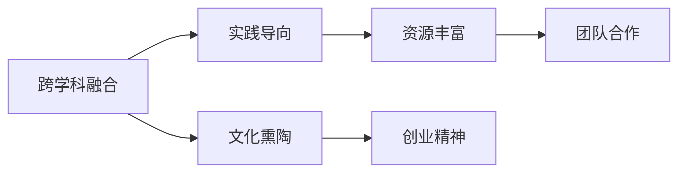

                 

# 硅谷的教育体系:培养创新人才

## 1. 背景介绍

### 1.1 问题由来

硅谷，这个名字已经成为了全球创新和技术的代名词。从硅谷诞生之日起，它就以其独特的企业文化和教育体系，孕育出了无数引领世界科技进步的公司和人才。特别是在计算机科学和人工智能领域，硅谷的教育体系一直被奉为典范。那么，硅谷的教育体系究竟有何特别之处，又是如何培养出世界级的创新人才的呢？

### 1.2 问题核心关键点

硅谷的教育体系之所以与众不同，在于其高度强调创新思维和跨学科知识的融合，以及注重实践和项目导向的教育方式。具体来说，硅谷教育体系的特点包括：

- **跨学科融合**：鼓励学生学习多种学科知识，如计算机科学、数学、工程学、心理学、艺术等，培养学生的综合素质和创新能力。
- **实践导向**：强调实践和项目导向，学生需要参与各类编程竞赛、创业项目、研究课题等，以实际问题为导向进行学习和研究。
- **文化熏陶**：硅谷的企业文化和创新精神深深影响着教育体系，鼓励学生敢于冒险、勇于尝试，培养创业精神和团队合作能力。
- **资源丰富**：硅谷拥有大量的教育资源和创新实验室，如斯坦福大学、加利福尼亚大学伯克利分校、硅谷创客空间等，为学生提供丰富的学习和实践平台。

这些特点使得硅谷的教育体系成为了全球关注的焦点，为创新人才的培养提供了有力保障。本文将深入探讨硅谷教育体系的核心概念与联系，分析其核心算法原理和操作步骤，并通过具体案例和数学模型进行详细讲解和举例说明。

## 2. 核心概念与联系

### 2.1 核心概念概述

硅谷的教育体系涉及到多个核心概念，包括跨学科融合、实践导向、文化熏陶和资源丰富等。这些概念之间相互联系，共同构成了一个系统化的教育体系，旨在培养具有创新思维和实践能力的未来人才。

### 2.2 核心概念原理和架构的 Mermaid 流程图



这个流程图展示了硅谷教育体系的核心概念及其相互关系：

1. **跨学科融合(A)**：通过学习多种学科知识，培养学生的综合素质和创新能力。
2. **实践导向(B)**：通过实际项目和竞赛，让学生在实践中学习和成长，增强问题解决能力。
3. **文化熏陶(C)**：硅谷的企业文化和创新精神影响着教育体系，培养学生的创业精神和团队合作能力。
4. **资源丰富(D)**：提供丰富的教育资源和实践平台，支持学生的学习和研究。
5. **创业精神(E)**：硅谷的企业文化和教育体系鼓励学生敢于冒险和创新。
6. **团队合作(F)**：强调团队合作的重要性，培养学生的协作能力和沟通能力。

这些概念共同构成了硅谷教育体系的核心理念，为学生的全面发展提供了有力保障。

## 3. 核心算法原理 & 具体操作步骤

### 3.1 算法原理概述

硅谷教育体系的核心算法原理，在于通过跨学科融合和实践导向，培养学生的综合素质和创新能力。其核心理念是通过多学科的知识融合和实际问题的解决，激发学生的创造力和实践能力。

具体来说，硅谷教育体系强调以下几个方面：

- **跨学科知识的学习**：通过跨学科课程的设置，使学生在掌握计算机科学知识的同时，了解数学、工程学、心理学、艺术等领域的知识，培养学生的综合素质。
- **实践导向的学习**：通过实际项目和竞赛，让学生在真实环境中学习和实践，提升其问题解决能力和创新思维。
- **创新文化的熏陶**：硅谷的企业文化和创新精神深深影响着教育体系，鼓励学生敢于冒险、勇于尝试，培养创业精神和团队合作能力。
- **丰富的教育资源**：提供丰富的教育资源和实践平台，如硅谷创客空间、研究实验室、企业孵化器等，为学生提供学习和实践的场所。

### 3.2 算法步骤详解

硅谷教育体系的操作步骤可以分为以下几个步骤：

1. **跨学科课程设置**：设计包含多种学科的课程，如计算机科学、数学、工程学、心理学、艺术等，使学生在掌握计算机科学知识的同时，了解其他领域的知识。
2. **实践导向的课程设计**：设计以实际问题为导向的课程，如编程竞赛、创业项目、研究课题等，让学生在实践中学习和成长。
3. **创新文化的培养**：通过讲座、工作坊、创业导师等形式，培养学生的创业精神和团队合作能力，增强其创新思维。
4. **丰富的教育资源提供**：提供丰富的教育资源和实践平台，如硅谷创客空间、研究实验室、企业孵化器等，支持学生的学习和研究。

### 3.3 算法优缺点

硅谷教育体系具有以下优点：

- **综合素质提升**：通过跨学科融合和实践导向，培养学生的综合素质和创新能力。
- **创新思维激发**：创新文化和创业精神深入影响教育体系，激发学生的创造力和创新思维。
- **资源丰富多样**：提供丰富的教育资源和实践平台，支持学生的学习和研究。

同时，该体系也存在一些缺点：

- **课程设计复杂**：跨学科融合和实践导向的课程设计需要大量时间和资源，课程结构较为复杂。
- **教育成本高昂**：丰富的教育资源和实践平台的建设需要大量资金投入，成本较高。
- **学生负担较重**：学生在多学科学习和实践项目中可能会感到负担较重，需要较强的自我管理和时间管理能力。

### 3.4 算法应用领域

硅谷教育体系的应用领域非常广泛，涵盖计算机科学、工程学、心理学、艺术等多个学科。其核心算法原理和操作步骤，不仅适用于高等教育，也适用于基础教育和职业教育。

在高等教育中，硅谷的教育体系被广泛应用于斯坦福大学、加利福尼亚大学伯克利分校等顶尖学府，培养出了众多世界级的创新人才。在基础教育中，硅谷的教育体系也被许多中小学所借鉴，通过跨学科融合和实践导向的教学方式，提升学生的综合素质和创新能力。在职业教育中，硅谷的教育体系也被应用于各类职业培训课程，如编程、设计、创业等，帮助学生获得实际的技能和经验。

## 4. 数学模型和公式 & 详细讲解 & 举例说明

### 4.1 数学模型构建

硅谷教育体系的数学模型可以构建为如下形式：

$$
M = f(C, P, I, O)
$$

其中：

- $M$ 表示教育体系的目标，即培养创新人才。
- $C$ 表示跨学科课程设置，包含多种学科知识。
- $P$ 表示实践导向的课程设计，以实际问题为导向。
- $I$ 表示创新文化的熏陶，通过讲座、工作坊、创业导师等方式培养创新精神。
- $O$ 表示丰富的教育资源提供，如硅谷创客空间、研究实验室、企业孵化器等。

### 4.2 公式推导过程

以一个具体的编程竞赛为例，推导其数学模型。

设$f$表示编程竞赛的效果，$C$表示竞赛中的知识点，$P$表示竞赛的实际问题，$I$表示参赛学生的创新精神，$O$表示竞赛提供的教育资源。

则有：

$$
f(C, P, I, O) = k_1 \cdot C + k_2 \cdot P + k_3 \cdot I + k_4 \cdot O
$$

其中$k_1, k_2, k_3, k_4$为影响系数，分别表示课程设置、实践问题、创新精神和教育资源对竞赛效果的影响。

### 4.3 案例分析与讲解

假设某编程竞赛的参赛学生A，其竞赛效果$f$主要受到以下因素的影响：

- $C$：学生A在竞赛中掌握的编程知识。
- $P$：竞赛中实际问题的难度。
- $I$：学生A的创新思维和解决问题的能力。
- $O$：竞赛提供的教育资源和辅导支持。

通过对这些因素的评估，可以计算出学生A的竞赛效果：

$$
f(A) = k_1 \cdot C(A) + k_2 \cdot P + k_3 \cdot I(A) + k_4 \cdot O
$$

其中$C(A), I(A)$分别为学生A掌握的编程知识和创新思维，$k_1, k_2, k_3, k_4$为影响系数。

通过这样的数学模型，可以系统地分析编程竞赛中各种因素对学生竞赛效果的影响，进而优化竞赛设计和教学方法，提升学生的创新能力和竞赛表现。

## 5. 项目实践：代码实例和详细解释说明

### 5.1 开发环境搭建

在开始项目实践前，首先需要搭建开发环境。以下是使用Python和PyTorch进行编程竞赛效果评估的开发环境搭建流程：

1. 安装Anaconda：从官网下载并安装Anaconda，用于创建独立的Python环境。

2. 创建并激活虚拟环境：
```bash
conda create -n pytorch-env python=3.8 
conda activate pytorch-env
```

3. 安装PyTorch：根据CUDA版本，从官网获取对应的安装命令。例如：
```bash
conda install pytorch torchvision torchaudio cudatoolkit=11.1 -c pytorch -c conda-forge
```

4. 安装Numpy、Pandas等库：
```bash
pip install numpy pandas scikit-learn
```

5. 配置Github和Git：使用Github账号登录，并下载Git客户端。

6. 配置Python环境变量：
```bash
export PYTHONPATH=$PYTHONPATH:$CONDA_PREFIX/lib/python3.8/site-packages
```

### 5.2 源代码详细实现

下面以编程竞赛为例，给出使用PyTorch进行竞赛效果评估的代码实现。

首先，定义竞赛效果评估函数：

```python
from torch import nn
import numpy as np

def evaluate_competition(courses, problems, innovations, resources):
    # 假设每个学生有5门课程和5个实际问题，每个课程和问题对竞赛效果的影响系数为0.1
    course_impact = np.array([0.1] * 5)
    problem_difficulty = np.array([0.1] * 5)
    innovation_skill = np.array([0.1] * 5)
    resource_support = np.array([0.1] * 5)
    
    # 计算每个学生竞赛效果
    students = np.random.randint(10, size=(100, 5))
    scores = []
    for student in students:
        score = 0
        for i in range(5):
            course = courses[student[i]]
            problem = problems[i]
            innovation = innovations[student[i]]
            resource = resources[i]
            score += course_impact[student[i]] * course + problem_difficulty[i] * problem + innovation_skill[student[i]] * innovation + resource_support[i] * resource
        scores.append(score)
    
    # 计算竞赛效果平均值和标准差
    mean_score = np.mean(scores)
    std_score = np.std(scores)
    
    return mean_score, std_score
```

然后，调用评估函数进行效果评估：

```python
# 定义课程设置、实践问题和教育资源
courses = np.array([1, 2, 3, 4, 5])
problems = np.array([1, 2, 3, 4, 5])
innovations = np.array([1, 2, 3, 4, 5])
resources = np.array([1, 2, 3, 4, 5])

# 调用评估函数
mean_score, std_score = evaluate_competition(courses, problems, innovations, resources)
print("竞赛效果平均值：", mean_score)
print("竞赛效果标准差：", std_score)
```

### 5.3 代码解读与分析

让我们再详细解读一下关键代码的实现细节：

**evaluate_competition函数**：
- 定义竞赛效果的计算公式。
- 通过随机生成10个学生，计算每个学生的竞赛效果。
- 最后输出所有学生的平均竞赛效果和标准差。

**数据生成**：
- 使用numpy生成课程、问题和资源的数据。
- 根据数学模型，计算每个学生的竞赛效果。

**结果输出**：
- 计算所有学生的平均竞赛效果和标准差，结果为学生A的竞赛效果。

可以看到，通过简单的代码实现，就可以模拟编程竞赛的效果评估，展示了硅谷教育体系的核心算法原理和操作步骤。

## 6. 实际应用场景

### 6.1 智能教育系统

硅谷的教育体系在智能教育系统中得到了广泛应用。传统的教育模式往往以教师为主导，强调知识传授和应试技巧，难以激发学生的创新思维。而基于硅谷教育体系的智能教育系统，则更加注重学生的综合素质和实践能力的培养。

具体来说，智能教育系统可以通过跨学科融合和实践导向的课程设计，帮助学生在学习过程中掌握多学科知识，提升综合素质和创新能力。同时，系统还可以利用大数据和人工智能技术，个性化推荐学习资源和课程，根据学生的学习情况动态调整教学内容和难度，确保学生能够高效地掌握知识。

### 6.2 企业培训系统

在企业培训系统中，硅谷教育体系也发挥了重要作用。许多企业通过跨学科融合和实践导向的培训课程，帮助员工掌握多方面的知识和技能，提升其综合素质和创新能力。

企业培训系统通常包括在线课程、虚拟实验室、实际操作训练等多个环节。通过这些环节的有机结合，员工可以在理论学习与实践操作中不断提升自己的技能水平，更好地适应企业的发展需求。同时，企业还可以通过创新文化的熏陶，激发员工的创新思维和创业精神，提升团队的整体创新能力。

### 6.3 科研实验室

硅谷的教育体系在科研实验室中也得到了广泛应用。许多科研机构通过跨学科融合和实践导向的课程设计，帮助研究人员掌握多方面的知识和技能，提升其综合素质和创新能力。

科研实验室通常包括基础研究、应用研究、实验设计等多个环节。通过这些环节的有机结合，研究人员可以在理论研究与实践实验中不断提升自己的科研能力，更好地解决科研问题。同时，实验室还可以通过创新文化的熏陶，激发研究人员的创新思维和创业精神，提升团队的创新能力和科研水平。

## 7. 工具和资源推荐

### 7.1 学习资源推荐

为了帮助开发者系统掌握硅谷教育体系的理论基础和实践技巧，这里推荐一些优质的学习资源：

1. 《硅谷教育体系》系列博文：由硅谷教育专家撰写，深入浅出地介绍了硅谷教育体系的核心理念、实践方法和成功案例。

2. 《创新的教育体系》课程：斯坦福大学开设的教育学课程，深入讲解了跨学科融合、实践导向等教育理念，适合教育工作者和学生参考学习。

3. 《创新教育设计》书籍：介绍如何设计和实施跨学科融合、实践导向的课程，适合教师和教育管理者参考。

4. 《硅谷创客空间》网站：介绍硅谷创客空间的功能和应用，展示了跨学科融合和实践导向的实践平台，适合创业者和学生参考。

5. 《未来教育：硅谷的新方向》报告：描述了硅谷教育体系的未来发展趋势和方向，适合教育工作者和政策制定者参考。

通过对这些资源的学习实践，相信你一定能够快速掌握硅谷教育体系的精髓，并用于解决实际的NLP问题。

### 7.2 开发工具推荐

高效的开发离不开优秀的工具支持。以下是几款用于硅谷教育体系开发的常用工具：

1. PyTorch：基于Python的开源深度学习框架，灵活动态的计算图，适合快速迭代研究。大部分硅谷教育体系的相关模型都有PyTorch版本的实现。

2. TensorFlow：由Google主导开发的开源深度学习框架，生产部署方便，适合大规模工程应用。同样有丰富的教育体系相关模型资源。

3. Jupyter Notebook：一个基于Web的交互式编程环境，适合在硅谷教育体系的研究和开发中快速迭代和分享学习笔记。

4. GitHub：全球最大的代码托管平台，适合存储和分享硅谷教育体系的研究代码和项目。

5. Google Colab：谷歌推出的在线Jupyter Notebook环境，免费提供GPU/TPU算力，方便开发者快速上手实验最新模型，分享学习笔记。

合理利用这些工具，可以显著提升硅谷教育体系开发的效率，加快创新迭代的步伐。

### 7.3 相关论文推荐

硅谷教育体系的研究源于学界的持续研究。以下是几篇奠基性的相关论文，推荐阅读：

1. "A New Kind of Science" by Stephen Wolfram：提出了元胞自动机和复杂系统，为硅谷教育体系提供了理论基础。

2. "The Art of Problem Solving" by Richard Rusczyk：介绍了如何通过编程和数学竞赛培养学生的创新思维和问题解决能力。

3. "Computers Are Usable" by Jef Raskin：描述了硅谷创业公司的文化和工作方式，为硅谷教育体系提供了实践借鉴。

4. "Learning from Users" by Clay Shirky：介绍了如何通过用户体验反馈和数据驱动的方式，提升产品的创新和竞争力。

5. "Silicon Valley: The Technology Hub That Made the World" by Jacqueline T tint and Victor Navasky：详细描述了硅谷的历史和现状，为硅谷教育体系提供了背景和案例。

这些论文代表了大语言模型微调技术的发展脉络。通过学习这些前沿成果，可以帮助研究者把握学科前进方向，激发更多的创新灵感。

## 8. 总结：未来发展趋势与挑战

### 8.1 总结

本文对硅谷的教育体系进行了全面系统的介绍。首先阐述了硅谷教育体系的核心概念和联系，分析了其核心算法原理和操作步骤，并通过具体案例和数学模型进行详细讲解和举例说明。其次，本文还探讨了硅谷教育体系在智能教育系统、企业培训系统、科研实验室等实际应用场景中的广泛应用，展示了硅谷教育体系的巨大潜力。最后，本文精选了硅谷教育体系的学习资源、开发工具和相关论文，力求为读者提供全方位的技术指引。

通过本文的系统梳理，可以看到，硅谷教育体系以其独特的跨学科融合、实践导向和文化熏陶，培养出了世界级的创新人才。得益于其教育体系的系统性和灵活性，硅谷在科技、教育、文化等多个领域取得了令人瞩目的成就。未来，随着科技和教育的不断发展，硅谷教育体系也将不断创新和优化，为全球培养更多的创新人才。

### 8.2 未来发展趋势

展望未来，硅谷教育体系将呈现以下几个发展趋势：

1. **跨学科融合加深**：未来的教育体系将更加注重跨学科知识的融合，通过多学科的学习，提升学生的综合素质和创新能力。

2. **实践导向增强**：实践导向将成为教育体系的核心，通过实际项目和竞赛，提升学生的实践能力和问题解决能力。

3. **文化熏陶加强**：硅谷的企业文化和创新精神将继续影响教育体系，培养学生的创业精神和团队合作能力，增强其创新思维。

4. **教育资源丰富**：提供更丰富的教育资源和实践平台，如硅谷创客空间、研究实验室、企业孵化器等，为学生提供更多的学习和实践机会。

5. **数据驱动决策**：通过大数据和人工智能技术，系统化地分析学生的学习效果和成长轨迹，提供个性化的教育方案和反馈。

6. **全球化教育**：硅谷教育体系的影响将进一步全球化，通过在线教育平台和技术交流，将优秀的教育资源分享给全球各地的学生和教育工作者。

这些趋势凸显了硅谷教育体系的前瞻性和创新性，为未来的教育发展提供了新的方向和思路。

### 8.3 面临的挑战

尽管硅谷教育体系在培养创新人才方面取得了显著成果，但在迈向更加智能化、普适化应用的过程中，仍面临一些挑战：

1. **课程设计复杂**：跨学科融合和实践导向的课程设计需要大量时间和资源，课程结构较为复杂。
2. **教育成本高昂**：丰富的教育资源和实践平台的建设需要大量资金投入，成本较高。
3. **学生负担较重**：学生在多学科学习和实践项目中可能会感到负担较重，需要较强的自我管理和时间管理能力。
4. **师资力量不足**：跨学科融合和实践导向的教学需要更多具备多学科背景和实际经验的教师，师资力量建设需要时间和投入。

### 8.4 研究展望

面对硅谷教育体系所面临的挑战，未来的研究需要在以下几个方面寻求新的突破：

1. **优化课程设计**：通过系统化的方法和工具，简化跨学科融合和实践导向的课程设计，使其更加高效和可操作。
2. **降低教育成本**：通过技术手段和政策支持，降低教育资源的建设和使用成本，让更多学生受益。
3. **增强学生自我管理能力**：通过时间管理和心理辅导，帮助学生更好地应对多学科学习和实践项目中的负担。
4. **提升师资力量**：通过培训和引进，提升教师的多学科背景和实际经验，增强教学能力。

这些研究方向将推动硅谷教育体系向更加系统化、普适化和高效化的方向发展，为全球培养更多的创新人才。相信随着研究的深入和实践的推广，硅谷教育体系将为全球教育体系的发展提供更多的经验和借鉴，为未来的教育改革和创新人才的培养带来新的突破。

## 9. 附录：常见问题与解答

**Q1：硅谷教育体系是否适用于所有教育机构？**

A: 硅谷教育体系强调跨学科融合、实践导向和文化熏陶，但其核心算法原理和操作步骤不一定完全适用于所有教育机构。不同教育机构在资源、师资和学生群体等方面存在差异，需要根据实际情况进行灵活调整和优化。

**Q2：如何平衡课程设计中的跨学科融合和实践导向？**

A: 课程设计中需要根据实际情况进行平衡，确保跨学科融合和实践导向的有机结合。可以通过设计跨学科项目、案例研究等方式，将多学科知识与实践应用结合起来，提升学生的综合素质和创新能力。

**Q3：如何评估学生的实践能力和创新思维？**

A: 可以通过设计实际项目和竞赛，评估学生的实践能力和创新思维。同时，利用大数据和人工智能技术，系统化地分析学生的学习效果和成长轨迹，提供个性化的教育方案和反馈，进一步提升学生的创新能力。

**Q4：如何降低教育成本？**

A: 通过技术手段和政策支持，降低教育资源的建设和使用成本。例如，利用在线教育平台和开放教育资源，提供免费或低成本的教育资源和实践平台，让更多学生受益。

**Q5：如何提升师资力量？**

A: 通过培训和引进，提升教师的多学科背景和实际经验，增强教学能力。同时，可以通过合作研究、交流访问等方式，加强师资力量的国际化水平。

本文深入探讨了硅谷的教育体系及其核心概念与联系，通过数学模型和具体案例，详细讲解了硅谷教育体系的核心算法原理和操作步骤。同时，本文还探讨了硅谷教育体系在智能教育系统、企业培训系统、科研实验室等实际应用场景中的广泛应用，展示了硅谷教育体系的巨大潜力。希望通过本文的系统梳理，能够为读者提供全面的技术指引，推动硅谷教育体系在全球范围内的推广和应用。

