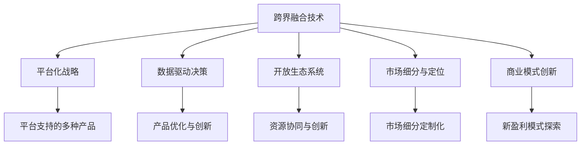

                 

# 硅谷科技公司的多元化发展

硅谷，这片全球科技创新的沃土，不仅孕育了苹果、谷歌、Facebook等全球顶级科技公司，也在不断引领着全球科技发展的方向。然而，在硅谷，多元化发展并非单一产品或服务的拓展，而是全面深入到技术、产品、市场和商业模式等多个层面的探索。本文将从核心概念与联系、核心算法原理与具体操作步骤、实际应用场景和未来展望等多个角度，深入探讨硅谷科技公司如何通过多元化发展，构建起强大的竞争优势，引领全球科技潮流。

## 1. 背景介绍

### 1.1 问题由来

在过去几十年中，硅谷科技公司通过不断创新，推动了全球科技的发展。然而，随着市场竞争的加剧和用户需求的不断变化，单一产品和业务模式的局限性逐渐显现。为了应对这些挑战，硅谷科技公司开始探索和实施多元化发展战略，从单一产品向多个领域的拓展，以增强自身竞争力，满足不断变化的市场需求。

### 1.2 问题核心关键点

硅谷科技公司的多元化发展，并非简单的业务多元化，而是涉及技术、产品、市场和商业模式等多个层面的深刻变革。其主要关键点包括：

- **技术跨界融合**：通过跨界融合不同技术领域，实现技术创新的突破。
- **产品线扩展**：基于现有技术优势，拓展新领域产品线，满足多样化的市场需求。
- **市场细分与定位**：针对不同市场细分，进行精准的市场定位和营销策略调整。
- **商业模式创新**：探索和实施新的商业模式，提升公司整体盈利能力。

这些关键点共同构成了硅谷科技公司多元化发展的基本框架，使其能够在竞争激烈的市场中保持领先地位。

## 2. 核心概念与联系

### 2.1 核心概念概述

硅谷科技公司的多元化发展，涉及到多个核心概念和技术原理，这些概念和技术相互关联，共同构成了多元化发展的基石。

- **跨界融合技术**：通过将不同领域的技术进行融合，创造出全新的技术解决方案，提升整体技术创新能力。
- **平台化战略**：构建统一的技术平台，支持多个产品线的快速开发和迭代。
- **数据驱动决策**：通过大数据和人工智能技术，驱动产品和服务的设计、优化和创新。
- **开放生态系统**：构建开放的生态系统，促进外部资源的协同和创新。
- **市场细分与定位**：通过深入市场调研，针对不同细分市场进行精准定位和定制化服务。
- **商业模式创新**：通过改变传统商业模式，探索新的盈利模式，提升公司盈利能力。

这些概念之间的关系可以通过以下Mermaid流程图来展示：



这个流程图展示了一体化多元化的技术、平台、数据、生态、市场和商业模式之间的联系，说明了各个概念如何相互作用，共同驱动硅谷科技公司的多元化发展。

## 3. 核心算法原理 & 具体操作步骤

### 3.1 算法原理概述

硅谷科技公司的多元化发展，不仅依赖于技术创新和市场洞察，还需要通过算法和技术手段进行高效的管理和优化。其主要算法原理包括以下几个方面：

- **集成学习算法**：通过集成多个学习器的结果，提升整体预测准确率和泛化能力。
- **强化学习算法**：通过智能体在环境中的交互学习，优化产品和服务的设计和运营。
- **生成对抗网络(GANs)**：通过生成器和判别器的对抗训练，生成高质量的数据和内容。
- **推荐系统算法**：通过用户行为和偏好数据的分析，提供个性化的产品推荐。

### 3.2 算法步骤详解

硅谷科技公司在实施多元化发展时，通常会采用以下步骤：

**Step 1: 数据收集与处理**

- 通过大规模数据收集，获取不同领域的数据。
- 对数据进行清洗、归一化和特征工程处理，提取有价值的特征。
- 将数据集划分为训练集、验证集和测试集，用于模型训练和评估。

**Step 2: 模型训练与优化**

- 选择合适的算法和技术，进行模型训练。
- 通过交叉验证和超参数调优，优化模型性能。
- 使用集成学习、深度学习等技术，提升模型的准确率和鲁棒性。

**Step 3: 产品和服务迭代**

- 将优化后的模型应用到产品和服务中，进行A/B测试和用户反馈收集。
- 根据用户反馈和市场变化，不断迭代优化产品和服务。
- 引入生成对抗网络和推荐系统等技术，提升用户体验和满意度。

**Step 4: 市场推广与策略调整**

- 利用大数据和AI技术，进行市场细分和用户画像分析。
- 根据分析结果，制定精准的市场推广策略和营销方案。
- 通过平台化战略和生态系统建设，扩大市场覆盖和影响力。

### 3.3 算法优缺点

硅谷科技公司的多元化发展算法具有以下优点：

- **高效性**：通过集成学习、深度学习和推荐系统等技术，提升整体决策效率和优化效果。
- **灵活性**：能够快速适应市场需求和技术变化，进行产品和服务迭代优化。
- **智能化**：利用大数据和AI技术，驱动市场洞察和产品创新。

同时，这些算法也存在一些缺点：

- **复杂性**：算法模型的设计和优化较为复杂，需要专业知识和技术储备。
- **数据依赖**：算法模型的训练和优化依赖于高质量的数据，数据质量和数量不足可能导致效果不佳。
- **资源消耗**：算法模型需要较大的计算资源和时间成本，可能导致资源浪费。

### 3.4 算法应用领域

硅谷科技公司的多元化发展算法，已在多个领域得到广泛应用，例如：

- **人工智能与机器学习**：在图像识别、语音识别、自然语言处理等领域，提升产品和服务智能化水平。
- **推荐系统**：在电商、社交媒体等平台，提供个性化推荐，提升用户粘性和满意度。
- **金融科技**：在风险控制、反欺诈等领域，提升金融服务的安全性和高效性。
- **健康科技**：在医疗诊断、健康管理等领域，提升医疗服务的精准性和可及性。

## 4. 数学模型和公式 & 详细讲解 & 举例说明

### 4.1 数学模型构建

硅谷科技公司的多元化发展，涉及多个数学模型和公式，这些模型和公式在实际应用中起到关键作用。

- **集成学习模型**：通过组合多个学习器的预测结果，提升整体性能。例如，AdaBoost、Bagging、Random Forest等算法。
- **生成对抗网络(GANs)**：通过生成器和判别器的对抗训练，生成高质量的数据。例如，Wasserstein GAN、Conditional GAN等模型。
- **推荐系统模型**：通过协同过滤、基于内容的推荐、深度学习等方法，提供个性化推荐。例如，矩阵分解、基于图的网络嵌入、深度神经网络等模型。

### 4.2 公式推导过程

以集成学习模型为例，AdaBoost的公式推导如下：

$$
h_t(x) = sign\left(\sum_{i=1}^{T}\alpha_i h_i(x)\right)
$$

其中 $h_t(x)$ 表示集成学习器的最终预测结果，$h_i(x)$ 表示第 $i$ 个学习器的预测结果，$\alpha_i$ 表示第 $i$ 个学习器的权重。AdaBoost通过不断调整学习器的权重，优化整体预测性能。

### 4.3 案例分析与讲解

在推荐系统中，协同过滤算法是一种常用的方法。其基本思想是通过用户行为数据，找到相似的用户和物品，进行推荐。具体步骤如下：

1. 对用户和物品进行编码，得到用户向量 $u$ 和物品向量 $i$。
2. 计算用户向量与物品向量之间的相似度，例如使用余弦相似度：
   $$
   similarity(u,i) = \frac{\langle u,i \rangle}{\|u\|\cdot \|i\|}
   $$
3. 将相似度排序，选取与用户相似度最高的若干物品进行推荐。

协同过滤算法通过用户行为数据，实现个性化的推荐，在电商、视频、音乐等领域得到了广泛应用。

## 5. 项目实践：代码实例和详细解释说明

### 5.1 开发环境搭建

在进行多元化发展项目的开发前，需要准备相应的开发环境。以下是使用Python进行TensorFlow开发的环境配置流程：

1. 安装Anaconda：从官网下载并安装Anaconda，用于创建独立的Python环境。
2. 创建并激活虚拟环境：
   ```bash
   conda create -n tf-env python=3.8 
   conda activate tf-env
   ```
3. 安装TensorFlow：根据CUDA版本，从官网获取对应的安装命令。例如：
   ```bash
   conda install tensorflow -c tf -c conda-forge
   ```
4. 安装各类工具包：
   ```bash
   pip install numpy pandas scikit-learn matplotlib tqdm jupyter notebook ipython
   ```

完成上述步骤后，即可在`tf-env`环境中开始多元化发展的项目实践。

### 5.2 源代码详细实现

以下是使用TensorFlow进行协同过滤推荐系统的代码实现：

```python
import tensorflow as tf
import numpy as np

# 数据生成
def generate_data(num_users, num_items, num_ratings):
    users = np.random.randint(0, num_users, (num_items, num_users))
    items = np.random.randint(0, num_items, (num_items, num_users))
    ratings = np.random.rand(num_items, num_users) * 5
    return users, items, ratings

# 协同过滤模型
def collaborative_filtering_model(data):
    num_users, num_items, num_ratings = data.shape
    users, items, ratings = data
    
    # 用户向量表示
    user_vec = tf.keras.layers.Dense(32, activation='relu')(tf.keras.layers.Dense(1, activation='sigmoid')(tf.keras.layers.Embedding(num_users, 32)(users)))
    # 物品向量表示
    item_vec = tf.keras.layers.Dense(32, activation='relu')(tf.keras.layers.Dense(1, activation='sigmoid')(tf.keras.layers.Embedding(num_items, 32)(items)))
    # 相似度计算
    similarity = tf.reduce_sum(user_vec * item_vec, axis=1)
    # 预测评分
    predictions = tf.reduce_sum(similarity * ratings, axis=1)
    # 损失函数
    loss = tf.keras.losses.MeanSquaredError()(predictions, ratings)
    return loss

# 训练和测试
def train_test(data):
    users, items, ratings = data
    model = tf.keras.Sequential([
        tf.keras.layers.Dense(32, activation='relu'),
        tf.keras.layers.Dense(32, activation='relu'),
        collaborative_filtering_model
    ])
    model.compile(optimizer='adam', loss='mse')
    model.fit([users, items], ratings, epochs=10, validation_split=0.2)
    test_loss = model.evaluate([users, items], ratings, verbose=0)
    print('Test Loss:', test_loss)
```

### 5.3 代码解读与分析

让我们再详细解读一下关键代码的实现细节：

**generate_data函数**：
- 生成模拟数据，包含用户、物品和评分。

**collaborative_filtering_model函数**：
- 构建协同过滤模型，包含用户向量和物品向量的表示，相似度计算和预测评分。

**train_test函数**：
- 训练和测试协同过滤模型，通过Adam优化器和均方误差损失函数进行模型训练和评估。

## 6. 实际应用场景

### 6.1 社交媒体推荐系统

在社交媒体平台，推荐系统是提升用户体验和粘性的重要手段。硅谷科技公司通过协同过滤、基于内容的推荐等算法，为用户推荐他们感兴趣的内容。

在实际应用中，社交媒体平台收集用户的点赞、评论、分享等行为数据，构建用户行为矩阵，并使用协同过滤算法进行推荐。推荐系统根据用户的行为数据，生成个性化的推荐内容，如新闻、视频、文章等，提升用户互动和留存率。

### 6.2 智能医疗诊断系统

智能医疗诊断系统通过分析患者的病历、检查报告等数据，提供精准的医疗诊断服务。硅谷科技公司利用机器学习和深度学习技术，构建基于症状、体征的诊断模型，辅助医生进行诊断。

在实际应用中，智能医疗诊断系统通过收集和标注大量病例数据，构建训练集和验证集，使用深度学习模型进行训练和验证。模型根据患者输入的症状和体征，生成诊断报告，辅助医生进行诊断。智能医疗诊断系统通过持续学习和数据更新，不断提升诊断准确率和泛化能力。

### 6.3 金融风险控制系统

金融风险控制系统通过分析金融市场数据，识别潜在的风险和欺诈行为，保护金融资产安全。硅谷科技公司利用生成对抗网络(GANs)和推荐系统等技术，构建金融风险控制模型，提升风险识别和防范能力。

在实际应用中，金融风险控制系统通过收集和标注大量的金融市场数据，构建训练集和验证集，使用生成对抗网络生成高质量的金融数据，用于训练风险控制模型。模型根据用户行为数据和市场数据，生成风险评估报告，及时发现并防范潜在的风险和欺诈行为。

### 6.4 未来应用展望

随着科技的不断进步，硅谷科技公司的多元化发展将会在更多领域得到应用，为社会带来更广泛的影响。

在智慧城市治理中，基于AI的推荐系统和智能决策系统，将提升城市管理的智能化水平，构建更安全、高效的未来城市。在教育领域，智能教育平台通过推荐系统和个性化学习，提升教育质量和效率，促进教育公平。在自动驾驶领域，硅谷科技公司通过跨界融合技术和算法，实现智能交通系统的全面升级，提升交通安全和效率。

## 7. 工具和资源推荐

### 7.1 学习资源推荐

为了帮助开发者系统掌握硅谷科技公司的多元化发展技术，这里推荐一些优质的学习资源：

1. TensorFlow官方文档：提供TensorFlow的详细教程和API文档，涵盖协同过滤、生成对抗网络、推荐系统等多个领域。
2. Kaggle竞赛：提供各类数据集和竞赛题目，帮助开发者实践和验证所学算法。
3. Coursera和Udacity课程：提供机器学习、深度学习、推荐系统等领域的系统化课程，适合初学者和进阶学习者。
4. arXiv论文：提供最新的学术研究成果，涵盖协同过滤、生成对抗网络、推荐系统等技术。
5. GitHub开源项目：提供各类开源项目和代码实现，可以参考和学习先进的技术实践。

通过对这些资源的学习实践，相信你一定能够快速掌握硅谷科技公司的多元化发展技术，并用于解决实际的业务问题。

### 7.2 开发工具推荐

高效的开发离不开优秀的工具支持。以下是几款用于多元化发展项目开发的常用工具：

1. TensorFlow：基于Python的开源深度学习框架，灵活动态的计算图，适合快速迭代研究。
2. PyTorch：基于Python的开源深度学习框架，灵活的动态图，适合高效开发和部署。
3. Jupyter Notebook：提供交互式编程环境，方便调试和展示代码。
4. GitHub：提供代码托管和版本控制，方便团队协作和代码共享。
5. Docker：提供容器化部署解决方案，方便应用部署和管理。

合理利用这些工具，可以显著提升硅谷科技公司的多元化发展项目的开发效率，加快创新迭代的步伐。

### 7.3 相关论文推荐

硅谷科技公司的多元化发展技术涉及多个研究领域，以下是几篇奠基性的相关论文，推荐阅读：

1. Netflix Prize竞赛：Netflix公司举办的全球竞赛，推动了推荐系统领域的快速发展。
2. Generative Adversarial Nets（GANs）论文：Ian Goodfellow等人提出的生成对抗网络，推动了生成模型在图像生成、语音生成等领域的广泛应用。
3. Collaborative Filtering for Recommendation: A Unified Approach（协同过滤推荐系统论文）：Brian C. Oki和David M. Brodley提出的协同过滤算法，成为推荐系统领域的重要基础。
4. Deep Learning for Recommender Systems: A Survey and Outlook（深度学习推荐系统论文）：Hector N. Vasconcelos等人综述了深度学习在推荐系统中的应用，推动了推荐系统的技术进步。

这些论文代表了大语言模型微调技术的发展脉络。通过学习这些前沿成果，可以帮助研究者把握学科前进方向，激发更多的创新灵感。

## 8. 总结：未来发展趋势与挑战

### 8.1 总结

本文对硅谷科技公司的多元化发展进行了全面系统的介绍。首先阐述了多元化发展的核心概念和关键点，明确了其技术、产品和市场的全面探索和优化。其次，从算法原理和具体操作步骤，详细讲解了硅谷科技公司如何在实际应用中实现多元化发展。

通过本文的系统梳理，可以看到，硅谷科技公司的多元化发展不仅涉及技术创新，更涉及产品、市场和商业模式的全面升级，展现了其在面对市场变化和技术进步时的灵活性和创新能力。

### 8.2 未来发展趋势

展望未来，硅谷科技公司的多元化发展将呈现以下几个趋势：

1. **技术融合加速**：未来将更加注重跨界技术的融合，推动技术创新的突破。
2. **产品和服务创新**：通过不断的技术创新和市场洞察，推出更多具有竞争力的产品和服务。
3. **生态系统建设**：构建开放生态系统，促进外部资源的协同和创新。
4. **数据驱动决策**：通过大数据和AI技术，驱动市场洞察和产品创新。

这些趋势展示了硅谷科技公司如何通过全面探索和优化，构建起强大的竞争优势，引领全球科技潮流。

### 8.3 面临的挑战

尽管硅谷科技公司的多元化发展取得显著成效，但在迈向更加智能化、普适化应用的过程中，仍面临诸多挑战：

1. **技术复杂性**：多元化发展的技术涉及多个领域，技术复杂性高，需要跨学科团队协作。
2. **数据质量和获取难度**：高质量数据的获取和处理是技术应用的基础，数据质量和获取难度较大。
3. **市场竞争激烈**：多元化发展需要在多个领域进行创新，面临来自其他科技公司的激烈竞争。
4. **用户需求多样性**：不同用户群体的需求多样性大，需要针对不同用户群体进行精准的定位和优化。

### 8.4 研究展望

面对硅谷科技公司多元化发展面临的挑战，未来的研究需要在以下几个方面寻求新的突破：

1. **技术融合创新**：探索和实施更多跨界技术融合的方法，提升整体技术创新能力。
2. **数据获取与处理**：探索高效的数据获取和处理技术，提升数据质量和处理效率。
3. **市场洞察和定位**：利用大数据和AI技术，深入市场调研，精准定位不同用户群体。
4. **商业模式创新**：探索和实施新的商业模式，提升公司整体盈利能力。

这些研究方向的探索，必将引领硅谷科技公司的多元化发展技术迈向更高的台阶，为构建安全、可靠、可解释、可控的智能系统铺平道路。面向未来，硅谷科技公司需要通过不断的技术创新和市场洞察，保持竞争优势，引领全球科技潮流。

## 9. 附录：常见问题与解答

**Q1：硅谷科技公司的多元化发展是否仅限于技术层面？**

A: 硅谷科技公司的多元化发展，不仅局限于技术层面，更涉及产品、市场和商业模式的全面探索和优化。只有从多个维度全面推进，才能真正实现多元化发展。

**Q2：在实施多元化发展时，如何平衡资源投入和收益？**

A: 在实施多元化发展时，需要根据不同领域的市场需求和技术前景，合理分配资源。对于具有高增长潜力和高收益的领域，可以加大资源投入；对于短期收益不明显的领域，可以适当控制资源投入。

**Q3：硅谷科技公司在多元化发展中，如何保持技术领先地位？**

A: 硅谷科技公司通过不断技术创新和团队协作，保持技术领先地位。通过设立研发中心和创新实验室，探索前沿技术，积累技术储备。同时，通过合作伙伴关系和收购并购，获取外部技术资源。

**Q4：在实施多元化发展时，如何规避市场风险？**

A: 在实施多元化发展时，需要进行市场调研和风险评估，选择合适的市场方向和细分领域。同时，通过快速迭代和持续优化，灵活应对市场变化和风险。

**Q5：硅谷科技公司在多元化发展中，如何应对人才短缺问题？**

A: 硅谷科技公司通过吸引和培养顶尖人才，构建强大的技术团队。通过设立全球招聘渠道和人才激励机制，吸引全球优秀人才。同时，通过内部培训和知识共享，提升团队整体技术水平和创新能力。

以上是本文对硅谷科技公司的多元化发展进行的全面分析和探讨，希望通过本文的学习和实践，你能更好地理解和掌握硅谷科技公司如何通过多元化发展，构建起强大的竞争优势，引领全球科技潮流。

---

作者：禅与计算机程序设计艺术 / Zen and the Art of Computer Programming

