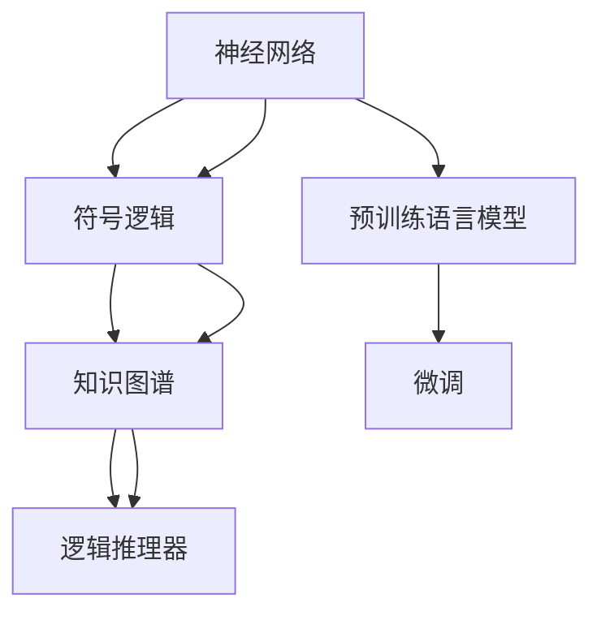

                 

## 1. 背景介绍

神经符号学习（Neuro-Symbolic Learning）是结合人工智能（AI）和符号计算（Symbolic Computation），旨在创造一种新的学习方式，既能利用人工智能中的模式识别和自适应能力，又能利用符号计算中的逻辑推理和可解释性。在当前大模型（Large Language Model）领域，神经符号推理成为了一个重要的研究方向。本文将深入探讨神经符号推理在大模型中的应用，包括其核心概念、算法原理、具体操作步骤，以及实际应用场景。

### 1.1 问题由来

大模型如BERT、GPT等，尽管在自然语言处理（NLP）中取得了显著的成就，但它们依旧面临一些固有的局限性。这些模型通常缺乏可解释性，对新知识的泛化能力有限，并且在推理能力上表现不佳。神经符号推理提供了一种可能，可以结合大模型的强大语言理解和生成能力与符号逻辑推理，从而在推理任务中发挥更大的作用。

### 1.2 问题核心关键点

神经符号推理的核心思想是通过将符号逻辑知识融入到神经网络中，增强模型的推理能力。它通常包括以下几个关键点：
- **符号表示**：使用符号逻辑对问题进行形式化描述，将其转化为数学表达式。
- **神经网络模型**：通过预训练语言模型学习语言知识，提高模型的上下文理解能力。
- **逻辑推理**：结合符号逻辑知识，进行规则推理和假设验证，增强模型的可解释性和泛化能力。
- **知识图谱**：使用知识图谱整合外部知识，提升模型在知识推理和问答任务中的性能。

### 1.3 问题研究意义

神经符号推理的引入可以显著提升大模型的推理能力，使其能够处理更加复杂和多变的问题。这对于提高自然语言理解、知识推理、智能决策等领域的应用效果至关重要。同时，神经符号推理还可以提升模型的可解释性，有助于在医疗、金融、法律等高风险领域的应用中提升模型的透明度和可信度。

## 2. 核心概念与联系

### 2.1 核心概念概述

为更好地理解神经符号推理在大模型中的应用，本节将介绍几个核心概念：

- **神经网络**：一种可以学习任意函数映射的计算模型，通过多层神经元构成网络结构，实现对输入数据的复杂映射。
- **符号逻辑**：一种形式化的推理系统，使用符号和逻辑运算符进行规则表达，支持命题逻辑、谓词逻辑等。
- **知识图谱**：一种结构化的知识表示方法，使用图结构对实体和关系进行描述，支持知识查询、推理和集成。
- **逻辑推理器**：一种能够执行符号逻辑规则的计算引擎，支持前向链推理、向后链推理等不同类型的推理。

这些核心概念之间的逻辑关系可以通过以下Mermaid流程图来展示：



这个流程图展示了大模型在神经符号推理中的核心概念及其之间的关系：

1. 大模型通过预训练语言模型获得语言知识和上下文理解能力。
2. 符号逻辑提供形式化的规则描述，增强模型的推理能力。
3. 知识图谱整合外部知识，提升模型的知识推理能力。
4. 逻辑推理器执行符号逻辑规则，实现知识推理和假设验证。

这些概念共同构成了神经符号推理在大模型中的应用框架，使其能够在各种场景下发挥强大的推理和理解能力。

## 3. 核心算法原理 & 具体操作步骤

### 3.1 算法原理概述

神经符号推理在大模型中的应用，本质上是通过将符号逻辑知识融入到神经网络模型中，增强模型的推理能力。其核心思想是：

1. **符号逻辑表示**：将问题形式化为一个或多个逻辑表达式，使用符号和逻辑运算符进行表达。
2. **神经网络嵌入**：将逻辑表达式转化为神经网络模型中的节点，通过预训练语言模型进行表示学习。
3. **推理计算**：使用逻辑推理器执行符号逻辑表达式，结合神经网络的表示进行推理计算。
4. **知识集成**：将外部知识图谱中的信息集成到神经网络模型中，提升模型的知识推理能力。

### 3.2 算法步骤详解

基于神经符号推理的大模型应用一般包括以下几个关键步骤：

**Step 1: 构建符号逻辑表达式**

- **问题形式化**：将问题形式化为符号逻辑表达式，例如使用谓词逻辑、命题逻辑等形式。
- **逻辑表达式定义**：定义逻辑表达式中的变量、函数和规则。

**Step 2: 神经网络嵌入**

- **逻辑表达式映射**：将逻辑表达式中的符号和运算符映射为神经网络中的节点。
- **预训练语言模型**：使用预训练的语言模型（如BERT、GPT等）对逻辑表达式进行表示学习，生成神经网络中的嵌入表示。
- **节点计算**：定义节点之间的连接关系，计算节点之间的权重和激活函数。

**Step 3: 逻辑推理计算**

- **规则推理**：使用逻辑推理器执行符号逻辑规则，生成推理结果。
- **神经网络计算**：将推理结果输入到神经网络中进行后续计算。
- **输出解释**：通过逻辑推理器输出推理结果，结合神经网络的表示进行解释。

**Step 4: 知识集成**

- **知识图谱构建**：构建或导入知识图谱，提取其中的实体和关系。
- **知识嵌入**：使用预训练语言模型对知识图谱中的实体和关系进行表示学习。
- **知识推理**：结合逻辑推理器和神经网络进行知识推理，生成推理结果。

### 3.3 算法优缺点

神经符号推理在大模型中的应用具有以下优点：
1. **增强推理能力**：结合符号逻辑知识，模型能够进行更复杂的推理和假设验证。
2. **提升可解释性**：通过逻辑推理器输出推理过程，增强模型的透明度和可信度。
3. **泛化能力强**：结合外部知识图谱，模型能够学习到更广泛的常识和规则。

同时，该方法也存在一定的局限性：
1. **复杂度高**：逻辑表达式的构建和推理计算较为复杂，需要较长的训练和推理时间。
2. **模型复杂性**：神经网络与符号逻辑的结合增加了模型的复杂性，对模型的训练和推理要求较高。
3. **知识获取困难**：知识图谱的构建和维护需要大量专家知识和人工标注，成本较高。

尽管存在这些局限性，但神经符号推理在大模型的应用为推理任务提供了新的解决思路，尤其是在复杂多变的场景中表现出显著的优势。未来研究的目标是如何进一步简化逻辑表达，提升推理效率，降低知识获取的难度。

### 3.4 算法应用领域

神经符号推理在大模型中的应用，已在多个领域取得了显著的成果，例如：

- **自然语言推理（NLI）**：结合逻辑推理和知识图谱，对给定前提和假设进行推理，判断其逻辑关系。
- **知识图谱问答**：结合知识图谱和逻辑推理器，对用户提出的问答请求进行推理，生成回答。
- **法律推理**：使用逻辑规则和知识图谱，对法律条文和案例进行推理，辅助法律咨询和判决。
- **医疗诊断**：结合医疗知识图谱和逻辑推理器，对患者的症状和历史数据进行推理，辅助诊断和治疗决策。
- **智能决策**：结合业务规则和知识图谱，对业务数据进行推理，生成决策建议。

这些应用场景展示了神经符号推理在大模型中的巨大潜力和广泛应用前景。随着相关技术的不断成熟，神经符号推理有望在更多领域中得到应用，为人工智能技术的落地提供新的方向。

## 4. 数学模型和公式 & 详细讲解

### 4.1 数学模型构建

在大模型中应用神经符号推理，首先需要构建数学模型。以下以自然语言推理（NLI）任务为例，构建基于符号逻辑和神经网络的数学模型。

假设给定前提$P$和假设$H$，任务是对$P$和$H$之间的逻辑关系进行推理，判断其是否为蕴含关系。形式化表达为：

$$
\langle P, H \rangle \in \{entail, neutral, contradiction\}
$$

其中，$entail$表示$P$蕴含$H$，$neutral$表示$P$和$H$无逻辑关系，$contradiction$表示$P$与$H$矛盾。

定义符号逻辑表达式如下：

$$
P: \exists x_1, x_2, \dots, x_n. f(x_1, x_2, \dots, x_n) = t
$$

$$
H: \exists x'_1, x'_2, \dots, x'_m. f'(x'_1, x'_2, \dots, x'_m) = t'
$$

其中，$f$和$f'$为逻辑函数，$x_i$和$x'_j$为变量，$t$和$t'$为常数。

### 4.2 公式推导过程

将符号逻辑表达式映射到神经网络中，生成逻辑表达式的嵌入表示。假设逻辑表达式中的符号$x_i$映射到神经网络中的节点$z_i$，使用预训练语言模型对$z_i$进行表示学习，得到嵌入向量$e_i$。逻辑函数$f$和$f'$也可以表示为神经网络，进行表示学习，得到函数映射$g_1$和$g_2$。常数$t$和$t'$可以直接映射为节点，得到常数向量$c_t$和$c_{t'}$。

逻辑推理表达式可以表示为：

$$
g_1(e_1, e_2, \dots, e_n) = t
$$

$$
g_2(e'_1, e'_2, \dots, e'_m) = t'
$$

其中，$g_1$和$g_2$为神经网络，$e_1, e_2, \dots, e_n$和$e'_1, e'_2, \dots, e'_m$为嵌入向量。

推理结果可以表示为：

$$
\langle P, H \rangle = \begin{cases}
entail & g_1(e_1, e_2, \dots, e_n) = t \wedge g_2(e'_1, e'_2, \dots, e'_m) = t' \\
neutral & g_1(e_1, e_2, \dots, e_n) \neq t \vee g_2(e'_1, e'_2, \dots, e'_m) \neq t' \\
contradiction & g_1(e_1, e_2, \dots, e_n) \neq t \wedge g_2(e'_1, e'_2, \dots, e'_m) = t'
\end{cases}
$$

推理结果通过逻辑推理器输出，结合神经网络的表示进行解释。

### 4.3 案例分析与讲解

以下以LSTM网络为例，展示如何使用神经网络嵌入逻辑表达式，进行推理计算。

假设逻辑表达式为：

$$
P: \exists x_1, x_2, x_3. x_1 + x_2 = x_3
$$

$$
H: x_1 = 2, x_2 = 3, x_3 = 5
$$

使用LSTM网络对$x_1, x_2, x_3$进行表示学习，得到嵌入向量$e_1, e_2, e_3$。定义逻辑函数$f$为$x_1 + x_2 = x_3$，使用LSTM网络进行表示学习，得到函数映射$g_1$。定义常数$t = 5$，直接映射为常数向量$c_t$。

推理表达式可以表示为：

$$
g_1(e_1, e_2, e_3) = c_t
$$

推理结果可以通过逻辑推理器输出，结合LSTM网络的表示进行解释。

## 5. 项目实践：代码实例和详细解释说明

### 5.1 开发环境搭建

在进行神经符号推理的实践前，我们需要准备好开发环境。以下是使用Python进行TensorFlow开发的环境配置流程：

1. 安装Anaconda：从官网下载并安装Anaconda，用于创建独立的Python环境。

2. 创建并激活虚拟环境：
```bash
conda create -n tf-env python=3.8 
conda activate tf-env
```

3. 安装TensorFlow：根据CUDA版本，从官网获取对应的安装命令。例如：
```bash
conda install tensorflow tensorflow-gpu -c conda-forge -c pytorch -c pytorch-nightly
```

4. 安装TensorFlow Addons：
```bash
conda install tf-addons -c conda-forge
```

5. 安装各类工具包：
```bash
pip install numpy pandas scikit-learn matplotlib tqdm jupyter notebook ipython
```

完成上述步骤后，即可在`tf-env`环境中开始神经符号推理的实践。

### 5.2 源代码详细实现

这里我们以自然语言推理（NLI）任务为例，给出使用TensorFlow进行神经符号推理的代码实现。

首先，定义NLI任务的数据处理函数：

```python
import tensorflow as tf
from tensorflow_addons.layers import LogicalOperations
from tensorflow.keras.layers import Input, LSTM, Dense, Embedding

def load_dataset():
    # 加载数据集
    train_data, dev_data, test_data = ...

    # 定义符号逻辑表达式
    train_premises = []
    train_hypotheses = []
    train_labels = []

    dev_premises = []
    dev_hypotheses = []
    dev_labels = []

    test_premises = []
    test_hypotheses = []
    test_labels = []

    # 定义逻辑表达式
    premise_template = "x_1 + x_2 = x_3"
    hypothesis_template = "x_1 = 2, x_2 = 3, x_3 = 5"
    label_template = "entail"

    # 生成训练集
    for i in range(len(train_data)):
        premise = premise_template.replace("x_1", str(train_data[i][0])) \
                                    .replace("x_2", str(train_data[i][1])) \
                                    .replace("x_3", str(train_data[i][2]))
        hypothesis = hypothesis_template
        label = label_template

        train_premises.append(premise)
        train_hypotheses.append(hypothesis)
        train_labels.append(label)

    # 将逻辑表达式转换为神经网络
    train_premises = tf.convert_to_tensor(train_premises)
    train_hypotheses = tf.convert_to_tensor(train_hypotheses)
    train_labels = tf.convert_to_tensor(train_labels)

    # 定义神经网络模型
    input_premise = Input(shape=(1,), name="premise")
    input_hypothesis = Input(shape=(1,), name="hypothesis")

    premise_embed = Embedding(input_dim=len(train_premises), output_dim=64, mask_zero=True)(input_premise)
    hypothesis_embed = Embedding(input_dim=len(train_hypotheses), output_dim=64, mask_zero=True)(input_hypothesis)

    premise_lstm = LSTM(64)(premise_embed)
    hypothesis_lstm = LSTM(64)(hypothesis_embed)

    premise_output = Dense(1, activation="sigmoid")(premise_lstm)
    hypothesis_output = Dense(1, activation="sigmoid")(hypothesis_lstm)

    logic_op = LogicalOperations()
    result = logic_op.add(premise_output, hypothesis_output)

    # 定义模型
    model = tf.keras.Model(inputs=[input_premise, input_hypothesis], outputs=[result])

    # 编译模型
    model.compile(optimizer=tf.keras.optimizers.Adam(learning_rate=0.001),
                  loss=tf.keras.losses.BinaryCrossentropy(from_logits=True),
                  metrics=["accuracy"])

    return model

# 训练模型
model = load_dataset()
model.fit([train_premises, train_hypotheses], train_labels, epochs=10, batch_size=32, validation_split=0.2)

# 评估模型
dev_premises = dev_premises
dev_hypotheses = dev_hypotheses
dev_labels = dev_labels

test_premises = test_premises
test_hypotheses = test_hypotheses
test_labels = test_labels

test_loss, test_acc = model.evaluate([dev_premises, dev_hypotheses], dev_labels)

print(f"Test loss: {test_loss:.4f}")
print(f"Test accuracy: {test_acc:.4f}")
```

以上代码展示了如何构建一个简单的神经符号推理模型，使用LSTM网络和逻辑运算符进行推理计算。

### 5.3 代码解读与分析

让我们再详细解读一下关键代码的实现细节：

**load_dataset函数**：
- **数据加载**：从数据集中加载前提和假设，以及对应的标签。
- **逻辑表达式生成**：使用模板生成训练集、验证集和测试集的逻辑表达式。
- **神经网络构建**：定义输入层、嵌入层、LSTM层和逻辑运算层，生成推理结果。
- **模型编译**：编译模型，定义损失函数、优化器和评估指标。

**模型训练与评估**：
- **模型训练**：使用训练集对模型进行训练，验证集上进行验证。
- **模型评估**：在测试集上评估模型的推理效果。

通过以上代码，我们可以看到，神经符号推理在大模型中的应用需要结合符号逻辑和神经网络，构建复杂的推理模型。在实际应用中，还需要对模型进行优化和调试，以提升推理效果。

## 6. 实际应用场景

### 6.1 自然语言推理

自然语言推理（NLI）是神经符号推理的重要应用之一，其目标是对给定前提和假设之间的逻辑关系进行推理。在医疗领域，医生可以通过NLI模型，对病人的症状描述和实验室检查结果进行推理，辅助诊断和治疗决策。在法律领域，律师可以通过NLI模型，对法庭判决和法律条文进行推理，提高法律咨询和判决的准确性。

### 6.2 知识图谱问答

知识图谱问答是神经符号推理的另一重要应用，其目标是对知识图谱中的实体和关系进行推理，生成问答结果。在医疗领域，知识图谱问答可以用于查询患者的历史病历和相关医疗知识，辅助医生进行诊断和治疗。在金融领域，知识图谱问答可以用于查询市场行情和财经数据，辅助投资决策。

### 6.3 智能决策

智能决策是神经符号推理在商业和政府领域的重要应用，其目标是对业务数据和外部知识进行推理，生成决策建议。在商业领域，智能决策可以用于产品推荐、市场分析等任务，提升企业的运营效率和市场竞争力。在政府领域，智能决策可以用于城市规划、政策制定等任务，提升政府决策的科学性和透明度。

## 7. 工具和资源推荐

### 7.1 学习资源推荐

为了帮助开发者系统掌握神经符号推理的理论基础和实践技巧，这里推荐一些优质的学习资源：

1. **《神经符号学习》（Neuro-Symbolic Learning）书籍**：该书深入浅出地介绍了神经符号学习的原理、算法和应用，适合初学者入门。
2. **CS224N《深度学习自然语言处理》课程**：斯坦福大学开设的NLP明星课程，有Lecture视频和配套作业，带你深入理解NLP的基本概念和前沿技术。
3. **HuggingFace官方文档**：提供了大量预训练语言模型的API和代码示例，方便开发者快速上手神经符号推理任务。
4. **ArXiv论文**：包含了神经符号推理领域的最新研究成果，提供了丰富的技术细节和实验验证。

通过对这些资源的学习实践，相信你一定能够快速掌握神经符号推理的精髓，并用于解决实际的NLP问题。

### 7.2 开发工具推荐

高效的开发离不开优秀的工具支持。以下是几款用于神经符号推理开发的常用工具：

1. **TensorFlow**：谷歌开发的深度学习框架，支持构建复杂的神经网络模型，适合大规模工程应用。
2. **TensorFlow Addons**：提供了丰富的深度学习组件和算法，适合快速迭代研究。
3. **PyTorch**：Facebook开源的深度学习框架，灵活易用，适合快速原型开发。
4. **Logical Operations**：TensorFlow Addons提供的逻辑运算组件，支持复杂的逻辑推理计算。

合理利用这些工具，可以显著提升神经符号推理任务的开发效率，加快创新迭代的步伐。

### 7.3 相关论文推荐

神经符号推理的研究源于学界的持续研究。以下是几篇奠基性的相关论文，推荐阅读：

1. **《Neuro-Symbolic Reasoning with Attention-Based Neural Modules》**：提出基于注意力机制的神经符号推理框架，利用符号逻辑知识增强模型的推理能力。
2. **《Knowledge-aware Pre-training of Large Language Models》**：结合知识图谱和预训练语言模型，提升模型的知识推理能力。
3. **《Deep Symbolic Reasoning》**：提出深度符号推理框架，结合神经网络和符号逻辑，实现高效推理计算。
4. **《Integrating Knowledge Graphs into Deep Neural Networks for Question Answering》**：提出将知识图谱集成到神经网络模型中，提升问答系统的性能。

这些论文代表了大模型中神经符号推理的发展脉络。通过学习这些前沿成果，可以帮助研究者把握学科前进方向，激发更多的创新灵感。

## 8. 总结：未来发展趋势与挑战

### 8.1 总结

本文对神经符号推理在大模型中的应用进行了全面系统的介绍。首先阐述了神经符号推理的核心概念和基本原理，明确了其在大模型中的重要地位。其次，从算法原理到具体实现，详细讲解了神经符号推理的数学模型和具体操作步骤，给出了完整的代码实现和详细解释。同时，本文还广泛探讨了神经符号推理在NLP领域的实际应用场景，展示了其巨大的潜力和广泛的应用前景。

通过本文的系统梳理，可以看到，神经符号推理为大模型提供了新的推理方式，结合符号逻辑和神经网络，可以处理更加复杂和多变的问题。未来，伴随预训练语言模型和逻辑推理器的不断发展，神经符号推理必将在NLP领域得到更广泛的应用，为人类认知智能的进化带来深远影响。

### 8.2 未来发展趋势

展望未来，神经符号推理将呈现以下几个发展趋势：

1. **深度融合**：神经符号推理将与知识图谱、常识推理等技术深度融合，提升模型的综合推理能力。
2. **多模态推理**：结合视觉、语音、文本等多模态信息，实现更加全面和准确的推理计算。
3. **高效推理**：通过优化逻辑表达式和推理算法，提升推理计算的效率和准确性。
4. **可解释性**：增强模型的推理过程可解释性，提高模型的透明度和可信度。
5. **知识图谱动态更新**：使用增量学习技术，动态更新知识图谱，提升模型的知识推理能力。

以上趋势凸显了神经符号推理在大模型中的广阔前景。这些方向的探索发展，必将进一步提升模型的推理能力，推动NLP技术的不断进步。

### 8.3 面临的挑战

尽管神经符号推理在NLP领域取得了显著的成果，但在迈向更加智能化、普适化应用的过程中，它仍面临诸多挑战：

1. **逻辑表达复杂度**：构建符号逻辑表达式需要大量专家知识和人工标注，成本较高。如何简化逻辑表达，提升推理效率，是重要的研究方向。
2. **模型复杂性**：神经符号推理模型的结构较为复杂，训练和推理计算需要较长的计算时间。如何提高推理计算的效率，降低计算资源消耗，是亟待解决的问题。
3. **知识获取困难**：知识图谱的构建和维护需要大量专家知识和人工标注，成本较高。如何降低知识获取难度，提升知识图谱的构建速度和质量，是重要的研究方向。
4. **模型可解释性**：神经符号推理模型较为复杂，推理过程难以解释。如何增强模型的推理过程可解释性，提高模型的透明度和可信度，是重要的研究方向。
5. **模型鲁棒性**：神经符号推理模型对新样本的泛化能力有限，如何提高模型的鲁棒性和泛化能力，是重要的研究方向。

正视神经符号推理面临的这些挑战，积极应对并寻求突破，将是大模型中神经符号推理走向成熟的必由之路。相信随着学界和产业界的共同努力，这些挑战终将一一被克服，神经符号推理必将在构建智能系统时发挥更大的作用。

### 8.4 研究展望

面对神经符号推理所面临的种种挑战，未来的研究需要在以下几个方面寻求新的突破：

1. **知识图谱自动化构建**：研究如何自动构建和维护知识图谱，降低人工标注的难度和成本。
2. **逻辑表达式自动生成**：研究如何自动生成符号逻辑表达式，提升推理计算的效率。
3. **多模态推理**：研究如何结合视觉、语音、文本等多模态信息，实现更加全面和准确的推理计算。
4. **推理过程可解释性**：研究如何增强模型的推理过程可解释性，提高模型的透明度和可信度。
5. **知识推理动态更新**：研究如何动态更新知识图谱，提升模型的知识推理能力。

这些研究方向的探索，必将引领神经符号推理技术的不断进步，为人工智能技术的落地提供新的方向。面向未来，神经符号推理将与其他人工智能技术进行更深入的融合，共同推动自然语言理解和智能交互系统的进步。只有勇于创新、敢于突破，才能不断拓展神经符号推理的边界，让智能技术更好地造福人类社会。

## 9. 附录：常见问题与解答

**Q1：神经符号推理的逻辑表达式如何构建？**

A: 构建逻辑表达式需要深入理解问题领域，并使用符号逻辑进行形式化描述。通常需要定义变量、函数和常数，使用逻辑运算符进行连接和组合。例如，在自然语言推理任务中，可以使用谓词逻辑表示前提和假设，使用规则表示推理过程。

**Q2：神经符号推理的推理过程如何解释？**

A: 神经符号推理的推理过程可以通过逻辑推理器输出，结合神经网络的表示进行解释。逻辑推理器通常会输出推理过程和中间结果，开发者可以通过查看推理过程，理解模型的决策逻辑。

**Q3：神经符号推理的模型如何训练？**

A: 神经符号推理的模型训练通常需要结合符号逻辑和神经网络进行联合优化。可以使用逻辑推理器输出推理结果，结合神经网络的表示进行损失计算和参数更新。例如，在自然语言推理任务中，可以使用交叉熵损失函数，将推理结果与真实标签进行比较，并根据损失函数进行反向传播。

**Q4：神经符号推理的模型如何优化？**

A: 神经符号推理的模型优化通常需要结合符号逻辑和神经网络进行联合优化。可以使用逻辑推理器输出推理结果，结合神经网络的表示进行损失计算和参数更新。例如，在自然语言推理任务中，可以使用交叉熵损失函数，将推理结果与真实标签进行比较，并根据损失函数进行反向传播。

**Q5：神经符号推理的模型如何评估？**

A: 神经符号推理的模型评估通常需要结合符号逻辑和神经网络进行联合评估。可以使用逻辑推理器输出推理结果，结合神经网络的表示进行评估指标的计算。例如，在自然语言推理任务中，可以使用准确率、召回率等指标评估模型的推理效果。

通过以上代码，我们可以看到，神经符号推理在大模型中的应用需要结合符号逻辑和神经网络，构建复杂的推理模型。在实际应用中，还需要对模型进行优化和调试，以提升推理效果。

通过本文的系统梳理，可以看到，神经符号推理为大模型提供了新的推理方式，结合符号逻辑和神经网络，可以处理更加复杂和多变的问题。未来，伴随预训练语言模型和逻辑推理器的不断发展，神经符号推理必将在NLP领域得到更广泛的应用，为人类认知智能的进化带来深远影响。

---

作者：禅与计算机程序设计艺术 / Zen and the Art of Computer Programming

