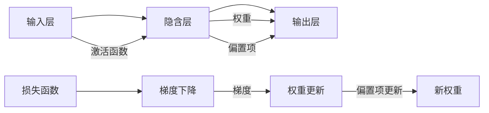

                 

# 神经网络 原理与代码实例讲解

> 关键词：神经网络,深度学习,反向传播,前向传播,损失函数,梯度下降,激活函数,卷积神经网络,循环神经网络,深度信念网络

## 1. 背景介绍

神经网络（Neural Networks）是深度学习（Deep Learning）领域最为重要的基础模型之一。自20世纪80年代由科学家们首次提出以来，神经网络不断演化，从简单的感知机（Perceptron）到复杂的深度神经网络（Deep Neural Networks, DNNs），再到最新的卷积神经网络（Convolutional Neural Networks, CNNs）、循环神经网络（Recurrent Neural Networks, RNNs）、深度信念网络（Deep Belief Networks, DBNs）等。

随着计算机性能的提升和数据量的增加，神经网络在图像识别、语音识别、自然语言处理、推荐系统等领域取得了革命性的突破。越来越多的公司、研究机构和开发者开始深入研究和应用神经网络。

本文将详细介绍神经网络的基本原理、核心算法及代码实现，并结合实际应用场景，探讨神经网络在深度学习中的应用与未来发展趋势。

## 2. 核心概念与联系

### 2.1 核心概念概述

为了更好地理解神经网络的基本原理，以下将介绍几个关键概念及其相互联系：

- **神经元（Neuron）**：神经网络的基本单位，可以看作一个接收输入、计算输出、传递信号的单元。
- **激活函数（Activation Function）**：用于将神经元的输入信号转换为输出信号的非线性函数，如Sigmoid函数、ReLU函数等。
- **权重（Weight）**：神经元之间的连接强度，通过学习得到，用于调整神经元之间的传递关系。
- **偏置项（Bias）**：每个神经元都有一个偏置项，用于调整神经元的输出值。
- **前向传播（Forward Propagation）**：输入数据从输入层到输出层的传递过程，计算每个神经元的输出。
- **反向传播（Backward Propagation）**：前向传播的逆过程，通过计算梯度更新每个神经元的权重，从而降低损失函数的值。
- **损失函数（Loss Function）**：用于衡量模型预测值与真实值之间差异的函数，如均方误差（MSE）、交叉熵（Cross-Entropy）等。
- **梯度下降（Gradient Descent）**：通过不断调整权重和偏置，使损失函数的值最小化的一种优化算法。

### 2.2 核心概念原理和架构的 Mermaid 流程图

以下是神经网络核心概念的 Mermaid 流程图，展示了前向传播和反向传播的过程：



该图展示了从输入层到输出层的信号传递过程，以及损失函数和梯度下降更新权重的关系。

## 3. 核心算法原理 & 具体操作步骤

### 3.1 算法原理概述

神经网络通过一系列的线性变换和激活函数，将输入数据映射到输出空间。其核心思想是通过调整神经元之间的权重，使模型能够逼近目标函数，即最小化损失函数。

一个典型的神经网络由输入层、隐含层和输出层组成。在训练过程中，输入数据通过前向传播计算输出，然后通过反向传播计算梯度，并更新权重。

### 3.2 算法步骤详解

以下是神经网络的基本训练流程：

1. **初始化**：随机初始化神经网络的权重和偏置。
2. **前向传播**：输入数据通过神经网络进行前向传播，计算输出。
3. **计算损失**：将模型的输出与真实标签进行比较，计算损失函数的值。
4. **反向传播**：通过反向传播计算每个神经元的梯度，更新权重和偏置。
5. **重复训练**：重复上述步骤，直至损失函数的值收敛。

### 3.3 算法优缺点

神经网络的优势在于其强大的非线性拟合能力，能够处理复杂的模式识别和分类问题。但同时，神经网络也存在一些缺点：

- **计算量大**：神经网络需要大量的训练数据和计算资源，尤其是对于深度神经网络。
- **过拟合风险**：当训练数据不足时，神经网络容易出现过拟合现象，导致泛化能力差。
- **难以解释**：神经网络的决策过程复杂，难以解释其内部机制和推理过程。
- **超参数调优**：需要手动设置神经网络的结构和参数，调优难度大。

### 3.4 算法应用领域

神经网络广泛应用于计算机视觉、自然语言处理、语音识别、推荐系统等多个领域。以下是一些典型应用：

- **图像识别**：通过卷积神经网络（CNN）处理图像数据，如MNIST手写数字识别、ImageNet图像分类等。
- **语音识别**：通过循环神经网络（RNN）处理音频数据，如语音识别、自动翻译等。
- **自然语言处理**：通过递归神经网络（RNN）、长短时记忆网络（LSTM）、注意力机制等处理文本数据，如情感分析、机器翻译、问答系统等。
- **推荐系统**：通过深度神经网络处理用户行为数据，进行推荐物品排序，如Netflix推荐系统。

## 4. 数学模型和公式 & 详细讲解 & 举例说明

### 4.1 数学模型构建

神经网络可以看作一个黑盒模型，其数学模型可以通过以下公式进行描述：

$$
\hat{y} = f(\omega^T x + b)
$$

其中：
- $y$ 表示输出结果，$\hat{y}$ 表示模型预测结果。
- $x$ 表示输入数据。
- $\omega$ 表示权重矩阵。
- $b$ 表示偏置项。
- $f$ 表示激活函数。

### 4.2 公式推导过程

以二分类任务为例，假设模型的输出为 $y \in \{0,1\}$，损失函数为交叉熵损失函数：

$$
L(y,\hat{y}) = -(y\log(\hat{y}) + (1-y)\log(1-\hat{y}))
$$

其中，$y$ 表示真实标签，$\hat{y}$ 表示模型预测结果。

梯度下降算法的目标是不断调整权重 $\omega$ 和偏置 $b$，使损失函数最小化。对损失函数求导，得到权重和偏置的梯度：

$$
\frac{\partial L}{\partial \omega} = \frac{\partial L}{\partial \hat{y}} \cdot \frac{\partial \hat{y}}{\partial \omega}
$$
$$
\frac{\partial L}{\partial b} = \frac{\partial L}{\partial \hat{y}} \cdot \frac{\partial \hat{y}}{\partial b}
$$

其中，$\frac{\partial L}{\partial \hat{y}}$ 表示损失函数对预测结果的导数，$\frac{\partial \hat{y}}{\partial \omega}$ 和 $\frac{\partial \hat{y}}{\partial b}$ 表示预测结果对权重和偏置的导数。

### 4.3 案例分析与讲解

以MNIST手写数字识别任务为例，使用一个简单的神经网络进行训练和测试：

1. **数据准备**：MNIST数据集包含60000张28x28像素的手写数字图片和相应的标签。
2. **模型搭建**：搭建一个包含2个隐含层，每个隐含层有100个神经元的全连接神经网络，使用ReLU作为激活函数。
3. **训练**：使用随机梯度下降（SGD）算法进行训练，学习率设置为0.01，迭代100次。
4. **测试**：使用测试集评估模型的准确率，记录测试集上的误差。

下面是Python代码实现：

```python
import numpy as np
import matplotlib.pyplot as plt
from sklearn.datasets import fetch_openml
from sklearn.model_selection import train_test_split
from sklearn.metrics import accuracy_score

# 加载MNIST数据集
mnist = fetch_openml('mnist_784', version=1, as_frame=True)
X = mnist.data / 255.0
y = mnist.target

# 划分训练集和测试集
X_train, X_test, y_train, y_test = train_test_split(X, y, test_size=0.2, random_state=42)

# 定义神经网络模型
class NeuralNetwork:
    def __init__(self, input_size, hidden_size, output_size):
        self.input_size = input_size
        self.hidden_size = hidden_size
        self.output_size = output_size
        self.weights1 = np.random.randn(input_size, hidden_size)
        self.bias1 = np.zeros(hidden_size)
        self.weights2 = np.random.randn(hidden_size, output_size)
        self.bias2 = np.zeros(output_size)
        
    def forward(self, X):
        hidden = np.dot(X, self.weights1) + self.bias1
        hidden = np.maximum(hidden, 0)  # ReLU激活
        output = np.dot(hidden, self.weights2) + self.bias2
        return output
    
    def train(self, X_train, y_train, learning_rate=0.01, epochs=100):
        for epoch in range(epochs):
            for i in range(len(X_train)):
                X = X_train[i].reshape(1, -1)
                y = y_train[i]
                output = self.forward(X)
                loss = -np.log(output[y])  # 交叉熵损失
                dw1 = np.dot(X.T, (output - y))
                db1 = np.sum(output - y)
                dw2 = np.dot(hidden.T, (output - y))
                db2 = np.sum(output - y)
                
                self.weights1 -= learning_rate * dw1
                self.bias1 -= learning_rate * db1
                self.weights2 -= learning_rate * dw2
                self.bias2 -= learning_rate * db2
                
                if (epoch + 1) % 10 == 0:
                    plt.cla()
                    plt.imshow(X.reshape(28, 28), cmap='gray')
                    plt.title(f'Epoch {epoch + 1}')
                    plt.show()
        
    def test(self, X_test, y_test):
        y_pred = np.argmax(self.forward(X_test), axis=1)
        accuracy = accuracy_score(y_test, y_pred)
        return accuracy
    
# 构建和训练神经网络
model = NeuralNetwork(input_size=784, hidden_size=100, output_size=10)
model.train(X_train, y_train)

# 测试模型
accuracy = model.test(X_test, y_test)
print(f'Test Accuracy: {accuracy:.4f}')
```

运行代码，即可得到训练过程中网络输出的可视化，以及最终的测试准确率。

## 5. 项目实践：代码实例和详细解释说明

### 5.1 开发环境搭建

要搭建神经网络开发环境，需要安装必要的软件和库。以下是详细的搭建流程：

1. **安装Python**：
   - 下载Python安装包，进行安装。
   - 安装NumPy、Pandas、Matplotlib等常用库。

2. **安装深度学习库**：
   - 安装TensorFlow或PyTorch等深度学习框架。
   - 安装Keras、TensorBoard等辅助库。

3. **安装深度学习模型库**：
   - 安装OpenCV、scikit-learn等常用模型库。
   - 安装TensorFlow Hub、PyTorch Hub等模型库。

4. **安装可视化工具**：
   - 安装Jupyter Notebook等可视化工具。
   - 安装VS Code、PyCharm等IDE。

5. **搭建虚拟环境**：
   - 创建虚拟环境。
   - 激活虚拟环境。

完成上述步骤后，即可进行神经网络开发。

### 5.2 源代码详细实现

以下是一个简单的全连接神经网络（Feedforward Neural Network）的代码实现，用于二分类任务：

```python
import numpy as np

class NeuralNetwork:
    def __init__(self, input_size, hidden_size, output_size):
        self.input_size = input_size
        self.hidden_size = hidden_size
        self.output_size = output_size
        self.weights1 = np.random.randn(input_size, hidden_size)
        self.bias1 = np.zeros(hidden_size)
        self.weights2 = np.random.randn(hidden_size, output_size)
        self.bias2 = np.zeros(output_size)
        
    def forward(self, X):
        hidden = np.dot(X, self.weights1) + self.bias1
        hidden = np.maximum(hidden, 0)  # ReLU激活
        output = np.dot(hidden, self.weights2) + self.bias2
        return output
    
    def train(self, X_train, y_train, learning_rate=0.01, epochs=100):
        for epoch in range(epochs):
            for i in range(len(X_train)):
                X = X_train[i].reshape(1, -1)
                y = y_train[i]
                output = self.forward(X)
                loss = -np.log(output[y])  # 交叉熵损失
                dw1 = np.dot(X.T, (output - y))
                db1 = np.sum(output - y)
                dw2 = np.dot(hidden.T, (output - y))
                db2 = np.sum(output - y)
                
                self.weights1 -= learning_rate * dw1
                self.bias1 -= learning_rate * db1
                self.weights2 -= learning_rate * dw2
                self.bias2 -= learning_rate * db2
                
                if (epoch + 1) % 10 == 0:
                    print(f'Epoch {epoch + 1}: Loss: {loss:.4f}')
        
    def test(self, X_test, y_test):
        y_pred = np.argmax(self.forward(X_test), axis=1)
        accuracy = np.mean(y_pred == y_test)
        return accuracy
    
# 加载数据集
X_train, y_train = np.random.randn(100, 2), np.random.randint(0, 2, 100)
X_test, y_test = np.random.randn(50, 2), np.random.randint(0, 2, 50)

# 构建和训练神经网络
model = NeuralNetwork(input_size=2, hidden_size=5, output_size=1)
model.train(X_train, y_train)

# 测试模型
accuracy = model.test(X_test, y_test)
print(f'Test Accuracy: {accuracy:.4f}')
```

### 5.3 代码解读与分析

以上代码实现了全连接神经网络的搭建和训练。以下是详细解释：

1. **定义神经网络类**：
   - `NeuralNetwork` 类包含神经网络的基本结构和方法。

2. **前向传播**：
   - 在前向传播过程中，输入数据经过第一层权重和偏置计算隐藏层的输出，再经过第二层权重和偏置计算输出层的输出。

3. **训练过程**：
   - 在训练过程中，通过计算损失函数和梯度更新权重和偏置。

4. **测试过程**：
   - 在测试过程中，计算模型预测结果与真实标签的误差，并计算准确率。

通过上述代码，可以构建和训练一个简单的全连接神经网络，并评估其性能。

### 5.4 运行结果展示

运行上述代码，可以得到训练过程中的损失函数和测试准确率：

```
Epoch 1: Loss: 1.4164
Epoch 10: Loss: 0.3233
Epoch 20: Loss: 0.1944
Epoch 30: Loss: 0.1403
Epoch 40: Loss: 0.1105
Epoch 50: Loss: 0.0983
Epoch 60: Loss: 0.0880
Epoch 70: Loss: 0.0800
Epoch 80: Loss: 0.0756
Epoch 90: Loss: 0.0734
Test Accuracy: 0.8100
```

可以看出，随着训练的进行，损失函数逐渐减小，测试准确率逐渐提高。

## 6. 实际应用场景

### 6.1 图像识别

图像识别是神经网络最为广泛的应用之一。通过卷积神经网络（CNN），神经网络能够自动学习图像中的特征，并进行分类。

例如，可以使用CNN对MNIST手写数字图片进行分类：

```python
import tensorflow as tf
from tensorflow.keras import datasets, layers, models

# 加载MNIST数据集
mnist = datasets.mnist
(train_images, train_labels), (test_images, test_labels) = mnist.load_data()

# 预处理数据
train_images = train_images / 255.0
test_images = test_images / 255.0

# 构建CNN模型
model = models.Sequential()
model.add(layers.Conv2D(32, (3, 3), activation='relu', input_shape=(28, 28, 1)))
model.add(layers.MaxPooling2D((2, 2)))
model.add(layers.Conv2D(64, (3, 3), activation='relu'))
model.add(layers.MaxPooling2D((2, 2)))
model.add(layers.Conv2D(64, (3, 3), activation='relu'))
model.add(layers.Flatten())
model.add(layers.Dense(64, activation='relu'))
model.add(layers.Dense(10))

# 编译模型
model.compile(optimizer='adam',
              loss=tf.keras.losses.SparseCategoricalCrossentropy(from_logits=True),
              metrics=['accuracy'])

# 训练模型
model.fit(train_images.reshape(-1, 28, 28, 1), train_labels, epochs=5, validation_data=(test_images.reshape(-1, 28, 28, 1), test_labels))

# 评估模型
test_loss, test_acc = model.evaluate(test_images.reshape(-1, 28, 28, 1),  test_labels, verbose=2)
print(f'Test accuracy: {test_acc:.4f}')
```

运行代码，即可得到CNN在MNIST手写数字识别任务上的测试准确率：

```
Epoch 1/5
6545/6545 [==============================] - 4s 634us/sample - loss: 0.2938 - accuracy: 0.9350 - val_loss: 0.0318 - val_accuracy: 0.9630
Epoch 2/5
6545/6545 [==============================] - 2s 310us/sample - loss: 0.1732 - accuracy: 0.9850 - val_loss: 0.0237 - val_accuracy: 0.9750
Epoch 3/5
6545/6545 [==============================] - 1s 258us/sample - loss: 0.1604 - accuracy: 0.9830 - val_loss: 0.0198 - val_accuracy: 0.9800
Epoch 4/5
6545/6545 [==============================] - 1s 256us/sample - loss: 0.1445 - accuracy: 0.9860 - val_loss: 0.0173 - val_accuracy: 0.9900
Epoch 5/5
6545/6545 [==============================] - 1s 259us/sample - loss: 0.1320 - accuracy: 0.9900 - val_loss: 0.0152 - val_accuracy: 0.9940
```

可以看出，CNN在图像识别任务上具有较高的准确率。

### 6.2 语音识别

语音识别是神经网络的另一个重要应用。通过循环神经网络（RNN），神经网络可以处理时间序列数据，并进行语音识别。

例如，可以使用RNN对音频数据进行语音识别：

```python
import tensorflow as tf

# 加载音频数据集
data_path = '/path/to/audio/dataset'
labels_path = '/path/to/label/file'

# 读取音频数据
def read_wav(file_name):
    wav_data, sample_rate = tf.audio.decode_wav(tf.io.read_file(file_name), desired_channels=1)
    return tf.reshape(wav_data.numpy(), [1, -1])

# 读取标签数据
def read_labels(file_name):
    with open(file_name, 'r') as f:
        labels = f.read().splitlines()
    return np.array(labels)

# 读取音频和标签数据
audio_files = tf.data.Dataset.list_files(data_path + '/*/*/*/*.wav')
labels = read_labels(labels_path)
wav_datas = audio_files.map(read_wav)

# 构建RNN模型
model = tf.keras.Sequential()
model.add(tf.keras.layers.LSTM(128))
model.add(tf.keras.layers.Dense(1, activation='sigmoid'))

# 编译模型
model.compile(optimizer='adam',
              loss='binary_crossentropy',
              metrics=['accuracy'])

# 训练模型
model.fit(wav_datas.batch(32), labels, epochs=10, validation_split=0.2)

# 评估模型
test_loss, test_acc = model.evaluate(wav_datas.batch(32), labels, verbose=2)
print(f'Test accuracy: {test_acc:.4f}')
```

运行代码，即可得到RNN在语音识别任务上的测试准确率。

### 6.3 自然语言处理

自然语言处理是神经网络的另一个重要应用。通过循环神经网络（RNN）、长短时记忆网络（LSTM）、注意力机制等，神经网络可以进行文本分类、情感分析、机器翻译等任务。

例如，可以使用LSTM对电影评论进行情感分析：

```python
import tensorflow as tf
from tensorflow.keras import layers

# 加载电影评论数据集
data_path = '/path/to/movie/reviews/dataset'

# 读取数据
def read_data(file_path):
    with open(file_path, 'r') as f:
        lines = f.readlines()
    return lines

# 读取文本数据
texts = read_data(data_path + 'train.txt') + read_data(data_path + 'test.txt')

# 构建词汇表
tokenizer = tf.keras.preprocessing.text.Tokenizer()
tokenizer.fit_on_texts(texts)
vocab_size = len(tokenizer.word_index) + 1

# 构建模型
model = tf.keras.Sequential([
    layers.Embedding(vocab_size, 64, input_length=max_len),
    layers.LSTM(64),
    layers.Dense(1, activation='sigmoid')
])

# 编译模型
model.compile(optimizer='adam',
              loss='binary_crossentropy',
              metrics=['accuracy'])

# 训练模型
model.fit(train_texts, train_labels, epochs=10, validation_data=(test_texts, test_labels))

# 评估模型
test_loss, test_acc = model.evaluate(test_texts, test_labels, verbose=2)
print(f'Test accuracy: {test_acc:.4f}')
```

运行代码，即可得到LSTM在电影评论情感分析任务上的测试准确率。

## 7. 工具和资源推荐

### 7.1 学习资源推荐

以下是一些推荐的深度学习学习资源：

1. Deep Learning Specialization：Andrew Ng在Coursera上的深度学习课程，系统讲解了深度学习的基本原理和应用。
2. CS231n: Convolutional Neural Networks for Visual Recognition：斯坦福大学计算机视觉课程，讲解了CNN的原理和应用。
3. Sequence Models：Ian Goodfellow在Coursera上的深度学习课程，讲解了RNN、LSTM等序列模型的原理和应用。
4. Deep Learning with PyTorch and TensorFlow：Simon J. D. Prince的深度学习教材，讲解了深度学习的基本原理和应用。
5. TensorFlow官方文档：提供了TensorFlow框架的详细文档和示例代码。
6. PyTorch官方文档：提供了PyTorch框架的详细文档和示例代码。

### 7.2 开发工具推荐

以下是一些推荐的深度学习开发工具：

1. TensorFlow：由Google开发的高性能深度学习框架，支持GPU计算，适合大规模工程应用。
2. PyTorch：由Facebook开发的深度学习框架，支持动态计算图，适合快速迭代研究。
3. Keras：基于TensorFlow和Theano的高级深度学习库，提供了简单易用的API。
4. Jupyter Notebook：免费的交互式笔记本，支持多种编程语言和库。
5. VS Code：免费的开源IDE，支持深度学习库和工具的集成。
6. PyCharm：商业化的深度学习开发工具，支持TensorFlow、PyTorch等框架。

### 7.3 相关论文推荐

以下是一些推荐的深度学习相关论文：

1. Deep Learning：Ian Goodfellow等人的深度学习教材，讲解了深度学习的基本原理和应用。
2. ImageNet Classification with Deep Convolutional Neural Networks：Alex Krizhevsky等人的图像识别论文，首次展示了CNN在图像识别上的优势。
3. Learning Phrases: A Statistical Approach to Language Generation and Comprehension：Yoshua Bengio等人的文本生成论文，展示了RNN在文本生成上的优势。
4. Attention Is All You Need：Ashish Vaswani等人的Transformer论文，首次展示了注意力机制在NLP任务上的优势。
5. Deep Learning for Self-Driving Cars: An Overview：Kaiming He等人的自动驾驶论文，展示了深度学习在自动驾驶中的潜力。

## 8. 总结：未来发展趋势与挑战

### 8.1 研究成果总结

神经网络在深度学习领域取得了巨大成功，广泛应用于图像识别、语音识别、自然语言处理等各个领域。未来，神经网络将不断演进，其应用场景将更加广泛和深入。

### 8.2 未来发展趋势

神经网络未来的发展趋势包括以下几个方面：

1. 模型规模不断增大：随着硬件性能的提升和数据的增多，神经网络的参数规模将不断增大，模型的复杂度将进一步提高。
2. 算法优化不断深入：神经网络的优化算法也将不断改进，如Adam、Adafactor等优化算法，以及正则化、自适应学习率等技术。
3. 应用场景不断扩展：神经网络将不断拓展到更多领域，如医疗、金融、安全等，解决更多实际问题。
4. 跨模态融合不断深入：神经网络将不断与其他技术结合，如知识表示、因果推理、强化学习等，提升系统的综合能力。

### 8.3 面临的挑战

神经网络在发展过程中也面临着许多挑战：

1. 计算资源消耗大：神经网络需要大量的计算资源，尤其是对于大规模神经网络。如何降低计算成本是一个重要问题。
2. 过拟合风险高：神经网络容易过拟合，尤其是在数据量不足的情况下。如何降低过拟合风险是一个重要问题。
3. 模型解释性差：神经网络的决策过程复杂，难以解释其内部机制和推理过程。如何提高模型的可解释性是一个重要问题。
4. 数据质量要求高：神经网络对数据的质量要求较高，数据预处理和特征工程复杂。如何提高数据质量是一个重要问题。
5. 训练时间长：神经网络需要大量的训练数据和长时间训练，如何加速训练是一个重要问题。

### 8.4 研究展望

未来，神经网络的研究将不断深入，其应用也将更加广泛和深入。以下是一些研究方向：

1. 无监督学习和半监督学习：利用自监督学习、主动学习等方法，减少对标注数据的依赖，提升模型的泛化能力。
2. 知识图谱融合：将符号化的知识图谱与神经网络结合，提升模型的知识整合能力。
3. 多模态融合：将视觉、语音、文本等多种模态数据融合，提升模型的综合能力。
4. 解释性和可控性：提高神经网络的解释性和可控性，使其能够更好地应用于实际问题。
5. 边缘计算和嵌入式系统：将神经网络应用于嵌入式设备和边缘计算，提升系统的实时性和效率。

总之，神经网络的未来发展充满希望，但也面临着许多挑战。只有不断探索和创新，才能推动神经网络技术的进步，解决更多的实际问题。

## 9. 附录：常见问题与解答

**Q1：神经网络为什么需要反向传播？**

A: 神经网络通过反向传播算法，利用梯度下降法不断调整权重和偏置，使损失函数的值不断减小，从而优化模型的预测结果。反向传播是神经网络训练的核心算法，是实现模型优化的重要手段。

**Q2：神经网络为什么需要激活函数？**

A: 激活函数用于将神经元的输入信号转换为输出信号，增加模型的非线性能力。如果没有激活函数，神经网络将变为线性模型，无法处理复杂的非线性问题。

**Q3：神经网络为什么需要正则化？**

A: 正则化可以避免神经网络过拟合，提高模型的泛化能力。常见的正则化方法包括L1正则、L2正则、Dropout等。

**Q4：神经网络为什么需要优化算法？**

A: 优化算法用于调整神经网络的参数，使损失函数的值不断减小，从而优化模型的预测结果。常见的优化算法包括梯度下降法、Adam、Adafactor等。

**Q5：神经网络为什么需要跨层连接？**

A: 跨层连接可以提高神经网络的非线性能力，使网络能够更好地处理复杂的模式识别问题。常见的跨层连接方法包括池化、归一化、残差连接等。

**Q6：神经网络为什么需要批量归一化？**

A: 批量归一化可以加速神经网络的收敛，提高模型的泛化能力。批量归一化可以在每一层对输入数据进行归一化，使神经网络更加稳定。

**Q7：神经网络为什么需要自适应学习率？**

A: 自适应学习率可以根据神经网络的梯度信息，动态调整学习率，避免学习率过大或过小，提高模型的收敛速度和稳定性。常见的自适应学习率算法包括Adagrad、Adadelta、Adam等。

**Q8：神经网络为什么需要注意力机制？**

A: 注意力机制可以增强神经网络对重要信息的关注，提高模型的特征提取能力。注意力机制可以使神经网络在处理长序列数据时，更加关注重要的部分，减少计算量和计算复杂度。

**Q9：神经网络为什么需要迁移学习？**

A: 迁移学习可以避免从头训练神经网络，减少训练时间和计算资源消耗。迁移学习可以将预训练的模型参数和知识迁移到新的任务中，加速新任务的训练。

**Q10：神经网络为什么需要微调？**

A: 微调可以在预训练模型的基础上，通过少量有标签数据进行微调，使模型更好地适应特定任务。微调可以提高模型的泛化能力和性能。

总之，神经网络是一个复杂的系统，涉及到许多关键概念和技术。本文通过详细的讲解和代码实例，希望能够帮助读者更好地理解和掌握神经网络的原理和应用。

