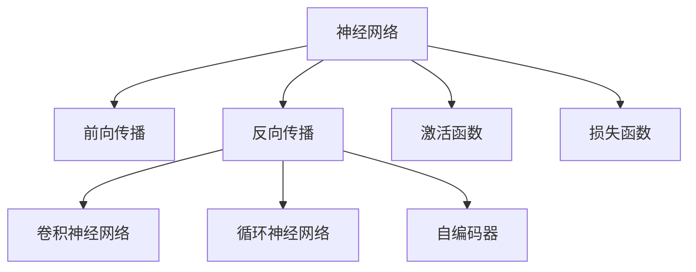

                 

# 神经网络(Neural Networks) - 原理与代码实例讲解

> 关键词：神经网络,深度学习,卷积神经网络,循环神经网络,自编码器,卷积层,池化层,全连接层,激活函数,前向传播,反向传播

## 1. 背景介绍

### 1.1 问题由来
深度学习是人工智能领域的一个重要分支，神经网络作为深度学习中的核心模型，近年来在计算机视觉、自然语言处理、语音识别等领域取得了突破性进展。神经网络模拟人类大脑的神经元结构，通过多层非线性变换，可以实现复杂的特征提取和模式识别任务。

然而，神经网络的原理和实现方式对初学者来说，可能比较抽象。本文旨在通过系统介绍神经网络的原理和实际代码实例，帮助读者理解其核心概念和实现细节。

## 2. 核心概念与联系

### 2.1 核心概念概述

为更好地理解神经网络的原理，本节将介绍几个密切相关的核心概念：

- 神经网络（Neural Network）：由神经元（Neuron）和连接权重（Weight）构成的计算图，通过多层非线性变换实现复杂数据的映射。

- 前向传播（Forward Propagation）：神经网络的计算过程，即输入数据通过计算图进行逐层传递，最终输出预测结果。

- 反向传播（Backpropagation）：基于梯度下降的优化算法，通过计算损失函数对每个参数的偏导数，反向更新权重，使得模型输出与真实标签之间的误差最小化。

- 卷积神经网络（Convolutional Neural Network, CNN）：适用于图像处理和计算机视觉任务的神经网络，通过卷积层、池化层等结构实现空间特征提取。

- 循环神经网络（Recurrent Neural Network, RNN）：适用于序列数据（如时间序列、文本序列等）处理的神经网络，通过循环结构捕捉序列数据的时序依赖。

- 自编码器（Autoencoder）：一种无监督学习模型，用于降维、数据压缩等任务，通过编码器-解码器的结构进行数据重构。

- 激活函数（Activation Function）：神经元输出非线性的重要组成部分，常用的激活函数有sigmoid、ReLU、tanh等。

- 损失函数（Loss Function）：用于衡量模型预测输出与真实标签之间差异的函数，常见的有均方误差、交叉熵等。

这些核心概念之间的逻辑关系可以通过以下Mermaid流程图来展示：



这个流程图展示了几大类神经网络模型及其之间的关系：

1. 神经网络是整个模型的基础。
2. 前向传播和反向传播是神经网络计算的两种主要方式。
3. 卷积神经网络和循环神经网络是两种常用的神经网络结构。
4. 自编码器是一种特殊类型的神经网络，用于数据压缩和降维等任务。
5. 激活函数和损失函数是神经网络中非常重要的组件。

这些概念共同构成了神经网络的框架，使其能够灵活应对各种复杂的计算任务。通过理解这些核心概念，我们可以更好地把握神经网络的工作原理和优化方向。

## 3. 核心算法原理 & 具体操作步骤
### 3.1 算法原理概述

神经网络的计算过程可以分为两个主要部分：前向传播和反向传播。

**前向传播**：神经网络的输入数据经过逐层传递，通过一系列的线性变换和非线性变换，最终输出一个预测结果。对于给定的输入 $x$，前向传播过程可以表示为：

$$ y = h(Wx + b) $$

其中 $h$ 是激活函数，$W$ 和 $b$ 分别是权重和偏置，$y$ 是输出。

**反向传播**：反向传播算法通过计算损失函数对每个参数的偏导数，反向更新权重，使得模型输出与真实标签之间的误差最小化。假设损失函数为 $L(y, t)$，其中 $t$ 是真实标签。则反向传播的优化目标是：

$$ \min_{\theta} L(y, t) $$

其中 $\theta$ 包括所有的权重和偏置参数。通过链式法则，可以计算每个参数的梯度：

$$ \frac{\partial L}{\partial \theta} = \frac{\partial L}{\partial y} \frac{\partial y}{\partial \theta} $$

其中 $\frac{\partial y}{\partial \theta}$ 可以通过链式法则逐层展开计算。

### 3.2 算法步骤详解

神经网络的训练过程通常包括以下几个关键步骤：

**Step 1: 准备数据集**

- 收集和预处理训练集 $D = \{(x_i, t_i)\}_{i=1}^N$，其中 $x_i$ 是输入，$t_i$ 是标签。
- 将数据集划分为训练集、验证集和测试集，用于模型训练、调参和性能评估。

**Step 2: 设计模型架构**

- 选择合适的神经网络结构，如卷积神经网络（CNN）、循环神经网络（RNN）、多层感知器（MLP）等。
- 设计每个层的网络参数，如卷积核大小、步长、池化大小等。
- 确定激活函数和损失函数。

**Step 3: 初始化参数**

- 随机初始化模型的权重和偏置参数。
- 通常使用正态分布或均匀分布进行初始化。

**Step 4: 前向传播**

- 对训练集中的每个样本 $x_i$，进行前向传播计算输出 $y_i$。
- 使用损失函数计算当前样本的损失 $L_i$。

**Step 5: 反向传播**

- 计算损失函数对每个参数的梯度。
- 使用梯度下降等优化算法更新权重和偏置。

**Step 6: 周期性验证**

- 周期性地在验证集上评估模型性能，调整超参数和模型结构。
- 避免模型在训练集上过拟合。

**Step 7: 测试和部署**

- 在测试集上评估模型性能，输出最终结果。
- 使用训练好的模型进行实际应用。

以上是神经网络训练的一般流程。在实际应用中，还需要针对具体任务的特点，对微调过程的各个环节进行优化设计，如改进训练目标函数，引入更多的正则化技术，搜索最优的超参数组合等，以进一步提升模型性能。

### 3.3 算法优缺点

神经网络在深度学习中具有以下优点：

1. 非线性能力：通过多层非线性变换，能够学习到任意复杂的数据映射关系。
2. 自动特征提取：不需要手动设计特征，网络自动提取输入数据的特征。
3. 泛化能力：通过大量数据训练，能够获得较好的泛化性能。

同时，神经网络也存在一些缺点：

1. 参数复杂度：神经网络模型参数量大，训练时间长。
2. 过拟合风险：如果训练数据量不足，容易发生过拟合。
3. 计算资源消耗：训练和推理过程中需要大量的计算资源。
4. 模型复杂度：模型结构复杂，难以解释和调试。

尽管存在这些局限性，但神经网络作为深度学习中的核心模型，仍然在大规模数据驱动的任务中发挥着重要作用。未来研究需要进一步探索降低模型复杂度、提高模型效率、增强模型可解释性等方向。

### 3.4 算法应用领域

神经网络在多个领域中得到了广泛的应用，例如：

- 计算机视觉：图像分类、目标检测、图像生成等任务。通过卷积层和池化层提取图像特征。
- 自然语言处理：文本分类、情感分析、机器翻译等任务。通过RNN或Transformer模型处理文本序列。
- 语音识别：语音转文本、语音情感分析等任务。通过CNN或RNN处理音频信号。
- 推荐系统：用户行为分析、个性化推荐等任务。通过神经网络学习用户和物品的协同关系。
- 游戏AI：策略制定、决策优化等任务。通过神经网络优化决策过程。

除了上述这些经典应用外，神经网络还被创新性地应用于更多场景中，如医学影像分析、金融数据分析、自动驾驶等，为各行各业带来了新的技术突破。

## 4. 数学模型和公式 & 详细讲解 & 举例说明

### 4.1 数学模型构建

本节将使用数学语言对神经网络的计算过程进行更加严格的刻画。

假设神经网络包含 $n$ 个隐藏层，每个隐藏层包含 $m$ 个神经元，输出层包含 $k$ 个神经元。记 $x$ 为输入，$W$ 和 $b$ 为参数，$h$ 为激活函数。则前向传播的计算过程可以表示为：

$$ y = h(W_n h_{n-1} W_{n-1} h_{n-2} \cdots W_1 h_0 x + b_n h_{n-1} W_{n-1} h_{n-2} \cdots W_1 x + b_1) $$

其中 $W_i$ 和 $b_i$ 分别是第 $i$ 层的权重和偏置参数，$h_i$ 是激活函数。

### 4.2 公式推导过程

以下我们以单层神经网络为例，推导前向传播和反向传播的具体计算过程。

假设单层神经网络包含 $m$ 个神经元，输入为 $x$，输出为 $y$，激活函数为 $h$。则前向传播的计算公式为：

$$ y = h(Wx + b) $$

其中 $W$ 是权重矩阵，$b$ 是偏置向量。

根据链式法则，损失函数 $L$ 对权重 $W$ 和偏置 $b$ 的偏导数为：

$$ \frac{\partial L}{\partial W} = \frac{\partial L}{\partial y} \frac{\partial y}{\partial W} $$
$$ \frac{\partial L}{\partial b} = \frac{\partial L}{\partial y} \frac{\partial y}{\partial b} $$

其中 $\frac{\partial y}{\partial W}$ 和 $\frac{\partial y}{\partial b}$ 可以通过链式法则逐层展开计算。

### 4.3 案例分析与讲解

假设有一个简单的二分类问题，输入数据 $x$ 包含两个特征，输出标签 $t$ 为 $0$ 或 $1$。我们使用一个包含 $m$ 个神经元的单层神经网络进行分类。设激活函数为sigmoid函数，损失函数为交叉熵损失，权重和偏置的初始值为随机数。

我们首先计算前向传播：

$$ y = \sigma(Wx + b) = \sigma(0.5x_1 + 1.5x_2 - 0.2) $$

其中 $x_1, x_2$ 分别是输入数据的第一、第二特征，$\sigma$ 是sigmoid函数。

然后计算交叉熵损失：

$$ L = -\sum_{i=1}^N [t_i \log \sigma(Wx_i + b) + (1-t_i) \log (1-\sigma(Wx_i + b))] $$

其中 $t_i$ 是真实标签，$N$ 是训练样本数量。

接着计算反向传播，求出权重和偏置的梯度：

$$ \frac{\partial L}{\partial W} = \frac{\partial L}{\partial y} \frac{\partial y}{\partial W} = (y-t) x^T \sigma'(Wx + b) $$
$$ \frac{\partial L}{\partial b} = \frac{\partial L}{\partial y} \frac{\partial y}{\partial b} = (y-t) \sigma'(Wx + b) $$

其中 $\sigma'$ 是sigmoid函数的导数。

通过不断迭代前向传播和反向传播，我们可以逐步优化权重和偏置，使得模型输出与真实标签之间的误差最小化。

## 5. 项目实践：代码实例和详细解释说明
### 5.1 开发环境搭建

在进行神经网络项目实践前，我们需要准备好开发环境。以下是使用Python进行TensorFlow或PyTorch开发的环境配置流程：

1. 安装Anaconda：从官网下载并安装Anaconda，用于创建独立的Python环境。

2. 创建并激活虚拟环境：
```bash
conda create -n tf-env python=3.8
conda activate tf-env
```

3. 安装TensorFlow或PyTorch：根据CUDA版本，从官网获取对应的安装命令。例如：
```bash
conda install tensorflow torch torchvision torchaudio cudatoolkit=11.1 -c pytorch -c conda-forge
```

4. 安装各类工具包：
```bash
pip install numpy pandas scikit-learn matplotlib tqdm jupyter notebook ipython
```

完成上述步骤后，即可在`tf-env`或`pytorch-env`环境中开始项目实践。

### 5.2 源代码详细实现

下面我们以二分类问题为例，给出使用TensorFlow或PyTorch进行神经网络训练的代码实现。

首先，定义神经网络的结构：

```python
import tensorflow as tf
from tensorflow.keras import layers, models

model = models.Sequential([
    layers.Dense(32, activation='relu', input_shape=(2,)),
    layers.Dense(1, activation='sigmoid')
])
```

接着，定义损失函数和优化器：

```python
model.compile(optimizer='adam', loss='binary_crossentropy', metrics=['accuracy'])
```

然后，加载数据集并进行预处理：

```python
from tensorflow.keras.datasets import boston_housing
from tensorflow.keras.utils import to_categorical

(train_data, train_labels), (test_data, test_labels) = boston_housing.load_data()
train_data = train_data.reshape((train_data.shape[0], 1))
train_labels = to_categorical(train_labels)
test_data = test_data.reshape((test_data.shape[0], 1))
test_labels = to_categorical(test_labels)

train_dataset = tf.data.Dataset.from_tensor_slices((train_data, train_labels)).shuffle(100).batch(32)
test_dataset = tf.data.Dataset.from_tensor_slices((test_data, test_labels)).batch(32)
```

最后，训练模型并进行测试：

```python
model.fit(train_dataset, epochs=10, validation_data=test_dataset)
test_loss, test_acc = model.evaluate(test_dataset)
print(f'Test accuracy: {test_acc}')
```

以上就是使用TensorFlow或PyTorch进行神经网络训练的完整代码实现。可以看到，使用深度学习框架，神经网络的构建和训练变得非常简单高效。

### 5.3 代码解读与分析

让我们再详细解读一下关键代码的实现细节：

**Sequential模型**：
- 通过`tf.keras.Sequential`构建一个线性堆叠的神经网络。
- 每层为一个`tf.keras.layers.Dense`层，第一层输入维度为2，输出32个特征，使用ReLU激活函数。
- 第二层为输出层，输出1个特征，使用sigmoid激活函数，对应二分类问题。

**编译模型**：
- 使用`model.compile`设置优化器、损失函数和评估指标。

**数据加载和预处理**：
- 使用`tf.data.Dataset.from_tensor_slices`将输入数据和标签加载为TensorFlow数据集。
- 对数据进行分批次和随机打乱处理，使用`shuffle`和`batch`函数。
- 对标签进行独热编码，使用`tf.keras.utils.to_categorical`函数。

**训练模型**：
- 使用`model.fit`对模型进行训练，指定训练数据、验证数据和迭代次数。

**评估模型**：
- 使用`model.evaluate`对模型进行测试，计算测试集上的损失和准确率。

可以看到，使用深度学习框架，神经网络的构建和训练变得非常简单高效。开发者可以将更多精力放在模型设计和参数调优等高层逻辑上，而不必过多关注底层的实现细节。

## 6. 实际应用场景
### 6.1 智能推荐系统

智能推荐系统通过分析用户的历史行为数据，预测用户对物品的兴趣偏好，从而推荐符合用户喜好的物品。神经网络在推荐系统中扮演了重要角色，能够高效处理大规模用户行为数据，学习用户和物品之间的协同关系。

在具体实现上，可以使用多层感知器（MLP）或卷积神经网络（CNN）等结构。通过不断优化模型，可以显著提高推荐系统的准确性和用户满意度。

### 6.2 语音识别

语音识别是将人类语音转化为文本的过程，广泛应用于智能助手、语音搜索等领域。神经网络在语音识别中广泛应用，通过卷积神经网络（CNN）或循环神经网络（RNN）等结构，实现对音频信号的特征提取和模式识别。

在实际应用中，可以使用卷积层和池化层提取音频特征，使用RNN或Transformer模型进行语音识别。通过不断优化模型和算法，可以实现更高的识别精度和更低的误识率。

### 6.3 医学影像分析

医学影像分析通过图像处理和特征提取，辅助医生进行疾病诊断和治疗决策。神经网络在医学影像分析中应用广泛，通过卷积神经网络（CNN）和全连接层等结构，实现对医学影像的自动标注和分类。

在具体实现上，可以使用ResNet、Inception等深度卷积网络，通过不断优化模型结构和参数，实现更准确的医学影像分析。

### 6.4 未来应用展望

随着神经网络的不断演进，其在多个领域中的应用前景将更加广阔。未来，神经网络有望在更多领域实现突破：

1. 自动驾驶：通过神经网络学习车辆行驶的决策策略，实现更安全、高效的自动驾驶。
2. 机器人控制：通过神经网络实现机器人的自主导航和行为控制，提升机器人智能化水平。
3. 工业制造：通过神经网络优化生产流程和质量控制，实现更高效、精准的生产。
4. 金融预测：通过神经网络进行股票价格预测、信用评估等，辅助金融决策。

总之，神经网络作为深度学习中的核心模型，将在更多领域实现突破，为各行各业带来新的技术变革。

## 7. 工具和资源推荐
### 7.1 学习资源推荐

为了帮助开发者系统掌握神经网络的理论基础和实践技巧，这里推荐一些优质的学习资源：

1. 《深度学习》（Ian Goodfellow著）：深度学习的经典教材，全面介绍了深度学习的原理、算法和应用。

2. 《Python深度学习》（Francois Chollet著）：使用TensorFlow和Keras构建深度学习模型的实战指南，适合初学者和中级开发者。

3. CS231n《深度学习视觉识别》课程：斯坦福大学开设的计算机视觉课程，有Lecture视频和配套作业，适合学习视觉领域的深度学习模型。

4. CS224n《深度学习自然语言处理》课程：斯坦福大学开设的NLP课程，有Lecture视频和配套作业，适合学习自然语言处理领域的深度学习模型。

5. TensorFlow官方文档：TensorFlow的官方文档，提供了详细的API文档和使用指南，是深度学习开发者的必备资源。

6. PyTorch官方文档：PyTorch的官方文档，提供了丰富的示例和教程，适合学习深度学习框架的使用。

通过这些资源的学习实践，相信你一定能够快速掌握神经网络的精髓，并用于解决实际的深度学习问题。

### 7.2 开发工具推荐

高效的深度学习开发离不开优秀的工具支持。以下是几款常用的神经网络开发工具：

1. TensorFlow：由Google主导开发的深度学习框架，支持多种硬件平台，适合大规模工程应用。

2. PyTorch：由Facebook主导开发的深度学习框架，灵活性高，适合研究和原型开发。

3. Keras：高级深度学习框架，基于TensorFlow和Theano，易于使用，适合快速原型开发。

4. MXNet：由Apache主导开发的深度学习框架，支持多种编程语言和硬件平台。

5. JAX：Google开发的自动微分库，支持深度学习模型的高效计算。

6. Horovod：开源分布式训练框架，支持TensorFlow、PyTorch等多种深度学习框架。

合理利用这些工具，可以显著提升神经网络开发的效率，加快模型迭代和优化的步伐。

### 7.3 相关论文推荐

神经网络作为深度学习中的核心模型，其研究进展迅猛。以下是几篇奠基性的相关论文，推荐阅读：

1. AlexNet: ImageNet Large Scale Visual Recognition Challenge（2012）：提出AlexNet卷积神经网络，首次在ImageNet数据集上取得突破性结果，引发深度学习热潮。

2. LeNet: Convolutional Neural Networks for Handwritten Digit Recognition（1998）：提出LeNet卷积神经网络，用于手写数字识别任务，奠定了卷积神经网络的基础。

3. RNN: Recurrent Neural Network for Structured Output（2000）：提出循环神经网络，用于文本生成和语音识别等任务，开创了序列数据处理的先河。

4. ResNet: Deep Residual Learning for Image Recognition（2015）：提出ResNet残差网络，解决了深度神经网络训练中的梯度消失问题，大幅提高了深度网络的训练深度。

5. Transformer: Attention is All You Need（2017）：提出Transformer模型，用于自然语言处理任务，具有更好的自注意力机制，提升了模型性能。

这些论文代表了大神经网络的研究进展，通过学习这些前沿成果，可以帮助研究者把握神经网络的发展方向，激发更多的创新灵感。

## 8. 总结：未来发展趋势与挑战

### 8.1 总结

本文对神经网络的原理和实际代码实例进行了全面系统的介绍。首先阐述了神经网络作为深度学习中的核心模型，在多个领域中的广泛应用和重要地位。其次，从原理到实践，详细讲解了神经网络的数学模型和计算过程，给出了神经网络训练的完整代码实例。同时，本文还广泛探讨了神经网络在推荐系统、语音识别、医学影像分析等多个领域的应用前景，展示了神经网络技术的前景和潜力。此外，本文精选了神经网络技术的各类学习资源，力求为读者提供全方位的技术指引。

通过本文的系统梳理，可以看到，神经网络作为深度学习中的核心模型，已经在各个领域实现了广泛应用，取得了巨大的成功。未来，随着神经网络的不断演进，其在更多领域的应用前景将更加广阔。

### 8.2 未来发展趋势

展望未来，神经网络技术将呈现以下几个发展趋势：

1. 自适应神经网络：通过神经网络对不同领域、不同任务的数据自适应调整，实现更高效、更精准的模型训练。

2. 混合神经网络：结合传统机器学习和深度学习的方法，实现更全面的特征提取和模型优化。

3. 元学习：通过神经网络学习任务之间的共性，实现跨任务学习的泛化能力。

4. 边缘计算：将神经网络模型部署在边缘设备上，实现本地计算和推理，提高计算效率和响应速度。

5. 低功耗神经网络：通过模型压缩和量化等技术，实现低功耗、高效率的神经网络模型。

6. 多模态神经网络：结合视觉、听觉、文本等多种模态数据，实现更全面的信息处理和智能交互。

这些趋势凸显了神经网络技术的广阔前景，必将进一步推动深度学习技术的发展和应用。

### 8.3 面临的挑战

尽管神经网络技术取得了巨大的成功，但在迈向更加智能化、普适化应用的过程中，仍然面临诸多挑战：

1. 数据依赖：神经网络需要大量的数据进行训练，数据采集和标注成本高昂。如何降低数据依赖，提升模型的泛化能力，将是未来的重要方向。

2. 模型复杂度：神经网络模型结构复杂，难以解释和调试。如何增强模型的可解释性，提高模型的可理解性和可维护性，将是一大难题。

3. 计算资源消耗：神经网络模型训练和推理过程需要大量的计算资源，如何降低计算成本，提高模型的运行效率，将是一个重要的优化方向。

4. 模型鲁棒性：神经网络模型在处理异常数据和对抗样本时，容易出现误判和过拟合。如何增强模型的鲁棒性和泛化能力，将是一个重要的研究方向。

5. 伦理和隐私：神经网络模型在处理敏感数据时，可能面临隐私泄露和伦理问题。如何保护数据隐私，确保模型使用的公平性和透明性，将是重要的技术挑战。

6. 可扩展性：神经网络模型在大规模数据和复杂任务上表现良好，但在分布式计算和边缘计算中，如何实现高效、灵活的扩展，将是一个重要的技术挑战。

总之，神经网络技术在不断发展的同时，也需要不断解决面临的各种挑战，才能更好地服务于各行各业。

### 8.4 研究展望

面对神经网络技术所面临的挑战，未来的研究需要在以下几个方向进行深入探索：

1. 提升数据利用效率：通过无监督学习、自适应学习等方法，提高神经网络对数据的利用效率。

2. 简化模型结构：通过模型压缩、剪枝等技术，降低神经网络的复杂度和计算资源消耗，提高模型效率。

3. 增强模型可解释性：通过可解释性技术，如特征可视化、模型蒸馏等方法，增强神经网络的可解释性和可理解性。

4. 提升模型鲁棒性：通过对抗训练、自适应学习等方法，提升神经网络模型的鲁棒性和泛化能力。

5. 保障数据隐私：通过差分隐私、联邦学习等方法，保护数据隐私和模型安全。

6. 增强模型扩展性：通过分布式训练、边缘计算等方法，实现高效、灵活的神经网络扩展。

这些研究方向的探索，必将引领神经网络技术迈向更高的台阶，为构建智能系统提供更可靠、更高效的技术支撑。

## 9. 附录：常见问题与解答

**Q1：神经网络是否可以用于无监督学习？**

A: 是的，神经网络可以通过无监督学习方式进行训练。例如，自编码器就是一种典型的无监督神经网络模型，通过输入数据进行重构，学习数据的低维表示。无监督神经网络在图像去噪、特征提取等领域有广泛应用。

**Q2：神经网络中激活函数的作用是什么？**

A: 激活函数是神经网络中非线性的重要组成部分。通过激活函数，神经网络可以实现复杂的非线性变换，学习更加多样化的特征表示。常见的激活函数有sigmoid、ReLU、tanh等。激活函数的选择和参数优化，对神经网络的性能有重要影响。

**Q3：神经网络训练中如何避免过拟合？**

A: 过拟合是神经网络训练中常见的问题，可以通过以下方法进行缓解：

1. 数据增强：通过随机变换、回译等方式，扩充训练集。
2. 正则化：使用L2正则、Dropout、Early Stopping等技术，防止模型过度适应训练集。
3. 模型简化：通过网络剪枝、参数共享等方法，简化模型结构，减少过拟合风险。
4. 数据集扩展：使用更大的数据集进行训练，提升模型的泛化能力。

这些方法需要根据具体任务和数据特点进行灵活组合，以达到最好的效果。

**Q4：神经网络在实际应用中需要注意哪些问题？**

A: 在实际应用中，神经网络需要注意以下问题：

1. 模型压缩：通过模型剪枝、量化等技术，减小模型尺寸，提升计算效率。
2. 模型部署：将训练好的模型封装成标准化的服务接口，便于集成调用。
3. 模型监控：实时采集系统指标，设置异常告警阈值，确保系统稳定运行。
4. 数据隐私：使用差分隐私、联邦学习等方法，保护数据隐私和模型安全。

这些问题的解决，将使神经网络在实际应用中发挥更大的价值。

总之，神经网络作为深度学习中的核心模型，在多个领域中实现了广泛应用，取得了巨大的成功。未来，随着神经网络技术的不断演进，其在更多领域的应用前景将更加广阔。

---

作者：禅与计算机程序设计艺术 / Zen and the Art of Computer Programming

