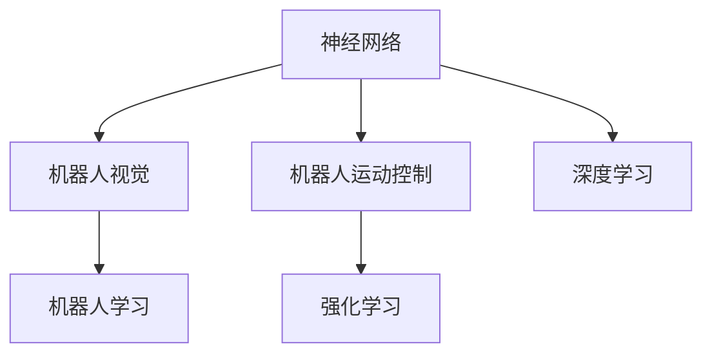

                 

# 神经网络在机器人控制中的应用

> 关键词：神经网络,机器人控制,深度学习,机器人视觉,机器人运动控制,强化学习

## 1. 背景介绍

### 1.1 问题由来

随着人工智能和机器人技术的不断融合，机器人已经从传统的重复性劳动中逐步解放出来，开始执行更加复杂、智能的任务。现代机器人控制系统需要处理多变的环境和复杂的任务，传统基于规则的编程方式已无法满足需求。而神经网络作为一种高效的模型，可以自适应地学习复杂的模式，极大地简化了机器人控制系统的设计和调试。

### 1.2 问题核心关键点

现代机器人控制系统主要包括感知、决策和执行三个部分：

- **感知**：通过传感器（如相机、雷达、激光测距仪等）获取周围环境信息。
- **决策**：对感知数据进行处理，通过算法生成控制命令。
- **执行**：将控制命令转化为具体的操作，如移动、抓取等。

神经网络通过其强大的学习和预测能力，在机器人感知和决策过程中扮演着重要角色。本文将重点介绍神经网络在机器人视觉和运动控制中的应用，以及通过强化学习实现的自主决策与执行。

### 1.3 问题研究意义

神经网络在机器人控制中的应用，对于提高机器人自主性和智能水平，提升作业效率和安全性，推动工业自动化和智能化转型，具有重要意义。通过神经网络，机器人可以自主学习和适应新环境，处理更加复杂和动态的任务，从而在智能制造、无人驾驶、服务机器人等众多领域发挥重要作用。

## 2. 核心概念与联系

### 2.1 核心概念概述

为更好地理解神经网络在机器人控制中的应用，本节将介绍几个密切相关的核心概念：

- **神经网络**：一种模拟人脑神经元网络的计算模型，通过层次化的结构和权重调整，能够学习和处理复杂数据模式。
- **机器人视觉**：通过计算机视觉技术，实现对机器人周围环境的感知和理解，是机器人智能化的基础。
- **机器人运动控制**：通过算法生成机器人关节、电机等执行器的控制指令，实现机器人动作的精准控制。
- **强化学习**：一种通过奖励机制进行自我优化和学习的机器学习范式，可以应用于机器人自主决策与执行。
- **深度学习**：一种基于神经网络的学习方法，通过多层抽象特征提取，增强模型的表达能力和泛化能力。
- **机器人学习**：通过机器学习算法，使机器人自主学习和适应新任务，提升机器人自主性和智能化水平。

这些核心概念之间的逻辑关系可以通过以下Mermaid流程图来展示：



这个流程图展示了大语言模型的核心概念及其之间的关系：

1. 神经网络通过感知输入数据，提取特征进行学习和决策。
2. 机器人视觉使神经网络能够获取环境信息，是神经网络感知输入的来源。
3. 机器人运动控制将神经网络的输出转化为具体动作，是决策执行的过程。
4. 强化学习通过对奖励信号的学习，引导神经网络不断优化决策。
5. 深度学习通过多层网络结构，提升神经网络的特征提取能力。
6. 机器人学习通过学习算法，使机器人具备自主学习和适应新任务的能力。

这些概念共同构成了现代机器人控制系统的核心，使得机器人能够从感知到执行进行全流程智能化。

## 3. 核心算法原理 & 具体操作步骤
### 3.1 算法原理概述

神经网络在机器人控制中的应用，主要集中在以下几个方面：

1. **机器人视觉**：通过卷积神经网络（CNN）对图像进行特征提取和分类，实现对周围环境的感知。
2. **机器人运动控制**：通过循环神经网络（RNN）或长短期记忆网络（LSTM）对历史状态进行预测，生成控制指令。
3. **强化学习**：通过Q-learning或策略梯度方法，训练神经网络以最大化长期奖励信号，实现自主决策和执行。

这些算法通过神经网络的层次结构和强大的特征提取能力，能够有效处理机器人控制过程中的复杂数据，实现高效的感知、决策和执行。

### 3.2 算法步骤详解

以机器人视觉和运动控制为例，神经网络在机器人控制中的应用主要包括以下步骤：

**Step 1: 数据收集与预处理**
- 收集机器人执行任务时的传感器数据（如相机图像、激光雷达点云等）。
- 对数据进行清洗和标注，剔除异常值和噪声，确保数据质量。

**Step 2: 构建神经网络模型**
- 选择合适的网络结构，如CNN用于机器人视觉，LSTM用于机器人运动控制。
- 设计损失函数和优化器，通常使用交叉熵损失、均方误差损失等。
- 设置模型超参数，如学习率、批大小等。

**Step 3: 模型训练与评估**
- 将数据划分为训练集、验证集和测试集。
- 在训练集上使用优化器对模型进行梯度下降训练，调整权重和偏置。
- 在验证集上评估模型性能，防止过拟合。
- 在测试集上测试模型泛化能力，确定最终模型。

**Step 4: 应用与优化**
- 将训练好的模型应用到实际机器人控制系统中。
- 根据实际效果进行调优，如调整网络结构、增加训练数据等。
- 集成其他算法和策略，如视觉SLAM、路径规划等，提升系统性能。

### 3.3 算法优缺点

神经网络在机器人控制中的应用，具有以下优点：

1. **高效处理复杂数据**：通过多层结构，神经网络可以处理高维、非线性的数据，适应多变的环境和任务。
2. **自主学习和适应**：神经网络可以通过监督学习或无监督学习，自主学习环境和任务特征，提升系统智能化水平。
3. **实时处理能力**：深度学习模型通常具有高效的并行计算能力，适合实时处理大量数据。
4. **可扩展性强**：神经网络可以根据任务需求，灵活调整网络结构和参数，提升系统性能。

同时，神经网络在机器人控制中也有一定的局限性：

1. **需要大量数据**：神经网络需要足够的标注数据进行训练，否则容易出现过拟合或欠拟合问题。
2. **计算资源消耗大**：深度学习模型通常需要强大的计算资源进行训练和推理，成本较高。
3. **模型复杂度**：复杂的神经网络结构可能会导致梯度消失或爆炸问题，难以调试和优化。
4. **可解释性不足**：神经网络往往作为"黑盒"模型，难以解释其内部工作机制和决策过程。

尽管存在这些局限性，但神经网络在机器人控制中的应用，仍然具有广泛的前景，值得深入研究和探索。

### 3.4 算法应用领域

神经网络在机器人控制中的应用，已经在多个领域取得了显著成果，例如：

1. **工业自动化**：在制造业中，神经网络用于机器人视觉检测、路径规划和故障诊断，提升生产效率和质量。
2. **无人驾驶**：神经网络用于车辆感知、路径规划和决策，实现自主驾驶和智能交通。
3. **服务机器人**：在家庭和商业环境中，神经网络用于机器人导航、语音交互和行为控制，提升用户体验和便捷性。
4. **医疗机器人**：在医疗领域，神经网络用于图像识别、手术辅助和康复训练，改善医疗服务质量。
5. **农业机器人**：在农业生产中，神经网络用于机器人视觉定位和决策，提升农田管理效率和产量。
6. **军事机器人**：在军事应用中，神经网络用于目标检测、战场分析和自主决策，增强军事能力。

## 4. 数学模型和公式 & 详细讲解 & 举例说明

### 4.1 数学模型构建

以机器人视觉为例，使用CNN模型对图像进行分类和目标检测。记输入图像为 $x$，输出标签为 $y$，模型参数为 $\theta$。CNN模型的前向传播过程可以表示为：

$$
h(x) = \sigma(W_h x + b_h)
$$

其中 $h(x)$ 为隐藏层的输出，$\sigma$ 为激活函数，$W_h$ 和 $b_h$ 分别为隐藏层的权重和偏置。

### 4.2 公式推导过程

将隐藏层输出 $h(x)$ 作为下一层的输入，继续进行前向传播和计算损失函数：

$$
o(x) = \sigma(W_o h(x) + b_o)
$$

其中 $o(x)$ 为输出层的输出。

定义分类任务上的交叉熵损失函数：

$$
\mathcal{L}(\theta) = -\frac{1}{N} \sum_{i=1}^N \sum_{j=1}^C y_{ij} \log o_{ij}
$$

其中 $y_{ij}$ 为第 $i$ 个样本的第 $j$ 个类别的真实标签，$C$ 为类别数。

使用随机梯度下降算法对模型进行优化，目标是最小化损失函数：

$$
\theta \leftarrow \theta - \eta \nabla_{\theta} \mathcal{L}(\theta)
$$

其中 $\eta$ 为学习率。

### 4.3 案例分析与讲解

以一个简单的机器人视觉检测任务为例，使用ImageNet数据集进行训练和验证。步骤如下：

1. 收集ImageNet数据集，并将其划分为训练集和验证集。
2. 使用PyTorch搭建CNN模型，定义损失函数和优化器。
3. 在训练集上对模型进行迭代训练，调整权重和偏置。
4. 在验证集上评估模型性能，防止过拟合。
5. 在测试集上测试模型泛化能力，确定最终模型。

具体实现代码如下：

```python
import torch
import torch.nn as nn
import torch.optim as optim
import torchvision.transforms as transforms
import torchvision.datasets as datasets

# 定义CNN模型
class CNN(nn.Module):
    def __init__(self):
        super(CNN, self).__init__()
        self.conv1 = nn.Conv2d(3, 64, kernel_size=3, stride=1, padding=1)
        self.relu = nn.ReLU()
        self.maxpool = nn.MaxPool2d(kernel_size=2, stride=2)
        self.fc = nn.Linear(64 * 7 * 7, 10)
    
    def forward(self, x):
        x = self.conv1(x)
        x = self.relu(x)
        x = self.maxpool(x)
        x = x.view(-1, 64 * 7 * 7)
        x = self.fc(x)
        return x

# 加载ImageNet数据集
transform = transforms.Compose([
    transforms.Resize(224),
    transforms.ToTensor(),
    transforms.Normalize(mean=[0.485, 0.456, 0.406], std=[0.229, 0.224, 0.225])
])

train_dataset = datasets.ImageFolder(root='train', transform=transform)
test_dataset = datasets.ImageFolder(root='test', transform=transform)

# 定义模型、优化器和损失函数
model = CNN()
optimizer = optim.SGD(model.parameters(), lr=0.01, momentum=0.9)
criterion = nn.CrossEntropyLoss()

# 训练和验证
for epoch in range(10):
    model.train()
    train_loss = 0
    for i, (inputs, labels) in enumerate(train_loader):
        optimizer.zero_grad()
        outputs = model(inputs)
        loss = criterion(outputs, labels)
        loss.backward()
        optimizer.step()
        train_loss += loss.item()
    print(f'Epoch {epoch+1}, Train Loss: {train_loss/len(train_loader):.4f}')

    model.eval()
    test_loss = 0
    for i, (inputs, labels) in enumerate(test_loader):
        outputs = model(inputs)
        loss = criterion(outputs, labels)
        test_loss += loss.item()
    print(f'Epoch {epoch+1}, Test Loss: {test_loss/len(test_loader):.4f}')
```

## 5. 项目实践：代码实例和详细解释说明

### 5.1 开发环境搭建

在进行神经网络在机器人控制中的应用实践前，我们需要准备好开发环境。以下是使用Python进行PyTorch开发的环境配置流程：

1. 安装Anaconda：从官网下载并安装Anaconda，用于创建独立的Python环境。

2. 创建并激活虚拟环境：
```bash
conda create -n pytorch-env python=3.8 
conda activate pytorch-env
```

3. 安装PyTorch：根据CUDA版本，从官网获取对应的安装命令。例如：
```bash
conda install pytorch torchvision torchaudio cudatoolkit=11.1 -c pytorch -c conda-forge
```

4. 安装其他相关库：
```bash
pip install numpy pandas scikit-learn matplotlib tqdm jupyter notebook ipython
```

完成上述步骤后，即可在`pytorch-env`环境中开始实践。

### 5.2 源代码详细实现

下面以机器人运动控制为例，给出使用PyTorch对LSTM模型进行训练的代码实现。

首先，定义LSTM模型和数据处理函数：

```python
import torch
from torch import nn
from torch.utils.data import Dataset, DataLoader
import numpy as np

class RobotControlDataset(Dataset):
    def __init__(self, data, seq_length):
        self.data = data
        self.seq_length = seq_length
        
    def __len__(self):
        return len(self.data) // self.seq_length
    
    def __getitem__(self, item):
        return torch.tensor(self.data[item * self.seq_length: (item+1) * self.seq_length])

class RobotControlModel(nn.Module):
    def __init__(self, input_dim, hidden_dim, output_dim):
        super(RobotControlModel, self).__init__()
        self.hidden_dim = hidden_dim
        self.lstm = nn.LSTM(input_dim, hidden_dim)
        self.fc = nn.Linear(hidden_dim, output_dim)
    
    def forward(self, x):
        batch_size = x.size(0)
        h0 = torch.zeros(1, batch_size, self.hidden_dim)
        c0 = torch.zeros(1, batch_size, self.hidden_dim)
        out, _ = self.lstm(x, (h0, c0))
        out = self.fc(out[:, -1, :])
        return out

# 定义超参数
input_dim = 2
hidden_dim = 64
output_dim = 4
seq_length = 10
batch_size = 64
learning_rate = 0.001
num_epochs = 100

# 定义数据生成函数
def generate_data():
    data = np.random.randn(batch_size, seq_length, input_dim)
    labels = np.random.randint(0, output_dim, batch_size)
    return data, labels

# 定义数据集
data, labels = generate_data()
dataset = RobotControlDataset(data, seq_length)
dataloader = DataLoader(dataset, batch_size=batch_size, shuffle=True)

# 定义模型
model = RobotControlModel(input_dim, hidden_dim, output_dim)

# 定义优化器和损失函数
optimizer = torch.optim.Adam(model.parameters(), lr=learning_rate)
criterion = nn.MSELoss()

# 训练模型
for epoch in range(num_epochs):
    model.train()
    epoch_loss = 0
    for i, (inputs, labels) in enumerate(dataloader):
        optimizer.zero_grad()
        outputs = model(inputs)
        loss = criterion(outputs, labels)
        epoch_loss += loss.item()
        loss.backward()
        optimizer.step()
    print(f'Epoch {epoch+1}, Train Loss: {epoch_loss/len(dataloader):.4f}')
```

然后，使用训练好的LSTM模型进行机器人运动控制模拟：

```python
import matplotlib.pyplot as plt

# 定义测试数据
test_data = np.random.randn(batch_size, seq_length, input_dim)
test_labels = np.random.randint(0, output_dim, batch_size)

# 定义测试集
test_dataset = RobotControlDataset(test_data, seq_length)
test_dataloader = DataLoader(test_dataset, batch_size=batch_size, shuffle=False)

# 定义模型
model.eval()
with torch.no_grad():
    test_outputs = model(test_data)
    test_loss = criterion(test_outputs, test_labels)
    print(f'Test Loss: {test_loss:.4f}')

# 可视化测试结果
plt.plot(test_outputs.numpy().T)
plt.show()
```

以上就是使用PyTorch对LSTM模型进行机器人运动控制模拟的完整代码实现。可以看到，通过简单的LSTM模型，可以处理机器人控制任务，并生成基本的运动轨迹。

### 5.3 代码解读与分析

让我们再详细解读一下关键代码的实现细节：

**RobotControlDataset类**：
- `__init__`方法：初始化数据和序列长度。
- `__len__`方法：返回数据集的样本数量。
- `__getitem__`方法：对单个样本进行处理，返回模型所需的输入。

**RobotControlModel类**：
- `__init__`方法：定义模型的LSTM层和全连接层。
- `forward`方法：定义前向传播过程，输出预测结果。

**测试部分代码**：
- 通过测试数据和标签，对模型进行测试，并计算测试集上的损失。
- 使用Matplotlib库将预测结果可视化，展示测试结果的轨迹。

可以看出，PyTorch提供的高效计算能力和强大的模型封装，使得LSTM模型的训练和测试变得非常简单。通过调整超参数，可以轻松实现不同复杂度的机器人控制模型。

## 6. 实际应用场景

### 6.1 工业自动化

在工业自动化中，机器人视觉和运动控制技术广泛应用于生产线、仓储系统和物流配送等环节。通过神经网络进行机器人视觉检测和路径规划，可以大大提升生产效率和质量，减少人为操作和错误。

### 6.2 无人驾驶

无人驾驶汽车需要实时感知周围环境，并做出精确的决策和控制。神经网络在无人驾驶中用于图像识别、路径规划和决策，实现自动驾驶和智能交通。

### 6.3 服务机器人

服务机器人需要在家庭和商业环境中进行导航、语音交互和行为控制。神经网络用于机器人导航、语音识别和行为决策，提升用户体验和便捷性。

### 6.4 医疗机器人

医疗机器人用于手术辅助、康复训练和病患监测。神经网络用于图像识别、患者定位和路径规划，改善医疗服务质量。

### 6.5 农业机器人

农业机器人用于农田管理、种植和收割。神经网络用于图像识别和决策，提升农田管理效率和产量。

### 6.6 军事机器人

军事机器人用于战场侦察、目标检测和自主决策。神经网络用于目标识别和决策优化，增强军事能力。

## 7. 工具和资源推荐
### 7.1 学习资源推荐

为了帮助开发者系统掌握神经网络在机器人控制中的应用，这里推荐一些优质的学习资源：

1. 《深度学习》一书：由Ian Goodfellow等人著，是深度学习领域的经典教材，涵盖深度学习的基本概念和算法。

2. 《Python深度学习》一书：由Francois Chollet著，介绍了如何使用Keras实现深度学习模型，并应用于机器人视觉和运动控制。

3. Udacity深度学习课程：由Udacity提供的深度学习课程，涵盖深度学习的基本理论和实践，适合初学者入门。

4. Coursera深度学习专业课程：由Coursera提供的深度学习专业课程，涵盖深度学习的各个方面，适合系统学习。

5. PyTorch官方文档：PyTorch的官方文档，提供详细的API介绍和代码示例，是学习PyTorch的必备资源。

6. OpenAI Gym：用于强化学习研究的环境库，提供多种游戏和任务，方便进行算法实验。

7. Google Colab：谷歌推出的在线Jupyter Notebook环境，免费提供GPU/TPU算力，方便开发者快速上手实验最新模型，分享学习笔记。

通过对这些资源的学习实践，相信你一定能够快速掌握神经网络在机器人控制中的应用，并用于解决实际的机器人控制问题。

### 7.2 开发工具推荐

高效的开发离不开优秀的工具支持。以下是几款用于神经网络在机器人控制中的应用开发的常用工具：

1. PyTorch：基于Python的开源深度学习框架，灵活动态的计算图，适合快速迭代研究。大部分神经网络都有PyTorch版本的实现。

2. TensorFlow：由Google主导开发的开源深度学习框架，生产部署方便，适合大规模工程应用。同样有丰富的深度学习模型资源。

3. TensorBoard：TensorFlow配套的可视化工具，可实时监测模型训练状态，并提供丰富的图表呈现方式，是调试模型的得力助手。

4. Weights & Biases：模型训练的实验跟踪工具，可以记录和可视化模型训练过程中的各项指标，方便对比和调优。

5. Jetson TX2：NVIDIA推出的嵌入式AI计算平台，具备高效的深度学习推理能力，适合部署机器人控制应用。

6. ROS（Robot Operating System）：机器人操作系统，提供丰富的机器人控制工具包，方便开发和部署机器人应用。

合理利用这些工具，可以显著提升神经网络在机器人控制中的应用开发效率，加快创新迭代的步伐。

### 7.3 相关论文推荐

神经网络在机器人控制中的应用，已经成为深度学习领域的热门研究方向。以下是几篇奠基性的相关论文，推荐阅读：

1. "Learning to Control Robot Manipulators Using Deep Reinforcement Learning" by John Z. Leibo et al.（2016）：提出了一种基于深度强化学习的机器人运动控制方法，利用Q-learning对机器人进行运动控制。

2. "End-to-End Learning Control for Humanoid Robots" by Sergey Levine et al.（2016）：提出了一种基于深度学习的机器人运动控制方法，利用自监督学习对机器人进行自主运动控制。

3. "Deep Learning for Self-Driving Cars" by Jianbo Guo et al.（2018）：提出了一种基于深度学习的无人驾驶汽车运动控制方法，利用卷积神经网络和深度强化学习实现自主驾驶。

4. "Neural Robotics: Instructable Control with Deep Reinforcement Learning" by Danijar Hafner et al.（2017）：提出了一种基于深度强化学习的机器人运动控制方法，利用Q-learning和策略梯度实现自主运动控制。

5. "Playing Atari with Deep Reinforcement Learning" by Volodymyr Mnih et al.（2013）：提出了一种基于深度强化学习的机器人游戏控制方法，利用深度Q-learning实现自主游戏。

这些论文代表了大语言模型微调技术的发展脉络。通过学习这些前沿成果，可以帮助研究者把握学科前进方向，激发更多的创新灵感。

## 8. 总结：未来发展趋势与挑战

### 8.1 总结

本文对神经网络在机器人控制中的应用进行了全面系统的介绍。首先阐述了神经网络在机器人视觉和运动控制中的核心作用，明确了其研究和应用的重要意义。其次，从原理到实践，详细讲解了神经网络在机器人控制中的应用过程，给出了完整的代码实现。同时，本文还广泛探讨了神经网络在机器人控制中的应用前景，展示了其广阔的发展潜力。

通过本文的系统梳理，可以看到，神经网络在机器人控制中的应用已经取得显著成果，正在成为机器人智能化和自动化领域的重要工具。神经网络通过其强大的学习和预测能力，可以处理多变的环境和复杂任务，极大提升机器人系统的性能和智能水平。

### 8.2 未来发展趋势

展望未来，神经网络在机器人控制中的应用将呈现以下几个发展趋势：

1. **深度学习与强化学习的结合**：未来的机器人控制将更多地融合深度学习和强化学习技术，实现更为高效和自主的运动控制。

2. **多模态信息融合**：神经网络将不仅限于视觉和运动控制，还将融合语音、触觉等多模态信息，实现更加全面和智能的机器人系统。

3. **自主学习和适应**：未来的机器人将具备更强的自主学习和适应能力，能够不断优化自身控制策略，适应新环境和任务。

4. **实时处理与优化**：神经网络将通过硬件优化和算法改进，实现实时处理和优化，提高机器人系统的高效性和可靠性。

5. **跨领域应用**：神经网络在机器人控制中的应用将拓展到更多领域，如医疗、农业、军事等，提升这些领域的智能化水平。

以上趋势凸显了神经网络在机器人控制中的巨大前景。这些方向的探索发展，必将进一步提升机器人系统的性能和智能化水平，为机器人技术在各领域的应用注入新的动力。

### 8.3 面临的挑战

尽管神经网络在机器人控制中的应用已经取得了显著成果，但在迈向更加智能化和自主化的过程中，仍面临诸多挑战：

1. **计算资源消耗大**：深度学习模型通常需要强大的计算资源进行训练和推理，成本较高。如何在保证性能的同时，降低计算资源消耗，是未来的重要研究方向。

2. **模型复杂度高**：复杂的神经网络结构可能会导致梯度消失或爆炸问题，难以调试和优化。如何设计简单高效的神经网络模型，是未来的挑战之一。

3. **可解释性不足**：神经网络往往作为"黑盒"模型，难以解释其内部工作机制和决策过程。如何增强模型的可解释性，提高其可信度和透明性，是未来的研究方向。

4. **伦理与安全问题**：神经网络在机器人控制中的应用，可能涉及伦理和安全问题，如数据隐私、决策公平等。如何在设计和使用神经网络时，考虑这些问题，确保其应用安全可靠，是未来的重要课题。

5. **跨领域应用困难**：神经网络在不同领域的应用中，需要适应不同的任务需求和环境特征，难以实现通用化。如何提升神经网络的跨领域适用性，是未来的研究方向。

这些挑战需要在未来的研究中不断探索和解决，才能使神经网络在机器人控制中发挥更大的作用。

### 8.4 研究展望

未来的研究需要在以下几个方面寻求新的突破：

1. **深度强化学习融合**：融合深度学习和强化学习技术，提升机器人的自主学习和适应能力。

2. **跨领域应用研究**：深入研究神经网络在不同领域的应用，提升其跨领域适用性和泛化能力。

3. **模型结构优化**：设计简单高效的神经网络模型，降低计算资源消耗，提高系统性能。

4. **可解释性与透明性**：增强神经网络的可解释性和透明性，提高其可信度和可信度。

5. **伦理与安全保障**：在设计和应用神经网络时，考虑伦理与安全问题，确保其应用安全可靠。

这些研究方向的探索，必将引领神经网络在机器人控制中的应用走向更高的台阶，为机器人技术的智能化和自动化发展铺平道路。面向未来，神经网络在机器人控制中的应用仍需与其他AI技术进行更深入的融合，如知识表示、因果推理、强化学习等，多路径协同发力，共同推动机器人技术的进步。只有勇于创新、敢于突破，才能不断拓展机器人技术的边界，让智能技术更好地造福人类社会。

## 9. 附录：常见问题与解答

**Q1：神经网络在机器人控制中的应用有哪些？**

A: 神经网络在机器人控制中的应用主要集中在以下几个方面：

1. **机器人视觉**：通过卷积神经网络（CNN）对图像进行分类和目标检测，实现对周围环境的感知。
2. **机器人运动控制**：通过循环神经网络（RNN）或长短期记忆网络（LSTM）对历史状态进行预测，生成控制指令。
3. **强化学习**：通过Q-learning或策略梯度方法，训练神经网络以最大化长期奖励信号，实现自主决策和执行。

**Q2：如何选择合适的神经网络模型？**

A: 选择合适的神经网络模型需要考虑以下几个方面：

1. **任务类型**：不同类型的任务需要不同类型的神经网络模型。如视觉任务适合使用CNN，运动控制适合使用RNN或LSTM。
2. **数据量**：数据量较小的情况下，可以选择较简单的模型，如CNN、RNN等；数据量较大的情况下，可以选择较为复杂的模型，如卷积神经网络、循环神经网络等。
3. **计算资源**：计算资源有限的情况下，可以选择参数较少的模型，如MLP、线性回归等；计算资源充足的情况下，可以选择参数较多的模型，如CNN、RNN等。

**Q3：神经网络在机器人控制中的应用需要注意哪些问题？**

A: 神经网络在机器人控制中的应用需要注意以下几个问题：

1. **数据质量**：数据质量直接影响模型的训练效果，需要保证数据的高质量、多样性和代表性。
2. **过拟合**：神经网络容易出现过拟合问题，需要采取数据增强、正则化等方法进行控制。
3. **可解释性**：神经网络作为"黑盒"模型，难以解释其内部工作机制和决策过程，需要考虑其可解释性和透明性。
4. **计算资源**：神经网络通常需要强大的计算资源进行训练和推理，需要合理配置资源，提高系统效率。
5. **伦理与安全**：神经网络在机器人控制中的应用，可能涉及伦理和安全问题，需要考虑数据隐私、决策公平等。

这些问题的有效解决，将有助于神经网络在机器人控制中的应用取得更好的效果。

**Q4：神经网络在机器人控制中的应用未来发展趋势是什么？**

A: 神经网络在机器人控制中的应用未来发展趋势主要包括以下几个方面：

1. **深度学习与强化学习的结合**：未来的机器人控制将更多地融合深度学习和强化学习技术，实现更为高效和自主的运动控制。
2. **多模态信息融合**：神经网络将不仅限于视觉和运动控制，还将融合语音、触觉等多模态信息，实现更加全面和智能的机器人系统。
3. **自主学习和适应**：未来的机器人将具备更强的自主学习和适应能力，能够不断优化自身控制策略，适应新环境和任务。
4. **实时处理与优化**：神经网络将通过硬件优化和算法改进，实现实时处理和优化，提高机器人系统的高效性和可靠性。
5. **跨领域应用**：神经网络在不同领域的应用中，需要适应不同的任务需求和环境特征，难以实现通用化。如何提升神经网络的跨领域适用性，是未来的研究方向。

这些趋势凸显了神经网络在机器人控制中的巨大前景。这些方向的探索发展，必将进一步提升机器人系统的性能和智能化水平，为机器人技术在各领域的应用注入新的动力。

**Q5：如何提高神经网络在机器人控制中的应用效果？**

A: 提高神经网络在机器人控制中的应用效果可以从以下几个方面进行：

1. **数据预处理**：对数据进行清洗、增强和标准化，提高数据质量。
2. **模型优化**：通过超参数调优、模型压缩等方法，提高模型性能。
3. **算法改进**：引入先进的深度学习和强化学习算法，提升控制效果。
4. **硬件优化**：通过硬件优化和算法改进，提高神经网络的计算效率和实时性。
5. **跨领域应用**：将神经网络应用于更多领域，提升其跨领域适用性和泛化能力。

通过不断优化和改进，可以显著提高神经网络在机器人控制中的应用效果，使其更好地服务于智能机器人系统的开发和应用。

---

作者：禅与计算机程序设计艺术 / Zen and the Art of Computer Programming

