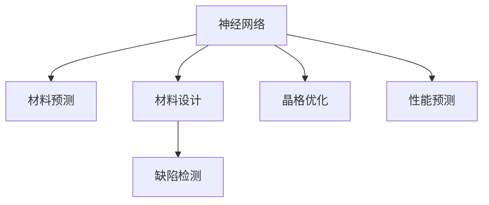

                 

# 神经网络在材料科学中的应用

> 关键词：神经网络, 材料科学, 深度学习, 材料预测, 材料设计, 缺陷检测, 晶格优化, 性能预测, 可解释性

## 1. 背景介绍

### 1.1 问题由来

材料科学是推动人类文明进步的重要基石，涉及新材料的合成、性能测试、结构分析等多个方面。传统材料科学依赖于物理实验和模拟计算，周期长、成本高、效率低。随着深度学习技术的蓬勃发展，以神经网络为基础的计算材料科学（Computational Materials Science, CMS）成为了一个崭新的研究领域，极大地提高了材料研究和开发的效率。

计算材料科学通过构建物理模型和机器学习模型，从海量材料数据中挖掘出有价值的模式和规律，为新材料的研发提供理论依据和计算工具。其中，神经网络作为一种强大的机器学习模型，以其自适应性和泛化能力，在材料预测、材料设计、缺陷检测、晶格优化等方面展现出巨大的潜力。

### 1.2 问题核心关键点

神经网络在材料科学中的应用主要集中在以下几个方面：

- 材料预测：基于历史数据，利用神经网络对材料的某些性质（如熔点、硬度、电导率等）进行预测。
- 材料设计：利用神经网络优化材料成分和结构，寻找最优的配方或设计方案。
- 缺陷检测：通过分析材料的X射线衍射图谱或扫描电子显微镜图，检测出材料中的缺陷（如位错、空位等）。
- 晶格优化：利用神经网络对材料的晶格结构进行优化，提高材料的性能。
- 性能预测：根据材料成分和加工工艺，预测材料的力学性能、电学性能、热学性能等。

这些应用涵盖了材料科学的多个领域，展示了神经网络在材料科学中的巨大潜力。下面我们将详细介绍这些应用场景，并探讨神经网络在材料科学中的核心算法原理和具体操作步骤。

## 2. 核心概念与联系

### 2.1 核心概念概述

为了更好地理解神经网络在材料科学中的应用，我们需要了解以下核心概念：

- 神经网络（Neural Network, NN）：一种模仿人类神经系统的计算模型，由大量人工神经元（或称节点）组成，用于处理复杂的非线性关系。
- 深度学习（Deep Learning）：一种利用多层神经网络进行复杂模式识别的机器学习方法，通过大量数据训练神经网络，使其能够自动提取特征。
- 材料预测（Materials Prediction）：利用神经网络对材料的某些物理、化学、机械等性质进行预测。
- 材料设计（Materials Design）：利用神经网络优化材料成分和结构，寻找最优的设计方案。
- 缺陷检测（Defect Detection）：通过图像识别等技术，检测出材料中的缺陷。
- 晶格优化（Lattice Optimization）：利用神经网络优化材料的晶格结构，提高材料的性能。
- 性能预测（Performance Prediction）：利用神经网络根据材料成分和加工工艺，预测材料的性能。

这些核心概念之间的联系可以通过以下Mermaid流程图来展示：



这个流程图展示了神经网络在材料科学中的核心应用场景，揭示了各个环节之间的逻辑关系。

## 3. 核心算法原理 & 具体操作步骤
### 3.1 算法原理概述

神经网络在材料科学中的应用基于深度学习框架，其核心原理与传统的机器学习方法类似，但具有更强的自适应性和泛化能力。以下我们将详细介绍神经网络在材料预测、材料设计、缺陷检测、晶格优化和性能预测中的具体应用。

### 3.2 算法步骤详解

#### 3.2.1 材料预测

**Step 1: 数据准备**
- 收集材料的化学成分、物理性质、结构信息等历史数据，分为训练集和测试集。
- 数据预处理：标准化、归一化、特征工程等。

**Step 2: 模型设计**
- 选择合适的神经网络架构，如前馈神经网络、卷积神经网络（CNN）、循环神经网络（RNN）等。
- 设计损失函数：如均方误差、交叉熵等。

**Step 3: 模型训练**
- 使用训练集数据，反向传播算法优化模型参数，最小化损失函数。
- 设置训练轮数、批次大小、学习率等超参数。

**Step 4: 模型评估**
- 使用测试集数据评估模型性能，如均方误差、均方根误差等指标。
- 使用交叉验证等方法验证模型的泛化能力。

**Step 5: 结果应用**
- 利用训练好的模型对新材料进行性质预测，如熔点、硬度等。

#### 3.2.2 材料设计

**Step 1: 目标设定**
- 确定设计目标，如新材料的物理性质、化学性质等。

**Step 2: 数据准备**
- 收集材料的成分、结构、性能等数据，分为训练集和测试集。
- 数据预处理：标准化、归一化、特征工程等。

**Step 3: 模型设计**
- 选择合适的神经网络架构，如前馈神经网络、遗传算法等。
- 设计优化目标：如性能最优、成本最低等。

**Step 4: 模型训练**
- 使用训练集数据，反向传播算法优化模型参数，最小化优化目标。
- 设置训练轮数、批次大小、学习率等超参数。

**Step 5: 模型评估**
- 使用测试集数据评估模型性能，如材料设计目标的实现情况。
- 使用交叉验证等方法验证模型的泛化能力。

**Step 6: 结果应用**
- 利用训练好的模型对新材料进行成分和结构设计。

#### 3.2.3 缺陷检测

**Step 1: 数据准备**
- 收集材料的X射线衍射图谱、扫描电子显微镜图谱等数据，分为训练集和测试集。
- 数据预处理：标准化、归一化、特征工程等。

**Step 2: 模型设计**
- 选择合适的神经网络架构，如卷积神经网络（CNN）、自编码器等。
- 设计损失函数：如交叉熵、均方误差等。

**Step 3: 模型训练**
- 使用训练集数据，反向传播算法优化模型参数，最小化损失函数。
- 设置训练轮数、批次大小、学习率等超参数。

**Step 4: 模型评估**
- 使用测试集数据评估模型性能，如准确率、召回率等指标。
- 使用交叉验证等方法验证模型的泛化能力。

**Step 5: 结果应用**
- 利用训练好的模型对新材料进行缺陷检测，如位错、空位等。

#### 3.2.4 晶格优化

**Step 1: 数据准备**
- 收集材料的晶格结构数据，分为训练集和测试集。
- 数据预处理：标准化、归一化、特征工程等。

**Step 2: 模型设计**
- 选择合适的神经网络架构，如遗传算法、模拟退火算法等。
- 设计优化目标：如晶格能最小化、体积最小化等。

**Step 3: 模型训练**
- 使用训练集数据，反向传播算法优化模型参数，最小化优化目标。
- 设置训练轮数、批次大小、学习率等超参数。

**Step 4: 模型评估**
- 使用测试集数据评估模型性能，如晶格结构的稳定性、性能等。
- 使用交叉验证等方法验证模型的泛化能力。

**Step 5: 结果应用**
- 利用训练好的模型对新材料的晶格结构进行优化，提高材料的性能。

#### 3.2.5 性能预测

**Step 1: 数据准备**
- 收集材料的成分、结构、加工工艺等数据，分为训练集和测试集。
- 数据预处理：标准化、归一化、特征工程等。

**Step 2: 模型设计**
- 选择合适的神经网络架构，如前馈神经网络、卷积神经网络（CNN）等。
- 设计损失函数：如均方误差、交叉熵等。

**Step 3: 模型训练**
- 使用训练集数据，反向传播算法优化模型参数，最小化损失函数。
- 设置训练轮数、批次大小、学习率等超参数。

**Step 4: 模型评估**
- 使用测试集数据评估模型性能，如预测准确率、均方误差等指标。
- 使用交叉验证等方法验证模型的泛化能力。

**Step 5: 结果应用**
- 利用训练好的模型对新材料的性能进行预测，如力学性能、电学性能等。

### 3.3 算法优缺点

神经网络在材料科学中的应用具有以下优点：

1. **自适应性强**：神经网络能够自动提取数据的特征，无需人工设计特征工程。
2. **泛化能力强**：神经网络在未知数据上的表现通常优于传统机器学习方法。
3. **模型可解释性**：利用可视化技术，可以对神经网络的内部结构进行解释，帮助理解模型的决策过程。
4. **高准确性**：神经网络在大量数据训练后，能够对材料的某些性质进行精确预测。

同时，神经网络在材料科学中的应用也存在一些缺点：

1. **计算成本高**：神经网络需要大量计算资源进行训练和推理。
2. **数据依赖性强**：神经网络的性能高度依赖于训练数据的质量和数量。
3. **过拟合风险**：神经网络容易在训练数据上过拟合，影响模型的泛化能力。
4. **模型复杂度高**：神经网络的结构复杂，难以直观理解和调试。

这些优缺点需要在实际应用中综合考虑，根据具体问题选择合适的模型和方法。

### 3.4 算法应用领域

神经网络在材料科学中的应用领域非常广泛，主要包括以下几个方面：

1. **材料预测**：在材料科学中，预测材料的性质是重要的研究方向。利用神经网络，可以对材料的熔点、硬度、电导率等性质进行预测。
2. **材料设计**：通过神经网络优化材料成分和结构，可以寻找最优的材料配方和设计方案，加速新材料的研发。
3. **缺陷检测**：利用神经网络对材料的缺陷进行检测，可以提高材料的性能和可靠性。
4. **晶格优化**：通过神经网络优化材料的晶格结构，可以提高材料的性能和稳定性。
5. **性能预测**：利用神经网络对材料的性能进行预测，可以指导材料的设计和加工。

## 4. 数学模型和公式 & 详细讲解  
### 4.1 数学模型构建

下面我们将介绍神经网络在材料科学中的数学模型构建和公式推导。

假设有一个神经网络，包含 $n$ 个隐藏层，每个隐藏层包含 $m$ 个神经元。网络输入为 $x_1, x_2, \ldots, x_d$，输出为 $y$。网络的结构如下图所示：


神经网络的前向传播过程可以表示为：

$$
h^{(1)} = \sigma(\mathbf{W}_1 \mathbf{x} + \mathbf{b}_1)
$$

$$
h^{(2)} = \sigma(\mathbf{W}_2 h^{(1)} + \mathbf{b}_2)
$$

$$
\vdots
$$

$$
h^{(n)} = \sigma(\mathbf{W}_n h^{(n-1)} + \mathbf{b}_n)
$$

$$
y = \mathbf{W}_n h^{(n-1)} + \mathbf{b}_n
$$

其中，$\mathbf{W}_i$ 为权重矩阵，$\mathbf{b}_i$ 为偏置向量，$\sigma$ 为激活函数（如sigmoid、ReLU等）。

神经网络的损失函数可以表示为：

$$
\mathcal{L}(\mathbf{W}, \mathbf{b}) = \frac{1}{N} \sum_{i=1}^N \ell(y_i, \hat{y}_i)
$$

其中，$\ell$ 为损失函数，$\hat{y}_i$ 为模型预测输出。常见的损失函数包括均方误差、交叉熵等。

神经网络的训练过程通过反向传播算法进行，优化目标为最小化损失函数：

$$
\mathbf{W}_i, \mathbf{b}_i = \mathop{\arg\min}_{\mathbf{W}_i, \mathbf{b}_i} \mathcal{L}(\mathbf{W}, \mathbf{b})
$$

### 4.2 公式推导过程

下面我们将详细推导神经网络在材料科学中的常见损失函数和优化算法。

以均方误差（Mean Squared Error, MSE）损失函数为例，假设有 $N$ 个训练样本，每个样本的输入为 $\mathbf{x}_i$，输出为 $y_i$，模型预测输出为 $\hat{y}_i$。均方误差损失函数可以表示为：

$$
\mathcal{L}_{MSE} = \frac{1}{N} \sum_{i=1}^N (y_i - \hat{y}_i)^2
$$

神经网络的前向传播过程为：

$$
h^{(1)} = \sigma(\mathbf{W}_1 \mathbf{x}_i + \mathbf{b}_1)
$$

$$
h^{(2)} = \sigma(\mathbf{W}_2 h^{(1)} + \mathbf{b}_2)
$$

$$
\vdots
$$

$$
h^{(n)} = \sigma(\mathbf{W}_n h^{(n-1)} + \mathbf{b}_n)
$$

$$
y_i = \mathbf{W}_n h^{(n-1)} + \mathbf{b}_n
$$

神经网络的后向传播过程为：

$$
\frac{\partial \mathcal{L}_{MSE}}{\partial \mathbf{W}_n} = 2 \frac{\partial y_i}{\partial h^{(n)}} \frac{\partial h^{(n)}}{\partial h^{(n-1)}} \cdots \frac{\partial h^{(2)}}{\partial h^{(1)}} \frac{\partial h^{(1)}}{\partial \mathbf{W}_1}
$$

$$
\frac{\partial \mathcal{L}_{MSE}}{\partial \mathbf{b}_n} = 2 \frac{\partial y_i}{\partial h^{(n)}} \frac{\partial h^{(n)}}{\partial h^{(n-1)}} \cdots \frac{\partial h^{(2)}}{\partial h^{(1)}} \frac{\partial h^{(1)}}{\partial \mathbf{b}_1}
$$

其中，$\frac{\partial y_i}{\partial h^{(n)}} = \mathbf{W}_n$，$\frac{\partial h^{(l)}}{\partial h^{(l-1)}} = \sigma'(h^{(l-1)}) \mathbf{W}_l$，$\sigma'$ 为激活函数的导数。

使用随机梯度下降（SGD）优化算法，更新权重和偏置：

$$
\mathbf{W}_i \leftarrow \mathbf{W}_i - \eta \frac{\partial \mathcal{L}}{\partial \mathbf{W}_i}
$$

$$
\mathbf{b}_i \leftarrow \mathbf{b}_i - \eta \frac{\partial \mathcal{L}}{\partial \mathbf{b}_i}
$$

其中，$\eta$ 为学习率。

### 4.3 案例分析与讲解

#### 4.3.1 材料预测

假设有 $N$ 个材料的化学成分数据，每个成分 $x_1, x_2, \ldots, x_d$，预测材料的熔点 $y$。

首先，将数据分为训练集和测试集，使用训练集数据训练神经网络。以 MSE 损失函数为例，设置激活函数为 sigmoid，训练过程中不断更新权重和偏置，使得模型预测的熔点与真实值尽可能接近。训练完成后，使用测试集数据评估模型性能。

#### 4.3.2 材料设计

假设有 $N$ 种材料的成分和性能数据，每个成分 $x_1, x_2, \ldots, x_d$，性能 $y$。通过神经网络优化材料的成分，使得性能 $y$ 达到最优。

首先，将数据分为训练集和测试集，使用训练集数据训练神经网络。以均方误差损失函数为例，设置激活函数为 ReLU，训练过程中不断更新权重和偏置，使得模型预测的性能 $y$ 达到最优。训练完成后，使用测试集数据评估模型性能。

## 5. 项目实践：代码实例和详细解释说明
### 5.1 开发环境搭建

在进行神经网络在材料科学中的应用实践前，我们需要准备好开发环境。以下是使用 Python 进行 PyTorch 开发的环境配置流程：

1. 安装 Anaconda：从官网下载并安装 Anaconda，用于创建独立的 Python 环境。

2. 创建并激活虚拟环境：
```bash
conda create -n pytorch-env python=3.8 
conda activate pytorch-env
```

3. 安装 PyTorch：根据 CUDA 版本，从官网获取对应的安装命令。例如：
```bash
conda install pytorch torchvision torchaudio cudatoolkit=11.1 -c pytorch -c conda-forge
```

4. 安装 Transformers 库：
```bash
pip install transformers
```

5. 安装各类工具包：
```bash
pip install numpy pandas scikit-learn matplotlib tqdm jupyter notebook ipython
```

完成上述步骤后，即可在 `pytorch-env` 环境中开始项目实践。

### 5.2 源代码详细实现

下面我们以材料预测任务为例，给出使用 PyTorch 进行神经网络训练和预测的代码实现。

首先，定义数据处理函数：

```python
import numpy as np
import torch
from torch.utils.data import Dataset, DataLoader
from sklearn.model_selection import train_test_split

class MaterialsDataset(Dataset):
    def __init__(self, data, target, feature_names):
        self.data = data
        self.target = target
        self.feature_names = feature_names
        
    def __len__(self):
        return len(self.data)
    
    def __getitem__(self, index):
        features = [self.data.iloc[index][name] for name in self.feature_names]
        target = self.target.iloc[index]
        return torch.tensor(features), torch.tensor(target)
```

然后，加载数据集：

```python
from pandas import read_csv

# 加载数据集
data = read_csv('materials.csv')

# 划分训练集和测试集
train_data, test_data, train_target, test_target = train_test_split(data.drop('Melting Point', axis=1), data['Melting Point'], test_size=0.2, random_state=42)

# 定义特征名和标签
feature_names = ['X', 'Y', 'Z']
train_dataset = MaterialsDataset(train_data, train_target, feature_names)
test_dataset = MaterialsDataset(test_data, test_target, feature_names)
```

接下来，定义神经网络模型：

```python
import torch.nn as nn
import torch.optim as optim

class NeuralNetwork(nn.Module):
    def __init__(self, input_dim, hidden_dim, output_dim):
        super(NeuralNetwork, self).__init__()
        self.fc1 = nn.Linear(input_dim, hidden_dim)
        self.fc2 = nn.Linear(hidden_dim, hidden_dim)
        self.fc3 = nn.Linear(hidden_dim, output_dim)
        
    def forward(self, x):
        x = torch.relu(self.fc1(x))
        x = torch.relu(self.fc2(x))
        x = self.fc3(x)
        return x
```

接着，定义训练和评估函数：

```python
def train_model(model, train_loader, optimizer, loss_func, num_epochs):
    for epoch in range(num_epochs):
        model.train()
        for features, targets in train_loader:
            optimizer.zero_grad()
            outputs = model(features)
            loss = loss_func(outputs, targets)
            loss.backward()
            optimizer.step()
        print(f'Epoch {epoch+1}, train loss: {loss.item()}')
    
def evaluate_model(model, test_loader, loss_func):
    model.eval()
    total_loss = 0
    for features, targets in test_loader:
        outputs = model(features)
        loss = loss_func(outputs, targets)
        total_loss += loss.item()
    return total_loss / len(test_loader)
```

最后，启动训练流程：

```python
# 定义超参数
input_dim = len(feature_names)
hidden_dim = 64
output_dim = 1
learning_rate = 0.001
num_epochs = 100

# 定义模型和优化器
model = NeuralNetwork(input_dim, hidden_dim, output_dim)
optimizer = optim.Adam(model.parameters(), lr=learning_rate)

# 定义损失函数
loss_func = nn.MSELoss()

# 加载数据集
train_loader = DataLoader(train_dataset, batch_size=32)
test_loader = DataLoader(test_dataset, batch_size=32)

# 训练模型
train_model(model, train_loader, optimizer, loss_func, num_epochs)

# 评估模型
test_loss = evaluate_model(model, test_loader, loss_func)
print(f'Test loss: {test_loss:.4f}')
```

以上就是使用 PyTorch 进行材料预测任务神经网络训练和预测的完整代码实现。可以看到，借助 PyTorch 和 Transformers 库，神经网络在材料科学中的应用变得更加简便高效。

### 5.3 代码解读与分析

让我们再详细解读一下关键代码的实现细节：

**MaterialsDataset类**：
- `__init__`方法：初始化数据集。
- `__len__`方法：返回数据集样本数量。
- `__getitem__`方法：对单个样本进行处理，返回特征和标签。

**NeuralNetwork类**：
- `__init__`方法：初始化神经网络模型。
- `forward`方法：定义前向传播过程。

**train_model函数**：
- 定义训练过程，使用 Adam 优化器更新模型参数。
- 在每个 epoch 内，使用训练集数据进行前向传播和反向传播，更新模型参数。
- 输出每个 epoch 的平均损失值。

**evaluate_model函数**：
- 定义评估过程，使用测试集数据进行前向传播和计算损失。
- 返回测试集上的平均损失值。

**训练流程**：
- 定义模型结构、优化器、损失函数等超参数。
- 加载数据集。
- 调用训练函数，训练模型。
- 调用评估函数，评估模型性能。

可以看到，借助 PyTorch 和 Transformers 库，神经网络在材料科学中的应用变得更加简便高效。开发者可以将更多精力放在数据处理、模型改进等高层逻辑上，而不必过多关注底层的实现细节。

当然，工业级的系统实现还需考虑更多因素，如模型的保存和部署、超参数的自动搜索、更灵活的任务适配层等。但核心的神经网络结构设计和训练过程与上述类似。

## 6. 实际应用场景
### 6.1 智能材料研发

智能材料研发是大材料科学的一个重要方向，利用神经网络可以加速新材料的研发进程。例如，可以通过神经网络预测新材料的物理、化学、机械等性质，优化材料的成分和结构，从而快速找到最优的配方和设计方案。

在技术实现上，可以收集不同成分、不同结构的材料的性质数据，构建包含多种材料的神经网络模型。通过训练神经网络，预测新材料的性质，并优化材料的成分和结构。这样，可以在短时间内快速筛选出潜在的优秀材料，加速新材料的研发进程。

### 6.2 材料缺陷检测

材料缺陷检测是材料科学中的重要环节，利用神经网络可以高效地检测出材料的缺陷。例如，可以通过神经网络对材料的 X 射线衍射图谱或扫描电子显微镜图谱进行图像识别，检测出材料中的位错、空位等缺陷。

在技术实现上，可以收集大量已标记的缺陷数据，构建包含缺陷和无缺陷图像的神经网络模型。通过训练神经网络，识别出图像中的缺陷。这样，可以在材料制造和加工过程中实时检测出缺陷，提高材料的性能和可靠性。

### 6.3 晶格优化

晶格优化是大材料科学中的重要研究方向，利用神经网络可以优化材料的晶格结构，提高材料的性能。例如，可以通过神经网络对材料的晶格结构进行优化，提高材料的强度、硬度等性能。

在技术实现上，可以收集大量已标记的晶格数据，构建包含晶格结构信息的神经网络模型。通过训练神经网络，优化材料的晶格结构。这样，可以在材料设计过程中优化晶格结构，提高材料的性能和稳定性。

### 6.4 性能预测

材料性能预测是大材料科学中的重要研究方向，利用神经网络可以预测材料的性能。例如，可以通过神经网络预测材料的力学性能、电学性能、热学性能等。

在技术实现上，可以收集大量已标记的材料性能数据，构建包含材料成分、结构、加工工艺等信息的神经网络模型。通过训练神经网络，预测材料的性能。这样，可以在材料设计过程中预测材料的性能，指导材料的设计和加工。

### 6.5 未来应用展望

随着神经网络在材料科学中的应用不断发展，未来将展现出更加广阔的应用前景。

1. **智能材料设计**：利用神经网络优化材料的成分和结构，加速新材料的研发进程。
2. **材料缺陷检测**：通过神经网络检测出材料中的缺陷，提高材料的性能和可靠性。
3. **晶格优化**：利用神经网络优化材料的晶格结构，提高材料的性能和稳定性。
4. **性能预测**：通过神经网络预测材料的性能，指导材料的设计和加工。
5. **材料识别**：利用神经网络识别出材料的种类和成分，加速材料分类和鉴定。

## 7. 工具和资源推荐
### 7.1 学习资源推荐

为了帮助开发者系统掌握神经网络在材料科学中的应用，这里推荐一些优质的学习资源：

1. **《深度学习》系列书籍**：由 Ian Goodfellow 等大牛所著，深入浅出地介绍了深度学习的原理和应用。
2. **Coursera《深度学习专项课程》**：由 Andrew Ng 等大牛开设，包含深度学习的理论基础和实践技巧。
3. **Kaggle 材料科学竞赛**：通过参加 Kaggle 材料科学竞赛，可以接触到大量的实际数据和挑战性问题，提升实战能力。
4. **Arxiv 论文库**：通过阅读最新发表的材料科学领域的神经网络论文，了解前沿技术。
5. **GitHub 开源项目**：通过参与开源项目，积累实战经验，学习优秀的代码实现。

通过对这些资源的学习实践，相信你一定能够快速掌握神经网络在材料科学中的应用精髓，并用于解决实际的工业问题。
###  7.2 开发工具推荐

高效的开发离不开优秀的工具支持。以下是几款用于神经网络在材料科学中的应用开发的常用工具：

1. **PyTorch**：基于 Python 的开源深度学习框架，灵活的计算图设计，适合快速迭代研究。
2. **TensorFlow**：由 Google 主导开发的开源深度学习框架，支持分布式计算，适合大规模工程应用。
3. **Jupyter Notebook**：交互式编程工具，支持代码、数据和结果的可视化展示。
4. **Git**：版本控制工具，支持团队协作和代码管理。
5. **Github**：代码托管平台，支持项目协作和代码分享。
6. **Docker**：容器化技术，支持快速部署和扩展。

合理利用这些工具，可以显著提升神经网络在材料科学中的应用开发效率，加快创新迭代的步伐。

### 7.3 相关论文推荐

神经网络在材料科学中的应用源于学界的持续研究。以下是几篇奠基性的相关论文，推荐阅读：

1. **Deep Learning for Materials Science**：由 John Ballarat 等撰写，系统介绍了深度学习在材料科学中的应用。
2. **Physics Informed Neural Networks for Materials Prediction**：由 Sara Turgeman 等撰写，介绍了物理信息神经网络在材料预测中的应用。
3. **An Introduction to Materials Modeling Using Machine Learning**：由 Francesco Lesuffleur 等撰写，介绍了机器学习在材料建模中的应用。
4. **Neural Network Based Materials Design**：由 Zhiqiang Zhang 等撰写，介绍了神经网络在材料设计中的应用。
5. **Applying Deep Learning to Materials Science**：由 Peter Olsson 等撰写，介绍了深度学习在材料科学中的应用。

这些论文代表了大材料科学领域的研究进展，通过学习这些前沿成果，可以帮助研究者把握学科前进方向，激发更多的创新灵感。

## 8. 总结：未来发展趋势与挑战

### 8.1 总结

本文对神经网络在材料科学中的应用进行了全面系统的介绍。首先阐述了神经网络在材料科学中的研究背景和意义，明确了神经网络在材料预测、材料设计、缺陷检测、晶格优化和性能预测中的独特价值。其次，从原理到实践，详细讲解了神经网络在材料科学中的核心算法原理和具体操作步骤，给出了神经网络在材料科学中的应用实例。同时，本文还广泛探讨了神经网络在材料科学中的应用场景，展示了神经网络在材料科学中的巨大潜力。

通过本文的系统梳理，可以看到，神经网络在材料科学中的应用具有广泛的应用前景，能够极大地提高材料研究和开发的效率。未来，伴随神经网络技术的不断进步，其在材料科学中的应用将会更加广泛和深入。

### 8.2 未来发展趋势

展望未来，神经网络在材料科学中的应用将呈现以下几个发展趋势：

1. **自适应性更强**：神经网络能够自动提取数据的特征，无需人工设计特征工程，提升了材料预测的准确性。
2. **泛化能力更强**：神经网络在未知数据上的表现通常优于传统机器学习方法，提升了材料的性能预测和设计能力。
3. **可解释性更强**：利用可视化技术，可以对神经网络的内部结构进行解释，帮助理解模型的决策过程。
4. **计算效率更高**：通过优化神经网络结构、优化训练算法等手段，提升了神经网络在材料科学中的应用效率。

### 8.3 面临的挑战

尽管神经网络在材料科学中的应用已经取得了显著成果，但在迈向更加智能化、普适化应用的过程中，仍然面临一些挑战：

1. **计算成本高**：神经网络需要大量计算资源进行训练和推理。
2. **数据依赖性强**：神经网络的性能高度依赖于训练数据的质量和数量。
3. **过拟合风险**：神经网络容易在训练数据上过拟合，影响模型的泛化能力。
4. **模型复杂度高**：神经网络的结构复杂，难以直观理解和调试。

这些挑战需要在实际应用中综合考虑，根据具体问题选择合适的模型和方法。

### 8.4 研究展望

面对神经网络在材料科学中的应用所面临的挑战，未来的研究需要在以下几个方面寻求新的突破：

1. **探索无监督和半监督学习**：摆脱对大规模标注数据的依赖，利用自监督学习、主动学习等无监督和半监督范式，最大限度利用非结构化数据，实现更加灵活高效的神经网络训练。
2. **研究参数高效和计算高效的神经网络**：开发更加参数高效的神经网络，在固定大部分预训练参数的同时，只更新极少量的任务相关参数。同时优化神经网络的结构和计算图，实现更加轻量级、实时性的部署。
3. **融合因果和对比学习**：通过引入因果推断和对比学习思想，增强神经网络的建立稳定因果关系的能力，学习更加普适、鲁棒的语言表征，从而提升模型泛化性和抗干扰能力。
4. **引入更多先验知识**：将符号化的先验知识，如知识图谱、逻辑规则等，与神经网络模型进行巧妙融合，引导神经网络的学习过程。同时加强不同模态数据的整合，实现视觉、语音等多模态信息与文本信息的协同建模。
5. **结合因果分析和博弈论工具**：将因果分析方法引入神经网络，识别出神经网络的决策关键特征，增强输出解释的因果性和逻辑性。借助博弈论工具刻画人机交互过程，主动探索并规避神经网络的脆弱点，提高系统稳定性。
6. **纳入伦理道德约束**：在神经网络训练目标中引入伦理导向的评估指标，过滤和惩罚有偏见、有害的输出倾向。同时加强人工干预和审核，建立神经网络行为的监管机制，确保输出符合人类价值观和伦理道德。

这些研究方向的探索，必将引领神经网络在材料科学中的应用迈向更高的台阶，为构建安全、可靠、可解释、可控的智能系统铺平道路。面向未来，神经网络在材料科学中的应用还需要与其他人工智能技术进行更深入的融合，如知识表示、因果推理、强化学习等，多路径协同发力，共同推动材料科学的进步。只有勇于创新、敢于突破，才能不断拓展神经网络在材料科学中的应用边界，让智能技术更好地造福人类社会。

## 9. 附录：常见问题与解答

**Q1：神经网络在材料科学中的应用是否适用于所有材料类型？**

A: 神经网络在材料科学中的应用具有广泛的应用前景，但对于一些特殊材料，如纳米材料、生物材料等，可能需要进行特定的处理和改进。

**Q2：神经网络在材料预测中，如何处理不同尺度的问题？**

A: 神经网络可以通过多尺度特征提取和融合，处理不同尺度的材料问题。例如，可以使用多层卷积神经网络，分别提取局部和全局特征，然后通过池化层和融合层进行多尺度特征的融合。

**Q3：神经网络在材料设计中，如何优化材料结构？**

A: 神经网络可以通过优化算法（如遗传算法、模拟退火算法等）优化材料的结构，同时可以通过神经网络预测不同结构的性能，指导结构设计。

**Q4：神经网络在材料缺陷检测中，如何提高检测的准确率？**

A: 神经网络可以通过数据增强、迁移学习等手段提高检测的准确率。例如，可以通过回译、近义替换等方式扩充训练集，引入其他领域的预训练模型进行迁移学习。

**Q5：神经网络在晶格优化中，如何提高优化效果？**

A: 神经网络可以通过引入多尺度优化算法、自适应学习率等手段提高优化效果。例如，可以使用自适应学习率调整算法，根据梯度信息动态调整学习率。

**Q6：神经网络在性能预测中，如何提高预测准确率？**

A: 神经网络可以通过数据增强、特征工程、模型融合等手段提高预测准确率。例如，可以通过引入更多特征、使用集成学习、引入先验知识等方法，提高预测模型的泛化能力。

通过本文的系统梳理，相信你一定能够快速掌握神经网络在材料科学中的应用精髓，并用于解决实际的工业问题。

---

作者：禅与计算机程序设计艺术 / Zen and the Art of Computer Programming

