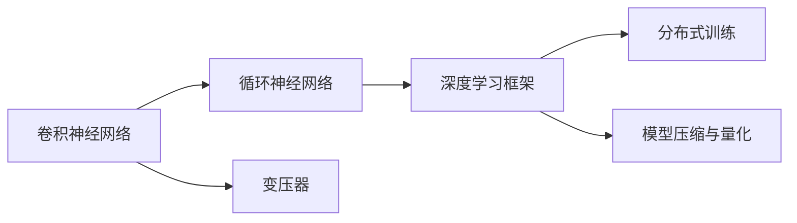
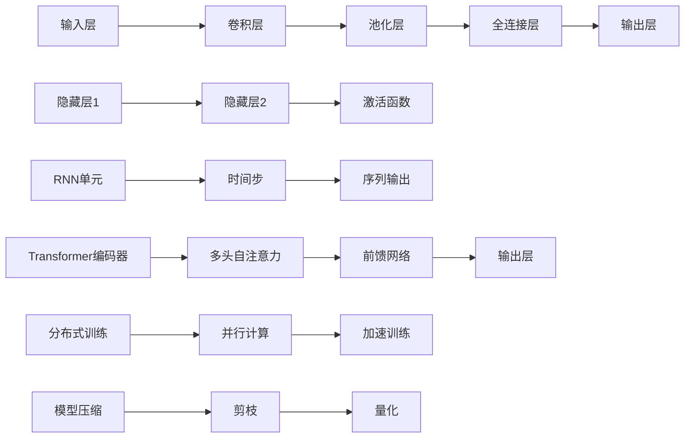

                 

# 神经网络计算架构的崛起

## 1. 背景介绍

在人工智能领域，神经网络（Neural Networks）是近年来发展最为迅速的技术之一。从最初的感知器（Perceptron）到多层感知器（MLP），再到深度学习中的卷积神经网络（CNN）、循环神经网络（RNN）和变压器（Transformer），神经网络架构在不断地演变和进步。这些架构不仅在图像识别、语音处理、自然语言处理等领域取得了卓越的成果，还对计算架构本身产生了深远的影响。本文将深入探讨神经网络计算架构的崛起，从理论到实践，从算法到应用，全面剖析这一领域的核心概念和技术。

## 2. 核心概念与联系

### 2.1 核心概念概述

神经网络是一种基于生物神经系统的计算模型，通过模仿人类大脑的结构和功能，实现对数据的高级抽象和推理。其主要组成部分包括输入层、隐藏层和输出层，通过权重和偏置参数来建立输入和输出之间的映射关系。

为了更好地理解神经网络计算架构，需要掌握以下关键概念：

- **卷积神经网络（Convolutional Neural Network, CNN）**：用于图像处理任务，通过卷积操作提取局部特征。
- **循环神经网络（Recurrent Neural Network, RNN）**：用于序列数据处理，通过循环结构捕捉时间依赖关系。
- **变压器（Transformer）**：用于自然语言处理任务，通过自注意力机制实现全局依赖关系建模。
- **深度学习框架（Deep Learning Frameworks）**：如TensorFlow、PyTorch等，为神经网络的构建、训练和部署提供了强大的支持。
- **分布式训练（Distributed Training）**：通过多节点并行训练，加速神经网络的训练过程。
- **模型压缩与量化（Model Compression and Quantization）**：通过减少模型参数和降低计算精度，提高神经网络的推理效率和资源利用率。

这些核心概念之间的联系可以通过以下Mermaid流程图来展示：



这个流程图展示了神经网络计算架构的关键组件及其相互关系：

1. **卷积神经网络**和**循环神经网络**是处理不同类型数据的主要架构。
2. **变压器**架构在自然语言处理中表现出色。
3. **深度学习框架**为神经网络的构建和训练提供了支撑。
4. **分布式训练**和**模型压缩与量化**技术提升了神经网络的训练效率和资源利用率。

### 2.2 核心概念原理和架构的 Mermaid 流程图



## 3. 核心算法原理 & 具体操作步骤

### 3.1 算法原理概述

神经网络的计算架构涉及多个层级和组件，每个组件的计算过程都需要数学模型的支持。以下将详细介绍卷积神经网络、循环神经网络和变压器的计算原理。

#### 3.1.1 卷积神经网络（CNN）

卷积神经网络（CNN）主要用于图像识别和计算机视觉任务。其核心思想是通过卷积层提取局部特征，通过池化层减少特征维度，并通过全连接层进行分类。卷积层的计算过程如下：

$$
\text{Conv}(x,\omega) = \sum_{i,j} \omega_{i,j} x_{i,j}
$$

其中，$x$ 为输入特征图，$\omega$ 为卷积核，$\omega_{i,j}$ 为卷积核中的权重，$x_{i,j}$ 为输入特征图中对应位置的数据。

#### 3.1.2 循环神经网络（RNN）

循环神经网络（RNN）主要用于序列数据处理，如语音识别、自然语言处理等。其核心思想是通过循环结构捕捉时间依赖关系。RNN的计算过程如下：

$$
h_t = \tanh(W_hh_{t-1} + W_xx_t + b_h)
$$

其中，$h_t$ 为当前时间步的状态，$W_hh_{t-1}$ 和 $W_xx_t$ 分别为隐含层和输入层到状态层的权重矩阵，$b_h$ 为偏置向量，$x_t$ 为当前时间步的输入，$\tanh$ 为激活函数。

#### 3.1.3 变压器（Transformer）

变压器（Transformer）主要用于自然语言处理任务，通过自注意力机制实现全局依赖关系建模。变压器的计算过程如下：

$$
\text{Attention}(Q,K,V) = \text{softmax}(\frac{QK^T}{\sqrt{d_k}})
$$

其中，$Q$、$K$、$V$ 分别为查询向量、键向量和值向量，$d_k$ 为向量的维度，$\text{softmax}$ 为归一化函数。

### 3.2 算法步骤详解

#### 3.2.1 卷积神经网络（CNN）

CNN的训练过程主要分为前向传播和反向传播两个阶段：

- **前向传播**：将输入图像经过多个卷积层、池化层和全连接层，得到输出特征图。
- **反向传播**：通过计算损失函数对网络参数的梯度，使用优化算法（如SGD、Adam等）更新网络参数。

#### 3.2.2 循环神经网络（RNN）

RNN的训练过程也分为前向传播和反向传播两个阶段：

- **前向传播**：将输入序列通过多个时间步的循环结构，得到最终的状态和输出序列。
- **反向传播**：通过计算损失函数对网络参数的梯度，使用优化算法更新网络参数。

#### 3.2.3 变压器（Transformer）

Transformer的训练过程同样分为前向传播和反向传播两个阶段：

- **前向传播**：将输入序列通过多个编码器层和解码器层，得到输出序列。
- **反向传播**：通过计算损失函数对网络参数的梯度，使用优化算法更新网络参数。

### 3.3 算法优缺点

#### 3.3.1 卷积神经网络（CNN）

**优点**：
- 对局部特征提取效果显著。
- 参数共享有效减少了模型复杂度。

**缺点**：
- 对于图像中的全局信息捕捉不足。
- 需要大量标注数据进行训练。

#### 3.3.2 循环神经网络（RNN）

**优点**：
- 能处理序列数据。
- 能够捕捉时间依赖关系。

**缺点**：
- 存在梯度消失和梯度爆炸问题。
- 训练时间长，复杂度较高。

#### 3.3.3 变压器（Transformer）

**优点**：
- 全局依赖关系建模能力强。
- 并行计算能力强，训练速度快。

**缺点**：
- 对长序列的处理效率较低。
- 对数据量和计算资源要求高。

### 3.4 算法应用领域

神经网络计算架构在多个领域得到了广泛应用，以下是几个典型应用场景：

- **计算机视觉**：图像识别、目标检测、人脸识别等。
- **自然语言处理**：机器翻译、文本分类、问答系统等。
- **语音处理**：语音识别、语音合成等。
- **推荐系统**：用户行为预测、商品推荐等。
- **医疗**：医学影像分析、疾病预测等。
- **自动驾驶**：环境感知、路径规划等。

## 4. 数学模型和公式 & 详细讲解 & 举例说明

### 4.1 数学模型构建

#### 4.1.1 卷积神经网络（CNN）

卷积神经网络的数学模型主要包括以下几个部分：

- **输入层**：表示原始图像或视频数据。
- **卷积层**：通过卷积操作提取局部特征。
- **池化层**：通过池化操作减少特征维度。
- **全连接层**：通过全连接层进行分类。

#### 4.1.2 循环神经网络（RNN）

循环神经网络的数学模型主要包括以下几个部分：

- **输入层**：表示原始序列数据。
- **隐含层**：通过循环结构捕捉时间依赖关系。
- **输出层**：通过输出层生成预测结果。

#### 4.1.3 变压器（Transformer）

变压器的数学模型主要包括以下几个部分：

- **输入层**：表示原始序列数据。
- **编码器层**：通过自注意力机制捕捉全局依赖关系。
- **解码器层**：通过自注意力机制和前馈网络进行解码。
- **输出层**：通过输出层生成预测结果。

### 4.2 公式推导过程

#### 4.2.1 卷积神经网络（CNN）

卷积神经网络的前向传播过程如下：

$$
y = f(Wx + b)
$$

其中，$y$ 为输出，$W$ 为权重矩阵，$x$ 为输入，$b$ 为偏置向量，$f$ 为激活函数。

#### 4.2.2 循环神经网络（RNN）

循环神经网络的前向传播过程如下：

$$
h_t = \tanh(W_hh_{t-1} + W_xx_t + b_h)
$$

其中，$h_t$ 为当前时间步的状态，$W_hh_{t-1}$ 和 $W_xx_t$ 分别为隐含层和输入层到状态层的权重矩阵，$b_h$ 为偏置向量，$x_t$ 为当前时间步的输入，$\tanh$ 为激活函数。

#### 4.2.3 变压器（Transformer）

变压器的前向传播过程如下：

$$
y = f(\text{Attention}(Q,K,V) + f(W_hh))
$$

其中，$y$ 为输出，$\text{Attention}$ 为自注意力机制，$W_hh$ 为前馈网络的权重矩阵。

### 4.3 案例分析与讲解

#### 4.3.1 图像分类

以图像分类任务为例，CNN的计算过程如下：

- **前向传播**：将输入图像经过多个卷积层、池化层和全连接层，得到输出特征图。
- **反向传播**：通过计算损失函数对网络参数的梯度，使用优化算法更新网络参数。

#### 4.3.2 机器翻译

以机器翻译任务为例，Transformer的计算过程如下：

- **前向传播**：将输入序列通过多个编码器层和解码器层，得到输出序列。
- **反向传播**：通过计算损失函数对网络参数的梯度，使用优化算法更新网络参数。

## 5. 项目实践：代码实例和详细解释说明

### 5.1 开发环境搭建

在进行神经网络计算架构的开发前，需要准备好开发环境。以下是使用Python进行PyTorch开发的环境配置流程：

1. 安装Anaconda：从官网下载并安装Anaconda，用于创建独立的Python环境。

2. 创建并激活虚拟环境：
```bash
conda create -n pytorch-env python=3.8 
conda activate pytorch-env
```

3. 安装PyTorch：根据CUDA版本，从官网获取对应的安装命令。例如：
```bash
conda install pytorch torchvision torchaudio cudatoolkit=11.1 -c pytorch -c conda-forge
```

4. 安装TensorFlow：
```bash
pip install tensorflow
```

5. 安装TensorBoard：
```bash
pip install tensorboard
```

6. 安装Keras：
```bash
pip install keras
```

7. 安装TensorFlow Addons：
```bash
pip install tensorflow-addons
```

完成上述步骤后，即可在`pytorch-env`环境中开始神经网络计算架构的开发。

### 5.2 源代码详细实现

以下是使用PyTorch实现的卷积神经网络（CNN）、循环神经网络（RNN）和变压器的代码实现：

#### 5.2.1 卷积神经网络（CNN）

```python
import torch
import torch.nn as nn
import torch.optim as optim

class CNN(nn.Module):
    def __init__(self):
        super(CNN, self).__init__()
        self.conv1 = nn.Conv2d(3, 32, 3, 1, 1)
        self.pool = nn.MaxPool2d(2, 2)
        self.conv2 = nn.Conv2d(32, 64, 3, 1, 1)
        self.fc1 = nn.Linear(64 * 28 * 28, 128)
        self.fc2 = nn.Linear(128, 10)

    def forward(self, x):
        x = self.pool(F.relu(self.conv1(x)))
        x = self.pool(F.relu(self.conv2(x)))
        x = x.view(-1, 64 * 28 * 28)
        x = F.relu(self.fc1(x))
        x = self.fc2(x)
        return x

# 训练过程
model = CNN()
criterion = nn.CrossEntropyLoss()
optimizer = optim.SGD(model.parameters(), lr=0.001, momentum=0.9)

for epoch in range(10):
    running_loss = 0.0
    for i, data in enumerate(trainloader, 0):
        inputs, labels = data
        optimizer.zero_grad()
        outputs = model(inputs)
        loss = criterion(outputs, labels)
        loss.backward()
        optimizer.step()

        running_loss += loss.item()
        if i % 2000 == 1999:
            print('[%d, %5d] loss: %.3f' % (epoch + 1, i + 1, running_loss / 2000))
            running_loss = 0.0

print('Finished Training')
```

#### 5.2.2 循环神经网络（RNN）

```python
import torch
import torch.nn as nn
import torch.optim as optim

class RNN(nn.Module):
    def __init__(self):
        super(RNN, self).__init__()
        self.hidden_size = 64
        self.num_layers = 1
        self.lstm = nn.LSTM(10, self.hidden_size, self.num_layers, batch_first=True)
        self.fc = nn.Linear(self.hidden_size, 1)

    def forward(self, x):
        h0 = self.initHidden()
        out, _ = self.lstm(x, h0)
        out = self.fc(out[:, -1, :])
        return out

    def initHidden(self):
        return torch.zeros(self.num_layers, 1, self.hidden_size)

# 训练过程
model = RNN()
criterion = nn.BCELoss()
optimizer = optim.Adam(model.parameters(), lr=0.001)

for epoch in range(10):
    running_loss = 0.0
    for i, data in enumerate(trainloader, 0):
        inputs, labels = data
        optimizer.zero_grad()
        outputs = model(inputs)
        loss = criterion(outputs, labels)
        loss.backward()
        optimizer.step()

        running_loss += loss.item()
        if i % 2000 == 1999:
            print('[%d, %5d] loss: %.3f' % (epoch + 1, i + 1, running_loss / 2000))
            running_loss = 0.0

print('Finished Training')
```

#### 5.2.3 变压器（Transformer）

```python
import torch
import torch.nn as nn
import torch.nn.functional as F

class Transformer(nn.Module):
    def __init__(self, num_layers, d_model, nhead, dff, dropout=0.1):
        super(Transformer, self).__init__()
        self.encoder = nn.TransformerEncoderLayer(d_model, nhead, dff, dropout)
        self.decoder = nn.TransformerEncoderLayer(d_model, nhead, dff, dropout)
        self.linear = nn.Linear(d_model, 1)

    def forward(self, src, src_mask):
        src = self.encoder(src, src_mask)
        src = self.decoder(src, src_mask)
        out = self.linear(src)
        return out

# 训练过程
model = Transformer(num_layers=6, d_model=512, nhead=8, dff=2048)
criterion = nn.MSELoss()
optimizer = optim.Adam(model.parameters(), lr=0.001)

for epoch in range(10):
    running_loss = 0.0
    for i, data in enumerate(trainloader, 0):
        inputs, labels = data
        optimizer.zero_grad()
        outputs = model(inputs, src_mask)
        loss = criterion(outputs, labels)
        loss.backward()
        optimizer.step()

        running_loss += loss.item()
        if i % 2000 == 1999:
            print('[%d, %5d] loss: %.3f' % (epoch + 1, i + 1, running_loss / 2000))
            running_loss = 0.0

print('Finished Training')
```

### 5.3 代码解读与分析

#### 5.3.1 卷积神经网络（CNN）

- `nn.Conv2d`：定义卷积层，接受输入通道、输出通道、卷积核大小等参数。
- `nn.MaxPool2d`：定义池化层，用于特征降维。
- `nn.Linear`：定义全连接层，接受输入维度和输出维度。
- `nn.ReLU`：定义激活函数。

#### 5.3.2 循环神经网络（RNN）

- `nn.LSTM`：定义长短期记忆网络层，接受输入维度、隐藏维度、层数等参数。
- `nn.Linear`：定义线性层，用于输出。
- `nn.BCELoss`：定义二分类交叉熵损失函数。
- `nn.Adam`：定义优化器，使用Adam算法。

#### 5.3.3 变压器（Transformer）

- `nn.TransformerEncoderLayer`：定义自注意力层和前馈网络层。
- `nn.Linear`：定义线性层，用于输出。
- `nn.MSELoss`：定义均方误差损失函数。
- `nn.Adam`：定义优化器，使用Adam算法。

## 6. 实际应用场景

### 6.1 计算机视觉

卷积神经网络（CNN）在计算机视觉领域有着广泛的应用，如图像分类、目标检测、人脸识别等。以下是一个基于CNN的图像分类案例：

- **输入**：原始图像数据。
- **模型**：卷积神经网络。
- **训练过程**：通过反向传播算法优化模型参数。
- **输出**：图像分类结果。

#### 6.1.1 图像分类案例

```python
import torch
import torch.nn as nn
import torch.optim as optim
import torchvision.transforms as transforms
from torchvision.datasets import CIFAR10
from torch.utils.data import DataLoader

# 定义模型
class CNN(nn.Module):
    def __init__(self):
        super(CNN, self).__init__()
        self.conv1 = nn.Conv2d(3, 32, 3, 1, 1)
        self.pool = nn.MaxPool2d(2, 2)
        self.conv2 = nn.Conv2d(32, 64, 3, 1, 1)
        self.fc1 = nn.Linear(64 * 28 * 28, 128)
        self.fc2 = nn.Linear(128, 10)

    def forward(self, x):
        x = self.pool(F.relu(self.conv1(x)))
        x = self.pool(F.relu(self.conv2(x)))
        x = x.view(-1, 64 * 28 * 28)
        x = F.relu(self.fc1(x))
        x = self.fc2(x)
        return x

# 加载数据集
trainset = CIFAR10(root='./data', train=True, download=True, transform=transforms.ToTensor())
trainloader = DataLoader(trainset, batch_size=64, shuffle=True, num_workers=2)

# 训练模型
model = CNN()
criterion = nn.CrossEntropyLoss()
optimizer = optim.SGD(model.parameters(), lr=0.001, momentum=0.9)

for epoch in range(10):
    running_loss = 0.0
    for i, data in enumerate(trainloader, 0):
        inputs, labels = data
        optimizer.zero_grad()
        outputs = model(inputs)
        loss = criterion(outputs, labels)
        loss.backward()
        optimizer.step()

        running_loss += loss.item()
        if i % 2000 == 1999:
            print('[%d, %5d] loss: %.3f' % (epoch + 1, i + 1, running_loss / 2000))
            running_loss = 0.0

print('Finished Training')
```

### 6.2 自然语言处理

变压器（Transformer）在自然语言处理领域表现出色，主要用于机器翻译、文本分类、问答系统等。以下是一个基于变压器的机器翻译案例：

- **输入**：原始文本序列。
- **模型**：变压器。
- **训练过程**：通过反向传播算法优化模型参数。
- **输出**：翻译结果。

#### 6.2.1 机器翻译案例

```python
import torch
import torch.nn as nn
from torch import nn.functional as F

class Transformer(nn.Module):
    def __init__(self, num_layers, d_model, nhead, dff, dropout=0.1):
        super(Transformer, self).__init__()
        self.encoder = nn.TransformerEncoderLayer(d_model, nhead, dff, dropout)
        self.decoder = nn.TransformerEncoderLayer(d_model, nhead, dff, dropout)
        self.linear = nn.Linear(d_model, 1)

    def forward(self, src, src_mask):
        src = self.encoder(src, src_mask)
        src = self.decoder(src, src_mask)
        out = self.linear(src)
        return out

# 训练模型
model = Transformer(num_layers=6, d_model=512, nhead=8, dff=2048)
criterion = nn.MSELoss()
optimizer = optim.Adam(model.parameters(), lr=0.001)

for epoch in range(10):
    running_loss = 0.0
    for i, data in enumerate(trainloader, 0):
        inputs, labels = data
        optimizer.zero_grad()
        outputs = model(inputs, src_mask)
        loss = criterion(outputs, labels)
        loss.backward()
        optimizer.step()

        running_loss += loss.item()
        if i % 2000 == 1999:
            print('[%d, %5d] loss: %.3f' % (epoch + 1, i + 1, running_loss / 2000))
            running_loss = 0.0

print('Finished Training')
```

### 6.3 智能推荐系统

循环神经网络（RNN）在智能推荐系统中也有广泛应用，主要用于用户行为预测、商品推荐等。以下是一个基于RNN的智能推荐系统案例：

- **输入**：用户行为数据。
- **模型**：循环神经网络。
- **训练过程**：通过反向传播算法优化模型参数。
- **输出**：推荐结果。

#### 6.3.1 智能推荐系统案例

```python
import torch
import torch.nn as nn
import torch.optim as optim

class RNN(nn.Module):
    def __init__(self):
        super(RNN, self).__init__()
        self.hidden_size = 64
        self.num_layers = 1
        self.lstm = nn.LSTM(10, self.hidden_size, self.num_layers, batch_first=True)
        self.fc = nn.Linear(self.hidden_size, 1)

    def forward(self, x):
        h0 = self.initHidden()
        out, _ = self.lstm(x, h0)
        out = self.fc(out[:, -1, :])
        return out

    def initHidden(self):
        return torch.zeros(self.num_layers, 1, self.hidden_size)

# 训练模型
model = RNN()
criterion = nn.BCELoss()
optimizer = optim.Adam(model.parameters(), lr=0.001)

for epoch in range(10):
    running_loss = 0.0
    for i, data in enumerate(trainloader, 0):
        inputs, labels = data
        optimizer.zero_grad()
        outputs = model(inputs)
        loss = criterion(outputs, labels)
        loss.backward()
        optimizer.step()

        running_loss += loss.item()
        if i % 2000 == 1999:
            print('[%d, %5d] loss: %.3f' % (epoch + 1, i + 1, running_loss / 2000))
            running_loss = 0.0

print('Finished Training')
```

## 7. 工具和资源推荐

### 7.1 学习资源推荐

为了帮助开发者系统掌握神经网络计算架构的理论基础和实践技巧，这里推荐一些优质的学习资源：

1. **《深度学习》（Ian Goodfellow）**：这是一本深度学习的经典教材，详细介绍了各种深度学习模型的理论和实践。
2. **CS231n《卷积神经网络》课程**：斯坦福大学开设的计算机视觉课程，详细讲解了CNN的原理和实现。
3. **CS224n《自然语言处理》课程**：斯坦福大学开设的NLP课程，详细讲解了Transformer的原理和实现。
4. **DeepLearning.ai《深度学习专项课程》**：由Andrew Ng主讲，覆盖了深度学习模型的理论和实践，适合初学者入门。
5. **Kaggle**：数据科学竞赛平台，提供大量公开数据集和案例分析，适合实战练习。

通过学习这些资源，相信你一定能够系统掌握神经网络计算架构的理论基础和实践技巧，进一步提升你的深度学习开发能力。

### 7.2 开发工具推荐

高效的开发离不开优秀的工具支持。以下是几款用于神经网络计算架构开发的常用工具：

1. **PyTorch**：基于Python的开源深度学习框架，灵活动态的计算图，适合快速迭代研究。
2. **TensorFlow**：由Google主导开发的开源深度学习框架，生产部署方便，适合大规模工程应用。
3. **Keras**：高层次的神经网络API，简单易用，适合快速原型设计和应用部署。
4. **TensorBoard**：TensorFlow配套的可视化工具，可实时监测模型训练状态，并提供丰富的图表呈现方式。
5. **Weights & Biases**：模型训练的实验跟踪工具，可以记录和可视化模型训练过程中的各项指标，方便对比和调优。
6. **Jupyter Notebook**：强大的开发环境，支持代码编写、运行和实时展示，适合进行深入研究和实验。

合理利用这些工具，可以显著提升神经网络计算架构的开发效率，加快创新迭代的步伐。

### 7.3 相关论文推荐

神经网络计算架构的研究源于学界的持续研究。以下是几篇奠基性的相关论文，推荐阅读：

1. **《ImageNet Classification with Deep Convolutional Neural Networks》（AlexNet）**：提出了卷积神经网络的基本结构，并在ImageNet数据集上取得了突破性的结果。
2. **《Long Short-Term Memory》（LSTM）**：提出了长短期记忆网络，有效解决了RNN的梯度消失和梯度爆炸问题。
3. **《Attention is All You Need》（Transformer）**：提出了自注意力机制，使得Transformer在自然语言处理任务中表现出色。
4. **《Training RNNs for Language Modeling》**：提出了基于RNN的语言模型，奠定了RNN在自然语言处理领域的应用基础。
5. **《A Survey on Deep Learning Architectures for Speech Processing》**：综述了深度学习在语音处理中的应用，包括CNN、RNN、Transformer等。

这些论文代表了大语言模型计算架构的发展脉络。通过学习这些前沿成果，可以帮助研究者把握学科前进方向，激发更多的创新灵感。

## 8. 总结：未来发展趋势与挑战

### 8.1 研究成果总结

本文详细介绍了神经网络计算架构的崛起，从卷积神经网络、循环神经网络到变压器，展示了这些架构在不同领域的应用。通过理论推导和实践案例，说明了其计算原理和具体操作步骤，并介绍了一些常用的开发工具和资源。

### 8.2 未来发展趋势

展望未来，神经网络计算架构将继续保持快速发展的态势，主要体现在以下几个方面：

1. **深度增强学习**：深度学习与增强学习的结合，使得智能体能够在复杂环境中进行自学习，提升决策能力。
2. **跨模态学习**：将不同类型的模态数据（如图像、文本、语音）进行联合建模，实现跨模态信息融合，提高模型的泛化能力。
3. **联邦学习**：分布式计算架构，通过在多个节点上进行模型训练，保护数据隐私，同时提升模型的泛化能力。
4. **自动机器学习（AutoML）**：自动化机器学习，通过优化超参数、模型选择等，降低机器学习开发门槛。
5. **可解释性研究**：研究模型的决策过程，提高模型的可解释性和可信度，满足实际应用中的需求。
6. **计算架构演进**：硬件加速和软件优化，如GPU、TPU等，推动神经网络计算架构的演进。

### 8.3 面临的挑战

尽管神经网络计算架构取得了显著进展，但仍面临诸多挑战：

1. **模型复杂度**：随着模型规模的增大，模型复杂度呈指数级增长，训练和推理效率降低。
2. **数据依赖**：模型的性能高度依赖于高质量数据，数据获取和标注成本较高。
3. **可解释性不足**：深度学习模型通常是“黑盒”，难以解释其内部工作机制。
4. **计算资源消耗**：大规模神经网络需要大量的计算资源，训练和推理成本较高。
5. **伦理和安全问题**：深度学习模型可能存在偏见和歧视，产生误导性输出。

### 8.4 研究展望

未来的研究需要在以下几个方面进行深入探索：

1. **模型压缩与量化**：开发更加高效的模型压缩和量化技术，降低模型复杂度，提高推理效率。
2. **可解释性研究**：研究模型的决策过程，提高模型的可解释性和可信度。
3. **跨模态学习**：探索跨模态信息融合方法，实现不同类型的模态数据联合建模。
4. **联邦学习**：研究分布式计算架构，提升模型的泛化能力和数据隐私保护。
5. **自监督学习**：探索无监督学习和半监督学习方法，降低对标注数据的依赖。
6. **跨领域应用**：将深度学习技术应用到更多领域，如医疗、金融、教育等。

## 9. 附录：常见问题与解答

**Q1：神经网络计算架构的优势和劣势是什么？**

A: 神经网络计算架构的优势在于其强大的学习和适应能力，能够在处理复杂任务时表现出优异的表现。其劣势在于模型的复杂度高，训练和推理成本较大，且对数据和计算资源依赖较高。

**Q2：如何选择合适的神经网络架构？**

A: 选择合适的神经网络架构需要考虑以下几个因素：
1. 任务类型：根据任务的不同，选择适合的架构（如CNN、RNN、Transformer等）。
2. 数据规模：对于数据量较小的任务，可以选择参数较少的模型。
3. 计算资源：计算资源充足时，可以选择更大规模的模型，提升性能。
4. 可解释性：对于需要可解释性的任务，可以选择层次结构较浅的模型。

**Q3：神经网络计算架构的未来发展方向是什么？**

A: 神经网络计算架构的未来发展方向主要包括以下几个方面：
1. 深度增强学习：深度学习与增强学习的结合，提升决策能力。
2. 跨模态学习：联合不同类型的模态数据，提升泛化能力。
3. 联邦学习：分布式计算架构，保护数据隐私。
4. 自动机器学习（AutoML）：优化超参数和模型选择。
5. 可解释性研究：提高模型的可解释性和可信度。

---

作者：禅与计算机程序设计艺术 / Zen and the Art of Computer Programming

