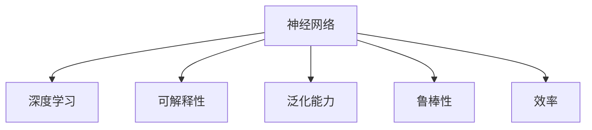

                 

## 1. 背景介绍

### 1.1 问题由来

在当今数字化时代，人工智能(AI)技术迅猛发展，神经网络(Neural Networks, NN)作为其核心算法之一，在图像识别、语音识别、自然语言处理等领域取得了令人瞩目的成绩。随着深度学习技术的不断进步，神经网络已经从简单的感知机模型，发展成为复杂的深度学习框架，能够处理各种复杂任务。

然而，神经网络并非完美无缺。尽管其在许多任务上表现出色，但仍然面临诸多挑战。如何让人类与机器共存，构建和谐的人机交互环境，成为当下研究的热点问题。

### 1.2 问题核心关键点

神经网络的核心挑战包括模型可解释性、泛化能力、鲁棒性和效率。这些问题不仅限制了神经网络的实际应用，还可能带来伦理和安全问题。

- **模型可解释性**：深度神经网络通常被视为“黑箱”，难以解释其内部决策过程。
- **泛化能力**：神经网络在特定训练数据集上表现优异，但对新数据的泛化能力有限。
- **鲁棒性**：面对输入噪声、对抗样本等扰动，神经网络可能表现出脆弱性。
- **效率**：神经网络的计算复杂度高，需要大量硬件资源支持。

这些问题不仅限制了神经网络的实际应用，还可能带来伦理和安全问题。因此，如何让人类与机器共存，构建和谐的人机交互环境，成为当下研究的热点问题。

## 2. 核心概念与联系

### 2.1 核心概念概述

为了更好地理解神经网络与人类共存的问题，本节将介绍几个关键概念：

- **神经网络(Neural Network, NN)**：一种由多个层次的节点组成的人工神经网络模型，通过学习输入数据，预测输出结果。
- **深度学习(Deep Learning)**：一类使用多层次非线性模型的机器学习方法，能够处理非线性关系，具有很强的学习能力。
- **可解释性(Explainability)**：指对模型决策过程的解释和说明，便于理解和调试。
- **泛化能力(Generalization)**：指模型在未见过的数据上的表现，即模型的泛化性能。
- **鲁棒性(Robustness)**：指模型对输入扰动的容忍度，即模型的鲁棒性能。
- **效率(Efficiency)**：指模型在计算、存储等方面的资源消耗，即模型的运行效率。

这些概念之间的逻辑关系可以通过以下Mermaid流程图来展示：



这个流程图展示了一组相关概念的层次关系：神经网络是深度学习的基础，而可解释性、泛化能力、鲁棒性和效率则是衡量神经网络性能的重要指标。

## 3. 核心算法原理 & 具体操作步骤

### 3.1 算法原理概述

神经网络通过多层非线性变换，对输入数据进行处理并输出预测结果。深度学习则在此基础上，通过多层次的非线性组合，学习到更加复杂的特征表示。

神经网络的训练过程，通常通过反向传播算法(Backpropagation)来实现。反向传播算法通过梯度下降等优化方法，最小化损失函数，使得神经网络能够逼近目标函数。

### 3.2 算法步骤详解

神经网络的训练一般包括以下几个关键步骤：

**Step 1: 数据预处理**
- 将原始数据转化为模型能够处理的格式。
- 对数据进行标准化、归一化等预处理，以便更好地训练模型。

**Step 2: 模型初始化**
- 随机初始化神经网络的权重和偏置参数。
- 选择合适的激活函数和损失函数。

**Step 3: 前向传播**
- 将输入数据通过模型，得到预测输出。
- 计算损失函数，衡量预测输出与真实标签之间的差异。

**Step 4: 反向传播**
- 计算损失函数对模型参数的梯度。
- 使用梯度下降等优化算法，更新模型参数。

**Step 5: 模型评估**
- 在验证集或测试集上评估模型性能。
- 根据评估结果调整超参数，进一步优化模型。

### 3.3 算法优缺点

神经网络具有以下优点：
1. 强大的学习能力：能够处理复杂的非线性关系，适用于各种任务。
2. 灵活性：可以自适应不同的任务，通过微调优化。
3. 并行计算：多层次非线性组合能够并行计算，加速训练过程。

然而，神经网络也存在以下缺点：
1. 可解释性差：深度神经网络通常被视为“黑箱”，难以解释其内部决策过程。
2. 泛化能力有限：神经网络容易过拟合，泛化性能较差。
3. 鲁棒性不足：面对输入噪声、对抗样本等扰动，神经网络可能表现出脆弱性。
4. 效率问题：神经网络的计算复杂度高，需要大量硬件资源支持。

### 3.4 算法应用领域

神经网络已经在图像识别、语音识别、自然语言处理、推荐系统等多个领域得到了广泛应用：

- 图像识别：如卷积神经网络(CNN)，在图像分类、目标检测等领域表现出色。
- 语音识别：如循环神经网络(RNN)，能够处理时间序列数据，实现语音识别。
- 自然语言处理：如Transformer模型，能够处理自然语言文本，实现机器翻译、情感分析等任务。
- 推荐系统：如协同过滤模型，能够根据用户历史行为，推荐相似的物品。

神经网络在各个领域的应用，极大地推动了技术进步和社会发展。未来，随着神经网络技术的不断进步，其应用范围还将进一步扩展。

## 4. 数学模型和公式 & 详细讲解

### 4.1 数学模型构建

神经网络可以形式化地表示为：

$$ y = f(Wx + b) $$

其中，$y$ 为输出，$x$ 为输入，$W$ 为权重矩阵，$b$ 为偏置向量，$f$ 为激活函数。

神经网络的训练目标是最小化损失函数：

$$ \min_{\theta} L(y, y^*) $$

其中，$y^*$ 为真实标签，$L$ 为损失函数，$\theta$ 为模型参数。

### 4.2 公式推导过程

以二分类问题为例，假设模型输出为：

$$ y = \sigma(Wx + b) $$

其中，$\sigma$ 为 sigmoid 函数，$W$ 和 $b$ 为模型参数。

给定训练样本 $(x_i, y_i)$，损失函数定义为交叉熵损失：

$$ L(y, y^*) = -\frac{1}{N}\sum_{i=1}^N [y_i\log y_i + (1-y_i)\log(1-y_i)] $$

将模型输出 $y$ 代入损失函数中，得到：

$$ L(\sigma(Wx_i + b), y_i) = -\frac{1}{N}\sum_{i=1}^N [-y_i\log(\sigma(Wx_i + b)) - (1-y_i)\log(1-\sigma(Wx_i + b))] $$

通过反向传播算法，计算损失函数对模型参数的梯度：

$$ \frac{\partial L}{\partial W} = \frac{\partial L}{\partial y} \frac{\partial y}{\partial x} \frac{\partial x}{\partial W} $$
$$ \frac{\partial L}{\partial b} = \frac{\partial L}{\partial y} $$

其中，$\frac{\partial L}{\partial y}$ 为损失函数对输出的梯度，$\frac{\partial y}{\partial x}$ 为激活函数对输入的梯度。

使用梯度下降等优化算法，更新模型参数：

$$ \theta \leftarrow \theta - \eta \nabla_{\theta}L(\theta) $$

其中，$\eta$ 为学习率，$\nabla_{\theta}L(\theta)$ 为损失函数对参数的梯度。

### 4.3 案例分析与讲解

以手写数字识别为例，我们可以使用卷积神经网络(CNN)进行训练。

假设输入图像大小为 $28\times28$，输出层节点数为 $10$，表示 0-9 十个数字。损失函数采用交叉熵损失。

**Step 1: 数据预处理**
- 将手写数字图像转化为像素值形式。
- 将图像进行归一化处理。

**Step 2: 模型初始化**
- 使用随机初始化方法，随机生成权重和偏置参数。
- 选择激活函数为 ReLU。

**Step 3: 前向传播**
- 将输入图像通过卷积层、池化层等，得到特征图。
- 将特征图通过全连接层，得到预测输出。

**Step 4: 反向传播**
- 计算交叉熵损失，并计算梯度。
- 使用随机梯度下降等优化算法，更新权重和偏置参数。

**Step 5: 模型评估**
- 在测试集上评估模型性能，计算准确率等指标。

## 5. 项目实践：代码实例和详细解释说明

### 5.1 开发环境搭建

在进行神经网络开发前，我们需要准备好开发环境。以下是使用Python进行PyTorch开发的环境配置流程：

1. 安装Anaconda：从官网下载并安装Anaconda，用于创建独立的Python环境。

2. 创建并激活虚拟环境：
```bash
conda create -n pytorch-env python=3.8 
conda activate pytorch-env
```

3. 安装PyTorch：根据CUDA版本，从官网获取对应的安装命令。例如：
```bash
conda install pytorch torchvision torchaudio cudatoolkit=11.1 -c pytorch -c conda-forge
```

4. 安装TensorFlow：
```bash
pip install tensorflow
```

5. 安装PyTorch的可视化工具：
```bash
pip install torchvision -f https://download.pytorch.org/whl/torch_v1.7.0.html
```

完成上述步骤后，即可在`pytorch-env`环境中开始神经网络开发。

### 5.2 源代码详细实现

下面我们以手写数字识别为例，使用卷积神经网络(CNN)对MNIST数据集进行训练和测试的PyTorch代码实现。

```python
import torch
import torch.nn as nn
import torch.optim as optim
import torchvision
import torchvision.transforms as transforms
from torchvision.datasets import MNIST

# 数据预处理
transform = transforms.Compose([
    transforms.ToTensor(),
    transforms.Normalize((0.1307,), (0.3081,))
])

train_dataset = MNIST(root='./data', train=True, transform=transform, download=True)
test_dataset = MNIST(root='./data', train=False, transform=transform, download=True)

# 模型初始化
class Net(nn.Module):
    def __init__(self):
        super(Net, self).__init__()
        self.conv1 = nn.Conv2d(1, 32, 3, padding=1)
        self.conv2 = nn.Conv2d(32, 64, 3, padding=1)
        self.pool = nn.MaxPool2d(2, 2)
        self.fc1 = nn.Linear(7*7*64, 128)
        self.fc2 = nn.Linear(128, 10)

    def forward(self, x):
        x = self.pool(torch.relu(self.conv1(x)))
        x = self.pool(torch.relu(self.conv2(x)))
        x = x.view(-1, 7*7*64)
        x = torch.relu(self.fc1(x))
        x = self.fc2(x)
        return x

net = Net()
criterion = nn.CrossEntropyLoss()
optimizer = optim.SGD(net.parameters(), lr=0.001, momentum=0.9)

# 训练过程
for epoch in range(10):
    running_loss = 0.0
    for i, data in enumerate(train_loader, 0):
        inputs, labels = data
        optimizer.zero_grad()
        outputs = net(inputs)
        loss = criterion(outputs, labels)
        loss.backward()
        optimizer.step()
        running_loss += loss.item()
    print(f'Epoch {epoch+1}, Loss: {running_loss/len(train_loader)}')

# 测试过程
correct = 0
total = 0
with torch.no_grad():
    for data in test_loader:
        images, labels = data
        outputs = net(images)
        _, predicted = torch.max(outputs.data, 1)
        total += labels.size(0)
        correct += (predicted == labels).sum().item()
print(f'Accuracy: {correct/total}')
```

以上就是使用PyTorch对CNN进行手写数字识别任务训练和测试的完整代码实现。可以看到，PyTorch提供了高度封装且易于使用的API，使得神经网络的实现变得简洁高效。

### 5.3 代码解读与分析

让我们再详细解读一下关键代码的实现细节：

**Net类**：
- `__init__`方法：初始化卷积层、池化层、全连接层等关键组件。
- `forward`方法：实现模型的前向传播过程。

**训练过程**：
- 使用PyTorch的数据加载器对数据进行批次化加载。
- 在每个批次上，计算损失函数并反向传播更新模型参数。
- 使用优化器进行梯度更新。
- 在每个epoch结束后，输出训练损失。

**测试过程**：
- 在测试集上评估模型性能，计算准确率等指标。

可以看到，PyTorch的自动微分机制和封装良好的API，使得神经网络的实现变得简洁高效。开发者可以将更多精力放在数据处理、模型改进等高层逻辑上，而不必过多关注底层的实现细节。

## 6. 实际应用场景

### 6.1 医疗影像分析

神经网络在医疗影像分析中具有广泛应用。通过预训练的神经网络模型，可以自动识别医学影像中的病灶、组织结构等信息，辅助医生进行诊断。

以肺部CT影像分析为例，可以通过卷积神经网络对影像进行分类、分割、特征提取等处理，从而实现早期肺癌的检测和诊断。通过微调，模型还可以学习特定医院的影像数据，进一步提高诊断的准确性和可靠性。

### 6.2 金融市场预测

神经网络在金融市场预测中也表现出色。通过训练时间序列数据，可以预测股票、期货等金融产品的价格走势。

例如，可以使用循环神经网络(RNN)对历史股价进行建模，预测未来的股价变化。通过微调，模型还可以学习特定的市场特征，提高预测的精度。

### 6.3 自动驾驶

神经网络在自动驾驶中也得到了广泛应用。通过训练图像和激光雷达数据，可以识别道路、车辆、行人等目标，实现自动驾驶决策。

例如，可以使用卷积神经网络对图像进行物体检测和分类，结合激光雷达数据，实现高精度的定位和导航。通过微调，模型还可以学习特定的道路环境，进一步提高自动驾驶的安全性和可靠性。

### 6.4 未来应用展望

未来，神经网络的应用将进一步扩展，涵盖更多领域：

1. 工业自动化：通过训练工业数据，神经网络可以实现自动化生产流程的优化和监控。
2. 智能家居：通过训练用户行为数据，神经网络可以实现智能家居系统的优化和个性化。
3. 教育评估：通过训练学生的学习数据，神经网络可以实现学习效果的评估和个性化推荐。
4. 社会治理：通过训练社会数据，神经网络可以实现公共安全、城市管理等领域的优化。

## 7. 工具和资源推荐

### 7.1 学习资源推荐

为了帮助开发者系统掌握神经网络的理论基础和实践技巧，这里推荐一些优质的学习资源：

1. 《深度学习》课程（斯坦福大学）：由深度学习领域的权威专家讲解，涵盖深度学习的基本原理和经典模型。
2. 《Neural Networks and Deep Learning》书籍：深度学习领域的经典教材，全面介绍了神经网络的理论和实践。
3. 《Python深度学习》书籍：以代码实现为主，介绍了深度学习的基本概念和实践方法。
4. Coursera、Udacity等在线学习平台：提供丰富的深度学习课程和实践项目。
5. GitHub、arXiv等学术社区：可以获取大量的深度学习项目和研究论文。

通过对这些资源的学习实践，相信你一定能够快速掌握神经网络的精髓，并用于解决实际的NLP问题。

### 7.2 开发工具推荐

高效的开发离不开优秀的工具支持。以下是几款用于神经网络开发的常用工具：

1. PyTorch：基于Python的开源深度学习框架，灵活动态的计算图，适合快速迭代研究。
2. TensorFlow：由Google主导开发的开源深度学习框架，生产部署方便，适合大规模工程应用。
3. Keras：高层次的深度学习API，简单易用，适合初学者和快速原型开发。
4. Jupyter Notebook：交互式的开发环境，支持代码编写、运行和结果展示。
5. TensorBoard：TensorFlow配套的可视化工具，可实时监测模型训练状态，并提供丰富的图表呈现方式。

合理利用这些工具，可以显著提升神经网络的开发效率，加快创新迭代的步伐。

### 7.3 相关论文推荐

神经网络技术的发展得益于学界的持续研究。以下是几篇奠基性的相关论文，推荐阅读：

1. LeNet：经典的卷积神经网络模型，广泛应用于图像识别领域。
2. AlexNet：经典的图像识别模型，使用了多层卷积和池化层。
3. InceptionNet：经典的图像识别模型，使用了多层次卷积核。
4. ResNet：经典的残差网络，使用了残差连接，解决了深层网络退化的问题。
5. Transformer：经典的自然语言处理模型，使用了自注意力机制，提升了模型的性能。

这些论文代表了大神经网络的发展脉络。通过学习这些前沿成果，可以帮助研究者把握学科前进方向，激发更多的创新灵感。

## 8. 总结：未来发展趋势与挑战

### 8.1 总结

本文对神经网络与人类共存的问题进行了全面系统的介绍。首先阐述了神经网络的核心挑战，包括可解释性、泛化能力、鲁棒性和效率。接着，从原理到实践，详细讲解了神经网络的训练过程和实际应用。

通过本文的系统梳理，可以看到，神经网络在诸多领域得到了广泛应用，取得了令人瞩目的成绩。未来，随着神经网络技术的不断进步，其应用范围还将进一步扩展。

### 8.2 未来发展趋势

未来，神经网络的发展将呈现以下几个趋势：

1. 模型可解释性：通过引入可解释性技术，如局部解释、全局解释等，使得神经网络更加透明和可信。
2. 泛化能力提升：通过改进训练方法和优化模型结构，提高神经网络的泛化性能，使其在未见过的数据上表现更好。
3. 鲁棒性增强：通过引入鲁棒性技术，如对抗样本训练、鲁棒正则化等，提高神经网络的鲁棒性能，使其更难被攻击和扰动。
4. 效率优化：通过优化模型结构和计算图，提高神经网络的计算效率，使其在资源受限的环境下也能高效运行。

### 8.3 面临的挑战

尽管神经网络在许多领域取得了显著成果，但在迈向更加智能化、普适化应用的过程中，它仍面临着诸多挑战：

1. 数据依赖性强：神经网络的性能很大程度上依赖于高质量的数据，数据获取和标注成本较高。
2. 模型复杂度高：神经网络的计算复杂度高，需要大量硬件资源支持。
3. 泛化能力差：神经网络容易过拟合，泛化性能较差。
4. 可解释性差：深度神经网络通常被视为“黑箱”，难以解释其内部决策过程。

### 8.4 研究展望

面对神经网络面临的挑战，未来的研究需要在以下几个方面寻求新的突破：

1. 数据增强：通过数据增强技术，扩大训练集的规模，提高神经网络的泛化能力。
2. 模型简化：通过模型简化技术，降低神经网络的计算复杂度，提高其运行效率。
3. 正则化：通过正则化技术，提高神经网络的鲁棒性能，使其更难被攻击和扰动。
4. 可解释性：通过可解释性技术，提高神经网络的透明性和可信度，使其更容易被理解和调试。

这些研究方向的探索，必将引领神经网络技术迈向更高的台阶，为构建人机协同的智能系统铺平道路。面向未来，神经网络需要与其他人工智能技术进行更深入的融合，如知识表示、因果推理、强化学习等，多路径协同发力，共同推动自然语言理解和智能交互系统的进步。只有勇于创新、敢于突破，才能不断拓展神经网络的边界，让智能技术更好地造福人类社会。

## 9. 附录：常见问题与解答

**Q1: 神经网络的可解释性如何提升？**

A: 神经网络的可解释性可以通过以下方法提升：
1. 可视化技术：使用可视化工具，如t-SNE、Umap等，可视化神经网络的中间表示，帮助理解模型的内部结构。
2. 局部解释方法：通过Shapley值、LIME等方法，解释神经网络对单个样本的决策过程。
3. 全局解释方法：通过Fairness、ROC曲线等方法，解释神经网络对整体数据集的性能表现。

**Q2: 神经网络的泛化能力如何提升？**

A: 神经网络的泛化能力可以通过以下方法提升：
1. 数据增强：通过数据增强技术，扩充训练集的规模，提高神经网络的泛化能力。
2. 正则化：通过L2正则化、Dropout等方法，防止神经网络过拟合。
3. 模型简化：通过模型简化技术，降低神经网络的计算复杂度，提高其泛化性能。
4. 迁移学习：通过迁移学习技术，利用预训练模型的知识，提高神经网络的泛化能力。

**Q3: 神经网络的鲁棒性如何增强？**

A: 神经网络的鲁棒性可以通过以下方法增强：
1. 对抗训练：通过对抗样本训练，提高神经网络对输入扰动的容忍度。
2. 鲁棒正则化：通过鲁棒正则化技术，提高神经网络的鲁棒性能。
3. 数据增强：通过数据增强技术，扩充训练集的规模，提高神经网络的鲁棒性能。
4. 模型简化：通过模型简化技术，降低神经网络的计算复杂度，提高其鲁棒性能。

**Q4: 神经网络的效率如何优化？**

A: 神经网络的效率可以通过以下方法优化：
1. 模型简化：通过模型简化技术，降低神经网络的计算复杂度，提高其运行效率。
2. 计算图优化：通过优化神经网络的计算图，减少前向传播和反向传播的资源消耗，提高其运行效率。
3. 硬件加速：通过硬件加速技术，如GPU、TPU等，提高神经网络的计算效率。
4. 压缩技术：通过压缩技术，如量化、剪枝等，降低神经网络的存储空间和计算复杂度，提高其运行效率。

这些方法可以综合运用，以提高神经网络的性能和应用范围。

