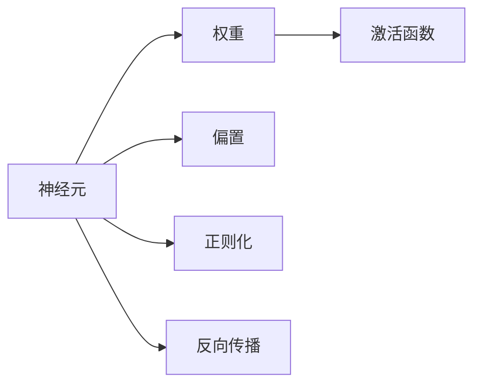

                 

# 神经网络：人类智慧的延伸

## 1. 背景介绍

### 1.1 问题由来

随着人工智能(AI)技术的发展，神经网络(Neural Networks, NNs)已经成为实现各种复杂智能任务的重要工具。从图像识别到自然语言处理，从机器人控制到游戏策略优化，神经网络技术几乎渗透到了每个领域。然而，这种技术的突飞猛进，也引发了人们对神经网络本质的深度思考：

- 神经网络是如何模仿人类大脑工作机制的？
- 神经网络能真正理解和表达人类智慧吗？
- 神经网络技术如何帮助人类不断拓展智慧边界？

本文将从神经网络的概念起源、工作原理、应用场景以及未来趋势等多个维度，深入探讨神经网络如何成为人类智慧的延伸，如何助力人类进入更加智能的未来。

### 1.2 问题核心关键点

神经网络技术的快速发展，很大程度上得益于深度学习(Deep Learning)的突破。深度学习是一种基于多层神经网络的机器学习算法，能够通过层次化的特征提取和学习，自动地从数据中提取抽象的高级特征，实现复杂的智能任务。以下是神经网络技术的几个核心关键点：

- 多层感知机(Multilayer Perceptron, MLP)：神经网络的基本组成单元，由多个线性变换和非线性激活函数堆叠而成。
- 反向传播(Backpropagation)：通过梯度下降等优化算法，反向传播误差信号，更新模型参数。
- 损失函数(Loss Function)：衡量模型预测与真实标签之间的差异，是优化算法的目标函数。
- 激活函数(Activation Function)：引入非线性特性，使神经网络能够处理非线性问题。
- 卷积神经网络(Convolutional Neural Networks, CNNs)：专为图像处理设计的神经网络，通过卷积和池化操作提取图像特征。
- 循环神经网络(Recurrent Neural Networks, RNNs)：用于处理序列数据的神经网络，通过循环结构保持信息记忆。
- 生成对抗网络(Generative Adversarial Networks, GANs)：通过对抗训练生成高质量的图像、视频等数据。

神经网络技术的应用，已经改变了人类对复杂问题的认知方式，带来了全新的智能革命。理解这些关键点，对于深入探讨神经网络如何延伸人类智慧至关重要。

## 2. 核心概念与联系

### 2.1 核心概念概述

神经网络技术的核心概念包括：

- 神经元(Neuron)：神经网络的基本计算单元，通过输入加权和激活函数计算输出。
- 权重(Weight)：连接神经元的参数，反映了输入特征对输出的影响。
- 偏置(Bias)：神经元的固定偏移量，用于调整神经元的输出值。
- 激活函数(Activation Function)：引入非线性特性，使神经网络能够处理非线性问题。
- 正则化(Regularization)：通过加入惩罚项，防止模型过拟合。
- 反向传播(Backpropagation)：通过梯度下降等优化算法，反向传播误差信号，更新模型参数。

这些概念之间的联系可以通过以下Mermaid流程图来展示：



这个流程图展示神经网络的核心组件及其相互关系：

1. 神经元是网络的基本计算单元，通过权重和偏置计算输出。
2. 激活函数引入非线性特性，使神经网络能够处理非线性问题。
3. 正则化技术通过加入惩罚项，防止模型过拟合。
4. 反向传播算法通过梯度下降等优化算法，更新模型参数，优化输出。

## 3. 核心算法原理 & 具体操作步骤

### 3.1 算法原理概述

神经网络通过多层非线性变换，自动地从输入数据中学习出抽象的高级特征，从而实现复杂的智能任务。其核心原理可以简述为以下几个步骤：

1. 输入层：接收原始数据，通过线性和非线性变换传递到下一层。
2. 隐藏层：通过多层非线性变换，提取更高级的特征表示。
3. 输出层：将隐藏层输出的高级特征映射到具体的任务标签。
4. 损失函数：衡量模型预测与真实标签之间的差异。
5. 反向传播：通过梯度下降等优化算法，反向传播误差信号，更新模型参数。

形式化地，假设神经网络模型为 $M_{\theta}(x)$，其中 $\theta$ 为模型参数，$x$ 为输入数据。模型的输出为 $y=M_{\theta}(x)$，其与真实标签 $y^*$ 之间的误差为 $\ell(y,y^*)$。优化目标是最小化损失函数，即：

$$
\min_{\theta} \mathbb{E}_{x,y^*} \ell(y,y^*)
$$

其中 $\mathbb{E}_{x,y^*}$ 表示对所有训练数据 $(x,y^*)$ 的期望。

### 3.2 算法步骤详解

基于神经网络的智能任务开发，通常包括以下几个关键步骤：

**Step 1: 准备数据集**
- 收集标注数据集 $D=\{(x_i,y_i)\}_{i=1}^N$，其中 $x_i$ 为输入，$y_i$ 为真实标签。
- 将数据划分为训练集、验证集和测试集，比例一般为 70%-15%-15%。

**Step 2: 设计神经网络架构**
- 选择神经网络的基本组件，如全连接层、卷积层、循环层等。
- 设计各层的网络参数，如节点数、激活函数、正则化强度等。
- 确定输出层的维度，如分类任务为单节点softmax，回归任务为单节点linear。

**Step 3: 选择合适的优化器**
- 选择梯度下降算法及其变种，如SGD、Adam、RMSprop等。
- 设定学习率 $\eta$ 和迭代次数 $T$，选择合适的优化器参数。

**Step 4: 执行前向传播和反向传播**
- 对训练集数据进行批处理，前向传播计算模型输出。
- 计算损失函数 $\ell(y,y^*)$，反向传播误差信号。
- 更新模型参数 $\theta$，优化模型性能。

**Step 5: 验证和测试**
- 在验证集上评估模型性能，防止过拟合。
- 在测试集上最终测试模型，评估其泛化能力。

这些步骤构成了一个完整的神经网络智能任务开发流程，涵盖了数据准备、模型设计、训练优化、评估测试等多个环节。通过合理设计和优化，神经网络技术能够高效地解决各种复杂的智能问题。

### 3.3 算法优缺点

神经网络技术具有以下优点：
1. 自适应性强。神经网络能够自动学习数据中的高级特征，适应各种复杂任务。
2. 可解释性差。神经网络的内部工作机制难以解释，难以理解其决策逻辑。
3. 参数量大。神经网络往往需要大量的参数进行训练，对计算资源和存储资源有较高要求。
4. 过拟合风险高。在数据量较小的情况下，神经网络容易出现过拟合。
5. 训练过程复杂。需要大量的计算资源和优化技巧，训练过程较为耗时。

同时，神经网络技术也存在一定的局限性：
1. 依赖数据质量。神经网络的性能很大程度上依赖于训练数据的质量和多样性。
2. 通用性不足。神经网络通常需要针对具体任务进行定制化设计，难以泛化到其他任务。
3. 计算复杂度高。神经网络的计算复杂度通常较高，难以在资源受限的环境中应用。
4. 模型可解释性差。神经网络的决策过程难以解释，难以满足某些领域对模型透明度的要求。
5. 模型复杂度高。神经网络的结构较为复杂，调试和优化较为困难。

尽管存在这些局限性，神经网络技术仍然在AI领域占据重要地位，通过不断的研究和优化，可以充分发挥其潜力，实现更高效的智能任务开发。

### 3.4 算法应用领域

神经网络技术已经在诸多领域得到了广泛应用，以下是几个典型案例：

- **计算机视觉**：通过卷积神经网络(CNNs)实现图像分类、目标检测、图像分割等任务。
- **自然语言处理**：通过循环神经网络(RNNs)和长短时记忆网络(LSTMs)实现语言建模、机器翻译、文本生成等任务。
- **语音识别**：通过卷积神经网络(CNNs)和循环神经网络(RNNs)实现语音识别、说话人识别、情感分析等任务。
- **机器人控制**：通过循环神经网络(RNNs)和卷积神经网络(CNNs)实现机器人路径规划、动作生成等任务。
- **游戏策略优化**：通过深度强化学习(Deep Reinforcement Learning)实现围棋、星际争霸等复杂游戏的策略优化。
- **推荐系统**：通过神经网络实现个性化推荐、内容推荐等任务。

神经网络技术的应用领域非常广泛，几乎涵盖了所有需要智能决策的领域。其强大的学习能力使其成为实现复杂智能任务的重要手段。

## 4. 数学模型和公式 & 详细讲解

### 4.1 数学模型构建

神经网络模型的数学模型可以形式化为：

$$
y = M_{\theta}(x)
$$

其中 $x \in \mathbb{R}^d$ 为输入，$\theta \in \mathbb{R}^p$ 为模型参数，$y \in \mathbb{R}^k$ 为输出。

对于分类任务，输出层通常为单节点softmax函数：

$$
y_i = \frac{\exp(x_i^T\theta)}{\sum_j \exp(x_j^T\theta)}
$$

对于回归任务，输出层通常为单节点linear函数：

$$
y_i = x_i^T\theta
$$

### 4.2 公式推导过程

以二分类任务为例，推导神经网络模型的损失函数和梯度计算公式。

假设神经网络模型的输出为 $y_i$，真实标签为 $y_i^*$。则二分类交叉熵损失函数为：

$$
\ell(y_i,y_i^*) = -[y_i^*\log y_i + (1-y_i^*)\log (1-y_i)]
$$

对于 $n$ 个样本的训练集 $D=\{(x_i,y_i)\}_{i=1}^n$，经验风险为：

$$
\mathcal{L}(\theta) = \frac{1}{n} \sum_{i=1}^n \ell(y_i,y_i^*)
$$

通过反向传播算法，计算模型参数 $\theta$ 的梯度：

$$
\frac{\partial \mathcal{L}(\theta)}{\partial \theta} = \frac{1}{n} \sum_{i=1}^n \nabla_{y_i} \ell(y_i,y_i^*) \nabla_{\theta} y_i
$$

其中 $\nabla_{y_i} \ell(y_i,y_i^*)$ 为损失函数对输出的梯度，$\nabla_{\theta} y_i$ 为输出对参数的梯度。

根据链式法则，$\nabla_{\theta} y_i$ 可以进一步递归展开为：

$$
\nabla_{\theta} y_i = \nabla_{\theta} a_{L-1} \nabla_{a_{L-1}} a_L \nabla_{a_L} a_{L-1} \cdots \nabla_{a_1} y_i
$$

其中 $a_i$ 为神经网络的第 $i$ 层输出。通过反向传播算法，逐层计算 $\nabla_{\theta} y_i$，最终得到参数 $\theta$ 的梯度。

### 4.3 案例分析与讲解

以图像分类任务为例，说明神经网络模型的训练过程。

假设训练集为 $D=\{(x_i,y_i)\}_{i=1}^n$，其中 $x_i$ 为图像数据，$y_i$ 为图像标签。

首先，将图像数据输入神经网络，通过卷积层、池化层、全连接层等组件进行特征提取，得到高维特征向量 $f_i$。

然后，将高维特征向量 $f_i$ 输入输出层，通过softmax函数得到分类概率分布 $p_i$。

接下来，计算损失函数 $\ell(p_i,y_i)$，反向传播误差信号，更新模型参数 $\theta$。

最后，在验证集和测试集上评估模型性能，调整超参数，优化模型。

## 5. 项目实践：代码实例和详细解释说明

### 5.1 开发环境搭建

在进行神经网络开发前，我们需要准备好开发环境。以下是使用Python进行TensorFlow开发的简单环境配置流程：

1. 安装Anaconda：从官网下载并安装Anaconda，用于创建独立的Python环境。

2. 创建并激活虚拟环境：
```bash
conda create -n tf-env python=3.8 
conda activate tf-env
```

3. 安装TensorFlow：
```bash
pip install tensorflow
```

4. 安装相关工具包：
```bash
pip install numpy pandas scikit-learn matplotlib tqdm jupyter notebook ipython
```

完成上述步骤后，即可在`tf-env`环境中开始神经网络项目实践。

### 5.2 源代码详细实现

下面我们以图像分类任务为例，给出使用TensorFlow实现卷积神经网络的PyTorch代码实现。

首先，定义模型架构：

```python
import tensorflow as tf
from tensorflow.keras import layers

class CNNModel(tf.keras.Model):
    def __init__(self):
        super(CNNModel, self).__init__()
        self.conv1 = layers.Conv2D(32, (3, 3), activation='relu')
        self.pool1 = layers.MaxPooling2D((2, 2))
        self.conv2 = layers.Conv2D(64, (3, 3), activation='relu')
        self.pool2 = layers.MaxPooling2D((2, 2))
        self.flatten = layers.Flatten()
        self.dense1 = layers.Dense(128, activation='relu')
        self.dense2 = layers.Dense(10, activation='softmax')
        
    def call(self, inputs):
        x = self.conv1(inputs)
        x = self.pool1(x)
        x = self.conv2(x)
        x = self.pool2(x)
        x = self.flatten(x)
        x = self.dense1(x)
        x = self.dense2(x)
        return x
```

然后，定义训练和评估函数：

```python
from tensorflow.keras import datasets, metrics

(x_train, y_train), (x_test, y_test) = datasets.cifar10.load_data()

model = CNNModel()

optimizer = tf.keras.optimizers.Adam(learning_rate=0.001)
loss_fn = tf.keras.losses.SparseCategoricalCrossentropy(from_logits=True)
metric = metrics.SparseCategoricalAccuracy('accuracy')

model.compile(optimizer=optimizer, loss=loss_fn, metrics=[metric])

train_dataset = tf.data.Dataset.from_tensor_slices((x_train, y_train)).batch(64)
val_dataset = tf.data.Dataset.from_tensor_slices((x_test, y_test)).batch(64)

history = model.fit(train_dataset, epochs=10, validation_data=val_dataset)
```

最后，启动训练流程：

```python
model.evaluate(x_test, y_test)
```

以上就是使用TensorFlow实现卷积神经网络的全过程。可以看到，TensorFlow的高级API使得神经网络的开发变得非常简洁高效。开发者可以将更多精力放在模型架构和训练策略的设计上，而不必过多关注底层的实现细节。

### 5.3 代码解读与分析

让我们再详细解读一下关键代码的实现细节：

**CNNModel类**：
- `__init__`方法：初始化神经网络的组件，包括卷积层、池化层、全连接层等。
- `call`方法：定义模型的前向传播过程，通过卷积、池化、全连接等操作对输入数据进行特征提取和分类。

**训练和评估函数**：
- 使用TensorFlow的高级API，定义训练集和验证集，进行模型训练和评估。
- 定义优化器、损失函数和评估指标，确保模型训练过程中能够实时监测和调整。
- 使用TensorFlow的Data API，将数据集转换为可迭代的TensorFlow数据集对象，便于模型训练。

**训练流程**：
- 定义训练集和验证集，设置模型、优化器、损失函数等关键组件。
- 通过`fit`方法进行模型训练，在每个epoch中更新模型参数，监测训练集和验证集的损失和准确率。
- 通过`evaluate`方法在测试集上评估模型性能，输出测试集的损失和准确率。

可以看到，TensorFlow提供了完善的高级API，使得神经网络的开发变得简单快捷。开发者可以更加专注于模型设计和训练策略的优化，提升模型性能。

## 6. 实际应用场景

### 6.1 智能推荐系统

智能推荐系统是神经网络技术的重要应用场景。通过学习用户的历史行为数据，推荐系统可以预测用户可能感兴趣的内容，提升用户体验和满意度。

在具体实现中，推荐系统通常使用深度学习模型对用户行为进行建模，通过多层神经网络提取用户行为中的隐含特征，进行个性化推荐。推荐系统的训练数据通常包括用户的历史点击记录、评分数据、物品的特征等，通过对这些数据的处理和特征提取，神经网络模型能够学习出用户对不同物品的偏好和兴趣，从而实现精准推荐。

### 6.2 自动驾驶

自动驾驶是神经网络技术的另一个重要应用场景。通过神经网络对摄像头、雷达等传感器数据进行实时处理，自动驾驶车辆能够识别道路、车辆、行人等交通元素，做出安全的驾驶决策。

自动驾驶系统的神经网络模型通常包括多个模块，如物体检测模块、行为预测模块、决策规划模块等。每个模块都使用神经网络进行特征提取和预测，最终将不同模块的结果进行整合，生成最终的驾驶决策。自动驾驶系统的训练数据通常包括各种交通场景的视频、图像、雷达数据等，通过对这些数据的处理和特征提取，神经网络模型能够学习出不同交通元素的行为模式和预测规则，提升驾驶安全性。

### 6.3 语音识别

语音识别是神经网络技术的另一个重要应用场景。通过神经网络对音频信号进行处理，语音识别系统能够将语音转换为文本，实现语音助手、语音翻译等功能。

语音识别系统通常使用卷积神经网络(CNNs)和循环神经网络(RNNs)对音频信号进行特征提取和建模。通过对不同频率、不同时段的音频信号进行处理，神经网络模型能够学习出语音信号中的语义信息，实现精准的语音识别。语音识别系统的训练数据通常包括各种语音和文本数据对，通过对这些数据的处理和特征提取，神经网络模型能够学习出不同语音信号的语义特征，提升语音识别的准确率。

### 6.4 未来应用展望

随着神经网络技术的不断发展，其应用场景将不断拓展，带来更加智能化的未来。

1. **智能医疗**：通过神经网络对医学影像、病历数据进行处理，智能医疗系统能够辅助医生进行疾病诊断和治疗，提升医疗服务的质量和效率。
2. **智能制造**：通过神经网络对生产数据进行实时分析，智能制造系统能够优化生产流程、提高生产效率，降低生产成本。
3. **智能家居**：通过神经网络对家庭环境进行感知和分析，智能家居系统能够实现智能化控制和优化，提升生活舒适度。
4. **智能金融**：通过神经网络对金融市场数据进行实时分析和预测，智能金融系统能够辅助投资者进行投资决策，降低投资风险。
5. **智能交通**：通过神经网络对交通数据进行实时分析和预测，智能交通系统能够优化交通流、减少交通拥堵，提升交通效率。

未来，随着神经网络技术的不断进步，其在各个领域的应用将更加广泛和深入，为人类带来更加智能和便捷的生活。

## 7. 工具和资源推荐

### 7.1 学习资源推荐

为了帮助开发者系统掌握神经网络技术的理论基础和实践技巧，这里推荐一些优质的学习资源：

1. **《深度学习》书籍**：由Ian Goodfellow、Yoshua Bengio和Aaron Courville合著，全面介绍了深度学习的基本概念、模型架构和算法。
2. **《神经网络与深度学习》课程**：由Coursera推出的免费课程，讲解了神经网络的基本概念、模型架构和训练技巧。
3. **《Python深度学习》书籍**：由Francois Chollet所著，详细介绍了TensorFlow、Keras等深度学习框架的使用。
4. **DeepLearning.AI Master Program**：由Coursera和DeepLearning.AI联合推出的深度学习硕士项目，提供全面的深度学习教育。
5. **Kaggle竞赛平台**：提供丰富的深度学习竞赛项目，能够锻炼开发者的实战能力和创新思维。

通过这些学习资源的学习实践，相信你一定能够快速掌握神经网络技术的精髓，并用于解决实际的智能问题。

### 7.2 开发工具推荐

高效的开发离不开优秀的工具支持。以下是几款用于神经网络开发常用的工具：

1. **TensorFlow**：由Google开发的深度学习框架，提供了丰富的API和工具，支持分布式训练和模型部署。
2. **PyTorch**：由Facebook开发的深度学习框架，提供了动态计算图和高效的GPU加速功能。
3. **Keras**：基于TensorFlow和Theano的高级深度学习框架，提供了简单易用的API，适合快速开发原型。
4. **JAX**：由Google开发的自动微分库，支持高效的向量运算和分布式训练。
5. **MXNet**：由Amazon开发的深度学习框架，提供了丰富的API和工具，支持分布式训练和模型部署。
6. **TensorBoard**：TensorFlow配套的可视化工具，实时监测模型训练过程，提供详细的训练记录和图表。
7. **Jupyter Notebook**：基于Python的交互式编程工具，支持代码编写、数据可视化和实时调试。

合理利用这些工具，可以显著提升神经网络开发的效率，加快创新迭代的步伐。

### 7.3 相关论文推荐

神经网络技术的发展离不开学界的持续研究。以下是几篇奠基性的相关论文，推荐阅读：

1. **《深度学习》论文**：由Ian Goodfellow、Yoshua Bengio和Aaron Courville合著，全面介绍了深度学习的基本概念、模型架构和算法。
2. **《AlexNet: ImageNet Classification with Deep Convolutional Neural Networks》**：提出AlexNet模型，引入卷积层和池化层，成功在ImageNet数据集上获得冠军。
3. **《ImageNet Classification with Deep Convolutional Neural Networks》**：提出LeNet、VGG等经典卷积神经网络模型，推动了计算机视觉领域的发展。
4. **《Natural Language Processing with Transformers》**：Transformer模型的经典论文，引入了自注意力机制，开启了NLP领域的预训练大模型时代。
5. **《Attention is All You Need》**：提出Transformer模型，成功应用于NLP任务，开启了预训练大模型的研究热潮。

这些论文代表了大神经网络技术的发展脉络。通过学习这些前沿成果，可以帮助研究者把握学科前进方向，激发更多的创新灵感。

## 8. 总结：未来发展趋势与挑战

### 8.1 总结

本文对神经网络技术的概念起源、工作原理、应用场景以及未来趋势进行了全面系统的介绍。首先阐述了神经网络技术的发展历程和核心概念，明确了其在AI领域的独特地位。其次，从算法原理、具体操作步骤到实际应用，详细讲解了神经网络技术的工作流程和实践技巧，提供了完整的代码实现。同时，本文还探讨了神经网络技术在未来各个领域的应用前景，展示了其广阔的发展潜力。

通过本文的系统梳理，可以看到，神经网络技术已经成为实现复杂智能任务的重要手段，极大地推动了AI领域的发展。未来，随着神经网络技术的不断进步，其在各个领域的应用将更加广泛和深入，为人类带来更加智能和便捷的生活。

### 8.2 未来发展趋势

展望未来，神经网络技术的发展趋势主要体现在以下几个方面：

1. **模型规模不断增大**：神经网络模型的参数量将继续增大，深度和宽度进一步提升，从而提升模型的表达能力和泛化性能。
2. **算法优化不断推进**：新的优化算法和训练技巧将不断涌现，如自适应学习率、混合精度训练等，提升模型的训练效率和精度。
3. **模型结构不断创新**：神经网络结构将不断创新，如Transformer、Attention机制等新模型的出现，将进一步提升模型的性能和泛化能力。
4. **跨模态学习不断深入**：神经网络将越来越多地应用于跨模态学习，如视觉-语音、语音-文本、视觉-文本等，实现更加全面的信息建模和推理。
5. **联邦学习和边缘计算不断推进**：通过联邦学习和边缘计算，神经网络可以在保证隐私和安全的前提下，实现分布式训练和实时推理。
6. **知识图谱与神经网络的结合**：神经网络与知识图谱的结合，将进一步提升模型的推理能力和知识整合能力，实现更加全面和准确的信息建模。

这些趋势将引领神经网络技术进入更加智能和高效的发展阶段，为人类带来更加智能和便捷的生活。

### 8.3 面临的挑战

尽管神经网络技术在各个领域取得了显著成果，但仍然面临着诸多挑战：

1. **计算资源瓶颈**：神经网络模型规模不断增大，对计算资源和存储资源的需求也越来越高，限制了神经网络技术的大规模应用。
2. **过拟合风险**：神经网络模型在数据量较小的情况下容易出现过拟合，如何有效控制过拟合风险，提升模型的泛化性能，是一个重要的研究方向。
3. **模型可解释性不足**：神经网络的决策过程难以解释，难以满足某些领域对模型透明度的要求，限制了神经网络技术在医疗、金融等高风险领域的应用。
4. **模型鲁棒性不足**：神经网络模型对噪声和扰动较为敏感，如何提升模型的鲁棒性，增强其在现实世界中的适应能力，是一个重要的研究方向。
5. **隐私和安全问题**：神经网络模型在训练和使用过程中，面临着数据隐私和安全问题，如何保护用户数据和模型隐私，是一个重要的研究方向。

这些挑战限制了神经网络技术在各个领域的应用，需要研究者从算法、架构、训练策略等多个维度进行全面优化，才能充分发挥神经网络技术的潜力。

### 8.4 研究展望

为了解决神经网络技术面临的挑战，未来需要在以下几个方向进行深入研究：

1. **模型压缩和剪枝**：通过模型压缩和剪枝技术，减少神经网络模型的参数量和计算资源消耗，提升模型的实时性和可部署性。
2. **对抗训练和鲁棒性增强**：通过对抗训练和鲁棒性增强技术，提升神经网络模型的泛化能力和鲁棒性，增强其在现实世界中的适应能力。
3. **模型可解释性和透明性**：通过模型可解释性和透明性技术，提升神经网络模型的决策透明度，满足高风险领域对模型透明度的要求。
4. **联邦学习和分布式训练**：通过联邦学习和分布式训练技术，实现大规模数据集上的分布式训练，保护数据隐私和安全。
5. **知识图谱与神经网络的结合**：通过知识图谱与神经网络的结合，提升模型的推理能力和知识整合能力，实现更加全面和准确的信息建模。
6. **跨模态学习和多任务学习**：通过跨模态学习和多任务学习技术，提升模型的跨模态信息和多个任务之间的协同学习能力。

这些研究方向将引领神经网络技术进入更加智能和高效的发展阶段，为人类带来更加智能和便捷的生活。

## 9. 附录：常见问题与解答

**Q1：神经网络与深度学习的区别是什么？**

A: 神经网络是深度学习的重要组成部分，但并不等同于深度学习。深度学习通常指使用多层神经网络进行学习的算法，而神经网络是深度学习的核心组件，通过多层的非线性变换，自动学习数据中的高级特征，实现复杂的智能任务。

**Q2：神经网络模型的训练过程主要分为哪些步骤？**

A: 神经网络模型的训练过程主要分为以下几个步骤：
1. 准备数据集
2. 设计模型架构
3. 选择合适的优化器
4. 执行前向传播和反向传播
5. 验证和测试

**Q3：如何缓解神经网络模型中的过拟合问题？**

A: 缓解神经网络模型中的过拟合问题，可以从以下几个方面入手：
1. 数据增强：通过扩充训练集，增加数据多样性。
2. 正则化：通过加入L2正则、Dropout等技术，防止模型过拟合。
3. 早停法：通过设定验证集上的性能阈值，防止模型过度拟合。
4. 模型压缩：通过剪枝、量化等技术，减少模型参数量，提升模型泛化能力。

**Q4：神经网络模型中的损失函数有哪些？**

A: 神经网络模型中的损失函数通常包括以下几种：
1. 均方误差(MSE)
2. 交叉熵(Cross-Entropy)
3. 对数损失(Log-Loss)
4. KL散度(KL-Divergence)
5. 稀疏损失(Sparse Loss)
6. 绝对损失(Absolute Loss)

**Q5：神经网络模型在实际应用中需要注意哪些问题？**

A: 神经网络模型在实际应用中需要注意以下几个问题：
1. 模型裁剪：去除不必要的层和参数，减小模型尺寸，加快推理速度。
2. 量化加速：将浮点模型转为定点模型，压缩存储空间，提高计算效率。
3. 服务化封装：将模型封装为标准化服务接口，便于集成调用。
4. 弹性伸缩：根据请求流量动态调整资源配置，平衡服务质量和成本。
5. 监控告警：实时采集系统指标，设置异常告警阈值，确保服务稳定性。

这些问题的解决，需要综合考虑数据、算法、工程、业务等多个方面，才能充分发挥神经网络技术的潜力。

---

作者：禅与计算机程序设计艺术 / Zen and the Art of Computer Programming

