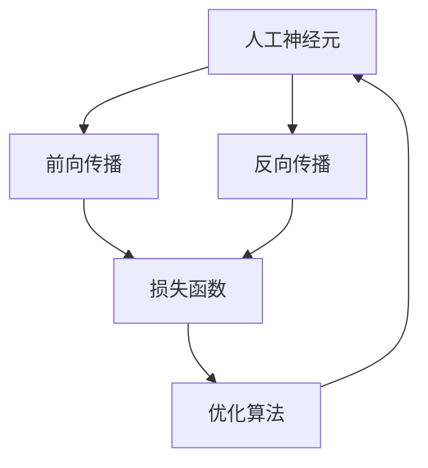

                 

# 神经网络：人类智慧的延伸

> 关键词：神经网络,深度学习,人工智能,人机协作,模式识别,自动驾驶,医疗诊断

## 1. 背景介绍

### 1.1 问题由来
深度学习（Deep Learning）已经成为推动人工智能(AI)发展的核心力量之一。其中，神经网络（Neural Networks）作为深度学习的核心组件，赋予了机器学习算法强大的表达能力和自主学习能力，成为现代人工智能发展的重要驱动力。

自上世纪50年代人工神经元的概念被提出以来，人们逐渐认识到其对解决复杂模式识别和预测问题的巨大潜力。特别是自20世纪90年代以来，随着硬件性能的提升和数据量的增加，神经网络算法快速发展，成为数据驱动学习的主要方式。近年来，基于神经网络的深度学习模型在图像识别、自然语言处理、语音识别、自动驾驶、医疗诊断等众多领域取得了令人瞩目的突破。

然而，尽管深度学习技术取得巨大成功，其背后仍有许多基础性问题尚未解决，亟需学术界和工业界的深入探索。例如，为何深度学习模型能够学习到复杂模式，其内部工作机制是什么？如何设计更高效的神经网络结构，提升模型的泛化能力？如何更合理地解释和利用深度学习模型的预测结果？

这些问题不仅是理论研究的前沿方向，也是当前产业界亟待解决的实际问题。本文将从神经网络的原理出发，探讨其背后的工作机制，并结合具体应用案例，介绍深度学习在实际场景中的广泛应用和未来发展趋势。

### 1.2 问题核心关键点
神经网络作为深度学习的基础框架，其核心关键点包括以下几个方面：

1. **神经元（Neuron）与激活函数（Activation Function）**：神经元是神经网络的基本单元，负责接收输入、计算加权和并传递输出。激活函数用于引入非线性特性，使得神经网络可以表示复杂非线性关系。
2. **前向传播（Forward Propagation）与反向传播（Backward Propagation）**：前向传播负责将输入数据通过网络各层进行处理，生成预测输出；反向传播则通过反向传播算法计算损失函数对各层参数的梯度，并更新网络参数以最小化损失。
3. **损失函数（Loss Function）与优化算法（Optimization Algorithm）**：损失函数用于衡量预测结果与真实值之间的差异，优化算法用于调整网络参数以最小化损失函数。
4. **正则化（Regularization）与模型泛化（Generalization）**：正则化技术（如L2正则、Dropout等）用于避免过拟合，模型泛化能力则决定了模型在新数据上的表现。
5. **网络结构与层（Layer）设计**：神经网络的深度、宽度、层数等结构设计对模型性能有重要影响，合理的网络结构设计可以提高模型学习效率和泛化能力。
6. **深度学习框架（Deep Learning Framework）**：诸如TensorFlow、PyTorch等深度学习框架，提供了高效的工具和算法，极大简化了神经网络模型的开发和训练过程。

这些关键点构成了神经网络的核心组成部分，通过理解其原理和设计原则，可以更深入地掌握深度学习技术的精髓。

### 1.3 问题研究意义
深度学习技术的成功，离不开对神经网络原理的深刻理解。无论是学术研究还是工程应用，掌握神经网络的工作机制，都是提升深度学习模型性能和应用效果的关键。具体来说，研究神经网络的意义包括：

1. **基础理论的深入**：神经网络作为深度学习的基础，研究其工作原理可以深化我们对深度学习的理解，并为新的算法和架构提供理论支撑。
2. **模型设计优化**：掌握神经网络的设计原则和优化策略，有助于开发更高效、更具泛化能力的深度学习模型。
3. **实际应用推广**：理解和应用神经网络的基本原理，可以更好地将深度学习技术应用于工业界，推动AI技术的产业化进程。
4. **技术创新驱动**：深入研究神经网络可以帮助发现新的研究方向和算法，为AI技术的长远发展提供动力。
5. **伦理与安全性**：理解神经网络的工作机制有助于评估和改进其预测结果的可解释性，确保深度学习应用的伦理和安全性。

本文将对神经网络的原理和应用进行全面阐述，并结合具体案例，深入探讨其在不同领域的实际应用，展望其未来的发展趋势。

## 2. 核心概念与联系

### 2.1 核心概念概述

神经网络的核心概念包括以下几个部分：

- **人工神经元（Artificial Neuron）**：神经网络的最小单位，接收输入信号，进行加权和并应用激活函数产生输出。
- **前向传播（Forward Propagation）**：将输入数据通过网络各层传递，生成最终预测输出的过程。
- **反向传播（Backward Propagation）**：通过反向传播算法计算梯度，更新网络参数以最小化损失函数。
- **损失函数（Loss Function）**：衡量模型预测输出与真实值之间的差异，用于评估模型性能。
- **激活函数（Activation Function）**：引入非线性特性，使得神经网络能够表示复杂函数关系。
- **正则化（Regularization）**：通过引入正则项（如L2正则、Dropout等）避免过拟合，提高模型泛化能力。
- **优化算法（Optimization Algorithm）**：如梯度下降法、Adam等，用于调整网络参数以最小化损失函数。
- **深度学习框架（Deep Learning Framework）**：如TensorFlow、PyTorch等，提供了高效的工具和算法，简化了神经网络模型的开发和训练过程。

这些概念构成了神经网络的基本框架，在具体应用中，通过不同组合和调整可以构建出各种各样的深度学习模型，实现复杂数据的处理和预测任务。

### 2.2 核心概念原理和架构的 Mermaid 流程图



该流程图展示了神经网络的基本工作流程，从人工神经元的前向传播、反向传播，到损失函数的计算和优化算法的调整，整个流程环环相扣，构成了深度学习模型的核心逻辑。

## 3. 核心算法原理 & 具体操作步骤
### 3.1 算法原理概述

神经网络的核心算法原理主要包括前向传播、反向传播和优化算法三个部分。以下将对这三个部分进行详细讲解。

#### 3.1.1 前向传播

前向传播是神经网络的输入到输出过程，主要分为以下几个步骤：

1. **输入层**：接收原始输入数据，将其传递给下一层。
2. **隐藏层**：通过权重矩阵和偏置向量计算加权和，并应用激活函数生成输出。
3. **输出层**：将隐藏层输出作为输入，应用权重矩阵和偏置向量计算最终预测结果。

数学公式表达如下：

$$
y = \sigma\left(W x + b\right)
$$

其中，$x$ 为输入数据，$y$ 为输出，$W$ 为权重矩阵，$b$ 为偏置向量，$\sigma$ 为激活函数（如Sigmoid、ReLU等）。

#### 3.1.2 反向传播

反向传播是神经网络训练的核心算法，用于计算损失函数对网络参数的梯度，并根据梯度更新网络参数以最小化损失。主要步骤如下：

1. **计算损失函数**：将模型预测输出与真实值进行对比，计算损失函数。
2. **反向传播梯度**：从输出层开始，计算每一层参数对损失函数的梯度，并传递回下一层。
3. **更新网络参数**：根据梯度更新权重矩阵和偏置向量，减小损失函数。

数学公式表达如下：

$$
\frac{\partial \mathcal{L}}{\partial W} = \frac{\partial \mathcal{L}}{\partial y} \frac{\partial y}{\partial x} \frac{\partial x}{\partial W}
$$

其中，$\mathcal{L}$ 为损失函数，$y$ 为输出，$x$ 为输入，$W$ 为权重矩阵，$\partial$ 表示偏导数。

#### 3.1.3 优化算法

优化算法用于更新神经网络参数，使得损失函数最小化。常用的优化算法包括梯度下降法、Adam、RMSprop等。其中，梯度下降法计算简单，但容易陷入局部最优；Adam算法则结合了动量项和自适应学习率，更适用于大规模深度学习模型。

数学公式表达如下：

$$
W_{t+1} = W_t - \eta \nabla_{W_t} \mathcal{L} \left(W_t, b_t\right)
$$

其中，$\eta$ 为学习率，$W$ 为权重矩阵，$b$ 为偏置向量，$\nabla_{W_t} \mathcal{L}$ 为损失函数对权重矩阵的梯度。

### 3.2 算法步骤详解

以下是基于神经网络的深度学习模型训练的一般步骤：

1. **数据准备**：准备训练数据集和测试数据集，划分为训练集、验证集和测试集。
2. **模型构建**：设计并构建神经网络模型，选择合适的层数、节点数和激活函数。
3. **损失函数设置**：选择适当的损失函数，如均方误差、交叉熵等，用于评估模型性能。
4. **正则化**：引入正则化技术（如L2正则、Dropout等），避免过拟合。
5. **优化器选择**：选择合适的优化器（如Adam、SGD等），设置学习率、批大小等超参数。
6. **模型训练**：通过前向传播和反向传播计算梯度，使用优化器更新参数。
7. **模型评估**：在验证集上评估模型性能，根据评估结果调整超参数。
8. **模型测试**：在测试集上测试模型性能，输出最终的预测结果。

### 3.3 算法优缺点

神经网络作为深度学习的核心算法，具有以下优点和缺点：

#### 优点

1. **高效表达能力**：神经网络能够高效表示复杂非线性关系，适用于多种数据类型和任务。
2. **自适应学习能力**：通过反向传播和优化算法，神经网络能够自动学习和调整参数，适应不同任务和数据集。
3. **广泛应用领域**：在图像识别、自然语言处理、语音识别、自动驾驶、医疗诊断等领域，神经网络已经取得了显著的成果。

#### 缺点

1. **模型复杂度**：神经网络参数量较大，计算资源需求高。
2. **过拟合风险**：神经网络容易过拟合，特别是在训练数据不足的情况下。
3. **黑盒特性**：神经网络模型复杂，难以解释其内部工作机制和决策逻辑。
4. **训练时间长**：神经网络训练过程耗时长，需要大量计算资源和迭代次数。

### 3.4 算法应用领域

神经网络在众多领域已经得到了广泛应用，以下是几个典型案例：

#### 3.4.1 计算机视觉

在计算机视觉领域，神经网络被广泛应用于图像识别、目标检测、图像分割等任务。以ImageNet数据集为例，深度卷积神经网络（CNN）在ImageNet图像识别任务上取得了最高精度。通过大规模数据集的预训练和微调，神经网络能够快速学习到图像特征，进行高效分类和识别。

#### 3.4.2 自然语言处理

在自然语言处理领域，神经网络被应用于文本分类、情感分析、机器翻译、问答系统等任务。以BERT模型为例，通过在大规模语料库上的预训练和微调，神经网络能够学习到丰富的语言表示，实现高效的语言理解和生成。

#### 3.4.3 语音识别

在语音识别领域，神经网络被应用于自动语音识别、语音合成等任务。通过深度学习框架和神经网络结构，神经网络能够有效处理音频信号，进行高精度的语音识别和合成。

#### 3.4.4 自动驾驶

在自动驾驶领域，神经网络被应用于目标检测、路径规划、交通场景理解等任务。通过神经网络的多层次特征提取和决策能力，自动驾驶系统能够高效地处理复杂的驾驶场景，实现安全可靠的自动驾驶。

## 4. 数学模型和公式 & 详细讲解  
### 4.1 数学模型构建

神经网络的核心数学模型为前向传播和反向传播公式。以下将对这两个公式进行详细推导和讲解。

#### 4.1.1 前向传播公式

前向传播公式如下：

$$
z_l = \sum_{i=1}^n W_{ij}x_i + b_j
$$

$$
a_l = g(z_l)
$$

其中，$x$ 为输入数据，$W$ 为权重矩阵，$b$ 为偏置向量，$z$ 为加权和，$a$ 为激活函数输出，$g$ 为激活函数，$n$ 为输入数据维数，$l$ 为层数。

#### 4.1.2 反向传播公式

反向传播公式如下：

$$
\frac{\partial \mathcal{L}}{\partial W} = \frac{\partial \mathcal{L}}{\partial y} \frac{\partial y}{\partial z} \frac{\partial z}{\partial W}
$$

$$
\frac{\partial \mathcal{L}}{\partial b} = \frac{\partial \mathcal{L}}{\partial y} \frac{\partial y}{\partial z}
$$

其中，$\mathcal{L}$ 为损失函数，$y$ 为输出，$z$ 为加权和，$W$ 为权重矩阵，$b$ 为偏置向量，$\partial$ 表示偏导数。

### 4.2 公式推导过程

以下是前向传播和反向传播公式的详细推导过程：

#### 前向传播公式推导

前向传播公式推导如下：

$$
z_l = \sum_{i=1}^n W_{ij}x_i + b_j
$$

$$
a_l = g(z_l)
$$

其中，$x$ 为输入数据，$W$ 为权重矩阵，$b$ 为偏置向量，$z$ 为加权和，$a$ 为激活函数输出，$g$ 为激活函数，$n$ 为输入数据维数，$l$ 为层数。

#### 反向传播公式推导

反向传播公式推导如下：

$$
\frac{\partial \mathcal{L}}{\partial W} = \frac{\partial \mathcal{L}}{\partial y} \frac{\partial y}{\partial z} \frac{\partial z}{\partial W}
$$

$$
\frac{\partial \mathcal{L}}{\partial b} = \frac{\partial \mathcal{L}}{\partial y} \frac{\partial y}{\partial z}
$$

其中，$\mathcal{L}$ 为损失函数，$y$ 为输出，$z$ 为加权和，$W$ 为权重矩阵，$b$ 为偏置向量，$\partial$ 表示偏导数。

### 4.3 案例分析与讲解

#### 4.3.1 图像识别案例

以ImageNet图像识别任务为例，使用卷积神经网络（CNN）进行模型训练。

1. **数据准备**：准备ImageNet数据集，划分为训练集、验证集和测试集。
2. **模型构建**：设计并构建卷积神经网络模型，包括卷积层、池化层、全连接层等。
3. **损失函数设置**：选择交叉熵损失函数，用于评估模型性能。
4. **正则化**：引入L2正则化，避免过拟合。
5. **优化器选择**：选择Adam优化器，设置学习率、批大小等超参数。
6. **模型训练**：通过前向传播和反向传播计算梯度，使用Adam优化器更新参数。
7. **模型评估**：在验证集上评估模型性能，根据评估结果调整超参数。
8. **模型测试**：在测试集上测试模型性能，输出最终的预测结果。

通过以上步骤，神经网络模型能够高效地学习图像特征，进行高精度的图像识别。

#### 4.3.2 自然语言处理案例

以BERT模型为例，使用自然语言处理任务进行模型训练。

1. **数据准备**：准备BERT预训练语料库，划分为训练集、验证集和测试集。
2. **模型构建**：设计并构建BERT模型，包括编码器、多头注意力机制、全连接层等。
3. **损失函数设置**：选择交叉熵损失函数，用于评估模型性能。
4. **正则化**：引入Dropout正则化，避免过拟合。
5. **优化器选择**：选择Adam优化器，设置学习率、批大小等超参数。
6. **模型训练**：通过前向传播和反向传播计算梯度，使用Adam优化器更新参数。
7. **模型评估**：在验证集上评估模型性能，根据评估结果调整超参数。
8. **模型测试**：在测试集上测试模型性能，输出最终的预测结果。

通过以上步骤，神经网络模型能够高效地学习语言表示，实现高精度的自然语言处理任务。

## 5. 项目实践：代码实例和详细解释说明
### 5.1 开发环境搭建

在进行神经网络模型训练时，需要准备相应的开发环境。以下是使用PyTorch进行神经网络开发的详细配置流程：

1. 安装Anaconda：从官网下载并安装Anaconda，用于创建独立的Python环境。

2. 创建并激活虚拟环境：
```bash
conda create -n pytorch-env python=3.8 
conda activate pytorch-env
```

3. 安装PyTorch：根据CUDA版本，从官网获取对应的安装命令。例如：
```bash
conda install pytorch torchvision torchaudio cudatoolkit=11.1 -c pytorch -c conda-forge
```

4. 安装各类工具包：
```bash
pip install numpy pandas scikit-learn matplotlib tqdm jupyter notebook ipython
```

完成上述步骤后，即可在`pytorch-env`环境中开始神经网络模型的训练和测试。

### 5.2 源代码详细实现

以下是使用PyTorch构建卷积神经网络（CNN）模型进行图像识别的代码实现：

```python
import torch
import torch.nn as nn
import torchvision.transforms as transforms
import torchvision.datasets as datasets

# 定义CNN模型
class CNN(nn.Module):
    def __init__(self):
        super(CNN, self).__init__()
        self.conv1 = nn.Conv2d(3, 32, 3, padding=1)
        self.pool = nn.MaxPool2d(2, 2)
        self.conv2 = nn.Conv2d(32, 64, 3, padding=1)
        self.fc1 = nn.Linear(64 * 16 * 16, 1000)
        
    def forward(self, x):
        x = nn.functional.relu(self.conv1(x))
        x = self.pool(x)
        x = nn.functional.relu(self.conv2(x))
        x = self.pool(x)
        x = x.view(-1, 64 * 16 * 16)
        x = nn.functional.relu(self.fc1(x))
        return x

# 定义损失函数和优化器
model = CNN()
criterion = nn.CrossEntropyLoss()
optimizer = torch.optim.Adam(model.parameters(), lr=0.001)

# 加载数据集
train_dataset = datasets.CIFAR10(root='./data', train=True, download=True, transform=transforms.ToTensor())
train_loader = torch.utils.data.DataLoader(train_dataset, batch_size=64, shuffle=True)

# 模型训练
for epoch in range(10):
    for i, (images, labels) in enumerate(train_loader):
        images = images.to(device)
        labels = labels.to(device)
        
        # 前向传播
        outputs = model(images)
        loss = criterion(outputs, labels)
        
        # 反向传播和优化
        optimizer.zero_grad()
        loss.backward()
        optimizer.step()
        
        if i % 100 == 0:
            print(f'Epoch [{epoch+1}/{10}], Step [{i+1}/{len(train_loader)}], Loss: {loss.item():.4f}')
```

以上代码实现了卷积神经网络模型在CIFAR10数据集上的训练。可以看到，神经网络模型的构建和训练过程非常简单，利用PyTorch提供的高级API，可以快速搭建并训练神经网络模型。

### 5.3 代码解读与分析

让我们再详细解读一下关键代码的实现细节：

**CNN类**：
- `__init__`方法：初始化卷积层、池化层和全连接层。
- `forward`方法：定义前向传播过程，将输入数据通过各层进行处理，生成输出。

**损失函数和优化器**：
- `criterion`为交叉熵损失函数，用于评估模型性能。
- `optimizer`为Adam优化器，用于更新网络参数。

**数据加载**：
- `train_dataset`为CIFAR10数据集，通过`transforms.ToTensor()`进行预处理。
- `train_loader`为数据加载器，将数据集划分为64个batch，按顺序传递给模型。

**模型训练**：
- 循环迭代10个epoch，对每个batch进行前向传播、反向传播和优化。
- 每100个batch输出一次损失值，用于监测训练进度。

可以看到，PyTorch提供了丰富的API和工具，使得神经网络模型的开发和训练过程变得简单高效。开发者只需关注模型的设计和优化策略，其他细节如数据加载、模型保存等均由框架自动处理。

## 6. 实际应用场景
### 6.1 智能医疗诊断

神经网络在智能医疗诊断领域具有广泛的应用前景。传统医疗诊断依赖医生人工判读影像数据，耗时长、成本高、容易出错。通过神经网络对医学影像进行自动化分析，可以大幅提升诊断效率和准确性。

例如，使用卷积神经网络对X光、CT等医学影像进行分类，可以自动识别肺部结节、乳腺癌等常见病变。通过多层次特征提取，神经网络能够高效地学习医学影像特征，进行高精度的病变检测和分类。

### 6.2 自动驾驶系统

在自动驾驶领域，神经网络被应用于目标检测、路径规划、交通场景理解等任务。例如，使用卷积神经网络对交通摄像头拍摄的图像进行目标检测，可以实时识别车辆、行人、交通信号等重要元素，辅助自动驾驶系统进行决策和避障。

通过多层次特征提取和决策能力，自动驾驶系统能够高效地处理复杂的驾驶场景，实现安全可靠的自动驾驶。

### 6.3 金融风险管理

在金融领域，神经网络被应用于风险评估、信用评分、交易预测等任务。例如，使用神经网络对历史交易数据进行建模，可以预测股票价格走势和市场风险，为投资者提供决策支持。

通过复杂的非线性关系建模，神经网络能够处理复杂的金融数据，进行高精度的市场预测和风险评估。

### 6.4 未来应用展望

随着神经网络技术的不断发展，其在各个领域的实际应用将越来越广泛。未来，神经网络有望在更多领域展现出其强大的应用潜力，以下是几个方向：

#### 6.4.1 医疗影像诊断

神经网络在医疗影像诊断领域的自动化程度将进一步提高。通过更高级的特征提取和图像处理技术，神经网络能够更准确地识别和分类医学影像，辅助医生进行诊断和治疗。

#### 6.4.2 智能制造

在智能制造领域，神经网络被应用于生产流程优化、设备预测性维护、质量控制等任务。通过数据驱动的智能决策，神经网络能够优化生产流程，提高生产效率和产品质量。

#### 6.4.3 智慧城市

在智慧城市治理中，神经网络被应用于城市事件监测、舆情分析、应急指挥等环节。通过实时分析城市数据，神经网络能够帮助政府进行精准治理，提升城市管理和居民生活质量。

#### 6.4.4 金融风控

在金融风险管理领域，神经网络将应用于信用评分、市场预测、风险控制等任务。通过多层次的特征提取和复杂关系建模，神经网络能够更准确地评估金融风险，保护投资者和金融机构的利益。

## 7. 工具和资源推荐
### 7.1 学习资源推荐

为了帮助开发者系统掌握神经网络技术的理论基础和实践技巧，这里推荐一些优质的学习资源：

1. **《深度学习》书籍**：Ian Goodfellow等著，详细介绍了深度学习的理论基础和算法原理，是深度学习领域的经典教材。
2. **《Python深度学习》书籍**：Francois Chollet著，深入浅出地介绍了深度学习框架PyTorch的开发实践，适合初学者入门。
3. **CS231n《卷积神经网络》课程**：斯坦福大学开设的深度学习课程，涵盖卷积神经网络的基本概念和实践方法，是计算机视觉领域的重要学习资源。
4. **Kaggle竞赛平台**：通过参与Kaggle数据科学竞赛，可以积累实践经验，掌握神经网络的实际应用技巧。
5. **Deep Learning Specialization课程**：由Andrew Ng教授主讲的深度学习课程，涵盖深度学习的各个方面，适合系统学习深度学习技术。

通过这些学习资源，相信你一定能够快速掌握神经网络技术的精髓，并用于解决实际的深度学习问题。

### 7.2 开发工具推荐

高效的开发离不开优秀的工具支持。以下是几款用于神经网络开发的常用工具：

1. **PyTorch**：基于Python的开源深度学习框架，灵活动态的计算图，适合快速迭代研究。大部分神经网络模型都有PyTorch版本的实现。
2. **TensorFlow**：由Google主导开发的开源深度学习框架，生产部署方便，适合大规模工程应用。同样有丰富的神经网络资源。
3. **Keras**：高层次的神经网络API，封装了TensorFlow、Theano等底层框架，使得神经网络开发更加简单快捷。
4. **MXNet**：由Apache基金会开发的深度学习框架，支持多种语言和多种硬件平台，具有高效易用的特点。
5. **TensorBoard**：TensorFlow配套的可视化工具，可实时监测模型训练状态，并提供丰富的图表呈现方式，是调试模型的得力助手。

合理利用这些工具，可以显著提升神经网络模型的开发效率，加快创新迭代的步伐。

### 7.3 相关论文推荐

神经网络技术的发展源于学界的持续研究。以下是几篇奠基性的相关论文，推荐阅读：

1. **《深度学习》书籍**：Ian Goodfellow等著，详细介绍了深度学习的理论基础和算法原理，是深度学习领域的经典教材。
2. **《卷积神经网络》书籍**：Francois Chollet著，深入浅出地介绍了卷积神经网络的基本概念和实践方法，是计算机视觉领域的重要学习资源。
3. **《残差网络》论文**：He等著，提出了残差网络（ResNet）架构，解决了深度网络训练中的梯度消失问题，开启了深度神经网络的新纪元。
4. **《注意力机制》论文**：Bahdanau等著，提出了注意力机制（Attention），使得神经网络能够高效地处理长序列数据，提高了序列建模的精度。
5. **《BERT》论文**：Devlin等著，提出了BERT模型，通过预训练和微调，在自然语言处理任务上取得了新的SOTA。

这些论文代表了大神经网络的发展脉络。通过学习这些前沿成果，可以帮助研究者把握学科前进方向，激发更多的创新灵感。

## 8. 总结：未来发展趋势与挑战
### 8.1 总结

本文对神经网络的原理和应用进行了全面阐述。首先介绍了神经网络的基本概念和工作机制，通过前向传播、反向传播和优化算法三个部分，深入讲解了神经网络的训练过程。其次，结合具体应用案例，介绍了神经网络在图像识别、自然语言处理、自动驾驶、智能医疗等多个领域的广泛应用。最后，展望了神经网络的未来发展趋势，讨论了其面临的挑战和未来突破方向。

通过本文的系统梳理，可以看到，神经网络作为深度学习的基础，在实际应用中展现了强大的学习能力和表达能力。未来，随着算力提升和数据丰富，神经网络将进一步拓展其应用边界，推动人工智能技术的发展和产业化进程。

### 8.2 未来发展趋势

展望未来，神经网络技术的发展将呈现以下几个趋势：

#### 8.2.1 模型规模不断增大

随着硬件性能的提升和数据量的增加，神经网络模型的规模将进一步增大。超大规模的神经网络可以处理更加复杂的数据，提升模型的表达能力和泛化能力。

#### 8.2.2 自监督学习技术发展

自监督学习技术将在大规模数据集上获得更多应用。无需大量标注数据，通过数据自身特性进行预训练，可以显著降低标注成本，提升模型的泛化能力。

#### 8.2.3 多模态学习成为新方向

多模态学习技术将使得神经网络能够处理和融合不同类型的数据，提升其对现实世界的理解和建模能力。视觉、语音、文本等多模态数据的融合，将带来新的突破。

#### 8.2.4 模型可解释性增强

神经网络的可解释性问题一直是研究热点。未来，通过引入因果推断、博弈论等工具，神经网络将能够更清晰地解释其内部决策过程，提升模型的可信度和可解释性。

#### 8.2.5 模型公平性保障

神经网络的公平性问题是当前研究的热点。未来，通过引入公平性约束，神经网络将能够更好地避免偏见和歧视，提升模型的公正性和安全性。

#### 8.2.6 模型融合与集成

不同模型之间的融合与集成将带来新的突破。例如，通过迁移学习、多任务学习等技术，神经网络能够更好地利用不同模型的优点，提升整体性能。

### 8.3 面临的挑战

尽管神经网络技术已经取得了显著成果，但在迈向更加智能化、普适化应用的过程中，仍面临诸多挑战：

#### 8.3.1 模型过拟合风险

神经网络容易过拟合，特别是在训练数据不足的情况下。如何在不增加模型复杂度的同时，提升模型的泛化能力，是未来的重要研究方向。

#### 8.3.2 训练资源瓶颈

神经网络模型的训练过程需要大量的计算资源和数据存储，随着模型规模的增大，训练资源的需求也随之增加。如何在有限资源下进行高效的模型训练，是未来的重要问题。

#### 8.3.3 数据隐私与安全

神经网络模型的训练和使用过程中，数据隐私和安全问题尤为突出。如何在保护数据隐私的前提下，进行高效的模型训练和应用，是未来的重要课题。

#### 8.3.4 模型可解释性不足

神经网络模型的决策过程缺乏可解释性，难以理解其内部工作机制和决策逻辑。如何在提升模型性能的同时，增强其可解释性，是未来的重要研究方向。

#### 8.3.5 模型鲁棒性不足

神经网络模型在面对新数据或扰动时，鲁棒性不足，容易产生不稳定预测。如何在提升模型性能的同时，增强其鲁棒性，是未来的重要问题。

### 8.4 研究展望

面对神经网络技术所面临的挑战，未来的研究需要在以下几个方面寻求新的突破：

#### 8.4.1 自监督学习与弱监督学习

自监督学习和弱监督学习技术将带来新的突破。通过更少的数据和更多的自然信号，可以显著降低标注成本，提升模型的泛化能力。

#### 8.4.2 模型融合与集成

不同模型之间的融合与集成将带来新的突破。通过迁移学习、多任务学习等技术，神经网络能够更好地利用不同模型的优点，提升整体性能。

#### 8.4.3 模型可解释性增强

通过引入因果推断、博弈论等工具，神经网络将能够更清晰地解释其内部决策过程，提升模型的可信度和可解释性。

#### 8.4.4 模型公平性保障

通过引入公平性约束，神经网络将能够更好地避免偏见和歧视，提升模型的公正性和安全性。

#### 8.4.5 多模态学习技术

多模态学习技术将使得神经网络能够处理和融合不同类型的数据，提升其对现实世界的理解和建模能力。视觉、语音、文本等多模态数据的融合，将带来新的突破。

#### 8.4.6 自适应学习与在线学习

自适应学习与在线学习技术将使得神经网络能够更高效地进行模型训练和更新，提升模型的实时性和可适应性。

## 9. 附录：常见问题与解答
### Q1：神经网络的基本结构是怎样的？

A：神经网络的基本结构包括输入层、隐藏层和输出层。输入层接收原始数据，隐藏层进行特征提取和信息处理，输出层生成最终预测结果。

### Q2：神经网络如何进行反向传播？

A：反向传播通过计算损失函数对每个神经元的梯度，并利用链式法则逐层反向计算，最终更新权重和偏置。

### Q3：神经网络的损失函数包括哪些？

A：神经网络的损失函数包括均方误差、交叉熵、对数损失等，用于衡量预测结果与真实值之间的差异。

### Q4：神经网络在图像识别任务中常用的激活函数有哪些？

A：神经网络在图像识别任务中常用的激活函数包括ReLU、Sigmoid、Tanh等，用于引入非线性特性。

### Q5：神经网络在训练过程中如何进行正则化？

A：神经网络在训练过程中可以使用L2正则、Dropout、Early Stopping等正则化技术，避免过拟合。

总之，神经网络作为深度学习的基础框架，其核心原理和应用场景已得到了广泛研究和实际应用。未来，随着技术的发展和数据的丰富，神经网络将进一步拓展其应用边界，推动人工智能技术的不断进步。

---

作者：禅与计算机程序设计艺术 / Zen and the Art of Computer Programming

