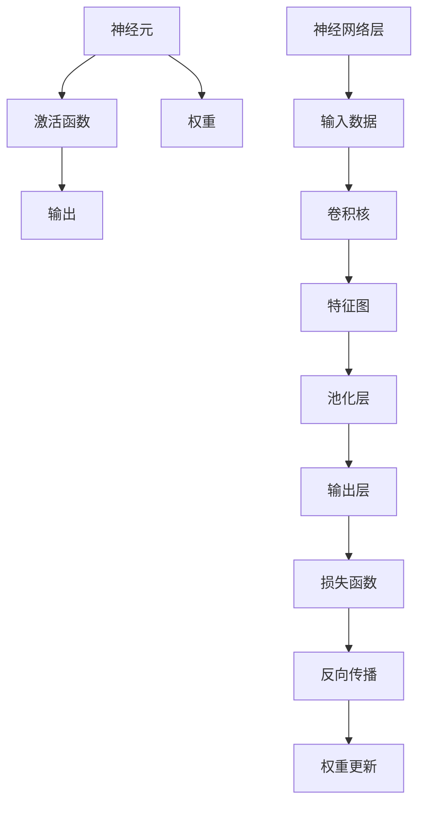

                 

# 神经网络：人类智慧的延伸

## 1. 背景介绍

神经网络，作为计算机科学和人工智能领域的核心技术之一，正逐渐成为驱动人类社会进步的重要工具。自从1947年第一台神经元被成功模拟以来，神经网络经过几十年的不断发展和创新，已经从简单的感知器模型发展成为复杂的深度学习框架。在这篇文章中，我们将探讨神经网络的概念、原理及其实际应用，并尝试解读其对人类智慧的延伸。

### 1.1 问题由来

在信息爆炸的时代，人类面临海量数据的处理问题。传统的算法在处理复杂、非线性问题时显得力不从心。神经网络作为模拟人脑结构和功能的计算模型，能够通过反向传播算法学习数据的特征和规律，从而在图像识别、语音识别、自然语言处理等诸多领域展示了卓越的性能。特别是在深度学习（Deep Learning）的加持下，神经网络已经在多个高难度任务上取得了超越人类的成绩。

## 2. 核心概念与联系

### 2.1 核心概念概述

为了更好地理解神经网络的工作原理，我们将介绍一些核心概念：

- **神经网络（Neural Network）**：由多个节点（神经元）连接而成的计算模型，通过学习数据的特征和规律，实现模式识别、图像处理、语音识别、自然语言处理等多种任务。
- **深度学习（Deep Learning）**：一种基于多层神经网络的学习方法，通过多层非线性映射实现复杂的特征提取和分类。
- **反向传播（Backpropagation）**：深度学习中用于优化神经网络权重的一种算法，通过计算梯度反向传播误差信号，实现参数的优化。
- **卷积神经网络（Convolutional Neural Network, CNN）**：一种专门用于处理具有网格结构的数据（如图像）的神经网络，通过卷积层、池化层等特殊层设计，实现图像的特征提取和分类。
- **循环神经网络（Recurrent Neural Network, RNN）**：一种能够处理序列数据的神经网络，通过记忆单元（如LSTM、GRU）保持数据序列的信息。

这些概念共同构成了神经网络的基本框架，下面我们将从原理上展开详细探讨。

### 2.2 核心概念原理和架构的 Mermaid 流程图



### 2.3 核心概念联系

神经网络中的每个神经元接收输入数据，通过激活函数计算输出。这一过程类似于人脑的神经元响应。神经网络中的权重和激活函数设计，模拟了大脑中的突触和神经递质。反向传播算法通过误差反向传播机制，不断调整权重，优化神经网络的性能。卷积神经网络和循环神经网络则分别模拟了视觉和听觉等复杂感知过程，极大地提高了神经网络的泛化能力。

## 3. 核心算法原理 & 具体操作步骤

### 3.1 算法原理概述

神经网络的训练过程主要分为前向传播和反向传播两个步骤：

1. **前向传播（Forward Propagation）**：输入数据通过网络逐层处理，最终输出预测结果。
2. **反向传播（Backpropagation）**：计算预测结果与真实标签的误差，通过链式法则计算误差对每个参数的梯度，反向更新参数以最小化误差。

深度学习中的优化算法（如随机梯度下降、Adam、Adagrad等）负责控制学习率和更新参数。通过不断迭代前向传播和反向传播，神经网络逐渐学习数据的特征和规律，实现高效的模式识别和分类。

### 3.2 算法步骤详解

以下是对神经网络训练的详细操作步骤：

**Step 1: 数据预处理**

1. **数据清洗**：去除异常值、填补缺失值等，保证数据的完整性和准确性。
2. **数据标准化**：将数据按比例缩放到统一范围内，防止梯度爆炸或消失。
3. **数据划分**：将数据集划分为训练集、验证集和测试集，用于模型训练、调参和性能评估。

**Step 2: 模型选择和设计**

1. **选择网络结构**：根据任务特点选择合适的网络结构，如卷积神经网络、循环神经网络等。
2. **设计损失函数**：选择适合任务的损失函数，如均方误差、交叉熵等。
3. **设置超参数**：如学习率、批大小、迭代次数等，初始化模型参数。

**Step 3: 模型训练**

1. **前向传播**：输入训练数据，通过网络逐层计算输出。
2. **计算损失**：将输出与真实标签计算误差。
3. **反向传播**：根据误差反向传播梯度，更新网络参数。
4. **参数更新**：使用优化算法更新参数，不断迭代训练过程。

**Step 4: 模型评估**

1. **验证集评估**：在验证集上评估模型性能，防止过拟合。
2. **调整超参数**：根据验证集表现调整超参数，如学习率、批次大小等。
3. **测试集评估**：在测试集上最终评估模型性能，选择最优模型进行预测。

### 3.3 算法优缺点

神经网络的优点包括：

- **强大表达能力**：能够处理复杂、非线性的数据，实现高维特征提取。
- **鲁棒性强**：经过大量训练数据的学习，神经网络在面对新数据时表现稳定。
- **广泛适用**：在图像识别、语音识别、自然语言处理等多个领域均有应用。

然而，神经网络也存在一些缺点：

- **计算资源消耗大**：需要大量计算资源和存储空间，训练过程耗时较长。
- **黑盒特性**：神经网络的学习过程难以解释，模型决策不透明。
- **数据依赖性高**：需要大量标注数据，训练过程容易过拟合。

尽管存在这些局限，神经网络在处理复杂数据和模式识别方面展示了无与伦比的优越性，其在众多领域的成功应用，充分证明了其作为人类智慧延伸的重要地位。

### 3.4 算法应用领域

神经网络在多个领域展示了强大的应用潜力：

- **计算机视觉**：如图像分类、目标检测、人脸识别等。
- **自然语言处理**：如机器翻译、文本分类、情感分析等。
- **语音识别**：如语音合成、语音识别、语音情感识别等。
- **机器人控制**：如机器人路径规划、动作控制等。
- **推荐系统**：如电商推荐、内容推荐等。

## 4. 数学模型和公式 & 详细讲解 & 举例说明

### 4.1 数学模型构建

神经网络可以表示为一系列数学模型的组合，通过输入数据 $x$，经由多个线性变换和激活函数，最终输出预测结果 $y$。具体来说，神经网络可以表示为：

$$y=f_{\theta}(x)=\sigma(Wx+b)$$

其中，$\sigma$ 为激活函数，$W$ 和 $b$ 为权重和偏置，$\theta$ 为模型参数。

### 4.2 公式推导过程

以最简单的单层神经网络为例，其前向传播过程可表示为：

$$y_1=\sigma(z_1)=\sigma(W_1x+b_1)$$
$$y_2=\sigma(z_2)=\sigma(W_2y_1+b_2)$$
$$\cdots$$
$$y_n=\sigma(z_n)=\sigma(W_ny_{n-1}+b_n)$$

其中，$z_i$ 为第 $i$ 层的输入，$y_i$ 为第 $i$ 层的输出。

神经网络的反向传播算法通过计算误差对每个参数的梯度，更新权重和偏置：

$$\frac{\partial L}{\partial \theta}=\sum_{i=1}^n\frac{\partial L}{\partial z_i}\frac{\partial z_i}{\partial \theta}$$

其中，$L$ 为损失函数，$\frac{\partial L}{\partial z_i}$ 为误差的传播过程，$\frac{\partial z_i}{\partial \theta}$ 为各层参数的梯度。

### 4.3 案例分析与讲解

以图像分类任务为例，卷积神经网络（CNN）通过卷积层、池化层、全连接层等特殊设计，实现图像特征的提取和分类。

- **卷积层**：通过卷积核在图像上滑动，提取局部特征。
- **池化层**：通过池化操作减少特征图尺寸，降低计算复杂度。
- **全连接层**：将池化后的特征映射转换为分类结果。

## 5. 项目实践：代码实例和详细解释说明

### 5.1 开发环境搭建

在神经网络项目开发中，通常使用Python和深度学习框架（如TensorFlow、PyTorch等）进行实现。以下是Python环境配置和开发工具的推荐：

1. **安装Python**：
```bash
sudo apt-get update
sudo apt-get install python3
```

2. **安装TensorFlow**：
```bash
pip install tensorflow
```

3. **安装PyTorch**：
```bash
pip install torch torchvision torchaudio
```

4. **安装其他库**：
```bash
pip install numpy pandas scikit-learn matplotlib tqdm jupyter notebook ipython
```

### 5.2 源代码详细实现

以下是一个简单的卷积神经网络模型实现，用于图像分类任务：

```python
import tensorflow as tf
from tensorflow.keras import layers

# 定义模型
model = tf.keras.Sequential([
    layers.Conv2D(32, (3,3), activation='relu', input_shape=(28,28,1)),
    layers.MaxPooling2D((2,2)),
    layers.Conv2D(64, (3,3), activation='relu'),
    layers.MaxPooling2D((2,2)),
    layers.Flatten(),
    layers.Dense(64, activation='relu'),
    layers.Dense(10, activation='softmax')
])

# 编译模型
model.compile(optimizer='adam',
              loss=tf.keras.losses.SparseCategoricalCrossentropy(from_logits=True),
              metrics=['accuracy'])

# 训练模型
model.fit(x_train, y_train, epochs=10, validation_data=(x_test, y_test))
```

### 5.3 代码解读与分析

**模型结构定义**：
- `layers.Conv2D`：定义卷积层，参数为卷积核大小和数量。
- `layers.MaxPooling2D`：定义池化层，参数为池化窗口大小。
- `layers.Flatten`：将特征图展开为一维向量。
- `layers.Dense`：定义全连接层，参数为神经元数量和激活函数。

**模型编译**：
- `optimizer`：定义优化器，如Adam。
- `loss`：定义损失函数，如交叉熵。
- `metrics`：定义评估指标，如准确率。

**模型训练**：
- `fit`：使用训练数据和验证数据训练模型，设置训练轮数。

### 5.4 运行结果展示

训练过程中，每轮迭代都会输出损失值和准确率，验证集上的损失值和准确率也会相应调整，最终模型在测试集上的性能将作为最终的评估指标。

## 6. 实际应用场景

### 6.1 计算机视觉

在计算机视觉领域，神经网络广泛应用于图像分类、目标检测、人脸识别等任务。例如，在图像分类任务中，神经网络可以通过卷积和池化操作，提取图像的局部特征和全局特征，实现对不同类别的识别。

### 6.2 自然语言处理

自然语言处理领域中，神经网络通过循环神经网络（RNN）和长短期记忆网络（LSTM），实现对文本的序列建模和情感分析。例如，在情感分析任务中，神经网络可以处理文本的词向量表示，并对其进行分类。

### 6.3 机器人控制

在机器人控制领域，神经网络用于路径规划和动作控制。例如，通过深度强化学习（Deep Reinforcement Learning），神经网络可以学习最优的策略，使机器人完成复杂的动作序列。

## 7. 工具和资源推荐

### 7.1 学习资源推荐

为了深入了解神经网络，以下是一些推荐的资源：

1. **《深度学习》（Deep Learning）**：Ian Goodfellow、Yoshua Bengio、Aaron Courville著，系统介绍了深度学习的基本概念和算法。
2. **《神经网络与深度学习》（Neural Networks and Deep Learning）**：Michael Nielsen著，深入浅出地讲解了神经网络的工作原理。
3. **《动手学深度学习》（Dive into Deep Learning）**：李沐等著，结合代码实现，讲解了深度学习的原理和应用。
4. **CS231n：卷积神经网络**：斯坦福大学计算机视觉课程，详细讲解了卷积神经网络的设计和应用。
5. **Coursera深度学习课程**：由Andrew Ng主讲，提供了系统化的深度学习学习路径。

### 7.2 开发工具推荐

以下是一些常用的深度学习开发工具：

1. **TensorFlow**：由Google开发的深度学习框架，支持GPU计算，易于部署。
2. **PyTorch**：Facebook开发的深度学习框架，支持动态计算图，易于研究和实验。
3. **Keras**：基于TensorFlow和Theano等后端的高级深度学习框架，易于上手。
4. **JAX**：由Google开发的可扩展的NumPy实现，支持自动微分和优化。
5. **MXNet**：由Apache开发的深度学习框架，支持多种硬件平台。

### 7.3 相关论文推荐

以下是几篇具有代表性的神经网络论文：

1. **ImageNet大规模视觉识别挑战赛**：Alex Krizhevsky、Ilya Sutskever、Geoffrey Hinton等著，提出了卷积神经网络在图像识别中的应用。
2. **深度学习中的LSTM网络**：Hochreiter、Schmidhuber著，介绍了长短期记忆网络在自然语言处理中的应用。
3. **Attention is All You Need**：Vaswani等著，提出了Transformer结构，在自然语言处理中取得了突破性进展。
4. **ImageNet大规模视觉识别挑战赛**：Alex Krizhevsky、Ilya Sutskever、Geoffrey Hinton等著，提出了卷积神经网络在图像识别中的应用。
5. **NIPS 2014 Best Paper Award**：Goodfellow等著，介绍了生成对抗网络（GAN）的基本概念和算法。

## 8. 总结：未来发展趋势与挑战

### 8.1 总结

神经网络作为人工智能的核心技术之一，正在深刻改变着社会的方方面面。通过不断优化算法和改进模型，神经网络在图像识别、语音识别、自然语言处理等领域取得了令人瞩目的成就。本文从神经网络的原理和实践出发，探讨了其作为人类智慧延伸的重要意义。

### 8.2 未来发展趋势

未来的神经网络研究将朝着以下几个方向发展：

1. **深度学习框架的进一步优化**：深度学习框架如TensorFlow、PyTorch等将不断优化，提升模型训练和推理的效率。
2. **模型的可解释性增强**：神经网络将更加注重模型的可解释性，提高算法的透明性和可理解性。
3. **迁移学习的广泛应用**：迁移学习将成为神经网络的重要应用方向，利用已有知识加速新任务的模型训练。
4. **多模态学习的突破**：将视觉、语音、文本等多模态数据融合，提升模型的综合能力。
5. **联邦学习的应用**：通过分布式协同训练，保护数据隐私的同时提升模型的泛化能力。

### 8.3 面临的挑战

尽管神经网络取得了诸多成功，但仍然面临诸多挑战：

1. **计算资源消耗大**：神经网络的训练和推理需要大量计算资源，难以满足大规模应用的需求。
2. **模型可解释性不足**：神经网络的决策过程难以解释，难以满足高风险应用的需求。
3. **数据依赖性高**：神经网络需要大量标注数据，训练过程容易过拟合。
4. **对抗攻击问题**：神经网络容易受到对抗样本的攻击，需要加强模型的鲁棒性。

### 8.4 研究展望

未来的神经网络研究将在以下几个方面寻求突破：

1. **优化算法的改进**：优化算法如Adam、Adagrad等将继续改进，提升模型训练的效率。
2. **新模型的探索**：探索新型神经网络结构，如Graph Neural Network、Neural Architecture Search等，提升模型的表达能力。
3. **数据生成技术的提升**：利用生成对抗网络（GAN）、变分自编码器（VAE）等技术，生成更多高质量数据，缓解数据依赖问题。
4. **对抗攻击防御**：研究更加鲁棒的神经网络结构，提升模型的抗干扰能力。
5. **跨领域融合**：将神经网络与自然语言处理、计算机视觉等领域的知识进行融合，提升模型的综合能力。

神经网络作为人类智慧的延伸，将继续推动人工智能技术的进步，为各行各业带来更高效、更智能的解决方案。未来的研究需要在理论和实践上不断突破，才能更好地发挥神经网络的潜力。

## 9. 附录：常见问题与解答

**Q1: 什么是神经网络？**

A: 神经网络是一种计算模型，通过学习数据特征和规律，实现复杂的模式识别和分类任务。其核心结构由多个神经元连接而成，每个神经元接收输入数据，通过激活函数计算输出。

**Q2: 神经网络的优势和局限性是什么？**

A: 神经网络的优势包括强大的表达能力、鲁棒性强、广泛适用。局限性包括计算资源消耗大、黑盒特性、数据依赖性高。

**Q3: 深度学习与传统机器学习有什么区别？**

A: 深度学习通过多层非线性映射实现复杂特征提取，而传统机器学习依赖手工设计特征。深度学习能够处理复杂、非线性数据，但需要大量标注数据和计算资源。

**Q4: 神经网络的训练过程包括哪些步骤？**

A: 神经网络的训练过程包括前向传播、计算损失、反向传播和参数更新。前向传播通过网络逐层计算输出，反向传播通过误差反向传播梯度，更新网络参数。

**Q5: 神经网络在实际应用中需要注意哪些问题？**

A: 神经网络在实际应用中需要注意计算资源消耗、模型可解释性、数据依赖性、对抗攻击问题等。

通过本文的系统梳理，我们可以看到神经网络作为人类智慧的延伸，在多个领域展示了强大的应用潜力。未来，神经网络将继续深化与人工智能技术的融合，推动各行各业的智能化进程。

