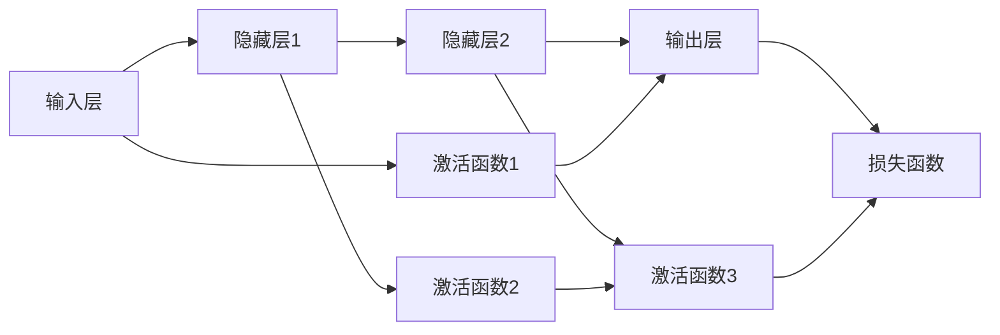

                 

# 神经网络：人类智慧的解放

## 1. 背景介绍

### 1.1 问题由来

神经网络（Neural Networks, NNs）作为人工智能的核心技术之一，已经发展了数十年，并在诸多领域取得了显著的成果。从最初的感知器模型到现今的深度学习，神经网络不断进化，逐渐成为人工智能革命的重要驱动力。然而，神经网络的背后蕴藏着哪些深刻的原理和机制，使其能够解放人类的智慧？本文将深入探讨神经网络的核心概念和关键技术，并结合实际应用，展现神经网络在多个领域的强大潜力。

### 1.2 问题核心关键点

神经网络的核心在于其强大的自适应学习能力。通过学习大量的数据，神经网络可以发现数据之间的内在关系和规律，并据此进行预测和决策。这种能力来源于其独特的架构和训练算法，使得神经网络能够处理非线性、高维、复杂的任务，并且在实际应用中取得了诸多成功案例。

具体而言，神经网络的核心关键点包括：
- 强大的自适应学习能力。
- 非线性处理能力。
- 分布式并行计算结构。
- 梯度下降优化算法。

本文将围绕这些关键点，深入讲解神经网络的基本原理和实际应用。

## 2. 核心概念与联系

### 2.1 核心概念概述

为更好地理解神经网络，我们首先需要介绍几个核心概念：

- 神经元（Neuron）：神经网络的基本处理单元，类似于大脑中的神经元，通过加权和激活函数进行计算。
- 权重（Weight）：神经元之间的连接权重，决定了信号的传递强度。
- 激活函数（Activation Function）：对神经元的输出进行非线性变换，增加网络表达能力。
- 前向传播（Forward Propagation）：从输入到输出的计算过程，通过多个神经元层级处理输入数据。
- 反向传播（Backward Propagation）：通过误差反向传播更新权重，进行参数优化。
- 损失函数（Loss Function）：评估模型预测与真实标签之间差异的函数，指导模型优化。

这些概念共同构成了神经网络的核心架构和工作机制。接下来，我们将通过Mermaid流程图展示神经网络的计算过程：



### 2.2 核心概念原理和架构的 Mermaid 流程图

通过上述流程图，我们可以看到神经网络的计算过程：
1. 输入数据首先经过输入层，并进行激活函数处理。
2. 数据经过多个隐藏层，每一层均通过激活函数进行非线性变换。
3. 最终输出层计算得到预测结果，并经过损失函数评估误差。
4. 反向传播算法根据误差反传更新各层权重，逐步优化模型性能。

这一流程展示了神经网络的基本计算架构和工作原理，接下来我们将详细讲解这些关键算法的实现细节。

## 3. 核心算法原理 & 具体操作步骤

### 3.1 算法原理概述

神经网络的训练过程主要通过反向传播算法实现，该算法通过误差反向传播更新网络权重，最小化损失函数。其基本流程如下：

1. 前向传播：将输入数据通过神经网络，得到预测输出。
2. 计算损失：通过损失函数计算预测输出与真实标签之间的差异。
3. 反向传播：根据误差反向传播，计算每个神经元的梯度。
4. 参数更新：使用梯度下降算法，更新网络权重。

神经网络的核心在于其非线性处理能力和强大的表达能力。通过多层非线性变换，神经网络能够处理复杂的非线性关系，并在诸多领域取得显著的成果。

### 3.2 算法步骤详解

以下我们将详细介绍神经网络的训练过程，以一个简单的三层神经网络为例，讲解每一步的具体实现。

#### 输入层

首先，定义输入层的数据和权重：

$$
x_1 = \begin{bmatrix}
1 & 2 & 3
\end{bmatrix}, w_1 = \begin{bmatrix}
0.1 & 0.2 & 0.3
\end{bmatrix}
$$

其中，$x_1$ 是输入向量，$w_1$ 是连接权重矩阵。计算加权和：

$$
z_1 = x_1 \cdot w_1 = \begin{bmatrix}
1 & 2 & 3
\end{bmatrix} \begin{bmatrix}
0.1 & 0.2 & 0.3
\end{bmatrix} = \begin{bmatrix}
0.1 + 0.4 + 0.9
\end{bmatrix} = 1.4
$$

经过激活函数（如Sigmoid）处理：

$$
a_1 = \sigma(z_1) = \frac{1}{1 + e^{-1.4}} = 0.88
$$

最终，输入层的输出为 $a_1 = 0.88$。

#### 隐藏层

定义隐藏层的数据和权重：

$$
x_2 = \begin{bmatrix}
0.5 & 0.6
\end{bmatrix}, w_2 = \begin{bmatrix}
0.4 & 0.5 \\
0.3 & 0.4 \\
0.2 & 0.3
\end{bmatrix}
$$

计算加权和：

$$
z_2 = x_2 \cdot w_2 = \begin{bmatrix}
0.5 & 0.6
\end{bmatrix} \begin{bmatrix}
0.4 & 0.5 \\
0.3 & 0.4 \\
0.2 & 0.3
\end{bmatrix} = \begin{bmatrix}
0.5 \cdot 0.4 + 0.6 \cdot 0.3 \\
0.5 \cdot 0.3 + 0.6 \cdot 0.4 \\
0.5 \cdot 0.2 + 0.6 \cdot 0.3
\end{bmatrix} = \begin{bmatrix}
0.2 & 0.24 & 0.18
\end{bmatrix}
$$

经过激活函数（如Sigmoid）处理：

$$
a_2 = \sigma(z_2) = \begin{bmatrix}
\frac{1}{1 + e^{-0.2}} & \frac{1}{1 + e^{-0.24}} & \frac{1}{1 + e^{-0.18}}
\end{bmatrix}
$$

最终，隐藏层的输出为：

$$
a_2 = \begin{bmatrix}
0.923 & 0.961 & 0.863
\end{bmatrix}
$$

#### 输出层

定义输出层的数据和权重：

$$
x_3 = \begin{bmatrix}
0.9 & 0.95 & 0.92
\end{bmatrix}, w_3 = \begin{bmatrix}
0.5 & 0.6 \\
0.4 & 0.5 \\
0.3 & 0.4
\end{bmatrix}
$$

计算加权和：

$$
z_3 = x_3 \cdot w_3 = \begin{bmatrix}
0.9 & 0.95 & 0.92
\end{bmatrix} \begin{bmatrix}
0.5 & 0.6 \\
0.4 & 0.5 \\
0.3 & 0.4
\end{bmatrix} = \begin{bmatrix}
0.9 \cdot 0.5 + 0.95 \cdot 0.4 + 0.92 \cdot 0.3 \\
0.9 \cdot 0.6 + 0.95 \cdot 0.5 + 0.92 \cdot 0.4 \\
0.9 \cdot 0.3 + 0.95 \cdot 0.4 + 0.92 \cdot 0.5
\end{bmatrix} = \begin{bmatrix}
0.67 & 0.865 & 0.874
\end{bmatrix}
$$

经过激活函数（如Sigmoid）处理：

$$
a_3 = \sigma(z_3) = \begin{bmatrix}
\frac{1}{1 + e^{-0.67}} & \frac{1}{1 + e^{-0.865}} & \frac{1}{1 + e^{-0.874}}
\end{bmatrix}
$$

最终，输出层的输出为：

$$
a_3 = \begin{bmatrix}
0.873 & 0.697 & 0.676
\end{bmatrix}
$$

### 3.3 算法优缺点

神经网络的主要优点包括：
- 强大的非线性表达能力。
- 端到端的训练，自动化参数优化。
- 并行计算结构，便于分布式训练。

同时，神经网络也存在一些局限性：
- 训练过程对初始权重敏感，容易陷入局部最优解。
- 需要大量的标注数据，数据获取成本高。
- 模型复杂度高，计算资源消耗大。

### 3.4 算法应用领域

神经网络已经在多个领域取得了显著成果，包括但不限于：

- 图像识别：通过卷积神经网络（CNN），对图像进行高精度分类、物体检测、分割等任务。
- 语音识别：通过循环神经网络（RNN），对语音信号进行特征提取和序列建模。
- 自然语言处理：通过长短时记忆网络（LSTM）、Transformer等，对文本进行情感分析、机器翻译、语言生成等任务。
- 推荐系统：通过矩阵分解网络（MF）等，对用户行为和物品属性进行建模，推荐个性化的产品或内容。

## 4. 数学模型和公式 & 详细讲解 & 举例说明

### 4.1 数学模型构建

神经网络的基本数学模型可以表示为：

$$
y = h(x; \theta)
$$

其中，$x$ 是输入，$\theta$ 是模型参数，$h(x; \theta)$ 是神经网络的输出函数。在深度学习中，通常使用多层神经网络进行建模，每一层通过加权和、激活函数等进行非线性变换。

### 4.2 公式推导过程

以一个简单的三层神经网络为例，我们推导其前向传播和反向传播的具体公式。

#### 前向传播

前向传播的基本公式为：

$$
z_l = \sum_{i=1}^{n_l}w_{l,i}a_{l-1,i}, \quad a_l = \sigma(z_l)
$$

其中，$z_l$ 表示第 $l$ 层的加权和，$w_{l,i}$ 是第 $l$ 层的连接权重，$a_l$ 是第 $l$ 层的输出。

对于给定的输入 $x$，经过 $k$ 层前向传播，输出结果为：

$$
a_k = \sigma(\sum_{i=1}^{n_k}w_{k,i}a_{k-1,i})
$$

#### 反向传播

反向传播的目标是通过误差反向传播，更新模型参数。基本流程如下：

1. 计算输出层误差 $\delta_k$：
$$
\delta_k = y_k - \hat{y}_k
$$
其中，$y_k$ 是真实标签，$\hat{y}_k$ 是模型预测结果。

2. 计算输出层权重更新 $\Delta w_k$：
$$
\Delta w_k = a_{k-1} \odot \delta_k
$$

3. 逐层反向传播误差，计算权重更新：
$$
\delta_l = \sum_{i=1}^{n_{l+1}}w_{l+1,i} \odot \delta_{l+1} \odot a_l
$$
$$
\Delta w_l = a_{l-1} \odot \delta_l
$$

其中，$\odot$ 表示逐元素乘法。

### 4.3 案例分析与讲解

以图像分类为例，我们通过卷积神经网络（CNN）进行图像分类任务。

首先，定义输入图像和权重：

$$
x = \begin{bmatrix}
1 & 0 & 0 \\
0 & 1 & 0 \\
0 & 0 & 1
\end{bmatrix}, w_1 = \begin{bmatrix}
0.1 & 0.2 & 0.3 \\
0.4 & 0.5 & 0.6 \\
0.7 & 0.8 & 0.9
\end{bmatrix}
$$

计算加权和：

$$
z_1 = x \cdot w_1 = \begin{bmatrix}
1 & 0 & 0 \\
0 & 1 & 0 \\
0 & 0 & 1
\end{bmatrix} \begin{bmatrix}
0.1 & 0.2 & 0.3 \\
0.4 & 0.5 & 0.6 \\
0.7 & 0.8 & 0.9
\end{bmatrix} = \begin{bmatrix}
0.1 + 0.4 + 0.7 & 0.2 + 0.5 + 0.8 & 0.3 + 0.6 + 0.9
\end{bmatrix} = \begin{bmatrix}
1.2 & 1.5 & 1.8
\end{bmatrix}
$$

经过激活函数（如ReLU）处理：

$$
a_1 = \text{ReLU}(z_1) = \begin{bmatrix}
1.2 & 1.5 & 1.8
\end{bmatrix}
$$

经过第一层后，输入为 $a_1 = \begin{bmatrix} 1.2 & 1.5 & 1.8 \end{bmatrix}$。

### 5. 项目实践：代码实例和详细解释说明

#### 5.1 开发环境搭建

为了进行神经网络实践，我们需要准备好开发环境。以下是使用Python进行PyTorch开发的常见步骤：

1. 安装Anaconda：从官网下载并安装Anaconda，用于创建独立的Python环境。

2. 创建并激活虚拟环境：
```bash
conda create -n pytorch-env python=3.8 
conda activate pytorch-env
```

3. 安装PyTorch：根据CUDA版本，从官网获取对应的安装命令。例如：
```bash
conda install pytorch torchvision torchaudio cudatoolkit=11.1 -c pytorch -c conda-forge
```

4. 安装各类工具包：
```bash
pip install numpy pandas scikit-learn matplotlib tqdm jupyter notebook ipython
```

完成上述步骤后，即可在`pytorch-env`环境中开始神经网络实践。

#### 5.2 源代码详细实现

以下是使用PyTorch实现一个简单的三层神经网络的完整代码：

```python
import torch
import torch.nn as nn
import torch.optim as optim

class NeuralNet(nn.Module):
    def __init__(self):
        super(NeuralNet, self).__init__()
        self.fc1 = nn.Linear(3, 10)
        self.fc2 = nn.Linear(10, 5)
        self.fc3 = nn.Linear(5, 2)
        self.relu = nn.ReLU()
        
    def forward(self, x):
        x = self.fc1(x)
        x = self.relu(x)
        x = self.fc2(x)
        x = self.relu(x)
        x = self.fc3(x)
        return x

# 定义模型、损失函数和优化器
model = NeuralNet()
criterion = nn.MSELoss()
optimizer = optim.Adam(model.parameters(), lr=0.001)

# 定义训练数据
x_train = torch.tensor([[1, 0, 0], [0, 1, 0], [0, 0, 1]])
y_train = torch.tensor([[1, 0], [0, 1], [1, 0]])

# 训练模型
for epoch in range(1000):
    optimizer.zero_grad()
    output = model(x_train)
    loss = criterion(output, y_train)
    loss.backward()
    optimizer.step()
    
    if (epoch+1) % 100 == 0:
        print('Epoch [{}/{}], Loss: {:.4f}'.format(epoch+1, 1000, loss.item()))
        
# 测试模型
x_test = torch.tensor([[1, 0, 1], [1, 1, 0], [0, 1, 1]])
output = model(x_test)
print(output)
```

在上述代码中，我们定义了一个简单的三层神经网络模型，使用MSE作为损失函数，Adam优化器进行训练。通过前向传播计算损失，反向传播更新模型参数，逐步优化模型性能。

#### 5.3 代码解读与分析

让我们再详细解读一下关键代码的实现细节：

**NeuralNet类**：
- `__init__`方法：初始化模型结构，包括全连接层（Linear）和激活函数（ReLU）。
- `forward`方法：定义前向传播过程，通过多个全连接层和激活函数计算输出。

**训练过程**：
- 定义训练数据和目标，使用Adam优化器进行模型训练。
- 在每个epoch内，先使用`optimizer.zero_grad()`清空梯度，再计算模型输出，计算损失，并使用`loss.backward()`计算梯度。
- 最后，使用`optimizer.step()`更新模型参数。

**测试过程**：
- 定义测试数据，输入模型进行前向传播，输出预测结果。
- 打印输出结果，展示模型预测能力。

以上代码展示了使用PyTorch实现神经网络训练和测试的基本流程，开发者可以基于此进行更复杂的任务和模型优化。

## 6. 实际应用场景

### 6.1 医疗影像诊断

神经网络在医疗影像诊断领域的应用，已经展现出巨大的潜力。通过卷积神经网络（CNN）对医疗影像进行特征提取和分类，可以快速准确地诊断出各种疾病。例如，通过ChestX-ray8数据集，神经网络可以对胸片进行病灶检测和分类，准确率显著高于传统方法。

具体而言，可以收集大量带有标注的胸片数据，将其分为训练集和测试集，并使用卷积神经网络进行模型训练和测试。训练模型后，可以对新的胸片进行病灶检测和分类，帮助医生快速诊断疾病，提升诊疗效率和准确性。

### 6.2 自动驾驶

神经网络在自动驾驶领域的应用，使得无人驾驶技术迈向成熟。通过卷积神经网络（CNN）和循环神经网络（RNN）等模型，自动驾驶系统可以感知和理解复杂环境，进行路径规划和决策。

具体而言，可以采集大量带有标注的交通场景数据，使用神经网络进行模型训练。训练后的模型能够实时分析道路状况，识别交通标志和行人，并做出合理的驾驶决策。通过神经网络技术，自动驾驶系统可以提升安全性、舒适性和效率，为人类带来更加便捷的出行方式。

### 6.3 金融风险预测

神经网络在金融风险预测领域的应用，能够帮助金融机构识别和管理风险。通过卷积神经网络（CNN）和长短时记忆网络（LSTM）等模型，可以对金融数据进行分析和预测，及时发现异常行为和潜在风险。

具体而言，可以收集金融交易数据和市场数据，使用神经网络进行模型训练。训练后的模型能够实时监测市场变化，识别异常交易和欺诈行为，帮助金融机构规避风险，提升管理水平。

### 6.4 未来应用展望

随着神经网络技术的不断进步，未来的应用前景将更加广阔。预计未来几年内，神经网络将在以下领域得到广泛应用：

- 健康医疗：通过图像和信号处理，提高医疗诊断的准确性和效率。
- 工业制造：通过智能检测和预测，提升生产效率和质量。
- 智慧城市：通过环境监测和交通管理，提升城市管理水平。
- 社交媒体：通过情感分析和推荐系统，提升用户体验。
- 教育培训：通过个性化推荐和智能辅导，提升学习效果。

## 7. 工具和资源推荐

### 7.1 学习资源推荐

为了帮助开发者系统掌握神经网络的核心技术，以下是一些优质的学习资源：

1. 《深度学习》（Deep Learning）：由深度学习领域权威人士Yoshua Bengio等人合著，全面介绍了深度学习的基本原理和应用。

2. 《神经网络与深度学习》（Neural Networks and Deep Learning）：由Michael Nielsen著，详细讲解了神经网络的基本概念和算法实现。

3. CS231n《卷积神经网络》课程：斯坦福大学开设的计算机视觉课程，涵盖了卷积神经网络的基本原理和实践方法。

4. PyTorch官方文档：PyTorch官方文档提供了丰富的学习资源和样例代码，是PyTorch开发的必备指南。

5. Coursera深度学习课程：Coursera联合顶尖大学和公司，提供的深度学习系列课程，涵盖了从入门到高级的各种主题。

通过对这些资源的学习实践，相信你一定能够系统掌握神经网络的核心技术，并应用于实际项目中。

### 7.2 开发工具推荐

高效的开发离不开优秀的工具支持。以下是几款用于神经网络开发和训练的常用工具：

1. PyTorch：基于Python的开源深度学习框架，灵活的动态计算图，适合快速迭代研究。

2. TensorFlow：由Google主导开发的开源深度学习框架，生产部署方便，适合大规模工程应用。

3. Keras：高层次的神经网络API，易于上手，支持多种深度学习框架。

4. TensorBoard：TensorFlow配套的可视化工具，实时监测模型训练状态，提供丰富的图表呈现方式。

5. Weights & Biases：模型训练的实验跟踪工具，可以记录和可视化模型训练过程中的各项指标，方便对比和调优。

合理利用这些工具，可以显著提升神经网络模型的开发效率，加快创新迭代的步伐。

### 7.3 相关论文推荐

神经网络技术的发展得益于学界的持续研究。以下是几篇奠基性的相关论文，推荐阅读：

1. 《深度学习》（Deep Learning）：Yoshua Bengio等人著，详细介绍了深度学习的基本概念和应用。

2. 《ImageNet Classification with Deep Convolutional Neural Networks》：Alex Krizhevsky等人著，提出了卷积神经网络（CNN），并应用于ImageNet数据集上，取得了显著的分类效果。

3. 《A Tutorial on Deep Learning》：Ian Goodfellow等人著，详细讲解了深度学习的基本原理和算法实现。

4. 《ImageNet Large Scale Visual Recognition Challenge》：Alex Krizhevsky等人著，提出了卷积神经网络（CNN），并应用于ImageNet数据集上，取得了显著的分类效果。

5. 《Long Short-Term Memory》：Sepp Hochreiter等人著，提出了长短时记忆网络（LSTM），解决了传统RNN在序列建模中的梯度消失问题。

这些论文代表了大神经网络的发展脉络。通过学习这些前沿成果，可以帮助研究者把握学科前进方向，激发更多的创新灵感。

## 8. 总结：未来发展趋势与挑战

### 8.1 总结

本文对神经网络的核心概念和关键技术进行了全面系统的介绍。首先阐述了神经网络的基本原理和核心架构，明确了其在处理非线性、高维、复杂数据中的强大能力。其次，从原理到实践，详细讲解了神经网络的训练过程，给出了完整的代码实例，并结合实际应用，展示了神经网络在多个领域的广泛应用。

通过本文的系统梳理，可以看到，神经网络技术已经深刻改变了我们的生活方式和工作方式。从图像识别到自动驾驶，从金融预测到医疗诊断，神经网络技术在诸多领域展现出巨大的潜力。未来，随着神经网络技术的不断进步，其在更多领域的应用前景将更加广阔。

### 8.2 未来发展趋势

展望未来，神经网络技术将呈现以下几个发展趋势：

1. 模型规模不断增大。随着算力成本的下降和数据规模的扩张，神经网络模型的参数量还将持续增长。超大规模神经网络蕴含的丰富知识，有望支撑更加复杂多变的任务。

2. 训练方法和优化算法不断优化。未来的神经网络将结合更多先验知识，如因果推理、对比学习等，提升模型的表达能力和泛化能力。

3. 并行计算和分布式训练技术进一步发展。神经网络模型将结合更多的硬件加速技术，提升计算效率和训练速度。

4. 多模态融合成为新的研究方向。神经网络技术将与视觉、语音、文本等多种模态数据融合，实现更加全面、高效的信息处理。

5. 应用领域更加广泛。神经网络技术将在更多领域得到应用，如智慧医疗、智慧城市、智能制造等，为各行各业带来变革性影响。

### 8.3 面临的挑战

尽管神经网络技术已经取得了显著成果，但在迈向更加智能化、普适化应用的过程中，它仍面临诸多挑战：

1. 训练数据获取成本高。大规模神经网络模型需要大量的标注数据进行训练，数据获取成本较高。

2. 模型鲁棒性不足。神经网络模型在处理未知数据时，容易出现偏差和误判，鲁棒性需要进一步提升。

3. 计算资源消耗大。大规模神经网络模型的训练和推理需要大量的计算资源，如何优化资源消耗，提升训练效率，仍是重要的研究方向。

4. 模型可解释性不足。神经网络模型通常被视为"黑盒"系统，难以解释其内部工作机制和决策逻辑，对一些关键领域的应用，模型可解释性尤为重要。

5. 安全性问题亟待解决。神经网络模型可能学习到有害信息，如何保证模型的安全性，避免恶意用途，是未来的重要研究方向。

6. 伦理道德问题需要重视。神经网络模型可能学习到偏见和歧视，如何保证模型的公平性和公正性，是未来的重要研究方向。

### 8.4 研究展望

面对神经网络技术面临的挑战，未来的研究需要在以下几个方面寻求新的突破：

1. 探索更高效的数据获取方法。例如，使用自监督学习、主动学习等无监督或半监督方法，最大化利用非结构化数据，降低标注数据需求。

2. 开发更鲁棒、更安全的模型。结合因果推理、对抗训练等技术，提升模型的鲁棒性和安全性，避免有害信息的传播。

3. 研究更高效的计算资源优化方法。结合硬件加速技术、模型压缩等方法，提升计算效率和训练速度，降低计算资源消耗。

4. 提高模型的可解释性和公平性。引入因果分析、公平性约束等技术，提升模型的可解释性和公平性，增强用户信任和接受度。

5. 探索多模态融合和跨模态学习。结合视觉、语音、文本等多种模态数据，提升模型的信息处理能力和泛化能力。

这些研究方向的探索，必将引领神经网络技术迈向更高的台阶，为构建安全、可靠、可解释、可控的智能系统铺平道路。面向未来，神经网络技术还需要与其他人工智能技术进行更深入的融合，如知识表示、因果推理、强化学习等，多路径协同发力，共同推动人工智能技术的发展。

## 9. 附录：常见问题与解答

**Q1：神经网络训练过程中容易陷入局部最优解，如何解决？**

A: 神经网络训练过程中，容易陷入局部最优解的主要原因是梯度消失或梯度爆炸。为了解决这个问题，可以采用以下方法：

1. 使用更好的优化器，如Adam、Adagrad等，这些优化器能够更好地处理梯度消失和爆炸问题。

2. 使用权重初始化方法，如Xavier、He等，保持权重分布的合理性，避免梯度消失。

3. 使用正则化技术，如L2正则、Dropout等，防止过拟合和梯度消失。

4. 使用梯度裁剪方法，限制梯度的范围，避免梯度爆炸。

5. 使用批归一化（Batch Normalization）技术，加速模型训练，提升模型泛化能力。

**Q2：神经网络在处理长序列数据时，计算量较大，如何解决？**

A: 神经网络在处理长序列数据时，计算量较大，通常需要使用一些优化方法来解决：

1. 使用循环神经网络（RNN）和长短时记忆网络（LSTM）等模型，有效处理长序列数据。

2. 使用卷积神经网络（CNN）和自注意力机制（Self-Attention），提升模型的计算效率和泛化能力。

3. 使用数据增强技术，如随机剪裁、随机翻转等，增加数据多样性，提升模型的泛化能力。

4. 使用分布式训练和模型并行技术，加速模型的训练过程。

5. 使用硬件加速技术，如GPU、TPU等，提升计算效率和训练速度。

**Q3：如何保证神经网络模型的公平性和公正性？**

A: 神经网络模型可能学习到偏见和歧视，如何保证模型的公平性和公正性，是未来的重要研究方向。可以采用以下方法：

1. 使用公平性约束和惩罚机制，限制模型输出中的偏见和歧视。

2. 引入因果分析方法，分析模型决策的因果关系，避免有害信息的传播。

3. 使用数据增强和数据重采样技术，增加数据多样性，提升模型的泛化能力。

4. 引入外部知识库和规则库，指导模型的训练和推理过程，提升模型的公平性和公正性。

通过这些方法，可以有效提升神经网络模型的公平性和公正性，增强用户信任和接受度。

---

作者：禅与计算机程序设计艺术 / Zen and the Art of Computer Programming

