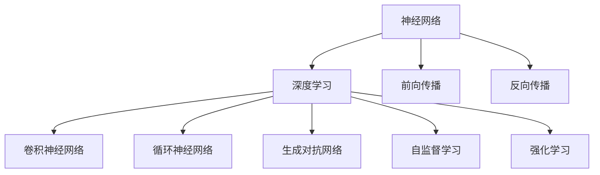

                 

# 神经网络：人类智慧的解放

## 1. 背景介绍

### 1.1 问题由来
近年来，人工智能领域取得了突破性进展，特别是深度学习技术在图像识别、自然语言处理、语音识别等领域的广泛应用，标志着人工智能开始从弱人工智能向强人工智能迈进。其中，神经网络作为深度学习的核心算法，因其强大的建模能力和泛化能力，成为推动人工智能发展的重要动力。

神经网络通过模仿人类神经系统的工作原理，利用大量数据训练，能够自动学习特征提取和决策判别等复杂任务。这一技术在医疗、金融、交通、智能制造等领域的应用，正在逐步改变人类的生产生活方式，释放出前所未有的智慧潜力。

### 1.2 问题核心关键点
神经网络技术的核心在于其强大的数据建模能力，以及通过不断优化训练过程，使模型逐渐逼近理想状态的优化算法。神经网络通过学习大量标注数据，自动提取特征，并应用于分类、回归、生成等众多任务中。其成功与否，关键在于模型架构的设计、训练参数的调优，以及优化算法的选择。

神经网络技术的研究涉及数学建模、优化算法、硬件加速等多个领域，涵盖计算机科学、物理学、生物学等多个学科，展现出复杂的交叉性和综合性。

### 1.3 问题研究意义
神经网络技术的研究，对于推动人工智能的发展，具有重要意义：

1. **数据驱动智能决策**：神经网络通过学习大量数据，能够自动提取特征，辅助决策系统进行智能决策。
2. **泛化能力提升**：神经网络模型能够在不同领域中应用，提升数据处理和决策的泛化能力。
3. **自动化特征工程**：神经网络能够自动提取特征，减少特征工程的工作量。
4. **高效计算加速**：通过深度学习框架和专用硬件的优化，神经网络训练速度大幅提升。
5. **开源技术普及**：深度学习框架的开源化，使得神经网络技术更加普及，研究者能够在此基础上进行深入研究。

## 2. 核心概念与联系

### 2.1 核心概念概述

为更好地理解神经网络技术，本节将介绍几个密切相关的核心概念：

- **神经网络(Neural Network, NN)**：由大量人工神经元相互连接组成的计算模型。通过学习大量数据，自动提取特征，并应用于分类、回归、生成等任务。
- **深度学习(Deep Learning)**：利用多层神经网络，通过反向传播算法优化模型参数，实现复杂数据建模的技术。
- **前向传播(Forward Propagation)**：神经网络中，输入数据经过一系列线性变换和非线性激活，得到最终输出。
- **反向传播(Backward Propagation)**：通过计算损失函数对模型参数的梯度，优化模型参数以降低损失。
- **卷积神经网络(Convolutional Neural Network, CNN)**：针对图像处理任务设计的神经网络架构，通过卷积和池化操作提取特征。
- **循环神经网络(Recurrent Neural Network, RNN)**：针对序列数据设计的神经网络架构，通过循环结构处理变长序列。
- **生成对抗网络(Generative Adversarial Network, GAN)**：通过两个神经网络的对抗训练，生成逼真样本的模型。
- **自监督学习(Self-supervised Learning)**：利用无标签数据，通过自建任务训练模型，学习数据的表示。
- **强化学习(Reinforcement Learning)**：通过与环境的交互，学习最优策略的模型。

这些核心概念之间的逻辑关系可以通过以下Mermaid流程图来展示：



这个流程图展示了大神经网络技术的核心概念及其之间的关系：

1. 神经网络是深度学习的核心组件。
2. 深度学习通过多层神经网络建模复杂数据。
3. 前向传播和反向传播是神经网络训练的基础。
4. CNN和RNN是针对特定任务的神经网络架构。
5. GAN、自监督学习和强化学习扩展了神经网络的边界。

这些概念共同构成了神经网络技术的理论基础，使其能够在各种场景下发挥强大的数据建模能力。

## 3. 核心算法原理 & 具体操作步骤
### 3.1 算法原理概述

神经网络技术的核心在于其强大的数据建模能力，通过多层神经网络，自动提取特征并应用于任务解决。其核心算法流程包括以下几个关键步骤：

1. **前向传播**：将输入数据输入神经网络，经过一系列线性变换和非线性激活，得到模型输出。
2. **损失计算**：通过模型输出与真实标签的差异，计算损失函数。
3. **反向传播**：计算损失函数对模型参数的梯度，优化模型参数以降低损失。
4. **参数更新**：使用优化算法，如随机梯度下降(SGD)、Adam等，更新模型参数。
5. **模型评估**：在验证集或测试集上评估模型性能，确定模型是否过拟合。

### 3.2 算法步骤详解

以下详细介绍神经网络模型的训练过程：

**Step 1: 准备数据集**
- 收集任务相关的训练数据集和验证数据集。
- 数据预处理：将数据集标准化、归一化，去除噪声等。
- 数据划分：将数据集分为训练集、验证集和测试集。

**Step 2: 构建模型架构**
- 根据任务类型选择适合的神经网络架构，如CNN、RNN、Transformer等。
- 定义模型层数、节点数、激活函数等参数。

**Step 3: 设置优化器**
- 选择合适的优化器，如SGD、Adam等。
- 设置学习率、批大小、迭代轮数等超参数。

**Step 4: 执行前向传播**
- 将训练集数据分批次输入模型，前向传播计算模型输出。
- 计算损失函数，将损失值返回。

**Step 5: 执行反向传播**
- 反向传播计算损失函数对模型参数的梯度。
- 更新模型参数。

**Step 6: 模型评估**
- 在验证集上评估模型性能，如精度、召回率等。
- 根据验证集性能，调整学习率等超参数。
- 重复Step 4-Step 6，直至模型收敛。

**Step 7: 模型保存**
- 将训练好的模型保存到磁盘，便于后续使用和部署。

### 3.3 算法优缺点

神经网络技术的优点包括：
1. 强大的建模能力：能够处理复杂、非线性数据，自动提取特征。
2. 高效计算加速：利用深度学习框架和专用硬件，加速模型训练和推理。
3. 普适性：在众多领域中应用广泛，如图像处理、语音识别、自然语言处理等。
4. 自适应学习能力：通过学习数据，能够不断优化模型性能。

神经网络技术也存在一些缺点：
1. 数据依赖性强：需要大量标注数据，才能训练出效果良好的模型。
2. 模型复杂度高：大规模神经网络需要大量的计算资源。
3. 过拟合风险高：模型参数过多，容易导致过拟合。
4. 可解释性差：神经网络模型复杂，难以解释其内部决策逻辑。
5. 训练成本高：大规模神经网络的训练需要大量时间，且易受硬件资源限制。

### 3.4 算法应用领域

神经网络技术已经广泛应用于众多领域，以下是几个典型应用场景：

- **计算机视觉**：如物体检测、图像分割、人脸识别等。通过卷积神经网络(CNN)等模型，提取图像特征。
- **自然语言处理**：如机器翻译、文本分类、情感分析等。通过循环神经网络(RNN)、Transformer等模型，处理序列数据。
- **语音识别**：如语音转文本、自动语音生成等。通过卷积神经网络(CNN)、循环神经网络(RNN)等模型，提取语音特征。
- **智能推荐**：如电商推荐、音乐推荐等。通过协同过滤、深度学习等模型，实现个性化推荐。
- **游戏AI**：如自动驾驶、虚拟现实等。通过强化学习等模型，训练决策策略。

此外，神经网络技术还在金融、医疗、制造等多个领域得到了广泛应用，展示了其在不同场景中的强大适应能力。

## 4. 数学模型和公式 & 详细讲解 & 举例说明

### 4.1 数学模型构建

神经网络模型的数学模型构建主要涉及以下几个关键步骤：

1. **输入层**：将原始数据转换为神经网络可以处理的向量形式。
2. **隐藏层**：通过一系列线性变换和非线性激活，提取数据特征。
3. **输出层**：将隐藏层提取的特征映射为任务的输出。

假设神经网络模型包含 $n$ 个隐藏层，第 $i$ 层的节点数为 $n_i$，则模型的数学表示如下：

$$
x^{(l)}=\sigma(W^{(l)}x^{(l-1)}+b^{(l)})
$$

其中，$x^{(l)}$ 为第 $l$ 层的输入向量，$W^{(l)}$ 为第 $l$ 层的权重矩阵，$b^{(l)}$ 为第 $l$ 层的偏置向量，$\sigma$ 为激活函数。

### 4.2 公式推导过程

以下以简单的二分类任务为例，详细推导神经网络的训练过程。

假设训练数据集为 $\{(x_i,y_i)\}_{i=1}^N$，其中 $x_i \in \mathbb{R}^d$ 为输入向量，$y_i \in \{0,1\}$ 为二分类标签。

**前向传播**：

$$
h^{(1)} = W^{(1)}x + b^{(1)}
$$

$$
h^{(2)} = \sigma(W^{(2)}h^{(1)} + b^{(2)})
$$

$$
\hat{y} = \sigma(W^{(3)}h^{(2)} + b^{(3)})
$$

其中，$h^{(l)}$ 为第 $l$ 层的隐藏层输出，$\sigma$ 为激活函数。

**损失函数**：

$$
\ell(\hat{y},y) = -[y\log\hat{y} + (1-y)\log(1-\hat{y})]
$$

**梯度计算**：

$$
\frac{\partial \ell(\hat{y},y)}{\partial W^{(3)}} = (\hat{y}-y)\sigma'(W^{(3)}h^{(2)} + b^{(3)})
$$

$$
\frac{\partial \ell(\hat{y},y)}{\partial b^{(3)}} = (\hat{y}-y)\sigma'(W^{(3)}h^{(2)} + b^{(3)})
$$

$$
\frac{\partial \ell(\hat{y},y)}{\partial W^{(2)}} = \frac{\partial \ell(\hat{y},y)}{\partial h^{(2)}}\cdot \frac{\partial h^{(2)}}{\partial W^{(2)}}
$$

$$
\frac{\partial \ell(\hat{y},y)}{\partial b^{(2)}} = \frac{\partial \ell(\hat{y},y)}{\partial h^{(2)}}\cdot \frac{\partial h^{(2)}}{\partial b^{(2)}}
$$

$$
\frac{\partial \ell(\hat{y},y)}{\partial W^{(1)}} = \frac{\partial \ell(\hat{y},y)}{\partial h^{(1)}}\cdot \frac{\partial h^{(1)}}{\partial W^{(1)}}
$$

$$
\frac{\partial \ell(\hat{y},y)}{\partial b^{(1)}} = \frac{\partial \ell(\hat{y},y)}{\partial h^{(1)}}\cdot \frac{\partial h^{(1)}}{\partial b^{(1)}}
$$

**梯度更新**：

$$
W^{(l)} \leftarrow W^{(l)} - \eta \frac{\partial \ell(\hat{y},y)}{\partial W^{(l)}}
$$

$$
b^{(l)} \leftarrow b^{(l)} - \eta \frac{\partial \ell(\hat{y},y)}{\partial b^{(l)}}
$$

其中，$\eta$ 为学习率，$\sigma'$ 为激活函数的导数。

### 4.3 案例分析与讲解

以下以图像分类任务为例，介绍神经网络模型的训练过程：

1. **数据准备**：收集大量标注图像数据，如CIFAR-10、ImageNet等。
2. **模型构建**：选择卷积神经网络(CNN)作为模型架构，包含多个卷积层、池化层和全连接层。
3. **参数初始化**：对模型参数进行随机初始化。
4. **前向传播**：将训练图像输入模型，通过卷积、池化和全连接层，得到模型的输出。
5. **损失计算**：计算输出与真实标签之间的交叉熵损失。
6. **反向传播**：计算损失函数对模型参数的梯度。
7. **梯度更新**：使用Adam等优化器，更新模型参数。
8. **模型评估**：在验证集上评估模型性能，调整学习率等超参数。
9. **模型保存**：保存训练好的模型，便于后续使用和部署。

## 5. 项目实践：代码实例和详细解释说明

### 5.1 开发环境搭建

在进行神经网络模型训练前，需要准备好开发环境。以下是使用Python进行TensorFlow开发的环境配置流程：

1. 安装Anaconda：从官网下载并安装Anaconda，用于创建独立的Python环境。

2. 创建并激活虚拟环境：
```bash
conda create -n tf-env python=3.8 
conda activate tf-env
```

3. 安装TensorFlow：根据CUDA版本，从官网获取对应的安装命令。例如：
```bash
conda install tensorflow -c pytorch -c conda-forge
```

4. 安装各类工具包：
```bash
pip install numpy pandas scikit-learn matplotlib tqdm jupyter notebook ipython
```

完成上述步骤后，即可在`tf-env`环境中开始神经网络模型的训练。

### 5.2 源代码详细实现

这里以简单的二分类任务为例，介绍如何使用TensorFlow进行神经网络模型的训练。

首先，定义模型架构和超参数：

```python
import tensorflow as tf
from tensorflow.keras import layers, models

# 定义模型架构
model = models.Sequential([
    layers.Dense(64, activation='relu', input_shape=(d,)),
    layers.Dense(64, activation='relu'),
    layers.Dense(1, activation='sigmoid')
])

# 设置优化器
optimizer = tf.keras.optimizers.Adam(learning_rate=0.001)

# 定义损失函数
loss_fn = tf.keras.losses.BinaryCrossentropy(from_logits=True)

# 定义评价指标
metrics = [tf.keras.metrics.AUC(name='auc')]

# 编译模型
model.compile(optimizer=optimizer,
              loss=loss_fn,
              metrics=metrics)
```

然后，定义训练函数：

```python
def train(model, train_dataset, epochs, batch_size):
    model.fit(train_dataset,
              validation_data=val_dataset,
              epochs=epochs,
              batch_size=batch_size)
```

最后，进行模型训练：

```python
# 加载数据集
train_dataset = ...
val_dataset = ...

# 设置超参数
epochs = 10
batch_size = 32

# 训练模型
train(model, train_dataset, epochs, batch_size)

# 评估模型
test_loss, test_auc = model.evaluate(test_dataset)

# 打印评估结果
print('Test loss:', test_loss)
print('Test AUC:', test_auc)
```

以上就是使用TensorFlow进行神经网络模型训练的完整代码实现。可以看到，TensorFlow提供了一整套高级API，方便开发者快速实现模型训练过程。

### 5.3 代码解读与分析

让我们再详细解读一下关键代码的实现细节：

**Sequential模型**：
- `Sequential`类：用于按顺序添加层，定义神经网络模型。

**Dense层**：
- `Dense`类：定义全连接层，包含权重矩阵、偏置项等参数。

**优化器**：
- `Adam`类：基于Adam算法的优化器，自适应调整学习率。

**损失函数**：
- `BinaryCrossentropy`类：二分类任务下的交叉熵损失函数。

**评价指标**：
- `AUC`类：计算模型的AUC值，评估模型性能。

**编译模型**：
- `compile`方法：配置模型参数，如优化器、损失函数等。

**训练函数**：
- `fit`方法：在训练数据集上训练模型，在验证数据集上评估性能。

**模型评估**：
- `evaluate`方法：在测试数据集上评估模型性能，返回损失和评价指标。

**训练过程**：
- 使用`fit`方法训练模型，逐步降低损失。
- 使用`evaluate`方法在测试集上评估模型性能。

可以看出，TensorFlow提供的高阶API使得神经网络模型的训练过程变得简洁高效。开发者可以专注于模型的架构设计和调参优化，而不必过多关注底层实现细节。

## 6. 实际应用场景
### 6.1 计算机视觉

神经网络技术在计算机视觉领域取得了巨大成功，广泛应用于图像分类、物体检测、人脸识别等任务。

以图像分类任务为例，使用卷积神经网络(CNN)提取图像特征，通过softmax层进行分类。典型的CNN架构包括卷积层、池化层、全连接层等。

**应用场景**：
- 图像分类：识别图片中的物体、场景等。如TensorFlow中的Inception V3模型，通过多个卷积层和池化层，提取图像特征，并进行分类。
- 物体检测：在图像中检测出物体的边界框。如TensorFlow中的Faster R-CNN模型，通过区域池化和卷积操作，检测出图像中的物体，并给出边界框。

**技术要点**：
- 选择合适的CNN架构，如VGG、ResNet、Inception等。
- 数据增强：通过旋转、缩放、裁剪等方式，扩充训练集多样性。
- 正则化：使用L2正则、Dropout等技术，避免过拟合。
- 迁移学习：在预训练模型基础上，针对特定任务进行微调，加速训练过程。

### 6.2 自然语言处理

神经网络技术在自然语言处理领域也取得了显著成效，广泛应用于机器翻译、文本分类、情感分析等任务。

以文本分类任务为例，使用循环神经网络(RNN)或Transformer模型，通过前向传播和反向传播，提取文本特征并进行分类。

**应用场景**：
- 文本分类：将文本分为不同的类别。如TensorFlow中的TextCNN模型，通过卷积层和池化层，提取文本特征，并进行分类。
- 情感分析：判断文本的情感倾向。如TensorFlow中的RNN模型，通过LSTM层，提取文本特征，并进行情感分类。

**技术要点**：
- 选择合适的模型架构，如RNN、LSTM、Transformer等。
- 数据预处理：对文本进行分词、去除停用词等操作，提高特征提取效果。
- 正则化：使用L2正则、Dropout等技术，避免过拟合。
- 迁移学习：在预训练模型基础上，针对特定任务进行微调，加速训练过程。

### 6.3 智能推荐

神经网络技术在智能推荐领域也得到了广泛应用，如电商推荐、音乐推荐等。

以电商推荐任务为例，使用协同过滤、深度学习等模型，通过前向传播和反向传播，提取用户和商品之间的关联特征，并进行推荐。

**应用场景**：
- 电商推荐：根据用户的历史行为数据，推荐商品。如TensorFlow中的协同过滤模型，通过矩阵分解，提取用户和商品之间的关联特征，并进行推荐。
- 音乐推荐：根据用户的音乐喜好，推荐新的音乐。如TensorFlow中的深度学习模型，通过多层神经网络，提取音乐特征，并进行推荐。

**技术要点**：
- 选择合适的模型架构，如协同过滤、深度学习等。
- 数据预处理：对用户和商品数据进行归一化、降维等操作，提高特征提取效果。
- 正则化：使用L2正则、Dropout等技术，避免过拟合。
- 迁移学习：在预训练模型基础上，针对特定任务进行微调，加速训练过程。

## 7. 工具和资源推荐
### 7.1 学习资源推荐

为了帮助开发者系统掌握神经网络技术，这里推荐一些优质的学习资源：

1. **《深度学习》系列书籍**：斯坦福大学的Ian Goodfellow所著，系统介绍深度学习的基本概念和算法。
2. **《TensorFlow实战》**：GoogleTensorFlow官方文档，详细讲解TensorFlow的使用方法和最佳实践。
3. **《Python深度学习》**：François Chollet所著，介绍TensorFlow和Keras的使用方法和深度学习模型的实现。
4. **《自然语言处理综述》**：Stanford大学的CS224N课程，涵盖自然语言处理的基本概念和经典模型。
5. **Kaggle竞赛**：Kaggle是数据科学竞赛平台，参与各类深度学习竞赛，积累实战经验。

通过对这些资源的学习实践，相信你一定能够快速掌握神经网络技术的精髓，并用于解决实际的业务问题。

### 7.2 开发工具推荐

高效的开发离不开优秀的工具支持。以下是几款用于神经网络模型开发的常用工具：

1. TensorFlow：Google开源的深度学习框架，支持多种模型架构，提供丰富的API。
2. PyTorch：Facebook开源的深度学习框架，灵活性高，易于调试。
3. Keras：高层API，提供便捷的深度学习模型实现方式，易于上手。
4. Jupyter Notebook：交互式编程环境，支持多种编程语言，方便实验调试。
5. Scikit-Learn：机器学习库，提供丰富的数据处理和模型评估工具。

合理利用这些工具，可以显著提升神经网络模型的开发效率，加快创新迭代的步伐。

### 7.3 相关论文推荐

神经网络技术的研究涉及多个领域，以下是几篇奠基性的相关论文，推荐阅读：

1. **《深度神经网络》**：Ian Goodfellow等，深度神经网络的结构和算法。
2. **《ImageNet分类挑战赛》**：Alex Krizhevsky等，提出AlexNet模型，赢得ImageNet分类挑战赛。
3. **《Google的深度学习技术》**：Andrew Ng等，Google的深度学习技术栈和最佳实践。
4. **《Transformer》**：Ashish Vaswani等，提出Transformer模型，用于机器翻译等任务。
5. **《生成对抗网络》**：Ian Goodfellow等，提出GAN模型，用于生成逼真样本。

这些论文代表了大神经网络技术的发展脉络。通过学习这些前沿成果，可以帮助研究者把握学科前进方向，激发更多的创新灵感。

## 8. 总结：未来发展趋势与挑战

### 8.1 总结

本文对神经网络技术的核心概念和应用进行了全面系统的介绍。首先阐述了神经网络技术的背景和意义，明确了神经网络在人工智能领域的重要地位。其次，从原理到实践，详细讲解了神经网络模型的训练过程，给出了代码实例和详细解释说明。同时，本文还广泛探讨了神经网络技术在计算机视觉、自然语言处理、智能推荐等多个领域的应用前景，展示了神经网络技术的广阔应用空间。

通过本文的系统梳理，可以看到，神经网络技术作为人工智能的核心算法，已经深入到多个领域的各个环节，展现了强大的数据建模能力。未来，随着深度学习框架和专用硬件的不断进步，神经网络技术的实现效率和模型性能将进一步提升，为人工智能的发展提供更强有力的支持。

### 8.2 未来发展趋势

展望未来，神经网络技术的发展趋势包括：

1. **模型规模持续增大**：随着算力成本的下降和数据规模的扩张，神经网络模型的参数量还将持续增长。超大规模神经网络蕴含的丰富语言知识，有望支撑更加复杂多变的任务。
2. **计算效率提升**：通过深度学习框架和专用硬件的优化，神经网络模型的训练和推理速度将大幅提升，如使用GPU、TPU等加速计算。
3. **模型通用性增强**：经过海量数据的预训练和多领域任务的微调，神经网络模型将具备更强大的常识推理和跨领域迁移能力，逐步迈向通用人工智能(AGI)的目标。
4. **自监督学习发展**：利用自监督学习任务，减少对标注数据的依赖，提升模型的泛化能力。
5. **多模态融合**：将视觉、语音、文本等多模态信息整合，实现更加全面、准确的智能系统。
6. **自动化调参**：引入自动化调参技术，提高模型训练的效率和效果。

这些趋势凸显了神经网络技术的广阔前景。这些方向的探索发展，必将进一步提升神经网络模型的性能和应用范围，为人工智能技术的进步提供强有力的支持。

### 8.3 面临的挑战

尽管神经网络技术已经取得了显著成果，但在迈向更加智能化、普适化应用的过程中，它仍面临诸多挑战：

1. **数据依赖性强**：神经网络模型需要大量标注数据，对于长尾应用场景，难以获得充足的高质量标注数据。
2. **模型鲁棒性不足**：模型面对域外数据时，泛化性能往往大打折扣。
3. **过拟合风险高**：模型参数过多，容易导致过拟合。
4. **可解释性差**：神经网络模型复杂，难以解释其内部决策逻辑。
5. **训练成本高**：大规模神经网络的训练需要大量时间，且易受硬件资源限制。

### 8.4 研究展望

面对神经网络技术面临的挑战，未来的研究需要在以下几个方面寻求新的突破：

1. **无监督学习和少样本学习**：探索无监督学习、少样本学习等方法，减少对标注数据的依赖。
2. **对抗训练和鲁棒性提升**：引入对抗训练等方法，提高模型的鲁棒性和泛化能力。
3. **模型压缩和优化**：开发模型压缩、优化技术，减小模型尺寸，提高计算效率。
4. **多模态融合和跨模态学习**：将视觉、语音、文本等多模态信息整合，实现更加全面、准确的智能系统。
5. **自动化调参和模型解释**：引入自动化调参技术，提高模型训练的效率和效果。开发模型解释技术，提高模型的可解释性和透明性。
6. **伦理和社会责任**：加强人工智能的伦理和社会责任研究，确保模型的公正性、透明性和可控性。

这些研究方向必将引领神经网络技术迈向更高的台阶，为构建安全、可靠、可解释、可控的智能系统铺平道路。面向未来，神经网络技术还需要与其他人工智能技术进行更深入的融合，如知识表示、因果推理、强化学习等，多路径协同发力，共同推动人工智能技术的进步。只有勇于创新、敢于突破，才能不断拓展神经网络技术的边界，让智能技术更好地造福人类社会。

## 9. 附录：常见问题与解答

**Q1：神经网络模型训练需要多少数据？**

A: 神经网络模型的训练需要大量标注数据，特别是对于复杂的任务，如图像分类、自然语言处理等，数据量通常在数千到数万级别。对于小数据量的任务，可以使用数据增强、迁移学习等技术，提高模型的泛化能力。

**Q2：如何选择神经网络模型的超参数？**

A: 神经网络模型的超参数包括学习率、批大小、迭代轮数等。选择超参数需要结合任务的特点和数据量进行调整。通常，学习率需要根据数据分布进行调整，批大小需要根据硬件资源进行调整，迭代轮数需要根据模型性能进行调整。可以参考开源模型的默认参数，逐步调参优化。

**Q3：如何优化神经网络模型的训练过程？**

A: 优化神经网络模型的训练过程，可以从以下几个方面入手：
1. 数据增强：通过旋转、缩放、裁剪等方式，扩充训练集多样性。
2. 正则化：使用L2正则、Dropout等技术，避免过拟合。
3. 梯度累积：使用梯度累积技术，提高模型的收敛速度。
4. 混合精度训练：使用混合精度训练，加速模型训练过程。
5. 自适应学习率：使用自适应学习率算法，如Adam、Adagrad等，提高模型训练效果。

**Q4：如何评估神经网络模型的性能？**

A: 评估神经网络模型的性能，通常使用准确率、召回率、AUC等指标。对于分类任务，可以使用混淆矩阵、ROC曲线等方法进行可视化分析。对于回归任务，可以使用MAE、RMSE等指标进行评估。在实际应用中，还需要考虑模型的鲁棒性、泛化能力等指标。

**Q5：神经网络模型有哪些常见的陷阱？**

A: 神经网络模型训练过程中，常见的问题包括：
1. 过拟合：模型参数过多，导致模型在训练集上表现良好，但在测试集上表现较差。
2. 欠拟合：模型参数过少，导致模型无法拟合训练数据。
3. 梯度消失/爆炸：在深层神经网络中，梯度可能会消失或爆炸，导致模型训练失败。
4. 数据不平衡：训练数据不平衡，导致模型对少数类别学习不足。
5. 模型选择不当：模型架构选择不当，导致模型无法解决特定任务。

正视这些问题，并采取相应的解决措施，可以有效提高神经网络模型的训练效果。

