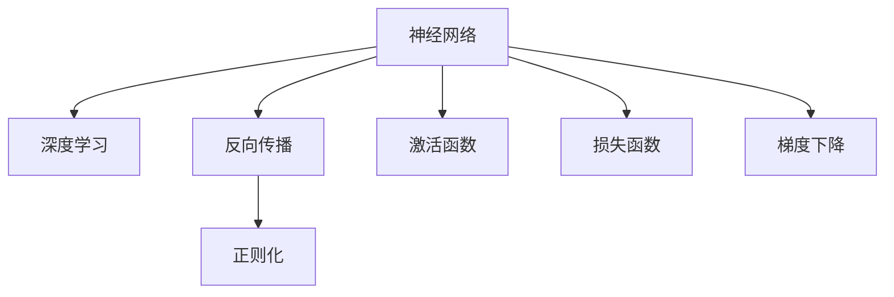

                 

# 神经网络：开启智能新纪元

## 1. 背景介绍

神经网络（Neural Network, NN）是当前人工智能（AI）领域最核心的技术之一，其历史可以追溯到上世纪40年代，经历了多次起伏后，随着深度学习（Deep Learning, DL）的兴起，神经网络技术再次走入人们的视野，成为推动智能新纪元的核心力量。

### 1.1 问题由来
当前，人工智能技术广泛应用于语音识别、图像处理、自然语言处理等领域，而神经网络技术的成功应用是这些领域的核心驱动力。神经网络通过模拟人脑的神经元结构，学习和推理大量数据，为各种复杂问题的解决提供了可能。然而，神经网络在理论和实践上都面临诸多挑战，如网络结构设计、训练效率、泛化能力等，这些问题的解决直接关系到神经网络能否更好地服务于实际应用。

### 1.2 问题核心关键点
神经网络的核心思想是通过层叠的神经元（Neurons）构建一个复杂的网络结构，每个神经元接收多个输入，并计算加权和，通过非线性激活函数（Activation Function）产生输出。网络通过大量数据进行训练，学习数据的特征表示，从而实现分类、回归、生成等任务。关键在于网络结构的设计和优化，以及如何高效地训练神经网络，使其在大规模数据集上取得理想的效果。

### 1.3 问题研究意义
研究神经网络技术，对于推动人工智能技术的突破，加速智能新纪元的到来，具有重要意义：

1. 提升智能系统的效率和精度。神经网络在处理复杂数据时，具有独特的优势，可以显著提高智能系统的效率和精度，推动各领域的智能化转型。
2. 拓展应用场景。神经网络技术可以应用到从医疗、金融到教育、交通等多个领域，为这些行业带来变革性影响。
3. 促进创新发展。神经网络技术的不断进步，推动了深度学习、强化学习等新兴领域的快速发展，催生了更多创新应用。
4. 推动产业升级。神经网络技术的商业化应用，使得AI技术更容易被各行各业所采用，为传统行业数字化转型提供了新的动力。

## 2. 核心概念与联系

### 2.1 核心概念概述

为了更好地理解神经网络技术的核心原理和应用，本节将介绍几个密切相关的核心概念：

- 神经网络（Neural Network, NN）：通过神经元构建的网络结构，能够学习和推理大量数据，实现复杂的任务。
- 深度学习（Deep Learning, DL）：神经网络的一个子集，包含多层神经元，能够学习到高层次的数据特征，适用于图像、语音、文本等复杂数据的处理。
- 反向传播（Backpropagation）：一种高效的训练算法，通过链式法则计算损失函数的梯度，更新网络参数。
- 正则化（Regularization）：通过引入惩罚项，防止模型过拟合，提高模型的泛化能力。
- 激活函数（Activation Function）：如ReLU、Sigmoid等，非线性变换使得神经网络能够处理非线性关系。
- 损失函数（Loss Function）：如交叉熵损失、均方误差损失等，衡量模型输出与真实标签之间的差异。
- 梯度下降（Gradient Descent）：一种优化算法，通过不断调整模型参数，最小化损失函数。

这些核心概念之间的逻辑关系可以通过以下Mermaid流程图来展示：



这个流程图展示了大语言模型的核心概念及其之间的关系：

1. 神经网络通过多层神经元结构学习数据特征。
2. 深度学习是神经网络的一种高级形式，能够处理更复杂的任务。
3. 反向传播算法通过梯度下降优化神经网络。
4. 正则化技术防止模型过拟合。
5. 激活函数引入非线性变换，使得神经网络能够处理非线性关系。
6. 损失函数衡量模型输出与真实标签之间的差异。

这些核心概念共同构成了神经网络的基本框架，使其能够在各种场景下发挥强大的数据学习和推理能力。通过理解这些核心概念，我们可以更好地把握神经网络的工作原理和优化方向。

## 3. 核心算法原理 & 具体操作步骤
### 3.1 算法原理概述

神经网络的训练过程是一个迭代优化问题，目标是最小化损失函数，使得模型输出逼近真实标签。其核心思想是：通过反向传播算法计算损失函数的梯度，不断调整网络参数，最小化损失函数。

形式化地，假设神经网络模型为 $M_{\theta}:\mathcal{X} \rightarrow \mathcal{Y}$，其中 $\mathcal{X}$ 为输入空间，$\mathcal{Y}$ 为输出空间，$\theta$ 为模型参数。给定训练数据集 $D=\{(x_i,y_i)\}_{i=1}^N$，训练目标是最小化损失函数：

$$
\theta^* = \mathop{\arg\min}_{\theta} \mathcal{L}(M_{\theta},D)
$$

其中 $\mathcal{L}$ 为损失函数，用于衡量模型输出与真实标签之间的差异。常见的损失函数包括交叉熵损失、均方误差损失等。

### 3.2 算法步骤详解

神经网络的训练过程通常包括以下几个关键步骤：

**Step 1: 准备数据集**
- 收集训练数据集 $D=\{(x_i,y_i)\}_{i=1}^N$，其中 $x_i \in \mathcal{X}$ 为输入，$y_i \in \mathcal{Y}$ 为标签。
- 将数据集划分为训练集、验证集和测试集。

**Step 2: 定义模型结构**
- 根据任务需求，设计网络结构，如卷积神经网络（CNN）、循环神经网络（RNN）、多层感知器（MLP）等。
- 定义模型的激活函数、损失函数等关键组件。

**Step 3: 初始化模型参数**
- 随机初始化模型的参数 $\theta$。

**Step 4: 前向传播**
- 将训练集数据 $D$ 输入模型，计算输出 $y$。

**Step 5: 计算损失函数**
- 根据定义的损失函数，计算模型输出与真实标签之间的差异。

**Step 6: 反向传播**
- 使用反向传播算法计算损失函数的梯度，更新模型参数。

**Step 7: 优化算法**
- 使用优化算法（如梯度下降、Adam等）更新模型参数。

**Step 8: 验证与调整**
- 在验证集上评估模型性能，根据验证集的结果调整模型参数。

**Step 9: 测试与部署**
- 在测试集上评估模型性能，使用优化后的模型进行实际应用。

### 3.3 算法优缺点

神经网络的训练方法具有以下优点：

1. 非线性映射能力：通过多层神经元结构，神经网络能够学习到高层次的数据特征，处理复杂的非线性关系。
2. 高效优化：反向传播算法通过梯度下降优化模型参数，速度较快，适合大规模数据集。
3. 泛化能力强：通过正则化和数据增强等技术，神经网络能够避免过拟合，提高泛化能力。

同时，该方法也存在一些局限性：

1. 模型复杂度高：深层神经网络的参数量巨大，训练和推理成本较高。
2. 需要大量数据：神经网络的训练过程需要大量的标注数据，数据获取成本较高。
3. 模型可解释性不足：神经网络的决策过程难以解释，缺乏可解释性。
4. 训练过程易受参数初始值影响：网络参数的初始值可能影响训练的收敛速度和精度。

尽管存在这些局限性，但神经网络作为目前最有效的数据学习和推理技术，仍被广泛应用于各种AI应用中，推动了AI技术的快速发展。

### 3.4 算法应用领域

神经网络技术已经在各个领域得到了广泛应用，包括但不限于以下方面：

- 计算机视觉：图像分类、目标检测、图像生成等任务。
- 自然语言处理：机器翻译、文本生成、情感分析等任务。
- 语音识别：语音识别、说话人识别、语音合成等任务。
- 医疗诊断：医学影像分析、疾病预测、基因分析等任务。
- 自动驾驶：视觉感知、行为预测、路径规划等任务。

除了上述这些经典应用，神经网络技术还在金融、交通、物流等多个领域得到创新性的应用，推动了相关行业的发展和创新。

## 4. 数学模型和公式 & 详细讲解  
### 4.1 数学模型构建

神经网络的数学模型可以通过以下几个步骤来构建：

1. 定义输入 $x$ 和输出 $y$，其中 $x \in \mathcal{X}$，$y \in \mathcal{Y}$。
2. 定义神经元层的激活函数 $f(\cdot)$，如ReLU、Sigmoid等。
3. 定义损失函数 $L(y,\hat{y})$，用于衡量模型输出与真实标签之间的差异，如交叉熵损失、均方误差损失等。

假设神经网络模型包含 $n$ 层，第 $i$ 层有 $k_i$ 个神经元，则神经网络的数学模型可以表示为：

$$
y = f_{L}(f_{L-1}(f_{L-2}(...(f_{1}(x))))
$$

其中 $f_i$ 表示第 $i$ 层的激活函数，$x$ 表示输入，$y$ 表示输出。

### 4.2 公式推导过程

以二分类任务为例，推导交叉熵损失函数及其梯度的计算公式。

假设神经网络模型在输入 $x$ 上的输出为 $\hat{y} \in [0,1]$，表示样本属于正类的概率。真实标签 $y \in \{0,1\}$。则二分类交叉熵损失函数定义为：

$$
L(y,\hat{y}) = -[y\log \hat{y} + (1-y)\log(1-\hat{y})]
$$

将其代入经验风险公式，得：

$$
\mathcal{L}(\theta) = -\frac{1}{N}\sum_{i=1}^N [y_i\log \hat{y}_i + (1-y_i)\log(1-\hat{y}_i)]
$$

根据链式法则，损失函数对参数 $\theta_k$ 的梯度为：

$$
\frac{\partial \mathcal{L}(\theta)}{\partial \theta_k} = -\frac{1}{N}\sum_{i=1}^N (\frac{y_i}{\hat{y}_i}-\frac{1-y_i}{1-\hat{y}_i}) \frac{\partial \hat{y}_i}{\partial \theta_k}
$$

其中 $\frac{\partial \hat{y}_i}{\partial \theta_k}$ 可以进一步递归展开，利用反向传播算法计算。

### 4.3 案例分析与讲解

考虑一个简单的三层神经网络模型，包含一个输入层、一个隐藏层和一个输出层。假设输入层有2个神经元，隐藏层有4个神经元，输出层有1个神经元，激活函数为ReLU，损失函数为交叉熵损失。

设输入为 $x = [0.5, 0.7]$，期望输出为 $y = 1$。通过反向传播算法计算损失函数的梯度，更新模型参数。具体计算过程如下：

1. **前向传播**：
   - 输入层：$z_1 = [0.5, 0.7]$，输出为 $a_1 = [0.5, 0.7]$。
   - 隐藏层：$z_2 = [a_1 \cdot w_1 + b_1] = [0.5 \cdot w_{11} + b_1, 0.7 \cdot w_{12} + b_1]$，输出为 $a_2 = \text{ReLU}(z_2) = [\text{ReLU}(0.5 \cdot w_{11} + b_1), \text{ReLU}(0.7 \cdot w_{12} + b_1)]$。
   - 输出层：$z_3 = [a_2 \cdot w_2 + b_2] = [\text{ReLU}(0.5 \cdot w_{11} + b_1) \cdot w_{21} + b_2, \text{ReLU}(0.7 \cdot w_{12} + b_1) \cdot w_{22} + b_2]$，输出为 $\hat{y} = \text{ReLU}(z_3)$。

2. **计算损失函数**：
   - 损失函数为 $L(y,\hat{y}) = -[y\log \hat{y} + (1-y)\log(1-\hat{y})] = -[1\log \hat{y} + (1-1)\log(1-\hat{y})] = -\log \hat{y}$。
   - 经验风险为 $\mathcal{L}(\theta) = -\frac{1}{N}\sum_{i=1}^N \log \hat{y}_i$。

3. **反向传播**：
   - 计算 $\frac{\partial \mathcal{L}(\theta)}{\partial z_3}$：$\frac{\partial \mathcal{L}(\theta)}{\partial z_3} = -\frac{1}{N}(\frac{1}{\hat{y}} - 1)$。
   - 计算 $\frac{\partial \mathcal{L}(\theta)}{\partial w_{21}}$：$\frac{\partial \mathcal{L}(\theta)}{\partial w_{21}} = \frac{\partial \mathcal{L}(\theta)}{\partial z_3} \cdot \frac{\partial z_3}{\partial w_{21}} = (\frac{1}{\hat{y}} - 1) \cdot \frac{\partial \hat{y}}{\partial z_3} \cdot \frac{\partial z_3}{\partial w_{21}} = (\frac{1}{\hat{y}} - 1) \cdot 1 \cdot a_2 \cdot w_{21}$。

4. **更新参数**：
   - 使用梯度下降算法，更新模型参数：$w_{21} \leftarrow w_{21} - \eta \cdot \frac{\partial \mathcal{L}(\theta)}{\partial w_{21}}$，其中 $\eta$ 为学习率。

通过上述过程，可以看到，神经网络的反向传播算法能够高效计算损失函数的梯度，并用于模型参数的更新。这种优化过程不仅适用于二分类任务，也适用于多分类、回归等任务。

## 5. 项目实践：代码实例和详细解释说明
### 5.1 开发环境搭建

在进行神经网络实践前，我们需要准备好开发环境。以下是使用Python进行TensorFlow开发的环境配置流程：

1. 安装Anaconda：从官网下载并安装Anaconda，用于创建独立的Python环境。

2. 创建并激活虚拟环境：
```bash
conda create -n tf-env python=3.8 
conda activate tf-env
```

3. 安装TensorFlow：根据CUDA版本，从官网获取对应的安装命令。例如：
```bash
conda install tensorflow -c conda-forge -c pytorch -c tensorflow -c analytics
```

4. 安装各类工具包：
```bash
pip install numpy pandas scikit-learn matplotlib tqdm jupyter notebook ipython
```

完成上述步骤后，即可在`tf-env`环境中开始神经网络实践。

### 5.2 源代码详细实现

这里我们以MNIST手写数字识别任务为例，给出使用TensorFlow进行神经网络训练的完整代码实现。

首先，定义数据集：

```python
from tensorflow.keras.datasets import mnist

(x_train, y_train), (x_test, y_test) = mnist.load_data()
x_train = x_train / 255.0
x_test = x_test / 255.0
```

然后，定义神经网络模型：

```python
from tensorflow.keras import Sequential, Dense, Flatten

model = Sequential([
    Flatten(input_shape=(28, 28)),
    Dense(128, activation='relu'),
    Dense(10, activation='softmax')
])
```

接着，定义训练和评估函数：

```python
import tensorflow as tf
from tensorflow.keras import optimizers

model.compile(optimizer=optimizers.Adam(), loss='sparse_categorical_crossentropy', metrics=['accuracy'])

def train_epoch(model, dataset, batch_size, epochs, validation_data=None):
    for epoch in range(epochs):
        model.fit(dataset, batch_size=batch_size, epochs=1, validation_data=validation_data)
        model.evaluate(validation_data, verbose=0)

def evaluate(model, dataset, batch_size):
    model.evaluate(dataset, batch_size=batch_size, verbose=0)
```

最后，启动训练流程并在测试集上评估：

```python
epochs = 10
batch_size = 64

train_epoch(model, (x_train, y_train), batch_size, epochs, (x_test, y_test))
```

以上就是使用TensorFlow进行MNIST手写数字识别任务神经网络训练的完整代码实现。可以看到，TensorFlow提供了丰富的神经网络API，使得模型的定义和训练过程更加简洁高效。

### 5.3 代码解读与分析

让我们再详细解读一下关键代码的实现细节：

**定义数据集**：
- 使用`tensorflow.keras.datasets.mnist.load_data()`加载MNIST数据集，其中$x$表示手写数字的灰度图像，$y$表示对应的数字标签。
- 将数据集归一化到$[0,1]$范围内，以便更好地训练神经网络。

**定义模型结构**：
- 使用`Sequential`类定义神经网络模型，包含一个`Flatten`层将输入图像展平，两个`Dense`层作为隐藏层和输出层，激活函数分别为ReLU和Softmax。

**训练和评估函数**：
- 使用`model.compile()`方法配置模型的优化器、损失函数和评估指标。
- `train_epoch`函数：定义一个epoch的训练过程，使用`model.fit()`方法进行训练，并返回每个epoch的验证集精度。
- `evaluate`函数：在测试集上评估模型性能，返回模型在测试集上的精度。

**训练流程**：
- 定义总的epoch数和batch size，开始循环迭代
- 每个epoch内，使用`train_epoch`函数进行训练，输出每个epoch的验证集精度
- 训练完成后，使用`evaluate`函数在测试集上评估模型性能

可以看到，TensorFlow提供的高级API使得神经网络的实现更加简单高效。开发者可以将更多精力放在数据处理、模型改进等高层逻辑上，而不必过多关注底层的实现细节。

当然，工业级的系统实现还需考虑更多因素，如模型的保存和部署、超参数的自动搜索、更灵活的网络结构设计等。但核心的神经网络训练过程基本与此类似。

## 6. 实际应用场景
### 6.1 智能医疗诊断

神经网络技术在医疗领域的应用已经逐步成熟，神经网络模型在医疗影像分析、疾病预测、基因分析等方面表现出色。

具体而言，可以收集医院内部的医疗影像数据和病历信息，将患者病史和影像数据作为神经网络的输入，标签为疾病类型。在此基础上对神经网络模型进行微调，使其能够自动分析和诊断患者的病情。对于新的病历和影像，模型可以自动进行分类和预测，辅助医生进行诊断和治疗决策。

### 6.2 金融市场分析

神经网络在金融领域也得到了广泛应用，通过分析市场数据，神经网络模型可以预测股票、期货等金融资产的走势。

具体而言，可以收集历史金融数据，将价格、成交量、市场情绪等数据作为神经网络的输入，标签为未来价格走势。在此基础上对神经网络模型进行微调，使其能够自动预测金融市场的走势。金融机构可以基于模型预测结果，制定投资策略和风险控制措施，提升投资决策的准确性和效率。

### 6.3 智能推荐系统

神经网络在推荐系统中的应用已经较为成熟，通过分析用户行为数据，神经网络模型可以为用户推荐个性化的商品、新闻、视频等内容。

具体而言，可以收集用户的历史浏览、点击、购买等数据，将数据作为神经网络的输入，标签为用户对商品或内容的偏好。在此基础上对神经网络模型进行微调，使其能够自动推荐用户可能感兴趣的商品或内容。电子商务平台、视频平台、新闻网站等都可以基于模型推荐结果，提升用户满意度和平台粘性。

### 6.4 未来应用展望

随着神经网络技术的不断进步，其应用场景将更加广阔，带来更深远的影响：

1. 医疗领域：神经网络在医疗影像、基因分析等方面的应用将进一步拓展，帮助医生更好地进行疾病诊断和治疗决策。
2. 金融领域：神经网络在市场预测、风险评估等方面的应用将提升金融机构的决策效率和风险管理能力。
3. 推荐系统：神经网络在个性化推荐、广告投放等方面的应用将提升用户体验和平台收益。
4. 自动驾驶：神经网络在视觉感知、行为预测等方面的应用将推动自动驾驶技术的发展和普及。
5. 智能家居：神经网络在语音识别、图像识别等方面的应用将提升智能家居设备的智能化水平。
6. 教育领域：神经网络在作业批改、智能评测等方面的应用将提升教育资源的使用效率和质量。

总之，神经网络技术将在更多领域得到应用，为各行业的智能化转型带来深远影响。

## 7. 工具和资源推荐
### 7.1 学习资源推荐

为了帮助开发者系统掌握神经网络技术的理论基础和实践技巧，这里推荐一些优质的学习资源：

1. 《深度学习》课程：由吴恩达教授开设，系统讲解深度学习的原理和应用。
2. 《神经网络与深度学习》书籍：由Michael Nielsen所著，详细介绍了神经网络的基础知识和实现方法。
3. 《深度学习框架TensorFlow官方文档》：提供了丰富的神经网络API和示例代码，是学习和实践神经网络的重要资源。
4. Kaggle竞赛平台：提供大量神经网络竞赛数据集，可供开发者学习和实践。
5. 《动手学深度学习》书籍：由李沐等人所著，从理论到实践全面介绍了深度学习的原理和应用。

通过对这些资源的学习实践，相信你一定能够快速掌握神经网络技术的精髓，并用于解决实际的AI问题。

### 7.2 开发工具推荐

高效的开发离不开优秀的工具支持。以下是几款用于神经网络开发的常用工具：

1. TensorFlow：由Google主导开发的深度学习框架，生产部署方便，适合大规模工程应用。
2. PyTorch：Facebook开源的深度学习框架，灵活的动态计算图，适合快速迭代研究。
3. Keras：高层次的神经网络API，易于上手，适合初学者。
4. Theano：高度优化的深度学习框架，适用于研究型应用。
5. Caffe：高效的深度学习框架，适合图像处理任务。

合理利用这些工具，可以显著提升神经网络开发的效率，加快创新迭代的步伐。

### 7.3 相关论文推荐

神经网络技术的发展源于学界的持续研究。以下是几篇奠基性的相关论文，推荐阅读：

1. A Framework for Learning Invariant Representations: Deep Learning for Self-Driving Cars（IEEE TRANSACTIONS ON PATTERN ANALYSIS AND MACHINE INTELLIGENCE）：介绍了神经网络在自动驾驶领域的应用。
2. DeepMind：A System for Large-Scale Parallel Machine Learning（JOURNAL OF MACHINE LEARNING RESEARCH）：介绍了TensorFlow的架构和应用。
3. LeCun, Y., Bottou, L., Bengio, Y., & Haffner, P.（1998）：提出了卷积神经网络在图像识别中的应用。
4. RNN: Learning to Execute（NEURAL COMPUTER）：介绍了循环神经网络在自然语言处理中的应用。
5. Generative Adversarial Networks（JOURNAL OF MACHINE LEARNING RESEARCH）：提出了生成对抗网络在图像生成中的应用。

这些论文代表了大神经网络技术的进步，为神经网络的应用提供了理论基础和实践经验。

## 8. 总结：未来发展趋势与挑战
### 8.1 总结

本文对神经网络技术的核心原理和应用进行了全面系统的介绍。首先阐述了神经网络技术的研究背景和意义，明确了神经网络在AI领域的重要地位。其次，从原理到实践，详细讲解了神经网络的数学模型和训练过程，给出了神经网络训练的完整代码实现。同时，本文还广泛探讨了神经网络技术在医疗、金融、推荐等多个领域的应用前景，展示了神经网络技术的广泛应用。

通过本文的系统梳理，可以看到，神经网络技术在推动AI技术进步和产业发展方面具有重要价值。尽管神经网络技术面临诸多挑战，但其在各领域的应用前景依然广阔。未来，随着技术不断进步和应用不断拓展，神经网络技术必将在更多领域得到应用，为人类社会带来深远的影响。

### 8.2 未来发展趋势

展望未来，神经网络技术将呈现以下几个发展趋势：

1. 模型规模持续增大。随着算力成本的下降和数据规模的扩张，神经网络模型的参数量还将持续增长。超大规模神经网络蕴含的丰富知识，有望支撑更加复杂多变的任务。
2. 训练算法更加高效。未来神经网络训练算法将更加高效，如混合精度训练、分布式训练、增量学习等，大幅缩短训练时间。
3. 模型解释性增强。随着可解释性AI（Explainable AI）技术的发展，神经网络模型的决策过程将更加透明，便于调试和优化。
4. 跨模态融合增强。神经网络技术将与图像、视频、语音等多模态数据进行更深层次的融合，提升对复杂环境的建模能力。
5. 多任务学习提升。神经网络模型将能够在多个任务上进行联合训练，提高模型的泛化能力和资源利用效率。
6. 知识图谱融合。神经网络模型将与知识图谱进行深度融合，提升对知识的理解和使用能力，推动更多创新应用。

以上趋势凸显了神经网络技术的广阔前景。这些方向的探索发展，必将进一步提升神经网络系统的性能和应用范围，为各行业带来变革性影响。

### 8.3 面临的挑战

尽管神经网络技术已经取得了显著进展，但在迈向更加智能化、普适化应用的过程中，仍面临诸多挑战：

1. 模型复杂度高：神经网络模型的参数量巨大，训练和推理成本较高，资源消耗较大。
2. 数据质量要求高：神经网络的训练过程需要大量的高质量标注数据，数据获取成本较高。
3. 过拟合风险高：神经网络模型面临过拟合风险，尤其是在小样本情况下，容易产生不稳定的输出。
4. 解释性不足：神经网络模型的决策过程难以解释，缺乏可解释性，在关键应用场景中存在安全隐患。
5. 计算资源需求大：神经网络模型的训练和推理需要高性能的计算资源，如GPU/TPU等，硬件成本较高。
6. 训练过程易受参数初始值影响：神经网络模型的训练过程容易受到参数初始值的影响，可能影响模型收敛速度和精度。

尽管存在这些挑战，但神经网络技术作为当前AI领域最核心的技术之一，其发展前景依然广阔。未来，随着技术不断进步和应用不断拓展，神经网络技术必将在更多领域得到应用，为人类社会带来深远的影响。

### 8.4 研究展望

面对神经网络技术面临的挑战，未来的研究需要在以下几个方面寻求新的突破：

1. 探索无监督和半监督学习算法。摆脱对大规模标注数据的依赖，利用自监督学习、主动学习等无监督和半监督范式，最大限度利用非结构化数据，实现更加灵活高效的神经网络训练。
2. 研究参数高效和计算高效的训练算法。开发更加参数高效的神经网络模型，如深度残差网络（ResNet）、卷积神经网络（CNN）等，在固定大部分参数的同时，只更新极少量的任务相关参数。同时优化神经网络的计算图，减少前向传播和反向传播的资源消耗，实现更加轻量级、实时性的部署。
3. 融合因果分析和博弈论工具。将因果分析方法引入神经网络模型，识别出模型决策的关键特征，增强输出解释的因果性和逻辑性。借助博弈论工具刻画人机交互过程，主动探索并规避模型的脆弱点，提高系统稳定性。
4. 纳入伦理道德约束。在神经网络模型的训练目标中引入伦理导向的评估指标，过滤和惩罚有害的输出倾向，确保模型输出符合人类价值观和伦理道德。
5. 加强知识图谱融合。将符号化的知识图谱与神经网络模型进行深度融合，提升对知识的理解和使用能力，推动更多创新应用。

这些研究方向将引领神经网络技术迈向更高的台阶，为构建安全、可靠、可解释、可控的智能系统铺平道路。面向未来，神经网络技术还需要与其他AI技术进行更深入的融合，如知识表示、因果推理、强化学习等，多路径协同发力，共同推动智能技术的进步。

## 9. 附录：常见问题与解答

**Q1：神经网络与深度学习的区别是什么？**

A: 深度学习是神经网络的一种高级形式，包含多层神经元，能够学习到高层次的数据特征。神经网络是深度学习的核心组成部分，是实现深度学习的基础。

**Q2：如何选择神经网络模型？**

A: 选择神经网络模型应考虑任务的复杂度、数据规模、计算资源等因素。对于图像识别、语音识别等任务，常用的模型包括卷积神经网络（CNN）、循环神经网络（RNN）、多层感知器（MLP）等。对于自然语言处理任务，常用的模型包括长短时记忆网络（LSTM）、门控循环单元（GRU）等。

**Q3：神经网络训练过程中，如何避免过拟合？**

A: 避免过拟合的方法包括：数据增强、正则化（L2正则、Dropout等）、早停法、模型集成等。数据增强通过扩充训练集，防止模型对训练数据的过拟合；正则化通过引入惩罚项，防止模型对训练数据的过拟合；早停法通过监控验证集上的性能，防止模型在训练集上过拟合；模型集成通过结合多个模型的输出，减少单个模型的过拟合风险。

**Q4：神经网络模型在实际应用中如何部署？**

A: 神经网络模型的部署通常包括模型裁剪、量化加速、服务化封装、弹性伸缩、监控告警等步骤。模型裁剪通过去除不必要的层和参数，减小模型尺寸，加快推理速度；量化加速通过将浮点模型转为定点模型，压缩存储空间，提高计算效率；服务化封装通过将模型封装为标准化服务接口，便于集成调用；弹性伸缩通过根据请求流量动态调整资源配置，平衡服务质量和成本；监控告警通过实时采集系统指标，设置异常告警阈值，确保服务稳定性。

**Q5：神经网络模型在实际应用中如何优化？**

A: 神经网络模型的优化方法包括：超参数搜索、模型裁剪、量化加速、混合精度训练、分布式训练等。超参数搜索通过搜索最优的超参数组合，提高模型性能；模型裁剪通过去除不必要的层和参数，减小模型尺寸，加快推理速度；量化加速通过将浮点模型转为定点模型，压缩存储空间，提高计算效率；混合精度训练通过使用混合精度，提高模型训练和推理速度；分布式训练通过使用分布式训练框架，提高模型训练速度和效率。

总之，神经网络技术在推动AI技术进步和产业发展方面具有重要价值。尽管神经网络技术面临诸多挑战，但其在各领域的应用前景依然广阔。未来，随着技术不断进步和应用不断拓展，神经网络技术必将在更多领域得到应用，为人类社会带来深远的影响。

