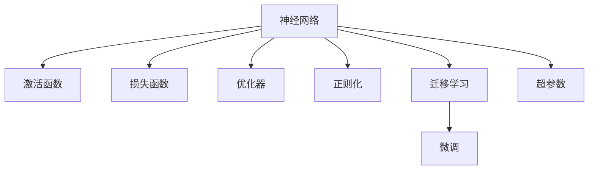

                 

# 神经网络：推动社会进步的力量

## 1. 背景介绍

### 1.1 问题由来
神经网络作为一种模拟生物神经系统运作的计算模型，自20世纪80年代问世以来，已在图像识别、语音识别、自然语言处理、推荐系统等领域取得了令人瞩目的突破。随着计算资源和数据量的快速增长，神经网络的参数量和规模也迅速膨胀，从简单的单层前馈网络到复杂的卷积神经网络、循环神经网络、变分自编码器等结构，展示了其在处理复杂数据和复杂问题上的强大能力。

### 1.2 问题核心关键点
神经网络的核心思想是通过学习大量数据来提取特征和模式，实现数据的自动分类、生成和预测。其核心在于权重矩阵、激活函数、损失函数和优化器等关键组件的设计，以及网络结构的深度和宽度的选择。

神经网络通过不断调整权重矩阵和激活函数来优化预测准确性，使得模型能够适应数据集中的复杂变化和规律。然而，由于其复杂的结构和高维参数空间，神经网络训练常常面临过拟合、计算资源消耗大、泛化能力差等挑战。近年来，通过引入正则化、数据增强、迁移学习等技术，神经网络模型的性能和效率得到了显著提升。

### 1.3 问题研究意义
神经网络的发展不仅是科技领域的进步，更深刻地影响着社会的方方面面。在医疗健康、智能制造、金融保险、教育培训等诸多领域，神经网络技术正被广泛应用，推动着这些行业的变革和进步。神经网络通过自动化数据分析和决策，不仅提高了效率和精确度，还促进了人机协同和智能化的实现。

本文将系统探讨神经网络的原理、结构和应用，深入分析其在社会进步中的作用和挑战，旨在为相关领域的开发者和研究者提供深入的技术见解和实践指导。

## 2. 核心概念与联系

### 2.1 核心概念概述

为更好地理解神经网络，本节将介绍几个密切相关的核心概念：

- 神经网络(Neural Network)：一种由大量神经元相互连接组成的计算模型，用于实现数据处理、特征提取、模式识别等任务。

- 激活函数(Activation Function)：神经元内部的非线性转换函数，通常为Sigmoid、ReLU、Tanh等，用于增强模型的非线性能力。

- 损失函数(Loss Function)：用于衡量模型输出与真实标签之间的差异，常见的有交叉熵损失、均方误差损失等。

- 优化器(Optimizer)：用于更新神经网络参数，使得损失函数最小化的算法，如梯度下降、Adam、Adagrad等。

- 正则化(Regularization)：防止模型过拟合的技术，如L2正则、Dropout、Early Stopping等。

- 迁移学习(Transfer Learning)：通过在一个任务上预训练的模型，直接或微调后在另一个任务上进行应用。

- 超参数(Hyperparameters)：模型训练中需要手动设置的参数，如学习率、批大小、迭代轮数等，对模型性能影响巨大。

这些核心概念之间的逻辑关系可以通过以下Mermaid流程图来展示：



这个流程图展示神经网络的核心概念及其之间的关系：

1. 神经网络通过激活函数、损失函数和优化器实现数据的处理和分类。
2. 正则化技术可以防止模型过拟合。
3. 迁移学习利用预训练模型的知识，提升微调效果。
4. 超参数的选择直接影响模型的训练效果。

## 3. 核心算法原理 & 具体操作步骤

### 3.1 算法原理概述

神经网络的核心思想是通过学习大量数据来提取特征和模式，实现数据的自动分类、生成和预测。其核心在于权重矩阵、激活函数、损失函数和优化器等关键组件的设计，以及网络结构的深度和宽度的选择。

形式化地，假设神经网络模型为 $M_{\theta}:\mathcal{X} \rightarrow \mathcal{Y}$，其中 $\mathcal{X}$ 为输入空间，$\mathcal{Y}$ 为输出空间，$\theta \in \mathbb{R}^d$ 为模型参数。给定训练集 $D=\{(x_i,y_i)\}_{i=1}^N$，训练的目标是找到最优的参数 $\theta^*$，使得：

$$
\theta^* = \mathop{\arg\min}_{\theta} \mathcal{L}(M_{\theta},D)
$$

其中 $\mathcal{L}$ 为针对任务设计的损失函数，用于衡量模型预测输出与真实标签之间的差异。常见的损失函数包括交叉熵损失、均方误差损失等。

通过梯度下降等优化算法，神经网络模型不断调整权重矩阵和激活函数，最小化损失函数，最终得到适应下游任务的优化模型。由于神经网络模型的非线性特性，其表现往往优于简单的线性模型。

### 3.2 算法步骤详解

神经网络模型的训练一般包括以下几个关键步骤：

**Step 1: 准备训练数据和模型结构**
- 收集包含输入特征和输出标签的训练数据集 $D$，划分为训练集、验证集和测试集。
- 选择合适的神经网络结构，包括层数、每层神经元数量、激活函数、损失函数等。

**Step 2: 初始化模型参数**
- 将模型参数 $\theta$ 初始化为随机值，通常从正态分布中采样。
- 设置优化器的初始学习率 $\eta$ 和正则化系数 $\lambda$。

**Step 3: 前向传播和损失计算**
- 将训练数据 $x_i$ 输入模型，计算每个神经元的输出 $z_i$。
- 将 $z_i$ 通过激活函数得到最终预测结果 $\hat{y}_i$。
- 计算预测输出与真实标签 $y_i$ 之间的损失 $L_i$。

**Step 4: 反向传播和参数更新**
- 计算损失函数 $\mathcal{L}$ 对每个参数 $\theta_k$ 的梯度 $\nabla_{\theta_k}\mathcal{L}$。
- 使用优化器更新参数 $\theta_k$，减小损失函数 $\mathcal{L}$。

**Step 5: 评估模型性能**
- 在验证集上评估模型性能，确定是否提前停止训练。
- 在测试集上评估模型性能，评估模型的泛化能力。

以上步骤重复进行，直至模型收敛或达到预设的迭代轮数。

### 3.3 算法优缺点

神经网络在处理复杂数据和任务方面表现优异，但也存在一些局限性：
1. 计算资源需求高：神经网络模型的参数量通常较大，训练过程中需要大量的计算资源。
2. 易过拟合：神经网络模型往往容易在训练数据上过度拟合，泛化能力较差。
3. 黑盒模型：神经网络模型复杂，难以解释其内部决策过程，缺乏可解释性。
4. 训练时间长：神经网络模型通常需要大量数据和计算时间进行训练，训练时间较长。
5. 需要大量数据：神经网络模型往往需要大量标注数据进行训练，数据获取成本较高。

尽管存在这些局限性，但神经网络在图像识别、语音识别、自然语言处理等诸多领域已展现出强大的能力，推动了这些行业的技术进步和应用创新。未来，随着计算资源和算法技术的进一步发展，神经网络将继续发挥其强大的计算潜力，推动更多领域的智能化发展。

### 3.4 算法应用领域

神经网络技术已经广泛应用于以下多个领域：

- 计算机视觉：图像分类、目标检测、人脸识别、视频分析等。
- 自然语言处理：文本分类、机器翻译、情感分析、问答系统等。
- 语音识别：语音转文本、说话人识别、情感识别等。
- 推荐系统：个性化推荐、用户画像、广告投放等。
- 智能制造：工业自动化、智能检测、设备维护等。
- 金融科技：信用评分、风险评估、股票预测等。

此外，神经网络技术还在医疗健康、教育培训、智能家居、智能交通等诸多领域展现出广泛的应用前景，成为推动社会进步的重要力量。

## 4. 数学模型和公式 & 详细讲解 & 举例说明

### 4.1 数学模型构建

本节将使用数学语言对神经网络模型的训练过程进行更加严格的刻画。

假设神经网络模型为 $M_{\theta}:\mathcal{X} \rightarrow \mathcal{Y}$，其中 $\mathcal{X}$ 为输入空间，$\mathcal{Y}$ 为输出空间，$\theta \in \mathbb{R}^d$ 为模型参数。训练集为 $D=\{(x_i,y_i)\}_{i=1}^N$。

定义模型 $M_{\theta}$ 在数据样本 $(x,y)$ 上的损失函数为 $\ell(M_{\theta}(x),y)$，则在数据集 $D$ 上的经验风险为：

$$
\mathcal{L}(\theta) = \frac{1}{N} \sum_{i=1}^N \ell(M_{\theta}(x_i),y_i)
$$

通过梯度下降等优化算法，神经网络模型不断调整参数 $\theta$，最小化损失函数 $\mathcal{L}$，使得模型输出逼近真实标签。

### 4.2 公式推导过程

以二分类任务为例，推导交叉熵损失函数及其梯度的计算公式。

假设模型 $M_{\theta}$ 在输入 $x$ 上的输出为 $\hat{y}=M_{\theta}(x) \in [0,1]$，表示样本属于正类的概率。真实标签 $y \in \{0,1\}$。则二分类交叉熵损失函数定义为：

$$
\ell(M_{\theta}(x),y) = -[y\log \hat{y} + (1-y)\log (1-\hat{y})]
$$

将其代入经验风险公式，得：

$$
\mathcal{L}(\theta) = -\frac{1}{N}\sum_{i=1}^N [y_i\log M_{\theta}(x_i)+(1-y_i)\log(1-M_{\theta}(x_i))]
$$

根据链式法则，损失函数对参数 $\theta_k$ 的梯度为：

$$
\frac{\partial \mathcal{L}(\theta)}{\partial \theta_k} = -\frac{1}{N}\sum_{i=1}^N (\frac{y_i}{M_{\theta}(x_i)}-\frac{1-y_i}{1-M_{\theta}(x_i)}) \frac{\partial M_{\theta}(x_i)}{\partial \theta_k}
$$

其中 $\frac{\partial M_{\theta}(x_i)}{\partial \theta_k}$ 可进一步递归展开，利用自动微分技术完成计算。

### 4.3 案例分析与讲解

以卷积神经网络（CNN）为例，分析其在图像识别任务中的应用。

卷积神经网络通过卷积层、池化层、全连接层等组件，提取输入图像的特征，实现图像分类、目标检测等任务。其核心思想是通过卷积运算捕捉图像中的局部特征，通过池化运算降低特征维度，最终通过全连接层实现分类。

卷积神经网络的数学模型可以表示为：

$$
M_{\theta}(x) = \sigma(W^{1} * x + b^{1}) * \sigma(W^{2} * (\sigma(W^{1} * x + b^{1}) + b^{2}) + b^{3})
$$

其中 $\sigma$ 为激活函数，$W^{1},W^{2},b^{1},b^{2},b^{3}$ 为可学习的参数。

以MNIST手写数字识别任务为例，训练过程中，神经网络模型通过不断调整参数 $W^{1},W^{2},b^{1},b^{2},b^{3}$，最小化损失函数 $\mathcal{L}$，最终得到最优的分类器。通过反向传播算法，计算每个参数的梯度，使用优化器（如Adam）更新参数，逐步逼近最优解。

## 5. 项目实践：代码实例和详细解释说明

### 5.1 开发环境搭建

在进行神经网络项目实践前，我们需要准备好开发环境。以下是使用Python进行TensorFlow开发的环境配置流程：

1. 安装Anaconda：从官网下载并安装Anaconda，用于创建独立的Python环境。

2. 创建并激活虚拟环境：
```bash
conda create -n tf-env python=3.8 
conda activate tf-env
```

3. 安装TensorFlow：根据CUDA版本，从官网获取对应的安装命令。例如：
```bash
conda install tensorflow -c conda-forge
```

4. 安装Keras：Keras是TensorFlow的高层API，简化了神经网络的搭建和训练过程。
```bash
conda install keras
```

5. 安装各类工具包：
```bash
pip install numpy pandas scikit-learn matplotlib tqdm jupyter notebook ipython
```

完成上述步骤后，即可在`tf-env`环境中开始神经网络项目的开发。

### 5.2 源代码详细实现

下面我们以手写数字识别任务为例，给出使用TensorFlow和Keras实现卷积神经网络的PyTorch代码实现。

首先，定义数据预处理函数：

```python
from tensorflow.keras.datasets import mnist
from tensorflow.keras.utils import to_categorical
import numpy as np

def load_data():
    (x_train, y_train), (x_test, y_test) = mnist.load_data()
    x_train = x_train.reshape(-1, 28, 28, 1).astype('float32') / 255.0
    x_test = x_test.reshape(-1, 28, 28, 1).astype('float32') / 255.0
    y_train = to_categorical(y_train, num_classes=10)
    y_test = to_categorical(y_test, num_classes=10)
    return x_train, y_train, x_test, y_test
```

然后，定义神经网络模型：

```python
from tensorflow.keras.models import Sequential
from tensorflow.keras.layers import Conv2D, MaxPooling2D, Flatten, Dense

def create_model():
    model = Sequential()
    model.add(Conv2D(32, (3, 3), activation='relu', input_shape=(28, 28, 1)))
    model.add(MaxPooling2D((2, 2)))
    model.add(Conv2D(64, (3, 3), activation='relu'))
    model.add(MaxPooling2D((2, 2)))
    model.add(Flatten())
    model.add(Dense(64, activation='relu'))
    model.add(Dense(10, activation='softmax'))
    return model
```

接着，定义训练和评估函数：

```python
from tensorflow.keras.optimizers import Adam
from tensorflow.keras.callbacks import EarlyStopping

def compile_model(model, x_train, y_train, x_test, y_test):
    model.compile(optimizer=Adam(lr=0.001), loss='categorical_crossentropy', metrics=['accuracy'])
    history = model.fit(x_train, y_train, batch_size=128, epochs=10, validation_data=(x_test, y_test), callbacks=[EarlyStopping(patience=3)])
    return history
```

最后，启动训练流程并在测试集上评估：

```python
x_train, y_train, x_test, y_test = load_data()
model = create_model()
history = compile_model(model, x_train, y_train, x_test, y_test)
model.evaluate(x_test, y_test)
```

以上就是使用TensorFlow和Keras实现手写数字识别任务卷积神经网络的完整代码实现。可以看到，利用Keras的高层API，神经网络的搭建和训练过程变得简洁高效。

### 5.3 代码解读与分析

让我们再详细解读一下关键代码的实现细节：

**load_data函数**：
- 定义数据加载和预处理函数，使用Keras内置的MNIST数据集，将图像数据转换为浮点数，并进行归一化处理。

**create_model函数**：
- 定义神经网络模型结构，包括卷积层、池化层、全连接层等。

**compile_model函数**：
- 定义模型编译过程，选择合适的优化器、损失函数和评价指标。
- 设置EarlyStopping回调，防止模型过拟合。

**训练流程**：
- 加载和预处理数据。
- 定义和编译模型。
- 训练模型，并在验证集上评估。
- 在测试集上评估模型性能。

可以看到，利用TensorFlow和Keras，神经网络的搭建和训练过程变得简洁高效。开发者可以将更多精力放在数据处理、模型改进等高层逻辑上，而不必过多关注底层的实现细节。

当然，工业级的系统实现还需考虑更多因素，如模型的保存和部署、超参数的自动搜索、模型的微调等。但核心的训练过程基本与此类似。

## 6. 实际应用场景

### 6.1 智能制造

神经网络技术在智能制造领域的应用，主要体现在工业自动化和智能检测两个方面。通过图像识别、视频分析、语音识别等技术，智能制造系统可以实现设备状态监测、故障预测、质量控制等功能，大幅提升生产效率和产品质量。

例如，某智能工厂通过部署卷积神经网络，实现了对生产线上产品的自动分类和质量检测。系统通过摄像头采集产品图像，模型自动识别产品类别、尺寸、颜色等特征，并与标准产品信息进行比对，自动判断产品是否合格，大大提高了检测效率和准确性。

### 6.2 医疗健康

神经网络技术在医疗健康领域的应用，主要体现在医学影像分析、病理检测、药物研发等方面。通过图像分类、目标检测、语义分割等技术，神经网络模型能够自动分析医学图像，辅助医生进行诊断和治疗。

例如，某医院利用卷积神经网络模型，实现了对肺部CT影像的自动分析。模型通过学习大量医学影像数据，自动识别出肺结节、肿瘤等病变区域，并给出相应的治疗建议。这不仅提高了医生的诊断效率，还减少了误诊和漏诊的可能性。

### 6.3 智能交通

神经网络技术在智能交通领域的应用，主要体现在交通监控、智能驾驶、交通流预测等方面。通过图像识别、视频分析、行为预测等技术，神经网络模型能够实时监测交通状况，辅助驾驶决策，提升交通安全和通行效率。

例如，某智慧交通系统通过部署神经网络模型，实现了对实时交通视频的自动分析和识别。系统通过摄像头采集交通视频，模型自动识别出交通信号、行人、车辆等对象，并实时调整信号灯和交通指示，大幅减少了交通拥堵和事故发生率。

### 6.4 未来应用展望

随着神经网络技术的不断进步，其在社会各领域的应用前景将更加广阔。未来，神经网络技术有望在以下方面实现更大突破：

1. 自主学习与自适应：神经网络模型能够通过在线学习，不断从新数据中提取和更新知识，提升模型的自适应能力。

2. 多模态融合：神经网络模型能够整合视觉、语音、文本等多模态信息，实现跨模态的智能交互和决策。

3. 边缘计算与联邦学习：神经网络模型能够在边缘设备上进行实时计算，降低数据传输成本，提升系统响应速度。

4. 低功耗与高效能：神经网络模型能够通过优化算法和硬件架构，实现低功耗和高能效，满足移动设备和大规模部署的需求。

5. 智能推荐与个性化：神经网络模型能够通过分析用户行为和偏好，实现个性化的推荐和个性化服务。

6. 安全与隐私保护：神经网络模型能够通过数据加密和隐私保护技术，确保数据安全和用户隐私。

总之，神经网络技术将继续引领智能化的发展方向，推动社会各领域的智能化转型，为人类社会的进步提供强大的技术支撑。

## 7. 工具和资源推荐

### 7.1 学习资源推荐

为了帮助开发者系统掌握神经网络理论基础和实践技巧，这里推荐一些优质的学习资源：

1. 《深度学习》系列书籍：由Ian Goodfellow、Yoshua Bengio、Aaron Courville合著，系统介绍了深度学习的基本概念、算法和应用。

2. CS231n《卷积神经网络》课程：斯坦福大学开设的计算机视觉经典课程，讲解了卷积神经网络的基本原理和应用。

3. DeepLearning.ai《深度学习专项课程》：由Andrew Ng主讲的深度学习课程，从基础到高级，全面覆盖深度学习知识。

4. PyTorch官方文档：详细介绍了PyTorch框架的使用方法和API，是神经网络开发的重要参考资料。

5. TensorFlow官方文档：介绍了TensorFlow框架的使用方法和API，是神经网络开发的重要参考资料。

通过对这些资源的学习实践，相信你一定能够快速掌握神经网络的精髓，并用于解决实际的机器学习问题。

### 7.2 开发工具推荐

高效的开发离不开优秀的工具支持。以下是几款用于神经网络开发的常用工具：

1. PyTorch：基于Python的开源深度学习框架，灵活动态的计算图，适合快速迭代研究。

2. TensorFlow：由Google主导开发的开源深度学习框架，生产部署方便，适合大规模工程应用。

3. Keras：Keras是TensorFlow的高层API，简化了神经网络的搭建和训练过程，适合快速原型开发。

4. Jupyter Notebook：一个基于Web的交互式开发环境，支持Python、R、Julia等多种语言，适合快速原型开发和调试。

5. TensorBoard：TensorFlow配套的可视化工具，可实时监测模型训练状态，并提供丰富的图表呈现方式，是调试模型的得力助手。

6. Weights & Biases：模型训练的实验跟踪工具，可以记录和可视化模型训练过程中的各项指标，方便对比和调优。

合理利用这些工具，可以显著提升神经网络项目的开发效率，加快创新迭代的步伐。

### 7.3 相关论文推荐

神经网络技术的发展源于学界的持续研究。以下是几篇奠基性的相关论文，推荐阅读：

1. A Survey of Convolutional Neural Networks（卷积神经网络综述）：由S. N. Mishra等人撰写，全面介绍了卷积神经网络的发展历程、结构设计、训练方法等。

2. ImageNet Classification with Deep Convolutional Neural Networks（使用深度卷积神经网络进行图像分类）：由A. Krizhevsky等人撰写，展示了深度卷积神经网络在图像分类任务上的优异表现。

3. Explaining and Harnessing Adversarial Examples（解释和利用对抗性示例）：由I. Goodfellow等人撰写，探讨了对抗性示例对神经网络的影响和防御方法。

4. Learning Deep Architectures for AI（构建深度架构以实现人工智能）：由Y. Bengio等人撰写，阐述了深度神经网络在实现人工智能中的重要性和挑战。

5. Learning Transferable Features with Deep Adversarial Networks（使用深度对抗网络学习可转移特征）：由D. Mhaskar等人撰写，提出了深度对抗网络，增强神经网络的泛化能力和鲁棒性。

这些论文代表了大规模神经网络的发展脉络，为神经网络技术的发展提供了理论支持。

## 8. 总结：未来发展趋势与挑战

### 8.1 总结

本文对神经网络的原理、结构和应用进行了全面系统的介绍。首先阐述了神经网络的基本概念和核心组件，明确了神经网络在处理复杂数据和任务上的强大能力。其次，从原理到实践，详细讲解了神经网络的训练过程，给出了完整的代码实现，帮助读者深入理解神经网络的实现细节。同时，本文还探讨了神经网络在各个行业领域的应用，展示了神经网络技术推动社会进步的潜力。

通过本文的系统梳理，可以看到，神经网络技术不仅在科技领域具有重要意义，更深刻地影响着社会的方方面面。神经网络通过自动化数据分析和决策，提高了效率和精确度，推动了人机协同和智能化的实现，为社会进步提供了强大的技术支撑。

### 8.2 未来发展趋势

展望未来，神经网络技术将呈现以下几个发展趋势：

1. 模型规模持续增大。随着计算资源和数据量的不断增长，神经网络模型的参数量将持续增加，处理能力将大幅提升。

2. 训练方法不断优化。未来将涌现更多高效的训练算法和优化器，如自适应学习率、对抗训练等，提高神经网络模型的泛化能力和鲁棒性。

3. 多模态融合成为常态。未来神经网络模型将更加注重跨模态信息的融合，实现视觉、语音、文本等多模态信息的协同建模。

4. 端到端训练成为主流。未来将出现更多端到端的训练方法，简化神经网络模型的训练过程，降低对人工干预的依赖。

5. 联邦学习和边缘计算普及。未来将有更多场景使用联邦学习和边缘计算，降低数据传输成本，提升模型训练效率。

6. 个性化推荐与智能推荐成为热点。未来神经网络模型将更多应用于个性化推荐和智能推荐，提升用户体验。

7. 数据隐私和安全保护备受关注。未来神经网络模型将更加注重数据隐私和安全保护，确保用户数据和模型安全。

这些趋势凸显了神经网络技术的广阔前景。未来神经网络技术将继续引领智能化的发展方向，推动更多领域的智能化转型，为人类社会的进步提供强大的技术支撑。

### 8.3 面临的挑战

尽管神经网络技术已经取得了巨大的成功，但在迈向更加智能化、普适化应用的过程中，仍面临诸多挑战：

1. 计算资源需求高。神经网络模型的参数量通常较大，训练过程中需要大量的计算资源，对硬件设备提出了高要求。

2. 过拟合问题严重。神经网络模型往往容易在训练数据上过度拟合，泛化能力较差，需要采取正则化等技术进行缓解。

3. 模型复杂度高。神经网络模型的结构复杂，难以解释其内部决策过程，缺乏可解释性，增加了模型的调试和维护难度。

4. 数据获取成本高。神经网络模型需要大量的标注数据进行训练，标注数据获取成本高，数据质量难以保证。

5. 伦理和安全问题。神经网络模型可能学习到有害的偏见和信息，给社会带来安全隐患，如何确保模型的公平性和安全性，还需要更多的研究和实践。

6. 部署和维护难度大。神经网络模型在生产环境中的部署和维护，需要考虑模型的存储、推理速度、硬件兼容性等问题，增加了系统的复杂度。

总之，尽管神经网络技术取得了诸多成功，但仍需在数据、算法、硬件、伦理等方面不断优化和改进，才能更好地服务于社会各领域，推动社会的进步和发展。

### 8.4 研究展望

未来，神经网络技术需要在以下几个方面进行更深入的研究和探索：

1. 更加高效的训练算法。未来将涌现更多高效的训练算法和优化器，如自适应学习率、对抗训练等，提高神经网络模型的泛化能力和鲁棒性。

2. 更好的模型解释性和可解释性。未来将开发更多可解释性强的神经网络模型，如决策树、规则学习等，增强模型的可解释性和透明度。

3. 更加智能化的多模态融合。未来将更多应用多模态融合技术，实现视觉、语音、文本等多模态信息的协同建模，提高模型的综合能力。

4. 更加普适化的迁移学习。未来将更多应用迁移学习技术，减少对大规模标注数据的依赖，提升模型的跨领域迁移能力。

5. 更加安全和公平的模型设计。未来将更多关注神经网络模型的伦理和安全性问题，开发更加公平、安全的模型，确保模型的公平性和安全性。

6. 更加轻量化的模型压缩。未来将更多应用模型压缩技术，如量化、剪枝等，提高神经网络模型的计算效率和资源利用率。

7. 更加高效的联邦学习和边缘计算。未来将更多应用联邦学习和边缘计算技术，降低数据传输成本，提升模型训练效率。

通过这些研究方向的研究和探索，神经网络技术将继续引领智能化的发展方向，推动更多领域的智能化转型，为人类社会的进步提供强大的技术支撑。

## 9. 附录：常见问题与解答

**Q1：神经网络在处理图像数据时，通常使用哪种类型的神经网络？**

A: 神经网络在处理图像数据时，通常使用卷积神经网络（CNN）。CNN通过卷积层、池化层等组件，提取输入图像的特征，实现图像分类、目标检测等任务。

**Q2：神经网络中的损失函数和优化器对模型性能有什么影响？**

A: 损失函数和优化器对神经网络模型的性能影响巨大。不同的损失函数适用于不同的任务，如交叉熵损失适用于分类任务，均方误差损失适用于回归任务。不同的优化器也有不同的特性，如Adam优化器适用于大规模数据集，SGD优化器适用于小型数据集。选择合适的损失函数和优化器，可以显著提升模型的训练效果和泛化能力。

**Q3：神经网络中的正则化技术有什么作用？**

A: 正则化技术可以防止神经网络模型在训练过程中过拟合，提升模型的泛化能力。常见的正则化技术包括L2正则、Dropout、Early Stopping等，通过限制模型参数的大小、随机删除部分神经元、提前停止训练等方式，减少模型对训练数据的依赖，增强模型的泛化能力。

**Q4：神经网络模型在实际应用中需要注意哪些问题？**

A: 神经网络模型在实际应用中需要注意以下问题：
1. 模型压缩和优化：神经网络模型的参数量通常较大，需要考虑模型压缩和优化，提高模型的计算效率和资源利用率。
2. 数据隐私和安全：神经网络模型需要处理大量数据，如何确保数据隐私和安全，防止数据泄露和滥用，是重要问题。
3. 模型解释和可解释性：神经网络模型往往难以解释其内部决策过程，如何增强模型的解释性和可解释性，是重要问题。
4. 跨平台和跨设备兼容性：神经网络模型需要在不同平台和设备上运行，如何保证跨平台和跨设备兼容性，是重要问题。
5. 模型部署和维护：神经网络模型在生产环境中的部署和维护，需要考虑模型的存储、推理速度、硬件兼容性等问题，是重要问题。

通过合理设计和使用神经网络模型，可以解决上述问题，提升模型的实际应用效果。

**Q5：神经网络模型在图像识别任务中通常使用哪些层？**

A: 神经网络模型在图像识别任务中通常使用卷积层、池化层、全连接层等组件。卷积层通过卷积操作提取图像的局部特征，池化层通过池化操作降低特征维度，全连接层通过分类操作实现最终的分类。

总之，神经网络技术将继续引领智能化的发展方向，推动更多领域的智能化转型，为人类社会的进步提供强大的技术支撑。面对未来的挑战和机遇，神经网络技术的持续研究和优化，将是推动社会进步的重要力量。

