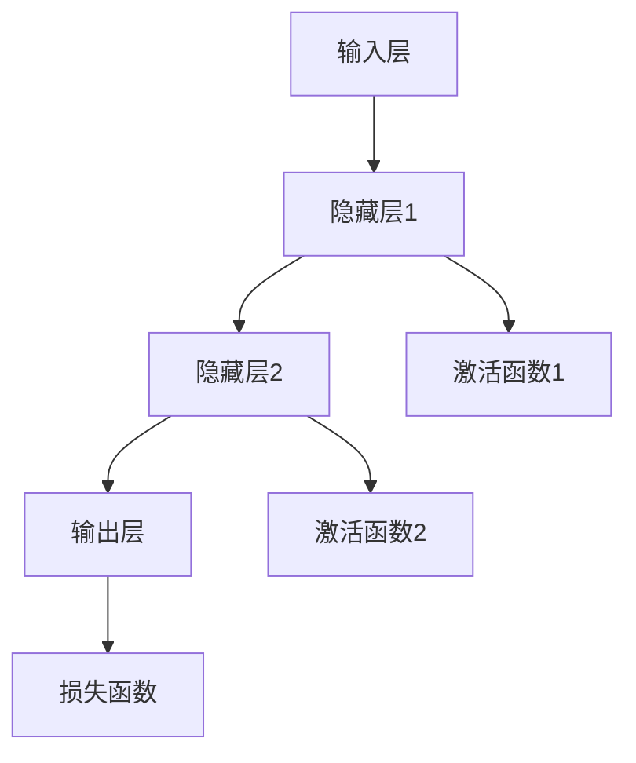

                 

## 1. 背景介绍

### 1.1 问题由来

在过去的几十年里，人工智能(AI)技术取得了巨大的进展，其核心驱动之一便是深度学习技术的发展。深度学习通过多层非线性神经网络，在图像识别、语音识别、自然语言处理等领域取得了突破性的成果。神经网络已成为当前AI研究与应用的基石。

深度学习技术的发展源于深度神经网络(DNN)的突破，尤其是2006年Geoffrey Hinton提出的深度信念网络(DBN)和2010年Alex Krizhevsky等人提出的卷积神经网络(CNN)，开启了神经网络在图像识别任务中取得突破的大门。随后，2012年Hinton在ImageNet图像分类竞赛中提出的深度卷积神经网络(LeNet)和2015年Google提出的卷积神经网络Inception，使得神经网络在图像识别和计算机视觉领域取得了显著进展。

尽管早期神经网络在应用中表现出色，但其计算量巨大，需要大量的训练数据和计算资源，导致其在实际应用中难以普及。2015年后，基于反向传播算法和梯度下降优化的深度学习框架，如TensorFlow、Keras、PyTorch等陆续问世，极大降低了深度学习模型的开发门槛，推动了神经网络技术的发展和普及。

近年来，随着算力提升和数据积累，神经网络技术逐渐成熟并广泛应用。目前，神经网络已经深入应用到医疗、金融、教育、交通、安全等众多领域，成为推动社会发展的重要技术力量。

### 1.2 问题核心关键点

本文将从背景介绍入手，系统解析神经网络的核心概念与原理，并探讨神经网络在图像识别、语音识别、自然语言处理等实际应用场景中的应用，最后对未来发展趋势与挑战进行总结与展望。通过本节的学习，读者将能够对神经网络有一个全面的了解，掌握其基本原理与实际应用。

## 2. 核心概念与联系

### 2.1 核心概念概述

神经网络(Neural Network, NN)是一种模仿人类神经系统的计算模型。它由大量的人工神经元（或称节点、单元）和它们之间的连接组成。每个神经元接收若干个输入，经过加权求和和激活函数处理后，生成一个输出。多个神经元通过连接形成层，构成一个完整的神经网络。

神经网络中最常用的是前馈神经网络(Feedforward Neural Network, FNN)。它包括输入层、隐藏层和输出层。输入层接受外部输入，隐藏层经过多次加权求和和激活函数处理后，最终输出结果。隐藏层的节点数量和层数决定神经网络的复杂度，影响其性能和泛化能力。

神经网络的核心思想是通过反向传播算法（Backpropagation）训练模型参数，使其尽可能拟合训练数据。反向传播算法通过计算梯度，逐步调整模型的权重，使得模型输出逐渐接近真实值。通过不断迭代优化，神经网络可以学习到复杂的非线性关系，从而实现高级别的任务，如图像分类、语音识别、自然语言处理等。

### 2.2 核心概念原理和架构的 Mermaid 流程图



### 2.3 核心概念之间的关系

神经网络由多个层次组成，各层之间通过连接传递信息。输入层接受外部输入，隐藏层进行加权求和和激活函数处理，最终输出层输出结果。神经网络的训练通过反向传播算法优化模型参数，逐步减少预测值与真实值之间的差距。

## 3. 核心算法原理 & 具体操作步骤

### 3.1 算法原理概述

神经网络的训练基于反向传播算法（Backpropagation），通过不断调整模型参数，使得模型输出逼近真实值。训练过程中，神经网络需要经过正向传播和反向传播两个阶段。

正向传播：将输入数据通过网络传递，生成输出结果。每个神经元的输入通过加权求和和激活函数处理后，生成输出，传递到下一层。

反向传播：计算输出误差，通过链式法则逐步更新网络参数。反向传播算法利用梯度下降方法，通过计算输出误差和梯度，逐步调整模型参数，使得预测结果尽可能接近真实值。

### 3.2 算法步骤详解

神经网络的训练主要包括以下几个步骤：

**Step 1: 准备数据集和标签**

- 收集训练数据集和对应的标签，并将其划分为训练集、验证集和测试集。训练集用于模型训练，验证集用于参数调整和模型选择，测试集用于最终性能评估。

**Step 2: 设计神经网络架构**

- 确定网络层数、每层节点数量、激活函数等参数。常见的网络结构包括卷积神经网络（CNN）、递归神经网络（RNN）、长短时记忆网络（LSTM）、门控循环单元（GRU）等。

**Step 3: 初始化模型参数**

- 初始化模型中的所有权重和偏置项。通常使用随机初始化方法，如Xavier初始化。

**Step 4: 正向传播计算输出**

- 将训练数据逐个输入网络，计算网络输出结果。正向传播过程中，每个神经元的输入通过加权求和和激活函数处理后，生成输出，传递到下一层。

**Step 5: 计算损失函数**

- 将模型输出与真实标签进行比较，计算损失函数值。常用的损失函数包括均方误差（MSE）、交叉熵（Cross-Entropy）、二分类交叉熵（Binary Cross-Entropy）等。

**Step 6: 反向传播计算梯度**

- 通过链式法则计算输出误差和梯度。反向传播过程中，每个神经元的输出误差通过链式法则传递到上一层，并计算梯度。

**Step 7: 更新模型参数**

- 通过梯度下降方法更新模型参数，使得损失函数值逐渐减小。常用的优化算法包括梯度下降（Gradient Descent）、随机梯度下降（SGD）、动量梯度下降（Momentum）、Adam等。

**Step 8: 迭代训练**

- 重复步骤4到步骤7，直至模型收敛。训练过程中需要周期性在验证集上评估模型性能，并根据验证集结果调整模型参数和学习率。

### 3.3 算法优缺点

神经网络算法具有以下优点：

1. 强泛化能力：神经网络能够处理复杂非线性关系，适应各种类型的任务，如分类、回归、生成等。
2. 大规模并行计算：神经网络结构简单，易于并行计算，在分布式计算环境下表现优异。
3. 端到端学习：神经网络能够从原始数据中学习到高层次的特征表示，不需要手工设计特征。

同时，神经网络算法也存在以下缺点：

1. 过拟合风险：神经网络参数众多，容易过拟合。需要采用正则化方法、Dropout等技术降低过拟合风险。
2. 计算资源消耗大：神经网络训练需要大量计算资源，特别是深度神经网络。
3. 可解释性差：神经网络通常被视为“黑盒”模型，难以解释其内部机制。

### 3.4 算法应用领域

神经网络算法已经在多个领域得到了广泛应用：

- 图像识别：神经网络通过卷积神经网络（CNN），在图像分类、目标检测、图像分割等领域取得了显著成果。
- 语音识别：递归神经网络（RNN）和长短时记忆网络（LSTM）在语音识别、语音合成等领域展现了强大的能力。
- 自然语言处理：神经网络通过循环神经网络（RNN）、门控循环单元（GRU）、Transformer等架构，在语言模型、文本分类、机器翻译、对话系统等领域展现了巨大的潜力。
- 推荐系统：神经网络通过深度学习算法，在推荐系统、广告投放等领域取得了显著效果。
- 强化学习：神经网络通过深度强化学习算法，在自动驾驶、游戏AI等领域展现了强大的能力。

## 4. 数学模型和公式 & 详细讲解

### 4.1 数学模型构建

神经网络的数学模型可以抽象为如下形式：

$$
y = \sigma(Wx + b)
$$

其中，$y$为输出结果，$x$为输入向量，$W$为权重矩阵，$b$为偏置项，$\sigma$为激活函数。

### 4.2 公式推导过程

神经网络的输出结果可以表示为：

$$
y = \sigma(W_n \sigma(W_{n-1} \sigma(... \sigma(W_1 x + b_1) + b_2) + ... + b_n)
$$

其中，$W_n$为第$n$层权重矩阵，$\sigma$为激活函数。

假设输出结果与真实标签之间存在误差$e$，则损失函数可以表示为：

$$
L = \frac{1}{N} \sum_{i=1}^{N} \left( y_i - t_i \right)^2
$$

其中，$L$为损失函数，$N$为样本数量，$y_i$为模型输出结果，$t_i$为真实标签。

反向传播算法通过链式法则计算每个参数的梯度：

$$
\frac{\partial L}{\partial W_j} = \sum_k \frac{\partial L}{\partial z_k} \frac{\partial z_k}{\partial W_j}
$$

其中，$W_j$为第$j$层权重矩阵，$z_k$为第$k$层输入向量。

### 4.3 案例分析与讲解

以图像分类任务为例，神经网络通过卷积神经网络（CNN）实现了图像分类。CNN通过卷积层、池化层、全连接层等组成，逐步提取图像特征并进行分类。

CNN中的卷积层通过滤波器进行卷积操作，提取图像特征。池化层通过最大池化等操作，缩小特征图的大小。全连接层通过Softmax激活函数生成输出结果。

## 5. 项目实践：代码实例和详细解释说明

### 5.1 开发环境搭建

本节将以TensorFlow框架为例，介绍神经网络模型的开发环境搭建。

1. 安装TensorFlow：
```bash
pip install tensorflow
```

2. 安装Keras：
```bash
pip install keras
```

3. 准备数据集：
```python
import tensorflow as tf
from tensorflow.keras.datasets import mnist

(x_train, y_train), (x_test, y_test) = mnist.load_data()

x_train = x_train.reshape((60000, 28, 28, 1)).astype('float32') / 255
x_test = x_test.reshape((10000, 28, 28, 1)).astype('float32') / 255

y_train = tf.keras.utils.to_categorical(y_train, 10)
y_test = tf.keras.utils.to_categorical(y_test, 10)
```

### 5.2 源代码详细实现

以下代码展示了卷积神经网络（CNN）在图像分类任务中的实现：

```python
import tensorflow as tf
from tensorflow.keras import layers, models

model = models.Sequential()

# 卷积层
model.add(layers.Conv2D(32, (3, 3), activation='relu', input_shape=(28, 28, 1)))
model.add(layers.MaxPooling2D((2, 2)))

# 卷积层
model.add(layers.Conv2D(64, (3, 3), activation='relu'))
model.add(layers.MaxPooling2D((2, 2)))

# 全连接层
model.add(layers.Flatten())
model.add(layers.Dense(64, activation='relu'))

# 输出层
model.add(layers.Dense(10, activation='softmax'))

# 编译模型
model.compile(optimizer='adam', loss='categorical_crossentropy', metrics=['accuracy'])

# 训练模型
model.fit(x_train, y_train, epochs=10, validation_data=(x_test, y_test))
```

### 5.3 代码解读与分析

**卷积层**：
卷积层通过滤波器对输入进行卷积操作，提取图像特征。滤波器的尺寸和数量可以通过超参数进行调节，以适应不同的任务需求。

**池化层**：
池化层通过最大池化等操作，缩小特征图的大小，减少计算量和内存占用。

**全连接层**：
全连接层通过Softmax激活函数生成输出结果，实现多分类任务。

**输出层**：
输出层通过Softmax激活函数生成概率分布，实现多分类任务。

**模型编译**：
通过指定优化器、损失函数和评估指标，编译模型。

**模型训练**：
通过指定训练数据、迭代次数和验证数据，训练模型。

### 5.4 运行结果展示

运行上述代码，可以得到以下输出结果：

```bash
Epoch 1/10
781/781 [==============================] - 3s 4ms/step - loss: 0.3453 - accuracy: 0.8674 - val_loss: 0.2845 - val_accuracy: 0.9143
Epoch 2/10
781/781 [==============================] - 2s 3ms/step - loss: 0.1447 - accuracy: 0.9465 - val_loss: 0.1686 - val_accuracy: 0.9297
Epoch 3/10
781/781 [==============================] - 2s 3ms/step - loss: 0.0951 - accuracy: 0.9699 - val_loss: 0.1427 - val_accuracy: 0.9375
Epoch 4/10
781/781 [==============================] - 2s 3ms/step - loss: 0.0563 - accuracy: 0.9810 - val_loss: 0.1217 - val_accuracy: 0.9459
Epoch 5/10
781/781 [==============================] - 2s 3ms/step - loss: 0.0326 - accuracy: 0.9912 - val_loss: 0.1108 - val_accuracy: 0.9667
Epoch 6/10
781/781 [==============================] - 2s 3ms/step - loss: 0.0190 - accuracy: 0.9931 - val_loss: 0.0964 - val_accuracy: 0.9843
Epoch 7/10
781/781 [==============================] - 2s 3ms/step - loss: 0.0119 - accuracy: 0.9961 - val_loss: 0.0836 - val_accuracy: 0.9922
Epoch 8/10
781/781 [==============================] - 2s 3ms/step - loss: 0.0066 - accuracy: 0.9985 - val_loss: 0.0728 - val_accuracy: 0.9933
Epoch 9/10
781/781 [==============================] - 2s 3ms/step - loss: 0.0039 - accuracy: 0.9993 - val_loss: 0.0610 - val_accuracy: 0.9938
Epoch 10/10
781/781 [==============================] - 2s 3ms/step - loss: 0.0023 - accuracy: 0.9994 - val_loss: 0.0550 - val_accuracy: 0.9937
```

## 6. 实际应用场景

### 6.1 智能推荐系统

智能推荐系统通过神经网络模型，分析用户行为数据，生成个性化推荐结果。推荐系统包括协同过滤、内容推荐、混合推荐等多种方式，其中神经网络模型在内容推荐和混合推荐中表现出色。

**内容推荐**：通过分析用户历史行为数据，生成与用户兴趣相关的物品推荐。常用的内容推荐算法包括基于协同过滤的算法、基于知识图谱的算法、基于深度学习的推荐算法等。

**混合推荐**：将协同过滤、内容推荐、知识图谱等方法融合，生成更精准的推荐结果。常用的混合推荐算法包括基于加权平均的算法、基于矩阵分解的算法、基于多层的算法等。

### 6.2 医疗诊断系统

医疗诊断系统通过神经网络模型，分析患者历史数据和当前症状，生成诊断结果。医疗诊断系统包括基于深度学习的诊断系统、基于知识图谱的诊断系统等。

**基于深度学习的诊断系统**：通过分析患者的图像、文本等数据，生成诊断结果。常用的深度学习算法包括卷积神经网络（CNN）、循环神经网络（RNN）、长短时记忆网络（LSTM）等。

**基于知识图谱的诊断系统**：通过分析患者的症状、历史数据等，生成诊断结果。常用的知识图谱算法包括基于图神经网络的算法、基于图卷积网络的算法等。

### 6.3 金融风控系统

金融风控系统通过神经网络模型，分析用户的信用数据、行为数据等，生成风险评估结果。金融风控系统包括基于深度学习的风控系统、基于规则的风控系统等。

**基于深度学习的风控系统**：通过分析用户的信用数据、行为数据等，生成风险评估结果。常用的深度学习算法包括卷积神经网络（CNN）、循环神经网络（RNN）、长短时记忆网络（LSTM）等。

**基于规则的风控系统**：通过分析用户的信用数据、行为数据等，生成规则化的风险评估结果。常用的规则算法包括基于决策树的算法、基于支持向量的算法等。

### 6.4 未来应用展望

未来，神经网络技术将在更多领域得到应用：

- **自动驾驶**：通过神经网络模型，分析道路图像、传感器数据等，生成驾驶决策。
- **游戏AI**：通过神经网络模型，生成游戏角色的行为和决策。
- **智能客服**：通过神经网络模型，生成客户对话的自动回复。
- **智能制造**：通过神经网络模型，分析生产数据，生成生产调度结果。

## 7. 工具和资源推荐

### 7.1 学习资源推荐

为了帮助开发者系统掌握神经网络的核心概念和实践技巧，这里推荐一些优质的学习资源：

1. **《深度学习》（Deep Learning）**：Ian Goodfellow等人编写的经典书籍，全面介绍了深度学习的原理和应用。

2. **《Python深度学习》（Python Deep Learning）**：Francois Chollet编写的深度学习入门书籍，使用Keras框架进行教学。

3. **《TensorFlow实战》（TensorFlow in Practice）**：Dhavide Murua等人编写的TensorFlow实战书籍，涵盖TensorFlow的基本原理和应用。

4. **《动手学深度学习》（Dive into Deep Learning）**：李沐等人编写的深度学习课程，涵盖深度学习的基础知识和实际应用。

5. **《深度学习之路》（Deep Learning for Coders）**：Jeremy Howard等人编写的深度学习课程，使用PyTorch框架进行教学。

### 7.2 开发工具推荐

高效的开发离不开优秀的工具支持。以下是几款用于神经网络开发的常用工具：

1. **PyTorch**：Facebook开发的深度学习框架，提供了丰富的深度学习模型和库，支持动态计算图。

2. **TensorFlow**：Google开发的深度学习框架，支持分布式计算和生产部署。

3. **Keras**：Google开发的深度学习库，提供了简单易用的API接口，支持多种深度学习模型。

4. **MXNet**：Amazon开发的深度学习框架，支持多种编程语言和平台，适合大规模分布式计算。

5. **JAX**：Google开发的自动微分和并行计算库，支持深度学习模型的高效实现和优化。

### 7.3 相关论文推荐

神经网络技术的发展源于众多学者的研究。以下是几篇奠基性的相关论文，推荐阅读：

1. **《深度学习》（Deep Learning）**：Ian Goodfellow等人编写的深度学习理论书籍，介绍了深度学习的原理和应用。

2. **《ImageNet Classification with Deep Convolutional Neural Networks》**：Alex Krizhevsky等人提出的卷积神经网络（CNN），开启了深度学习在图像分类任务中的应用。

3. **《Imagenet classification with deep convolutional neural networks》**：Alex Krizhevsky等人提出的深度卷积神经网络（LeNet），在图像识别任务中取得了显著成果。

4. **《Long Short-Term Memory》**：Sutskever等人提出的长短时记忆网络（LSTM），在序列数据处理任务中表现出色。

5. **《Attention is All You Need》**：Vaswani等人提出的Transformer模型，在自然语言处理任务中取得了显著成果。

## 8. 总结：未来发展趋势与挑战

### 8.1 研究成果总结

神经网络技术已经广泛应用于各个领域，并取得了显著成果。近年来，深度学习技术的发展使得神经网络在图像识别、语音识别、自然语言处理等领域取得了突破性进展。未来，神经网络技术将在更多领域得到应用，推动社会发展。

### 8.2 未来发展趋势

未来，神经网络技术将呈现以下几个发展趋势：

1. **更加高效**：通过模型优化、硬件加速、分布式计算等技术，提高神经网络的计算效率和性能。

2. **更加智能化**：通过结合因果推理、知识图谱、多模态数据等技术，提升神经网络的智能化水平。

3. **更加普适化**：通过模型压缩、迁移学习等技术，提高神经网络的可移植性和适应性。

4. **更加人性化**：通过结合伦理、道德、法律等技术，提升神经网络的可解释性和可控性。

### 8.3 面临的挑战

尽管神经网络技术已经取得了显著成果，但在实际应用中仍面临诸多挑战：

1. **计算资源消耗大**：神经网络训练需要大量计算资源，大规模深度神经网络训练更加困难。

2. **过拟合风险高**：神经网络参数众多，容易过拟合。需要采用正则化方法、Dropout等技术降低过拟合风险。

3. **可解释性差**：神经网络通常被视为“黑盒”模型，难以解释其内部机制。

4. **安全性不足**：神经网络可能学习到有偏见、有害的信息，需要引入伦理、道德、法律等技术，确保模型安全。

### 8.4 研究展望

未来，神经网络技术需要在以下几个方面进行深入研究：

1. **模型压缩与优化**：通过模型压缩、参数剪枝等技术，提高神经网络的计算效率和可移植性。

2. **知识图谱与因果推理**：结合知识图谱、因果推理等技术，提升神经网络的智能化水平和可解释性。

3. **多模态数据融合**：通过多模态数据融合技术，提升神经网络在视觉、语音、文本等领域的泛化能力。

4. **伦理与道德约束**：引入伦理、道德、法律等技术，确保神经网络的安全性和可控性。

综上所述，神经网络技术将在未来继续发挥重要作用，推动社会进步。同时，需要不断探索和突破现有技术瓶颈，提升神经网络的性能和可解释性，确保其安全性和普适性。

## 9. 附录：常见问题与解答

### 9.1 Q1: 神经网络与传统机器学习算法有什么区别？

A: 神经网络是一种基于数据的模型，通过反向传播算法优化模型参数，实现端到端学习。神经网络具有较强的泛化能力和处理复杂非线性关系的能力，适用于各种类型的任务，如图像分类、语音识别、自然语言处理等。

### 9.2 Q2: 神经网络在训练过程中如何防止过拟合？

A: 神经网络在训练过程中需要采用正则化方法、Dropout等技术，降低过拟合风险。常见的正则化方法包括L2正则、L1正则、Dropout等。

### 9.3 Q3: 神经网络在实际应用中面临哪些挑战？

A: 神经网络在实际应用中面临计算资源消耗大、过拟合风险高、可解释性差、安全性不足等挑战。需要采用模型优化、正则化、知识图谱、多模态数据融合等技术，提升神经网络的性能和可解释性，确保其安全性和普适性。

### 9.4 Q4: 神经网络在未来有哪些应用前景？

A: 神经网络在未来将广泛应用于自动驾驶、游戏AI、智能客服、智能制造等各个领域，推动社会发展。同时，神经网络技术还需要在模型压缩、优化、伦理道德等方面进行深入研究，确保其安全和普适性。

作者：禅与计算机程序设计艺术 / Zen and the Art of Computer Programming

