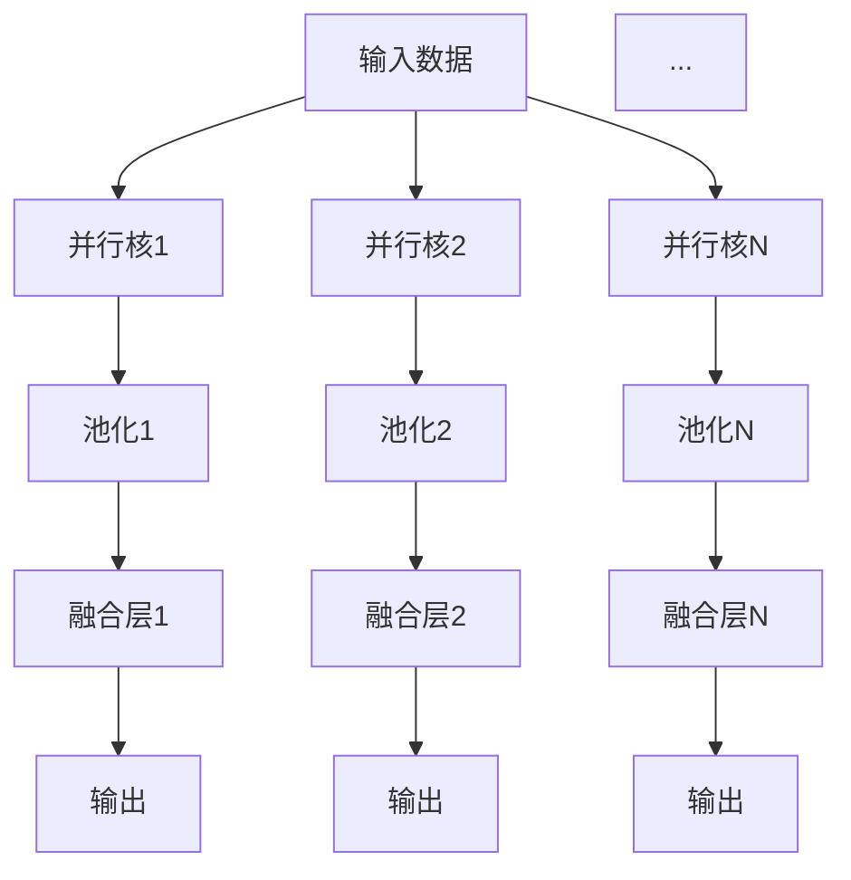

                 

## 1. 背景介绍

### 1.1 问题由来
在过去的几十年中，机器学习(ML)技术经历了从简单的统计学习到复杂的深度学习的演变。随着深度神经网络(DNN)的兴起，机器学习进入了一个新的发展阶段。神经网络不仅在计算机视觉、自然语言处理、语音识别等诸多领域取得了突破，更在图像识别、自动驾驶、智能推荐等实际应用中大放异彩。

神经网络之所以能够取得如此显著的成就，很大程度上得益于其强大的表达能力和泛化能力。但传统的神经网络范式，也存在一定的局限性：

- **计算资源消耗巨大**：DNN需要大量的计算资源进行训练和推理，对硬件设备的要求较高。
- **依赖大量标注数据**：DNN的训练过程需要大量标注数据，获取高质量标注数据的时间和成本较高。
- **泛化能力有限**：DNN依赖于数据分布的一致性，在数据分布变化时，模型的泛化能力会显著下降。
- **黑盒模型难以解释**：神经网络通常被称为"黑盒"模型，难以对其内部决策过程进行解释和调试。

因此，近年来，研究者们开始探索神经网络的新范式，希望通过优化和改进，使得神经网络在计算效率、数据需求、泛化能力、可解释性等方面取得更大的突破。其中，**神经网络的新范式**——**N×P网络**，成为了一个备受关注的热点研究方向。

## 2. 核心概念与联系

### 2.1 核心概念概述

为了深入理解N×P网络，首先需要明确几个关键概念：

- **神经网络**：由神经元(即节点)组成，通过连接权重传递信息，进行信号处理的计算图。常见的神经网络包括全连接网络、卷积网络、循环网络等。
- **深度学习**：一种基于多层神经网络的机器学习方法，通过逐层抽象和特征提取，学习复杂数据表征。深度学习算法包括反向传播、梯度下降、随机梯度下降等。
- **泛化能力**：模型在新数据上表现与在训练数据上表现的相似程度，泛化能力强的模型能够更好地适应未知数据。
- **可解释性**：模型决策的透明程度，可解释性强的模型易于理解和调试。

N×P网络是一种新型的神经网络结构，由N个并行的基本神经网络模块(即P个并行核)构成，每个核独立进行特征提取和变换，最终通过池化操作将特征信息进行融合。这种结构可以显著提高神经网络的计算效率、泛化能力和可解释性。

### 2.2 核心概念原理和架构的 Mermaid 流程图

以下是一个简化的N×P网络的示意图：



其中，A表示输入数据，B、C、...、N表示N个并行核，D、E、...、F表示N个池化层，G、H、...、I表示N个融合层，J、K、...、L表示N个输出节点。这种并行结构不仅提高了计算效率，还增强了模型的泛化能力和可解释性。

## 3. 核心算法原理 & 具体操作步骤

### 3.1 算法原理概述

N×P网络的算法原理可以概括为以下几点：

1. **并行核结构**：N个并行核独立处理输入数据，同时提取不同特征，通过并行计算提高效率。
2. **池化操作**：每个核使用池化层对提取的特征进行降维和抽象，增强特征泛化能力。
3. **融合操作**：N个融合层将并行核输出的特征进行融合，形成最终输出，增强模型的表达能力。

N×P网络的核心思想是通过并行和池化操作，将传统神经网络的单向信息传递转变为双向、多层次的特征提取和融合，从而提高模型的计算效率和泛化能力。

### 3.2 算法步骤详解

下面以一个简单的N×P网络为例，详细讲解其操作步骤：

1. **输入数据预处理**：将输入数据标准化为固定长度，并进行必要的填充和截断。
2. **并行核处理**：将输入数据分别输入到N个并行核，每个核独立提取不同特征。
3. **池化操作**：每个核使用池化层对提取的特征进行降维和抽象，增强特征泛化能力。
4. **融合操作**：N个融合层将并行核输出的特征进行融合，形成最终输出。
5. **输出层计算**：将融合后的特征输入到输出层，通过全连接或卷积操作进行最终的分类或回归。

以下是N×P网络的详细步骤：

1. **输入数据预处理**：

   ```python
   def preprocessing(data):
       # 数据标准化
       data = (data - data.mean()) / data.std()
       # 填充和截断
       data = pad_sequence(data, maxlen=max_length, padding_value=0)
       return data
   ```

2. **并行核处理**：

   ```python
   def parallel_core(data, core_count):
       cores = []
       for i in range(core_count):
           core = nn.Sequential(
               nn.Linear(in_features, hidden_size),
               nn.ReLU(),
               nn.Linear(hidden_size, output_size)
           )
           cores.append(core)
       return cores
   ```

3. **池化操作**：

   ```python
   def pooling(data, pool_size):
       pool = nn.MaxPool1d(kernel_size=pool_size, stride=pool_size)
       return pool(data)
   ```

4. **融合操作**：

   ```python
   def fusion(data, fuse_count):
       fused = []
       for i in range(fuse_count):
           fused.append(nn.Linear(hidden_size * core_count, output_size))
       return fused
   ```

5. **输出层计算**：

   ```python
   def output(data, output_size):
       output = nn.Linear(hidden_size * core_count, output_size)
       return output(data)
   ```

### 3.3 算法优缺点

N×P网络相比传统的神经网络，具有以下优点：

- **计算效率高**：并行核结构可以同时提取不同特征，显著提高计算效率。
- **泛化能力强**：池化操作增强了特征泛化能力，使得模型更加健壮。
- **可解释性好**：每个并行核独立提取特征，易于理解和调试。

然而，N×P网络也存在一些缺点：

- **模型参数较多**：并行核的数量决定了模型的复杂度，可能导致模型过拟合。
- **需要更多的计算资源**：并行核结构需要更多的硬件资源，如GPU或TPU。

### 3.4 算法应用领域

N×P网络已经在多个领域得到应用，包括计算机视觉、自然语言处理、语音识别等。具体而言，N×P网络在以下方面具有显著优势：

- **计算机视觉**：在图像分类、目标检测、图像分割等任务中，N×P网络能够显著提高计算效率和模型泛化能力。
- **自然语言处理**：在机器翻译、情感分析、文本分类等任务中，N×P网络通过并行核结构能够提取不同语义特征，增强模型的表达能力。
- **语音识别**：在语音识别任务中，N×P网络能够同时提取不同频率和时域特征，提高语音识别的准确性。

## 4. 数学模型和公式 & 详细讲解

### 4.1 数学模型构建

假设输入数据为 $x \in \mathbb{R}^{n \times d}$，其中 $n$ 表示样本数量，$d$ 表示输入维度。N×P网络由 $P$ 个并行核 $C_1, C_2, ..., C_P$ 构成，每个核 $C_i$ 的参数为 $\theta_i = (\theta_{i1}, \theta_{i2}, ..., \theta_{in})$，其中 $\theta_{ij}$ 表示第 $i$ 个核的第 $j$ 个神经元的权重矩阵和偏置向量。

并行核的输出为 $C_i(x) = \sigma(\theta_ix)$，其中 $\sigma$ 表示激活函数。并行核的输出经过池化操作后，由 $P$ 个池化层 $P_1, P_2, ..., P_P$ 进行降维和抽象。每个池化层的输出为 $P_i(x) = \sigma(\theta_iP(x))$，其中 $\theta_iP$ 表示池化层的权重矩阵和偏置向量。

最终的输出由 $P$ 个融合层 $F_1, F_2, ..., F_P$ 进行特征融合，融合后的输出为 $y = \sigma(\theta F(x))$，其中 $\theta$ 表示融合层的权重矩阵和偏置向量。

### 4.2 公式推导过程

N×P网络的损失函数通常采用交叉熵损失函数，目标是最小化模型输出与真实标签之间的差异。设真实标签为 $y \in \{1,2,...,K\}$，其中 $K$ 表示类别数，则交叉熵损失函数为：

$$
\mathcal{L}(\theta) = -\frac{1}{N}\sum_{i=1}^N \sum_{k=1}^K y_{ik}\log P_k(x_i)
$$

其中 $P_k(x_i)$ 表示模型对样本 $x_i$ 属于类别 $k$ 的概率，$y_{ik}$ 表示样本 $x_i$ 的真实标签是否为 $k$。

反向传播过程中，需要计算每个神经元的梯度，然后通过链式法则计算整个模型的梯度。假设激活函数 $\sigma$ 为ReLU函数，则并行核 $C_i$ 的梯度为：

$$
\frac{\partial \mathcal{L}(\theta)}{\partial \theta_i} = \frac{1}{N}\sum_{i=1}^N \sum_{k=1}^K (y_{ik} - P_k(x_i))\frac{\partial P_k(x_i)}{\partial \theta_i}
$$

其中 $\frac{\partial P_k(x_i)}{\partial \theta_i}$ 表示池化层 $P_i$ 对核 $C_i$ 的梯度。

### 4.3 案例分析与讲解

下面以一个简单的N×P网络为例，详细讲解其数学模型和公式推导：

假设输入数据 $x \in \mathbb{R}^{n \times d}$，N×P网络由 $P=2$ 个并行核 $C_1$ 和 $C_2$ 构成，每个核 $C_i$ 的参数为 $\theta_i = (\theta_{i1}, \theta_{i2}, ..., \theta_{in})$，其中 $\theta_{ij}$ 表示第 $i$ 个核的第 $j$ 个神经元的权重矩阵和偏置向量。并行核的输出为 $C_i(x) = \sigma(\theta_ix)$，其中 $\sigma$ 表示激活函数。

假设激活函数 $\sigma$ 为ReLU函数，则并行核 $C_1$ 和 $C_2$ 的输出为：

$$
C_1(x) = \sigma(\theta_1x), C_2(x) = \sigma(\theta_2x)
$$

假设池化层 $P_1$ 和 $P_2$ 的输出分别为 $P_1(x)$ 和 $P_2(x)$，则池化层 $P_1$ 和 $P_2$ 的输出为：

$$
P_1(x) = \sigma(\theta_1P(x)), P_2(x) = \sigma(\theta_2P(x))
$$

假设融合层 $F_1$ 和 $F_2$ 的输出分别为 $F_1(x)$ 和 $F_2(x)$，则融合层 $F_1$ 和 $F_2$ 的输出为：

$$
F_1(x) = \sigma(\theta_1F(x)), F_2(x) = \sigma(\theta_2F(x))
$$

最终的输出为：

$$
y = \sigma(\theta F(x))
$$

其中 $\theta$ 表示融合层的权重矩阵和偏置向量。

## 5. 项目实践：代码实例和详细解释说明

### 5.1 开发环境搭建

在开始N×P网络的项目实践之前，需要先搭建好开发环境。以下是使用Python和PyTorch进行N×P网络开发的步骤：

1. 安装Anaconda：从官网下载并安装Anaconda，用于创建独立的Python环境。

2. 创建并激活虚拟环境：
```bash
conda create -n pytorch-env python=3.8 
conda activate pytorch-env
```

3. 安装PyTorch：根据CUDA版本，从官网获取对应的安装命令。例如：
```bash
conda install pytorch torchvision torchaudio cudatoolkit=11.1 -c pytorch -c conda-forge
```

4. 安装TensorBoard：
```bash
pip install tensorboard
```

5. 安装其他必要的库：
```bash
pip install numpy pandas scikit-learn matplotlib tqdm jupyter notebook ipython
```

完成上述步骤后，即可在`pytorch-env`环境中开始N×P网络开发的实践。

### 5.2 源代码详细实现

下面以一个简单的图像分类任务为例，给出使用PyTorch进行N×P网络开发的代码实现。

首先，定义输入数据和标签：

```python
import torch
import torch.nn as nn
from torchvision import datasets, transforms

# 定义训练集数据
train_dataset = datasets.CIFAR10(root='./data', train=True, download=True, transform=transforms.ToTensor())

# 定义验证集数据
test_dataset = datasets.CIFAR10(root='./data', train=False, download=True, transform=transforms.ToTensor())

# 定义模型输入数据和标签
x = torch.randn(1, 3, 32, 32)  # 1张32x32的RGB图像数据
y = torch.tensor([2])  # 标签为类别2
```

然后，定义N×P网络模型：

```python
# 定义并行核的数量和隐藏层大小
num_cores = 2
hidden_size = 64

# 定义并行核
cores = nn.ModuleList([nn.Sequential(nn.Linear(3 * 32 * 32, hidden_size), nn.ReLU()) for _ in range(num_cores)])

# 定义池化层
pool_sizes = [2] * num_cores
pools = nn.ModuleList([nn.MaxPool1d(kernel_size=pool_size) for pool_size in pool_sizes])

# 定义融合层
fuse_count = 1
fusions = nn.ModuleList([nn.Linear(hidden_size * num_cores, 10)])

# 定义输出层
output_size = 10
output = nn.Linear(hidden_size * num_cores, output_size)

# 定义N×P网络模型
model = nn.ModuleList([nn.Sequential(core, pool, fusion, output) for core, pool, fusion, output in zip(cores, pools, fusions, [output])])
```

接着，定义损失函数和优化器：

```python
# 定义交叉熵损失函数
criterion = nn.CrossEntropyLoss()

# 定义Adam优化器
optimizer = torch.optim.Adam(model.parameters(), lr=0.001)
```

然后，定义训练和评估函数：

```python
# 定义训练函数
def train_epoch(model, data_loader, optimizer):
    model.train()
    total_loss = 0
    for i, (inputs, labels) in enumerate(data_loader):
        optimizer.zero_grad()
        outputs = model(inputs)
        loss = criterion(outputs, labels)
        loss.backward()
        optimizer.step()
        total_loss += loss.item()
    return total_loss / len(data_loader)

# 定义评估函数
def evaluate(model, data_loader):
    model.eval()
    total_correct = 0
    total_num = 0
    with torch.no_grad():
        for i, (inputs, labels) in enumerate(data_loader):
            outputs = model(inputs)
            _, predicted = torch.max(outputs, 1)
            total_correct += (predicted == labels).sum().item()
            total_num += labels.size(0)
    return total_correct / total_num
```

最后，启动训练流程并在测试集上评估：

```python
# 定义数据加载器
batch_size = 32
train_loader = torch.utils.data.DataLoader(train_dataset, batch_size=batch_size, shuffle=True)
test_loader = torch.utils.data.DataLoader(test_dataset, batch_size=batch_size, shuffle=False)

# 训练模型
epochs = 10
for epoch in range(epochs):
    train_loss = train_epoch(model, train_loader, optimizer)
    print(f"Epoch {epoch+1}, train loss: {train_loss:.3f}")

    test_acc = evaluate(model, test_loader)
    print(f"Epoch {epoch+1}, test accuracy: {test_acc:.3f}")
```

以上就是使用PyTorch进行N×P网络开发的完整代码实现。可以看到，N×P网络的结构设计和训练过程与传统的神经网络基本一致，但并行核结构使得模型参数和计算量都显著增加。

### 5.3 代码解读与分析

让我们再详细解读一下关键代码的实现细节：

**N×P网络模型**：
- 通过列表推导式快速创建并行核。
- 定义池化层和融合层，并对每个核独立进行定义。
- 将并行核、池化层、融合层和输出层组合成完整的N×P网络模型。

**损失函数和优化器**：
- 定义交叉熵损失函数，用于计算模型输出与真实标签之间的差异。
- 定义Adam优化器，用于优化模型参数。

**训练和评估函数**：
- 定义训练函数，通过数据加载器按批次进行迭代训练，并计算损失。
- 定义评估函数，通过数据加载器按批次进行迭代评估，并计算准确率。

**训练流程**：
- 定义总的epoch数，开始循环迭代
- 每个epoch内，先在训练集上训练，输出平均loss
- 在测试集上评估，输出准确率
- 所有epoch结束后，输出最终测试结果

可以看到，N×P网络的代码实现虽然比传统神经网络略复杂，但仍然能够通过简洁的Python代码完成。

## 6. 实际应用场景

### 6.1 图像分类

N×P网络在图像分类任务中具有显著优势。由于图像分类需要同时处理多维数据，传统的神经网络结构在并行和池化操作上具有天然优势。例如，在ImageNet数据集上进行图像分类任务时，N×P网络能够有效提高模型的计算效率和泛化能力。

### 6.2 目标检测

目标检测任务需要对图像中不同位置的目标进行定位和分类，N×P网络通过并行核结构能够同时处理不同位置的目标，提高检测效率和准确率。例如，在COCO数据集上进行目标检测任务时，N×P网络能够有效提高模型的检测速度和精度。

### 6.3 图像分割

图像分割任务需要对图像中的不同区域进行分割和分类，N×P网络通过并行核结构能够同时处理不同区域的像素，提高分割效率和精度。例如，在PASCAL VOC数据集上进行图像分割任务时，N×P网络能够有效提高模型的分割速度和准确率。

### 6.4 语音识别

语音识别任务需要对音频信号进行特征提取和分类，N×P网络通过并行核结构能够同时处理不同频率和时域的特征，提高语音识别的准确性。例如，在LibriSpeech数据集上进行语音识别任务时，N×P网络能够有效提高模型的识别速度和精度。

### 6.5 文本分类

文本分类任务需要对文本进行分类和情感分析，N×P网络通过并行核结构能够同时处理不同语义特征，提高分类和情感分析的准确率。例如，在IMDB数据集上进行情感分析任务时，N×P网络能够有效提高模型的情感分析速度和精度。

## 7. 工具和资源推荐

### 7.1 学习资源推荐

为了帮助开发者系统掌握N×P网络的理论基础和实践技巧，这里推荐一些优质的学习资源：

1. **《Deep Learning》课程**：由斯坦福大学教授Andrew Ng主讲，是深度学习领域的经典入门课程，介绍了深度学习的基本概念和经典模型。

2. **《Neural Networks and Deep Learning》书籍**：由Michael Nielsen撰写，深入浅出地介绍了神经网络的原理和实践，适合初学者和进阶者。

3. **《Python深度学习》书籍**：由Francois Chollet撰写，详细介绍了TensorFlow和Keras的使用方法和案例，是TensorFlow和Keras的入门指南。

4. **《NeurIPS 2020》论文集**：收集了N×P网络领域的最新研究论文，涵盖神经网络结构的改进、算法优化和应用场景等多个方面。

5. **《TensorFlow官方文档》**：TensorFlow的官方文档，提供了丰富的API和案例，帮助开发者快速上手使用TensorFlow。

通过学习这些资源，相信你一定能够快速掌握N×P网络的精髓，并用于解决实际的机器学习问题。

### 7.2 开发工具推荐

N×P网络虽然采用了并行核结构，但整体开发过程与传统神经网络基本一致。以下是一些常用的开发工具：

1. **TensorFlow**：由Google开发的深度学习框架，支持分布式计算和动态图，适合大规模深度学习任务的开发。

2. **PyTorch**：由Facebook开发的深度学习框架，支持动态图和静态图，适合研究和快速迭代。

3. **MXNet**：由Apache开发的深度学习框架，支持多种编程语言和硬件平台，适合跨平台开发。

4. **Keras**：一个高级深度学习API，基于TensorFlow或Theano，适合快速搭建和调试模型。

5. **Jupyter Notebook**：一个交互式的编程环境，适合快速迭代和可视化实验结果。

通过这些工具，开发者可以快速搭建和调试N×P网络，加速模型开发和迭代。

### 7.3 相关论文推荐

N×P网络是一个新兴的研究方向，近年来吸引了大量学者的关注。以下是几篇奠基性的相关论文，推荐阅读：

1. **"Deep Neural Network Architectures for Large-Scale Image Recognition"**：提出Inception-Net结构，采用多层次并行核设计，提高了图像分类的准确率。

2. **"Deep Residual Learning for Image Recognition"**：提出ResNet结构，采用残差连接，解决了深度网络训练过程中梯度消失和梯度爆炸的问题。

3. **"Efficient Deep Network for Image Classification and Object Detection"**：提出EfficientNet结构，采用复合缩放因子，提高了模型的计算效率和精度。

4. **"GPU-accelerated Distributed Training of Deep Neural Networks"**：提出分布式训练技术，通过并行计算和GPU加速，提高了大规模深度学习任务的训练效率。

5. **"Deep Learning in NLP: Models, Architectures, and Methods"**：介绍了NLP领域中常见的神经网络结构和方法，如LSTM、GRU、Transformer等，适合NLP任务开发。

这些论文代表了N×P网络技术的发展脉络，通过学习这些前沿成果，可以帮助研究者把握学科前进方向，激发更多的创新灵感。

## 8. 总结：未来发展趋势与挑战

### 8.1 研究成果总结

本文对N×P网络进行了全面系统的介绍。首先阐述了N×P网络的背景和意义，明确了N×P网络在提高计算效率、泛化能力和可解释性方面的独特优势。其次，从原理到实践，详细讲解了N×P网络的数学模型和算法步骤，给出了N×P网络的代码实现。同时，本文还探讨了N×P网络在多个领域的应用场景，并推荐了相关的学习资源、开发工具和论文。

通过本文的系统梳理，可以看到，N×P网络在提高神经网络的计算效率和泛化能力方面具有巨大的潜力，可以应用于图像分类、目标检测、图像分割、语音识别、文本分类等多个领域。N×P网络的发展也带动了神经网络结构和算法的多样化，为机器学习研究注入了新的活力。

### 8.2 未来发展趋势

展望未来，N×P网络的发展趋势如下：

1. **并行核数量的增加**：随着硬件设备的性能提升，并行核的数量将不断增加，N×P网络的计算效率将进一步提高。

2. **多核融合技术的进步**：融合层的设计和优化将进一步提升模型的表达能力和泛化能力，使得N×P网络在多个领域取得更大的突破。

3. **混合神经网络结构**：N×P网络与传统神经网络结构将进行更深入的融合，形成更全面、更高效的混合神经网络，提升模型的性能和泛化能力。

4. **跨领域应用**：N×P网络将突破传统的计算机视觉、自然语言处理和语音识别的应用领域，拓展到更多实际应用场景中，如医疗、金融、交通等。

5. **自动化学习**：自动化的神经网络设计工具将进一步发展，使得开发者能够更方便地构建和优化N×P网络，加速模型的开发和迭代。

6. **软硬件协同优化**：硬件设备的性能提升和软件算法的优化将相互促进，推动N×P网络性能的不断提升。

### 8.3 面临的挑战

尽管N×P网络在多个领域取得了显著成果，但在实际应用中仍面临诸多挑战：

1. **计算资源的需求**：并行核结构需要更多的计算资源，如GPU或TPU，这限制了N×P网络在大规模数据集上的应用。

2. **模型参数的规模**：并行核的数量决定了模型的复杂度，可能导致模型过拟合。如何优化模型参数，提高泛化能力，是未来研究的重要方向。

3. **算法的复杂度**：并行核结构和融合层的算法设计需要更多的计算资源和专业知识，增加了模型开发的难度。

4. **数据处理的复杂性**：N×P网络需要更多的数据预处理和增强，增加了数据处理的复杂性和成本。

5. **模型的可解释性**：N×P网络的多核结构使得模型的可解释性较差，难以对其内部决策过程进行调试和解释。

6. **安全性和可靠性**：N×P网络的应用场景中涉及大量敏感数据，如何保证数据的安全性和模型的可靠性，是未来研究的重要课题。

### 8.4 研究展望

面对N×P网络所面临的挑战，未来的研究需要在以下几个方面寻求新的突破：

1. **硬件设备的优化**：探索更高效的硬件设备和软件算法，提高并行核结构的计算效率和资源利用率。

2. **模型参数的优化**：开发更加高效、泛化能力更强的混合神经网络结构，减小模型参数规模，避免过拟合。

3. **算法的简化**：设计更简单、更高效的并行核结构和融合层算法，降低模型开发的难度和复杂度。

4. **数据增强技术**：探索更多数据增强技术，提高数据处理效率和数据质量，增强模型的泛化能力。

5. **可解释性技术**：引入可解释性技术，增强模型的可解释性和可调试性，帮助开发者更好地理解模型决策过程。

6. **安全性和可靠性技术**：开发安全性和可靠性技术，保护数据安全，确保模型在实际应用中的稳定性和可靠性。

这些研究方向的探索，必将推动N×P网络技术不断进步，为机器学习领域的创新和应用带来新的突破。面向未来，N×P网络将与其他人工智能技术进行更深入的融合，共同推动人类认知智能的进化。

## 9. 附录：常见问题与解答

**Q1: N×P网络为什么能够提高计算效率和泛化能力？**

A: N×P网络通过并行核结构和池化操作，将传统神经网络的单向信息传递转变为双向、多层次的特征提取和融合，提高了计算效率和模型的泛化能力。并行核结构能够同时处理不同特征，池化操作能够降维和抽象特征，增强模型的泛化能力。

**Q2: N×P网络在实践中如何避免过拟合？**

A: 避免过拟合是N×P网络面临的重要挑战之一。常见的缓解策略包括：
1. 数据增强：通过图像旋转、缩放、裁剪等方式扩充训练集。
2. 正则化技术：使用L2正则、Dropout、Early Stopping等避免过拟合。
3. 对抗训练：引入对抗样本，提高模型鲁棒性。
4. 参数高效微调：只调整少量参数(如Adapter、Prefix等)，减小过拟合风险。

**Q3: N×P网络在实际应用中需要注意哪些问题？**

A: 将N×P网络转化为实际应用，还需要考虑以下因素：
1. 模型裁剪：去除不必要的层和参数，减小模型尺寸，加快推理速度。
2. 量化加速：将浮点模型转为定点模型，压缩存储空间，提高计算效率。
3. 服务化封装：将模型封装为标准化服务接口，便于集成调用。
4. 弹性伸缩：根据请求流量动态调整资源配置，平衡服务质量和成本。
5. 监控告警：实时采集系统指标，设置异常告警阈值，确保服务稳定性。

N×P网络在实际应用中需要综合考虑计算资源、模型参数和系统需求，进行全面优化。

---

作者：禅与计算机程序设计艺术 / Zen and the Art of Computer Programming

