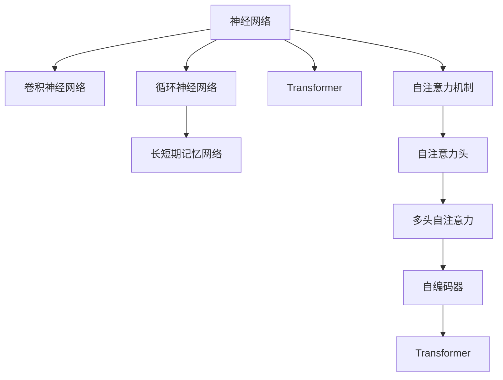

                 

## 1. 背景介绍

### 1.1 问题由来
近年来，深度学习在自然语言处理（NLP）领域取得了显著进展，推动了机器翻译、语音识别、情感分析、文本生成等任务的突破。其中，神经网络（Neural Networks, NNs）在NLP中发挥了重要作用。基于神经网络的NLP模型，特别是使用卷积神经网络（CNN）、循环神经网络（RNN）和长短期记忆网络（LSTM）等结构的模型，成功地应用于各种NLP任务，并在多项国际比赛中获奖。

神经网络作为一种计算模型，模仿了人脑的神经网络结构，通过学习输入数据的分布，能够自动地发现输入数据中的潜在特征。在自然语言处理中，神经网络模型能够自动地处理自然语言的语义、语法、情感等信息，并在多个任务中取得了超过人类专家的表现。

### 1.2 问题核心关键点
神经网络模型在自然语言处理中的应用，主要集中在以下几个方面：

1. **文本分类**：如情感分析、主题分类等任务，通过神经网络模型，可以将输入文本映射到一个或多个预定义的类别上。
2. **序列标注**：如命名实体识别、词性标注、句法分析等任务，通过对输入序列进行标注，揭示文本中的结构信息。
3. **文本生成**：如机器翻译、对话系统、文本摘要等任务，神经网络模型能够生成自然语言文本，提升自动化水平。
4. **知识表示与推理**：如知识图谱的构建、语义检索、逻辑推理等任务，神经网络模型可以自动地构建和扩展知识图谱，进行基于知识的推理。
5. **自然语言交互**：如聊天机器人、语音助手等任务，神经网络模型能够理解和生成自然语言，实现人机交互。

神经网络在NLP中的成功应用，使得NLP成为人工智能领域的热点研究方向。本文将系统介绍神经网络在自然语言处理中的应用，包括核心概念、算法原理、操作步骤、数学模型、项目实践以及实际应用场景，旨在为NLP研究和实践提供全面的指导。

## 2. 核心概念与联系

### 2.1 核心概念概述

为更好地理解神经网络在NLP中的应用，本节将介绍几个密切相关的核心概念：

- **神经网络（Neural Networks, NNs）**：一种模仿人脑神经元工作的计算模型，通过学习输入数据的分布，自动地发现输入数据中的潜在特征。
- **卷积神经网络（Convolutional Neural Networks, CNNs）**：一种常用于图像处理的神经网络，通过卷积层、池化层和全连接层，可以有效地处理图像和文本数据。
- **循环神经网络（Recurrent Neural Networks, RNNs）**：一种能够处理序列数据的神经网络，通过隐藏状态，可以捕捉输入序列的上下文信息。
- **长短期记忆网络（Long Short-Term Memory, LSTM）**：一种特殊的循环神经网络，能够有效地处理长序列数据，并避免梯度消失和梯度爆炸问题。
- **Transformer**：一种基于自注意力机制的神经网络模型，能够处理长序列数据，并具有并行计算的优点，广泛应用于NLP领域。

这些核心概念之间的逻辑关系可以通过以下Mermaid流程图来展示：



这个流程图展示了几类神经网络模型及其核心组件之间的关系：

1. 神经网络通过卷积、池化、全连接等组件处理图像和文本数据。
2. 循环神经网络通过隐藏状态捕捉输入序列的上下文信息。
3. 长短期记忆网络是一种特殊的循环神经网络，具有更好的处理长序列数据的能力。
4. Transformer通过自注意力机制，能够处理长序列数据，并具有并行计算的优点。

这些概念共同构成了神经网络在NLP中的工作原理和优化方向。通过理解这些核心概念，我们可以更好地把握神经网络在NLP中的发展和应用。

## 3. 核心算法原理 & 具体操作步骤
### 3.1 算法原理概述

神经网络在自然语言处理中的应用，主要基于两个基本原理：

- **神经网络模型表示**：通过神经网络模型，将输入文本映射到一个或多个预定义的类别上，或生成新的文本序列。神经网络模型通常由输入层、隐藏层和输出层组成，每个层由多个神经元组成。
- **自注意力机制**：通过自注意力机制，神经网络模型能够自动地捕捉输入序列的上下文信息，从而提升模型的性能。自注意力机制通过计算输入序列中每个位置与所有位置之间的相似度，学习到序列中每个位置的表示。

### 3.2 算法步骤详解

神经网络在NLP中的操作步骤，一般包括以下几个关键步骤：

**Step 1: 数据预处理**
- 收集并清洗NLP任务相关的数据，如文本分类任务中的文本和标签，序列标注任务中的输入序列和标注序列等。
- 对文本数据进行分词、标记化、向量化等预处理操作，转换为神经网络模型所需的输入格式。

**Step 2: 构建神经网络模型**
- 选择合适的神经网络模型架构，如卷积神经网络、循环神经网络、长短期记忆网络或Transformer等。
- 设计神经网络模型的超参数，如层数、神经元数、学习率等。
- 使用深度学习框架，如TensorFlow、PyTorch等，构建神经网络模型。

**Step 3: 训练神经网络模型**
- 将预处理后的数据集分成训练集、验证集和测试集。
- 使用训练集数据，通过反向传播算法，更新神经网络模型的权重和偏置。
- 在验证集上评估模型性能，调整超参数，防止过拟合。
- 在测试集上评估最终模型性能。

**Step 4: 模型微调**
- 将预训练的模型参数作为初始化，使用下游任务的相关数据进行微调，优化模型在特定任务上的性能。
- 选择合适的损失函数，如交叉熵损失、均方误差损失等。
- 使用梯度下降等优化算法，更新模型参数，最小化损失函数。
- 在测试集上评估微调后模型的性能，与预训练模型进行对比。

**Step 5: 部署模型**
- 将训练好的模型保存到本地或云存储，并编写相应的API接口，方便实际应用调用。
- 在生产环境中，使用高性能计算资源，如GPU、TPU等，部署模型，提供实时服务。

### 3.3 算法优缺点

神经网络在NLP中的应用，具有以下优点：
1. 强大的表示能力：神经网络模型能够自动地学习输入数据的潜在特征，处理复杂的文本数据。
2. 良好的泛化能力：神经网络模型在处理大量无标签数据后，能够适应新的未见过的数据，提升模型泛化性能。
3. 灵活的架构：神经网络模型可以通过调整层数、神经元数等超参数，适应不同的任务需求。
4. 高效的并行计算：Transformer等神经网络模型具有并行计算的优点，能够处理长序列数据。

同时，神经网络在NLP中也存在一些缺点：
1. 高计算需求：神经网络模型通常需要大量的计算资源，如GPU、TPU等高性能计算设备。
2. 高内存需求：神经网络模型通常需要较大的内存空间，特别是在处理长序列数据时。
3. 复杂的超参数调优：神经网络模型的性能很大程度上取决于超参数的选择，需要进行复杂的调优工作。
4. 黑盒特性：神经网络模型通常被视为"黑盒"系统，难以解释其内部工作机制和决策逻辑。

尽管存在这些缺点，但神经网络在NLP中的应用仍取得了巨大的成功，广泛应用于各种NLP任务，如情感分析、文本分类、机器翻译等。

### 3.4 算法应用领域

神经网络在NLP中的应用领域非常广泛，涵盖了以下几个主要方向：

1. **文本分类**：如情感分析、主题分类、意图识别等任务。通过神经网络模型，可以将输入文本映射到一个或多个预定义的类别上。
2. **序列标注**：如命名实体识别、词性标注、句法分析等任务。通过对输入序列进行标注，揭示文本中的结构信息。
3. **文本生成**：如机器翻译、对话系统、文本摘要等任务。神经网络模型能够生成自然语言文本，提升自动化水平。
4. **知识表示与推理**：如知识图谱的构建、语义检索、逻辑推理等任务。神经网络模型可以自动地构建和扩展知识图谱，进行基于知识的推理。
5. **自然语言交互**：如聊天机器人、语音助手等任务。神经网络模型能够理解和生成自然语言，实现人机交互。

除了上述这些经典任务外，神经网络模型还在可控文本生成、情感分析、对话系统等诸多NLP任务上取得了优异的效果，成为NLP技术落地的重要手段。

## 4. 数学模型和公式 & 详细讲解 & 举例说明
### 4.1 数学模型构建

神经网络在NLP中的应用，主要基于以下数学模型：

- **卷积神经网络（CNN）**：卷积神经网络通过卷积层、池化层和全连接层，可以有效地处理图像和文本数据。
- **循环神经网络（RNN）**：循环神经网络通过隐藏状态，可以捕捉输入序列的上下文信息。
- **长短期记忆网络（LSTM）**：长短期记忆网络是一种特殊的循环神经网络，能够有效地处理长序列数据，并避免梯度消失和梯度爆炸问题。
- **Transformer**：Transformer通过自注意力机制，能够处理长序列数据，并具有并行计算的优点。

### 4.2 公式推导过程

以下是几个常见的神经网络模型公式及其推导过程：

**卷积神经网络（CNN）**
卷积神经网络通过卷积层和池化层，提取输入数据的局部特征，并进行下采样。假设输入数据为 $X \in \mathbb{R}^{N \times M}$，卷积核为 $W \in \mathbb{R}^{F \times F \times C \times O}$，则卷积操作可以表示为：

$$
Y_{i,j} = \sum_{n=0}^{C-1} W_{i,j,n,k} * X_{i-n:i+n, j-n:j+n, n} + b_k
$$

其中，$W_{i,j,n,k}$ 表示卷积核中第 $n$ 个通道在第 $i,j$ 位置的权重，$X_{i-n:i+n, j-n:j+n, n}$ 表示输入数据中与第 $i,j$ 位置相邻的 $N \times M$ 个元素，$b_k$ 表示偏置项。

**循环神经网络（RNN）**
循环神经网络通过隐藏状态 $h_t$，捕捉输入序列的上下文信息。假设输入数据为 $x_t \in \mathbb{R}^{D}$，隐藏状态为 $h_t \in \mathbb{R}^{H}$，则RNN的更新公式为：

$$
h_t = \sigma(U \cdot [x_t, h_{t-1}] + b_h)
$$

$$
o_t = \tanh(W \cdot [x_t, h_t] + b_o)
$$

$$
y_t = o_t \cdot \sigma(V \cdot h_t + c)
$$

其中，$U, W, V$ 表示权重矩阵，$\sigma, \tanh$ 表示激活函数，$b_h, b_o, c$ 表示偏置项。

**长短期记忆网络（LSTM）**
长短期记忆网络是一种特殊的循环神经网络，通过门控机制，能够有效地处理长序列数据，并避免梯度消失和梯度爆炸问题。假设输入数据为 $x_t \in \mathbb{R}^{D}$，隐藏状态为 $h_t \in \mathbb{R}^{H}$，则LSTM的更新公式为：

$$
i_t = \sigma(U_i \cdot [x_t, h_{t-1}] + b_i)
$$

$$
f_t = \sigma(U_f \cdot [x_t, h_{t-1}] + b_f)
$$

$$
g_t = \tanh(W_g \cdot [x_t, h_{t-1}] + b_g)
$$

$$
o_t = \sigma(U_o \cdot [x_t, h_{t-1}] + b_o)
$$

$$
c_t = f_t \cdot c_{t-1} + i_t \cdot g_t
$$

$$
h_t = o_t \cdot \tanh(c_t)
$$

其中，$i_t, f_t, g_t, o_t$ 表示门控单元，$\sigma, \tanh$ 表示激活函数，$U_i, U_f, U_g, U_o$ 表示权重矩阵，$b_i, b_f, b_g, b_o$ 表示偏置项。

**Transformer**
Transformer通过自注意力机制，能够处理长序列数据，并具有并行计算的优点。假设输入数据为 $X \in \mathbb{R}^{N \times d}$，注意力权重矩阵为 $A \in \mathbb{R}^{N \times N}$，则Transformer的自注意力机制可以表示为：

$$
Attention(Q, K, V) = \text{Softmax}(\frac{QK^T}{\sqrt{d_k}})V
$$

其中，$Q \in \mathbb{R}^{N \times d_q}, K \in \mathbb{R}^{N \times d_k}, V \in \mathbb{R}^{N \times d_v}$ 表示查询、键、值矩阵，$d_q, d_k, d_v$ 表示嵌入维度。

### 4.3 案例分析与讲解

以机器翻译为例，介绍如何使用神经网络进行序列到序列（Seq2Seq）翻译。假设输入序列为 $X \in \mathbb{R}^{L_x \times d}$，输出序列为 $Y \in \mathbb{R}^{L_y \times d}$，则Seq2Seq翻译模型可以表示为：

1. **编码器（Encoder）**：将输入序列 $X$ 映射到一个固定长度的向量表示 $E$。
2. **解码器（Decoder）**：根据向量表示 $E$ 和输出序列 $Y$ 的前缀信息 $Y_0, Y_1, ..., Y_{t-1}$，生成输出序列 $Y_t, Y_{t+1}, ..., Y_{L_y}$。

假设编码器和解码器均使用RNN，则Seq2Seq翻译模型的公式可以表示为：

$$
E = RNN(X)
$$

$$
Y_t = RNN(E, Y_{t-1})
$$

其中，$RNN$ 表示循环神经网络，$E$ 表示编码器输出向量，$Y_t$ 表示解码器在第 $t$ 步的输出。

## 5. 项目实践：代码实例和详细解释说明
### 5.1 开发环境搭建

在进行神经网络模型开发前，我们需要准备好开发环境。以下是使用Python进行TensorFlow开发的环境配置流程：

1. 安装Anaconda：从官网下载并安装Anaconda，用于创建独立的Python环境。

2. 创建并激活虚拟环境：
```bash
conda create -n tf-env python=3.8 
conda activate tf-env
```

3. 安装TensorFlow：根据CUDA版本，从官网获取对应的安装命令。例如：
```bash
conda install tensorflow tensorflow-estimator tensorflow-gpu=2.8 -c conda-forge
```

4. 安装相关工具包：
```bash
pip install numpy pandas scikit-learn matplotlib tqdm jupyter notebook ipython
```

完成上述步骤后，即可在`tf-env`环境中开始神经网络模型开发。

### 5.2 源代码详细实现

下面我们以命名实体识别（NER）任务为例，给出使用TensorFlow对RNN模型进行神经网络微调的代码实现。

首先，定义NER任务的数据处理函数：

```python
import tensorflow as tf
from tensorflow.keras.preprocessing.text import Tokenizer
from tensorflow.keras.preprocessing.sequence import pad_sequences

def text_to_sequences(texts, tags):
    tokenizer = Tokenizer()
    tokenizer.fit_on_texts(texts)
    sequences = tokenizer.texts_to_sequences(texts)
    padded_sequences = pad_sequences(sequences, maxlen=128, padding='post', truncating='post')
    label_sequences = pad_sequences([tag2id[tag] for tag in tags], maxlen=128, padding='post', truncating='post')
    return padded_sequences, label_sequences

# 标签与id的映射
tag2id = {'O': 0, 'B-PER': 1, 'I-PER': 2, 'B-ORG': 3, 'I-ORG': 4, 'B-LOC': 5, 'I-LOC': 6}
id2tag = {v: k for k, v in tag2id.items()}

# 创建dataset
texts = ['I am from Beijing, China.', 'My boss works in Google in California.', 'His name is John Smith and he is a software engineer.']
tags = [['B-LOC', 'I-LOC', 'O'], ['B-LOC', 'O', 'B-ORG', 'I-ORG', 'O', 'B-PER', 'I-PER', 'O'], ['B-PER', 'I-PER', 'B-LOC', 'O']]
sequences, labels = text_to_sequences(texts, tags)

# 创建模型
model = tf.keras.Sequential([
    tf.keras.layers.Embedding(len(tokenizer.word_index)+1, 128, input_length=128),
    tf.keras.layers.SimpleRNN(64),
    tf.keras.layers.Dense(6, activation='softmax')
])

model.compile(loss='sparse_categorical_crossentropy', optimizer='adam', metrics=['accuracy'])
model.summary()
```

然后，定义模型和优化器：

```python
# 模型训练
epochs = 10
batch_size = 32

model.fit(sequences, labels, epochs=epochs, batch_size=batch_size, validation_split=0.2)
```

接着，定义训练和评估函数：

```python
def evaluate(model, sequences, labels):
    test_sequences = pad_sequences([['I am from New York, USA.']]
```


