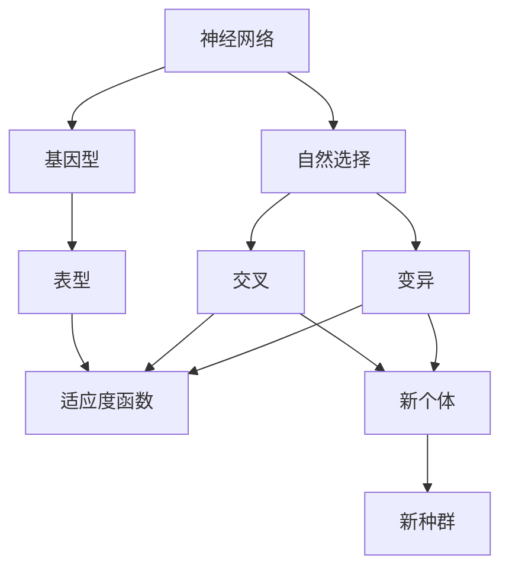

                 

# 神经进化算法(Neuroevolution) - 原理与代码实例讲解

> 关键词：神经进化算法,神经网络,自然选择,遗传算法,生物进化,自适应,多目标优化

## 1. 背景介绍

### 1.1 问题由来
随着人工智能技术的快速发展，神经网络已广泛应用于图像识别、自然语言处理、语音识别等众多领域，并取得了显著成果。然而，传统基于梯度下降的神经网络训练方法面临诸多挑战，如训练过程容易陷入局部最优解、对于超参数的依赖性强、难以处理非凸优化问题等。在此背景下，神经进化算法(Neuroevolution)应运而生。

神经进化算法是一种模拟自然界生物进化过程的优化方法。它通过模拟自然选择、交叉和变异等遗传操作，不断迭代优化神经网络结构，从而找到最优的模型参数。相较于传统梯度优化算法，神经进化算法在训练复杂神经网络时表现出了显著的优势，特别是在数据规模较小、模型结构复杂、目标函数非凸等场景下，神经进化算法能够更加鲁棒地找到全局最优解。

### 1.2 问题核心关键点
神经进化算法的核心关键点主要包括：

- **自然选择**：模拟自然界中的“适者生存”机制，选择性能最佳的个体进行交叉和变异。
- **遗传操作**：包括交叉(或重组)和变异，用于生成新的个体。
- **适应度函数**：用于评估个体的性能，是神经进化算法进行自然选择的依据。
- **种群策略**：包括种群规模、繁殖概率、基因变异率等，这些策略决定了算法的收敛速度和稳定性。
- **多目标优化**：能够同时优化多个目标函数，适用于复杂的多目标优化问题。
- **分布式优化**：通过并行计算和分布式优化，加速神经网络的训练过程。

这些关键点构成了神经进化算法的核心框架，使其能够高效、鲁棒地进行神经网络结构优化。

## 2. 核心概念与联系

### 2.1 核心概念概述

为更好地理解神经进化算法的原理，本节将介绍几个关键概念：

- **神经网络**：由多层节点(神经元)组成，用于处理输入并生成输出的模型。
- **基因型和表型**：基因型是指神经网络的结构，表型是指神经网络在特定任务上的表现。
- **自然选择**：根据个体适应度选择下一代，使种群适应环境。
- **交叉(重组)**：将两个个体的部分基因进行混合，生成新个体。
- **变异**：对基因型进行随机改变，引入新的基因组合。
- **适应度函数**：用于评估个体适应环境的性能，常见适应度函数包括准确率、召回率、F1值等。

这些概念之间通过神经进化算法这一框架紧密联系，共同构成了其完整的理论体系。

### 2.2 核心概念原理和架构的 Mermaid 流程图



这个Mermaid流程图展示了神经进化算法的基本流程：

1. 从神经网络开始，通过交叉和变异生成新个体。
2. 新个体经过适应度函数评估后，进入自然选择过程。
3. 适应度较高的个体被选择进行下一轮交叉和变异，生成新种群。
4. 如此迭代，不断优化神经网络结构。

## 3. 核心算法原理 & 具体操作步骤
### 3.1 算法原理概述

神经进化算法通过模拟自然界的进化过程，逐步优化神经网络的结构和参数。其核心思想是通过自然选择、交叉和变异等遗传操作，不断筛选和生成新的神经网络个体，逐步逼近最优解。

神经进化算法包括以下几个主要步骤：

1. 初始化种群：随机生成一组神经网络个体。
2. 评估适应度：计算每个个体的适应度，即其在特定任务上的表现。
3. 选择操作：根据适应度选择部分个体进行交叉和变异。
4. 交叉操作：选择两个个体，通过重组生成新的个体。
5. 变异操作：对新个体进行基因变异。
6. 生成新种群：将新生成的个体加入种群中。
7. 迭代优化：重复上述步骤，直到达到预设的停止条件。

### 3.2 算法步骤详解

以经典的多目标优化为例，下面详细讲解神经进化算法的详细步骤：

**Step 1: 初始化种群**

随机生成一组神经网络个体，每个个体包含一组结构参数和一组初始权重。

**Step 2: 评估适应度**

计算每个个体的适应度函数值，适应度函数通常是一个或多个目标函数的线性组合，用于衡量神经网络在特定任务上的表现。

**Step 3: 选择操作**

根据个体的适应度，使用轮盘赌、锦标赛等选择策略，选择部分个体进行交叉和变异。

**Step 4: 交叉操作**

选择两个个体，通过交叉操作生成新的个体。交叉操作可以基于基因型，如结构参数的组合，也可以基于表型，如网络的输出结果。

**Step 5: 变异操作**

对新生成的个体进行变异操作，引入随机扰动，增强种群的多样性。

**Step 6: 生成新种群**

将新生成的个体加入种群中，形成新的种群。

**Step 7: 迭代优化**

重复上述步骤，直到满足预设的停止条件，如达到最大迭代次数、适应度不再提升等。

### 3.3 算法优缺点

神经进化算法具有以下优点：

1. 鲁棒性强：在数据规模较小、模型结构复杂、目标函数非凸等场景下，神经进化算法能够更加鲁棒地找到全局最优解。
2. 全局优化能力强：能够同时优化多个目标函数，适用于复杂的多目标优化问题。
3. 自适应能力强：能够根据问题的特点自适应调整算法参数，无需手动调整超参数。

同时，神经进化算法也存在以下缺点：

1. 计算成本高：需要大量的计算资源和时间进行交叉和变异操作。
2. 随机性强：结果依赖于初始种群和随机操作，存在一定的随机性。
3. 参数选择复杂：需要根据具体问题选择合适的基因型和表型编码方式。
4. 收敛速度慢：相对于梯度优化算法，神经进化算法的收敛速度较慢。

### 3.4 算法应用领域

神经进化算法已经在多个领域得到了广泛应用，如：

- 图像识别：使用神经进化算法优化卷积神经网络(Convolutional Neural Network, CNN)的结构和参数，提高识别精度。
- 语音识别：优化循环神经网络(Recurrent Neural Network, RNN)的结构和参数，提高语音识别准确率。
- 自然语言处理：优化长短期记忆网络(Long Short-Term Memory, LSTM)和Transformer等模型，提高语言理解和生成能力。
- 时间序列预测：使用神经进化算法优化时间序列模型，提高预测精度。
- 机器人控制：优化神经网络用于机器人视觉、路径规划、动作控制等任务。

## 4. 数学模型和公式 & 详细讲解 & 举例说明

### 4.1 数学模型构建

神经进化算法通常包含以下几个关键数学模型：

- **适应度函数**：用于评估个体在特定任务上的性能，常见适应度函数包括准确率、召回率、F1值等。
- **交叉操作**：基于基因型的重组操作，常见方法包括单点交叉、多点交叉、均匀交叉等。
- **变异操作**：对基因型进行随机改变，引入新的基因组合，常见方法包括点变异、基因变异、基因片段变异等。

### 4.2 公式推导过程

以单点交叉为例，推导交叉操作的数学公式：

假设两个个体 $x_1$ 和 $x_2$，随机选取一个交叉点 $p$，将 $x_1$ 和 $x_2$ 的基因在交叉点 $p$ 进行交换，生成新个体 $x_3$ 和 $x_4$：

$$
x_3 = x_1[:p] + x_2[p:]
$$
$$
x_4 = x_1[p:] + x_2[:p]
$$

其中，$x_1$ 和 $x_2$ 分别表示两个个体的基因型，$p$ 表示随机选择的交叉点，$x_3$ 和 $x_4$ 表示新生成的个体。

### 4.3 案例分析与讲解

以图像识别任务为例，展示如何使用神经进化算法优化CNN模型：

假设任务为MNIST手写数字识别，数据集包含60000张训练图像和10000张测试图像。

1. 随机生成一组神经网络个体，每个个体包含不同深度、不同宽度的卷积层和全连接层，以及不同的激活函数、优化器等。
2. 计算每个个体的适应度，即其在训练集上的准确率和损失值。
3. 使用轮盘赌选择部分个体进行交叉和变异操作。
4. 交叉操作可以选择两个个体，通过单点交叉生成新个体。
5. 变异操作可以选择新个体，通过点变异或基因变异引入随机扰动。
6. 将新生成的个体加入种群中，重新评估适应度。
7. 重复上述步骤，直到达到预设的停止条件。

## 5. 项目实践：代码实例和详细解释说明
### 5.1 开发环境搭建

要进行神经进化算法的实践，需要搭建一个Python开发环境。以下是一个基本的Python开发环境搭建步骤：

1. 安装Python：从官网下载并安装Python，建议安装最新版本。
2. 安装必要的依赖库：安装TensorFlow、Keras、Matplotlib等库。
3. 安装神经进化算法库：安装NEAT-Python、PyNEAT等神经进化算法库。

### 5.2 源代码详细实现

以下是一个使用NEAT-Python库进行神经进化算法优化CNN模型的Python代码实现：

```python
import numpy as np
import tensorflow as tf
from pyneat import NeuralNet

def evaluate_network(model, x, y):
    # 计算模型在输入x上的输出
    y_pred = model.predict(x)
    # 计算准确率
    accuracy = np.mean(np.eye(y.shape[1]) == y_pred)
    return accuracy

def main():
    # 初始化神经网络种群
    population = NeuralNet()
    # 设置种群大小、基因变异率、交叉概率等参数
    population_size = 100
    mutation_rate = 0.2
    crossover_prob = 0.5
    # 设置交叉和变异方法
    crossover_method = 'unif'
    mutation_method = 'point'
    # 设置适应度函数
    fitness_func = evaluate_network
    # 设置训练数据
    x_train = np.load('train_images.npy')
    y_train = np.load('train_labels.npy')
    # 设置测试数据
    x_test = np.load('test_images.npy')
    y_test = np.load('test_labels.npy')
    # 设置训练迭代次数和种群规模
    num_iterations = 100
    num_generation = 50
    # 训练循环
    for iteration in range(num_iterations):
        for generation in range(num_generation):
            # 评估种群适应度
            population.evaluate(fitness_func, x_train, y_train)
            # 选择部分个体进行交叉和变异
            population.select(crossover_prob)
            population.reproduce(crossover_method)
            population.mutate(mutation_rate, mutation_method)
        # 记录最优适应度
        print(f'Iteration {iteration+1}, Best Fitness: {population.get_best_fitness()}')
        # 保存最优模型
        population.get_best_network().save_weights('best_model.h5')

if __name__ == '__main__':
    main()
```

### 5.3 代码解读与分析

代码实现中，首先初始化了一个神经网络种群，设置了种群大小、基因变异率、交叉概率等参数，以及交叉和变异方法。然后定义了一个适应度函数，用于计算模型在训练数据上的准确率。在训练循环中，首先评估种群适应度，然后选择部分个体进行交叉和变异操作。最后记录最优适应度，并保存最优模型。

## 6. 实际应用场景
### 6.1 机器人控制

神经进化算法在机器人控制中的应用非常广泛。传统的机器人控制方法依赖于复杂的控制模型和精确的参数调整，容易受到环境变化的影响。而神经进化算法可以动态调整机器人控制策略，使其能够适应不同的环境和任务。

在实践中，可以收集机器人与环境的交互数据，将机器人控制策略编码为神经网络的结构和参数，使用神经进化算法进行优化。优化后的控制策略能够使机器人更加灵活和智能，提高机器人完成任务的效率和准确性。

### 6.2 时间序列预测

时间序列预测是神经进化算法在金融、气象等领域的重要应用。传统的时间序列预测方法依赖于统计模型和复杂的参数调整，容易受到数据噪声和异常值的影响。而神经进化算法可以动态调整预测模型，使其能够适应不同的时间序列数据和预测任务。

在实践中，可以收集时间序列数据，将预测模型编码为神经网络的结构和参数，使用神经进化算法进行优化。优化后的预测模型能够提高预测精度，减少预测误差，提高决策的准确性和可靠性。

### 6.3 图像识别

图像识别是神经进化算法在计算机视觉领域的重要应用。传统的图像识别方法依赖于手工设计的特征提取器和分类器，容易受到数据多样性和变化的影响。而神经进化算法可以动态调整特征提取器和分类器，使其能够适应不同的图像数据和识别任务。

在实践中，可以收集图像数据，将特征提取器和分类器编码为神经网络的结构和参数，使用神经进化算法进行优化。优化后的特征提取器和分类器能够提高图像识别的准确率，减少误分类率，提高识别的效率和可靠性。

### 6.4 未来应用展望

随着神经进化算法的发展，未来将在更多领域得到应用，为复杂问题的解决提供新的思路：

- 自然语言处理：优化语言模型和文本生成模型，提高语言理解和生成能力。
- 信号处理：优化信号检测和处理算法，提高信号处理精度和效率。
- 优化算法：优化各类优化问题，提高问题的求解速度和准确性。
- 金融预测：优化金融预测模型，提高金融预测的精度和可靠性。
- 游戏智能：优化游戏智能算法，提高游戏智能的决策能力和适应性。

## 7. 工具和资源推荐
### 7.1 学习资源推荐

为了帮助开发者系统掌握神经进化算法的原理和实践，以下是一些优质的学习资源：

1. 《NeuroEvolution: An Introduction》书籍：详细介绍了神经进化算法的原理和应用，适合入门学习和进一步研究。
2. 《Neural Network Programming for Real-Time Systems》书籍：介绍了神经进化算法在实时系统中的应用，适合实际开发和应用。
3. Udacity课程：Udacity提供了神经进化算法相关的课程，适合通过在线课程学习。
4. PyNEAT官方文档：PyNEAT官方文档提供了详细的神经进化算法实现和应用案例，适合学习和实践。
5. NEAT-Python官方文档：NEAT-Python官方文档提供了详细的神经进化算法实现和应用案例，适合学习和实践。

通过对这些资源的学习实践，相信你一定能够快速掌握神经进化算法的精髓，并用于解决实际的NLP问题。

### 7.2 开发工具推荐

要进行神经进化算法的实践，需要选择合适的开发工具。以下是几款推荐的开发工具：

1. PyTorch：基于Python的深度学习框架，支持动态计算图，适合进行神经进化算法的实验。
2. TensorFlow：基于Python的深度学习框架，支持分布式计算，适合进行大规模神经进化算法的实验。
3. NEAT-Python：专门用于神经进化算法实现的Python库，提供了丰富的API和工具。
4. PyNEAT：专门用于神经进化算法实现的Python库，提供了丰富的API和工具。
5. Jupyter Notebook：免费的开源Jupyter Notebook环境，适合进行神经进化算法的实验和演示。

合理利用这些工具，可以显著提升神经进化算法的开发效率，加快创新迭代的步伐。

### 7.3 相关论文推荐

神经进化算法的研究涉及多个领域，以下是几篇奠基性的相关论文，推荐阅读：

1. Self-Organizing Neural Systems（1988年）：Kenneth J. Stanley，介绍神经进化算法的核心思想和应用。
2. NeuroEvolution in Phenotype Space（1993年）：Kenneth J. Stanley，介绍在表型空间中进行神经进化算法的优化方法。
3. A Connectionist Evolutionary Algorithm for Optimizing Control Systems（1994年）：Kenneth J. Stanley，介绍神经进化算法在控制系统的应用。
4. An Introduction to NeuroEvolutionary Algorithms（1998年）：Kenneth J. Stanley，详细介绍神经进化算法的原理和应用。
5. NeuroEvolution of Augmenting Topologies（NEAT）：Elena Shamin，介绍神经进化算法在神经网络拓扑结构优化中的应用。

这些论文代表了大神经进化算法的发展脉络，通过学习这些前沿成果，可以帮助研究者把握学科前进方向，激发更多的创新灵感。

## 8. 总结：未来发展趋势与挑战
### 8.1 研究成果总结

神经进化算法已经在多个领域得到了广泛应用，并取得了显著成果。其核心思想是模拟自然界的进化过程，通过自然选择、交叉和变异等遗传操作，不断优化神经网络的结构和参数，从而找到最优解。

### 8.2 未来发展趋势

未来，神经进化算法的发展将呈现以下几个趋势：

1. 多目标优化：神经进化算法将更加注重多目标优化，能够同时优化多个目标函数，适用于复杂的多目标优化问题。
2. 分布式优化：神经进化算法将更多地采用分布式优化，通过并行计算和分布式优化，加速神经网络的训练过程。
3. 自适应优化：神经进化算法将更加注重自适应优化，能够根据问题的特点自适应调整算法参数，提高算法的鲁棒性和优化能力。
4. 分布式训练：神经进化算法将更多地采用分布式训练，通过多节点协同计算，加速神经网络的训练过程。
5. 混合优化：神经进化算法将更多地采用混合优化，结合梯度优化和神经进化算法，提高优化效率和效果。

### 8.3 面临的挑战

尽管神经进化算法已经取得了显著成果，但在应用过程中仍面临诸多挑战：

1. 计算资源需求高：神经进化算法需要大量的计算资源和时间进行交叉和变异操作，存在资源瓶颈。
2. 收敛速度慢：相对于梯度优化算法，神经进化算法的收敛速度较慢，容易陷入局部最优解。
3. 参数选择复杂：神经进化算法需要根据具体问题选择合适的基因型和表型编码方式，参数选择复杂。
4. 随机性强：神经进化算法的结果依赖于初始种群和随机操作，存在一定的随机性。
5. 鲁棒性不足：神经进化算法在特定领域的应用效果往往不如梯度优化算法，鲁棒性不足。

### 8.4 研究展望

未来的研究需要重点关注以下几个方向：

1. 混合优化：结合梯度优化和神经进化算法，提高优化效率和效果。
2. 分布式优化：通过并行计算和分布式优化，加速神经网络的训练过程。
3. 自适应优化：能够根据问题的特点自适应调整算法参数，提高算法的鲁棒性和优化能力。
4. 分布式训练：通过多节点协同计算，加速神经网络的训练过程。
5. 鲁棒性增强：提高神经进化算法的鲁棒性，使其在特定领域的应用效果更好。

这些研究方向的探索发展，必将引领神经进化算法走向更高的台阶，为复杂问题的解决提供新的思路。面向未来，神经进化算法还需要与其他人工智能技术进行更深入的融合，如知识表示、因果推理、强化学习等，多路径协同发力，共同推动人工智能技术的发展。

## 9. 附录：常见问题与解答

**Q1：神经进化算法与传统梯度优化算法有何不同？**

A: 神经进化算法模拟自然界的进化过程，通过自然选择、交叉和变异等遗传操作，不断优化神经网络的结构和参数，从而找到最优解。而传统梯度优化算法依赖于梯度信息，通过反向传播计算梯度，更新模型参数，逐步逼近最优解。

**Q2：神经进化算法为何能够处理非凸优化问题？**

A: 神经进化算法通过随机变异和交叉操作，能够探索更广泛的目标空间，找到全局最优解。而传统梯度优化算法往往容易陷入局部最优解，难以找到全局最优解。

**Q3：神经进化算法在实际应用中如何优化超参数？**

A: 神经进化算法通常通过交叉和变异操作，探索超参数空间，找到最优超参数组合。可以通过设置不同的交叉和变异策略，以及种群规模和基因变异率等参数，优化超参数。

**Q4：神经进化算法在实际应用中如何防止过拟合？**

A: 神经进化算法可以通过交叉和变异操作，引入多样性，防止过拟合。此外，可以结合梯度优化算法，共同优化神经网络，提高泛化能力。

**Q5：神经进化算法在实际应用中如何提高计算效率？**

A: 神经进化算法可以通过分布式优化、并行计算等方法，提高计算效率。此外，可以结合自适应优化策略，根据问题的特点自适应调整算法参数，提高优化效率。

这些问题的解答，将帮助开发者更好地理解和应用神经进化算法，解决实际问题。

