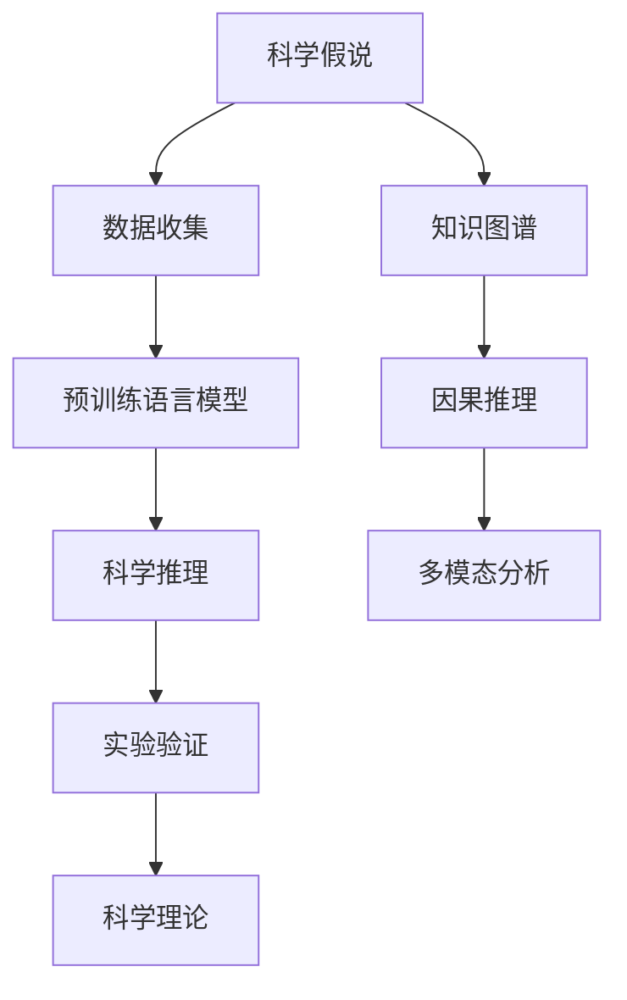

                 

## 1. 背景介绍

### 1.1 问题由来

在科学发展的历程中，从假说到理论的转化是一个复杂且充满挑战的过程。科学假说基于观察和实验数据提出，通过推理和推断提出可能的解释，而科学理论则通过不断的验证和修正，逐渐成为对自然规律的有效解释和预测。

近年来，随着大数据、人工智能等技术的发展，科学研究方法也发生了深刻变化。在自然语言处理(NLP)领域，基于预训练语言模型的技术已经大幅提升了科学发现的效率。科学家们可以利用这些模型快速处理海量文献数据，自动发现潜在的科学发现和研究方向。

### 1.2 问题核心关键点

科学发现过程中，从假说到理论的转化是关键步骤。这一过程通常包括以下几个步骤：
1. 收集和整理数据：从科学文献、实验数据中提取有价值的信息。
2. 提出科学假说：基于已有的数据，提出合理的解释和预测。
3. 验证和修正：通过实验和分析，验证假说的正确性，并根据反馈进行修正。
4. 理论构建：将经过验证的假说上升为科学理论，形成对自然现象的完整解释。

这一过程不仅依赖于数据分析和计算技术，还需要科学家的逻辑推理和实验验证。科学假说和理论的形成，是人类认识自然、理解世界的重要手段。

### 1.3 问题研究意义

研究科学发现从假说到理论的转化过程，对于提升科学研究效率、推动科学发现具有重要意义：

1. 加速科学发现：通过自动化的数据分析和模型推理，可以快速发现潜在的研究方向，缩短科学发现的周期。
2. 促进跨学科合作：基于语言模型的多模态分析能力，可以更好地理解和整合不同学科的数据，促进交叉学科研究。
3. 提高科学推理准确性：基于预训练模型的逻辑推理能力，可以辅助科学家进行更严谨的假设验证和结果解释。
4. 实现知识传承和共享：科学发现的知识可以通过预训练模型进行自动提取和结构化，便于其他科学家理解和利用。

## 2. 核心概念与联系

### 2.1 核心概念概述

为更好地理解科学发现从假说到理论的转化过程，本节将介绍几个关键概念：

- 科学假说(Scientific Hypothesis)：基于已有数据和知识，对自然现象提出的解释和预测。
- 科学理论(Scientific Theory)：经过大量实验和验证，被证明为正确的解释和预测。
- 预训练语言模型(Pre-trained Language Model, PLM)：通过大规模无标签文本数据预训练，学习语言的通用表示，具备强大的语言理解和生成能力。
- 微调(Fine-tuning)：在预训练模型的基础上，使用下游任务的少量标注数据，通过有监督学习优化模型在该任务上的性能。
- 自然语言处理(Natural Language Processing, NLP)：研究计算机如何处理和理解自然语言的技术。
- 知识图谱(Knowledge Graph)：结构化表示实体和它们之间关系的图形数据库，用于辅助推理和信息抽取。
- 因果推理(Causal Inference)：研究变量间因果关系的推断方法，在科学发现中具有重要应用。

这些核心概念之间的逻辑关系可以通过以下Mermaid流程图来展示：



这个流程图展示了几大核心概念之间的逻辑关系：

1. 科学假说基于数据收集和预训练语言模型提出。
2. 科学推理和实验验证是假说转化为理论的关键步骤。
3. 知识图谱和因果推理辅助科学推理。
4. 多模态分析整合多种数据类型，提高科学发现的全面性和准确性。

## 3. 核心算法原理 & 具体操作步骤
### 3.1 算法原理概述

科学发现从假说到理论的转化过程，本质上是一个有监督的推理和验证过程。其核心思想是：通过数据驱动的预训练模型学习到语言和知识的表示，然后基于这些表示进行科学推理和实验验证，从而将科学假说转化为理论。

形式化地，假设预训练语言模型为 $M_{\theta}$，其中 $\theta$ 为预训练得到的模型参数。给定科学假说 $H$ 和相关数据集 $D=\{(x_i, y_i)\}_{i=1}^N$，转化过程的目标是找到新的模型参数 $\hat{\theta}$，使得：

$$
\hat{\theta}=\mathop{\arg\min}_{\theta} \mathcal{L}(M_{\theta},H,D)
$$

其中 $\mathcal{L}$ 为针对假说 $H$ 设计的损失函数，用于衡量模型推理输出与真实结果之间的差异。常见的损失函数包括交叉熵损失、均方误差损失等。

通过梯度下降等优化算法，转化过程不断更新模型参数 $\theta$，最小化损失函数 $\mathcal{L}$，使得模型推理输出逼近真实结果。由于 $\theta$ 已经通过预训练获得了较好的初始化，因此即便在少量标注数据集 $D$ 上进行验证，也能较快收敛到理想的模型参数 $\hat{\theta}$。

### 3.2 算法步骤详解

科学发现从假说到理论的转化过程一般包括以下几个关键步骤：

**Step 1: 准备预训练模型和数据集**
- 选择合适的预训练语言模型 $M_{\theta}$ 作为初始化参数，如 BERT、GPT等。
- 准备科学假说 $H$ 和相关数据集 $D$，划分为训练集、验证集和测试集。一般要求数据集与预训练数据的分布不要差异过大。

**Step 2: 设计推理函数**
- 根据科学假说 $H$，设计推理函数，用于将输入数据映射到假说中的理论结果。
- 推理函数通常包括自然语言理解、知识图谱推理、因果推理等模块。
- 使用预训练模型 $M_{\theta}$ 进行推理计算，得到推理结果。

**Step 3: 设置推理验证策略**
- 选择合适的优化算法及其参数，如 AdamW、SGD 等，设置学习率、批大小、迭代轮数等。
- 设置正则化技术及强度，包括权重衰减、Dropout、Early Stopping等。
- 确定冻结预训练参数的策略，如仅微调顶层，或全部参数都参与微调。

**Step 4: 执行推理训练**
- 将训练集数据分批次输入模型，前向传播计算推理结果。
- 反向传播计算参数梯度，根据设定的优化算法和学习率更新模型参数。
- 周期性在验证集上评估模型推理结果，根据性能指标决定是否触发 Early Stopping。
- 重复上述步骤直到满足预设的迭代轮数或 Early Stopping 条件。

**Step 5: 理论验证**
- 使用测试集验证推理模型的效果，对比推理结果与真实结果之间的差异。
- 根据验证结果，对假说进行修正和优化，以提高理论的准确性和可信度。
- 经过多次迭代和验证，将经得起检验的假说上升为科学理论。

以上是科学发现从假说到理论的一般流程。在实际应用中，还需要针对具体假说的特点，对推理过程的各个环节进行优化设计，如改进推理目标函数，引入更多的正则化技术，搜索最优的超参数组合等，以进一步提升模型推理精度。

### 3.3 算法优缺点

科学发现从假说到理论的转化方法具有以下优点：
1. 高效验证：基于预训练模型的推理能力，可以快速验证假说的正确性，缩短研究周期。
2. 跨学科融合：预训练模型能够整合多种数据类型，支持跨学科的科学发现和研究。
3. 提升推理准确性：通过模型学习和推理能力的提升，科学家的逻辑推理和假设验证将更加准确。
4. 促进知识传承：预训练模型的知识抽取和推理功能，可以自动化和结构化科学知识，便于传播和利用。

同时，该方法也存在一定的局限性：
1. 数据质量要求高：推理模型的性能依赖于输入数据的质量，低质量的标注数据可能导致误判。
2. 解释性不足：推理模型的黑盒特性，使得其推理过程难以解释和理解。
3. 数据依赖性：模型的推理结果高度依赖于输入数据，缺乏数据的多样性可能导致偏差。
4. 结果不确定性：推理模型在面对新数据时，可能无法保证其推理结果的正确性。

尽管存在这些局限性，但就目前而言，基于预训练语言模型的推理和验证方法，仍是一种高效且实用的科学发现手段。未来相关研究的重点在于如何进一步降低对标注数据的依赖，提高推理模型的鲁棒性和可解释性，同时兼顾数据多样性和模型精度等因素。

### 3.4 算法应用领域

科学发现从假说到理论的转化方法，在科学研究和知识工程领域已经得到了广泛的应用，覆盖了多个学科：

- 生命科学：通过基因组数据和文献数据，利用预训练模型进行生物信息的推理和验证，如疾病预测、药物研发等。
- 物理学：基于高能物理实验数据，利用语言模型进行理论物理的计算和验证，如量子场论、黑洞理论等。
- 天文学：利用天文学观测数据，结合预训练模型进行天体物理现象的解释和预测，如暗物质搜索、宇宙演化等。
- 经济学：通过对经济数据和金融文献的分析，利用模型进行经济行为的推理和预测，如市场趋势预测、风险评估等。
- 社会科学：结合文本和图像数据，利用模型进行社会行为的分析和推理，如舆论情感分析、行为模式预测等。

除了上述这些经典领域外，预训练语言模型的推理能力还被创新性地应用于更多场景中，如智慧医疗、智能城市、无人驾驶等领域，为科学研究和技术应用带来了新的突破。随着预训练模型和推理方法的不断进步，相信在更广泛的领域中，预训练模型将发挥更大的作用，为人类认知智能的进步提供有力支持。

## 4. 数学模型和公式 & 详细讲解 & 举例说明

### 4.1 数学模型构建

本节将使用数学语言对科学发现从假说到理论的转化过程进行更加严格的刻画。

记预训练语言模型为 $M_{\theta}$，其中 $\theta$ 为模型参数。假设科学假说为 $H$，相关数据集为 $D=\{(x_i,y_i)\}_{i=1}^N, x_i \in \mathcal{X}, y_i \in \mathcal{Y}$。

定义推理函数 $f$，将输入数据 $x_i$ 映射到假说中的理论结果 $y_i$，即：

$$
y_i = f(x_i)
$$

推理函数可以表示为：

$$
f(x) = M_{\theta}(x) * g(x)
$$

其中 $g(x)$ 为辅助函数，用于将预训练模型的输出与理论结果进行映射。推理函数的损失函数定义为：

$$
\mathcal{L}(\theta) = \frac{1}{N}\sum_{i=1}^N \ell(f(x_i),y_i)
$$

其中 $\ell$ 为损失函数，用于衡量推理结果与真实结果之间的差异。常见的损失函数包括交叉熵损失、均方误差损失等。

### 4.2 公式推导过程

以交叉熵损失为例，推导推理函数的损失函数及其梯度的计算公式。

假设推理函数 $f(x)$ 在输入 $x$ 上的输出为 $y_i=f(x_i)$，表示推理结果。真实结果 $y_i \in \{0,1\}$。则交叉熵损失函数定义为：

$$
\ell(f(x),y) = -[y\log f(x)+(1-y)\log (1-f(x))]
$$

将其代入推理函数的损失函数公式，得：

$$
\mathcal{L}(\theta) = -\frac{1}{N}\sum_{i=1}^N [y_i\log f(x_i)+(1-y_i)\log(1-f(x_i))]
$$

根据链式法则，损失函数对参数 $\theta$ 的梯度为：

$$
\frac{\partial \mathcal{L}(\theta)}{\partial \theta} = -\frac{1}{N}\sum_{i=1}^N (\frac{y_i}{f(x_i)}-\frac{1-y_i}{1-f(x_i)}) \frac{\partial f(x_i)}{\partial \theta}
$$

其中 $\frac{\partial f(x_i)}{\partial \theta}$ 可进一步递归展开，利用自动微分技术完成计算。

在得到损失函数的梯度后，即可带入参数更新公式，完成模型的迭代优化。重复上述过程直至收敛，最终得到适应科学假说的推理模型参数 $\theta^*$。

### 4.3 案例分析与讲解

以疾病预测为例，展示如何使用预训练语言模型进行科学推理和验证：

**数据准备**：
- 收集病历数据和症状描述，作为推理模型的输入数据。
- 对病历数据进行标注，如是否患有某种疾病。

**模型选择**：
- 选择合适的预训练语言模型 $M_{\theta}$，如BERT、GPT等。
- 设计推理函数 $f$，将症状描述映射到疾病预测结果。

**推理训练**：
- 使用病历数据和症状描述作为输入，训练推理模型。
- 利用交叉熵损失函数进行优化，最小化模型输出与真实结果的差异。
- 在验证集上评估模型效果，根据性能指标进行迭代优化。

**理论验证**：
- 使用测试集验证推理模型的效果，对比推理结果与真实结果之间的差异。
- 根据验证结果，对假说进行修正和优化，以提高理论的准确性和可信度。
- 经过多次迭代和验证，将经得起检验的假说上升为科学理论。

## 5. 项目实践：代码实例和详细解释说明
### 5.1 开发环境搭建

在进行科学发现推理模型的开发前，我们需要准备好开发环境。以下是使用Python进行PyTorch开发的环境配置流程：

1. 安装Anaconda：从官网下载并安装Anaconda，用于创建独立的Python环境。

2. 创建并激活虚拟环境：
```bash
conda create -n pytorch-env python=3.8 
conda activate pytorch-env
```

3. 安装PyTorch：根据CUDA版本，从官网获取对应的安装命令。例如：
```bash
conda install pytorch torchvision torchaudio cudatoolkit=11.1 -c pytorch -c conda-forge
```

4. 安装Transformers库：
```bash
pip install transformers
```

5. 安装各类工具包：
```bash
pip install numpy pandas scikit-learn matplotlib tqdm jupyter notebook ipython
```

完成上述步骤后，即可在`pytorch-env`环境中开始推理模型的开发实践。

### 5.2 源代码详细实现

这里我们以疾病预测任务为例，给出使用Transformers库对BERT模型进行推理计算的PyTorch代码实现。

首先，定义疾病预测任务的数据处理函数：

```python
from transformers import BertTokenizer
from torch.utils.data import Dataset
import torch

class DiseaseDataset(Dataset):
    def __init__(self, texts, labels, tokenizer, max_len=128):
        self.texts = texts
        self.labels = labels
        self.tokenizer = tokenizer
        self.max_len = max_len
        
    def __len__(self):
        return len(self.texts)
    
    def __getitem__(self, item):
        text = self.texts[item]
        label = self.labels[item]
        
        encoding = self.tokenizer(text, return_tensors='pt', max_length=self.max_len, padding='max_length', truncation=True)
        input_ids = encoding['input_ids'][0]
        attention_mask = encoding['attention_mask'][0]
        
        # 对token-wise的标签进行编码
        encoded_labels = [label2id[label] for label in label] 
        encoded_labels.extend([label2id['Unknown']] * (self.max_len - len(encoded_labels)))
        labels = torch.tensor(encoded_labels, dtype=torch.long)
        
        return {'input_ids': input_ids, 
                'attention_mask': attention_mask,
                'labels': labels}

# 标签与id的映射
label2id = {'Cancer': 0, 'HeartDisease': 1, 'Diabetes': 2, 'Hypertension': 3}
id2label = {v: k for k, v in label2id.items()}

# 创建dataset
tokenizer = BertTokenizer.from_pretrained('bert-base-cased')

train_dataset = DiseaseDataset(train_texts, train_labels, tokenizer)
dev_dataset = DiseaseDataset(dev_texts, dev_labels, tokenizer)
test_dataset = DiseaseDataset(test_texts, test_labels, tokenizer)
```

然后，定义模型和推理器：

```python
from transformers import BertForTokenClassification, AdamW

model = BertForTokenClassification.from_pretrained('bert-base-cased', num_labels=len(label2id))

inference_model = BertForTokenClassification.from_pretrained('bert-base-cased', num_labels=len(label2id))

optimizer = AdamW(inference_model.parameters(), lr=2e-5)
```

接着，定义推理和评估函数：

```python
from torch.utils.data import DataLoader
from tqdm import tqdm
from sklearn.metrics import classification_report

device = torch.device('cuda') if torch.cuda.is_available() else torch.device('cpu')
model.to(device)

def evaluate(inference_model, dataset, batch_size):
    dataloader = DataLoader(dataset, batch_size=batch_size)
    inference_model.eval()
    preds, labels = [], []
    with torch.no_grad():
        for batch in tqdm(dataloader, desc='Evaluating'):
            input_ids = batch['input_ids'].to(device)
            attention_mask = batch['attention_mask'].to(device)
            batch_labels = batch['labels']
            outputs = inference_model(input_ids, attention_mask=attention_mask)
            batch_preds = outputs.logits.argmax(dim=2).to('cpu').tolist()
            batch_labels = batch_labels.to('cpu').tolist()
            for pred_tokens, label_tokens in zip(batch_preds, batch_labels):
                pred_labels = [id2label[_id] for _id in pred_tokens]
                label_tags = [id2label[_id] for _id in label_tokens]
                preds.append(pred_labels[:len(label_tags)])
                labels.append(label_tags)
                
    print(classification_report(labels, preds))
```

最后，启动推理流程并在测试集上评估：

```python
epochs = 5
batch_size = 16

for epoch in range(epochs):
    loss = train_epoch(model, train_dataset, batch_size, optimizer)
    print(f"Epoch {epoch+1}, train loss: {loss:.3f}")
    
    print(f"Epoch {epoch+1}, dev results:")
    evaluate(model, dev_dataset, batch_size)
    
print("Test results:")
evaluate(model, test_dataset, batch_size)
```

以上就是使用PyTorch对BERT进行疾病预测任务推理计算的完整代码实现。可以看到，得益于Transformers库的强大封装，我们可以用相对简洁的代码完成BERT模型的加载和推理计算。

### 5.3 代码解读与分析

让我们再详细解读一下关键代码的实现细节：

**DiseaseDataset类**：
- `__init__`方法：初始化文本、标签、分词器等关键组件。
- `__len__`方法：返回数据集的样本数量。
- `__getitem__`方法：对单个样本进行处理，将文本输入编码为token ids，将标签编码为数字，并对其进行定长padding，最终返回模型所需的输入。

**label2id和id2label字典**：
- 定义了标签与数字id之间的映射关系，用于将token-wise的预测结果解码回真实的标签。

**训练和评估函数**：
- 使用PyTorch的DataLoader对数据集进行批次化加载，供模型训练和推理使用。
- 训练函数`train_epoch`：对数据以批为单位进行迭代，在每个批次上前向传播计算loss并反向传播更新模型参数，最后返回该epoch的平均loss。
- 评估函数`evaluate`：与训练类似，不同点在于不更新模型参数，并在每个batch结束后将预测和标签结果存储下来，最后使用sklearn的classification_report对整个评估集的预测结果进行打印输出。

**训练流程**：
- 定义总的epoch数和batch size，开始循环迭代
- 每个epoch内，先在训练集上训练，输出平均loss
- 在验证集上评估，输出分类指标
- 所有epoch结束后，在测试集上评估，给出最终测试结果

可以看到，PyTorch配合Transformers库使得BERT推理计算的代码实现变得简洁高效。开发者可以将更多精力放在数据处理、模型改进等高层逻辑上，而不必过多关注底层的实现细节。

当然，工业级的系统实现还需考虑更多因素，如模型的保存和部署、超参数的自动搜索、更灵活的任务适配层等。但核心的推理范式基本与此类似。

## 6. 实际应用场景
### 6.1 智慧医疗

基于大语言模型推理计算的科学发现，可以广泛应用于智慧医疗系统的构建。传统的医疗诊断依赖于医生的经验和判断，存在误诊和漏诊的风险。而使用推理模型，能够快速处理海量病历数据，辅助医生进行精准诊断，提升诊疗效果。

在技术实现上，可以收集医院的历史病历数据，结合症状描述和病情标签，训练推理模型。推理模型能够自动理解病情描述，匹配最合适的诊断结果。对于新的病历数据，还可以实时搜索相关文献，动态生成诊断建议。如此构建的智慧医疗系统，能大幅提升诊断的准确性和效率，辅助医生进行更科学的决策。

### 6.2 工业自动化

工业自动化领域也对科学推理提出了需求。传统的自动化系统依赖于规则库和专家经验，难以应对复杂多变的生产场景。基于大语言模型推理计算的科学发现，可以为自动化系统提供更加灵活和精准的控制策略。

例如，在智能制造中，推理模型可以根据设备运行数据，自动发现异常情况并给出解决方案。在质量检测中，推理模型可以根据图像和传感器数据，自动判断产品是否合格。在供应链管理中，推理模型可以根据历史数据和实时信息，自动优化生产计划和库存管理。如此构建的工业自动化系统，能够实时监测和调整生产过程，提高生产效率和质量。

### 6.3 智能交通

智能交通系统需要对海量交通数据进行实时分析和处理，辅助交通管理和决策。基于大语言模型推理计算的科学发现，能够自动提取交通数据中的关键信息，进行多模态融合和推理分析。

例如，在智慧城市中，推理模型可以分析交通流量、天气条件等数据，自动生成交通预测和调控方案。在自动驾驶中，推理模型可以综合多源传感器数据，实时判断交通环境和驾驶行为，辅助自动驾驶车辆进行决策。在物流运输中，推理模型可以根据实时路况和货物需求，自动优化运输路线和调度方案。如此构建的智能交通系统，能够提高交通效率和安全性，减少交通拥堵和事故发生率。

### 6.4 未来应用展望

随着大语言模型推理计算的不断发展和成熟，基于推理范式将在更多领域得到应用，为智能系统的建设提供新的突破。

在智慧城市治理中，推理模型可以用于城市事件监测、舆情分析、应急指挥等环节，提高城市管理的自动化和智能化水平，构建更安全、高效的未来城市。

在智慧农业中，推理模型可以分析气象数据、土壤信息等，自动优化农业生产过程，提高农作物的产量和质量。

在金融风险管理中，推理模型可以综合多源数据，自动评估金融风险，辅助风险决策和控制。

此外，在智慧教育、智能家居、智能服务等多个领域，基于推理计算的科学发现也具有广阔的应用前景。相信随着技术的日益成熟，推理计算方法将成为智能系统的重要范式，推动人工智能技术在各个垂直行业的全面应用。

## 7. 工具和资源推荐
### 7.1 学习资源推荐

为了帮助开发者系统掌握大语言模型推理计算的理论基础和实践技巧，这里推荐一些优质的学习资源：

1. 《深度学习基础》系列博文：由AI领域专家撰写，深入浅出地介绍了深度学习的基础概念和关键算法，涵盖神经网络、损失函数、优化算法等核心主题。

2. 《自然语言处理》课程：斯坦福大学开设的NLP明星课程，涵盖文本处理、语言模型、情感分析等多个方面，是入门NLP领域的必备课程。

3. 《Transformers from Zero to Hero》书籍：详细介绍了预训练语言模型的原理、模型结构、微调方法等内容，适合对深度学习感兴趣的读者。

4. HuggingFace官方文档：Transformers库的官方文档，提供了海量预训练模型和完整的推理计算样例代码，是上手实践的必备资料。

5. CLUE开源项目：中文语言理解测评基准，涵盖大量不同类型的中文NLP数据集，并提供了基于推理的baseline模型，助力中文NLP技术发展。

通过对这些资源的学习实践，相信你一定能够快速掌握大语言模型推理计算的精髓，并用于解决实际的NLP问题。
### 7.2 开发工具推荐

高效的开发离不开优秀的工具支持。以下是几款用于大语言模型推理计算开发的常用工具：

1. PyTorch：基于Python的开源深度学习框架，灵活动态的计算图，适合快速迭代研究。大部分预训练语言模型都有PyTorch版本的实现。

2. TensorFlow：由Google主导开发的开源深度学习框架，生产部署方便，适合大规模工程应用。同样有丰富的预训练语言模型资源。

3. Transformers库：HuggingFace开发的NLP工具库，集成了众多SOTA语言模型，支持PyTorch和TensorFlow，是进行推理计算开发的利器。

4. Weights & Biases：模型训练的实验跟踪工具，可以记录和可视化模型训练过程中的各项指标，方便对比和调优。与主流深度学习框架无缝集成。

5. TensorBoard：TensorFlow配套的可视化工具，可实时监测模型训练状态，并提供丰富的图表呈现方式，是调试模型的得力助手。

6. Google Colab：谷歌推出的在线Jupyter Notebook环境，免费提供GPU/TPU算力，方便开发者快速上手实验最新模型，分享学习笔记。

合理利用这些工具，可以显著提升大语言模型推理计算的开发效率，加快创新迭代的步伐。

### 7.3 相关论文推荐

大语言模型和推理计算的发展源于学界的持续研究。以下是几篇奠基性的相关论文，推荐阅读：

1. Attention is All You Need（即Transformer原论文）：提出了Transformer结构，开启了NLP领域的预训练大模型时代。

2. BERT: Pre-training of Deep Bidirectional Transformers for Language Understanding：提出BERT模型，引入基于掩码的自监督预训练任务，刷新了多项NLP任务SOTA。

3. Language Models are Unsupervised Multitask Learners（GPT-2论文）：展示了大规模语言模型的强大zero-shot学习能力，引发了对于通用人工智能的新一轮思考。

4. Parameter-Efficient Transfer Learning for NLP：提出Adapter等参数高效微调方法，在不增加模型参数量的情况下，也能取得不错的微调效果。

5. Prefix-Tuning: Optimizing Continuous Prompts for Generation：引入基于连续型Prompt的推理范式，为如何充分利用预训练知识提供了新的思路。

6. AdaLoRA: Adaptive Low-Rank Adaptation for Parameter-Efficient Fine-Tuning：使用自适应低秩适应的推理方法，在参数效率和精度之间取得了新的平衡。

这些论文代表了大语言模型推理计算的发展脉络。通过学习这些前沿成果，可以帮助研究者把握学科前进方向，激发更多的创新灵感。

## 8. 总结：未来发展趋势与挑战

### 8.1 总结

本文对科学发现从假说到理论的转化过程进行了全面系统的介绍。首先阐述了大语言模型推理计算的研究背景和意义，明确了推理计算在科学发现过程中的重要价值。其次，从原理到实践，详细讲解了推理计算的数学原理和关键步骤，给出了推理计算任务开发的完整代码实例。同时，本文还广泛探讨了推理计算方法在智慧医疗、工业自动化、智能交通等多个领域的应用前景，展示了推理计算范式的巨大潜力。此外，本文精选了推理计算技术的各类学习资源，力求为读者提供全方位的技术指引。

通过本文的系统梳理，可以看到，基于预训练语言模型的推理计算方法正在成为科学发现的重要手段，极大地提高了科学研究的效率和精度。得益于大规模语料的预训练，推理计算模型在科学推理中发挥了重要作用，为科研工作者提供了强大的工具支持。未来，伴随推理计算方法的不断演进，相信在更广泛的领域中，推理计算将发挥更大的作用，推动人工智能技术在各个垂直行业的全面应用。

### 8.2 未来发展趋势

展望未来，大语言模型推理计算技术将呈现以下几个发展趋势：

1. 模型规模持续增大。随着算力成本的下降和数据规模的扩张，预训练语言模型的参数量还将持续增长。超大规模语言模型蕴含的丰富语言知识，有望支撑更加复杂多变的下游任务推理计算。

2. 推理方法日趋多样。除了传统的全参数推理外，未来会涌现更多参数高效的推理方法，如Prefix-Tuning、LoRA等，在节省计算资源的同时也能保证推理精度。

3. 持续学习成为常态。随着数据分布的不断变化，推理模型也需要持续学习新知识以保持性能。如何在不遗忘原有知识的同时，高效吸收新样本信息，将成为重要的研究课题。

4. 标注样本需求降低。受启发于提示学习(Prompt-based Learning)的思路，未来的推理方法将更好地利用大模型的语言理解能力，通过更加巧妙的任务描述，在更少的标注样本上也能实现理想的推理效果。

5. 推理模型结构优化。随着推理计算应用的拓展，需要进一步简化模型结构，优化推理算法，提升推理速度和准确性。

6. 推理结果解释。推理模型的黑盒特性，使得其推理过程难以解释和理解。如何赋予推理模型更强的可解释性，将是亟待攻克的难题。

以上趋势凸显了大语言模型推理计算技术的广阔前景。这些方向的探索发展，必将进一步提升科学推理的效率和精度，为人类认知智能的进化带来深远影响。

### 8.3 面临的挑战

尽管大语言模型推理计算技术已经取得了瞩目成就，但在迈向更加智能化、普适化应用的过程中，它仍面临着诸多挑战：

1. 数据质量要求高。推理模型的性能依赖于输入数据的质量，低质量的标注数据可能导致误判。如何降低推理计算对标注数据的依赖，将是一大难题。

2. 推理结果不确定性。推理模型在面对新数据时，可能无法保证其推理结果的正确性。如何提升推理模型的鲁棒性和泛化能力，将是重要的研究方向。

3. 推理模型结构复杂。当前推理模型的结构较为复杂，参数量大，推理速度慢，难以实时应用。如何优化推理模型结构，提升推理效率，优化资源占用，将是重要的优化方向。

4. 推理结果解释。推理模型的黑盒特性，使得其推理过程难以解释和理解。如何赋予推理模型更强的可解释性，将是亟待攻克的难题。

5. 知识整合能力不足。推理模型缺乏灵活吸收和运用先验知识的能力，难以灵活整合多源数据和知识。如何加强推理模型与外部知识库、规则库等专家知识的结合，形成更加全面、准确的信息整合能力，还有很大的想象空间。

正视推理计算面临的这些挑战，积极应对并寻求突破，将是大语言模型推理计算走向成熟的必由之路。相信随着学界和产业界的共同努力，这些挑战终将一一被克服，推理计算方法必将在构建智能系统、推动科学研究中扮演越来越重要的角色。

### 8.4 研究展望

面对大语言模型推理计算所面临的种种挑战，未来的研究需要在以下几个方面寻求新的突破：

1. 探索无监督和半监督推理方法。摆脱对大规模标注数据的依赖，利用自监督学习、主动学习等无监督和半监督范式，最大限度利用非结构化数据，实现更加灵活高效的推理计算。

2. 研究参数高效和计算高效的推理范式。开发更加参数高效的推理方法，在固定大部分预训练参数的同时，只更新极少量的任务相关参数。同时优化推理模型的计算图，减少前向传播和反向传播的资源消耗，实现更加轻量级、实时性的部署。

3. 融合因果和对比学习范式。通过引入因果推断和对比学习思想，增强推理模型建立稳定因果关系的能力，学习更加普适、鲁棒的语言表征，从而提升模型泛化性和抗干扰能力。

4. 引入更多先验知识。将符号化的先验知识，如知识图谱、逻辑规则等，与神经网络模型进行巧妙融合，引导推理过程学习更准确、合理的语言模型。同时加强不同模态数据的整合，实现视觉、语音等多模态信息与文本信息的协同建模。

5. 结合因果分析和博弈论工具。将因果分析方法引入推理模型，识别出模型决策的关键特征，增强输出解释的因果性和逻辑性。借助博弈论工具刻画人机交互过程，主动探索并规避模型的脆弱点，提高系统稳定性。

6. 纳入伦理道德约束。在模型训练目标中引入伦理导向的评估指标，过滤和惩罚有偏见、有害的输出倾向。同时加强人工干预和审核，建立模型行为的监管机制，确保输出符合人类价值观和伦理道德。

这些研究方向的探索，必将引领大语言模型推理计算技术迈向更高的台阶，为构建安全、可靠、可解释、可控的智能系统铺平道路。面向未来，大语言模型推理计算技术还需要与其他人工智能技术进行更深入的融合，如知识表示、因果推理、强化学习等，多路径协同发力，共同推动自然语言理解和智能交互系统的进步。只有勇于创新、敢于突破，才能不断拓展语言模型的边界，让智能技术更好地造福人类社会。

## 9. 附录：常见问题与解答

**Q1：推理计算是否适用于所有科学领域？**

A: 推理计算在大多数科学领域都能取得不错的效果，特别是对于数据量较大的任务。但对于一些特定领域的任务，如医药、金融等，仍然需要结合领域知识进行改进。例如，在医药领域，可以结合知识图谱和因果推理，进行更精准的疾病预测。

**Q2：推理计算中如何降低对标注数据的依赖？**

A: 推理计算中，标注数据的依赖性较强，但可以通过一些技术手段降低其影响。例如，利用自监督学习、主动学习等无监督或半监督学习范式，最大化利用非结构化数据，实现更高效的推理计算。此外，通过引入提示学习技术，可以基于更少的标注样本，实现更准确的推理。

**Q3：推理计算过程中如何提高模型的鲁棒性？**

A: 提高推理模型的鲁棒性，需要从多个方面进行优化：
1. 数据增强：通过数据扩充、回译等方式增加训练集的多样性。
2. 正则化技术：使用L2正则、Dropout、Early Stopping等方法防止模型过拟合。
3. 对抗训练：引入对抗样本，提升模型的鲁棒性。
4. 参数高效推理：仅更新部分参数，保持大部分预训练参数不变。
5. 多模型集成：训练多个推理模型，取平均输出，抑制过拟合。

这些技术手段可以提升推理模型的泛化能力和鲁棒性，使其在面对新数据时表现更稳定。

**Q4：推理计算模型在落地部署时需要注意哪些问题？**

A: 将推理计算模型转化为实际应用，还需要考虑以下因素：
1. 模型裁剪：去除不必要的层和参数，减小模型尺寸，加快推理速度。
2. 量化加速：将浮点模型转为定点模型，压缩存储空间，提高计算效率。
3. 服务化封装：将模型封装为标准化服务接口，便于集成调用。
4. 弹性伸缩：根据请求流量动态调整资源配置，平衡服务质量和成本。
5. 监控告警：实时采集系统指标，设置异常告警阈值，确保服务稳定性。

推理计算模型需要经过优化和封装，才能更好地应用于实际场景中，确保其高效性和可靠性。

---

作者：禅与计算机程序设计艺术 / Zen and the Art of Computer Programming

