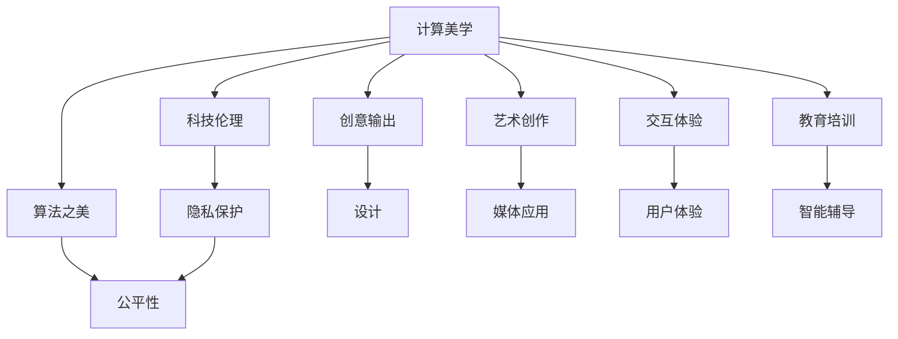

                 

# 科技与人文的交汇：人类计算的独特价值

> 关键词：人工智能,计算与文化,数据与人文,科技伦理,计算机美学,算法之美

## 1. 背景介绍

### 1.1 问题由来
随着人工智能技术的飞速发展，人类计算逐步从机器计算向智能计算转变，深刻影响着人类的思维方式和社会结构。计算不再局限于数学和逻辑计算，而是拓展到了自然语言处理、计算机视觉、情感智能等更多领域。人类计算的独特价值逐渐显露出来，促使人们重新思考计算与文化、科技与伦理、算法与人文之间的关系。

在技术层面上，人工智能的进步基于对大数据的依赖和复杂算法的运用。这些算法不仅改变了我们处理数据的方式，也重塑了我们对知识的理解。在人文层面上，人工智能在文学创作、历史分析、艺术创作等领域的尝试，不仅推动了技术的边界，也引发了关于创造、伦理、价值观的深层次思考。

### 1.2 问题核心关键点
如何平衡人工智能的强大计算能力和人文价值的伦理规范，是当前技术应用中的核心挑战。计算能力与人文价值的交汇点，是计算美学、科技伦理和算法之美的体现，也是未来技术发展的关键方向。

1. **计算美学**：计算在形式和效果上的美学价值，即计算机如何通过算法和模型表达艺术美感。
2. **科技伦理**：人工智能在应用中的伦理问题，如隐私保护、数据安全、公平性等。
3. **算法之美**：算法在解决问题和提升效率上的美学价值，即算法如何通过简洁有效的逻辑结构解决复杂问题。

本文将从这三个维度深入探讨人类计算的独特价值，并通过具体案例和模型分析，揭示计算与文化的深度融合，以及科技与伦理的辩证关系。

## 2. 核心概念与联系

### 2.1 核心概念概述

为更好地理解人类计算的独特价值，本节将介绍几个关键概念：

- **计算美学**：计算在艺术、设计等领域的审美价值，包括形式、结构和效果的美学表达。
- **科技伦理**：人工智能在应用中涉及的伦理问题，如隐私保护、公平性、责任归属等。
- **算法之美**：算法在解决问题和提升效率上的美学价值，即简洁有效的逻辑结构带来的高效和优雅。

这些概念之间的联系可以通过以下Mermaid流程图来展示：



这个流程图展示出计算美学、科技伦理和算法之美之间的联系和融合：

1. 计算美学在创意输出、设计、艺术创作等方面，引导着科技伦理的思考和实践。
2. 科技伦理涉及隐私保护和公平性问题，需要算法之美提供技术支持。
3. 算法之美在教育培训、智能辅导等方面，促进计算美学和科技伦理的落地应用。

## 3. 核心算法原理 & 具体操作步骤
### 3.1 算法原理概述

人类计算的独特价值主要体现在以下几个方面：

- **计算美学**：通过算法和模型设计，在形式和效果上实现美学价值，提升艺术创作和设计水平。
- **科技伦理**：在人工智能应用中，通过数据处理和模型训练，遵循伦理规范，保护用户隐私，确保模型公平。
- **算法之美**：通过简洁有效的算法逻辑，解决问题和提升效率，实现高效和优雅的计算过程。

### 3.2 算法步骤详解

以计算美学为例，我们可以使用深度学习模型生成艺术作品。通过训练模型，使其能够根据输入的文本描述，生成具有特定风格和特点的艺术作品。具体操作步骤如下：

1. **数据准备**：收集和标注大量的艺术作品，包括文本描述和对应的图像数据。
2. **模型训练**：使用预训练的图像生成模型，如GAN、VQ-VAE等，通过监督学习训练生成模型。
3. **样式迁移**：将文本描述输入到训练好的生成模型中，输出具有特定风格和特点的艺术作品。

### 3.3 算法优缺点

计算美学的优点在于：

- 能够通过模型生成具有创意和美感的艺术作品，丰富了艺术的创作形式。
- 能够通过算法优化，提高艺术作品生成的效率和质量。

缺点在于：

- 生成作品的原创性问题，可能会引发版权和伦理争议。
- 模型的训练和优化过程较为复杂，需要大量的计算资源和数据支持。

### 3.4 算法应用领域

计算美学在多个领域中得到了应用，如：

- **艺术创作**：生成新的绘画、雕塑、音乐等艺术作品。
- **设计**：生成时尚设计、建筑设计、平面设计等创意作品。
- **媒体应用**：生成广告、动画、电影特效等视觉效果。
- **交互体验**：生成沉浸式虚拟现实环境，提升用户体验。

## 4. 数学模型和公式 & 详细讲解 & 举例说明

### 4.1 数学模型构建

计算美学的数学模型通常基于生成对抗网络（GAN）或变分自编码器（VAE）。以GAN为例，其数学模型包括：

- **生成器（G）**：将随机噪声$z$映射到艺术作品图像$x$。
- **判别器（D）**：判断输入图像$x$是否为真实艺术品，输出概率$y$。
- **损失函数**：生成器损失$L_G$和判别器损失$L_D$，如交叉熵损失、梯度惩罚等。

数学公式如下：

$$
L_G = \mathbb{E}_{z \sim p(z)} [\log D(G(z))]
$$

$$
L_D = \mathbb{E}_{x \sim p_{data}(x)} [\log D(x)] + \mathbb{E}_{z \sim p(z)} [\log (1-D(G(z)))]
$$

其中，$p(z)$为噪声分布，$p_{data}(x)$为真实数据分布。

### 4.2 公式推导过程

GAN的推导基于对抗博弈的思路，生成器和判别器相互博弈，优化目标如下：

- 生成器希望最大化其生成艺术作品的逼真度，即最大化$D(G(z))$。
- 判别器希望最大化其区分真实艺术品和生成艺术品的概率，即最大化$\log D(x)$和$\log (1-D(G(z)))$。

通过梯度下降优化，生成器和判别器不断调整自身策略，直至达到最优解。最终的生成器能够生成逼真度高的艺术作品。

### 4.3 案例分析与讲解

以下是一个具体的案例分析：

- **输入**：文本描述“一幅抽象的现代画作，色彩斑斓，线条粗犷，艺术家毕加索”。
- **过程**：将文本描述输入到训练好的GAN生成模型中，生成具有毕加索风格的艺术作品。
- **输出**：一幅符合描述的现代画作，展现抽象的艺术风格。

## 5. 项目实践：代码实例和详细解释说明

### 5.1 开发环境搭建

在进行计算美学项目实践前，我们需要准备好开发环境。以下是使用Python进行TensorFlow开发的环境配置流程：

1. 安装Anaconda：从官网下载并安装Anaconda，用于创建独立的Python环境。

2. 创建并激活虚拟环境：
```bash
conda create -n tf-env python=3.8 
conda activate tf-env
```

3. 安装TensorFlow：根据CUDA版本，从官网获取对应的安装命令。例如：
```bash
conda install tensorflow=2.6 -c tensorflow -c conda-forge
```

4. 安装Keras：
```bash
pip install keras
```

5. 安装各类工具包：
```bash
pip install numpy pandas scikit-learn matplotlib tqdm jupyter notebook ipython
```

完成上述步骤后，即可在`tf-env`环境中开始计算美学项目的开发。

### 5.2 源代码详细实现

以下是使用TensorFlow进行GAN模型实现的艺术创作代码：

```python
import tensorflow as tf
from tensorflow.keras import layers

# 生成器模型
def make_generator_model():
    model = tf.keras.Sequential()
    model.add(layers.Dense(256, use_bias=False, input_shape=(100,)))
    model.add(layers.BatchNormalization())
    model.add(layers.LeakyReLU())
    
    model.add(layers.Dense(512))
    model.add(layers.BatchNormalization())
    model.add(layers.LeakyReLU())
    
    model.add(layers.Dense(1024))
    model.add(layers.BatchNormalization())
    model.add(layers.LeakyReLU())
    
    model.add(layers.Dense(784, activation='tanh'))
    model.add(layers.Reshape((28, 28, 1)))
    return model

# 判别器模型
def make_discriminator_model():
    model = tf.keras.Sequential()
    model.add(layers.Conv2D(64, (3,3), strides=2, padding='same',
                           input_shape=[28, 28, 1]))
    model.add(layers.LeakyReLU())
    model.add(layers.Dropout(0.3))
    
    model.add(layers.Conv2D(128, (3,3), strides=2, padding='same'))
    model.add(layers.LeakyReLU())
    model.add(layers.Dropout(0.3))
    
    model.add(layers.Flatten())
    model.add(layers.Dense(1))
    
    return model

# 训练过程
def train(model, train_dataset, epochs, batch_size):
    for epoch in range(epochs):
        for images, labels in train_dataset:
            noise = tf.random.normal([batch_size, 100])
            generated_images = model[0](noise)
            real_images = images
            real_labels = labels
            fake_labels = tf.zeros_like(real_labels)
            
            with tf.GradientTape() as gen_tape, tf.GradientTape() as disc_tape:
                gen_loss = loss_gen(model, real_images, real_labels, generated_images, fake_labels)
                disc_loss = loss_disc(model, real_images, real_labels, generated_images, fake_labels)
            
            gradients_of_generator = gen_tape.gradient(gen_loss, model[0].trainable_variables)
            gradients_of_discriminator = disc_tape.gradient(disc_loss, model[1].trainable_variables)
            
            optimizer.apply_gradients(zip(gradients_of_generator, model[0].trainable_variables))
            optimizer.apply_gradients(zip(gradients_of_discriminator, model[1].trainable_variables))

# 损失函数
def loss_gen(model, real_images, real_labels, generated_images, fake_labels):
    gen_loss = cross_entropy_loss(model, real_images, real_labels, generated_images, fake_labels)
    gen_loss = tf.reduce_mean(gen_loss)
    return gen_loss

def loss_disc(model, real_images, real_labels, generated_images, fake_labels):
    disc_loss = cross_entropy_loss(model, real_images, real_labels, generated_images, fake_labels)
    disc_loss = tf.reduce_mean(disc_loss)
    return disc_loss

# 交叉熵损失
def cross_entropy_loss(model, real_images, real_labels, generated_images, fake_labels):
    real_loss = tf.reduce_mean(tf.nn.sigmoid_cross_entropy_with_logits(logits=model[1](real_images), labels=real_labels))
    fake_loss = tf.reduce_mean(tf.nn.sigmoid_cross_entropy_with_logits(logits=model[1](generated_images), labels=fake_labels))
    return real_loss + fake_loss

# 数据生成器
train_dataset = ...
```

### 5.3 代码解读与分析

让我们再详细解读一下关键代码的实现细节：

**make_generator_model和make_discriminator_model函数**：
- `make_generator_model`：定义生成器模型结构，包括三个密集层，最后一层为输出层。
- `make_discriminator_model`：定义判别器模型结构，包括两个卷积层、两个LeakyReLU层、一个Flatten层和一个全连接层。

**train函数**：
- 遍历训练集，每个批次生成随机噪声，使用生成器模型生成艺术作品。
- 计算生成器和判别器的损失，并使用梯度下降优化。

**loss_gen和loss_disc函数**：
- `loss_gen`：计算生成器的损失，包括真实图像的损失和生成图像的损失。
- `loss_disc`：计算判别器的损失，包括真实图像的损失和生成图像的损失。

**cross_entropy_loss函数**：
- 使用交叉熵损失计算生成器和判别器的损失，返回总损失。

以上代码展示了使用TensorFlow实现GAN模型的完整过程。开发者可以通过修改模型结构、损失函数等参数，进行更深入的优化。

## 6. 实际应用场景

### 6.1 艺术创作

计算美学在艺术创作中有着广泛的应用，如：

- **视觉艺术创作**：生成绘画、雕塑、摄影等作品。通过输入文本描述，生成具有特定风格和特点的艺术作品。
- **音乐创作**：生成乐曲、合成器音乐等音乐作品。通过输入文本描述，生成具有特定旋律和节奏的乐曲。
- **文学创作**：生成诗歌、小说等文学作品。通过输入文本描述，生成具有特定风格和题材的文学作品。

### 6.2 设计

计算美学在设计中的应用主要体现在：

- **平面设计**：生成海报、广告、宣传册等设计作品。通过输入文本描述，生成具有特定风格和布局的设计作品。
- **建筑设计**：生成建筑方案、室内设计、景观设计等作品。通过输入文本描述，生成具有特定风格和功能的设计作品。
- **时尚设计**：生成服饰设计、配饰设计等作品。通过输入文本描述，生成具有特定风格和元素的设计作品。

### 6.3 媒体应用

计算美学在媒体应用中的应用主要体现在：

- **动画制作**：生成动画角色、场景、背景等。通过输入文本描述，生成具有特定风格和动态的动画内容。
- **电影特效**：生成电影场景、角色、特效等。通过输入文本描述，生成具有特定风格和效果的电影内容。
- **游戏开发**：生成游戏角色、场景、道具等。通过输入文本描述，生成具有特定风格和互动性的游戏内容。

## 7. 工具和资源推荐

### 7.1 学习资源推荐

为了帮助开发者系统掌握计算美学和人工智能的理论基础和实践技巧，这里推荐一些优质的学习资源：

1. **Deep Learning Specialization by Andrew Ng**：斯坦福大学的深度学习课程，详细介绍了深度学习的基本原理和应用。
2. **Python Deep Learning by François Chollet**：深度学习库Keras的官方文档，涵盖深度学习的核心算法和实践。
3. **Neural Style Transfer**：由视觉艺术家Alec Jacobson和博士研究生Justin Johnson开发的计算美学应用，展示了如何使用深度学习生成艺术作品。
4. **Generative Adversarial Networks by Ian Goodfellow**：生成对抗网络领域的经典论文，介绍了GAN的基本概念和算法。
5. **Crowds and Markets**：由经济学家Econophysics的博客，探讨了计算美学和计算机艺术的经济学视角，深入浅出地讲解了相关原理。

通过对这些资源的学习实践，相信你一定能够快速掌握计算美学和人工智能的精髓，并用于解决实际的计算艺术问题。

### 7.2 开发工具推荐

高效的开发离不开优秀的工具支持。以下是几款用于计算美学和人工智能开发的常用工具：

1. **PyTorch**：基于Python的开源深度学习框架，灵活动态的计算图，适合快速迭代研究。
2. **TensorFlow**：由Google主导开发的开源深度学习框架，生产部署方便，适合大规模工程应用。
3. **Jupyter Notebook**：交互式的代码编辑器，支持多种编程语言和库，方便进行实验和分享。
4. **Weights & Biases**：模型训练的实验跟踪工具，可以记录和可视化模型训练过程中的各项指标，方便对比和调优。
5. **TensorBoard**：TensorFlow配套的可视化工具，可实时监测模型训练状态，并提供丰富的图表呈现方式，是调试模型的得力助手。

合理利用这些工具，可以显著提升计算美学和人工智能的开发效率，加快创新迭代的步伐。

### 7.3 相关论文推荐

计算美学和人工智能的发展源于学界的持续研究。以下是几篇奠基性的相关论文，推荐阅读：

1. **Generative Adversarial Networks**（Ian Goodfellow等，2014）：提出了GAN的基本概念和算法，展示了生成对抗网络的强大潜力。
2. **Generative Adversarial Text**（Alex C. T. Kao等，2019）：将GAN应用于文本生成，生成具有特定风格和语义的文本内容。
3. **StyleGAN**（Tinghui Zhou等，2019）：提出了StyleGAN算法，用于生成具有多样性和逼真度的图像内容。
4. **DALL-E**（OpenAI，2021）：使用GAN和深度学习技术，生成具有创意和美感的图像内容，展示了计算美学的最新进展。
5. **Neural Style Transfer**（Justin Johnson等，2016）：展示了如何使用神经网络进行图像风格的迁移和转换，生成具有特定风格和效果的图像内容。

这些论文代表了大模型微调技术的发展脉络。通过学习这些前沿成果，可以帮助研究者把握学科前进方向，激发更多的创新灵感。

## 8. 总结：未来发展趋势与挑战

### 8.1 总结

本文对计算美学和人工智能的独特价值进行了全面系统的介绍。首先阐述了计算美学、科技伦理和算法之美在技术应用中的重要性，明确了其对人工智能发展的深远影响。其次，从原理到实践，详细讲解了计算美学和人工智能的数学模型和操作步骤，给出了具体的代码实现和案例分析。同时，本文还广泛探讨了计算美学在艺术创作、设计、媒体应用等领域的广泛应用，展示了其独特魅力和广阔前景。此外，本文精选了计算美学和人工智能的相关学习资源，力求为读者提供全方位的技术指引。

通过本文的系统梳理，可以看到，计算美学和人工智能在艺术创作、设计、媒体应用等领域展现出的强大能力，以及其对人类文化、伦理、价值观的深刻影响。未来，伴随技术的发展，计算美学和人工智能必将在更多领域中得到应用，推动人类社会向着更加智能化、普适化方向发展。

### 8.2 未来发展趋势

展望未来，计算美学和人工智能的发展趋势如下：

1. **跨领域融合**：计算美学和人工智能将在更多领域中得到应用，如医疗、教育、金融等，推动这些领域的技术升级和产业变革。
2. **智能交互**：计算美学和人工智能将更多地应用于智能交互系统，提升人机交互的自然性和沉浸感。
3. **个性化推荐**：计算美学和人工智能将在个性化推荐系统中得到广泛应用，提升推荐精度和用户体验。
4. **智能辅导**：计算美学和人工智能将在智能辅导领域发挥重要作用，提升教育质量和效率。
5. **多模态融合**：计算美学和人工智能将更多地应用于多模态数据融合，提升数据的综合利用和分析能力。
6. **计算美学**：计算美学在艺术创作、设计、媒体应用等领域将得到更广泛的应用，推动创意产业的发展。

以上趋势凸显了计算美学和人工智能的广阔前景。这些方向的探索发展，必将进一步提升计算美学和人工智能的性能和应用范围，为人类认知智能的进化带来深远影响。

### 8.3 面临的挑战

尽管计算美学和人工智能已经取得了瞩目成就，但在迈向更加智能化、普适化应用的过程中，仍面临诸多挑战：

1. **数据依赖**：计算美学和人工智能依赖大量的数据支持，数据获取和标注成本较高，难以满足所有需求。
2. **伦理问题**：计算美学和人工智能在应用中涉及隐私保护、数据安全、公平性等问题，需要建立完善的伦理规范。
3. **计算资源**：大规模模型和复杂算法的计算需求较大，需要高性能计算资源的支持。
4. **模型鲁棒性**：计算美学和人工智能在面对噪声、扰动等问题时，模型鲁棒性有待提升。
5. **公平性和可解释性**：计算美学和人工智能的输出结果需要具备公平性和可解释性，避免偏见和歧视。
6. **模型复杂性**：计算美学和人工智能的模型结构复杂，难以理解和调试。

正视这些挑战，积极应对并寻求突破，是计算美学和人工智能技术走向成熟的必由之路。相信随着学界和产业界的共同努力，这些挑战终将一一被克服，计算美学和人工智能必将在构建安全、可靠、可解释、可控的智能系统方面发挥更大作用。

### 8.4 研究展望

未来，计算美学和人工智能的研究将向以下几个方向发展：

1. **伦理导向**：将伦理和价值观引入计算美学和人工智能的开发和应用中，确保其符合人类社会的道德标准。
2. **人机协同**：推动计算美学和人工智能与人类创意、智慧的协同发展，提升系统的综合能力。
3. **跨领域应用**：拓展计算美学和人工智能在更多领域的应用，推动技术进步和产业升级。
4. **计算美学**：提升计算美学在艺术创作、设计、媒体应用等领域的创新能力和表现力。
5. **多模态融合**：将计算美学和人工智能应用于多模态数据融合，提升数据的综合利用和分析能力。
6. **智能交互**：推动计算美学和人工智能在智能交互系统中的应用，提升人机交互的自然性和沉浸感。

这些研究方向将引领计算美学和人工智能技术迈向更高的台阶，为构建安全、可靠、可解释、可控的智能系统铺平道路。面向未来，计算美学和人工智能技术还需要与其他人工智能技术进行更深入的融合，如知识表示、因果推理、强化学习等，多路径协同发力，共同推动自然语言理解和智能交互系统的进步。只有勇于创新、敢于突破，才能不断拓展计算美学和人工智能的边界，让智能技术更好地造福人类社会。

## 9. 附录：常见问题与解答

**Q1：计算美学和人工智能是否适用于所有艺术创作和设计？**

A: 计算美学和人工智能在艺术创作和设计中的应用有着广泛的前景，但并不适用于所有类型。例如，对于高度个性化、手工艺术创作，计算机难以完全替代人类创意。而对于一些结构性较强、逻辑性较强的工作，如建筑设计、平面设计等，计算美学和人工智能能够提供有力的支持。

**Q2：计算美学和人工智能的输出结果是否具备可解释性？**

A: 当前计算美学和人工智能的输出结果往往缺乏可解释性，难以理解其内部工作机制和决策逻辑。对于医疗、金融等高风险应用，算法的可解释性和可审计性尤为重要。未来，通过引入因果分析和博弈论工具，可以增强模型的可解释性和可控性。

**Q3：计算美学和人工智能的输出是否具备创造性？**

A: 计算美学和人工智能在输出创造性方面的表现因任务而异。一些创作性任务，如音乐创作、文学创作等，需要较强的创造力和创新思维，计算机难以完全替代。而对于一些结构性较强、逻辑性较强的工作，如建筑设计、平面设计等，计算美学和人工智能能够提供有力的支持。

**Q4：计算美学和人工智能的输出是否具备伦理问题？**

A: 计算美学和人工智能在应用中涉及隐私保护、数据安全、公平性等问题，需要建立完善的伦理规范。例如，在生成艺术作品时，需要确保版权和使用权的合法性，避免侵犯他人知识产权。在设计和应用过程中，需要确保公平性和无偏见，避免对特定群体产生歧视性影响。

通过以上分析，可以看到计算美学和人工智能在艺术创作、设计、媒体应用等领域展现出的强大能力，以及其对人类文化、伦理、价值观的深刻影响。未来，伴随技术的发展，计算美学和人工智能必将在更多领域中得到应用，推动人类社会向着更加智能化、普适化方向发展。

作者：禅与计算机程序设计艺术 / Zen and the Art of Computer Programming

