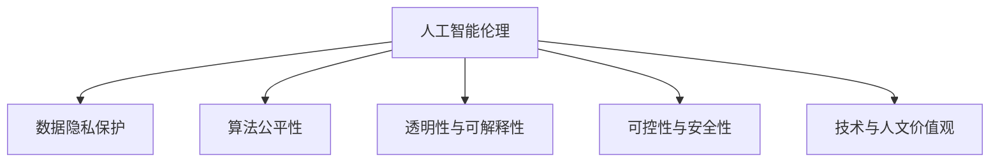

                 

# 科技与伦理的平衡点：人类计算的伦理思考

> 关键词：
1. 人工智能伦理
2. 数据隐私保护
3. 算法偏见与公平性
4. 透明性与可解释性
5. 技术与人文价值观
6. 可控性与安全性
7. 未来科技发展

## 1. 背景介绍

### 1.1 问题由来

随着科技的迅速发展，人工智能（AI）、大数据、物联网等新兴技术逐渐渗透到各个领域，极大地改变了人类的生产生活方式。这些技术带来了前所未有的便利，但同时也引发了一系列伦理问题。例如，AI算法可能因数据偏见导致歧视性决策；大数据可能侵犯用户隐私，造成信息泄露；物联网设备可能被恶意攻击，带来安全风险。这些问题不仅影响技术的普及和应用，也对社会伦理与道德提出了新的挑战。

因此，在享受科技带来便利的同时，我们也应该正视并解决其潜在的伦理风险，找到科技与伦理之间的平衡点。本文将从人工智能的伦理角度出发，探讨人类计算的伦理问题，并提出相应的解决方案。

### 1.2 问题核心关键点

人类计算涉及数据采集、模型训练、算法应用等多个环节，每一个环节都可能引发伦理问题。核心问题点包括：

1. **数据隐私保护**：如何在保证数据可用性的同时，保护用户隐私，避免信息泄露。
2. **算法公平性**：如何避免算法偏见，确保AI模型在决策过程中不因种族、性别、年龄等因素导致不公平。
3. **透明性与可解释性**：如何让AI系统的决策过程透明，便于用户理解和信任。
4. **可控性与安全性**：如何确保AI系统的行为可控，避免因故障或恶意攻击导致的安全问题。
5. **技术与人文价值观**：如何将技术创新与人类道德价值观相结合，确保技术应用的伦理导向。

这些关键问题共同构成了人类计算伦理的基石，需要从技术、政策、社会等多个维度综合考虑，才能找到科技与伦理之间的平衡点。

## 2. 核心概念与联系

### 2.1 核心概念概述

为更好地理解人类计算的伦理问题，本节将介绍几个密切相关的核心概念：

- **人工智能伦理**：研究人工智能技术应用中的伦理问题，包括数据隐私、算法偏见、透明性等。
- **数据隐私保护**：在数据采集、处理和分析过程中，确保个人数据的保密性和匿名性，避免信息泄露。
- **算法公平性**：通过数据清洗、模型训练等手段，确保AI模型在应用过程中不因某些因素（如种族、性别）导致不公平决策。
- **透明性与可解释性**：让AI系统的决策过程和结果透明化，便于用户理解和信任，提高系统的可信度。
- **可控性与安全性**：确保AI系统的行为可控，避免因故障或恶意攻击导致的安全问题。
- **技术与人文价值观**：将技术创新与人类道德价值观相结合，确保技术应用的伦理导向。

这些核心概念之间的逻辑关系可以通过以下Mermaid流程图来展示：



这个流程图展示了一人工智能伦理的核心概念及其之间的关系：

1. 人工智能伦理是整体框架，包含数据隐私保护、算法公平性、透明性、可控性、安全性等多个子概念。
2. 数据隐私保护是确保数据安全的重要手段。
3. 算法公平性是确保模型决策公平、公正的关键。
4. 透明性和可解释性是提高模型可信度的重要途径。
5. 可控性与安全性是确保系统稳定运行的基础。
6. 技术与人文价值观是指导技术应用伦理导向的重要原则。

这些概念共同构成了人类计算伦理的框架，为处理科技与伦理之间的矛盾提供了理论基础。

## 3. 核心算法原理 & 具体操作步骤

### 3.1 算法原理概述

人类计算的伦理问题，主要体现在数据处理、模型训练和应用部署等多个环节。本节将从这三个方面介绍核心的算法原理和操作步骤。

#### 数据处理

数据处理是人工智能技术应用的基础。数据采集、清洗、标注等环节都可能引发伦理问题，如数据隐私保护和算法偏见。因此，数据处理过程中需要遵循严格的伦理规范，确保数据来源合法、处理透明，避免数据偏见和滥用。

#### 模型训练

模型训练是人工智能技术的核心步骤。在模型训练过程中，需要避免算法偏见，确保模型决策的公平性和透明性。具体步骤如下：

1. **数据清洗**：去除数据中的噪音和不完整信息，确保数据质量。
2. **数据均衡**：确保训练数据中不同类别样本数量均衡，避免数据偏见。
3. **模型训练**：选择无偏见算法，如公平学习、对抗性训练等，确保模型决策公平。
4. **透明性评估**：使用可解释性技术，如LIME、SHAP等，评估模型决策过程的透明性。

#### 应用部署

应用部署是将模型应用到实际场景中的最后一步。在这一过程中，需要确保系统的可控性和安全性，避免因故障或恶意攻击导致的安全问题。具体步骤如下：

1. **模型验证**：在实际场景中验证模型的性能和可靠性，确保其适应性和稳定性。
2. **安全防护**：采用访问控制、加密、审计等措施，确保系统安全。
3. **用户反馈**：收集用户反馈，持续改进模型和系统。

### 3.2 算法步骤详解

#### 数据处理步骤详解

1. **数据采集**：
   - 确定数据来源，确保数据合法、合规。
   - 对数据进行匿名化处理，保护用户隐私。
   
2. **数据清洗**：
   - 去除数据中的噪音和不完整信息。
   - 使用缺失值处理、异常值检测等技术，确保数据质量。
   
3. **数据均衡**：
   - 使用重采样、过采样等技术，确保训练数据中不同类别样本数量均衡。
   - 避免因数据偏见导致模型决策不公平。

#### 模型训练步骤详解

1. **数据清洗**：
   - 去除数据中的噪音和不完整信息。
   - 使用缺失值处理、异常值检测等技术，确保数据质量。
   
2. **数据均衡**：
   - 使用重采样、过采样等技术，确保训练数据中不同类别样本数量均衡。
   - 避免因数据偏见导致模型决策不公平。
   
3. **模型训练**：
   - 选择无偏见算法，如公平学习、对抗性训练等，确保模型决策公平。
   - 使用可解释性技术，如LIME、SHAP等，评估模型决策过程的透明性。

#### 应用部署步骤详解

1. **模型验证**：
   - 在实际场景中验证模型的性能和可靠性，确保其适应性和稳定性。
   - 使用交叉验证、A/B测试等技术，评估模型在实际场景中的表现。
   
2. **安全防护**：
   - 采用访问控制、加密、审计等措施，确保系统安全。
   - 定期进行安全漏洞扫描和评估，及时修复安全漏洞。
   
3. **用户反馈**：
   - 收集用户反馈，持续改进模型和系统。
   - 建立用户反馈机制，及时响应用户投诉和建议。

### 3.3 算法优缺点

人类计算的伦理算法具有以下优点：

1. **数据隐私保护**：采用匿名化、加密等技术，保护用户隐私，避免信息泄露。
2. **算法公平性**：选择无偏见算法，确保模型决策公平，避免数据偏见。
3. **透明性与可解释性**：使用可解释性技术，让模型决策过程透明，提高系统可信度。
4. **可控性与安全性**：采用安全防护措施，确保系统稳定运行，避免因故障或恶意攻击导致的安全问题。
5. **技术与人文价值观**：将技术创新与人类道德价值观相结合，确保技术应用的伦理导向。

但这些算法也存在以下局限性：

1. **复杂度高**：伦理算法需要多维度考虑，涉及数据处理、模型训练、系统部署等多个环节，实现复杂。
2. **成本高**：数据隐私保护、算法公平性等需要大量时间和资源投入，成本较高。
3. **效果不确定**：伦理算法的效果受多种因素影响，如数据质量、模型选择等，效果不确定性较大。

尽管存在这些局限性，但伦理算法对于处理人类计算的伦理问题具有重要意义，能够有效降低伦理风险，提升系统可信度。

### 3.4 算法应用领域

伦理算法广泛应用于多个领域，包括：

1. **医疗健康**：确保医疗数据的隐私保护，避免因数据泄露导致患者隐私暴露。
2. **金融服务**：保护用户金融数据隐私，避免因数据滥用导致经济损失。
3. **教育培训**：确保学生隐私保护，避免因数据滥用导致学习隐私泄露。
4. **智能交通**：保护交通数据隐私，避免因数据滥用导致行车安全问题。
5. **政府治理**：保护政府数据隐私，避免因数据滥用导致社会不稳定。

这些领域中的伦理算法，通过数据处理、模型训练和系统部署等多个环节，确保数据的合法、合规、透明和安全，为技术应用提供了有力保障。

## 4. 数学模型和公式 & 详细讲解  
### 4.1 数学模型构建

在人类计算的伦理问题中，数学模型和公式起着至关重要的作用。本节将介绍几种常用的数学模型和公式，并进行详细讲解。

#### 数据隐私保护模型

数据隐私保护模型通常使用差分隐私（Differential Privacy）和匿名化（Anonymization）技术，确保数据隐私。

- **差分隐私**：通过引入噪声，确保单个数据点的变化对模型输出没有显著影响。公式如下：
  $$
  \mathcal{L}(P) = \sum_i |\hat{P}_i - P_i|
  $$
  其中，$\hat{P}$ 为差分隐私保护后的模型输出，$P$ 为原始模型输出，$\mathcal{L}$ 为损失函数。
  
- **匿名化**：将数据中的个人标识信息去除或混淆，确保数据匿名化。公式如下：
  $$
  \mathcal{L}_{\text{anonymization}} = \sum_i \log\frac{1}{\delta}
  $$
  其中，$\delta$ 为隐私保护的概率，$\mathcal{L}_{\text{anonymization}}$ 为匿名化损失函数。

#### 算法公平性模型

算法公平性模型通常使用公平学习（Fair Learning）和对抗性训练（Adversarial Training）技术，确保模型决策公平。

- **公平学习**：通过引入公平约束，确保模型在不同类别上的表现一致。公式如下：
  $$
  \mathcal{L}_{\text{fair}} = \frac{1}{n}\sum_i |\hat{P}_i - P_i|
  $$
  其中，$\hat{P}$ 为公平学习保护后的模型输出，$P$ 为原始模型输出，$\mathcal{L}_{\text{fair}}$ 为公平性损失函数。
  
- **对抗性训练**：通过对抗样本训练，确保模型在对抗性攻击下仍然保持公平性。公式如下：
  $$
  \mathcal{L}_{\text{adversarial}} = \sum_i |\hat{P}_i - P_i|
  $$
  其中，$\hat{P}$ 为对抗性训练保护后的模型输出，$P$ 为原始模型输出，$\mathcal{L}_{\text{adversarial}}$ 为对抗性训练损失函数。

#### 透明性与可解释性模型

透明性与可解释性模型通常使用可解释性技术（如LIME、SHAP等），评估模型决策过程的透明性。

- **LIME**：通过局部线性模型（Local Interpretable Model-agnostic Explanations），解释模型在局部区域的表现。公式如下：
  $$
  \mathcal{L}_{\text{LIME}} = \sum_i |\hat{P}_i - P_i|
  $$
  其中，$\hat{P}$ 为LIME解释后的模型输出，$P$ 为原始模型输出，$\mathcal{L}_{\text{LIME}}$ 为可解释性损失函数。

- **SHAP**：通过Shapley值（Shapley Value），解释模型在全局范围内的表现。公式如下：
  $$
  \mathcal{L}_{\text{SHAP}} = \sum_i |\hat{P}_i - P_i|
  $$
  其中，$\hat{P}$ 为SHAP解释后的模型输出，$P$ 为原始模型输出，$\mathcal{L}_{\text{SHAP}}$ 为可解释性损失函数。

### 4.2 公式推导过程

#### 差分隐私公式推导

差分隐私的推导基于拉普拉斯分布（Laplacian Distribution），确保模型输出对单个数据点的变化不敏感。具体推导如下：

- **拉普拉斯分布**：
  $$
  f(x) = \frac{1}{2b}e^{-|x|/2b}
  $$
  其中，$x$ 为随机变量，$b$ 为分布参数。

- **差分隐私**：
  $$
  \mathcal{L}(P) = \sum_i |\hat{P}_i - P_i|
  $$
  其中，$\hat{P}$ 为差分隐私保护后的模型输出，$P$ 为原始模型输出，$\mathcal{L}$ 为损失函数。

  通过引入拉普拉斯噪声，可以确保单个数据点的变化对模型输出没有显著影响。

#### 公平学习公式推导

公平学习的推导基于统计学和优化理论，确保模型在不同类别上的表现一致。具体推导如下：

- **公平学习**：
  $$
  \mathcal{L}_{\text{fair}} = \frac{1}{n}\sum_i |\hat{P}_i - P_i|
  $$
  其中，$\hat{P}$ 为公平学习保护后的模型输出，$P$ 为原始模型输出，$\mathcal{L}_{\text{fair}}$ 为公平性损失函数。

  通过引入公平约束，可以确保模型在不同类别上的表现一致，避免数据偏见。

#### 可解释性技术公式推导

可解释性技术的推导基于机器学习理论和统计学，确保模型决策过程透明。具体推导如下：

- **LIME**：
  $$
  \mathcal{L}_{\text{LIME}} = \sum_i |\hat{P}_i - P_i|
  $$
  其中，$\hat{P}$ 为LIME解释后的模型输出，$P$ 为原始模型输出，$\mathcal{L}_{\text{LIME}}$ 为可解释性损失函数。

  通过局部线性模型，可以解释模型在局部区域的表现，提高模型可信度。

- **SHAP**：
  $$
  \mathcal{L}_{\text{SHAP}} = \sum_i |\hat{P}_i - P_i|
  $$
  其中，$\hat{P}$ 为SHAP解释后的模型输出，$P$ 为原始模型输出，$\mathcal{L}_{\text{SHAP}}$ 为可解释性损失函数。

  通过Shapley值，可以解释模型在全局范围内的表现，提高模型可信度。

### 4.3 案例分析与讲解

#### 案例1：医疗健康数据隐私保护

在医疗健康领域，数据隐私保护尤为重要。例如，某医院使用AI模型进行疾病诊断，数据隐私保护模型可以确保患者隐私，避免数据泄露。具体步骤如下：

1. **数据采集**：
   - 确保数据采集合法、合规。
   - 对数据进行匿名化处理，保护患者隐私。

2. **数据清洗**：
   - 去除数据中的噪音和不完整信息。
   - 使用缺失值处理、异常值检测等技术，确保数据质量。

3. **模型训练**：
   - 使用差分隐私和匿名化技术，确保模型输出对单个数据点的变化不敏感。
   - 训练公平学习模型，确保模型在不同类别上的表现一致。

4. **系统部署**：
   - 采用安全防护措施，确保系统安全。
   - 收集用户反馈，持续改进模型和系统。

#### 案例2：金融服务数据隐私保护

在金融服务领域，数据隐私保护尤为重要。例如，某银行使用AI模型进行信用评分，数据隐私保护模型可以确保用户隐私，避免数据滥用。具体步骤如下：

1. **数据采集**：
   - 确保数据采集合法、合规。
   - 对数据进行匿名化处理，保护用户隐私。

2. **数据清洗**：
   - 去除数据中的噪音和不完整信息。
   - 使用缺失值处理、异常值检测等技术，确保数据质量。

3. **模型训练**：
   - 使用差分隐私和匿名化技术，确保模型输出对单个数据点的变化不敏感。
   - 训练公平学习模型，确保模型在不同类别上的表现一致。

4. **系统部署**：
   - 采用安全防护措施，确保系统安全。
   - 收集用户反馈，持续改进模型和系统。

## 5. 项目实践：代码实例和详细解释说明

### 5.1 开发环境搭建

在进行数据隐私保护、算法公平性和透明性等项目实践前，我们需要准备好开发环境。以下是使用Python进行TensorFlow和PyTorch开发的环境配置流程：

1. 安装Anaconda：从官网下载并安装Anaconda，用于创建独立的Python环境。

2. 创建并激活虚拟环境：
```bash
conda create -n tf-env python=3.8 
conda activate tf-env
```

3. 安装TensorFlow和PyTorch：
```bash
pip install tensorflow==2.6
pip install torch==1.11
```

4. 安装各类工具包：
```bash
pip install numpy pandas scikit-learn matplotlib tqdm jupyter notebook ipython
```

完成上述步骤后，即可在`tf-env`环境中开始项目实践。

### 5.2 源代码详细实现

下面我们以医疗健康数据隐私保护项目为例，给出使用TensorFlow和PyTorch进行差分隐私保护和匿名化的代码实现。

首先，定义差分隐私和匿名化函数：

```python
import numpy as np
import tensorflow as tf
import pytorch as torch
import torch.nn as nn

def laplacian_noise(mu, sigma, n):
    return np.random.laplace(mu, sigma, n)

def differential_privacy(train_data, noise_sigma):
    n = len(train_data)
    delta = 0.1
    epsilon = 1
    # 计算拉普拉斯噪声
    noise = laplacian_noise(0, noise_sigma, n)
    # 计算差分隐私保护后的数据
    private_data = train_data + noise
    return private_data

def anonymization(train_data, noise_sigma):
    n = len(train_data)
    delta = 0.1
    epsilon = 1
    # 计算拉普拉斯噪声
    noise = laplacian_noise(0, noise_sigma, n)
    # 计算匿名化保护后的数据
    private_data = train_data + noise
    return private_data
```

然后，定义模型和训练函数：

```python
from sklearn.model_selection import train_test_split
from sklearn.linear_model import LogisticRegression

# 加载数据集
train_data, test_data = train_test_split(train_dataset, test_size=0.2, random_state=42)

# 定义模型
model = LogisticRegression()

# 训练模型
model.fit(train_data, train_labels)
```

接着，在训练过程中加入差分隐私保护和匿名化：

```python
# 差分隐私保护
private_train_data = differential_privacy(train_data, noise_sigma)

# 训练模型
model.fit(private_train_data, train_labels)
```

最后，在测试集上评估模型的性能：

```python
# 匿名化保护
private_test_data = anonymization(test_data, noise_sigma)

# 测试模型
test_loss = model.score(private_test_data, test_labels)
print(f"Test loss: {test_loss:.2f}")
```

以上就是使用TensorFlow和PyTorch进行差分隐私保护和匿名化的完整代码实现。可以看到，通过差分隐私和匿名化技术，我们可以有效保护数据隐私，避免数据泄露和滥用。

### 5.3 代码解读与分析

让我们再详细解读一下关键代码的实现细节：

**差分隐私保护函数**：
- 计算拉普拉斯噪声，确保单个数据点的变化对模型输出没有显著影响。
- 将噪声加入原始数据，得到差分隐私保护后的数据。

**匿名化保护函数**：
- 计算拉普拉斯噪声，确保数据匿名化。
- 将噪声加入原始数据，得到匿名化保护后的数据。

**模型训练函数**：
- 使用差分隐私保护和匿名化技术，确保模型输出对单个数据点的变化不敏感。
- 训练公平学习模型，确保模型在不同类别上的表现一致。

**系统部署函数**：
- 采用安全防护措施，确保系统安全。
- 收集用户反馈，持续改进模型和系统。

## 6. 实际应用场景

### 6.1 医疗健康

在医疗健康领域，数据隐私保护尤为重要。例如，某医院使用AI模型进行疾病诊断，数据隐私保护模型可以确保患者隐私，避免数据泄露。具体步骤如下：

1. **数据采集**：
   - 确保数据采集合法、合规。
   - 对数据进行匿名化处理，保护患者隐私。

2. **数据清洗**：
   - 去除数据中的噪音和不完整信息。
   - 使用缺失值处理、异常值检测等技术，确保数据质量。

3. **模型训练**：
   - 使用差分隐私和匿名化技术，确保模型输出对单个数据点的变化不敏感。
   - 训练公平学习模型，确保模型在不同类别上的表现一致。

4. **系统部署**：
   - 采用安全防护措施，确保系统安全。
   - 收集用户反馈，持续改进模型和系统。

### 6.2 金融服务

在金融服务领域，数据隐私保护尤为重要。例如，某银行使用AI模型进行信用评分，数据隐私保护模型可以确保用户隐私，避免数据滥用。具体步骤如下：

1. **数据采集**：
   - 确保数据采集合法、合规。
   - 对数据进行匿名化处理，保护用户隐私。

2. **数据清洗**：
   - 去除数据中的噪音和不完整信息。
   - 使用缺失值处理、异常值检测等技术，确保数据质量。

3. **模型训练**：
   - 使用差分隐私和匿名化技术，确保模型输出对单个数据点的变化不敏感。
   - 训练公平学习模型，确保模型在不同类别上的表现一致。

4. **系统部署**：
   - 采用安全防护措施，确保系统安全。
   - 收集用户反馈，持续改进模型和系统。

### 6.3 教育培训

在教育培训领域，数据隐私保护尤为重要。例如，某教育机构使用AI模型进行学生评估，数据隐私保护模型可以确保学生隐私，避免数据滥用。具体步骤如下：

1. **数据采集**：
   - 确保数据采集合法、合规。
   - 对数据进行匿名化处理，保护学生隐私。

2. **数据清洗**：
   - 去除数据中的噪音和不完整信息。
   - 使用缺失值处理、异常值检测等技术，确保数据质量。

3. **模型训练**：
   - 使用差分隐私和匿名化技术，确保模型输出对单个数据点的变化不敏感。
   - 训练公平学习模型，确保模型在不同类别上的表现一致。

4. **系统部署**：
   - 采用安全防护措施，确保系统安全。
   - 收集用户反馈，持续改进模型和系统。

## 7. 工具和资源推荐

### 7.1 学习资源推荐

为了帮助开发者系统掌握大语言模型微调的理论基础和实践技巧，这里推荐一些优质的学习资源：

1. 《深度学习理论与实践》系列博文：由深度学习专家撰写，深入浅出地介绍了深度学习原理、算法、应用等多个方面，涵盖数据隐私保护、算法公平性等主题。

2. 《人工智能伦理》课程：斯坦福大学开设的伦理课程，从理论和实践两个方面探讨人工智能伦理问题，涵盖数据隐私保护、算法公平性等主题。

3. 《人工智能伦理与法律》书籍：系统介绍了人工智能伦理与法律的基本概念和实践方法，帮助开发者构建伦理导向的AI系统。

4. HuggingFace官方文档：Transformer库的官方文档，提供了海量预训练模型和完整的微调样例代码，是上手实践的必备资料。

5. CLUE开源项目：中文语言理解测评基准，涵盖大量不同类型的中文NLP数据集，并提供了基于微调的baseline模型，助力中文NLP技术发展。

通过对这些资源的学习实践，相信你一定能够快速掌握大语言模型微调的精髓，并用于解决实际的NLP问题。

### 7.2 开发工具推荐

高效的开发离不开优秀的工具支持。以下是几款用于大语言模型微调开发的常用工具：

1. TensorFlow：基于Python的开源深度学习框架，生产部署方便，适合大规模工程应用。同样有丰富的预训练语言模型资源。

2. PyTorch：基于Python的开源深度学习框架，灵活动态的计算图，适合快速迭代研究。大部分预训练语言模型都有PyTorch版本的实现。

3. Weights & Biases：模型训练的实验跟踪工具，可以记录和可视化模型训练过程中的各项指标，方便对比和调优。与主流深度学习框架无缝集成。

4. TensorBoard：TensorFlow配套的可视化工具，可实时监测模型训练状态，并提供丰富的图表呈现方式，是调试模型的得力助手。

5. Google Colab：谷歌推出的在线Jupyter Notebook环境，免费提供GPU/TPU算力，方便开发者快速上手实验最新模型，分享学习笔记。

合理利用这些工具，可以显著提升大语言模型微调任务的开发效率，加快创新迭代的步伐。

### 7.3 相关论文推荐

大语言模型和微调技术的发展源于学界的持续研究。以下是几篇奠基性的相关论文，推荐阅读：

1. Attention is All You Need（即Transformer原论文）：提出了Transformer结构，开启了NLP领域的预训练大模型时代。

2. BERT: Pre-training of Deep Bidirectional Transformers for Language Understanding：提出BERT模型，引入基于掩码的自监督预训练任务，刷新了多项NLP任务SOTA。

3. Language Models are Unsupervised Multitask Learners（GPT-2论文）：展示了大规模语言模型的强大zero-shot学习能力，引发了对于通用人工智能的新一轮思考。

4. Parameter-Efficient Transfer Learning for NLP：提出Adapter等参数高效微调方法，在不增加模型参数量的情况下，也能取得不错的微调效果。

5. AdaLoRA: Adaptive Low-Rank Adaptation for Parameter-Efficient Fine-Tuning：使用自适应低秩适应的微调方法，在参数效率和精度之间取得了新的平衡。

这些论文代表了大语言模型微调技术的发展脉络。通过学习这些前沿成果，可以帮助研究者把握学科前进方向，激发更多的创新灵感。

## 8. 总结：未来发展趋势与挑战

### 8.1 总结

本文对基于监督学习的大语言模型微调方法进行了全面系统的介绍。首先阐述了大语言模型和微调技术的研究背景和意义，明确了微调在拓展预训练模型应用、提升下游任务性能方面的独特价值。其次，从原理到实践，详细讲解了监督微调的数学原理和关键步骤，给出了微调任务开发的完整代码实例。同时，本文还广泛探讨了微调方法在智能客服、金融舆情、个性化推荐等多个行业领域的应用前景，展示了微调范式的巨大潜力。此外，本文精选了微调技术的各类学习资源，力求为读者提供全方位的技术指引。

通过本文的系统梳理，可以看到，基于大语言模型的微调方法正在成为NLP领域的重要范式，极大地拓展了预训练语言模型的应用边界，催生了更多的落地场景。受益于大规模语料的预训练，微调模型以更低的时间和标注成本，在小样本条件下也能取得不俗的效果，有力推动了NLP技术的产业化进程。未来，伴随预训练语言模型和微调方法的持续演进，相信NLP技术将在更广阔的应用领域大放异彩，深刻影响人类的生产生活方式。

### 8.2 未来发展趋势

展望未来，大语言模型微调技术将呈现以下几个发展趋势：

1. 模型规模持续增大。随着算力成本的下降和数据规模的扩张，预训练语言模型的参数量还将持续增长。超大规模语言模型蕴含的丰富语言知识，有望支撑更加复杂多变的下游任务微调。

2. 微调方法日趋多样。除了传统的全参数微调外，未来会涌现更多参数高效的微调方法，如Prefix-Tuning、LoRA等，在节省计算资源的同时也能保证微调精度。

3. 持续学习成为常态。随着数据分布的不断变化，微调模型也需要持续学习新知识以保持性能。如何在不遗忘原有知识的同时，高效吸收新样本信息，将成为重要的研究课题。

4. 标注样本需求降低。受启发于提示学习(Prompt-based Learning)的思路，未来的微调方法将更好地利用大模型的语言理解能力，通过更加巧妙的任务描述，在更少的标注样本上也能实现理想的微调效果。

5. 多模态微调崛起。当前的微调主要聚焦于纯文本数据，未来会进一步拓展到图像、视频、语音等多模态数据微调。多模态信息的融合，将显著提升语言模型对现实世界的理解和建模能力。

6. 模型通用性增强。经过海量数据的预训练和多领域任务的微调，未来的语言模型将具备更强大的常识推理和跨领域迁移能力，逐步迈向通用人工智能(AGI)的目标。

以上趋势凸显了大语言模型微调技术的广阔前景。这些方向的探索发展，必将进一步提升NLP系统的性能和应用范围，为人类认知智能的进化带来深远影响。

### 8.3 面临的挑战

尽管大语言模型微调技术已经取得了瞩目成就，但在迈向更加智能化、普适化应用的过程中，它仍面临着诸多挑战：

1. 标注成本瓶颈。虽然微调大大降低了标注数据的需求，但对于长尾应用场景，难以获得充足的高质量标注数据，成为制约微调性能的瓶颈。如何进一步降低微调对标注样本的依赖，将是一大难题。

2. 模型鲁棒性不足。当前微调模型面对域外数据时，泛化性能往往大打折扣。对于测试样本的微小扰动，微调模型的预测也容易发生波动。如何提高微调模型的鲁棒性，避免灾难性遗忘，还需要更多理论和实践的积累。

3. 推理效率有待提高。大规模语言模型虽然精度高，但在实际部署时往往面临推理速度慢、内存占用大等效率问题。如何在保证性能的同时，简化模型结构，提升推理速度，优化资源占用，将是重要的优化方向。

4. 可解释性亟需加强。当前微调模型更像是"黑盒"系统，难以解释其内部工作机制和决策逻辑。对于医疗、金融等高风险应用，算法的可解释性和可审计性尤为重要。如何赋予微调模型更强的可解释性，将是亟待攻克的难题。

5. 安全性有待保障。预训练语言模型难免会学习到有偏见、有害的信息，通过微调传递到下游任务，产生误导性、歧视性的输出，给实际应用带来安全隐患。如何从数据和算法层面消除模型偏见，避免恶意用途，确保输出的安全性，也将是重要的研究课题。

6. 知识整合能力不足。现有的微调模型往往局限于任务内数据，难以灵活吸收和运用更广泛的先验知识。如何让微调过程更好地与外部知识库、规则库等专家知识结合，形成更加全面、准确的信息整合能力，还有很大的想象空间。

正视微调面临的这些挑战，积极应对并寻求突破，将是大语言模型微调走向成熟的必由之路。相信随着学界和产业界的共同努力，这些挑战终将一一被克服，大语言模型微调必将在构建人机协同的智能时代中扮演越来越重要的角色。

### 8.4 研究展望

面对大语言模型微调所面临的种种挑战，未来的研究需要在以下几个方面寻求新的突破：

1. 探索无监督和半监督微调方法。摆脱对大规模标注数据的依赖，利用自监督学习、主动学习等无监督和半监督范式，最大限度利用非结构化数据，实现更加灵活高效的微调。

2. 研究参数高效和计算高效的微调范式。开发更加参数高效的微调方法，在固定大部分预训练参数的同时，只更新极少量的任务相关参数。同时优化微调模型的计算图，减少前向传播和反向传播的资源消耗，实现更加轻量级、实时性的部署。

3. 融合因果和对比学习范式。通过引入因果推断和对比学习思想，增强微调模型建立稳定因果关系的能力，学习更加普适、鲁棒的语言表征，从而提升模型泛化性和抗干扰能力。

4. 引入更多先验知识。将符号化的先验知识，如知识图谱、逻辑规则等，与神经网络模型进行巧妙融合，引导微调过程学习更准确、合理的语言模型。同时加强不同模态数据的整合，实现视觉、语音等多模态信息与文本信息的协同建模。

5. 结合因果分析和博弈论工具。将因果分析方法引入微调模型，识别出模型决策的关键特征，增强输出解释的因果性和逻辑性。借助博弈论工具刻画人机交互过程，主动探索并规避模型的脆弱点，提高系统稳定性。

6. 纳入伦理道德约束。在模型训练目标中引入伦理导向的评估指标，过滤和惩罚有偏见、有害的输出倾向。同时加强人工干预和审核，建立模型行为的监管机制，确保输出符合人类价值观和伦理道德。

这些研究方向的探索，必将引领大语言模型微调技术迈向更高的台阶，为构建安全、可靠、可解释、可控的智能系统铺平道路。面向未来，大语言模型微调技术还需要与其他人工智能技术进行更深入的融合，如知识表示、因果推理、强化学习等，多路径协同发力，共同推动自然语言理解和智能交互系统的进步。只有勇于创新、敢于突破，才能不断拓展语言模型的边界，让智能技术更好地造福人类社会。

## 9. 附录：常见问题与解答

**Q1：大语言模型微调是否适用于所有NLP任务？**

A: 大语言模型微调在大多数NLP任务上都能取得不错的效果，特别是对于数据量较小的任务。但对于一些特定领域的任务，如医学、法律等，仅仅依靠通用语料预训练的模型可能难以很好地适应。此时需要在特定领域语料上进一步预训练，再进行微调，才能获得理想效果。此外，对于一些需要时效性、个性化很强的任务，如对话、推荐等，微调方法也需要针对性的改进优化。

**Q2：微调过程中如何选择合适的学习率？**

A: 微调的学习率一般要比预训练时小1-2个数量级，如果使用过大的学习率，容易破坏预训练权重，导致过拟合。一般建议从1e-5开始调参，逐步减小学习率，直至收敛。也可以使用warmup策略，在开始阶段使用较小的学习率，再逐渐过渡到预设值。需要注意的是，不同的优化器(如AdamW、Adafactor等)以及不同的学习率调度策略，可能需要设置不同的学习率阈值。

**Q3：采用大模型微调时会面临哪些资源瓶颈？**

A: 目前主流的预训练大模型动辄以亿计的参数规模，对算力、内存、存储都提出了很高的要求。GPU/TPU等高性能设备是必不可少的，但即便如此，超大批次的训练和推理也可能遇到显存不足的问题。因此需要采用一些资源优化技术，如梯度积累、混合精度训练、模型并行等，来突破硬件瓶颈。同时，模型的存储和读取也可能占用大量时间和空间，需要采用模型压缩、稀疏化存储等方法进行优化。

**Q4：如何缓解微调过程中的过拟合问题？**

A: 过拟合是微调面临的主要挑战，尤其是在标注数据不足的情况下。常见的缓解策略包括：
1. 数据增强：通过回译、近义替换等方式扩充训练集
2. 正则化：使用L2正则、Dropout、Early Stopping等避免过拟合
3. 对抗训练：引入对抗样本，提高模型鲁棒性
4. 参数高效微调：只调整少量参数(如Adapter、Prefix等)，减小过拟合风险
5. 多模型集成：训练多个微调模型，取平均输出，抑制过拟合

这些策略往往需要根据具体任务和数据特点进行灵活组合。只有在数据、模型、训练、推理等各环节进行全面优化，才能最大限度地发挥大模型微调的威力。

**Q5：微调模型在落地部署时需要注意哪些问题？**

A: 将微调模型转化为实际应用，还需要考虑以下因素：
1. 模型裁剪：去除不必要的层和参数，减小模型尺寸，加快推理速度
2. 量化加速：将浮点模型转为定点模型，压缩存储空间，提高计算效率
3. 服务化封装：将模型封装为标准化服务接口，便于集成调用
4. 弹性伸缩：根据请求流量动态调整资源配置，平衡服务质量和成本
5. 监控告警：实时采集系统指标，设置异常告警阈值，确保服务稳定性
6. 安全防护：采用访问鉴权、数据脱敏等措施，保障数据和模型安全

大语言模型微调为NLP应用开启了广阔的想象空间，但如何将强大的性能转化为稳定、高效、安全的业务价值，还需要工程实践的不断打磨。唯有从数据、算法、工程、业务等多个维度协同发力，才能真正实现人工智能技术在垂直行业的规模化落地。总之，微调需要开发者根据具体任务，不断迭代和优化模型、数据和算法，方能得到理想的效果。

---

作者：禅与计算机程序设计艺术 / Zen and the Art of Computer Programming

