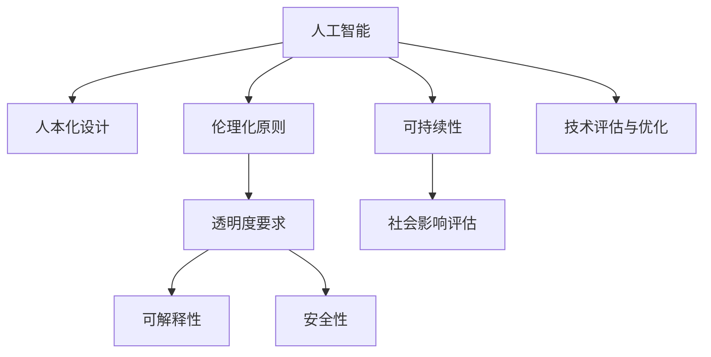

                 

## 1. 背景介绍

### 1.1 问题由来

随着人工智能技术的迅猛发展，人类社会的诸多领域正在经历前所未有的变革。从智能制造、智慧医疗到金融科技，人工智能正成为推动社会进步的关键力量。然而，技术的快速发展也伴随着一系列新的问题和挑战。

如何确保人工智能技术的正面影响，避免技术滥用对社会带来负面效应，成为学界和业界亟需回答的问题。科技向善（Technology for Good）的理念应运而生，旨在引导人工智能技术的开发和应用，向着更加人性化、伦理化和可持续化的方向前进。

### 1.2 问题核心关键点

科技向善的核心在于如何在技术开发和应用过程中，平衡创新和伦理，将技术对社会进步的贡献最大化，同时最大限度地降低其潜在风险。核心关键点包括：

- 人本化：确保技术开发和应用始终围绕人的需求和利益展开。
- 伦理化：在技术应用中遵循伦理规范，避免歧视、偏见和滥用。
- 可持续性：推动技术在资源节约、环境保护、社会包容等方面的积极作用。
- 透明度：确保技术决策过程的透明，便于公众监督和理解。
- 可解释性：赋予技术足够的解释性，让使用者对其行为和结果有清晰的认知。
- 安全性：保障技术应用的安全性，避免对个人和社会的威胁。

本文旨在探讨如何利用人工智能技术，通过人类计算（Human Computation）促进社会进步，探讨科技向善的具体实现路径。

## 2. 核心概念与联系

### 2.1 核心概念概述

为深入理解科技向善的实现路径，本节将介绍几个关键概念：

- **人工智能（AI）**：通过模拟人类的智能行为，使机器具备学习、推理和决策能力的技术。AI技术包括机器学习、深度学习、自然语言处理等诸多领域。
- **人本化（Human-Centered Design）**：以人的需求、感受和价值为中心进行产品设计和决策，确保技术服务于人的目标。
- **伦理化（Ethics in Technology）**：在技术应用过程中，遵循公平、透明、隐私保护等伦理原则，避免技术滥用。
- **可持续性（Sustainability）**：在技术开发和应用过程中，考虑到环境保护、资源利用、社会包容等因素，推动技术发展与自然和谐共存。
- **透明度（Transparency）**：确保技术决策过程的可解释和可理解，便于公众监督和信任。
- **可解释性（Explainability）**：赋予技术足够的解释性，让使用者能够理解技术的行为和结果，增强技术的可信度。
- **安全性（Security）**：保障技术应用的安全性，防止技术被恶意利用。

这些概念之间相互关联，共同构成了科技向善的核心框架。通过理解这些概念的原理和架构，我们可以更好地把握科技向善的实施方法和挑战。

### 2.2 核心概念原理和架构的 Mermaid 流程图



该流程图展示了人工智能技术如何通过人本化设计、伦理化原则、透明度要求、可解释性、安全性以及可持续性等多个维度，共同促进社会进步的路径。

## 3. 核心算法原理 & 具体操作步骤

### 3.1 算法原理概述

利用人类计算促进社会进步的算法原理，主要基于以下几个方面：

1. **数据驱动的决策优化**：通过收集和分析大量数据，利用机器学习算法，优化决策过程，提升社会服务效率和公平性。
2. **智能辅助的社会参与**：利用AI技术，辅助公众参与社会治理和决策过程，增强公共事务的透明度和民主性。
3. **信息不对称的缓解**：通过智能推荐系统，优化信息传播和获取过程，减少社会信息不对称，促进资源共享。
4. **社会行为的预测与引导**：利用AI技术预测社会行为，引导积极行为，预防和应对社会问题。
5. **资源优化与环境保护**：通过智能算法优化资源利用，减少浪费，同时监测和改善环境质量，推动绿色发展。

这些算法原理的实现，需要依托于大数据技术、机器学习、自然语言处理等AI子领域，以及人类计算的理论基础。

### 3.2 算法步骤详解

基于上述原理，具体的算法步骤包括：

1. **数据收集与预处理**：收集与问题相关的数据，进行清洗、标注和预处理，确保数据的质量和代表性。
2. **模型训练与评估**：使用收集到的数据，训练机器学习模型，并对其性能进行评估，选择最优模型。
3. **模型应用与迭代优化**：将训练好的模型应用于实际问题，根据反馈结果进行迭代优化，提升模型效果。
4. **算法推广与应用部署**：将优化后的模型推广至更大的范围，并部署到实际应用环境中，持续监测和调整。

### 3.3 算法优缺点

利用人类计算促进社会进步的算法具有以下优点：

1. **高效性**：通过大规模数据驱动的优化，能够在短时间内解决复杂问题，提升决策效率。
2. **公平性**：基于数据的决策可以避免人为偏见，提高决策的公平性和透明度。
3. **可持续性**：通过智能算法优化资源利用，减少浪费，推动绿色发展，促进社会可持续发展。
4. **可解释性**：模型训练和决策过程的可解释性，便于公众理解和监督。

同时，该算法也存在一些局限性：

1. **数据依赖**：算法的效果高度依赖于数据的质量和代表性，数据偏差可能导致模型结果的不公正。
2. **隐私风险**：大规模数据处理可能带来隐私泄露的风险，需要严格的数据保护措施。
3. **技术门槛**：AI技术的复杂性要求技术团队具备较高技术水平，增加了实施成本。
4. **伦理挑战**：算法在决策过程中可能会面临伦理困境，如决策的公正性、隐私保护等。

### 3.4 算法应用领域

利用人类计算促进社会进步的算法，可以在多个领域得到应用，包括但不限于：

1. **医疗健康**：通过智能推荐系统，优化医疗资源配置，提供个性化诊疗建议，提高医疗服务质量。
2. **教育培训**：利用AI技术，实现智能辅助教学、个性化学习路径推荐，提升教育效果和效率。
3. **环境保护**：通过智能算法优化资源利用，减少环境污染，监测和改善环境质量。
4. **社会治理**：利用AI技术辅助公共事务管理，提高决策透明度和公众参与度。
5. **应急响应**：通过预测和分析技术，优化应急资源配置，提高应对自然灾害和社会突发事件的能力。

## 4. 数学模型和公式 & 详细讲解 & 举例说明

### 4.1 数学模型构建

本节将使用数学语言对利用人类计算促进社会进步的算法过程进行严格刻画。

设社会问题为 $P$，相关数据集为 $D=\{(x_i, y_i)\}_{i=1}^N$，其中 $x_i$ 为特征向量，$y_i$ 为标签。利用机器学习算法训练模型 $f(x)$，最小化损失函数 $L(f)$：

$$
f^* = \mathop{\arg\min}_{f} L(f) = \mathop{\arg\min}_{f} \frac{1}{N}\sum_{i=1}^N \ell(f(x_i), y_i)
$$

其中 $\ell$ 为损失函数，如均方误差、交叉熵等。

### 4.2 公式推导过程

以线性回归为例，推导模型的训练和预测过程。

设模型为 $f(x) = \theta^T x + b$，其中 $\theta$ 为模型参数，$b$ 为偏置。最小化均方误差损失：

$$
L(f) = \frac{1}{N}\sum_{i=1}^N (y_i - f(x_i))^2
$$

求导并设置梯度为0，得到：

$$
\frac{\partial L(f)}{\partial \theta} = -2\frac{1}{N}\sum_{i=1}^N (y_i - f(x_i))x_i
$$

令 $\frac{\partial L(f)}{\partial \theta} = 0$，解得：

$$
\theta = (\frac{1}{N}\sum_{i=1}^N x_i x_i^T)^{-1} \sum_{i=1}^N y_i x_i
$$

代入 $x_i$ 和 $y_i$ 的数据样本，得到参数 $\theta$ 的最终解。

### 4.3 案例分析与讲解

以智能推荐系统为例，展示如何利用机器学习算法优化资源配置，提升社会服务效率。

设推荐系统需要对 $N$ 个用户 $U$ 推荐 $M$ 种产品 $P$，用户对产品的评分矩阵为 $R$。目标是最小化用户未被推荐产品的评分：

$$
L = \min_{R} \sum_{i=1}^N \sum_{j=1}^M (R_{ij} - f(x_i))^2
$$

其中 $f(x_i)$ 为预测用户对产品的评分，$x_i$ 为用户特征向量。通过优化损失函数，训练推荐模型 $f(x)$，实现个性化推荐。

## 5. 项目实践：代码实例和详细解释说明

### 5.1 开发环境搭建

在进行项目实践前，需要先准备好开发环境。以下是使用Python进行Scikit-learn开发的完整环境配置流程：

1. 安装Anaconda：从官网下载并安装Anaconda，用于创建独立的Python环境。

2. 创建并激活虚拟环境：
```bash
conda create -n sklearn-env python=3.8 
conda activate sklearn-env
```

3. 安装Scikit-learn：
```bash
conda install scikit-learn
```

4. 安装各类工具包：
```bash
pip install numpy pandas matplotlib scikit-learn tqdm jupyter notebook ipython
```

完成上述步骤后，即可在`sklearn-env`环境中开始项目实践。

### 5.2 源代码详细实现

以下是一个简单的线性回归项目，展示了机器学习算法的实现过程。

```python
import numpy as np
from sklearn.linear_model import LinearRegression

# 生成随机数据
x = np.random.randn(100, 1)
y = x * 2 + np.random.randn(100, 1)

# 训练模型
model = LinearRegression()
model.fit(x, y)

# 预测新数据
new_data = np.array([[1], [2], [3]])
predictions = model.predict(new_data)

# 输出结果
print("模型参数:", model.coef_)
print("预测结果:", predictions)
```

### 5.3 代码解读与分析

让我们再详细解读一下关键代码的实现细节：

**数据生成**：
- `np.random.randn(100, 1)`：生成100个样本，每个样本1维，均值为0，标准差为1。
- `x * 2 + np.random.randn(100, 1)`：生成目标变量 $y$，其值基于输入特征 $x$，并加入随机噪声。

**模型训练**：
- `LinearRegression()`：创建线性回归模型对象。
- `model.fit(x, y)`：训练模型，输入特征 $x$ 和目标变量 $y$。

**模型预测**：
- `model.predict(new_data)`：使用训练好的模型，对新数据进行预测。

**输出结果**：
- `print(model.coef_)`：输出模型参数。
- `print(predictions)`：输出预测结果。

可以看到，利用Scikit-learn库，进行线性回归模型的训练和预测过程非常简单。开发者只需关注模型设计和特征处理等高层次逻辑，Scikit-learn会自动完成底层细节的实现。

## 6. 实际应用场景

### 6.1 智能推荐系统

智能推荐系统广泛应用于电商、视频、音乐等多个领域，通过分析用户行为数据，为用户推荐感兴趣的产品。通过机器学习算法，可以实现个性化推荐，提升用户体验和满意度。

具体实现上，可以收集用户的历史浏览、点击、购买等行为数据，训练推荐模型，预测用户对新产品的兴趣，生成推荐列表。模型可以进一步优化，引入时间因素、情感分析等技术，提升推荐效果。

### 6.2 医疗健康

在医疗健康领域，利用机器学习算法可以优化资源配置，提升诊疗效果。例如，通过分析患者的历史诊疗数据，预测疾病风险，提供个性化诊疗建议，优化药物配方，减少误诊率。

具体实现上，可以收集患者的历史诊疗数据，包括病历、实验室检查结果等，使用机器学习算法进行疾病预测和诊断，优化医疗资源配置。模型可以引入深度学习技术，如卷积神经网络（CNN）、循环神经网络（RNN）等，提升模型效果。

### 6.3 环境保护

环境保护领域，利用机器学习算法可以优化资源利用，监测环境质量。例如，通过分析环境监测数据，预测污染趋势，优化垃圾处理方案，提升环境治理效率。

具体实现上，可以收集环境监测数据，包括气象、水质、空气质量等，使用机器学习算法进行污染预测，优化垃圾处理方案。模型可以引入时序分析、地理信息等技术，提升预测准确度。

### 6.4 未来应用展望

随着机器学习算法的不断发展，基于人类计算的社会进步应用将进一步拓展，涵盖更多领域。

在智慧城市建设中，利用机器学习算法优化交通管理、智能安防、能源调度等，提升城市治理水平。

在金融科技领域，利用机器学习算法进行信用评估、风险预测、智能投顾等，提升金融服务效率和安全性。

在教育领域，利用机器学习算法实现个性化学习路径推荐、智能辅助教学，提升教育效果和公平性。

以上应用场景展示了大规模数据驱动的社会进步潜力，未来将有更多领域迎来AI技术的赋能。

## 7. 工具和资源推荐

### 7.1 学习资源推荐

为了帮助开发者系统掌握利用人类计算促进社会进步的理论基础和实践技巧，这里推荐一些优质的学习资源：

1. **《机器学习》**：由Tom Mitchell撰写，是机器学习领域的经典教材，涵盖机器学习算法、数据处理、模型评估等内容。
2. **《深度学习》**：由Ian Goodfellow、Yoshua Bengio、Aaron Courville合著，介绍了深度学习算法及其应用，适合深入学习。
3. **Coursera《机器学习》课程**：由斯坦福大学Andrew Ng教授主讲，覆盖机器学习的基础理论和实战技巧。
4. **Kaggle**：提供大量机器学习竞赛和数据集，帮助开发者实践和提升技能。
5. **GitHub**：存储了大量机器学习项目的代码和文档，适合查阅和学习。

通过对这些资源的学习实践，相信你一定能够快速掌握利用人类计算促进社会进步的精髓，并用于解决实际的AI问题。

### 7.2 开发工具推荐

高效的开发离不开优秀的工具支持。以下是几款用于机器学习算法开发的常用工具：

1. **Python**：开源的脚本语言，有丰富的科学计算和数据处理库。
2. **Scikit-learn**：基于Python的机器学习库，提供了多种常用算法和工具。
3. **TensorFlow**：由Google主导开发的深度学习框架，支持大规模分布式训练。
4. **PyTorch**：由Facebook开发的深度学习框架，支持动态计算图，易于开发。
5. **Jupyter Notebook**：支持在网页上编写和执行代码，便于协作开发和分享。

合理利用这些工具，可以显著提升机器学习算法开发的效率，加快创新迭代的步伐。

### 7.3 相关论文推荐

机器学习算法的发展源于学界的持续研究。以下是几篇奠基性的相关论文，推荐阅读：

1. **《梯度下降算法》**：由Walter Robson、Herbert Robson、Gertrude B. Robinson合著，介绍了梯度下降算法的原理和应用。
2. **《支持向量机》**：由Corinna Cortes、Vapnik合著，介绍了支持向量机算法及其优化方法。
3. **《神经网络》**：由Geoffrey Hinton、Ronald Williams、Yoshua Bengio合著，介绍了神经网络的原理和应用。
4. **《深度学习》**：由Ian Goodfellow、Yoshua Bengio、Aaron Courville合著，全面介绍了深度学习算法及其应用。
5. **《自然语言处理》**：由Stanford大学自然语言处理组撰写，介绍了NLP技术的最新进展。

这些论文代表了大规模数据驱动的社会进步应用的发展脉络。通过学习这些前沿成果，可以帮助研究者把握学科前进方向，激发更多的创新灵感。

## 8. 总结：未来发展趋势与挑战

### 8.1 总结

本文对利用人类计算促进社会进步的算法进行了全面系统的介绍。首先阐述了科技向善的理念和核心关键点，明确了科技向善在技术开发和应用过程中的指导原则。其次，从原理到实践，详细讲解了机器学习算法的构建和应用步骤，给出了机器学习项目开发的完整代码实例。同时，本文还广泛探讨了机器学习算法在多个领域的实际应用，展示了科技向善的巨大潜力。此外，本文精选了机器学习算法的各类学习资源，力求为读者提供全方位的技术指引。

通过本文的系统梳理，可以看到，利用人类计算促进社会进步的算法正在成为AI技术的重要方向，极大地拓展了机器学习算法的应用边界，推动了社会的全面进步。未来，伴随机器学习算法的不断演进，相信在各个领域都能迎来新的突破，为构建公平、可持续、智能化的未来社会提供更多可能性。

### 8.2 未来发展趋势

展望未来，机器学习算法的应用将呈现以下几个发展趋势：

1. **多模态融合**：随着技术的发展，未来的算法将更多地融合多模态数据，如文本、图像、声音等，提升信息处理的全面性和准确性。
2. **边缘计算**：通过在边缘设备上运行机器学习算法，实现实时数据处理和决策，提升响应速度和安全性。
3. **自动化部署**：通过自动化工具和平台，简化机器学习模型的部署和维护，降低技术门槛。
4. **可持续计算**：利用低功耗计算设备，优化资源利用，提升机器学习算法的能效比。
5. **隐私保护**：通过联邦学习、差分隐私等技术，保护数据隐私，确保数据安全。

这些趋势展示了机器学习算法的未来发展方向，将为社会进步带来新的机遇和挑战。

### 8.3 面临的挑战

尽管机器学习算法在各个领域取得了显著成效，但在迈向更加智能化、普适化应用的过程中，仍面临诸多挑战：

1. **数据质量与标注**：数据质量和标注的准确性直接影响算法的性能，数据偏差和标注错误可能导致模型的不公正和误导性。
2. **模型复杂性与解释性**：复杂模型虽然在性能上有所提升，但难以解释，增加了模型部署和维护的难度。
3. **算法公平性与偏见**：机器学习模型可能继承输入数据的偏见，导致算法的不公平性，需要引入更多公平性指标和优化策略。
4. **隐私与安全**：数据隐私保护和算法安全性问题始终存在，需要加强数据保护和模型监控。
5. **资源与成本**：机器学习模型的开发和部署需要大量资源，包括计算、存储、人力等，如何降低成本是未来的重要方向。

这些挑战凸显了机器学习算法在应用过程中需要关注的诸多维度，需要在技术、伦理和社会等多方面协同努力，才能实现其最大的社会价值。

### 8.4 研究展望

面对机器学习算法所面临的种种挑战，未来的研究需要在以下几个方面寻求新的突破：

1. **无监督与半监督学习**：摆脱对大量标注数据的依赖，利用无监督和半监督学习方法，提升数据利用效率。
2. **可解释性与透明性**：赋予机器学习模型足够的可解释性，增强模型决策的透明性和可信度。
3. **公平性与偏见控制**：开发公平性指标和偏见控制方法，确保机器学习模型的公正性。
4. **隐私与安全保护**：引入隐私保护和安全性技术，保障数据和算法的安全。
5. **跨领域应用推广**：推动机器学习算法在更多领域的应用，促进技术普惠化。

这些研究方向将引领机器学习算法的进一步发展，为构建公平、可持续、智能化的未来社会提供新的技术路径。

## 9. 附录：常见问题与解答

**Q1：机器学习算法是否适用于所有社会问题？**

A: 机器学习算法在许多社会问题上都能取得不错的效果，但并非所有问题都适合用机器学习解决。例如，在涉及伦理、道德和价值观的问题上，机器学习可能无法提供合适的解决方案。因此，在选择算法时，需要综合考虑问题本身的性质和机器学习算法的适用范围。

**Q2：机器学习算法如何处理数据偏见？**

A: 数据偏见是机器学习面临的一个重要问题，需要通过以下方法进行缓解：
1. 数据清洗：去除数据中的偏见部分，确保数据的代表性。
2. 算法优化：引入公平性指标，如统计平衡、机会平衡等，优化模型。
3. 模型解释：赋予模型足够的可解释性，便于发现和纠正偏见。
4. 多方参与：引入多方专家和用户反馈，共同优化算法。

**Q3：机器学习算法在实际应用中如何确保数据隐私？**

A: 数据隐私保护是机器学习应用中的重要问题，需要通过以下方法进行保障：
1. 数据匿名化：通过去除敏感信息，保护用户隐私。
2. 差分隐私：通过引入噪声，保护数据隐私的同时保障模型性能。
3. 联邦学习：在分布式设备上运行模型训练，保护数据隐私。
4. 加密计算：通过加密技术，保护数据在传输和存储过程中的安全。

**Q4：机器学习算法如何处理计算资源限制？**

A: 在计算资源有限的情况下，可以采用以下方法优化算法：
1. 模型压缩：通过剪枝、量化等方法，减少模型参数量。
2. 分布式计算：通过分布式算法和平台，提高计算效率。
3. 边缘计算：在本地设备上进行数据处理和决策，减少通信开销。
4. 低功耗设备：使用低功耗计算设备，提升算法的能效比。

**Q5：机器学习算法如何确保其社会影响力是正面的？**

A: 确保机器学习算法的社会影响力正面，需要从以下几个方面进行评估和控制：
1. 社会影响评估：通过问卷调查、实验分析等方法，评估算法对社会的影响。
2. 伦理规范：遵守伦理规范，避免算法滥用和误导性。
3. 多方监督：引入多方监督和反馈机制，及时发现和纠正算法问题。
4. 透明化决策：确保算法决策过程的透明，便于公众理解和监督。

这些方法可以帮助确保机器学习算法的社会影响力是正面的，提升算法的可接受度和可信度。

---

作者：禅与计算机程序设计艺术 / Zen and the Art of Computer Programming

