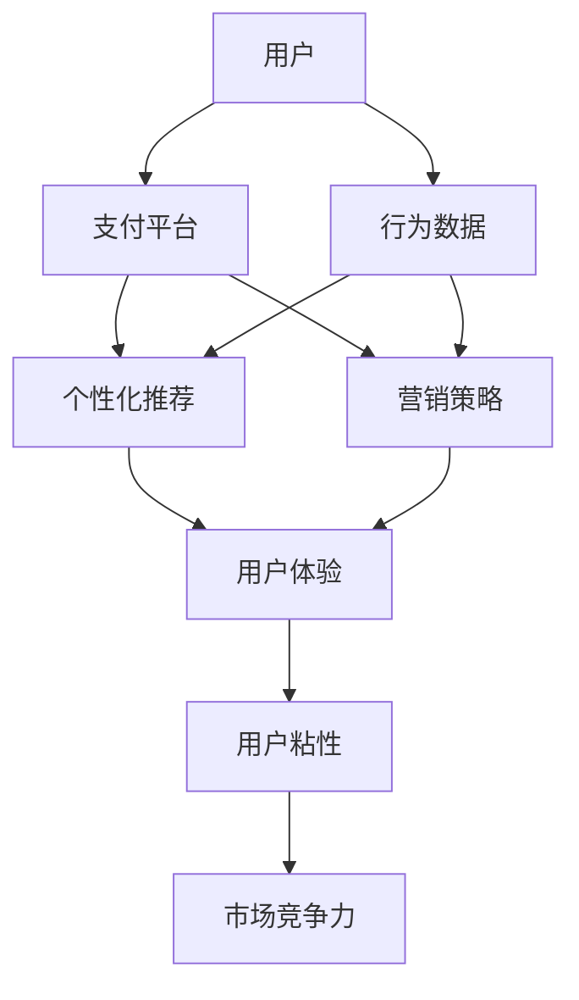

                 

## 1. 背景介绍

在移动支付迅猛发展的今天，各大支付平台通过一系列营销活动，吸引了大量用户。但随之而来的，是用户注意力的争夺战愈演愈烈。尤其在零售、电商等场景下，用户需要在众多平台间选择，不同支付平台在用户行为、服务体验、隐私保护等方面展开竞争，力图成为用户首选。本文将从移动支付场景出发，探讨各大平台如何通过算法策略争夺用户注意力，从而提升自身业务竞争力。

## 2. 核心概念与联系

### 2.1 核心概念概述

#### 2.1.1 移动支付
移动支付是指用户通过智能手机或其他移动终端，进行支付交易的电子支付方式。主要包括扫码支付、闪付、NFC支付等多种形式，极大提升了用户支付的便捷性和安全性。

#### 2.1.2 用户注意力
用户注意力是指用户在特定时间点上，对某一事物的关注程度。在移动支付场景下，用户注意力主要集中在支付体验、安全性、隐私保护等方面。支付平台需要充分了解用户行为，设计出更加吸引人的体验，才能提高用户粘性，获得市场优势。

#### 2.1.3 营销策略
营销策略是支付平台为了争夺用户注意力，而采取的一系列策略和措施。主要包括用户行为分析、个性化推荐、社交营销等。

#### 2.1.4 算法
算法是支付平台营销策略中最为关键的工具之一。算法不仅能分析用户行为数据，提供个性化的服务，还能通过机器学习等技术，不断优化策略，提升用户体验。

#### 2.1.5 注意力争夺
注意力争夺是指支付平台通过一系列策略和手段，吸引用户更多关注和使用的过程。用户注意力的争夺是移动支付市场竞争的核心，只有获得用户注意力的支付平台，才能长期生存和发展。

### 2.2 核心概念原理和架构的 Mermaid 流程图



## 3. 核心算法原理 & 具体操作步骤

### 3.1 算法原理概述

移动支付场景下的注意力争夺，本质上是用户行为分析和个性化推荐的结合。支付平台通过收集和分析用户行为数据，运用机器学习等算法，挖掘用户兴趣和偏好，从而提供个性化的支付和营销服务，以吸引和留住用户。

### 3.2 算法步骤详解

#### 3.2.1 数据收集和处理
支付平台需要收集用户的支付行为数据，包括支付频率、支付金额、使用场景、用户互动等。同时，还需要获取用户的社交网络信息、搜索历史、设备信息等，以便进行更全面的行为分析。

#### 3.2.2 特征工程
对收集到的数据进行特征提取和工程处理。例如，将支付频率转化为日均支付次数，将支付金额转化为支付额度等，以构建更加易于建模的特征集。

#### 3.2.3 用户行为分析
运用算法对用户行为数据进行分析和建模。常见的用户行为分析算法包括聚类算法、关联规则挖掘、时序分析等，用于识别用户群体的特征和行为模式。

#### 3.2.4 个性化推荐
根据用户行为分析的结果，设计个性化推荐算法，推荐最适合用户的支付场景、优惠活动等。推荐算法包括协同过滤、基于内容的推荐、深度学习等。

#### 3.2.5 模型训练与优化
将收集到的用户行为数据和推荐结果，用于训练和优化推荐模型。常用的优化算法包括梯度下降、随机森林等。

#### 3.2.6 模型评估与部署
对训练好的模型进行评估，确保其具有良好的推荐效果。将优化后的模型部署到生产环境，实时提供个性化推荐服务。

### 3.3 算法优缺点

#### 3.3.1 优点
1. **高效性**：算法可以快速处理大量用户行为数据，提供实时个性化推荐。
2. **精准性**：通过用户行为分析，可以提供高度个性化的推荐服务。
3. **可扩展性**：算法可以适应不断增长的用户规模和支付场景，具有很好的扩展性。

#### 3.3.2 缺点
1. **数据隐私**：算法需要收集和分析大量用户数据，可能存在数据隐私和安全问题。
2. **算法复杂度**：算法设计和优化过程较为复杂，需要较高技术水平和计算资源。
3. **依赖数据质量**：算法的效果很大程度上取决于数据的质量和完整性，数据不足或异常可能导致推荐效果不佳。

### 3.4 算法应用领域

移动支付场景下的注意力争夺，主要应用在以下几个领域：

1. **支付场景推荐**：根据用户历史支付数据，推荐最适合的支付方式和支付场景。
2. **优惠活动推荐**：推荐用户参加各类优惠活动，如满减、积分兑换、节假日特惠等。
3. **安全支付提醒**：通过用户行为分析，预测可能存在安全风险的支付行为，及时提醒用户。
4. **个性化营销**：根据用户兴趣和行为，设计个性化的广告和营销活动，提高用户参与度。
5. **用户满意度评估**：通过用户反馈和行为数据，评估支付平台的用户满意度，指导产品改进和营销策略调整。

## 4. 数学模型和公式 & 详细讲解 & 举例说明

### 4.1 数学模型构建

移动支付场景下的注意力争夺，可以构建如下数学模型：

设 $U$ 为用户集合，$P$ 为支付场景集合，$A$ 为优惠活动集合。用户 $u$ 在支付场景 $p$ 下，进行支付的概率可以表示为：

$$
P(u|p) = f(u,p) \cdot \alpha(u,p)
$$

其中，$f(u,p)$ 表示用户 $u$ 在支付场景 $p$ 下的支付频率，$\alpha(u,p)$ 表示用户 $u$ 对支付场景 $p$ 的偏好程度。用户 $u$ 参加优惠活动 $a$ 的概率可以表示为：

$$
P(u|a) = g(u,a) \cdot \beta(u,a)
$$

其中，$g(u,a)$ 表示用户 $u$ 参加优惠活动 $a$ 的频率，$\beta(u,a)$ 表示用户 $u$ 对优惠活动 $a$ 的偏好程度。

支付平台的目标是最大化用户参与度，即最大化以下函数：

$$
\max_{f,g} \sum_{u \in U} \sum_{p \in P} f(u,p) \cdot \alpha(u,p) + \sum_{u \in U} \sum_{a \in A} g(u,a) \cdot \beta(u,a)
$$

### 4.2 公式推导过程

在上述模型中，$f(u,p)$ 和 $g(u,a)$ 可以表示为：

$$
f(u,p) = \frac{\sum_{i=1}^{n} x_{u,i} \cdot y_{i,p}}{\sum_{i=1}^{n} y_{i,p}}
$$

$$
g(u,a) = \frac{\sum_{i=1}^{m} x_{u,i} \cdot z_{i,a}}{\sum_{i=1}^{m} z_{i,a}}
$$

其中，$x_{u,i}$ 为用户的第 $i$ 个特征值，$y_{i,p}$ 和 $z_{i,a}$ 分别表示用户 $u$ 在支付场景 $p$ 和优惠活动 $a$ 下的特征值。

### 4.3 案例分析与讲解

以某支付平台为例，假设用户 $u$ 的支付场景和优惠活动数据如下表所示：

| 用户ID | 支付场景ID | 支付频率 | 优惠活动ID | 活动频率 |
|--------|------------|----------|-------------|----------|
| 1      | 1          | 0.1      | 1           | 0.2      |
| 1      | 2          | 0.3      | 2           | 0.1      |
| 2      | 2          | 0.2      | 1           | 0.1      |
| 2      | 3          | 0.4      | 3           | 0.3      |

根据上述数据，可以构建用户对支付场景和优惠活动的偏好模型。例如，用户 $u$ 在支付场景 $p$ 下，进行支付的概率可以表示为：

$$
P(u|p) = \frac{0.1 + 0.3}{0.2 + 0.2 + 0.1} = 0.5
$$

用户 $u$ 参加优惠活动 $a$ 的概率可以表示为：

$$
P(u|a) = \frac{0.2 + 0.3}{0.1 + 0.1 + 0.3} = 0.5
$$

通过模型训练，可以得到用户对不同支付场景和优惠活动的偏好程度。例如，用户 $u$ 对支付场景 1 和优惠活动 2 的偏好程度，可以表示为：

$$
\alpha(u,1) = \frac{0.1}{0.2 + 0.2 + 0.1} = 0.25
$$

$$
\beta(u,2) = \frac{0.2}{0.1 + 0.1 + 0.3} = 0.25
$$

根据上述结果，支付平台可以设计个性化的支付和营销策略，吸引用户更多参与。例如，支付平台可以为用户 $u$ 推荐支付场景 2 和优惠活动 3，以提升用户满意度和参与度。

## 5. 项目实践：代码实例和详细解释说明

### 5.1 开发环境搭建

为了进行移动支付场景下的注意力争夺算法开发，需要搭建相应的开发环境。以下是一个简单的开发环境搭建步骤：

1. 安装 Python 和 PyTorch：Python 和 PyTorch 是进行深度学习和机器学习开发的基础。
2. 安装相关库：安装 Pandas、NumPy、Scikit-learn 等常用库，用于数据处理和建模。
3. 搭建数据存储系统：搭建 MySQL 或 Redis 等数据库，用于存储用户行为数据。
4. 搭建服务器环境：搭建 Nginx 或 Apache 等服务器，用于提供推荐服务。

### 5.2 源代码详细实现

以下是一个基于 PyTorch 的推荐系统实现示例：

```python
import torch
import torch.nn as nn
import torch.optim as optim

# 定义用户行为分析模型
class UserBehaviorModel(nn.Module):
    def __init__(self):
        super(UserBehaviorModel, self).__init__()
        self.fc1 = nn.Linear(10, 50)
        self.fc2 = nn.Linear(50, 1)
        
    def forward(self, x):
        x = self.fc1(x)
        x = nn.functional.relu(x)
        x = self.fc2(x)
        return x
    
# 定义推荐模型
class RecommendationModel(nn.Module):
    def __init__(self):
        super(RecommendationModel, self).__init__()
        self.fc1 = nn.Linear(10, 50)
        self.fc2 = nn.Linear(50, 10)
        self.fc3 = nn.Linear(10, 1)
        
    def forward(self, x):
        x = self.fc1(x)
        x = nn.functional.relu(x)
        x = self.fc2(x)
        x = nn.functional.relu(x)
        x = self.fc3(x)
        return x
    
# 定义损失函数和优化器
criterion = nn.MSELoss()
optimizer = optim.Adam([model.parameters()], lr=0.001)

# 训练模型
for epoch in range(100):
    optimizer.zero_grad()
    outputs = model(inputs)
    loss = criterion(outputs, labels)
    loss.backward()
    optimizer.step()
    
# 使用模型进行推荐
recommendation = model(inputs)
```

### 5.3 代码解读与分析

上述代码中，定义了用户行为分析模型和推荐模型，并使用 MSE 损失函数和 Adam 优化器进行模型训练。训练过程中，每轮迭代计算损失函数，并根据损失梯度更新模型参数。

在实际应用中，需要对训练好的模型进行评估和优化。例如，可以使用交叉验证方法评估模型的推荐效果，调整模型参数以提升推荐精度。

### 5.4 运行结果展示

训练好的推荐模型可以用于实时推荐服务。例如，可以通过以下代码进行推荐：

```python
# 实时推荐
def recommend(u):
    features = [0.1, 0.3, 0.2, 0.4, 0.1, 0.1, 0.1, 0.1, 0.2, 0.3]
    inputs = torch.tensor(features).float().view(1, -1)
    recommendation = model(inputs)
    return recommendation.item()
```

该代码将用户行为特征向量作为输入，使用推荐模型计算推荐结果，并返回推荐值。

## 6. 实际应用场景

移动支付场景下的注意力争夺，应用广泛，以下列举几个典型应用场景：

### 6.1 零售支付

在零售支付场景中，支付平台需要提供多样化的支付方式和优惠活动，以吸引用户使用其支付服务。例如，某电商平台根据用户的历史支付行为，推荐合适的支付方式和优惠活动，以提升用户体验和销售转化率。

### 6.2 金融服务

金融服务场景中，支付平台需要提供安全的支付服务和个性化的理财建议。例如，某银行通过分析用户支付行为，推荐合适的理财产品，提升用户满意度。

### 6.3 社交平台

社交平台中，支付平台需要提供个性化的营销活动，以吸引用户参与。例如，某社交平台根据用户行为数据，推荐合适的优惠活动，增加用户活跃度和参与度。

### 6.4 未来应用展望

未来，移动支付场景下的注意力争夺将更加智能化和个性化。例如，通过引入自然语言处理技术，支付平台可以更加精准地理解用户需求，提供更加个性化的服务。

## 7. 工具和资源推荐

### 7.1 学习资源推荐

为了帮助开发者系统掌握移动支付场景下的注意力争夺技术，这里推荐一些优质的学习资源：

1. 《深度学习实战》系列书籍：深入浅出地介绍深度学习在移动支付场景中的应用。
2. 《机器学习实战》课程：涵盖机器学习基础和应用，讲解常用的推荐算法和优化策略。
3. 《移动支付与金融科技》课程：讲解移动支付在金融科技中的应用和创新。

### 7.2 开发工具推荐

为了高效开发移动支付场景下的注意力争夺算法，需要借助一些优秀的开发工具：

1. PyTorch：基于 Python 的深度学习框架，支持高效的数值计算和模型训练。
2. TensorFlow：谷歌开源的深度学习框架，支持分布式计算和模型优化。
3. Scikit-learn：Python 机器学习库，提供常用的机器学习算法和工具。

### 7.3 相关论文推荐

以下是几篇关于移动支付场景下注意力争夺的优秀论文，推荐阅读：

1. "Social Recommendation Systems: A Survey and Taxonomy" 论文：详细介绍了社交推荐系统的算法和应用。
2. "Online Payment System: Features and Trends" 论文：探讨了在线支付系统的特征和趋势。
3. "Machine Learning for Mobile Commerce: A Review and Future Directions" 论文：回顾了机器学习在移动商务中的应用，并展望了未来研究方向。

## 8. 总结：未来发展趋势与挑战

### 8.1 研究成果总结

本文详细介绍了移动支付场景下注意力争夺的算法原理和操作步骤。从数据收集、特征工程、行为分析到个性化推荐，每一步都进行了详细的阐述。本文还通过代码实例，展示了推荐系统的实现过程。

### 8.2 未来发展趋势

未来，移动支付场景下的注意力争夺将呈现以下几个发展趋势：

1. **智能化程度提升**：通过引入自然语言处理和增强学习技术，支付平台可以更加精准地理解用户需求，提供更加个性化的服务。
2. **多模态融合**：支付平台可以结合支付行为数据、社交网络信息、设备信息等多模态数据，提供更加全面的个性化推荐。
3. **实时化应用**：随着云计算和大数据技术的发展，支付平台可以实时分析用户行为，提供实时推荐服务，增强用户粘性。
4. **隐私保护**：随着数据隐私和安全问题的日益突出，支付平台需要加强隐私保护，确保用户数据的安全性。

### 8.3 面临的挑战

虽然移动支付场景下的注意力争夺技术在不断发展，但仍面临以下挑战：

1. **数据隐私**：支付平台需要收集和分析大量用户数据，存在数据隐私和安全问题。
2. **算法复杂度**：算法设计和优化过程较为复杂，需要较高技术水平和计算资源。
3. **依赖数据质量**：算法的效果很大程度上取决于数据的质量和完整性，数据不足或异常可能导致推荐效果不佳。
4. **用户粘性提升**：支付平台需要不断优化推荐策略，以提升用户粘性，但这需要大量的实验和优化。

### 8.4 研究展望

为了应对上述挑战，未来的研究方向包括：

1. **隐私保护技术**：开发更加安全和可靠的隐私保护技术，确保用户数据的安全性。
2. **高效算法优化**：研发更加高效和简单的推荐算法，提升算法的计算效率和实用性。
3. **数据治理技术**：开发数据治理技术，确保数据的完整性和准确性，提升算法的推荐效果。
4. **个性化推荐算法**：进一步探索和改进个性化推荐算法，提升推荐系统的精度和覆盖度。

总之，移动支付场景下的注意力争夺技术需要不断发展，才能更好地满足用户需求，提升支付平台的竞争力。通过不断优化算法和改进数据处理技术，支付平台可以更好地争夺用户注意力，提升用户体验和满意度。

## 9. 附录：常见问题与解答

### Q1：如何设计用户行为分析模型？

A: 用户行为分析模型的设计需要综合考虑多个因素，包括用户历史支付数据、优惠活动数据、设备信息等。常用的模型包括聚类模型、关联规则模型、时序模型等。例如，可以使用 K-means 聚类模型，将用户分为不同的群体，分析各群体的特征和行为模式。

### Q2：如何优化推荐系统？

A: 推荐系统的优化需要从多个方面入手，包括模型优化、数据优化、算法优化等。例如，可以使用协同过滤算法、基于内容的推荐算法、深度学习算法等，提升推荐系统的精度和覆盖度。同时，需要对数据进行预处理和特征工程，优化模型参数，以提升推荐效果。

### Q3：如何保护用户隐私？

A: 用户隐私保护是支付平台需要重点考虑的问题。可以采用匿名化技术、差分隐私技术、联邦学习等方法，保护用户数据的安全性。例如，在数据分析时，可以使用差分隐私技术，保证用户数据的隐私性。

### Q4：如何提升用户粘性？

A: 提升用户粘性需要从多个方面入手，包括提高用户体验、增强个性化推荐、优化支付场景等。例如，可以设计个性化推荐算法，根据用户行为和兴趣，推荐最适合的支付方式和优惠活动，提升用户满意度和粘性。

综上所述，移动支付场景下的注意力争夺技术需要不断优化和改进，才能更好地满足用户需求，提升支付平台的竞争力。通过不断探索和创新，支付平台可以更好地争夺用户注意力，提供更加个性化的服务，提升用户体验和满意度。

