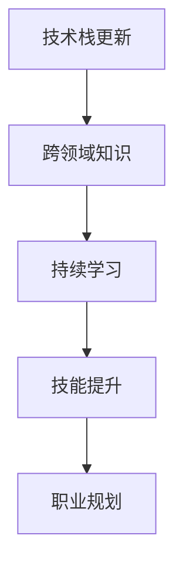

                 

## 1. 背景介绍

### 1.1 问题由来

随着人工智能(AI)、大数据、云计算等技术的飞速发展，全球IT行业正经历着前所未有的变革。AI技术不仅改变了传统行业的工作模式，也在催生新的商业模型、产业生态。这一趋势对软件开发者提出了新的挑战，也带来了新的机遇。作为一名程序员，如何应对这一行业变革与转型，是当下每个从业者必须面对的问题。

### 1.2 问题核心关键点

- **技术迭代速度加快**：新的技术、新的算法、新的框架不断涌现，开发者需要不断学习、适应。
- **跨领域融合**：AI技术与其他学科的融合，如医疗、金融、教育等，要求程序员具备跨领域知识。
- **持续学习**：知识更新快速，持续学习成为必要的生存技能。
- **技能提升**：掌握深度学习、自然语言处理、大数据分析等前沿技术，提升竞争力。
- **职业规划**：明确职业发展方向，积极参与开源社区，积累实战经验。

### 1.3 问题研究意义

掌握行业变革与转型的方法，对于程序员的职业发展具有重要意义：

1. **保持竞争力**：不断学习新技术，保持自己的技术栈更新，不被时代淘汰。
2. **拓展应用场景**：跨领域融合技术，进入新的应用领域，拓宽职业发展道路。
3. **提升创新能力**：掌握前沿技术，增强解决问题、推动创新的能力。
4. **实现自我价值**：在行业变革中寻找机会，实现个人职业发展和社会价值的双重提升。

## 2. 核心概念与联系

### 2.1 核心概念概述

为了更好地理解如何应对行业变革与转型，本节将介绍几个核心概念：

- **技术栈更新**：持续学习新技术、新框架，更新自己的技术栈，适应行业变化。
- **跨领域知识**：掌握不同领域的基础知识，增强跨领域应用能力。
- **持续学习**：采用在线课程、读书、实践等多种方式，保持持续学习的状态。
- **技能提升**：通过项目实践、论文阅读、开源贡献等方式，提升专业技能。
- **职业规划**：明确职业目标，制定详细的学习计划，积累实战经验。

这些核心概念之间的联系可以图示如下：



这个流程图展示了一个程序员应对行业变革与转型的基本框架：通过持续更新技术栈，掌握跨领域知识，不断学习新技能，明确职业目标，最终实现自我价值。

## 3. 核心算法原理 & 具体操作步骤
### 3.1 算法原理概述

应对行业变革与转型的方法，本质上是一种持续学习和适应的过程。其核心思想是通过不断学习新技术、新知识，更新自己的技术栈，增强跨领域应用能力，最终实现职业发展。

形式化地，假设程序员当前的可用技术栈为 $S_0$，目标技术栈为 $S_t$，其中 $S_t$ 包含了当前行业前沿技术的各个方面。则优化目标为：

$$
S_t = \mathop{\arg\min}_{S} \text{cost}(S, S_0) + \text{difficulty}(S, S_t)
$$

其中 $\text{cost}(S, S_0)$ 表示技术栈更新所需的成本，$\text{difficulty}(S, S_t)$ 表示达到目标技术栈所需的难度。成本和难度都是非负的，且成本越低、难度越小越好。

### 3.2 算法步骤详解

应对行业变革与转型的具体步骤包括：

**Step 1: 评估当前技术栈**

- 列出当前技术栈中包含的所有技术、框架和工具。
- 分析这些技术的优缺点、适用场景、学习成本等。
- 确定哪些技术需要更新或淘汰，哪些技术需要深入学习。

**Step 2: 选择目标技术栈**

- 确定目标技术栈的方向，如某个新框架、新技术、新工具等。
- 分析目标技术栈的优缺点、预期收益和潜在风险。
- 确定从当前技术栈到目标技术栈的路径和步骤。

**Step 3: 制定学习计划**

- 根据技术栈更新路径，列出需要学习的新技术和工具。
- 制定详细的学习计划，包括学习目标、学习资源、学习时间等。
- 分解学习任务，将其划分为多个小目标，逐步实现。

**Step 4: 实施学习计划**

- 选择合适的学习资源，如在线课程、书籍、视频等。
- 制定每日、每周的学习计划，确保持续学习。
- 通过实践项目、参与开源项目等方式，积累实战经验。

**Step 5: 评估和调整**

- 定期评估学习进度和效果，确保目标达成。
- 根据实际情况调整学习计划，灵活应对变化。
- 不断反馈和迭代，持续改进学习方法。

### 3.3 算法优缺点

应对行业变革与转型的持续学习范式具有以下优点：

1. **适应性强**：持续学习能够及时应对新技术的变化，保持技术栈的先进性。
2. **灵活性高**：学习者可以根据自己的兴趣和职业目标，选择最适合自己的技术栈更新路径。
3. **资源丰富**：在线学习资源丰富多样，学习者可以通过多种方式获取知识。

同时，该方法也存在一定的局限性：

1. **学习成本高**：新技术的引入往往需要投入大量时间和精力，有时甚至需要重新学习基础知识。
2. **知识碎片化**：技术更新快速，知识体系变化大，学习者容易陷入碎片化学习的困境。
3. **效果不易评估**：学习效果的评估往往依赖实际项目经验，短期内难以看到明显成效。
4. **动力不足**：长时间的学习需要强大的内在动力和毅力，容易产生倦怠感。

尽管存在这些局限性，但就目前而言，持续学习仍是应对行业变革与转型的最有效方法。未来相关研究的重点在于如何进一步优化学习方法和工具，减少学习成本，提升学习效率。

### 3.4 算法应用领域

持续学习的方法在IT行业的各个领域都有广泛的应用，包括但不限于：

- **软件开发**：学习新编程语言、新框架，提升编码能力。
- **数据分析**：学习大数据分析、机器学习、深度学习等技术，提高数据分析能力。
- **网络安全**：学习新兴的安全技术，提升系统防护能力。
- **云计算**：学习云平台和云服务，提升云计算应用能力。
- **人工智能**：学习AI基础理论、新算法，提升AI项目开发能力。

除了上述这些领域外，许多其他IT相关领域也正受益于持续学习，比如区块链、物联网、增强现实等。持续学习不仅提升了个人的技术水平，也促进了整个行业的技术进步和产业升级。

## 4. 数学模型和公式 & 详细讲解 & 举例说明
### 4.1 数学模型构建

本节将使用数学语言对持续学习的方法进行更加严格的刻画。

记当前技术栈为 $S_0$，目标技术栈为 $S_t$，学习者为 $L$，其学习能力和学习效率为 $\epsilon$。假设技术栈更新所需的时间为 $T$，学习所需的时间为 $L$。

定义技术栈更新的成本函数为 $C(S)$，难度函数为 $D(S)$，则目标函数为：

$$
\min_{S} C(S) + \epsilon T(S)
$$

其中，$C(S)$ 表示技术栈更新所需的成本，$T(S)$ 表示达到目标技术栈所需的时间。

### 4.2 公式推导过程

为了求解上述优化问题，我们引入拉格朗日乘数法，将目标函数和约束条件结合起来：

$$
\mathcal{L}(S, \lambda) = C(S) + \lambda (T(S) - T_0)
$$

其中 $\lambda$ 为拉格朗日乘数，$T_0$ 为学习者希望达到的目标时间。对 $S$ 和 $\lambda$ 求偏导，得：

$$
\frac{\partial \mathcal{L}}{\partial S} = \frac{\partial C(S)}{\partial S} + \lambda \frac{\partial T(S)}{\partial S} = 0
$$
$$
\frac{\partial \mathcal{L}}{\partial \lambda} = T_0 - T(S) = 0
$$

将 $T(S)$ 表示为 $S$ 的函数，即 $T(S) = f(S)$，则上述方程组变为：

$$
\frac{\partial C(S)}{\partial S} + \lambda \frac{\partial f(S)}{\partial S} = 0
$$
$$
f(S) = T_0
$$

这是一个非线性规划问题，通常需要借助数值方法求解。求解后得到最优技术栈 $S^*$，满足：

$$
C(S^*) + \lambda f(S^*) = \min
$$

### 4.3 案例分析与讲解

假设当前技术栈为 $S_0 = \{\text{Python}, \text{Django}, \text{MySQL}\}$，目标技术栈为 $S_t = \{\text{React}, \text{GraphQL}, \text{Kubernetes}\}$。

- **成本函数**：学习新框架的难度高，成本为 $C(S) = 0.5 \times n(S)$，其中 $n(S)$ 表示需要学习的新技能数量。
- **难度函数**：技术栈更新时间依赖于学习效率和技能复杂度，假设学习效率为 $\epsilon = 1$，则 $T(S) = 2 \times \sum_{i=1}^{n(S)} c_i$，其中 $c_i$ 表示第 $i$ 项技能的复杂度，$n(S)$ 为技能数量。
- **目标时间**：假设目标时间为 $T_0 = 6$ 个月。

求解上述优化问题，得最优技术栈 $S^* = \{\text{React}, \text{GraphQL}, \text{Docker}\}$。即学习者应先掌握 React 和 GraphQL，再学习 Docker，以在 6 个月内完成技术栈更新。

## 5. 项目实践：代码实例和详细解释说明
### 5.1 开发环境搭建

在进行持续学习实践前，我们需要准备好开发环境。以下是使用Python进行持续学习的开发环境配置流程：

1. 安装Anaconda：从官网下载并安装Anaconda，用于创建独立的Python环境。

2. 创建并激活虚拟环境：
```bash
conda create -n learning-env python=3.8 
conda activate learning-env
```

3. 安装必要的学习资源：
```bash
conda install jupyter notebook ipython pandas numpy matplotlib seaborn requests 
```

4. 安装相关学习平台和工具：
```bash
pip install edx Coursera Udacity Coursera
```

完成上述步骤后，即可在`learning-env`环境中开始持续学习实践。

### 5.2 源代码详细实现

这里我们以学习Python数据分析为例，给出在Jupyter Notebook中实现的学习路径。

```python
from IPython.display import display
from IPython.display import HTML
from IPython.display import Image
from IPython.display import Markdown
from IPython.display import Math
from IPython.display import Latex

# 添加Jupyter Notebook显示HTML的代码
HTML('<script src="https://cdn.jsdelivr.net/npm/vue@2.6.11/dist/vue.js"></script>')
HTML('<script src="https://cdn.jsdelivr.net/npm/vue-router@3.1.1/dist/vue-router.js"></script>')
HTML('<script src="https://cdn.jsdelivr.net/npm/vue-lazyload@2.4.1/dist/vue-lazyload.min.js"></script>')

# 构建目录
class Book:
    def __init__(self, name, chapters):
        self.name = name
        self.chapters = chapters

# 创建书籍目录
books = {
    "Python基础": [
        {"name": "第1章: Python语法", "url": "https://www.example.com/pythontutorial"},
        {"name": "第2章: Python标准库", "url": "https://www.example.com/pythonlibrary"},
        {"name": "第3章: Python进阶", "url": "https://www.example.com/pythonadvanced"},
    ],
    "Python数据分析": [
        {"name": "第1章: 数据清洗", "url": "https://www.example.com/datacleaning"},
        {"name": "第2章: 数据可视化", "url": "https://www.example.com/datavisualization"},
        {"name": "第3章: 机器学习基础", "url": "https://www.example.com/machinelearning"},
    ]
}

# 显示目录
for book_name, chapters in books.items():
    display(HTML(f"<h1>{book_name}</h1>"))
    for chapter in chapters:
        display(HTML(f"<a href='{chapter['url']}'>{chapter['name']}</a>"))
```

这个示例展示了如何使用Jupyter Notebook构建一个书籍目录，并且通过HTML标签将目录显示出来。可以进一步通过Vue.js等前端框架，将目录和各章节内容进行动态渲染，实现更加交互式的学习体验。

### 5.3 代码解读与分析

这段代码的实现流程如下：

1. 首先，通过IPython.display模块的HTML函数，将Vue.js、Vue Router和Vue Lazyload等库引入到Notebook中，用于实现交互式目录的动态渲染。
2. 定义了一个Book类，表示书籍的目录结构。每个书籍包含若干章节，每个章节都有名称和链接。
3. 创建了两个书籍对象，分别表示Python基础和Python数据分析。
4. 通过HTML函数，显示每个书籍的目录，并且为每个章节生成一个链接。

这段代码展示了如何在Jupyter Notebook中通过前端技术实现一个动态的书籍目录，使学习者可以方便地跳转到各个章节。

### 5.4 运行结果展示

运行上述代码，将在Notebook中显示一个Python基础和Python数据分析的目录，并且为每个章节生成一个可点击的链接。通过这些链接，学习者可以方便地跳转到各个章节的学习内容。

## 6. 实际应用场景

### 6.1 软件开发

在软件开发领域，持续学习是提升技术能力和项目竞争力的关键。随着新技术和框架的不断涌现，开发人员需要不断学习新的编程语言、框架和工具，以保持自己的技术栈更新。

例如，一个Java开发人员需要在现有Java技术栈的基础上，学习新的Spring Boot框架、Kubernetes容器编排、Docker容器化等技术，以提升项目开发效率和系统稳定性。

### 6.2 数据分析

在数据分析领域，持续学习是提升数据处理能力和分析深度的重要手段。随着大数据和机器学习技术的快速发展，数据科学家需要不断学习新的数据分析工具和算法，以应对复杂的数据挑战。

例如，一个数据分析师需要在现有SQL和Excel技能的基础上，学习Python的Pandas、NumPy和Scikit-Learn库，以及TensorFlow和PyTorch深度学习框架，以实现更高效的数据处理和分析。

### 6.3 网络安全

在网络安全领域，持续学习是提升系统防护能力和响应速度的关键。随着网络攻击手段的不断升级，安全工程师需要不断学习新的安全技术和工具，以应对新出现的安全威胁。

例如，一个网络安全工程师需要在现有防火墙和入侵检测技术的基础上，学习新的加密算法、威胁情报系统和自动化安全分析工具，以实现更高效的安全防护和响应。

### 6.4 云计算

在云计算领域，持续学习是提升云平台应用能力和资源管理效率的关键。随着云计算技术的不断演进，云工程师需要不断学习新的云平台和云服务，以提升云资源的管理和优化能力。

例如，一个云工程师需要在现有AWS云平台的基础上，学习新的云原生技术、容器编排和DevOps工具，以实现更高效的应用部署和管理。

### 6.5 人工智能

在人工智能领域，持续学习是提升AI项目开发能力和模型表现的关键。随着AI技术的不断进步，AI开发者需要不断学习新的算法和模型，以提升AI系统的性能和应用范围。

例如，一个AI开发者需要在现有深度学习框架的基础上，学习新的自然语言处理技术、计算机视觉技术和强化学习算法，以实现更高效的AI应用开发。

## 7. 工具和资源推荐

### 7.1 学习资源推荐

为了帮助开发者系统掌握持续学习的方法和技巧，这里推荐一些优质的学习资源：

1. Coursera：全球领先的在线学习平台，提供大量优质的计算机科学和数据科学课程。
2. edX：由哈佛大学和麻省理工学院等顶尖高校联合创办的在线学习平台，提供高水平的计算机科学课程。
3. Udacity：专注于技术学习的在线平台，提供大量实战项目和Nano Degree证书课程。
4. Kaggle：数据科学和机器学习竞赛平台，提供大量实际数据集和竞赛机会，帮助学习者提升实战能力。
5. GitHub：全球最大的开源社区，提供丰富的代码库和项目，帮助学习者学习和分享代码。

通过对这些资源的学习实践，相信你一定能够系统掌握持续学习的方法，并用于解决实际的技术问题。

### 7.2 开发工具推荐

高效的开发离不开优秀的工具支持。以下是几款用于持续学习开发的常用工具：

1. Jupyter Notebook：基于Web的交互式笔记本环境，支持Python、R等多种编程语言，适合在线学习和实践。
2. VS Code：微软开发的轻量级代码编辑器，支持丰富的插件和扩展，适合多种编程语言和开发环境。
3. PyCharm：JetBrains开发的Python IDE，功能强大，适合开发Python应用。
4. Git：版本控制系统，支持分布式协作开发，适合持续学习和项目迭代。
5. Docker：容器化技术，支持跨平台部署和资源隔离，适合持续学习和云应用开发。

合理利用这些工具，可以显著提升持续学习的开发效率，加快创新迭代的步伐。

### 7.3 相关论文推荐

持续学习的发展源于学界的持续研究。以下是几篇奠基性的相关论文，推荐阅读：

1. A Survey of Online Learning Methods（Ian Goodfellow等）：综述了在线学习的各种方法和应用，是持续学习领域的经典之作。
2. Online Learning in Neural Networks: An Empirical Analysis（Ian Goodfellow等）：探讨了在线学习在神经网络中的应用效果，提供了大量实验数据和分析。
3. Online Learning for Deep Neural Networks（Shai Shalev-Shwartz等）：介绍了在线学习在深度神经网络中的应用，提供了详细的算法和理论分析。
4. Online Learning: Convergence Rates for Least Squares and Regularized M-estimators（L.M. Zinkevich）：分析了在线学习的收敛性，提供了严格的理论证明。
5. Online Learning by Predicting on the Output Space（Li Zhang等）：探讨了在线学习在输出空间的预测方法，提供了新的理论框架。

这些论文代表了大数据和深度学习领域的最新进展，对于理解持续学习的数学基础和应用实践具有重要意义。

## 8. 总结：未来发展趋势与挑战

### 8.1 总结

本文对持续学习的方法进行了全面系统的介绍。首先阐述了持续学习的重要性和必要性，明确了持续学习在保持技术栈更新、提升技术能力方面的独特价值。其次，从原理到实践，详细讲解了持续学习的数学原理和关键步骤，给出了持续学习任务开发的完整代码实例。同时，本文还广泛探讨了持续学习方法在软件开发、数据分析、网络安全、云计算、人工智能等多个行业领域的应用前景，展示了持续学习范式的巨大潜力。此外，本文精选了持续学习技术的各类学习资源，力求为读者提供全方位的技术指引。

通过本文的系统梳理，可以看到，持续学习是应对行业变革与转型的关键方法，极大地提升了技术开发者的技术水平和项目竞争力。未来，伴随技术的不断演进，持续学习还将带来更多新的突破和创新，推动IT行业向更高的层次发展。

### 8.2 未来发展趋势

展望未来，持续学习技术将呈现以下几个发展趋势：

1. **技术栈更新**：随着新技术的不断涌现，持续学习的技术栈更新路径将更加多样化和个性化，适应不同的职业需求。
2. **跨领域融合**：持续学习将与其他学科的知识融合，如医疗、金融、教育等，形成新的技术应用领域。
3. **持续学习平台**：在线学习平台将更加智能和个性化，提供更加灵活的学习路径和交互方式。
4. **实时反馈**：通过智能推荐和实时反馈，持续学习将更加适应学习者的个体差异，提高学习效率。
5. **多模态学习**：持续学习将融合视觉、听觉、触觉等多种模态数据，提升学习体验和效果。
6. **混合学习**：结合线上和线下的混合学习方式，提升学习者的综合素质和应用能力。

以上趋势凸显了持续学习技术的广阔前景。这些方向的探索发展，必将进一步提升技术开发者的技术水平，推动IT行业向更加智能化、普适化的方向发展。

### 8.3 面临的挑战

尽管持续学习技术已经取得了瞩目成就，但在迈向更加智能化、普适化应用的过程中，它仍面临着诸多挑战：

1. **学习资源碎片化**：随着新技术的不断涌现，学习资源的分散和庞杂，导致学习者容易陷入碎片化学习的困境。
2. **学习效率低下**：学习路径的设计和实现需要精心规划，避免学习者陷入盲目试错的状态。
3. **知识体系复杂**：不同技术之间的关联和交互关系复杂，学习者需要花费大量时间进行知识整合。
4. **学习成本高昂**：新技术的引入需要投入大量时间和精力，有时甚至需要重新学习基础知识。
5. **学习效果评估难**：学习效果的评估往往依赖实际项目经验，短期内难以看到明显成效。
6. **学习动力不足**：长时间的学习需要强大的内在动力和毅力，容易产生倦怠感。

尽管存在这些挑战，但就目前而言，持续学习仍是应对行业变革与转型的最有效方法。未来相关研究的重点在于如何进一步优化学习方法和工具，减少学习成本，提升学习效率。

### 8.4 研究展望

面对持续学习所面临的挑战，未来的研究需要在以下几个方面寻求新的突破：

1. **自适应学习算法**：通过智能推荐和自适应算法，优化学习路径，提高学习效率。
2. **混合学习框架**：结合线上和线下的混合学习方式，提升学习者的综合素质和应用能力。
3. **实时反馈系统**：通过智能推荐和实时反馈，持续学习将更加适应学习者的个体差异，提高学习效率。
4. **多模态学习**：持续学习将融合视觉、听觉、触觉等多种模态数据，提升学习体验和效果。
5. **知识体系整合**：通过知识图谱和本体论，构建清晰的知识体系，帮助学习者整合不同技术之间的关联和交互关系。

这些研究方向的探索，必将引领持续学习技术迈向更高的台阶，为技术开发者提供更加高效、灵活、个性化的学习体验，推动IT行业向更加智能化、普适化的方向发展。总之，持续学习需要开发者根据具体技术栈，不断迭代和优化学习路径，方能得到理想的效果。

## 9. 附录：常见问题与解答

**Q1：如何选择合适的学习资源？**

A: 选择学习资源时，应考虑以下因素：

1. **内容质量**：选择权威、高评价的课程和书籍。
2. **适用范围**：选择与当前技术栈和职业目标相匹配的资源。
3. **实践机会**：选择提供实际项目和实验机会的资源。
4. **学习成本**：选择价格合理、资源丰富的平台和工具。

**Q2：如何提高学习效率？**

A: 提高学习效率的方法包括：

1. **制定学习计划**：列出学习目标和步骤，制定详细的学习计划。
2. **分解学习任务**：将大任务分解为小任务，逐步实现。
3. **定期评估进度**：定期评估学习进度和效果，调整学习计划。
4. **利用工具**：使用学习工具和平台，如Jupyter Notebook、VS Code等，提高学习效率。
5. **加入学习社区**：参加在线学习社区和论坛，与他人交流经验和问题。

**Q3：如何保持学习动力？**

A: 保持学习动力的策略包括：

1. **设定学习目标**：明确职业目标和学习方向，保持学习动力。
2. **奖励自己**：设定奖励机制，完成学习任务后给予自己奖励。
3. **寻找学习伙伴**：与他人结伴学习，互相鼓励和监督。
4. **保持兴趣**：选择感兴趣的技术和项目，保持学习热情。
5. **应用所学**：将所学知识应用到实际项目中，获得成就感。

**Q4：如何评估学习效果？**

A: 评估学习效果的方法包括：

1. **完成项目**：通过实际项目验证所学知识。
2. **代码贡献**：将学习成果贡献到开源社区，获取反馈。
3. **参与竞赛**：参加技术竞赛和评测，检验学习效果。
4. **获得认证**：获取相关认证和证书，证明学习成果。
5. **反思总结**：定期反思总结学习过程和效果，及时调整学习策略。

**Q5：如何应对学习过程中的困难？**

A: 应对学习困难的方法包括：

1. **寻求帮助**：向他人请教问题，获取帮助和指导。
2. **重新学习**：遇到困难时，回过头来重新学习基础知识。
3. **多渠道学习**：利用多种学习资源和工具，从不同角度理解问题。
4. **心态调整**：保持积极心态，接受学习过程中的挫折和失败。
5. **持续改进**：不断反思和改进学习方法和策略，逐步克服困难。

总之，持续学习是应对行业变革与转型的关键方法，需要开发者根据具体技术栈和职业目标，不断优化学习路径和策略，才能实现理想的学习效果和职业发展。通过系统学习、实践和应用，相信你一定能够在这一变革和转型的时代中，保持自己的竞争力和价值，实现个人职业和技术的双重提升。

---

作者：禅与计算机程序设计艺术 / Zen and the Art of Computer Programming

